# Commands for Mesh Generation

Let us begin with the two important keywords `:::freefem border` and `:::freefem buildmesh`.

All examples in this section come from the files `:::freefem mesh.edp` and `:::freefem tablefunction.edp`.

## Square

The command `:::freefem square` triangulates the unit square.
The following generates a 4*5 grid in the unit square $[0,1]^2$. The labels of the boundaries
are shown in Fig. 5.1.

```freefem
mesh Th = square(4,5);
```

|Fig 5.1: Boundary labels of the mesh by `:::freefem square(10,10)`|
|:----|
|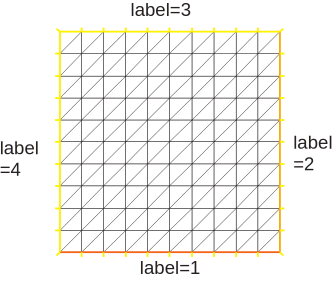|

To construct a $n\times m$ grid in the rectangle \index{rectangle} $[x_0,x_1]\times [y_0,y_1]$, proceeds as follows:

```freefem
real x0=1.2,x1=1.8;
real y0=0,y1=1;
int n=5,m=20;
mesh Th=square(n,m,[x0+(x1-x0)*x,y0+(y1-y0)*y]);

```

!!! note
	Adding the  named  parameter `flags=icase` with icase:

	0. will produce a mesh where all quads are split with diagonal $ x-y=cte$
	1. will produce Union Jack flag type of mesh.
	2. will produce a mesh where all quads are split with diagonal $ x+y=cte$ (v 3.8)
	3. same as case 1  except in two corners such that no triangle with 3 vertices on boundary (v 3.8)
	4. same as case 3  except in two corners such that no triangle with 3 vertices on boundary (v 3.8)

	````freefem
	mesh Th=square(n,m,[x0+(x1-x0)*x,y0+(y1-y0)*y],flags=icase);
	````

!!! note
	Adding the  named  parameter `:::freefem label=labs` will change the 4 default label numbers to `:::freefem labs[i-1]`, for example `:::freefem int[int] labs=[11,12,13,14]`, and adding the  named parameter `:::freefem region=10` will change  the region number  to $10$, for instance (v 3.8).

	To see all these flags at work,  try the file `examples++/square-mesh.edp` :

	```freefem
	for (int i=0;i<5;++i)
  	{
    	int[int] labs=[11,12,13,14];
    	mesh Th=square(3,3,flags=i,label=labs,region=10);
    	plot(Th,wait=1,cmm=" square flags = "+i );
  	}
	```

## Border

Boundaries are defined piecewise by parametrized curves.
The pieces can only intersect at their endpoints, but it is possible to
join more than two endpoints. This can be used to structure the mesh
if an area thouches a border and create new regions by dividing larger ones:

```freefem
int upper = 1;
int others = 2;
int inner = 3;

border C01(t=0,1){x = 0;         y = -1+t;        label = upper;}
border C02(t=0,1){x = 1.5-1.5*t; y = -1;          label = upper;}
border C03(t=0,1){x = 1.5;       y = -t;          label = upper;}
border C04(t=0,1){x = 1+0.5*t;   y = 0;           label = others;}
border C05(t=0,1){x = 0.5+0.5*t; y = 0;           label = others;}
border C06(t=0,1){x = 0.5*t;     y = 0;           label = others;}
border C11(t=0,1){x = 0.5;       y = -0.5*t;      label = inner;}
border C12(t=0,1){x = 0.5+0.5*t; y = -0.5;        label = inner;}
border C13(t=0,1){x = 1;         y = -0.5+0.5*t;  label = inner;}

int n = 10;
plot(C01(-n)+C02(-n)+C03(-n)+C04(-n)+C05(-n)+C06(-n)+
      C11(n)+C12(n)+C13(n), wait=true);

mesh Th = buildmesh(C01(-n)+C02(-n)+C03(-n)+C04(-n)+C05(-n)+C06(-n)+
      C11(n)+C12(n)+C13(n));

plot(Th, wait=true); // Fig. 5.3

cout << "Part 1 has region number " << Th(0.75, -0.25).region << endl;
cout << "Part 2 has redion number " << Th(0.25, -0.25).region << endl;
```

|Fig. 5.2: Multiple border ends intersect|Fig. 5.3: Generated mesh|
|:----:|:----:|
|||

Triangulation keywords assume that the domain is defined as being on the _left_ (resp right) of its oriented parameterized boundary

$$
\Gamma_j=\{(x,y)\left|\; x=\varphi_x(t),\, y=\varphi_y(t),\, a_j\le t\le b_j\right.\}
$$

To check the orientation plot $t\mapsto (\varphi_x(t),\varphi_y(t)),\, t_0\le t\le t_1$.
If it is as in Fig. 5.4, then the domain lies on the shaded area, otherwise it lies on the opposite side.

|Fig. 5.4: Orientation of the boundary defined by $(\phi_x(t),\phi_y(t))$|
|:----|
|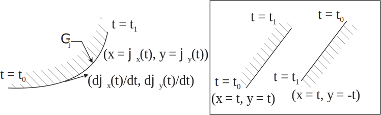|

The general expression to define a triangulation with `:::freefem buildmesh` is

```freefem
mesh Mesh_Name = buildmesh(Gamma1(m1)+...+GammaJ(mj),OptionalParameter);
```

where $m_j$ are positive or negative numbers to indicate how many vertices should be on $\Gamma_j,\,
\Gamma=\cup_{j=1}^J \Gamma_J$, and the optional parameter (separed with comma) can be

* `:::freefem nbvx=<int value>`,  to set the maximal number of  vertices in the mesh.
* `:::freefem fixedborder=<bool value>`, to say if the mesh generator can change the boundary mesh
or not (by default the boundary mesh can change; beware that with periodic boundary conditions
(see. \ref{periodic BC}), it can be dangerous.


The orientation of boundaries can be changed by changing the sign of $m_j$.
The following example shows how to change the orientation.
The example generates the unit disk with a small circular hole, and assign "1" to the unit disk ("2" to the circle inside).
The boundary label must be non-zero, but it can also be omitted.

```freefem
border a(t=0,2*pi){ x=cos(t); y=sin(t);label=1;}
border b(t=0,2*pi){ x=0.3+0.3*cos(t); y=0.3*sin(t);label=2;}
plot(a(50)+b(+30)); // To see a plot of the border mesh \index{plot!border}
mesh Thwithouthole= buildmesh(a(50)+b(+30));
mesh Thwithhole   = buildmesh(a(50)+b(-30));
plot(Thwithouthole,wait=1,ps="Thwithouthole.eps"); //fig. 5.5
plot(Thwithhole,wait=1,ps="Thwithhole.eps"); // fig. 5.6
```

!!! note
	Notice that the orientation is changed by `:::freefem b(-30)` in 5th line. In 7th line, `:::freefem ps="fileName"` is used to generate a postscript file with identification shown on the figure.

|Fig. 5.5: Mesh without hole |Fig. 5.6: Mesh with hole |
|:----:|:----:|
||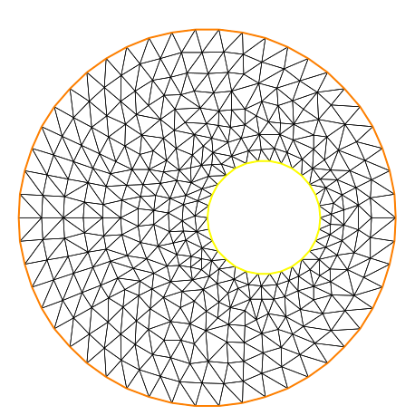|

!!! note
	Borders are evaluated only at the time `:::freefem plot` or `:::freefem buildmesh` is called so the global variable are defined at this time andhere since $r$ is changed between the two border calls the following code will not work because the first border will be computed with r=0.3:

	```freefem
	   real r=1;  border a(t=0,2*pi){ x=r*cos(t); y=r*sin(t);label=1;}
	   r=0.3;     border b(t=0,2*pi){ x=r*cos(t); y=r*sin(t);label=1;}
	   mesh Thwithhole = buildmesh(a(50)+b(-30)); // bug (a trap) because
	   // the two circle have the same radius = $0.3$
	```

## Multi-Border

Sometime it can be useful to make an array of border, but unfortunately it is incompatible with the FreeFem++ syntax.
So to bypass this problem, the idea is small, if the number of segment of the discretization $n$ is a array, we make  a implicit loop on all the value of the array, and
the index variable $i$ of the loop  is defined after  parameter definition, like in `:::freefem border a(t=0,2*pi;i)` ...

A first very small example:

```freefem
1: border a(t=0,2*pi;i){ x=(i+1)*cos(t); y=(i+1)*sin(t);label=1;}
2: int[int] nn=[10,20,30];
3: plot(a(nn)); // Plot 3 circles with 10,20,30 points ..
```

And  more complex exemple (taken from `:::freefem mesh.edp` example) to define a square with small circles:

```freefem
// multi border syntax version 3.30 avril 2014 ...
real[int] xx=[0,1,1,0],
          yy=[0,0,1,1];
// radius, centre of the 4 circles ..
real[int] RC=[ 0.1, 0.05, 0.05, 0.1],
          XC= [0.2,0.8,0.2,0.8],
          YC= [0.2,0.8,0.8,0.2];
int[int]  NC=[-10,-11,-12,13]; //list number of $\pm$ segments
// of the 4 circles borders  

border bb(t=0,1;i)
{
// i is the the index variable of the multi border loop
  int ii = (i+1)%4; real t1 = 1-t;
  x =  xx[i]*t1 + xx[ii]*t;
  y =  yy[i]*t1 + yy[ii]*t;
  label = 0; ;
}

border cc(t=0,2*pi;i)
{
  x = RC[i]*cos(t)+XC[i];
  y = RC[i]*sin(t)+YC[i];
  label = i+1;
}
int[int] nn=[4,4,5,7]; // 4 border, with 4,4,5,7 segment respectively .
plot(bb(nn),cc(NC),wait=1);
mesh th= buildmesh(bb(nn)+cc(NC)) ;
plot(th,wait=1);
```

## Data Structures and Read/Write Statements for a Mesh

Users who want to read a triangulation made elsewhere should see the structure
of the file generated below:

```freefem
border C(t=0,2*pi) { x=cos(t); y=sin(t); }
mesh Th = buildmesh(C(10));
savemesh("mesh_sample.msh");
```

the mesh is shown on Fig. 5.7.

The informations about `:::freefem Th` are saved in the file `:::freefem mesh_sample.msh`
whose structure is shown on Table 5.1.

There $n_v$ denotes the number of vertices, $n_t$ number of triangles and $n_s$ the number of edges on boundary.

For each vertex $q^i,\, i=1,\cdots,n_v$, denote by $(q^i_x,q^i_y)$ the $x$-coordinate and $y$-coordinate.

Each triangle $T_k, k=1,\cdots,10$ has three vertices $q^{k_1},\, q^{k_2},\,q^{k_3}$
that are oriented counterclockwise.

The boundary consists of 10 lines $L_i,\, i=1,\cdots,10$ whose end points are
$q^{i_1},\, q^{i_2}$.

|Fig. 5.7: Mesh by `:::freefem buildmesh(C(10))`||
|:----|:----|
|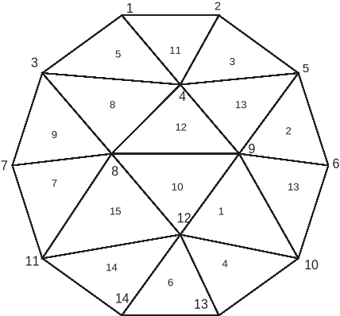|In the left figure, we have the following.<br>$n_v=14, n_t=16, n_s=10$<br>$q^1=(-0.309016994375, 0.951056516295)$<br>$\vdots\qquad \vdots\qquad \vdots$<br>$q^{14}=(-0.309016994375, -0.951056516295)$<br>The vertices of $T_1$ are $q^9, q^{12},\, q^{10}$.<br>$\vdots\qquad \vdots\qquad \vdots$<br>The vertices of $T_{16}$ are $q^9, q^{10}, q^{6}$.<br>The edge of 1st side $L_1$ are $q^6, q^5$.<br>$\vdots\qquad \vdots\qquad \vdots$<br>The edge of 10th side $L_{10}$ are $q^{10}, q^6$.|

|Table. 5.1: The structure of `:::freefem mesh_sample.msh`||
|:----|:----|
|Content of the file|Explanation|
|14 16 10<br>-0.309016994375 0.951056516295 1<br>0.309016994375 0.951056516295 1<br>$\cdots$  $\cdots$ $\vdots$<br>-0.309016994375 -0.951056516295 1|$n_v\qquad n_t\qquad n_e$<br>$q^1_x\qquad q^1_y\qquad$ boundary label=1<br>$q^2_x\qquad q^2_y\qquad$ boundary label=1<br><br>$q^{14}_x\qquad q^{14}_y\quad$ boundary label=1|
|9 12 10 0<br>5 9 6 0<br>$\cdots$<br>9 10 6 0|$1_1\qquad 1_2\qquad 1_3\qquad$ region label=0<br>$2_1\qquad 2_2\qquad 2_3\qquad$ region label=0<br><br>$16_1\quad 16_2\qquad 16_3\qquad$ region label=0|
|6 5 1<br>5 2 1<br>$\cdots$<br>10 6 1|$1_1\qquad 1_2\qquad$ boundary label=1<br>$2_1\qquad 2_2\qquad$ boundary label=1<br><br>$10_1\quad 10_2\qquad$ boundary label=1|


In FreeFem++ there are many mesh file formats available for communication with other tools such as emc2, modulef.. $\codered$ (see \refSec{Mesh Files}), The extension of a file implies its format. More details can be found on the file format .msh in the article by F. Hecht "bamg : a bidimensional anisotropic mesh generator".

A mesh file can be read into FreeFem++ except that the names of the borders are lost and only their reference numbers are kept. So these borders have to be referenced by the number which corresponds to their order of appearance in the program, unless this number is overwritten by the keyword `:::freefem label`.  Here are some examples:

```freefem
border floor(t=0,1){ x=t; y=0; label=1;}; // The unit square
border right(t=0,1){ x=1; y=t; label=5;};
border ceiling(t=1,0){ x=t; y=1; label=5;};
border left(t=1,0){ x=0; y=t; label=5;};
int n=10;
mesh th= buildmesh(floor(n)+right(n)+ceiling(n)+left(n));
savemesh(th,"toto.am_fmt"); // "formatted Marrocco" format \index{file!am\_fmt}
savemesh(th,"toto.Th");     // "bamg"-type mesh   \index{file!bamg}
savemesh(th,"toto.msh");    // freefem format \index{file!mesh}
savemesh(th,"toto.nopo");   // modulef format \index{file!nopo} see \cite{modulef}
mesh th2 = readmesh("toto.msh"); // Read the mesh
```

```freefem
// file readmesh.edp
border floor(t=0,1){ x=t; y=0; label=1;}; // The unit square
border right(t=0,1){ x=1; y=t; label=5;};
border ceiling(t=1,0){ x=t; y=1; label=5;};
border left(t=1,0){ x=0; y=t; label=5;};
int n=10;
mesh th= buildmesh(floor(n)+right(n)+ceiling(n)+left(n));
savemesh(th,"toto.am_fmt"); // format "formated Marrocco"
savemesh(th,"toto.Th");     // format database  db mesh "bamg"
savemesh(th,"toto.msh");    // format freefem
savemesh(th,"toto.nopo");   // modulef format see \cite{modulef}
mesh th2 = readmesh("toto.msh");
fespace femp1(th,P1);
femp1 f = sin(x)*cos(y),g;
{ // Save solution
ofstream file("f.txt");
file << f[] << endl;
}  // Close the file (end block)
{  // Read
ifstream file("f.txt");
file >> g[] ;
} // Close reading file (end block)
fespace Vh2(th2,P1);
Vh2 u,v;
plot(g);
//  Find $u$ such that \hfilll
// $ u + \Delta u = g $ in $\Omega $ , \hfilll
// $ u=0$ on $\Gamma_1$ and $\frac{\p u }{\p n} = g$ on $\Gamma_2$  \hfilll
solve pb(u,v) =
    int2d(th)( u*v - dx(u)*dx(v)-dy(u)*dy(v) )
  + int2d(th)(-g*v)
  + int1d(th,5)( g*v) //  $\frac{\p u }{\p n} = g$ on $\Gamma_2$
  + on(1,u=0) ;
plot (th2,u);
```


## Mesh Connectivity and data

The following example explains methods to obtain mesh information.

```freefem
{ // Get mesh information (version 1.37)
mesh Th=square(2,2);
// Get data of the mesh
int nbtriangles=Th.nt;
real area = Th.measure, borderlen = Th.bordermeasure; // Version 3.56
cout << " nb of Triangles = " << nbtriangles << endl;
for (int i=0;i<nbtriangles;i++)
  for (int j=0; j <3; j++)
    cout << i << " " << j << " Th[i][j] = "
         << Th[i][j] << "  x = "<< Th[i][j].x  << " , y= "<< Th[i][j].y
         << ",  label=" << Th[i][j].label << endl;

// Th(i) return the vextex i of Th
// Th[k] return the triangle k of Th

fespace femp1(Th,P1);
femp1 Thx=x,Thy=y; // Hack of get vertex coordinates
// Get vertices information :
int nbvertices=Th.nv;
cout << " nb of vertices = " << nbvertices << endl;
for (int i=0;i<nbvertices;i++)
      cout << "Th(" <<i  << ") : "   // << endl;
           << Th(i).x << " " << Th(i).y  << " " << Th(i).label //v 2.19
           << "       old method: " << Thx[][i] << " " << Thy[][i] << endl;

// Method to find information of point (0.55,0.6)

int it00 = Th(0.55,0.6).nuTriangle; // Then triangle number
int nr00 = Th(0.55,0.6).region;

// Info of a triangle
real area00 = Th[it00].area;
real nrr00 = Th[it00].region;
real nll00 = Th[it00].label; // Same as region in this case.

// Hack  to get a triangle containing point x,y
// or region number (old method)
// -------------------------------------------------------
fespace femp0(Th,P0);
femp0 nuT; // a P0 function  to get triangle numbering
  for (int i=0;i<Th.nt;i++)
   nuT[][i]=i;
femp0 nuReg=region; // A P0 function to get the region number
//  inquire
int it0=nuT(0.55,0.6); // Number of triangle Th's containing (0.55,0,6);
int nr0=nuReg(0.55,0.6); // Number of region of Th's containing (0.55,0,6);


// dump
// -------------------------------------------------------

cout << "  point (0.55,0,6) :triangle number " << it00 << " " << it00
     << ", region = " << nr0 << " == " << nr00 << ",  area K " << area00 << endl;

// New method to get boundary information and mesh adjacent

int k=0,l=1,e=1;
Th.nbe; // Return the number of boundary element
Th.be(k); // return the boundary element k $\in \{0,...,Th.nbe-1\}$
Th.be(k)[l]; // return the vertices l $\in \{0,1\}$ of  boundary elmt k
Th.be(k).Element; // Return the triangle containing the  boundary elmt k
Th.be(k).whoinElement ;   // Return the edge number of triangle containing
//the  boundary elmt k
Th[k].adj(e); // Return adjacent triangle to k by edge e, and change \index{mesh!adj}\hfill
// The value of e to the corresponding edge in the adjacent triangle
Th[k] == Th[k].adj(e) // Non adjacent triangle return the same
Th[k] != Th[k].adj(e) // True adjacent triangle

cout << " print mesh connectivity " << endl;
int nbelement = Th.nt;
for (int k=0;k<nbelement;++k)
  cout << k << " :  " << int(Th[k][0]) << " " << int(Th[k][1])
       << " " <<  int(Th[k][2])
       << " , label  " << Th[k].label << endl;
//

for (int k=0;k<nbelement;++k)
  for (int e=0,ee;e<3;++e)
    //  remark FH hack:  set ee to e, and ee is change by method adj,
    //  in () to make difference with  named parameters.
	    cout << k <<  " " << e << " <=>  " << int(Th[k].adj((ee=e))) << " " << ee
	     << "  adj: " << ( Th[k].adj((ee=e)) != Th[k]) << endl;
    // note :     if k == int(Th[k].adj(ee=e)) not adjacent element


int nbboundaryelement = Th.nbe;

for (int k=0;k<nbboundaryelement;++k)
    cout << k << " : " <<  Th.be(k)[0] << " " << Th.be(k)[1] << " , label "
         << Th.be(k).label <<  " tria  " << int(Th.be(k).Element)
         << " " << Th.be(k).whoinElement <<  endl;
real[int] bb(4);
boundingbox(Th,bb); //  \index{mesh!boundingbox}  \index{boundingbox}
// bb[0] = xmin, bb[1] = xmax, bb[2] = ymin, bb[3] =ymax
cout << "\n boundingbox  xmin: " << bb[0] << " xmax: " << bb[1]
                  << " ymin: " << bb[2] << " ymax: " << bb[3] << endl;
}
```

The output is:

```freefem
 -- square mesh : nb vertices  =9 ,  nb triangles = 8 ,  nb boundary edges 8
    Nb of Vertices 9 ,  Nb of Triangles 8
    Nb of edge on user boundary  8 ,  Nb of edges on true boundary  8
 number of real boundary edges 8
 nb of Triangles = 8
0 0 Th[i][j] = 0  x = 0 , y= 0,  label=4
0 1 Th[i][j] = 1  x = 0.5 , y= 0,  label=1
0 2 Th[i][j] = 4  x = 0.5 , y= 0.5,  label=0
...
6 0 Th[i][j] = 4  x = 0.5 , y= 0.5,  label=0
6 1 Th[i][j] = 5  x = 1 , y= 0.5,  label=2
6 2 Th[i][j] = 8  x = 1 , y= 1,  label=3
7 0 Th[i][j] = 4  x = 0.5 , y= 0.5,  label=0
7 1 Th[i][j] = 8  x = 1 , y= 1,  label=3
7 2 Th[i][j] = 7  x = 0.5 , y= 1,  label=3
 Nb Of Nodes = 9
 Nb of DF = 9
 -- vector function's bound  0 1
 -- vector function's bound  0 1
 nb of vertices = 9
Th(0) : 0 0 4       old method: 0 0
Th(1) : 0.5 0 1       old method: 0.5 0
...
Th(7) : 0.5 1 3       old method: 0.5 1
Th(8) : 1 1 3       old method: 1 1
 Nb Of Nodes = 8
 Nb of DF = 8

 print mesh connectivity
0 :  0 1 4 , label  0
1 :  0 4 3 , label  0
...
6 :  4 5 8 , label  0
7 :  4 8 7 , label  0
0 0 <=>  3 1  adj: 1
0 1 <=>  1 2  adj: 1
0 2 <=>  0 2  adj: 0
...
6 2 <=>  3 0  adj: 1
7 0 <=>  7 0  adj: 0
7 1 <=>  4 0  adj: 1
7 2 <=>  6 1  adj: 1
0 : 0 1 , label 1 tria  0 2
1 : 1 2 , label 1 tria  2 2
...
6 : 0 3 , label 4 tria  1 1
7 : 3 6 , label 4 tria  5 1

 boundingbox  xmin: 0 xmax: 1 ymin: 0 ymax: 1
```

The real characteristic function of a mesh `:::freefem Th` is  `:::freefem chi(Th)`
in 2d and 3d where


`:::freefem chi(Th)(P)=1` if $P\in Th;\qquad$ `:::freefem chi(Th)(P)=0` if $P\not\in Th;$


## The keyword "triangulate"

FreeFem++ is able to build a triangulation from a set of points. This
triangulation is a Delaunay mesh of the convex hull of the set of points.
It can be useful to build a mesh form a table function.

The coordinates of the points and the value of the table function
are defined separately with rows of the form: `:::freefem x  y  f(x,y)`
in a file such as:

```freefem
0.51387 0.175741 0.636237
0.308652 0.534534 0.746765
0.947628 0.171736 0.899823
0.702231 0.226431 0.800819
0.494773 0.12472 0.580623
0.0838988 0.389647 0.456045
...............
```

|Fig. 5.8: Delaunay mesh of the convex hull of point set in file xy|Fig. 5.9: Isovalue of table function|
|:----:|:----:|
|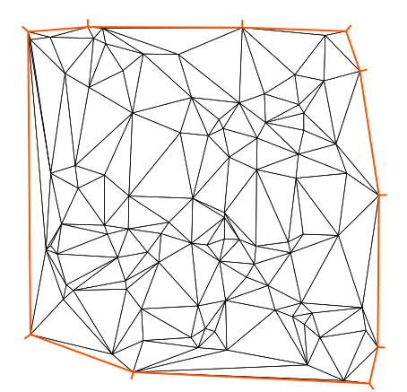|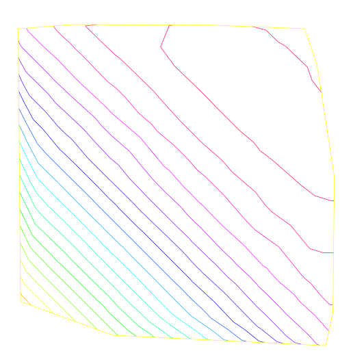

The third column of each line is left untouched by the
`:::freefem triangulate` command. But you can use this third value to
define a table function with rows of the form: `:::freefem x  y  f(x,y)`.

The following example shows how to make a mesh from the file "xyf" with the format stated just above.
The command `:::freefem triangulate` command use only use 1st and 2nd rows.

```freefem
mesh Thxy=triangulate("xyf"); // Build the Delaunay mesh of the convex hull
// Points are defined by the first 2 columns of file `xyf}
plot(Thxy,ps="Thxyf.ps"); // (see figure  \ref{Thxy})

fespace Vhxy(Thxy,P1); // create a P1 interpolation
Vhxy fxy; // the function

// Reading the 3rd row to define the function
{ ifstream file("xyf");
   real xx,yy;
   for(int i=0;i<fxy.n;i++)
   file >> xx >>yy >> fxy[][i]; // To read third row only.
   // xx and yy are just skipped
}
plot(fxy,ps="xyf.eps"); // Plot the function (see figure  \ref{xyf})
```

One  new way to build a mesh is to have two arrays one  the $x$ values and the other for the $y$ values:

```freefem
Vhxy xx=x,yy=y; // To set two arrays for the x's and y's
mesh Th=triangulate(xx[],yy[]);
```

# Boundary FEM Spaces Built as Empty Meshes

To define a Finite Element space on a boundary,
we came up with the idea of a mesh with no internal points (call empty mesh).
It can be useful to handle Lagrange multipliers in mixed and mortar methods.

So the function `:::freefem emptymesh` remove all the internal points of a mesh except
points  on  internal boundaries.

```freefem
{  //  new stuff 2004 emptymesh (version 1.40)
 // -- useful to build Multiplicator space
 //  build a mesh without internal point
 // with the same boundary
 //  -----
assert(version>=1.40);
border a(t=0,2*pi){ x=cos(t); y=sin(t);label=1;}
mesh Th=buildmesh(a(20));
Th=emptymesh(Th);
plot(Th,wait=1,ps="emptymesh-1.eps");//see figure \ref{fig emptymesh-1}
}
```

It is also possible to build an empty mesh of a pseudo subregion
with `:::freefem emptymesh(Th,ssd)` using the set of edges of the mesh `:::freefem Th`;
a edge $e$ is in  this set  if with the two adjacent triangles $e =t1\cap t2$
and  $ ssd[T1] \neq ssd[T2]$ where $ssd$  refers to the pseudo region
numbering of triangles, when they are stored in an `:::freefem int[int]` array of size the number of triangles.

```freefem
{  //  new stuff 2004 emptymesh (version 1.40) \hfilll
// -- useful to build Multiplicator space \hfilll
//  build a mesh without internal point \hfilll
// of peusdo sub domain  \hfilll
//  ----- \hfilll
assert(version>=1.40);
mesh Th=square(10,10);
int[int] ssd(Th.nt);
for(int i=0;i<ssd.n;i++) // build the  pseudo region numbering
 {  int iq=i/2;   // because 2 triangle per quad
    int ix=iq%10; //
    int iy=iq/10; //
  ssd[i]= 1 + (ix>=5) +  (iy>=5)*2;
 }
Th=emptymesh(Th,ssd); // build emtpy  with
//  all edge $e = T1 \cap T2$ and $ ssd[T1] \neq ssd[T2]$
plot(Th,wait=1,ps="emptymesh-2.eps");//see figure \ref{fig emptymesh-2}
savemesh(Th,"emptymesh-2.msh");
}
```

|Fig. 5.10: The empty mesh with boundary|Fig. 5.11: An empty mesh defined from a pseudo region numbering of triangle|
|:----:|:----:|
|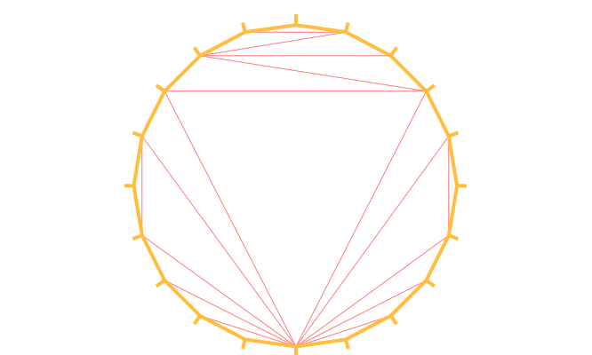||

# Remeshing
## Movemesh

Meshes can be translated, rotated and deformed by ':::freefem movemesh`; this is useful for elasticity to watch the deformation due to the displacement
$\vec\Phi(x,y)=(\Phi_1(x,y),\Phi_2(x,y))$ of shape. It is also useful to
handle free boundary  problems or optimal shape problems.

If $\Omega$ is triangulated as $T_h(\Omega)$,
and $\Phi$ is a displacement vector then $\Phi(T_h)$ is obtained by

```freefem
mesh  Th=movemesh(Th,[Phi1,Phi2]);
```

Sometimes the transformed mesh is invalid because some triangle
have flip over (now has negative area). To spot such problems one may check the
minimum triangle area in the transformed mesh with
':::freefem checkmovemesh` before any real transformation.

$\codered$
$\Phi_1(x,y)=x+k*\sin(y*\pi)/10)$, $\Phi_2(x,y)=y+k*\cos(y\pi)/10)$ for a big number $k>1$.

```freefem
verbosity=4;
border a(t=0,1){x=t;y=0;label=1;};
border b(t=0,0.5){x=1;y=t;label=1;};
border c(t=0,0.5){x=1-t;y=0.5;label=1;};
border d(t=0.5,1){x=0.5;y=t;label=1;};
border e(t=0.5,1){x=1-t;y=1;label=1;};
border f(t=0,1){x=0;y=1-t;label=1;};
func uu= sin(y*pi)/10;
func vv= cos(x*pi)/10;

mesh Th = buildmesh ( a(6) + b(4) + c(4) +d(4) + e(4) + f(6));
plot(Th,wait=1,fill=1,ps="Lshape.eps");// see figure \ref{lshape}
real coef=1;
real minT0= checkmovemesh(Th,[x,y]); // the min triangle area
while(1) // find a correct move mesh
{
  real minT=checkmovemesh(Th,[x+coef*uu,y+coef*vv]);//the min triangle area
  if (minT > minT0/5) break ; // if big enough
  coef/=1.5;
}

Th=movemesh(Th,[x+coef*uu,y+coef*vv]);
plot(Th,wait=1,fill=1,ps="movemesh.eps");// see figure \ref{movemesh}
```

|Fig. 5.12: L-shape|Fig. 5.13: moved L-shape|
|:----:|:----:|
|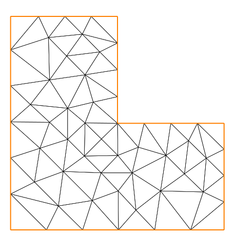||

!!! note
	Consider a function $u$ defined on a mesh `:::freefem Th`. A statement like `:::freefem Th=movemesh(Th...)` does not change $u$ and so the old mesh still exists. It will be destroyed when no function use it. A statement like $u=u$ redefines $u$ on the new mesh `:::freefem Th` with interpolation and therefore destroys the old `:::freefem Th` if $u$ was the only function using it.

Now, we give an example of moving mesh with a lagrangian function $u$ defined on the moving mesh.

```freefem
// Simple movemesh example
mesh Th=square(10,10);
fespace Vh(Th,P1);
real t=0;
// ---
// The problem is how to build data without interpolation
// So the data u is moving with the mesh as you can see in the plot
// ---
Vh u=y;
for (int i=0;i<4;i++)
{
 t=i*0.1;
 Vh f= x*t;
 real minarea=checkmovemesh(Th,[x,y+f]);
 if (minarea >0 ) // movemesh will be ok
   Th=movemesh(Th,[x,y+f]);

 cout << " Min area  " << minarea << endl;

 real[int] tmp(u[].n);
 tmp=u[];  // save the value
 u=0;        // to change the FEspace and mesh associated with u
 u[]=tmp;  // set the value of u without any mesh update
 plot(Th,u,wait=1);
};
// In this program, since u is only defined on the last mesh, all the
// previous meshes are deleted from memory.
```


# Regular Triangulation: `:::freefem hTriangle`

For a set $S$, we define the diameter of $S$ by

\[
\textrm{diam}(S)=\sup\{|\mathbf{x}-\mathbf{y}|; \; \mathbf{x},\, \mathbf{y}\in S\}
\]

The sequence $\{\mathcal{T}_h\}_{h\downarrow 0}$ of $\Omega$ is called
_regular_ if they satisfy the following:


1. \[\lim_{h\downarrow 0}\max\{\textrm{diam}(T_k)|\; T_k\in \mathcal{T}_h\}=0\]

2. There is a number $\sigma>0$ independent of $h$ such that
\[\frac{\rho(T_k)}{\textrm{diam}(T_k)}\ge \sigma\qquad \textrm{for all }T_k\in \mathcal{T}_h\]
	where $\rho(T_k)$ are the diameter of the inscribed circle of $T_k$.

We put $h(\mathcal{T}_h)=\max\{\textrm{diam}(T_k)|\; T_k\in \mathcal{T}_h\}$,
which is obtained by

```freefem
mesh Th = ......;
fespace Ph(Th,P0);
Ph h = hTriangle;
cout << "size of mesh = " << h[].max << endl;
```

# Adaptmesh

The function
\[
f(x,y) = 10.0x^3+y^3+\tan^{-1}[\varepsilon/(\sin(5.0y)-2.0x)]
\qquad \varepsilon =  0.0001
\]
sharply varies in value and the initial mesh given by one of the commands of Section \ref{sec:InitialMesh}
cannot reflect its sharp variations.

```freefem
real eps =  0.0001;
real h=1;
real hmin=0.05;
func f = 10.0*x^3+y^3+h*atan2(eps,sin(5.0*y)-2.0*x);

mesh Th=square(5,5,[-1+2*x,-1+2*y]);
fespace Vh(Th,P1);
Vh fh=f;
plot(fh);
for (int i=0;i<2;i++)
 {
   Th=adaptmesh(Th,fh);
   fh=f;  // old mesh is deleted
   plot(Th,fh,wait=1);
 }
```

|Fig. 5.14: 3D graphs for the initial mesh and 1st and 2nd mesh adaptation|
|:----|
||

FreeFem++ uses a variable metric/Delaunay automatic meshing
algorithm.

The command:

```freefem
mesh ATh = adaptmesh(Th, f);
```
create the new mesh `:::freefem ATh` adapted to the Hessian

$$
D^2f=(\p^2 f/\p x^2,\, \p^2 f/\p x\p y,
\p^2 f/\p y^2)
$$

of a function (formula or FE-function).
Mesh adaptation is a very powerful tool when the solution of a problem
varies locally and sharply.

Here we solve the problem $\codered$ (\ref{eqn:Poisson})-(\ref{eqn:Dirichlet}),
when $f=1$ and $\Omega$ is a L-shape domain.

|Fig. 5.15: L-shape domain and its boundary name|Fig. 5.16: Final solution after 4-times adaptation|
|:----|:----|
|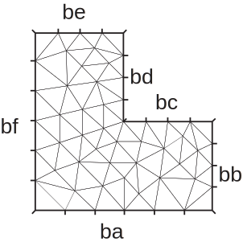||

**example** (Adapt.edp) The solution has the singularity $r^{3/2},\, r=|x-\gamma|$
at the point $\gamma$ of the intersection of two lines $bc$ and $bd$ (see Fig. 5.15).

```freefem
border ba(t=0,1.0){x=t;   y=0;  label=1;};
border bb(t=0,0.5){x=1;   y=t;  label=1;};
border bc(t=0,0.5){x=1-t; y=0.5;label=1;};
border bd(t=0.5,1){x=0.5; y=t;  label=1;};
border be(t=0.5,1){x=1-t; y=1;  label=1;};
border bf(t=0.0,1){x=0;   y=1-t;label=1;};
mesh Th = buildmesh ( ba(6)+bb(4)+bc(4)+bd(4)+be(4)+bf(6) );
fespace Vh(Th,P1); // set FE space
Vh u,v;            // set unknown and test function
func f = 1;
real error=0.1;    // Level of error
problem Poisson(u,v,solver=CG,eps=1.0e-6) =
    int2d(Th)(  dx(u)*dx(v) + dy(u)*dy(v))
  - int2d(Th) ( f*v )
  + on(1,u=0)  ;
for (int i=0;i< 4;i++)
{
  Poisson;
  Th=adaptmesh(Th,u,err=error);
  error = error/2;
} ;
plot(u);
```

To speed up the adaptation
the default parameter `:::freefem err` of `:::freefem adaptmesh` is changed by hand; it specifies the required precision, so as to make the new mesh finer or coarser.

The problem is coercive and symmetric,
so the linear system can be solved with the conjugate gradient method (parameter `:::freefem solver=CG`) with the stopping criteria on the residual, here `:::freefem eps=1.0e-6`).
By `:::freefem adaptmesh`, the slope of the final solution is correctly computed near
the point of intersection of $bc$ and $bd$ as in Fig. 5.16.

This method is described in detail in $\codered$ \cite{bamg}. It has a number of
default parameters which can be modified :

Si `:::freefem f1,f2` sont des functions  et `:::freefem thold, Thnew` des maillages.

```freefem
    Thnew = adaptmesh(Thold, f1  ...  );
    Thnew = adaptmesh(Thold, f1,f2  ...  ]);
    Thnew = adaptmesh(Thold, [f1,f2]  ...  );
```

The additional parameters of adaptmesh are not written here, hence the  "..."

* `:::freefem hmin=` Minimum edge size (`:::freefem val` is a real. Its default is related to the size of the domain to be meshed and the precision of the mesh generator).

* `:::freefem hmax=` Maximum edge size (`:::freefem val` is a real. It defaults to the diameter of the domain to be meshed)

* `:::freefem err=` $P_1$ interpolation error level (0.01 is the default).  

* `:::freefem errg=` Relative geometrical error. By default this error is 0.01, and in any case it must be lower than $1/\sqrt{2}$.  Meshes created with this option may have some edges smaller than the `:::freefem -hmin` due to geometrical constraints.  

* `:::freefem nbvx=` Maximum number of vertices generated by the mesh generator (9000 is the default).

* `:::freefem nbsmooth=` number of iterations of the smoothing procedure (5 is the default).

* `nbjacoby=` number of iterations in a smoothing procedure during the metric construction, 0 means no smoothing (6 is the default).

* `:::freefem ratio=` ratio for a prescribed smoothing on the metric. If the value is 0 or less than 1.1 no smoothing is done on the metric (1.8 is the default).

	If `:::freefem ratio > 1.1`, the speed of mesh size variations is bounded by $log(\mathtt{ratio})$.  Note: As `:::freefem ratio` gets closer to 1, the number of generated vertices increases. This may be useful to control the thickness of refined regions near shocks or boundary layers .  

* `:::freefem omega=` relaxation parameter for the smoothing procedure (1.0 is the default).

* `:::freefem iso=` If true, forces the metric to be isotropic (false is the default).  

* `:::freefem abserror=` If false, the metric is evaluated using the criterium of equi-repartion of relative error (false is the default). In this case the metric is defined by
\begin{equation}
  \mathcal{M} = \left({1\over\mathtt{err}\,\, \mathtt{coef}^2} \quad {
  |\mathcal{H}| \over max(\mathtt{CutOff},|\eta|)}\right)^p
  \label{eq err rel}
\end{equation}
	otherwise, the metric is evaluated using the criterium of equi-distribution of errors. In this case the metric is defined by
\begin{equation}
  \mathcal{M} = \left({1\over \mathtt{err}\,\,\mathtt{coef}^2} \quad
  {|{\mathcal{H}|} \over
  {\sup(\eta)-\inf(\eta)}}\right)^p.\label{eq err abs}
\end{equation}

* `:::freefem cutoff=` lower limit for the relative error evaluation (1.0e-6 is the default).

* `:::freefem verbosity=` informational messages level (can be chosen between 0 and $\infty$). Also changes the value of the global variable verbosity (obsolete).  

* `:::freefem inquire=` To inquire graphically about the mesh (false is the default).

* `:::freefem splitpbedge=` If true, splits all internal edges in half with two boundary vertices (true is the
default).

* `:::freefem maxsubdiv=` Changes the metric such that the maximum subdivision of a background edge is bound by `:::freefem val` (always limited by 10, and 10 is also the default).

* `:::freefem rescaling=` if true, the function with respect to which the mesh is adapted is rescaled to be between 0 and 1 (true is the default).

* `:::freefem keepbackvertices=` if true, tries to keep as many vertices from the original mesh as possible (true is the default).

* `:::freefem isMetric=` if true, the metric is defined explicitly (false is the default).  If the 3 functions $m_{11}, m_{12}, m_{22}$ are given, they directly define a symmetric matrix field whose Hessian is computed to define a metric. If only one function is given, then it represents the isotropic mesh size at every point.

	For example, if the partial derivatives `:::freefem fxx` ($=\p^2 f/\p x^2$), `:::freefem fxy` ($=\p^2 f/\p x\p y$), `:::freefem fyy` ($=\p^2 f/\p y^2$) are given, we can set `:::freefem Th=adaptmesh(Th,fxx,fxy,fyy,IsMetric=1,nbvx=10000,hmin=hmin);`

* `:::freefem power=` exponent power of the Hessian used to compute the metric (1 is the default).

* `:::freefem thetamax=` minimum corner angle of in degrees (default is $10^\circ$) where the corner is $ABC$ and the angle is the angle of the two vectors ${AB}, {BC}$, ($0$ imply no corner, $90$ imply perp. corner, ...).

* `:::freefem splitin2=` boolean value. If true, splits all triangles of the final mesh into 4 sub-triangles.

* `:::freefem metric=` an array of 3 real arrays to set or get metric data information. The size of these three arrays must be the number of vertices. So if `:::freefem m11,m12,m22` are three P1 finite elements related to the mesh to adapt, you can write: `:::freefem metric=[m11[],m12[],m22[]]` (see file `:::freefem convect-apt.edp` for a full
example)

* `:::freefem nomeshgeneration=` If true, no adapted mesh is generated (useful to compute
only a metric).

* `:::freefem periodic=` Writing `:::freefem periodic=[[4,y],[2,y],[1,x],[3,x]];` builds an adapted periodic mesh. The sample build a biperiodic mesh of a square. (see periodic finite element spaces $\codered$ \ref{periodic BC}, and see `:::freefem sphere.edp` for a  full example)

We can use the command `:::freefem adaptmesh` to build uniform mesh with a contant mesh size. So to build a mesh with a constant mesh size equal to $\frac{1}{30}$ try:

```freefem
// file uniformmesh.edp
mesh Th=square(2,2); // To have initial mesh
plot(Th,wait=1,ps="square-0.eps");
Th= adaptmesh(Th,1./3As writing
0.,IsMetric=1,nbvx=10000);
plot(Th,wait=1,ps="square-1.eps");
Th= adaptmesh(Th,1./30.,IsMetric=1,nbvx=10000); // More the one time du to
Th= adaptmesh(Th,1./30.,IsMetric=1,nbvx=10000); // Adaptation bound `maxsubdiv=`
plot(Th,wait=1,ps="square-2.eps");
```

|Fig. 5.17: Initial mesh|Fig. 5.18: First iteration|Fig. 5.19: Last iteration|
|:----|:----|:----|
||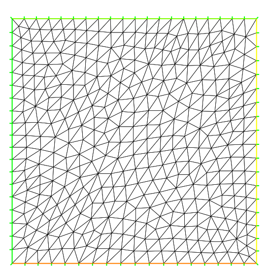|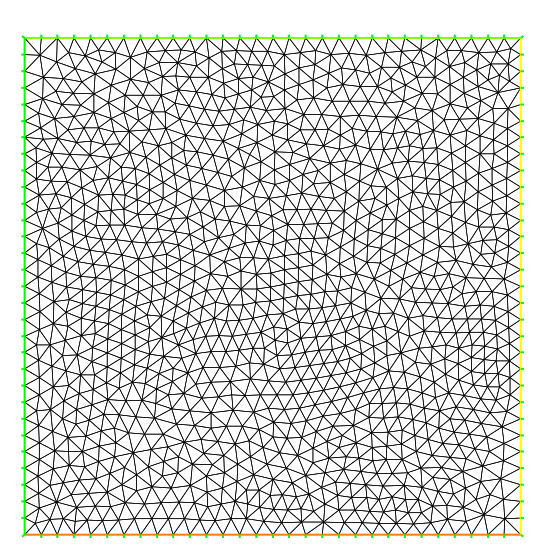|

# Trunc

Two operators have been introduce to remove triangles from a mesh or to divide them.
Operator `:::freefem trunc` has two parameters :

  * `:::freefem label=` sets the label number of new boundary item (one by default)
  * `:::freefem split=` sets the level $n$ of triangle splitting. Each triangle is splitted in  $n\times n$ (one by default).

To create the mesh `:::freefem Th3`
where alls  triangles of a mesh `:::freefem Th`  are splitted in $3{\times}3$, just write:

```freefem
  mesh Th3 = trunc(Th,1,split=3);
```

The  `:::freefem truncmesh.edp` example construct all "trunc" mesh to the support of the basic function  of the space `:::freefem Vh` (cf. `:::freefem abs(u)>0`), split all the  triangles in $5{\times} 5$, and put a label number to $2$ on new boundary.

```freefem
mesh Th=square(3,3);
fespace Vh(Th,P1);
Vh u;
int i,n=u.n;
u=0;
for (i=0;i<n;i++) // All degree of freedom
 {
  u[][i]=1;       // The basic function i
  plot(u,wait=1);
  mesh Sh1=trunc(Th,abs(u)>1.e-10,split=5,label=2);
  plot(Th,Sh1,wait=1,ps="trunc"+i+".eps");// plot the mesh of
  // the function's support
  u[][i]=0; // reset
 }
```

|Fig. 5.20: mesh of support the function P1  number 0, splitted in $5{\times}5$|Fig. 5.21: Mesh of support the function P1  number 6, splitted in $5{\times}5$|
|:----|:----|
|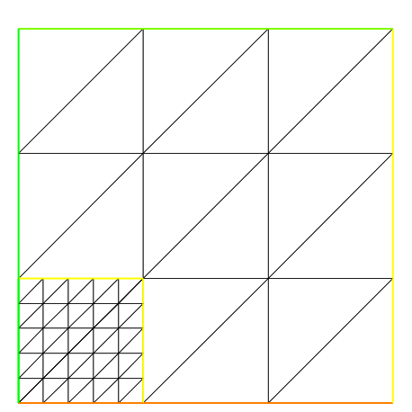||

# Splitmesh

Another way to split mesh triangles is to use `:::freefem splitmesh`, for example:

```freefem
{
assert(version>=1.37);
border a(t=0,2*pi){ x=cos(t); y=sin(t);label=1;}
mesh Th=buildmesh(a(20));
plot(Th,wait=1,ps="nosplitmesh.eps"); // See fig. 5.22
Th=splitmesh(Th,1+5*(square(x-0.5)+y*y));
plot(Th,wait=1,ps="splitmesh.eps"); // See fig. 5.23
}
```

|Fig. 5.22: Initial mesh|Fig. 5.23: all left mesh triangle is split  conformaly in `:::freefem int(1+5*(square(x-0.5)+y*y)\^2` triangles|
|:----:|:----:|
|||

# Meshing Examples

**Example** Two rectangles touching by a side

```freefem
border a(t=0,1){x=t;y=0;};
border b(t=0,1){x=1;y=t;};
border c(t=1,0){x=t ;y=1;};
border d(t=1,0){x = 0; y=t;};
border c1(t=0,1){x=t ;y=1;};
border e(t=0,0.2){x=1;y=1+t;};
border f(t=1,0){x=t ;y=1.2;};
border g(t=0.2,0){x=0;y=1+t;};
int n=1;
mesh th = buildmesh(a(10*n)+b(10*n)+c(10*n)+d(10*n));
mesh TH = buildmesh ( c1(10*n) + e(5*n) + f(10*n) + g(5*n) );
plot(th,TH,ps="TouchSide.esp"); // Fig. 5.24
```

**Example** NACA0012 Airfoil

```freefem
border upper(t=0,1) { x = t;
     y = 0.17735*sqrt(t)-0.075597*t
  - 0.212836*(t^2)+0.17363*(t^3)-0.06254*(t^4); }
border lower(t=1,0) { x = t;
     y= -(0.17735*sqrt(t)-0.075597*t
  -0.212836*(t^2)+0.17363*(t^3)-0.06254*(t^4)); }
border c(t=0,2*pi) { x=0.8*cos(t)+0.5;  y=0.8*sin(t); }
mesh Th = buildmesh(c(30)+upper(35)+lower(35));
plot(Th,ps="NACA0012.eps",bw=1);  // Fig. 5.25
```

|Fig. 5.24: Two rectangles touching by a side|Fig. 5.25: NACA0012 Airfoil|
|:----:|:----:|
|||

**Example** Cardioid

```freefem
real b = 1, a = b;
border C(t=0,2*pi) {x=(a+b)*cos(t)-b*cos((a+b)*t/b); y=(a+b)*sin(t)-b*sin((a+b)*t/b);}
mesh Th = buildmesh(C(50));
plot(Th,ps="Cardioid.eps",bw=1); // Fig. 5.26
```

** Example** Cassini Egg

```freefem
border C(t=0,2*pi) {x=(2*cos(2*t)+3)*cos(t); y=(2*cos(2*t)+3)*sin(t);}
mesh Th = buildmesh(C(50));
plot(Th,ps="Cassini.eps",bw=1); // Fig. 5.27
```

|Fig. 5.26: Domain with Cardioid curve boundary|Fig. 5.27: Domain with Cassini Egg curve boundary|
|:----:|:----:|
|||

**Example** By cubic Bezier curve

```freefem
// A cubic Bezier curve connecting two points with two control points
func real bzi(real p0,real p1,real q1,real q2,real t)
{
  return p0*(1-t)^3+q1*3*(1-t)^2*t+q2*3*(1-t)*t^2+p1*t^3;
}

real[int] p00=[0,1], p01=[0,-1], q00=[-2,0.1], q01=[-2,-0.5];
real[int] p11=[1,-0.9], q10=[0.1,-0.95], q11=[0.5,-1];
real[int] p21=[2,0.7], q20=[3,-0.4], q21=[4,0.5];
real[int] q30=[0.5,1.1], q31=[1.5,1.2];
border G1(t=0,1) { x=bzi(p00[0],p01[0],q00[0],q01[0],t);
                   y=bzi(p00[1],p01[1],q00[1],q01[1],t); }
border G2(t=0,1) { x=bzi(p01[0],p11[0],q10[0],q11[0],t);
                   y=bzi(p01[1],p11[1],q10[1],q11[1],t); }
border G3(t=0,1) { x=bzi(p11[0],p21[0],q20[0],q21[0],t);
                   y=bzi(p11[1],p21[1],q20[1],q21[1],t); }
border G4(t=0,1) { x=bzi(p21[0],p00[0],q30[0],q31[0],t);
                   y=bzi(p21[1],p00[1],q30[1],q31[1],t); }
int m=5;
mesh Th = buildmesh(G1(2*m)+G2(m)+G3(3*m)+G4(m));
plot(Th,ps="Bezier.eps",bw=1);  // Fig. 5.28
```

|Fig. 5.28: Boundary drawed by Bezier curves|
|:----|
|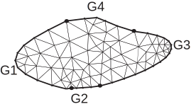|

**Example** Section of Engine

```freefem
real a= 6., b= 1., c=0.5;
border L1(t=0,1) { x= -a; y= 1+b - 2*(1+b)*t; }
border L2(t=0,1) { x= -a+2*a*t; y= -1-b*(x/a)*(x/a)*(3-2*abs(x)/a );}
border L3(t=0,1) { x= a; y=-1-b + (1+ b )*t; }
border L4(t=0,1) { x= a - a*t;   y=0; }
border L5(t=0,pi) { x= -c*sin(t)/2; y=c/2-c*cos(t)/2; }
border L6(t=0,1) { x= a*t;  y=c; }
border L7(t=0,1) { x= a;  y=c + (1+ b-c )*t; }
border L8(t=0,1) { x= a-2*a*t; y= 1+b*(x/a)*(x/a)*(3-2*abs(x)/a); }
mesh Th = buildmesh(L1(8)+L2(26)+L3(8)+L4(20)+L5(8)+L6(30)+L7(8)+L8(30));
plot(Th,ps="Engine.eps",bw=1); // Fig. 5.29
```

|Fig. 5.29: Section of Engine|
|:----|
|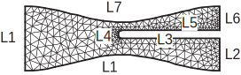|

**Example** Domain with U-shape channel

```freefem
real d = 0.1; // Width of U-shape
border L1(t=0,1-d) { x=-1; y=-d-t; }
border L2(t=0,1-d) { x=-1; y=1-t; }
border B(t=0,2) { x=-1+t; y=-1; }
border C1(t=0,1) { x=t-1; y=d; }
border C2(t=0,2*d) { x=0; y=d-t; }
border C3(t=0,1) { x=-t; y=-d; }
border R(t=0,2) { x=1; y=-1+t; }
border T(t=0,2) { x=1-t; y=1; }
int n = 5;
mesh Th = buildmesh (L1(n/2)+L2(n/2)+B(n)+C1(n)+C2(3)+C3(n)+R(n)+T(n));
plot(Th,ps="U-shape.eps",bw=1); // Fig. 5.30
```

|Fig. 5.30: Domain with U-shape channel changed by `:::freefem d`|
|:----|
|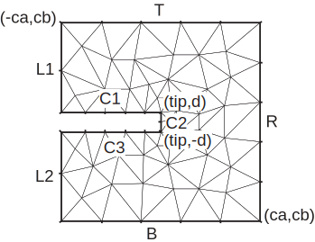|

**Example** Domain with V-shape cut

```freefem
real dAg = 0.01; // Angle of V-shape
border C(t=dAg,2*pi-dAg) { x=cos(t); y=sin(t); };
real[int] pa(2), pb(2), pc(2);
pa[0] = cos(dAg); pa[1] = sin(dAg);
pb[0] = cos(2*pi-dAg); pb[1] = sin(2*pi-dAg);
pc[0] = 0; pc[1] = 0;
border seg1(t=0,1) { x=(1-t)*pb[0]+t*pc[0]; y=(1-t)*pb[1]+t*pc[1]; };
border seg2(t=0,1) { x=(1-t)*pc[0]+t*pa[0]; y=(1-t)*pc[1]+t*pa[1]; };
mesh Th = buildmesh(seg1(20)+C(40)+seg2(20));
plot(Th,ps="V-shape.eps",bw=1);  // Fig. 5.31
```

|Fig. 5.31: Domain with V-shape cut changed by `:::freefem dAg`|
|:----|
|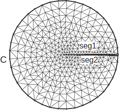|

**Example** Smiling face

```freefem
real d=0.1;
int m=5;
real a=1.5, b=2, c=0.7, e=0.01;
border F(t=0,2*pi) { x=a*cos(t); y=b*sin(t); }
border E1(t=0,2*pi) { x=0.2*cos(t)-0.5; y=0.2*sin(t)+0.5; }
border E2(t=0,2*pi) { x=0.2*cos(t)+0.5; y=0.2*sin(t)+0.5; }
func real st(real t) {
   return sin(pi*t)-pi/2;
}
border C1(t=-0.5,0.5) { x=(1-d)*c*cos(st(t)); y=(1-d)*c*sin(st(t)); }
border C2(t=0,1){x=((1-d)+d*t)*c*cos(st(0.5));y=((1-d)+d*t)*c*sin(st(0.5));}
border C3(t=0.5,-0.5) { x=c*cos(st(t)); y=c*sin(st(t)); }
border C4(t=0,1) { x=(1-d*t)*c*cos(st(-0.5)); y=(1-d*t)*c*sin(st(-0.5));}

border C0(t=0,2*pi) { x=0.1*cos(t); y=0.1*sin(t); }
mesh Th=buildmesh(F(10*m)+C1(2*m)+C2(3)+C3(2*m)+C4(3)
                  +C0(m)+E1(-2*m)+E2(-2*m));
plot(Th,ps="SmileFace.eps",bw=1);  // see Fig. 5.33
}
```

|Fig. 5.32: Smiling face (Mouth is changeable)|
|:----:|
||

**Example** 3point bending

```freefem
// Square for Three-Point Bend Specimens fixed on Fix1, Fix2
// It will be loaded on Load.
real a=1, b=5, c=0.1;
int n=5, m=b*n;
border Left(t=0,2*a) { x=-b; y=a-t; }
border Bot1(t=0,b/2-c) { x=-b+t; y=-a; }
border Fix1(t=0,2*c) { x=-b/2-c+t; y=-a; }
border Bot2(t=0,b-2*c) { x=-b/2+c+t; y=-a; }
border Fix2(t=0,2*c) { x=b/2-c+t; y=-a; }
border Bot3(t=0,b/2-c) { x=b/2+c+t; y=-a; }
border Right(t=0,2*a) { x=b; y=-a+t; }
border Top1(t=0,b-c) { x=b-t; y=a; }
border Load(t=0,2*c) { x=c-t; y=a; }
border Top2(t=0,b-c) { x=-c-t; y=a; }
mesh Th = buildmesh(Left(n)+Bot1(m/4)+Fix1(5)+Bot2(m/2)+Fix2(5)+Bot3(m/4)
                    +Right(n)+Top1(m/2)+Load(10)+Top2(m/2));
plot(Th,ps="ThreePoint.eps",bw=1); // Fig. 5.33
```

<center>

|Fig. 5.33: Domain for three-point bending test|
|:----|
||

</center>

# How to change the label of elements and border elements of a mesh

Changing the label of elements and border elements will be done using the keyword `:::freefem change`. The parameters for this command line are for a two dimensional and dimensional case:

* `:::freefem label =` is a vector of integer that contains successive pair of the old label number to  the new label number.

* `:::freefem region =` is a vector of integer that contains successive pair of the old region number to new region number.

* `:::freefem flabel =`  is an integer function with given the new value of the label.

* `:::freefem fregion=` is an integer function with given the new value of the region.

These vectors are composed of $n_{l}$ successive pair of number $O,N$  where $n_{l}$ is the number (label or region) that we want to change. For example, we have :

\begin{eqnarray}
\label{eq.org.vector.change.label}
\mathtt{label} &= &[ O_{1}, N_{1},  ..., O_{n_{l}},N_{n_{l}} ] \\
\mathtt{region} & =& [ O_{1}, N_{1},  ..., O_{n_{l}},N_{n_{l}} ]
\end{eqnarray}

An example of using this function is given in `:::freefem glumesh2D.edp`:

**Example** glumesh2D.edp

```freefem
mesh Th1=square(10,10);
mesh Th2=square(20,10,[x+1,y]);
verbosity=3;
int[int] r1=[2,0],  r2=[4,0];
plot(Th1,wait=1);
Th1=change(Th1,label=r1); // Change the label of Edges  2 in 0.
plot(Th1,wait=1);
Th2=change(Th2,label=r2); // Change the label of Edges  4 in 0.
mesh Th=Th1+Th2;         //  ``gluing together'' of meshes Th1 and Th2
cout << " nb lab = " << int1d(Th1,1,3,4)(1./lenEdge)+int1d(Th2,1,2,3)(1./lenEdge)
        << " == " << int1d(Th,1,2,3,4)(1./lenEdge) <<" == " << ((10+20)+10)*2 << endl;
plot(Th,wait=1);
fespace Vh(Th,P1);
macro Grad(u) [dx(u),dy(u)]; // Definition of a macro
Vh u,v;
solve P(u,v)=int2d(Th)(Grad(u)'*Grad(v))-int2d(Th)(v)+on(1,3,u=0);
plot(u,wait=1);
```

**"gluing" different mesh**
In line 9 of the previous file, the method to "gluing" different mesh of the same dimension in FreeFem++ is using.
This function is the operator "+" between meshes.
The method implemented need that the point in adjacent mesh are the same.

# Mesh in three dimensions

## Cube

A new function `:::freefem cube` like the function `:::freefem square` in 2d is the simple way to build cubic object, in plugin `:::freefem msh3` (need `:::freefem load "msh3"`).

The following code generates a $3\times 4 \times 5$ grid in the unit cube $[0, 1]^3$.

```freefem
mesh3 Th=cube(3,4,5);
```

By defaults the label (after version 3.56-2 and to correct otherwise add `:::freefem label=l6` with `:::freefem int[int] l6=[1,2,3,4,5,6];`) are :

1. face $y=0$,
2. face $x=1$,
3. face $y=1$,
4. face $x=0$,
5. face $z=0$,
6. face $z=1$

and the region number is $0$.

A full examples of the this function to build a mesh of cube $]-1,1[^3$ with face label
given by $(ix + 4*(iy+1) + 16*(iz+1))$ where $(ix,iy,iz)$ is coordinate of the barycenter of the current face.

```freefem
load "msh3"
int[int] l6=[37,42,45,40,25,57];
int r11=11;
mesh3 Th=cube(4,5,6,[x*2-1,y*2-1,z*2-1],label=l6,flags =3,region=r11);
cout << " volume " << Th.measure << ", border area "<< Th.bordermeasure <<endl;
int err =0;
for(int i=0; i<100; ++i)
{
    real s =int2d(Th,i)(1.);
    real sx=int2d(Th,i)(x);
    real sy=int2d(Th,i)(y);
    real sz=int2d(Th,i)(z);

    if( s )
    {
     int ix = (sx/s+1.5), iy=(sy/s+1.5), iz=(sz/s+1.5),
              ii=(ix + 4*(iy+1) + 16*(iz+1) ) ;    
      //  value of ix,iy,iz =>  face min 0 ,  face max 2  , no face 1
      cout <<" label="<< i << " s " << s << " " << ix << iy << iz
           << " : " << ii << endl;
      if( i != ii ) err++;
    }
}   
real volr11 = int3d(Th,r11)(1.) ;
cout << " vol region " << 11 << ": " << volr11 << endl;
if( (volr11 - Th.measure )>1e-8) err++;
plot(Th,fill=0);
cout << " nb err= " << err <<endl;
assert(err==0);
```

The output of this script is:

```freefem
 Enter: BuildCube: 3
   kind = 3 n tet Cube = 6 / n slip 6 19
 Cube  nv=210 nt=720 nbe=296
 Out:  BuildCube
volume 8, border area 24
label=25 s 4 110 : 25
label=37 s 4 101 : 37
label=40 s 4 011 : 40
label=42 s 4 211 : 42
label=45 s 4 121 : 45
label=57 s 4 112 : 57
vol region 11: 8
nb err= 0
times: compile 0.005363s, execution 0.00218s,  mpirank:0
 CodeAlloc : nb ptr  2856,  size :352744 mpirank: 0
```

<center>

|Fig. 5.34: The mesh 3d  of  function `:::freefem cube(4,5,6,flags =3)`|
|:----|
||

</center>

## Read/Write Statements for a Mesh in 3D

In three dimensions, the file mesh format supported for input and output files by FreeFem++ are the extension .msh and .mesh.
These formats are described in the chapter on Mesh Files in two dimensions.

**Extension file .msh**
The structure of the files with extension .msh in 3D is given in Table 5.2.
In this structure, $n_v$ denotes the number of vertices, $n_{tet}$ the number of tetrahedra and $n_{tri}$ the number of triangles
For each vertex $q^i,\, i=1,\cdots,n_v$, we denote by $(q^i_x,q^i_y,q^i_z)$ the $x$-coordinate, the $y$-coordinate and the $z$-coordinate.
Each tetrahedra $T_k, k=1,\cdots,n_{tet}$ has four vertices $q^{k_1},\, q^{k_2},\,q^{k_3}, \,q^{k_4}$.
The boundary consists of an union of triangles. Each triangle $be_j, j=1,\cdots,n_{tri}$ has three vertices $q^{j_1},\, q^{j_2},\,q^{j_3}$.

<center>

|Table 5.2: The structure of mesh file format `:::freefem .msh` in three dimensions.|
|:----:|
|\begin{array}{htbp}n_v&  n_{tet}& n_{tri} & &\\q^1_x& q^1_y& q^1_z & Vertex label &\\ q^2_x& q^2_y&  q^2_z & Vertex label &\\ \vdots  &\vdots &\vdots &\vdots &\\ q^{n_v}_x&q^{n_v}_y&  q^{n_v}_z & Vertex label&\\ 1_1& 1_2& 1_3& 1_4 & region label \\ 2_1& 2_2& 2_3& 2_4 & region label  \\ \vdots  &\vdots &\vdots &\vdots  &\vdots \\ (n_{tet})_1& (n_{tet})_2& (n_{tet})_3  & (n_{tet})_4 & region label \\ 1_1 & 1_2& 1_3& boundary label & \\ 2_1 & 2_2& 2_3& boundary label & \\ \vdots&  \vdots &\vdots &\vdots &\\ (n_tri)_{1} & (n_{tri})_2& (n_{tri})_3 & boundary label &\\ \end{array}|

</center>

**extension file .mesh**
The data structure for a three dimensional mesh is composed of the data structure presented in Section \ref{meshformatfile.mesh} $\codered$
and a data structure for tetrahedra. The tetrahedra of a three dimensional mesh are refereed using the following field:

* `:::freefem Tetrahedra` $\codered$
  \Int{NbOfTetrahedrons} \\
    \Loop{\Loop{\Vertex{$_i^j$}}{j=1,4}\,,\,\Int{$Ref \phi_i^{tet}$} }{ i=1\,,\,NbOfTetrahedrons}
\end{itemize}
This field is express with the notation of Section \ref{meshformatfile.mesh}.

## TeGen: A tetrahedral mesh generator

**TetGen**

TetGen is a software developed by Dr. Hang Si of Weierstrass Institute for Applied Analysis and Stochastics of Berlin in Germany $\codered$ \cite{tetgen}. TetGen is a free for research and non-commercial uses. For any commercial licence utilization, a commercial licence is available upon request to Hang Si.

This software is a tetrahedral mesh generator of a three dimensional domain defined by its boundary. The input domain take into account a polyhedral or a piecewise linear complex. This tetrahedralization is a constrained Delaunay tetrahedralization.

The method used in TetGen to control the quality of the mesh is a Delaunay refinement due to  Shewchuk $\codered$ \cite{tetgenshewchuk}. The quality measure of this algorithm is the Radius-Edge Ratio (see Section 1.3.1 $\codered$ \cite{tetgen} for more details). A theoretical bounds of this ratio of the algorithm of Shewchuk is obtained for a given complex of vertices, constrained segments and facets of surface mesh, with no input angle less than 90 degree. This theoretical bounds is 2.0.


The launch of Tetgen is done with the keyword `:::freefem tetg`. The parameters of this command line is:


* `:::freefem reftet  =` set the label of tetrahedra.

* `:::freefem label =` is a vector of integer that contains the old labels number at index $2i$  and the new labels number at index $2i+1$ of Triangles.
This parameters is initialized as label for the keyword change (\ref{eq.org.vector.change.label}) $\codered$.

* `:::freefem switch  =` A string expression. This string corresponds to the command line switch of Tetgen see Section 3.2 of \cite{tetgen} $\codered$.

* `:::freefem nbofholes =` Number of holes (default value: "size of `:::freefem holelist` / 3").

* `:::freefem holelist =` This array correspond to `:::freefem holelist` of tetgenio data structure \cite{tetgen} $\codered$. A real vector of size `:::freefem 3 * nbofholes`. In TetGen, each hole is associated with a point inside this domain.
This vector is $x_{1}^{h}, y_{1}^{h}, z_{1}^{h}, x_{2}^{h}, y_{2}^{h}, z_{2}^{h}, \cdots,$ where $x_{i}^{h},y_{i}^{h},z_{i}^{h}$ is the associated point with the $i^{\mathrm{th}}$ hole.

* `:::freefem nbofregions =` Number of regions (default value: "size of `:::freefem regionlist` / 5").

* `:::freefem regionlist =` This array corresponds to `:::freefem regionlist` of tetgenio data structure \cite{tetgen} $\codered$.
The attribute and the volume constraint of region are given in this real vector of size `:::freefem 5 * nbofregions`.
The $i^{\mathrm{th}}$ region is described by five elements: $x-$coordinate, $y-$coordinate and $z-$coordinate of a point inside this domain ($x_{i},y_{i},z_{i}$); the attribute ($at_{i}$) and the maximum volume for tetrahedra ($mvol_{i}$) for this region.
The `:::freefem regionlist` vector is: $x_{1}, y_{1}, z_{1}, at_{1}, mvol_{1}, x_{2}, y_{2}, z_{2}, at_{2}, mvol_{2}, \cdots  $.

* `:::freefem nboffacetcl =` Number of facets constraints "size of `:::freefem facetcl` / 2").

* `:::freefem facetcl =` This array corresponds to `:::freefem facetconstraintlist` of tetgenio data structure \cite{tetgen} $\codered$.
The $i^{th}$ facet constraint is defined by the facet marker $Ref_{i}^{fc}$ and the maximum area for faces $marea_{i}^{fc}$.
The `:::freefem facetcl` array is: $Ref_{1}^{fc}, marea_{1}^{fc}, Ref_{2}^{fc}, marea_{2}^{fc}, \cdots$.
This parameters has no effect if switch `:::freefem q` is not selected.

Principal switch parameters in TetGen:

* `:::freefem p` Tetrahedralization of boundary.

* `:::freefem q` Quality mesh generation. The bound of Radius-Edge Ratio will be given after the option `:::freefem q`. By default, this value is 2.0.

* `:::freefem a` Construct with the volumes constraints on tetrahedra. These volumes constraints are defined with the bound of the previous
switch `:::freefem q` or in the parameter `:::freefem regionlist`.

* `:::freefem A` Attributes reference to region given in the `:::freefem regionlist`. The other regions have label 0.
The option `AA` gives a different label at each region. This switch work with the option `:::freefem p`. If option `:::freefem r` is used, this switch has no effect.

* `:::freefem r` Reconstructs and Refines a previously generated mesh. This character is only used with the command line `:::freefem tetgreconstruction`.

* `:::freefem Y` This switch allow to preserve the mesh on the exterior boundary.
This switch must be used to ensure conformal mesh between two adjacents mesh.

* `:::freefem YY` This switch allow to preserve the mesh on the exterior and interior boundary.

* `:::freefem C` The consistency of the result's mesh is testing by TetGen.

* `:::freefem CC` The consistency of the result's mesh is testing by TetGen and also checks constrained delaunay mesh
(if `:::freefem p` switch is selected) or the consistency of Conformal Delaunay (if `:::freefem q` switch is selected).

* `:::freefem V` Give information of the work of TetGen. More information can be obtained in specified `:::freefem VV` or `:::freefem VVV`.

* `:::freefem Q` Quiet: No terminal output except errors

* `:::freefem M` The coplanar facets are not merging.

* `:::freefem T` Set a tolerance for coplanar test. The default value is $1e-8$.

* `:::freefem d` Itersections of facets are detected.


To obtain a tetrahedral mesh generator with tetgen, we need the surface mesh of three dimensional domain.
We give now the command line in FreeFem++ to construct these meshes.

**keyword: `:::freefem movemesh23`**

A simple method to construct a surface is to place a two dimensional domain in a three dimensional space. This corresponding to move the domain by a displacement vector of this form $\Phi(x,y) = ( \Phi1(x,y), \Phi2(x,y), \Phi3(x,y) )$.
The result of moving a two dimensional mesh Th2 by this three dimensional displacement is obtained using:

```freefem
mesh3 Th3 = movemesh23(Th2,transfo=[Phi(1),Phi(2),Phi(3)]);
```

The parameters of this command line are:

* `:::freefem transfo =` [$\Phi$1, $\Phi$2, $\Phi$3] set the displacement vector of transformation $\Phi(x,y) = [\Phi1(x,y), \Phi2(x,y), \Phi3(x,y)]$.

* `:::freefem label =` set integer label of triangles.

* `:::freefem orientation =` set integer orientation of mesh.

* `:::freefem ptmerge =` A real expression. When you transform a mesh, some points can be merged. This parameter is the criteria to define two merging points. By default, we use
$$
ptmerge \: = \: 1e-7 \: \:Vol( B ),
$$
where $B$ is the smallest axis parallel boxes containing the discretized domain of $\Omega$ and $Vol(B)$ is the volume of this box.

We can do a "gluing" of surface meshes using the process given in Section \ref{sec.changelab.gluemesh} $\codered$. An example to obtain a three dimensional
mesh using the command line `:::freefem tetg` and `:::freefem movemesh23` is given in the file `:::freefem tetgencube.edp`.

**Example `:::freefem tetgencube.edp`**

```freefem
// file tetgencube.edp
load "msh3"
load "tetgen"

real x0,x1,y0,y1;
x0=1.; x1=2.; y0=0.; y1=2*pi;
mesh Thsq1 = square(5,35,[x0+(x1-x0)*x,y0+(y1-y0)*y]);

func ZZ1min = 0;
func ZZ1max = 1.5;
func XX1 = x;
func YY1 = y;

mesh3 Th31h = movemesh23(Thsq1,transfo=[XX1,YY1,ZZ1max]);
mesh3 Th31b = movemesh23(Thsq1,transfo=[XX1,YY1,ZZ1min]);

/////////////////////////////////
x0=1.; x1=2.; y0=0.; y1=1.5;
mesh Thsq2 = square(5,8,[x0+(x1-x0)*x,y0+(y1-y0)*y]);

func ZZ2 = y;
func XX2 = x;
func YY2min = 0.;
func YY2max = 2*pi;

mesh3 Th32h = movemesh23(Thsq2,transfo=[XX2,YY2max,ZZ2]);
mesh3 Th32b = movemesh23(Thsq2,transfo=[XX2,YY2min,ZZ2]);

/////////////////////////////////
x0=0.; x1=2*pi; y0=0.; y1=1.5;
mesh Thsq3 = square(35,8,[x0+(x1-x0)*x,y0+(y1-y0)*y]);
func XX3min = 1.;
func XX3max = 2.;
func YY3 = x;
func ZZ3 = y;

mesh3 Th33h = movemesh23(Thsq3,transfo=[XX3max,YY3,ZZ3]);
mesh3 Th33b = movemesh23(Thsq3,transfo=[XX3min,YY3,ZZ3]);

////////////////////////////////
mesh3 Th33 = Th31h+Th31b+Th32h+Th32b+Th33h+Th33b; // "gluing" surface meshs to obtain the surface of cube
savemesh(Th33,"Th33.mesh");

// Build a mesh of a axis parallel box with TetGen
real[int] domain =[1.5,pi,0.75,145,0.0025];
mesh3 Thfinal = tetg(Th33,switch="paAAQY",regionlist=domain); // Tetrahelize the interior of the cube with tetgen
savemesh(Thfinal,"Thfinal.mesh");

// Build a mesh of a half cylindrical shell of interior radius 1. and exterior radius 2 and heigh 1.5
func mv2x = x*cos(y);
func mv2y = x*sin(y);
func mv2z = z;
mesh3 Thmv2 = movemesh3(Thfinal, transfo=[mv2x,mv2y,mv2z]);
savemesh(Thmv2,"halfcylindricalshell.mesh")
```

The command `:::freefem movemesh` is described in the following section.

**The keyword `:::freefem tetgtransfo`**

This keyword correspond to a composition of command line `:::freefem tetg` and `:::freefem movemesh23`

```freefem
tetgtransfo(Th2, transfo= [Phi(1), Phi(2), Phi(3)]), ...) = tetg(Th3surf, ...),
```

where `:::freefem Th3surf = movemesh23(Th2,tranfo=[Phi(1), Phi(2), Phi(3)])` and `:::freefem Th2` is the input two dimensional mesh of `:::freefem tetgtransfo`.

The parameters of this command line are on the one hand the parameters
`:::freefem label`, `:::freefem switch`, `:::freefem regionlist`, `:::freefem nboffacetcl`, `:::freefem facetcl` of keyword `:::freefem tetg` and on the other hand the parameter `:::freefem ptmerge` of keyword `:::freefem movemesh23`.

!!!note
	To use `:::freefem tetgtransfo`, the result's mesh of `:::freefem movemesh23` must be a closed surface and define one region only. Therefore, the parameter `:::freefem regionlist` is defined for one region.
	An example of this keyword can be found in line  of file `:::freefem buildlayers.edp`

**The keyword `:::freefem tetgconvexhull`**

FreeFem++, using tetgen, is able to build a tetrahedralization from a set of points. This
tetrahedralization is a Delaunay mesh of the convex hull of the set of points.

The coordinates of the points can be initialized in two ways. The first is a file that contains the coordinate of points $X_{i}=(x_{i}, y_{i}, z_{i})$. This files is organized as follows:

$$
\begin{array}{ccc}
n_{v} & & \\
x_{1} & y_{1} & z_{1}  \\
x_{2} & y_{2} & z_{2} \\
\vdots &\vdots & \vdots \\
x_{n_v} & y_{n_v} & z_{n_v}
\end{array}
$$

The second way is to give three arrays that correspond respectively to the
$x-$coordinates, $y-$coordinates and $z-$coordinates.

The parameters of this command line are :

* `:::freefem switch =` A string expression. This string corresponds to the command line `:::freefem switch` of TetGen see Section 3.2 of \cite{tetgen} $\codered$.

* `:::freefem reftet =` An integer expression. Set the label of tetrahedra.

* `:::freefem label =` An integer expression. Set the label of triangles.


In the string switch, we can't used the option `:::freefem p` and `:::freefem q` of tetgen.

## Reconstruct/Refine a three dimensional mesh with TetGen

Meshes in three dimension can be refined using TetGen with the command line `:::freefem tetgreconstruction`.

The parameter of this keyword are

* `:::freefem region=` an integer array that allow to change the region number  of tetrahedra. This array is defined as the parameter `:::freefem reftet` in the keyword `:::freefem change`.

* `:::freefem label=` an integer array that allow to change the label of boundary triangles. This array is defined as the parameter `:::freefem label` in the keyword `:::freefem change`.

* `:::freefem sizevolume=` a reel function. This function allows to constraint volume size of tetrahedra in the domain. (see example \ref{ex:tetg-adap} $\codered$ to build 3d adapt mesh.

The parameters `:::freefem switch`, `:::freefem nbofregions`, `:::freefem regionlist`,
`:::freefem nboffacetcl` and `:::freefem facetcl` of the command line which call TetGen (tetg) is used for `:::freefem tetgrefine`.

In the parameter `:::freefem switch=`, the character `:::freefem r` should be used without the character `:::freefem p`.
For instance, see the manual of TetGen \cite{tetgen} $\codered$ for effect of `:::freefem r` to other character.

The parameter `:::freefem regionlist` allows to define a new volume constraint in the region. The label in the `:::freefem regionlist` will be the previous label of region.
This parameter and `:::freefem nbofregions` can't be used with parameter `:::freefem sizevolume`.

**Example `:::freefem refinesphere.edp`**

```freefem
// file refinesphere.edp

load "msh3"
load "tetgen"
load "medit"

mesh Th=square(10,20,[x*pi-pi/2,2*y*pi]); // $]\frac{-pi}{2},frac{-pi}{2}[\times]0,2\pi[ $
// A parametrization of a sphere
func f1 =cos(x)*cos(y);
func f2 =cos(x)*sin(y);
func f3 = sin(x);
// Partiel derivative of the parametrization DF
func f1x=sin(x)*cos(y);
func f1y=-cos(x)*sin(y);
func f2x=-sin(x)*sin(y);
func f2y=cos(x)*cos(y);
func f3x=cos(x);
func f3y=0;
// $ M = DF^t DF $
func m11=f1x^2+f2x^2+f3x^2;
func m21=f1x*f1y+f2x*f2y+f3x*f3y;
func m22=f1y^2+f2y^2+f3y^2;

func perio=[[4,y],[2,y],[1,x],[3,x]];
real hh=0.1;
real vv= 1/square(hh);
verbosity=2;
Th=adaptmesh(Th,m11*vv,m21*vv,m22*vv,IsMetric=1,periodic=perio);
Th=adaptmesh(Th,m11*vv,m21*vv,m22*vv,IsMetric=1,periodic=perio);
plot(Th,wait=1);

verbosity=2;

// Construction of the surface of spheres
real Rmin  = 1.;
func f1min = Rmin*f1;
func f2min = Rmin*f2;
func f3min = Rmin*f3;

mesh3 Th3=movemesh23(Th,transfo=[f1min,f2min,f3min]);

real[int] domain = [0.,0.,0.,145,0.01];
mesh3 Th3sph=tetg(Th3,switch="paAAQYY",nbofregions=1,regionlist=domain);

int[int] newlabel = [145,18];
real[int] domainrefine = [0.,0.,0.,145,0.0001];
mesh3 Th3sphrefine=tetgreconstruction(Th3sph,switch="raAQ",reftet=newlabel,
nbofregions=1,regionlist=domain,refinesizeofvolume=0.0001);

int[int] newlabel2 = [145,53];
func fsize = 0.01/(( 1 + 5*sqrt( (x-0.5)^2+(y-0.5)^2+(z-0.5)^2) )^3);
mesh3 Th3sphrefine2=tetgreconstruction(Th3sph,switch="raAQ",reftet=newlabel2,
sizeofvolume=fsize);

medit(``sphere'',Th3sph);
medit(``isotroperefine'' ,Th3sphrefine);
medit(``anisotroperefine'',Th3sphrefine2);

```

## Moving mesh in three dimensions

Meshes in three dimensions can be translated rotated and deformed using the command line movemesh as in the 2D case (see section `:::freefem movemesh` in chapiter 5 $\codered$). If $\Omega$ is tetrahedrized as $T_{h}(\Omega)$, and $\Phi(x,y)=(\Phi1(x,y,z), \Phi2(x,y,z), \Phi3(x,y,z))$ is a displacement vector then $\Phi(T_{h})$ is obtained by

```freefem
mesh3 Th = movemesh(Th, [$\Phi$1, $\Phi$2, $\Phi$3], ...);
```

The parameters of movemesh in three dimensions are :

* `:::freefem region  =` set integer label of tetrahedra. 0 by default.

* `:::freefem label =` set the label of faces of border. This parameters is initialized as label for the keyword `:::freefem change` (\ref{eq.org.vector.change.label}) $\codered$.

* `:::freefem facemerge =` An integer expression. When you transform a mesh, some faces can be merged. This parameters equals to one if merge's faces is considered.
Otherwise equals to zero. By default, this parameter is equals to 1.

* `:::freefem ptmerge =` A real expression. When you transform a mesh, some points can be merged. This parameters is the criteria to define two merging points.
By default, we use
$$
ptmerge \: = \: 1e-7 \: \:Vol( B ),
$$
where $B$ is the smallest axis parallel boxes containing the discretion domain of $\Omega$ and $Vol(B)$ is the volume of this box.

* `:::freefem orientation =` An integer expression ( 1 by by default) , to reverse or not the orientation of tet if not positive.  


An example of this command can be found in the file `:::freefem Poisson3d.edp` located in the directory examples++-3d.

## Layer mesh

In this section, we present the command line to obtain a Layer mesh: `:::freefem buildlayermesh`.
This mesh is obtained by extending a two dimensional mesh in the z-axis.

The domain $\Omega_{3d}$ defined by the layer mesh is equal to $\Omega_{3d} = \Omega_{2d} \times [zmin, zmax]$ where $\Omega_{2d}$ is the domain define by the two dimensional mesh, $zmin$ and $zmax$ are function of $\Omega_{2d}$ in $R$ that defines respectively the lower surface and upper surface of $\Omega_{3d}$.

<center>

|Fig. 5.35: Example of Layer mesh in three dimensions.|
|:----:|
||

</center>

For a vertex of a two dimensional mesh $V_{i}^{2d} = (x_{i},y_{i})$, we introduce the number of associated vertices in the $z-$axis $M_{i}+1$.
We denote by $M$ the maximum of $M_{i}$ over the vertices of the two dimensional mesh. This value are called the number of layers (if $\forall i, \; M_{i}=M$ then there are $M$ layers in the mesh of $\Omega_{3d}$). $V_{i}^{2d}$ generated $M+1$ vertices which are defined by :

$$
\forall j=0, \ldots, M, \qquad  V_{i,j}^{3d} = ( x_{i}, y_{i}, \theta_{i}(z_{i,j})  ),
$$

where $(z_{i,j})_{j=0,\ldots,M}$ are the $M+1$ equidistant points on the interval $[zmin( V_{i}^{2d} ), zmax( V_{i}^{2d})]$:

\begin{eqnarray*}
z_{i,j} =  j \: \delta \alpha + zmin(V_{i}^{2d}), \qquad \delta \alpha= \frac{ zmax( V_{i}^{2d} ) - zmin( V_{i}^{2d}) }{M}.
\end{eqnarray*}

The function $\theta_{i}$, defined on  $[zmin( V_{i}^{2d} ), zmax( V_{i}^{2d} )]$, is given by :

$$
\theta_{i}(z) = \left \{
\begin{array}{cl}
\theta_{i,0} & \mbox{if} \: z=zmin(V_{i}^{2d}), \\
\theta_{i,j} & \mbox{if} \: z \in ] \theta_{i,j-1}, \theta_{i,j}],\\
\end{array}
\right.
$$

with $(\theta_{i,j})_{j=0,\ldots,M_{i}}$ are the $M_{i}+1$ equidistant points on the interval $[zmin( V_{i}^{2d} ), zmax( V_{i}^{2d} )]$.

Set a triangle $K=(V_{i1}^{2d}$, $V_{i2}^{2d}$, $V_{i3}^{2d})$ of the two dimensional mesh. $K$ is associated with a triangle on the upper surface (resp. on the lower surface) of layer mesh:
$( V_{i1,M}^{3d}, V_{i2,M}^{3d}, V_{i3,M}^{3d} )$ (resp. $( V_{i1,0}^{3d}, V_{i2,0}^{3d}, V_{i3,0}^{3d})$).

Also $K$ is associated with $M$ volume prismatic elements which are defined by :

$$
\forall j=0,\ldots,M, \quad H_{j} = ( V_{i1,j}^{3d}, V_{i2,j}^{3d}, V_{i3,j}^{3d}, V_{i1,j+1}^{3d}, V_{i2,j+1}^{3d}, V_{i3,j+1}^{3d} ).
$$

Theses volume elements can have some merged point:

* 0 merged point : prism
* 1 merged points : pyramid
* 2 merged points : tetrahedra
* 3 merged points : no elements

The elements with merged points are called degenerate elements. To obtain a mesh with tetrahedra, we decompose the pyramid into two tetrahedra and the prism into three tetrahedra. These tetrahedra are obtained by cutting the quadrilateral face of pyramid and prism with the diagonal which have the vertex with the maximum index (see \cite{hdrHecht} $\codered$ for the reason of this choice).

The triangles on the middle surface obtained with the decomposition of the volume prismatic elements are the triangles generated by the edges on the border of the two dimensional mesh. The label of triangles on the border elements and tetrahedra are defined with the label of these associated elements.

The arguments of `:::freefem buildlayermesh` is a two dimensional mesh and the number of layers $M$.

The parameters of this command are:

* `:::freefem zbound =` [zmin,zmax] where zmin and zmax are functions expression. Theses functions define the lower surface mesh and upper mesh of surface mesh.

* `:::freefem coef =` A function expression between [0,1]. This parameter is used to introduce degenerate element in mesh.
The number of associated points or vertex $V_{i}^{2d}$ is the integer part of $coef(V_{i}^{2d}) M$.

* `:::freefem region =` This vector is used to initialized the region of tetrahedra. This vector contain successive pair of  the  2d region number at index $2i$ and the corresponding 3d region number at index $2i+1$, like (\ref{eq.org.vector.change.label}) $\codered$.
become the

* `:::freefem labelmid =` This vector is used to initialized the 3d labels number  of the vertical face or mid face form the 2d label number. This vector contains successive pair of the  2d label number at index $2i$ and the corresponding 3d label number at index $2i+1$, like (\ref{eq.org.vector.change.label}).

* `:::freefem labelup =` This vector is used to initialized the 3d label numbers  of the upper/top face form the 2d region number. This vector contains successive pair of the 2d region number at index $2i$ and the corresponding 3d label number at index $2i+1$, like (\ref{eq.org.vector.change.label}) $\codered$.

* `:::freefem labeldown =` Same as the previous case but for the lower/down face label.


Moreover, we also add post processing parameters that allow to moving the mesh. These parameters correspond to parameters `:::freefem transfo`, `:::freefem facemerge` and `:::freefem ptmerge` of the command line `:::freefem movemesh`.

The vector `:::freefem region`, `:::freefem labelmid`, `:::freefem labelup` and `:::freefem labeldown` These vectors are composed of $n_{l}$ successive pairs of number $O_i,N_l$  where $n_{l}$ is the number (label or region) that we want to get.

An example of this command line is given in `:::freefem buildlayermesh.edp`.

**Example `:::freefem cube.edp`**

```freefem
load "medit"
load "msh3"
func mesh3 Cube(int[int] & NN,real[int,int] &BB ,int[int,int] & L)
{
  // First  build the 6 faces of the hex.
  real x0=BB(0,0),x1=BB(0,1);
  real y0=BB(1,0),y1=BB(1,1);
  real z0=BB(2,0),z1=BB(2,1);

  int nx=NN[0],ny=NN[1],nz=NN[2];
  mesh Thx = square(nx,ny,[x0+(x1-x0)*x,y0+(y1-y0)*y]);

  int[int] rup=[0,L(2,1)],  rdown=[0,L(2,0)],
    rmid=[1,L(1,0),  2,L(0,1),  3, L(1,1),  4, L(0,0) ];
  mesh3 Th=buildlayers(Thx,nz,   zbound=[z0,z1],
                       labelmid=rmid,   labelup = rup,
                       labeldown = rdown);

  return Th;
}
```

**The unit cube example:**

```freefem
 include "Cube.idp"
 int[int]  NN=[10,10,10]; //  the number of step in each  direction
 real [int,int]  BB=[[0,1],[0,1],[0,1]]; // bounding box
 int [int,int]  L=[[1,2],[3,4],[5,6]]; // the label of the 6 face left,right,
//  front, back, down, right
mesh3 Th=Cube(NN,BB,L);
medit("Th",Th); // see figure \ref{figs-cube}
```

**The cone example (an axisymtric mesh on a triangle with degenerateness).**
**Example `:::freefem cone.edp`**

```freefem
load "msh3"
load "medit"
// cone using buildlayers with a triangle
real RR=1,HH=1;
border Taxe(t=0,HH){x=t;y=0;label=0;};
border Hypo(t=1,0){x=HH*t;y=RR*t;label=1;};
border Vert(t=0,RR){x=HH;y=t;label=2;};
int nn=10;   real h= 1./nn;
mesh Th2=buildmesh(  Taxe(HH*nn)+ Hypo(sqrt(HH*HH+RR*RR)*nn) + Vert(RR*nn) ) ;
plot(Th2,wait=1); // The 2d mesh

int MaxLayersT=(int(2*pi*RR/h)/4)*4;// number of layers
real zminT = 0, zmaxT = 2*pi; // height $2*pi$
func fx= y*cos(z); func fy= y*sin(z); func fz= x;
int[int] r1T=[0,0], r2T=[0,0,2,2], r4T=[0,2];
// trick function:
func deg= max(.01,y/max(x/HH,0.4) /RR); // The function defined the proportion
// of number layer close to axis with reference MaxLayersT
mesh3 Th3T=buildlayers(Th2,coef=  deg, MaxLayersT,
           zbound=[zminT,zmaxT],transfo=[fx,fy,fz],
           facemerge=0, region=r1T, labelmid=r2T);
medit("cone",Th3T); // See figure \ref{figs-cone}
```

|Fig. 5.36: The mesh of a  cube made with `:::freefem cube.edp`|Fig. 5.37: the mesh of a cone made with `:::freefem cone.edp`|
|:----:|:----:|
|||

**Example `:::freefem buildlayermesh.edp`**

```freefem
// file buildlayermesh.edp
load "msh3"
load "tetgen"

// Test 1

int C1=99, C2=98; // Could be anything
border C01(t=0,pi){ x=t;  y=0;      label=1;}
border C02(t=0,2*pi){ x=pi; y=t;  label=1;}
border C03(t=0,pi){ x=pi-t;  y=2*pi;    label=1;}
border C04(t=0,2*pi){ x=0;    y=2*pi-t; label=1;}

border C11(t=0,0.7){ x=0.5+t;  y=2.5;      label=C1;}
border C12(t=0,2){ x=1.2;    y=2.5+t;  label=C1;}
border C13(t=0,0.7){ x=1.2-t;  y=4.5;     label=C1;}
border C14(t=0,2){ x=0.5;    y=4.5-t; label=C1;}

border C21(t=0,0.7){ x= 2.3+t;     y=2.5;  label=C2;}
border C22(t=0,2){        x=3;   y=2.5+t;  label=C2;}
border C23(t=0,0.7){   x=3-t;     y=4.5;  label=C2;}
border C24(t=0,2){       x=2.3;   y=4.5-t; label=C2;}

mesh Th=buildmesh(    C01(10)+C02(10)+ C03(10)+C04(10)
                    + C11(5)+C12(5)+C13(5)+C14(5)
                    + C21(-5)+C22(-5)+C23(-5)+C24(-5));

mesh Ths=buildmesh(    C01(10)+C02(10)+ C03(10)+C04(10)
                    + C11(5)+C12(5)+C13(5)+C14(5) );

// Construction of a box with one hole and two regions
func zmin=0.;
func zmax=1.;
int MaxLayer=10;

func XX = x*cos(y);
func YY = x*sin(y);
func ZZ = z;

int[int] r1=[0,41], r2=[98,98,  99,99, 1,56];
int[int] r3=[4,12];    // The triangles of uppper surface mesh
// Generated by the triangle in the 2D region of mesh Th of label 4 as label 12.
int[int] r4=[4,45];    // The triangles of lower surface mesh
// Generated by the triangle in the 2D region of mesh Th of label 4 as label 45.

mesh3 Th3=buildlayers( Th, MaxLayer, zbound=[zmin,zmax], region=r1,
                labelmid=r2, labelup = r3, labeldown = r4 );
savemesh(Th3,"box2region1hole.mesh");
// Construction of a sphere with TetGen
func XX1 = cos(y)*sin(x);
func YY1 = sin(y)*sin(x);
func ZZ1 = cos(x);
string test="paACQ";
cout << "test=" << test << endl;
mesh3 Th3sph=tetgtransfo(Ths,transfo=[XX1,YY1,ZZ1],switch=test,nbofregions=1,
                           regionlist=domain);
savemesh(Th3sph,"sphere2region.mesh");
```

# Meshing examples


**Example `:::freefem lac.edp`**

```freefem
// file lac.edp
load ``msh3''
int nn=5;
border cc(t=0,2*pi){x=cos(t);y=sin(t);label=1;}
mesh Th2 = buildmesh(cc(100));
fespace Vh2(Th2,P2);
Vh2 ux,uy,p2;
int[int] rup=[0,2], rdlow=[0,1], rmid=[1,1,2,1,3,1,4,1];
func zmin = 2-sqrt(4-(x*x+y*y));
func zmax = 2-sqrt(3.);

mesh3 Th = buildlayers(Th2,nn,
  coeff = max((zmax-zmin)/zmax, 1./nn),
  zbound=[zmin,zmax],
  labelmid=rmid;
  labelup=rup;
  labeldown=rlow);
savemesh(Th,''Th.meshb'');
exec(``medit Th; Th.meshb'');
```

**Example `:::freefem tetgenholeregion.edp`**

```freefem
// file tetgenholeregion.edp
load "msh3''
load "tetgen"

mesh Th=square(10,20,[x*pi-pi/2,2*y*pi]);  // $]\frac{-pi}{2},\frac{-pi}{2}[\times]0,2\pi[ $
//  a parametrization of a sphere
func f1 =cos(x)*cos(y);
func f2 =cos(x)*sin(y);
func f3 = sin(x);
//  partiel derivative of the parametrization DF
func f1x=sin(x)*cos(y);
func f1y=-cos(x)*sin(y);
func f2x=-sin(x)*sin(y);
func f2y=cos(x)*cos(y);
func f3x=cos(x);
func f3y=0;
// $  M = DF^t DF $
func m11=f1x^2+f2x^2+f3x^2;
func m21=f1x*f1y+f2x*f2y+f3x*f3y;
func m22=f1y^2+f2y^2+f3y^2;

func perio=[[4,y],[2,y],[1,x],[3,x]];
real hh=0.1;
real vv= 1/square(hh);
verbosity=2;
Th=adaptmesh(Th,m11*vv,m21*vv,m22*vv,IsMetric=1,periodic=perio);
Th=adaptmesh(Th,m11*vv,m21*vv,m22*vv,IsMetric=1,periodic=perio);
plot(Th,wait=1);

verbosity=2;

// Construction of the surface of spheres
real Rmin  = 1.;
func f1min = Rmin*f1;
func f2min = Rmin*f2;
func f3min = Rmin*f3;

mesh3 Th3sph = movemesh23(Th,transfo=[f1min,f2min,f3min]);

real Rmax  = 2.;
func f1max = Rmax*f1;
func f2max = Rmax*f2;
func f3max = Rmax*f3;

mesh3 Th3sph2 = movemesh23(Th,transfo=[f1max,f2max,f3max]);

cout << "addition" << endl;
mesh3 Th3 = Th3sph+Th3sph2;

real[int] domain2 = [1.5,0.,0.,145,0.001,0.5,0.,0.,18,0.001];
cout << "==============================" << endl;
cout << " tetgen call without hole " << endl;
cout << "==============================" << endl;
mesh3 Th3fin = tetg(Th3,switch="paAAQYY",nbofregions=2,regionlist=domain2);
cout << "=============================" << endl;
cout << "finish tetgen call without hole" << endl;
cout << "=============================" << endl;
savemesh(Th3fin,"spherewithtworegion.mesh");

real[int] hole = [0.,0.,0.];
real[int] domain = [1.5,0.,0.,53,0.001];
cout << "=============================" << endl;
cout << "  tetgen call with hole   " << endl;
cout << "=============================" << endl;
mesh3 Th3finhole=tetg(Th3,switch="paAAQYY",nbofholes=1,holelist=hole,
nbofregions=1,regionlist=domain);
cout << "=============================" << endl;
cout << "finish tetgen call with hole   " << endl;
cout << "=============================" << endl;
savemesh(Th3finhole,"spherewithahole.mesh");
```

## Build a 3d mesh of a cube with a balloon

First the `:::freefem MeshSurface.idp` file to build boundary mesh of a Hexaedra and of a Sphere.

```freefem
func mesh3 SurfaceHex(int[int] & N,real[int,int] &B ,int[int,int] & L,int orientation)
{
    real x0=B(0,0),x1=B(0,1);
    real y0=B(1,0),y1=B(1,1);
    real z0=B(2,0),z1=B(2,1);

    int nx=N[0],ny=N[1],nz=N[2];

    mesh Thx = square(ny,nz,[y0+(y1-y0)*x,z0+(z1-z0)*y]);
    mesh Thy = square(nx,nz,[x0+(x1-x0)*x,z0+(z1-z0)*y]);
    mesh Thz = square(nx,ny,[x0+(x1-x0)*x,y0+(y1-y0)*y]);

    int[int] refx=[0,L(0,0)],refX=[0,L(0,1)];//  Xmin, Ymax faces labels renumbering
    int[int] refy=[0,L(1,0)],refY=[0,L(1,1)];//  Ymin, Ymax faces labesl renumbering
    int[int] refz=[0,L(2,0)],refZ=[0,L(2,1)];//  Zmin, Zmax faces labels renumbering

    mesh3 Thx0 = movemesh23(Thx,transfo=[x0,x,y],orientation=-orientation,label=refx);
    mesh3 Thx1 = movemesh23(Thx,transfo=[x1,x,y],orientation=+orientation,label=refX);
    mesh3 Thy0 = movemesh23(Thy,transfo=[x,y0,y],orientation=+orientation,label=refy);
    mesh3 Thy1 = movemesh23(Thy,transfo=[x,y1,y],orientation=-orientation,label=refY);
    mesh3 Thz0 = movemesh23(Thz,transfo=[x,y,z0],orientation=-orientation,label=refz);
    mesh3 Thz1 = movemesh23(Thz,transfo=[x,y,z1],orientation=+orientation,label=refZ);
    mesh3 Th= Thx0+Thx1+Thy0+Thy1+Thz0+Thz1;
    return Th;
}

func mesh3 Sphere(real R,real h,int L,int orientation)
{
  mesh  Th=square(10,20,[x*pi-pi/2,2*y*pi]);  //  $]\frac{-pi}{2},frac{-pi}{2}[\times]0,2\pi[ $
  //  a parametrization of a sphere
  func f1 =cos(x)*cos(y);
  func f2 =cos(x)*sin(y);
  func f3 = sin(x);
  //    partiel derivative
  func f1x=sin(x)*cos(y);
  func f1y=-cos(x)*sin(y);
  func f2x=-sin(x)*sin(y);
  func f2y=cos(x)*cos(y);
  func f3x=cos(x);
  func f3y=0;
  // the metric on the sphere  $  M = DF^t DF $
  func m11=f1x^2+f2x^2+f3x^2;
  func m21=f1x*f1y+f2x*f2y+f3x*f3y;
  func m22=f1y^2+f2y^2+f3y^2;

  func perio=[[4,y],[2,y],[1,x],[3,x]];  // to store the periodic condition

  real hh=h/R;// hh  mesh size on unite sphere
  real vv= 1/square(hh);
  Th=adaptmesh(Th,m11*vv,m21*vv,m22*vv,IsMetric=1,periodic=perio);
  Th=adaptmesh(Th,m11*vv,m21*vv,m22*vv,IsMetric=1,periodic=perio);
  Th=adaptmesh(Th,m11*vv,m21*vv,m22*vv,IsMetric=1,periodic=perio);
  Th=adaptmesh(Th,m11*vv,m21*vv,m22*vv,IsMetric=1,periodic=perio);
  int[int] ref=[0,L];

  mesh3  ThS= movemesh23(Th,transfo=[f1*R,f2*R,f3*R],orientation=orientation,refface=ref);
  return ThS;
}
```

The test of the two functions and the call to `:::freefem tetgen` mesh generator

```freefem
load "tetgen"
include "MeshSurface.idp"
   real hs = 0.1;  // mesh size on sphere
   int[int]  N=[20,20,20];
   real [int,int]  B=[[-1,1],[-1,1],[-1,1]];
   int [int,int]  L=[[1,2],[3,4],[5,6]];
   mesh3 ThH = SurfaceHex(N,B,L,1);
   mesh3 ThS =Sphere(0.5,hs,7,1); // "gluing" surface meshs to tolat boundary meshes

   mesh3 ThHS=ThH+ThS;
   savemesh(ThHS,"Hex-Sphere.mesh");
   exec("ffmedit Hex-Sphere.mesh;rm Hex-Sphere.mesh");// see \ref{figs-Hex-Sphere}

   real voltet=(hs^3)/6.;
   cout << " voltet = " << voltet << endl;
   real[int] domaine = [0,0,0,1,voltet,0,0,0.7,2,voltet];

   mesh3 Th = tetg(ThHS,switch="pqaAAYYQ",nbofregions=2,regionlist=domaine);
   medit("Cube-With-Ball",Th);// see \ref{Cube-With-Ball}

```

|Fig. 5.38: The surface mesh of the Hex with internal Sphere|Fig. 5.39: The tet mesh of the cube with internal ball|
|:----:|:----:|
|||

# The output solution formats .sol and .solb

With the keyword savesol, we can store a scalar functions, a scalar FE functions,
a vector fields, a vector FE fields, a symmetric tensor and a symmetric FE tensor..
Such format is used in medit.

**Extension file `:::freefem .sol`**
The first two lines of the file are :

* `:::freefem MeshVersionFormatted 0`

* `:::freefem Dimension` (I) dim

The following fields begin with one of the following keyword:
`:::freefem SolAtVertices`, `:::freefem SolAtEdges`, `:::freefem SolAtTriangles`, `:::freefem SolAtQuadrilaterals`,
`:::freefem SolAtTetrahedra`, `:::freefem SolAtPentahedra`, `:::freefem SolAtHexahedra`.

In each field, we give then in the next line the number of elements in the solutions
(`:::freefem SolAtVertices`: number of vertices, `:::freefem SolAtTriangles`: number of triangles, ...). In other lines, we give the number of solutions, the type of solution (1: scalar, 2: vector, 3: symmetric tensor). And finally, we give the values of the solutions on the elements.

The file must be ended with the keyword End.

The real element of symmetric tensor :

\begin{eqnarray}
\label{savesol.def.symtensor}
ST^{3d}=\left(
\begin{array}{ccc}
ST_{xx}^{3d} & ST_{xy}^{3d} & ST_{xz}^{3d}\\
ST_{yx}^{3d} & ST_{yy}^{3d} & ST_{yz}^{3d} \\
ST_{zx}^{3d} & ST_{zy}^{3d} & ST_{zz}^{3d}
\end{array}
\right)
\qquad \qquad
ST^{2d}= \left(
\begin{array}{cc}
ST_{xx}^{2d} & ST_{xy}^{2d} \\
ST_{yx}^{2d} & ST_{yy}^{2d}
\end{array}
\right)
\end{eqnarray}

stored in the extension `:::freefem .sol` are respectively $ST_{xx}^{3d}, ST_{yx}^{3d}, ST_{yy}^{3d}, ST_{zx}^{3d}, ST_{zy}^{3d}, ST_{zz}^{3d}$
and  $ST_{xx}^{2d}, ST_{yx}^{2d}, ST_{yy}^{2d}$

An example of field with the keyword `:::freefem SolAtTetrahedra`:

* `:::freefem SolAtTetrahedra`

	(I) NbOfTetrahedrons

	$ \mathtt{ \quad nbsol \quad typesol^1 \quad ... \quad typesol^n }  $
	$\left(\left(\left( \mathtt{U}_{ij}^k, \quad \forall i \in \{1,...,\mathtt{nbrealsol}^k\}\right), %
\quad \forall k \in \{1,...\mathtt{nbsol}\}\right) %
 \quad \forall j \in \{1,...,\mathtt{NbOfTetrahedrons}\}\right)$

where

* $\mathtt{nbsol}$ is an integer equal to the number of solutions

* $\mathtt{typesol^k}$, type of the solution  number $k$, is
	* $\mathtt{typesol^k = 1}$ the solution k is scalar.
	* $\mathtt{typesol^k = 2}$ the solution k is vectorial.
	* $\mathtt{typesol^k = 3}$ the solution k is a symmetric tensor or symmetric matrix.

* $\mathtt{nbrealsol^k}$ number of real to describe solution number $k$ is
	* $\mathtt{nbrealsol^k = 1}$ the solution k is scalar.
	* $\mathtt{nbrealsol^k = dim}$ the solution k is vectorial ($dim$ is the dimension of the solution).
	* $\mathtt{nbrealsol^k = dim*(dim+1)/2}$ the solution k is a symmetric tensor or symmetric matrix.

* $U_{ij}^k$ is a real equal to the value of the component $i$ of the solution $k$ at tetrahedra $j$ on the associated mesh.


This field is written with the notation of Section \ref{meshformatfile.mesh} $\codered$.
The format `:::freefem .solb` is the same as format `:::freefem .sol` but in binary (read/write is faster, storage is less).

A real scalar functions $f1$, a vector fields $\Phi=[\Phi1,\Phi2,\Phi3]$ and a symmetric tensor $ST^{3d}$
(\ref{savesol.def.symtensor}) $\codered$ at the vertices of the three dimensional mesh `:::freefem Th3` is stored in the file `:::freefem f1PhiTh3.sol` using :

```freefem
savesol("f1PhiST3dTh3.sol",Th3, $f1$, [Phi(1), Phi(2), Phi(3), VV3, order=1);
```

where $VV3=[ST_{xx}^{3d}, ST_{yx}^{3d}, ST_{yy}^{3d}, ST_{zx}^{3d}, ST_{zy}^{3d}, ST_{zz}^{3d}]$.
For a two dimensional mesh Th, A real scalar functions $f2$, a vector fields $\Psi=[\Psi1,\Psi2]$ and a symmetric tensor $ST^{2d}$
(\ref{savesol.def.symtensor}) $\codered$ at triangles is stored in the file `:::freefem f2PsiST2dTh3.solb` using :

```freefem
savesol("f2PsiST2dTh3.solb",Th, f2, [Psi(1), Psi(2)], VV2, order=0);
```

where $VV2=[ST_{xx}^{2d}, ST_{yx}^{2d}, ST_{yy}^{2d}]$
The arguments of `:::freefem savesol` functions are the name of a file, a mesh and solutions. These arguments must be given in this order.

The parameters of this keyword are :

* `:::freefem order =` 0 is the solution is given at the center of gravity of elements. 1 is the solution is given at the vertices of elements.

In the file, solutions are stored in this order : scalar solutions, vector solutions and finally symmetric tensor solutions.


# Medit

The keyword `:::freefem medit` allows to dipslay a mesh alone or a mesh and one or several functions defined on the mesh using the Pascal Frey's freeware medit. Medit opens its own window and uses OpenGL extensively. Naturally to use this command `:::freefem medit` must be installed.

A vizualisation with medit of scalar solutions $f1$ and $f2$ continuous, piecewise linear and known at the vertices of the mesh Th is obtained using :

```freefem
medit("sol1 sol2",Th, f1, f2, order=1);
```

The first plot  named `:::freefem sol1` display f1. The second plot names `:::freefem sol2` display f2.

The arguments of function `:::freefem medit` are the name of the differents scenes (separated by a space) of medit, a mesh and solutions.
Each solution is associated with one scene. The scalar, vector and symmetric tensor solutions are specified in the format described in the section dealing with the keyword `:::freefem savesol`.

The parameters of this command line are :

* `:::freefem order =` 0 is the solution is given at the center of gravity of elements. 1 is the solution is given at the vertices of elements.

* `:::freefem meditff =` set the name of execute command of medit. By default, this string is medit.

* `:::freefem save =` set the name of a file `:::freefem .sol` or `:::freefem .solb` to save solutions.

This command line allows also to represent two differents meshes and solutions on them in the same windows.
The nature of solutions must be the same. Hence, we can vizualize in the same window the different
domains in a domain decomposition method for instance. A vizualisation with medit of scalar solutions $h1$ and $h2$
at vertices of the mesh Th1 and Th2 respectively  are obtained using :

```freefem
medit("sol2domain",Th1, h1, Th2, h2, order=1);
```

**Example `:::freefem meditddm.edp`**

```freefem
// file meditddm.edp
load "medit"
// Initial Problem:
// Resolution of the following EDP:
//$- \Delta u_s = f$ on   $\Omega =\{ (x,y) |  1 \leq sqrt(x^2+y^2) \geq 2 \}$\hfilll
//$- \Delta u_1 = f1$ on  $\Omega_{1}=\{ (x,y) |  0.5 \leq sqrt(x^2+y^2) \geq 1. \}$\hfilll
//$u = 1$ on $\Gamma$  +  Null Neumman condition on $\Gamma_{1}$ and on $\Gamma_{2}$\hfilll
// We find the solution $u$ in solving two EDP defined on domain $\Omega$ and $\Omega_{1}$\hfilll
// This solution is visualize with medit

verbosity=3;

border Gamma(t=0,2*pi){x=cos(t); y=sin(t); label=1;};
border Gamma1(t=0,2*pi){x=2*cos(t); y=2*sin(t); label=2;};
border Gamma2(t=0,2*pi){x=0.5*cos(t); y=0.5*sin(t); label=3;};

// Construction of mesh of domain $\Omega$
mesh Th=buildmesh(Gamma1(40)+Gamma(-40));

fespace Vh(Th,P2);
func f=sqrt(x*x+y*y);
Vh us,v;
macro Grad2(us) [dx(us),dy(us)]  // EOM

problem Lap2dOmega(us,v,init=false)=int2d(Th)(Grad2(v)' *Grad2(us))
   - int2d(Th)(f*v)+on(1,us=1) ;

// Definition of EDP defined on the domain $\Omega$\hfilll
// $- \Delta u_s = f_1$ on $\Omega_{1}$,     $u_s = 1$ on $\Gamma_1$, $\frac{\partial u_s}{\partial n} =0 $ on $\Gamma_{2}$\hfilll
Lap2dOmega;

// Construction of mesh of domain $\Omega_{1}$
mesh Th1=buildmesh(Gamma(40)+Gamma2(-40));

fespace Vh1(Th1,P2);
func f1=10*sqrt(x*x+y*y);
Vh1 u1,v1;
macro Grad21(u1) [dx(u1),dy(u1)]  // EOM

problem Lap2dOmega1(u1,v1,init=false)=int2d(Th1)(Grad21(v1)' *Grad21(u1))
            - int2d(Th1)(f1*v1)+on(1,u1=1) ;
// Resolution of EDP defined on the domain $\Omega_{1}$\hfilll
// $- \Delta u_1 = f_1$ on $\Omega_{1}$,     $u-1 = 1$ on $\Gamma_1$, $\frac{\partial u_1}{\partial n} =0 $ on $\Gamma_{2}$\hfilll
Lap2dOmega1;

// Vizualisation of solution of the initial problem
medit("solution",Th,us,Th1,u1,order=1,save="testsavemedit.solb");
```

**Example `:::freefem StockesUzawa.edp`**

```freefem
// Signe of pressure is correct
assert(version>1.18);
real s0=clock();
mesh Th=square(10,10);
fespace Xh(Th,P2),Mh(Th,P1);
Xh u1,u2,v1,v2;
Mh p,q,ppp;

varf bx(u1,q) = int2d(Th)( (dx(u1)*q));
varf by(u1,q) = int2d(Th)( (dy(u1)*q));
varf a(u1,u2)=  int2d(Th)(  dx(u1)*dx(u2) + dy(u1)*dy(u2) )
                    +  on(1,2,4,u1=0)  +  on(3,u1=1) ;

Xh bc1; bc1[] = a(0,Xh);
Xh b;

matrix A= a(Xh,Xh,solver=CG);
matrix Bx= bx(Xh,Mh);
matrix By= by(Xh,Mh);
Xh bcx=1,bcy=0;

func real[int] divup(real[int] & pp)
{
  int verb=verbosity;
   verbosity=0;
   b[]  = Bx'*pp; b[] += bc1[] .*bcx[];
   u1[] = A^-1*b[];
   b[]  = By'*pp; b[] += bc1[] .*bcy[];
   u2[] = A^-1*b[];
   ppp[] =   Bx*u1[];
   ppp[] +=  By*u2[];
   verbosity=verb;
   return ppp[] ;
};
p=0;q=0;u1=0;v1=0;

LinearCG(divup,p[],q[],eps=1.e-6,nbiter=50);

divup(p[]);

plot([u1,u2],p,wait=1,value=true,coef=0.1);
medit("velocity pressure",Th,[u1,u2],p,order=1);
```


# Mshmet

Mshmet is a software developped by P. Frey that allows to compute an anisotropic metric based on solutions (i.e. Hessian-based). This sofware can return also an isotropic metric. Moreover, `:::freefem mshmet` can construct also a metric suitable for level sets interface capturing. The solution can be defined on 2D or 3D structured/unstructured meshes. For example, the solution can be an error estimate of a FE solutions.

Solutions for mshmet are given as an argument. The solution can be a func, a vector func, a symmetric tensor, a FE func, a FE vector func and a FE symmetric tensor. The symmetric tensor argument is defined as this type of data for datasol argument. This software accepts more than one solution.

For example, the metric $M$ computed with `:::freefem mshmet` for the solution $u$ defined on the mesh $Th$ is obtained by writing :

```freefem
fespace Vh(Th,P1);
Vh u; // a scalar FE func
real[int] M = mshmet(Th,u);
```

The parameters of the keyword mshmet are :

* `:::freefem normalization =` (b) do a normalisation of all solution in $[0,1]$.
* `:::freefem aniso =` (b) build aniso metric if 1 (default 0: iso)
* `:::freefem levelset =` (b) build metric for level set method (default: false)
* `:::freefem verbosity =` (l)
* `:::freefem nbregul =` (l) number of regularization's iteration of solutions given (default 0).
* `:::freefem hmin =` (d)
* `:::freefem hmax =` (d)
* `:::freefem err =` (d) level of error.
* `:::freefem width =` (d) the width
* `:::freefem metric =` a vector of double. This vector contains an initial metric given to mshmet. The structure of the metric vector is described in the next paragraph.
* `:::freefem loptions =` a vector of integer of size 7. This vector contains the integer parameters of mshmet(for expert only).

	* loptions(0): normalization (default 1).
	* loptions(1): isotropic parameters (default 0). 1 for isotropic metric results otherwise 0.
	* loptions(2): level set parameters (default 0). 1 for building level set metric otherwise 0.
	* loptions(3): debug parameters (default 0). 1 for turning on debug mode otherwise 0.
	* loptions(4): level of verbosity (default 10).
	* loptions(5): number of regularization's iteration of solutions given (default 0).
	* loptions(6): previously metric parameter (default 0). 1 for using previous metric otherwise 0.


* `:::freefem doptions=` a vector of double of size 4. This vector contains the real parameters of mshmet (for expert only).

	* doptions(0):  hmin : min size parameters  (default 0.01).
	* doptions(1):  hmax : max size parameters (default 1.0).
	* doptions(2):  eps : tolerance parameters (default 0.01).
	* doptions(2):  width : relative width for Level Set ($0<w<1$) (default 0.05).

The result of the keyword `:::freefem mshmet` is a `:::freefem real[int]` which contains the metric computed by  `:::freefem mshmet`  at the different vertices $V_{i}$ of the mesh.

With $nv$ is the number of vertices, the structure of this vector is
$$ M_{iso}= (m(V_0), m(V_1), \ldots, m(V_{nv}))^t$$  for a isotropic metric $m$. For a symmetric tensor metric $h=\left(\begin{array}{ccc}
m_{1 1} & m_{1 2} & m_{1 3}\\
m_{2 1} & m_{2 2} & m_{2 3} \\
m_{3 1} & m_{3 2} & m_{3 3}
\end{array}\right)$, the parameters `:::freefem metric`  is : $$M_{aniso}= (H(V_{0}), \ldots, H(V_{nv}) )^t $$
where $H(V_{i})$ is the vector of size 6 defined by $[m11,m21,m22,m31,m32,m33]$


**Example `:::freefem mshmet.edp`**

```freefem
load "mshmet"
load "medit"
load "msh3"

border a(t=0,1.0){x=t;   y=0;  label=1;};
border b(t=0,0.5){x=1;   y=t;  label=2;};
border c(t=0,0.5){x=1-t; y=0.5;label=3;};
border d(t=0.5,1){x=0.5; y=t;  label=4;};
border e(t=0.5,1){x=1-t; y=1;  label=5;};
border f(t=0.0,1){x=0;   y=1-t;label=6;};
mesh Th = buildmesh (a(6) + b(4) + c(4) +d(4) + e(4) + f(6));
savemesh(Th,"th.msh");
fespace Vh(Th,P1);
Vh u,v;
real error=0.01;
problem Problem1(u,v,solver=CG,eps=1.0e-6) =
    int2d(Th,qforder=2)( u*v*1.0e-10+  dx(u)*dx(v) + dy(u)*dy(v))
  +int2d(Th,qforder=2)( (x-y)*v);

func zmin=0;
func zmax=1;
int MaxLayer=10;
mesh3 Th3 = buildlayers(Th,MaxLayer,zbound=[zmin,zmax]);
fespace Vh3(Th3,P2);
fespace Vh3P1(Th3,P1);
Vh3 u3,v3;
Vh3P1 usol;
problem Problem2(u3,v3,solver=sparsesolver) =
   int3d(Th3)( u3*v3*1.0e-10+ dx(u3)*dx(v3) + dy(u3)*dy(v3) + dz(u3)*dz(v3))
  - int3d(Th3)( v3) +on(0,1,2,3,4,5,6,u3=0);
Problem2;
cout << u3[].min << " " << u3[].max << endl;
savemesh(Th3,"metrictest.bis.mesh");
savesol("metrictest.sol",Th3,u3);

real[int] bb=mshmet(Th3,u3);
cout << bb << endl;
for(int ii=0; ii<Th3.nv; ii++)
  usol[][ii]=bb[ii];
savesol("metrictest.bis.sol",Th3,usol);
```

# FreeYams

FreeYams is a surface mesh adaptation software which is developed by P. Frey. This software is a new version of yams. The adapted surface mesh is constructed with a geometric metric tensor field. This  field is based on the intrinsic properties of the discrete surface. Also this software allows to construct a simplification of a mesh. This decimation is  based on the Hausdorff distance between the initial and the current triangulation. Compared to the software yams, FreeYams  can be used also to produce anisotropic triangulations adapted to level set simulations. A technical report on freeYams documentation is available [here](https://www.ljll.math.upmc.fr/frey/software.html).

To call FreeYams in FreeFem++, we used the keyword `:::freefem freeyams`. The arguments of this function are the initial mesh and/or metric. The metric with freeyams are a function, a FE function, a symmetric tensor function, a symmetric tensor FE function or a vector of double. If the metric is vector of double, this data must be given in `:::freefem metric` parameter. Otherwise, the metric is given in the argument.

For example, the  adapted mesh of $Thinit$ defined by the metric $u$ defined as FE function is obtained in writing :

```freefem
fespace Vh(Thinit,P1);
Vh u;
mesh3 Th=freeyams(Thinit,u);
```

The symmetric tensor argument for freeyams keyword is defined as this type of data for datasol argument.

* `:::freefem aniso =` (b) aniso or iso metric  (default 0, iso)
* `:::freefem mem =` (l) memory of for freeyams in Mb (default -1, freeyams choose)
* `:::freefem hmin =` (d)
* `:::freefem hmax =` (d)
* `:::freefem gradation =` (d)
* `:::freefem option =` (l)
	* 0 : mesh optimization (smoothing+swapping)
	* 1 : decimation+enrichment adaptated to a metric map. (default)
	* -1 : decimation adaptated to a metric map.
	* 2 : decimation+enrichment with a Hausdorff-like method
	* -2 : decimation with a Hausdorff-like method
	* 4 : split triangles recursively.
	* 9 : No-Shrinkage Vertex Smoothing
* `:::freefem ridgeangle =` (d)
* `:::freefem absolute =` (b)
* `:::freefem verbosity =` (i)
* `:::freefem metric=` vector expression. This parameters contains the metric at the different vertices on the initial mesh. With $nv$ is the number of vertices, this vector is $$ M_{iso}= ( m(V_0), m(V_1), \ldots, m(V_{nv}) )^t$$ for a scalar metric $m$. For a symmetric tensor metric $h=\left(\begin{array}{ccc}
m_{1 1} & m_{1 2} & m_{1 3}\\
m_{2 1} & m_{2 2} & m_{2 3} \\
m_{3 1} & m_{3 2} & m_{3 3}
\end{array}\right)$, the parameters `:::freefem metric` is $$M_{aniso}= ( H(V_{0}), \ldots, H(V_{nv}) )^t $$

where $H(V_{i})$ is the vector of size 6 defined by $![m11,m21,m22,m31,m32,m33]$

* `:::freefem loptions=` a vector of integer of size 13. This vectors contains the integer options of FreeYams. (just for the expert)

	* loptions(0):  anisotropic parameter (default 0). If you give an anisotropic metric 1 otherwise 0.
	* loptions(1):  Finite Element correction parameter (default 0). 1 for _no_ Finite Element correction otherwise 0.
	* loptions(2):  Split multiple connected points parameter (default 1). 1 for splitting multiple connected points otherwise 0.
	* loptions(3):  maximum value of memory size in Mbytes (default -1: the size is given by freeyams). 	
	* loptions(4):  set the value of the connected component which we want to obtain. (Remark: freeyams give an automatic value at each connected component).
	* loptions(5):  level of verbosity
	* loptions(6):  Create point on straight edge (no mapping) parameter  (default 0). 1 for creating point on straight edge otherwise 0.
	* loptions(7):  validity check during smoothing parameter. This parameter is only used with No-Shrinkage Vertex Smoothing optimization (optimization option parameter 9). 1 for No validity checking during smoothing otherwise 0.
	* loptions(8):  number of desired's vertices  (default -1).
	* loptions(9):  number of iteration of  optimizations (default 30).
	* loptions(10): no  detection parameter (default 0) . 1 for detecting the ridge on the mesh otherwise 0. The ridge definition is given in the parameter doptions(12).
	* loptions(11): no vertex smoothing parameter (default 0). 1 for smoothing the vertices otherwise 0.
	* loptions(12):  Optimization level parameter (default 0).
 		*  0 : mesh optimization (smoothing+swapping)
 		*  1 :  decimation+enrichment adaptated to a metric map.
 		* -1: decimation adaptated to a metric map.
 		*  2 : decimation+enrichment with a Hausdorff-like method
 		* -2:  decimation  with a Hausdorff-like method
 		*  4 : split triangles recursively.
 		*  9 : No-Shrinkage Vertex Smoothing

* `:::freefem doptions =` a vector of double of size 11. This vectors contains the real options of freeyams.
	* doptions(0):  Set  the geometric approximation (Tangent plane deviation)  (default 0.01).
	* doptions(1): Set the lamda parameter (default -1).
	* doptions(2): Set the mu parmeter (default  -1).
	* doptions(3): Set the gradation value (Mesh density control) (default 1.3).
	* doptions(4): Set the minimal size(hmin) (default -2.0: the size is automatically computed).  
	* doptions(5): Set the maximal size(hmax) (default -2.0: the size is automatically computed).
	* doptions(6): Set the tolerance of the control of Chordal deviation (default -2.0). 	
	* doptions(7): Set the quality of degradation  (default 0.599).
	* doptions(8): Set the declic parameter (default 2.0).
	* doptions(9): Set the angular walton limitation parameter (default 45 degree).
	* doptions(10): Set the angular ridge detection (default 45 degree).

**Example `:::freefem freeyams.edp`**
```freefem
load "msh3"
load "medit"
load "freeyams"
int nn=20;
mesh Th2=square(nn,nn);
fespace Vh2(Th2,P2);
Vh2 ux,uz,p2;
int[int] rup=[0,2], rdown=[0,1], rmid=[1,1,2,1,3,1,4,1];
real zmin=0,zmax=1;
mesh3 Th=buildlayers(Th2, nn, zbound=[zmin,zmax], reffacemid=rmid, reffaceup = rup, reffacelow = rdown);

mesh3 Th3 = freeyams(Th);
medit("maillagesurfacique",Th3,wait=1);
```

# mmg3d

[Mmg3d[(http://www.mmgtools.org) is a 3D remeshing software developed by C. Dobrzynski and P. Frey.

This software allows to remesh an initial mesh made of tetrahedra. This initial mesh is adapted to a geometric metric tensor field or to a displacement vector (moving rigid body). The metric can be obtained with mshmet (see section \ref{sec:mshmet}).$\codered$

!!! note
	* If no metric is given, an isotropic metric is computed by analyzing the size of the edges in the initial mesh.
	* if a displacement is given, the vertices of the surface triangles are moved without verifying the geometrical structure of the new surface mesh.

The parameters of `:::freefem mmg3d` are :

* `:::freefem options =` vector expression. This vector contains the option parameters of `:::freefem mmg3d`. It is a vector of 6 values, with the following meaning:

	* Optimization parameters : (default 1)

		0 : mesh optimization.

		1 : adaptation with metric (deletion and insertion vertices) and optimization.

		-1 : adaptation with metric (deletion and insertion vertices) without optimization.

		4 : split tetrahedra (be careful modify the surface).

		9 : moving mesh with optimization.

		-9 : moving mesh without optimization.

	* Debug mode : (default 0)

		1 : turn on debug mode.

		0 : otherwise.

	* Specify the size of bucket per dimension (default 64)

	* Swapping mode : (default 0)

		1 : no edge or face flipping.

		0 : otherwise.

	* Insert points mode : (default 0)

		1 : no edge splitting or collapsing and no insert points.

		0 : otherwise.		

	5. Verbosity level (default 3)

* `:::freefem memory=` integer expression. Set the maximum memory size of new mesh in Mbytes. By default the number of maximum vertices, tetrahedra and triangles are respectively 500 000,  3000 000, 100000 which represent approximately a memory of 100 Mo.

* `:::freefem metric=` vector expression. This vector contains the metric given at `:::freefem mmg3d`. It is a vector of size $nv$ or 6 $nv$ respectively for an istropic and anisotropic metric where $nv$ is the number of vertices in the initial mesh. The structure of `:::freefem metric` vector is described in the mshmet's section(section \ref{sec:mshmet}) $\codered$.

* `:::freefem displacement=` $[\Phi1, \Phi2, \Phi3]$ set the displacement vector of the initial mesh $\Phi(x,y) = [\Phi1(x,y), \Phi2(x,y), \Phi3(x,y)]$.

* `:::freefem displVect=` sets the vector displacement in a vector expression. This vector contains the displacement at each point of the initial mesh. It is a vector of size 3 $nv$.

**Example `:::freefem mmg3d.edp`**

```freefem
// test mmg3d
load "msh3"
load "medit"
load "mmg3d"
include "../examples++-3d/cube.idp"

int n=6;
int[int]  Nxyz=[12,12,12];
real [int,int]  Bxyz=[[0.,1.],[0.,1.],[0.,1.]];
int [int,int]  Lxyz=[[1,1],[2,2],[2,2]];
mesh3 Th=Cube(Nxyz,Bxyz,Lxyz);

real[int] isometric(Th.nv);{
  for( int ii=0; ii<Th.nv; ii++)
    isometric[ii]=0.17;
}

mesh3 Th3=mmg3d(  Th,  memory=100, metric=isometric);

medit("init",Th);
medit("isometric",Th3);
```

**Example `:::freefem fallingspheres.edp`**

```freefem
load "msh3"
load "tetgen"
load "medit"
load "mmg3d"                                                               
include "MeshSurface.idp"

// Build mesh of a box (311) wit 2 holes (300,310)

real hs = 0.8;
int[int]  N=[4/hs,8/hs,11.5/hs];
real [int,int]  B=[[-2,2],[-2,6],[-10,1.5]];
int [int,int]  L=[[311,311],[311,311],[311,311]];
mesh3 ThH = SurfaceHex(N,B,L,1);
mesh3 ThSg =Sphere(1,hs,300,-1);
mesh3 ThSd =Sphere(1,hs,310,-1);   ThSd=movemesh3(ThSd,transfo=[x,4+y,z]);
mesh3 ThHS=ThH+ThSg+ThSd;// gluing surface meshes
medit("ThHS", ThHS); // See surface mesh

real voltet=(hs^3)/6.;
real[int] domaine = [0,0,-4,1,voltet];
real [int] holes=[0,0,0,0,4,0];
mesh3 Th = tetg(ThHS,switch="pqaAAYYQ",nbofregions=1,regionlist=domaine, nbofholes=2,holelist=holes);    
medit("Box-With-two-Ball",Th);
// End build mesh

int[int] opt=[9,0,64,0,0,3]; // options of mmg3d see freeem++ doc
real[int] vit=[0,0,-0.3];
func zero = 0.;
func dep  = vit[2];

fespace Vh(Th,P1);
macro Grad(u) [dx(u),dy(u),dz(u)]

Vh uh,vh; // To compute the displacemnt field
problem Lap(uh,vh,solver=CG) = int3d(Th)(Grad(uh)'*Grad(vh))  // ') for emacs
				  + on(310,300,uh=dep) +on(311,uh=0.);

for(int it=0; it<29; it++){
  cout<<"  ITERATION       "<<it<<endl;
  Lap;
  plot(Th,uh);
  Th=mmg3d(Th,options=opt,displacement=[zero,zero,uh],memory=1000);
 }
```

# A first 3d isotope mesh adaptation process

**Example `:::freefem Laplace-Adapt-3d.edp`**

```freefem
load "msh3" load "tetgen" load "mshmet" load "medit"
// Build initial mesh
int nn  = 6;
int[int] l1111=[1,1,1,1],l01=[0,1],l11=[1,1];//label numbering to have all label to 1
mesh3 Th3=buildlayers(square(nn,nn,region=0,label=l1111),
      nn,  zbound=[0,1],  labelmid=l11,   labelup = l01,  labeldown = l01);
Th3 = trunc(Th3,(x<0.5) | (y < 0.5) | (z < 0.5) ,label=1); // remove the $]0.5,1[^3 cube$
//end of build initial mesh
fespace Vh(Th3,P1);
Vh u,v,usol,h;

macro Grad(u) [dx(u),dy(u),dz(u)] // EOM

problem Poisson(u,v,solver=CG) = int3d(Th3)( Grad(u)'*Grad(v) )  
                                 -int3d(Th3)( 1*v ) + on(1,u=0);

real errm=1e-2;// level of error
for(int ii=0; ii<5; ii++)
{
  Poisson;// solve Poisson equation.
  cout <<" u min, max = " <<  u[].min << " "<< u[].max << endl;
  h=0. ;// for resizing h[] because the mesh change
  h[]=mshmet(Th3,u,normalization=1,aniso=0,nbregul=1,hmin=1e-3,hmax=0.3,err=errm);
  cout <<" h min, max = " <<  h[].min << " "<< h[].max
       << " " << h[].n << " " << Th3.nv << endl;
  plot(u,wait=1);
  errm*= 0.8;// change the level of error
  cout << " Th3" << Th3.nv < " " << Th3.nt << endl;
  Th3=tetgreconstruction(Th3,switch="raAQ",sizeofvolume=h*h*h/6.);//rebuild mesh
  medit("U-adap-iso-"+ii,Th3,u,wait=1);}
```

# Build a 2d mesh from a isoline

The idea is get the discretization of a isoline to fluid meshes, this tool can be useful to construct meshes from image. First, we give an example of the isovalue meshes $0.2$  of analytical function $ \sqrt{(x-1/2)^2 +(y-1/2)^2}$, on unit square.

**Example `:::freefem isoline.edp`**

```freefem
load "isoline" // Load the plugin "isoline"

real[int,int] xy(3,1); // To store the isoline points
int[int] be(1);// To store the begin , end couple of lines
{ // a block for memory management
  mesh Th=square(10,10);//,[x*.5,y*0.5]);
  fespace Vh(Th,P1);
  Vh u= sqrt(square(x-0.5)+square(y-0.5));
  real iso= 0.2 ;
  real[int] viso=[iso];
  plot(u,viso=viso,Th);// to see the iso line

  int nbc= isoline(Th,u,xy,close=1,iso=iso,beginend=be,smoothing=0.1);
```

The isoline parameters are `:::freefem Th` the mesh, the expression $u$, the  bidimentionnal array `:::freefem xy` to store the list coordinate of the points. The list of named parameter are :

* `:::freefem iso =` value of the isoline to compute (0 is the default value)

* `:::freefem close =` close the iso line with the border (def. true), we add the part of the mesh border such the value is less than the iso value

* `:::freefem smoothing =` nb of smoothing process  is  the ${l} ^{r} {s}$ where
$l$ is the length of the current line component, $r$ the ratio, $s$ is smoothing value. The smoothing default value is 0.

* `:::freefem ratio =` the ratio ($1$ by default).

* `:::freefem eps =` relative $\varepsilon$ (see code ??)  (def 1e-10 )$\codered$

* `:::freefem beginend =` array to get begin, end couple of each of sub line (resize automatically)

* `:::freefem file =` to save the data curve in data file for gnu plot

In the array `:::freefem xy` you get the list of vertices of the isoline,
each connex line go from $i= i_0^c ,\dots, i_1^c-1$ with $i_0^c =be(2*c)$  $i_1^c =be(2*c+1)$, and where $x_i= xy(0,i), y_i=yx( 1,i), l_i=xy(2,i)$.
Here $l_i$ is the length of the line (the origin of the line is point $i_0^c$).

The sense of the isoline is such that the upper part is at the left size of the isoline.
So here : the minimum is a point $0.5,05$ so the curve 1 turn in the clockwise sense,
the order of each component are sort such that the number of point by component is decreasing .

```freefem   
  cout << " nb of the line component   = " << nbc << endl;
  cout << " n = " << xy.m << endl; // Number of points
  cout << "be = " << be << endl; // Begin end of the each componant

  // show the lines component
  for( int c=0;c<nbc; ++c)
  {
    int i0 = be[2*c], i1 = be[2*c+1]-1; // begin,end of the line component
    cout << " Curve " << c << endl;
    for(int i=i0; i<= i1; ++i)
       cout << " x= " << xy(0,i) <<" y= " << xy(1,i) << " s= "
             << xy(2,i) << endl;
    plot([xy(0,i0:i1),xy(1,i0:i1)],wait=1,viso=viso,cmm = " curve "+c);
  }
} // End of block for  memory management

cout << " len of  last  curve = " << xy(2,xy.m-1) << endl;;
```

We also have a new function to parametrize easly a discret `:::freefem Curve` defined by couple $be, xy$.

```freefem
border Curve0(t=0,1) // The external boundary
{ int c =0; // component 0
  int i0 = be[2*c], i1 = be[2*c+1]-1;   
  P=Curve(xy,i0,i1,t); // Curve 0
  label=1;
}

border Curve1(t=0,1)
{ int c =1; // component 1
  int i0 = be[2*c], i1 = be[2*c+1]-1;   
  P=Curve(xy,i0,i1,t);  // Curve 1
  label=1;
}

plot(Curve1(100)); // show curve.
mesh Th= buildmesh(Curve1(-100)); // because
plot(Th,wait=1);
```

Secondly, we use this idea to build meshes from image, we use the plugins `:::freefem ppm2rnm` to read `:::freefem pgm` gray scale image, and we extract the gray contour at level 0.25.  

**Example `:::freefem Leman-mesh.edp`**

```freefem
load "ppm2rnm" load "isoline"
string leman="lg.pgm"; // See figure \ref{fig:lg} $\codered$
real AreaLac =  580.03; // in $Km^2$
real hsize= 5; // mesh sir in pixel ..
real[int,int] Curves(3,1);
int[int] be(1);
int nc; // nb of curve
{  
  real[int,int] ff1(leman); // Read image (figure \ref{fig:lg})
  // and set to an rect.  array \index{ppm2rnm}
  int nx = ff1.n, ny=ff1.m; // grey value between 0 to 1 (dark)
  // build a Cartesian mesh such that the origin is qt the right place.
  mesh Th=square(nx-1,ny-1,[(nx-1)*(x),(ny-1)*(1-y)]);   
   // warning  the numbering is of the vertices (x,y) is
   // given by $  i = x/nx + nx* y/ny $
  fespace Vh(Th,P1);
   Vh f1; f1[]=ff1; // Transform array in finite element function.
  nc=isoline(Th,f1,iso=0.25,close=1,Curves,beginend=be,smoothing=.1,ratio=0.5);
}
// The longest isoline : the lac ..
int ic0=be(0), ic1=be(1)-1;		
plot([Curves(0,ic0:ic1),Curves(1,ic0:ic1)], wait=1);
int NC= Curves(2,ic1)/hsize;
border G(t=0,1) {  P=Curve(Curves,ic0,ic1,t);  label= 1 + (x>xl)*2 + (y<yl);} 	

plot(G(-NC),wait=1);
mesh Th=buildmesh(G(-NC));
plot(Th,wait=1);
real scale = sqrt(AreaLac/Th.area);
Th=movemesh(Th,[x*scale,y*scale]); // Resize the mesh  
cout << " Th.area = " << Th.area << " Km^2 " << " == " << AreaLac <<  "   Km^2 " << endl ;
plot(Th,wait=1,ps="leman.eps"); // see figure \ref{fig:leman} $\codered$
```

|Fig. 5.4: The image of the leman lake meshes|Fig. 5.41: the mesh of the lake|
|:----:|:----:|
||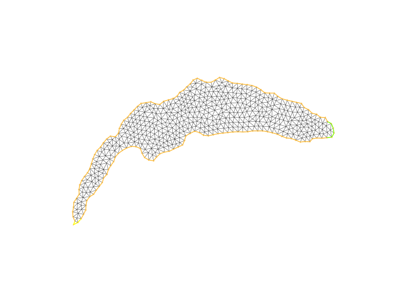|
