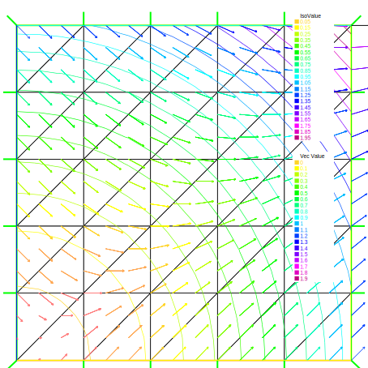
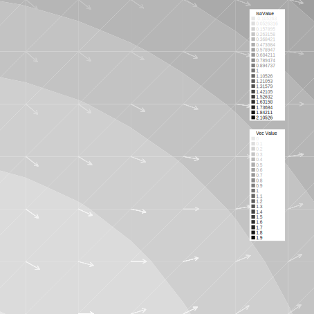
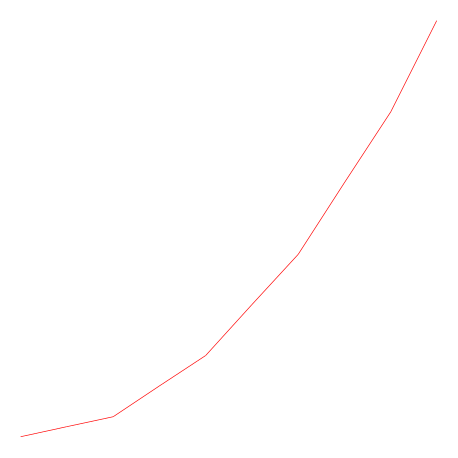
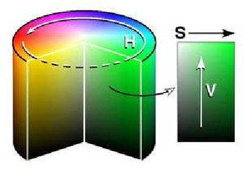
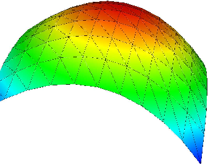

# Visualization

Results created by the finite element method can be a huge set of data, so it is very important to render them easy to grasp.

There are two ways of visualization in FreeFem++:

* One, the default view, supports the drawing of meshes, isovalues of real FE-functions and of vector fields, all by the command `:::freefem plot` (see [Plot section](#plot) below). For publishing purpose, FreeFem++ can store these plots as postscript files.

* Another method is to use external tools, for example, gnuplot (see [Gnuplot section](#gnuplot), [medit section](#medit)) using the command `:::freefem system` to launch them and/or to save the data in text files.

## Plot

With the command `:::freefem plot`, meshes, isovalues of scalar functions and vector fields can be displayed.

The parameters of the plot command can be meshes, real FE functions, arrays of 2 real FE functions, arrays of two arrays of double, to plot respectively a mesh, a function, a vector field, or a curve defined by the two arrays of double.

!!! note
	The length of an arrow is always bound to be in [5‰, 5%] of the screen size, to see something (else it will only look like porcupine).

The `:::freefem plot` command parameters are listed int the [Reference part](../reference/Functions/#plot).

The keyboard shortcuts are :

* __enter__ try to show plot
* __p__ previous plot (10 plots saved)
* __?__ show this help
* __+,-__ zoom in/out around the cursor 3/2 times
* __=__ reset vue
* __r__ refresh plot
* __up, down, left, right__ special keys to tanslate
* __3__ switch 3d/2d plot keys :

	__- z,Z__ focal zoom unzoom
	__- H,h__ switch increase or decrease the Z scale of the plot
	__- mouse motion__
	__- left button__ rotate
	__- right button__ zoom (ctrl+button on mac)
	__- right button +alt__ tanslate (alt+ctrl+button on mac)

* __a,A__ increase or decrease the arrow size
* __B__ switch between show border meshes or not
* __i,I__ update or not: the min/max bound of the functions to the window
* __n,N__ decrease or increase the number of iso value array
* __b__ switch between black and white or color plotting
* __g__ switch between grey or color plotting
* __f__ switch between filling iso or iso line
* __l__ switch between lighting or not
* __v__ switch between show or not the numerical value of colors
* __m__ switch between show or not meshes
* __w__ window dump in file ffglutXXXX.ppm
* __*__ keep/unkeep viewpoint for next plot
* __k__ complex data / change view type
* __ESC__ close the graphics process before version 3.22, after no way to close.
* __otherwise__ do nothing.

For example:

```freefem
real[int] xx(10), yy(10);

mesh Th = square(5,5);

fespace Vh(Th, P1);

//plot scalar and vectorial FE function
Vh uh=x*x+y*y, vh=-y^2+x^2;
plot(Th, uh, [uh, vh], value=true, ps="three.eps", wait=true);

//zoom on box defined by the two corner points [0.1,0.2] and [0.5,0.6]
plot(uh, [uh, vh], bb=[[0.1, 0.2], [0.5, 0.6]],
	wait=true, grey=true, fill=true, value=true, ps="threeg.eps");

//compute a cut
for (int i = 0; i < 10; i++){
	x = i/10.;
	y = i/10.;
	xx[i] = i;
	yy[i] = uh; //value of uh at point (i/10., i/10.)
}
plot([xx, yy], ps="likegnu.eps", wait=true);
```

|Fig. 1: mesh, isovalue, and vector|Fig. 2: Enlargement in grey of isovalue, and vector|
|:----:|:----:|
|||

<center>

|Fig. 3: Plots a cut of uh. Note that a refinement of the same can be obtained in combination with gnuplot|
|:----:|
||

</center>

To change the color table and to choose the value of iso line you can do :

```freefem
// from: \url{http://en.wikipedia.org/wiki/HSV_color_space}
// The HSV (Hue, Saturation, Value) model defines a color space
// in terms of three constituent components:
// HSV color space as a color wheel
// Hue, the color type (such as red, blue, or yellow):
// Ranges from 0-360 (but normalized to 0-100% in some applications like here)
// Saturation, the "vibrancy" of the color: Ranges from 0-100%
// The lower the saturation of a color, the more "grayness" is present
// and the more faded the color will appear.
// Value, the brightness of the color: Ranges from 0-100%

mesh Th = square(10, 10, [2*x-1, 2*y-1]);

fespace Vh(Th, P1);
Vh uh=2-x*x-y*y;

real[int] colorhsv=[ // color hsv model
	4./6., 1 , 0.5, // dark blue
	4./6., 1 , 1, // blue
	5./6., 1 , 1, // magenta
	1, 1. , 1, // red
	1, 0.5 , 1 // light red
	];
 real[int] viso(31);

 for (int i = 0; i < viso.n; i++)
	viso[i] = i*0.1;

 plot(uh, viso=viso(0:viso.n-1), value=true, fill=true, wait=true, hsv=colorhsv);
```

|Fig. 4: hsv color cylinder|Fig. 5: isovalue with an other color table|
|:----:|:----:|
|||

## Link with gnuplot

Example [Membrane](../tutorial/Membrane) shows how to generate a gnuplot from a FreeFem++ file. Let us present here another technique which has the advantage of being online, i.e. one doesn't need to quit FreeFem++ to generate a gnuplot.

But this work only if [gnuplot](http://www.gnuplot.info) is installed, and only on unix-like computer.

Add to the previous example:

```freefem
{// file for gnuplot
	ofstream gnu("plot.gp");
	for (int i = 0; i < n; i++)
		gnu << xx[i] << " " << yy[i] << endl;
}

// to call gnuplot command and wait 5 second (thanks to unix command)
// and make postscript plot
exec("echo 'plot \"plot.gp\" w l \n pause 5 \n set term postscript \n set output \"gnuplot.eps\" \n replot \n quit' | gnuplot");
```

|Fig. 6: Plots a cut of uh with gnuplot|
|:----:|
||

## Link with medit

As said above, `medit` is a freeware display package by Pascal Frey using OpenGL. Then you may run the following example.

Now medit software is included in FreeFem++ under ffmedit name.

The `:::freefem medit` command parameters are listed int the [Reference part](../reference/ExternalLibraries/#medit).

<center>

|Fig. 7: medit plot|
|:----:|
||

</center>

With version 3.2 or later

```freefem
load "medit"

mesh Th = square(10, 10, [2*x-1, 2*y-1]);

fespace Vh(Th, P1);
Vh u=2-x*x-y*y;

medit("u", Th, u);
```

Before:

```freefem
mesh Th = square(10, 10, [2*x-1, 2*y-1]);

fespace Vh(Th, P1);
Vh u=2-x*x-y*y;

savemesh(Th, "u", [x, y, u*.5]); //save u.points and u.faces file
// build a u.bb file for medit
{
	ofstream file("u.bb");
	file << "2 1 1 " << u[].n << " 2 \n";
	for (int j = 0; j < u[].n; j++)
		file << u[][j] << endl;
}
//call medit command
exec("ffmedit u");
//clean files on unix-like OS
exec("rm u.bb u.faces u.points");
```

## Link with Paraview
$\codered$
