$$
\newcommand{\vecttwo}[2]{\left|\begin{array}{c}{#1}\\#2\end{array}\right.}
\newcommand{\vectthree}[3]{\left|\begin{array}{c}{#1}\\#2\\#3\end{array}\right.}
$$

# Use of fespace in 2d

With the 2d finite element spaces

$$  X_{h} = \{ v \in H^{1}(]0,1[^2) |\; \forall K \in \mathcal{T}_{h}
\quad v_{|K} \in
P_{1} \}$$

$$ X_{ph} = \{  v \in X_{h} |\; v(\vecttwo{0}{.} ) =  v(\vecttwo{1}{.}) , v(\vecttwo{.}{0} ) =  v(\vecttwo{.}{1} )  \}$$

$$  M_{h} = \{ v \in H^{1}(]0,1[^2) |\; \forall K \in \mathcal{T}_{h}
\quad v_{|K} \in
P_{2} \}$$

$$  R_{h} = \{ \mathbf{v} \in H^{1}(]0,1[^2)^{2} |\; \forall K \in \mathcal{T}_{h}
\quad
 \mathbf{v}_{|K}(x,y) =
         \vecttwo{\alpha_{K}}{\beta_{K}} + \gamma_{K}\vecttwo{x}{y} \}$$

when $\mathcal{T}_h$ is a mesh $10\times 10$ of the unit square $]0,1[^2$,
we only write in FreeFem++ :

```freefem
mesh Th=square(10,10);
fespace Xh(Th,P1); // scalar FE
fespace Xph(Th,P1,
         periodic=[[2,y],[4,y],[1,x],[3,x]]); // bi-periodic FE
fespace Mh(Th,P2); // scalar FE
fespace Rh(Th,RT0); // vectorial FE
```

where `:::freefem Xh,Mh,Rh` expresses finite element spaces (called FE spaces
) $X_h,\, M_h,\, R_h$, respectively.

To use FE-functions
$ u_{h},v_{h} \in X_{h} $,  $ p_{h},q_{h} \in M_{h} $
and $U_{h},V_{h} \in R_{h}$
, we write :

```freefem
  Xh uh,vh;
  Xph uph,vph;
  Mh ph,qh;
  Rh [Uxh,Uyh],[Vxh,Vyh];
  Xh[int] Uh(10); // array of 10 function in Xh
  Rh[int] [Wxh,Wyh](10); // array of 10 functions in Rh.
  Wxh[5](0.5,0.5) // the 6th  function at point $(0.5,0.5)$
  Wxh[5][] // the array of the degree of freedom of the 6 function.
```

The functions $U_{h},V_{h}$ have two components so we have

$$U_{h}=\vecttwo{Uxh}{Uyh} \quad \mbox{and}\quad V_{h}=\vecttwo{Vxh}{Vyh}$$

# Use of fespace in 3d

With the 3d finite element spaces
$$  X_{h} = \{ v \in H^{1}(]0,1[^3) |\; \forall K \in \mathcal{T}_{h}
\quad v_{|K} \in
P_{1} \}$$
$$ X_{ph} = \{  v \in X_{h} |\; v(\vecttwo{0}{.} ) =  v(\vecttwo{1}{.}) , v(\vecttwo{.}{0} ) =  v(\vecttwo{.}{1} )  \}$$
$$  M_{h} = \{ v \in H^{1}(]0,1[^2) |\; \forall K \in \mathcal{T}_{h}
\quad v_{|K} \in
P_{2} \}$$
$$  R_{h} = \{ \mathbf{v} \in H^{1}(]0,1[^2)^{2} |\; \forall K \in \mathcal{T}_{h}
\quad
 \mathbf{v}_{|K}(x,y) =
         \vecttwo{\alpha_{K}}{\beta_{K}} + \gamma_{K}\vecttwo{x}{y} \}$$

when $\mathcal{T}_h$ is a mesh $10\times 10\times 10$ of the unit cubic  $]0,1[^2$,
we write in FreeFem++ :

```freefem
mesh3 Th=buildlayers(square(10,10),10, zbound=[0,1]);
// label:  0 up, 1 down; 2 front, 3 left, 4 back, 5: right
fespace Xh(Th,P1); // scalar FE
fespace Xph(Th,P1,
         periodic=[[0,x,y],[1,x,y],
                   [2,x,z],[4,x,z],
                   [3,y,z],[5,y,z]]); // three-periodic FE (see Note \ref{note-p3d} $\codered$)
fespace Mh(Th,P2); // scalar FE
fespace Rh(Th,RT03d); // vectorial FE
```

where `:::freefem Xh,Mh,Rh` expresses finite element spaces (called FE spaces
) $X_h,\, M_h,\, R_h$, respectively.

To define and use FE-functions
$ u_{h},v_{h} \in X_{h} $ and $ p_{h},q_{h} \in M_{h} $
and $U_{h},V_{h} \in R_{h}$, we write:

```freefem
  Xh uh,vh;
  Xph uph,vph;
  Mh ph,qh;
  Rh [Uxh,Uyh,Uyzh],[Vxh,Vyh, Vyzh];
  Xh[int] Uh(10); // array of 10 function in Xh
  Rh[int] [Wxh,Wyh,Wzh](10); // array of 10 functions in Rh.
  Wxh[5](0.5,0.5,0.5) // the 6th  function at point $(0.5,0.5,0.5)$
  Wxh[5][] // the array of the degre of freedom of the 6 function.
```

The functions $U_{h},V_{h}$ have three components so we have

$$U_{h}=\vectthree{Uxh}{Uyh}{Uzh}  \quad \mbox{and}\quad V_{h}=\vectthree{Vxh}{Vyh}{Vzh}$$

!!! note
	One hard  problem of the periodic boundary condition is the mesh must be the same au equivalence face, the BuildLayer mesh generator split each  quadrilateral  faces with the diagonal passing through vertex with maximal number, so to be sure to have the same mesh one both face periodic the 2d numbering in corresponding edges must be compatible (for example the same variation). By Default, the numbering of square vertex are correct.

	To change the mesh numbering you can used the `:::freefem change` function like:

	```freefem
	{ // for cleanning  memory..
	int[int] old2new(0:Th.nv-1);// array set on 0, 1, .., nv-1
	fespace Vh2(Th,P1);
	Vh2 sorder=x+y; // choose an ordering  increasing on 4 square borders with x or y
	sort(sorder[],old2new); // build the inverse permutation
	int[int]  new2old=old2new^-1; // inverse the permutation
	Th= change(Th,renumv=new2old);
	}
	```

	The full example is in `:::freefem examples++-3d/periodic-3d.edp` $\codered$

# Lagrangian Finite Elements

## P0-element
For each triangle (d=2)  or tetrahedron (d=3)  $T_k$, the basis function $\phi_k$ in `:::freefem Vh(Th,P0)`
is given by

$$
\phi_k(\mathbf{x})=1\textrm{ if }(\mathbf{x})\in T_k,\qquad
\phi_k(\mathbf{x})=0\textrm{ if }(\mathbf{x})\not\in T_k
$$

If we write

```freefem
Vh(Th,P0);  Vh fh = f(x,y);
```

then for vertices $q^{k_i},\, i=1,2,.. d+1 $ in Fig. \ref{P1P2} $\codered$(a), $f_h$ is built as

<center>
`:::freefem fh=` $\displaystyle f_h(x,y)=\sum_k f(\frac{\sum_i q^{k_i}}{d+1}) \phi_k$
</center>

See Fig. \ref{projP0} $\codered$ for the projection of $f(x,y)=\sin(\pi x)\cos(\pi y)$
on `:::freefem Vh(Th,P0)` when
the mesh `:::freefem Th` is a $4\times 4$-grid of $[-1,1]^2$ as in Fig. \ref{P0P1P2P1nc} $\codered$.

## P1-element

<center>

|Fig. 6.1: $P_1$  and $P_2$ degrees of freedom on triangle $T_k$|
|:----:|
|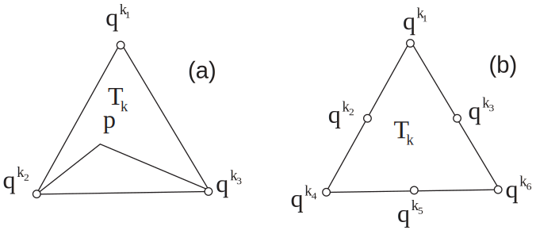|

</center>

For each vertex $q^i$, the basis function $\phi_i$ in `:::freefem Vh(Th,P1)`
is given by

\begin{eqnarray*}
&&\phi_i(x,y)=a^k_i+b^k_ix+c^k_iy~\textrm{for }(x,y)\in T_k,\\
&&\phi_i(q^i)=1,\quad \phi_i(q^j)=0\textrm{ if }i\neq j
\end{eqnarray*}

The basis function $\phi_{k_1}(x,y)$ with the vertex $q^{k_1}$ in
Fig. \ref{P1P2} $\codered$(a) at point $p=(x,y)$ in triangle $T_k$ simply coincide with the
_barycentric coordinates $\lambda^k_1$ (area coordinates)_ :
$$
\phi_{k_1}(x,y) = \lambda^k_{1}(x,y)=
\frac{\textrm{area of triangle} (p, q^{k_2},q^{k_3})}
{\textrm{area of triangle}(q^{k_1},q^{k_2},q^{k_3})}
$$
If we write

```freefem
Vh(Th,P1); Vh fh = g(x.y);
```

then

<center>
`:::freefem fh =` $\displaystyle f_h(x,y)=\sum_{i=1}^{n_v}f(q^i)\phi_i(x,y)$
</center>

See Fig. 6.4 $\codered$ for the projection of $f(x,y)=\sin(\pi x)\cos(\pi y)$
into `:::freefem Vh(Th,P1)`.

|Fig. 6.2: Test mesh `:::freefem Th` for projection|Fig. 6.3: Projection to `:::freefem Vh(Th,P0)`|
|:----:|:----:|
|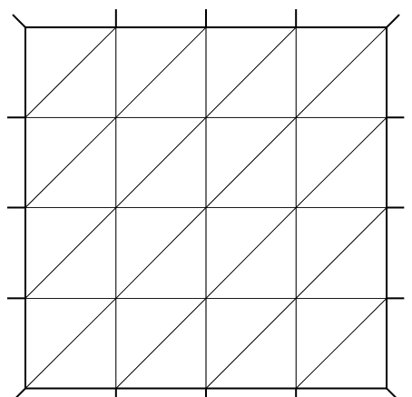|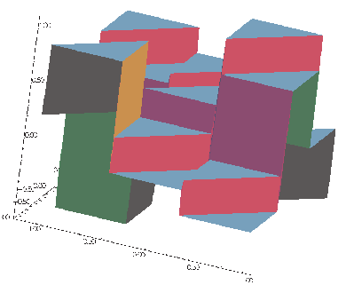|

## P2-element
For each vertex or midpoint $q^i$. the basis function $\phi_i$ in `:::freefem Vh(Th,P2)`
is given by :

\begin{eqnarray*}
&&\phi_i(x,y)=a^k_i+b^k_ix+c^k_iy+d^k_ix^2+e^k_ixy+f^f_jy^2~\textrm{for }(x,y)\in T_k,\\
&&\phi_i(q^i)=1,\quad \phi_i(q^j)=0\textrm{ if }i\neq j
\end{eqnarray*}

The basis function $\phi_{k_1}(x,y)$ with the vertex $q^{k_1}$ in
Fig. 6.1 (b) $\codered$(b) is defined by the _barycentric coordinates_:

$$
\phi_{k_1}(x,y) = \lambda^k_{1}(x,y)(2\lambda^k_1(x,y)-1)
$$

and for the midpoint $q^{k_2}$

$$
\phi_{k_2}(x,y) = 4\lambda^k_1(x,y)\lambda^k_4(x,y)
$$

If we write :

```freefem
Vh(Th,P2); Vh fh = f(x.y);
```

then :
<center>
`:::freefem fh =` $\displaystyle f_h(x,y)=\sum_{i=1}^{M}f(q^i)\phi_i(x,y)\quad (\textrm{summation over all vetex or midpoint})$
</center>

See Fig. 6.5 $\codered$ for the projection of $f(x,y)=\sin(\pi x)\cos(\pi y)$ into `:::freefem Vh(Th,P2)`.

|Fig. 6.4: projection to `:::freefem Vh(Th,P1)`|Fig. 6.5: projection to `:::freefem Vh(Th,P2)`|
|:----:|:----:|
|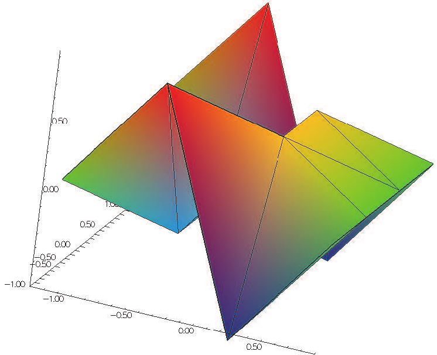|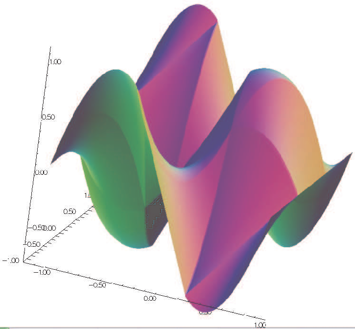|

# P1 Nonconforming Element

Refer to \cite{Thomasset} $\codered$ for details; briefly, we now consider non-continuous approximations
so we shall lose the property

$$
w_h\in V_h\subset H^1(\Omega)
$$

If we write

```freefem
Vh(Th,P1nc); Vh fh = f(x.y);
```

then

<center>
`:::freefem fh =` $\displaystyle f_h(x,y)=\sum_{i=1}^{n_v}f(m^i)\phi_i(x,y)\quad (\textrm{summation over all midpoint})$
</center>

Here the basis function $\phi_i$ associated with the midpoint
$m^i=(q^{k_i}+q^{k_{i+1}})/2$ where $q^{k_i}$ is the $i$-th point in $T_k$,
and we assume that $j+1=0$ if $j=3$:

\begin{eqnarray*}
&&\phi_i(x,y)=a^k_i+b^k_ix+c^k_iy~\textrm{for }(x,y)\in T_k,\\
&&\phi_i(m^i)=1,\quad \phi_i(m^j)=0\textrm{ if }i\neq j
\end{eqnarray*}

Strictly speaking $\p \phi_i/\p x,\, \p \phi_i/\p y$
contain Dirac distribution $\rho \delta_{\p T_k}$.
The numerical calculations will automatically _ignore_ them.
In \cite{Thomasset} $\codered$, there is a proof of the estimation
\[
\left(\sum_{k=1}^{n_v}\int_{T_k}|\nabla w-\nabla w_h|^2\d x\d y\right)^{1/2}
=O(h)
\]

The basis functions $\phi_k$ have the following properties.

1.  For the bilinear form $a$ defined in Fig. 2.6 $\codered$ satisfy
	\begin{eqnarray*}
	&&a(\phi_i,\phi_i)>0,\qquad a(\phi_i,\phi_j)\le 0\quad\textrm{if }i\neq j\\
	&&\sum_{k=1}^{n_v}a(\phi_i,\phi_k)\ge 0
	\end{eqnarray*}

2. $f\ge 0 \Rightarrow u_h\ge 0$

3. If $i\neq j$, the basis function $\phi_i$ and $\phi_j$ are $L^2$-orthogonal:
	$$
	\int_{\Omega}\phi_i\phi_j\, \d x\d y=0\qquad \textrm{if }i\neq j
	$$
	which is false for $P_1$-element.

See Fig. 6.6 $\codered$ for the projection of $f(x,y)=\sin(\pi x)\cos(\pi y)$
into `:::freefem Vh(Th,P1nc)`.

|Fig. 6.6: Projection to `:::freefem Vh(Th,P1nc)`|Fig. 6.7: Projection to `:::freefem Vh(Th,P1b)`|
|:----:|:----:|
|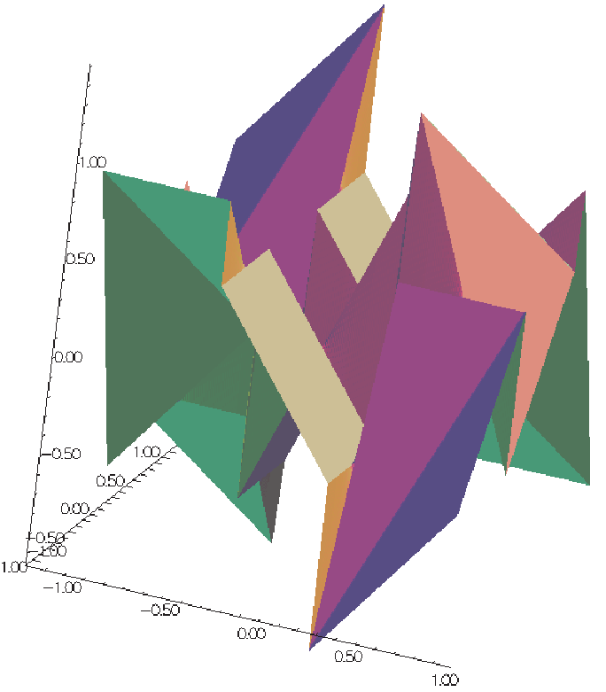|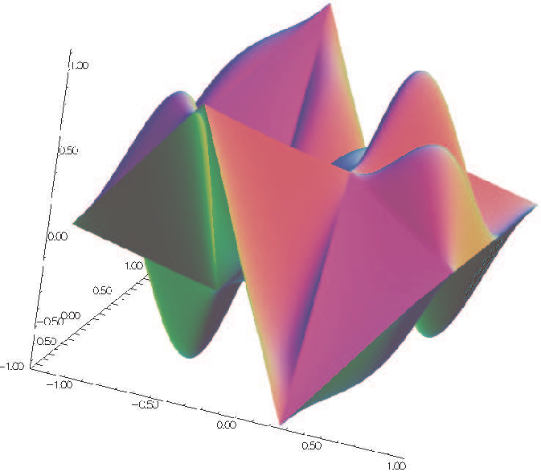|

# Other FE-space

For each triangle $T_k\in \mathcal{T}_h$,
let $\lambda_{k_1}(x,y),\, \lambda_{k_2}(x,y),\, \lambda_{k_3}(x,y)$ be the area cordinate
of the triangle (see Fig. 6.1 $\codered$), and put

\begin{equation}
\beta_k(x,y)=27\lambda_{k_1}(x,y)\lambda_{k_2}(x,y)\lambda_{k_3}(x,y)
\end{equation}

called _bubble_ function on $T_k$.
The bubble function has the feature:
1. $\beta_k(x,y)=0\quad \textrm{if }(x,y)\in \p T_k$.

2. $\beta_k(q^{k_b})=1$ where $q^{k_b}$ is the barycenter $\frac{q^{k_1}+q^{k_2}+q^{k_3}}{3}$.

If we write :

```freefem
Vh(Th,P1b); Vh fh = f(x.y);
```

then

<center>
`:::freefem fh =` $\displaystyle f_h(x,y)=\sum_{i=1}^{n_v}f(q^i)\phi_i(x,y)+\sum_{k=1}^{n_t}f(q^{k_b})\beta_k(x,y)$
</center>

See Fig. 6.7 $\codered$ for the projection of $f(x,y)=\sin(\pi x)\cos(\pi y)$
into `:::freefem Vh(Th,P1b)`.

# Vector valued FE-function

Functions from  $\R^{2}$ to $\R^{N}$ with $N=1$ is called scalar function and
called _vector valued_ when $N>1$.
When $N=2$

```freefem
     fespace Vh(Th,[P0,P1]) ;
```

make the space

\[
V_h=\{\mathbf{w}=(w_1,w_2)|\; w_1\in V_h(\mathcal{T}_h,P_0),\,
w_2\in V_h(\mathcal{T}_h,P_1)\}
\]

## Raviart-Thomas element

In the Raviart-Thomas finite element $RT0_{h}$,
the degree of freedom are the fluxes  across edges $e$ of the mesh, where the flux of the function $\mathbf{f} : \R^2 \longrightarrow \R^2 $ is $\int_{e} \mathbf{f}.n_{e}$,
 $n_{e}$ is the unit normal of edge $e$.

 This implies a orientation of all the edges of the mesh,
 for example we can use the global numbering of the edge vertices and we just go from small to large numbers.

To compute the flux, we use a quadrature  with one Gauss point, the middle point of the edge.
Consider a triangle $T_k$ with three vertices $(\mathbf{a},\mathbf{b},\mathbf{c})$.
Let denote the  vertices numbers by $i_{a},i_{b},i_{c}$, and define the three edge
vectors $\mathbf{e}^{1},\mathbf{e}^{2},\mathbf{e}^{3}$
by $ sgn(i_{b}-i_{c})(\mathbf{b}-\mathbf{c})$, $sgn(i_{c}-i_{a})(\mathbf{c}-\mathbf{a})$,
$sgn(i_{a}-i_{b})(\mathbf{a}-\mathbf{b})$.

We get three basis functions :

\begin{equation}
\boldsymbol{\phi}^{k}_{1}= \frac{sgn(i_{b}-i_{c})}{2|T_k|}(\mathbf{x}-\mathbf{a}),\quad
\boldsymbol{\phi}^{k}_{2}= \frac{sgn(i_{c}-i_{a})}{2|T_k|}(\mathbf{x}-\mathbf{b}),\quad
\boldsymbol{\phi}^{k}_{3}= \frac{sgn(i_{a}-i_{b})}{2|T_k|}(\mathbf{x}-\mathbf{c}),
\end{equation}

where $|T_k|$ is the area of the triangle $T_k$.
If we write

```freefem
Vh(Th,RT0); Vh [f1h,f2h]=[f1(x.y),f2(x,y)];
```

then

<center>
`:::freefem fh =` $\displaystyle \vec{f}_h(x,y)=\sum_{k=1}^{n_t}\sum_{l=1}^6
n_{i_lj_l}|\mathbf{e^{i_l}}|f_{j_l}(m^{i_l})\phi_{i_lj_l}$
</center>

where $n_{i_lj_l}$ is the $j_l$-th component of the normal vector $\vec{n}_{i_l}$,

$$
\{m_1,m_2,m_3\} = \left\{\frac{\mathbf{b}+\mathbf{c}}{2},
\frac{\mathbf{a}+\mathbf{c}}{2},
\frac{\mathbf{b}+\mathbf{a}}{2} \right\}
$$

and $i_l=\{1,1,2,2,3,3\},\, j_l=\{1,2,1,2,1,2\}$ with the order of $l$.

<center>

|Fig. 6.8: Normal vectors of each edge|
|:----:|
|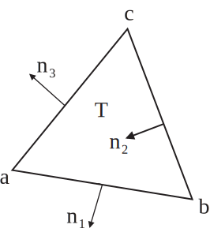|

</center>

```freefem
mesh Th=square(2,2);
fespace Xh(Th,P1);
fespace Vh(Th,RT0);
Xh uh,vh;
Vh [Uxh,Uyh];
[Uxh,Uyh] = [sin(x),cos(y)]; // ok vectorial FE function
vh= x^2+y^2; // vh
Th = square(5,5); // change the mesh
// Xh is unchange
uh = x^2+y^2; // compute on the new Xh
Uxh = x; // error: impossible to set only 1 component
// of  a vector FE function.
vh = Uxh; // ok
// and now uh use the 5x5 mesh
// but the fespace of vh is alway the 2x2 mesh
plot(uh,ps="onoldmesh.eps"); // figure \ref{onoldmesh} $\codered$
uh = uh; // do a interpolation of vh (old) of 5x5 mesh
// to get the new vh on 10x10 mesh.
plot(uh,ps="onnewmesh.eps"); // figure \ref{onnewmesh} $\codered$
vh([x-1/2,y])= x^2 + y^2; // interpolate vh = $((x-1/2)^2 + y^2)  $
```

<center>
$\codered$

|Fig. 6.9: `:::freefem vh` Iso on mesh $2\times 2$|Fig. 6.10: `:::freefem vh` Iso on mesh $5\times 5$|
|:----:|:----:|
|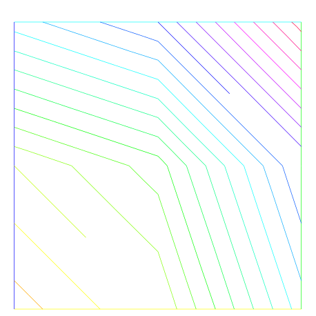|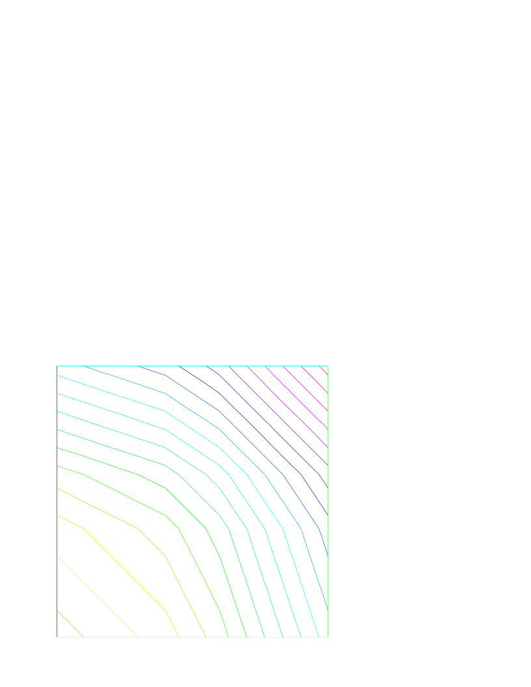|

</center>

To get the value at a point $x=1,y=2$ of the FE function `:::freefem uh`, or `:::freefem [Uxh,Uyh]`,one writes :

```freefem
real value;
value = uh(2,4); // get value= uh(2,4)
value = Uxh(2,4); // get value= Uxh(2,4)
// ------  or ------
x=1;y=2;
value = uh; // get value= uh(1,2)
value = Uxh; // get value= Uxh(1,2)
value = Uyh; // get value= Uyh(1,2).
```

To get the value of the array associated to the FE function `:::freefem uh`, one writes

```freefem
real value = uh[][0] ; // get the value of degree of freedom 0
real maxdf = uh[].max; // maximum value of degree of freedom
int size = uh.n; // the number of degree of freedom
real[int] array(uh.n)= uh[]; // copy the array of the function uh
```

!!! note
	 For a none scalar finite element function `:::freefem [Uxh,Uyh]` the two array `:::freefem Uxh[]` and  `:::freefem Uyh[]` are the same array, because the degree of freedom can touch more than one component.

# A Fast Finite Element Interpolator

In practice one may discretize the variational equations by the Finite Element method. Then
there will be one mesh for $\Omega_1$ and another one for $\Omega_2$. The computation of integrals of products of functions defined on different meshes is difficult.
Quadrature formulae and interpolations from one mesh to another at quadrature points are needed.
We present below the interpolation operator which we have used and which is new, to the best of our knowledge.

Let ${\cal T}_{h}^0=\cup_k T^0_k,{\cal T}_{h}^1=\cup_k T^1_k$ be two triangulations of a domain $\Omega$.
Let

$$
V({\hbox{${\cal T}$}_{h}^i}) =\{ C^0(\Omega_h^i)~:~f|_{T^i_k}\in P_0\},~~~i=0,1
$$

be the spaces of continuous piecewise affine functions on each triangulation.

Let $f\in V({\cal T}_{h}^0)$. The problem is to find $g\in V({\cal T}_{h}^1)$ such that

$$
g(q) = f(q) \quad \forall q\hbox{~vertex of ~} {\cal T}_{h}^1
$$

Although this is a seemingly simple problem, it is difficult to find an
efficient algorithm in practice.
We propose an algorithm which is of complexity  $N^1\log N^0$, where $N^i$ is
the number of vertices of ${\hbox{${\cal T}$}_{h}^i}$, and which
is very fast for most practical 2D applications.

__Algorithm__

The method has 5 steps. First a quadtree is built containing all the vertices of mesh ${\cal T}_{h}^0$ such that in each terminal cell there are at least one, and at most 4, vertices of ${\cal T}_{h}^0$. For each $q^1$, vertex of ${\cal T}_{h}^1$ do:

1. Find the terminal cell of the quadtree containing $q^1$.
2. Find the the nearest vertex $q^0_j$ to $q^1$ in that cell.
3. Choose one triangle $T_k^0\in{\cal T}_{h}^0$ which has $q^0_j$ for vertex.
4. Compute the barycentric coordinates $\{\lambda_j\}_{j=1,2,3}$ of $q^1$ in $T^0_k$.
	* if all barycentric coordinates are positive, go to Step 5
	* else if one barycentric coordinate $\lambda_i$ is negative replace $T^0_k$ by the adjacent triangle opposite $q^0_i$ and go to Step 4.
	* else two barycentric coordinates are negative so take one of the two randomly and replace $T^0_k$ by the adjacent triangle as above.

5. Calculate $g(q^1)$ on $T^0_k$ by linear interpolation of $f$:
	$$
	g(q^1) = \sum_{j=1,2,3} \lambda_j f(q^0_j)
	$$

<center>

|Fig. 6.11 To interpolate a function at $q^0$ the knowledge of the triangle which contains $q^0$ is needed.  The algorithm may start at $q^1\in T_k^0$ and stall on the boundary (thick line) because the line $q^0q^1$ is not inside $\Omega$. But if the holes are triangulated too (doted line) then the problem does not arise.|
|:----|
|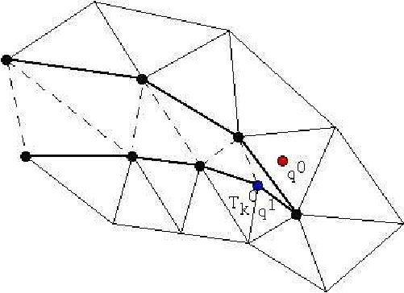|

</center>

Two problems need to be solved:

* _What if $q^1$ is not in $\Omega^0_h$ ?_  Then Step 5 will stop with a
 boundary triangle. So we add a step which test the distance of $q^1$ with the
 two adjacent boundary edges and select the nearest, and so on till the distance
 grows.

* _What if $\Omega^0_h$ is not convex and the marching process of Step 4 locks on a boundary?_ By construction  Delaunay-Voronoï mesh generators always triangulate the convex hull of the vertices of the domain. So we make sure that this information is not lost when ${\cal T}_{h}^0,{\cal T}_{h}^1$ are constructed and we keep the triangles which are outside the domain in a special list. Hence in step 5 we can use that list to step over holes if needed.

!!! note
	Some time in rare case the interpolation process miss some point, we cane change the seach algorithm through global variable `:::freefem searchMethod`

	```freefem
	searchMethod=0; // default value for  fast search algorithm
	searchMethod=1; // safe seach algo,  use brute force in case of missing point
	// (warning can be very expensive in case of lot point  of ouside domain)
	searchMethod=2; // use alway the  brute force very very expensive
	```

!!! note

	Step 3 requires an array of pointers
	such that each vertex points to one triangle
	of the triangulation.


!!! note
	The operator `:::freefem =` is the interpolation operator of FreeFem++,  The continuous finite functions are extended by continuity to the outside of the domain.

	Try the following example :

	```freefem
	mesh Ths= square(10,10);
	mesh Thg= square(30,30,[x*3-1,y*3-1]);
	plot(Ths,Thg,ps="overlapTh.eps",wait=1);
	fespace Ch(Ths,P2); fespace Dh(Ths,P2dc);
	fespace Fh(Thg,P2dc);
	Ch us= (x-0.5)*(y-0.5);
	Dh vs= (x-0.5)*(y-0.5);
	Fh ug=us,vg=vs;
	plot(us,ug,wait=1,ps="us-ug.eps"); // See fig. 6.12
	plot(vs,vg,wait=1,ps="vs-vg.eps"); // See fig. 6.13
	```

	<center>

	|Fig. 6.12: Extension of a continuous FE-function|Fig. 6.13: Extention of discontinuous FE-function|
	|:----:|:----:|
	|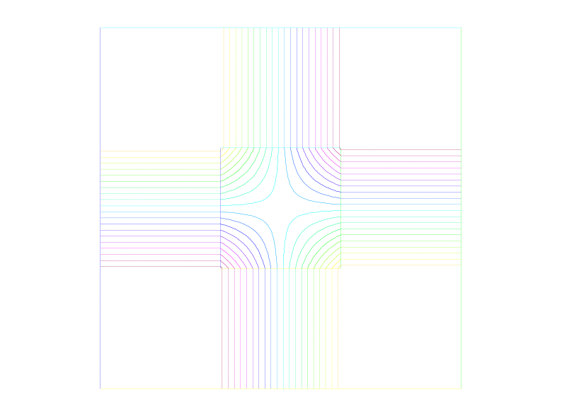|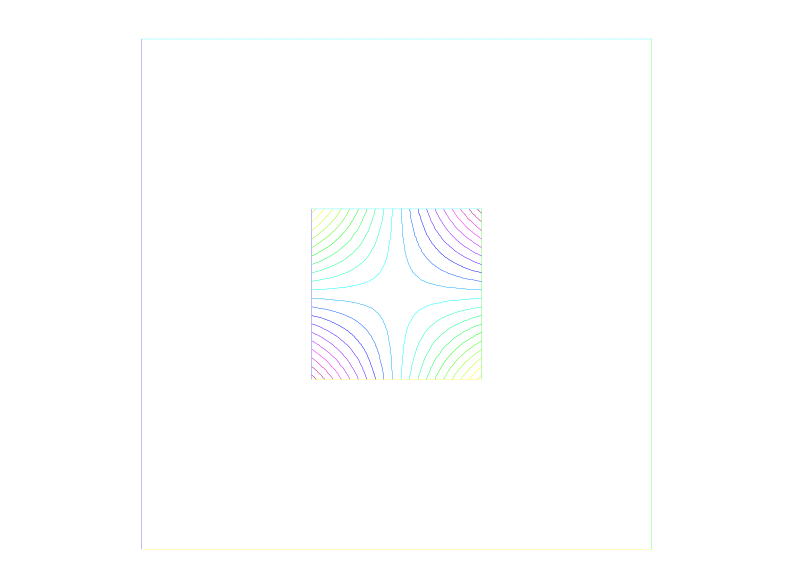|

	</center>

# Keywords: Problem and Solve

For FreeFem++  a problem must be given in variational form, %\cite{blop} $\codered$, so we need a bilinear form $a(u,v)$, a linear form $\ell(f,v)$, and possibly a boundary condition form must be added.

```freefem
problem P(u,v) =
     a(u,v) - $\ell$(f,v)
     + (boundary condition);
```

!!! note
	When you want to formulate the problem and to solve it in the same time, you can use the keywork `:::freefem solve`.


## Weak form and Boundary Condition

To present the principles  of Variational Formulations or also called weak forms fr the PDEs,
let us take a model problem : a Poisson equation with  Dirichlet and Robin Boundary condition
.

The problem is: Find $u$ a real function defined on  domain $\Omega$ of $\R^d$ $(d=2,3)$ such that

\begin{equation} -  \nabla.(\kappa \nabla u) = f  , \quad \mbox{in}\quad \Omega, \quad
 a u + \kappa \frac{\p u}{\p n} = b \quad\mbox{on}\quad \Gamma_r, \quad
 u = g  \quad\mbox{on}\quad \Gamma_d
 \end{equation}

where

* if $d=2$ then  $ \nabla.(\kappa \nabla u) = \p_x(\kappa \p_x u ) + \p_y(\kappa \p_y u ) $
with $ \p_x u = \frac{\p u}{\p x}$
and $\p_y u = \frac{\p u}{\p y}$

* if $d=3$ then $\nabla.(\kappa \nabla u) = \p_x(\kappa \p_x u) + \p_y(\kappa \p_y u) +  \p_z(\kappa \p_z u)$
with $ \p_x u = \frac{\p u}{\p x}$, $\p_y u = \frac{\p u}{\p y}$ and , $\p_z u = \frac{\p u}{\p z}$

* The border $\Gamma=\p \Omega$ is split in $\Gamma_d$ and $\Gamma_n$
such that $\Gamma_d \cap \Gamma_n = \emptyset$ and $ \Gamma_d \cup \Gamma_n = \p \Omega$,

* $\kappa$ is a given positive function, such that $\exists \kappa_0 \in \R ,\quad 0 < \kappa_0  \leq \kappa $.

* $a$ a given non negative function,

* $b$ a given function.

!!! note
	This is the well known Neumann boundary condition if $a=0$, and if $\Gamma_d$ is empty. In this case the function appears in the problem just by its derivatives, so it is defined only up to a constant (if $u$ is a solution then $u+c$ is also a solution).

Let  ${ v}$ a regular test function null on $\Gamma_d$, by integration by parts we get :
 \begin{equation}-\int_{\Omega}  \nabla.(\kappa \nabla  u) \, {v} \,d\omega = \int_{\Omega}  \kappa \nabla{ v} . \nabla u  \,d\omega  - \int_{\Gamma} {v}
 \kappa \frac{  \p u}{\p \mathbf{n}}  \,d\gamma,= \int_{\Omega} f {v}  \,d\omega
  \end{equation}

where if $d=2$ the $ \nabla{ v} . \nabla u = (\frac{\p u}{\p x}\frac{\p { v}}{\p x}
+\frac{\p u}{\p y}\frac{\p { v}}{\p y})$,
where if $d=3$ the $ \nabla{ v} . \nabla u = (\frac{\p u}{\p x}\frac{\p { v}}{\p x}
+\frac{\p u}{\p y}\frac{\p { v}}{\p y} + \frac{\p u}{\p z}\frac{\p { v}}{\p z})$,
and where $\mathbf{n}$ is the unitary outside normal of $\Gamma$.

Now we note that $\kappa \frac{  \p u}{\p n} = - a u + b $  on $\Gamma_r$
and $v=0$ on $ \Gamma_d $ and $ \Gamma = \Gamma_d \cup \Gamma_n$
thus

$$
  - \int_{\Gamma} {v}
 \kappa \frac{  \p u}{\p n} = \int_{\Gamma_r} a u v - \int_{\Gamma_r} b v
$$

The problem becomes:

Find $u \in V_g = \{w \in H^1(\Omega) / w = g \mbox{ on } \Gamma_d \}$ such that
\begin{equation} {\int_{\Omega} \kappa \nabla{ v} . \nabla u  \,d\omega
 + \int_{\Gamma_r} a u v  \,d\gamma = \int_{\Omega} f {v}}  \,d\omega  + \int_{\Gamma_r} b v  \,d\gamma , \quad \forall v \in V_0
\end{equation}

where $V_0 = \{v \in H^1(\Omega) / v = 0 \mbox{ on } \Gamma_d \}$

Except in the case of Neumann conditions everywhere, the problem (\ref{eq:v-poisson} (6.29) $\codered$) is well posed when $\kappa\geq \kappa_0>0$.

!!! note
	If we have only Neumann boundary condition, linear algebra tells us that the right hand side must be orthogonal to the kernel of the operator for the solution to exist. One way of writing the compatibility condition is:

	$$
	 \int_{\Omega} f   \,d\omega  + \int_{\Gamma} b \,d\gamma=0
	$$

	and a way to fix the constant is to solve for $u \in H^1(\Omega)$ such that:
	\begin{equation}
	 {\int_{\Omega} \varepsilon u v \,\,d\omega\; + \; \kappa \nabla{ v} . \nabla u  \,d\omega
	  = \int_{\Omega} f {v}}  \,d\omega  + \int_{\Gamma_r} b v  \,d\gamma , \quad \forall v \in H^1(\Omega)
	\end{equation}
	where $\varepsilon$ is a small parameter ($ \sim \kappa\; 10^{-10} |\Omega|^{\frac2d} $).

	Remark that if the solution
	is of order $\frac{1}{\varepsilon}$ then the compatibility condition is unsatisfied, otherwise
	we get the solution such that $\int_\Omega u = 0 $, you can also add a Lagrange multiplier to solver
	the real mathemaical probleme like in the `:::freefem examples++-tutorial/Laplace-lagrange-mult.edp` $\codered$!
	example.


In FreeFem++, the bidimensional problem (\ref{eq:v-poisson} (6.29) $\codered$) becomes :

$\codered$
```freefem
problem Pw(u,v) =
	  int2d(Th)( kappa*( dx(u)*dx(v) +  dy(u)*dy(v)) ) // $\int_{\Omega} \kappa \nabla{v} . \nabla u  \,d\omega$ \hfilll
	+ int1d(Th,gn)( a * u*v ) // $\int_{\Gamma_r} a u v  \,d\gamma$  \hfilll
	- int2d(Th)(f*v) // $\int_{\Omega} f v  \,d\omega $ \hfilll
	- int1d(Th,gn)( b * v ) // $ \int_{\Gamma_r} b v  \,d\gamma$ \hfilll
	+ on(gd)(u= g) ; // $ u =g $ on $\Gamma_d$  \hfilll
```

where `:::freefem Th` is a mesh of the the bidimensional domain $\Omega$, and `:::freefem gd` and `:::freefem gn` are respectively the boundary label of boundary $\Gamma_d$ and $\Gamma_n$.

And the three dimensional problem (\ref{eq:v-poisson} (6.29) $\codered$) becomes

```freefem
macro Grad(u) [dx(u),dy(u),dz(u) ]//EOM :  definition of the 3d Grad macro
problem Pw(u,v) =
  	int3d(Th)( kappa*( Grad(u)'*Grad(v) ) ) // $\int_{\Omega} \kappa \nabla{v} . \nabla u  \,d\omega$ \hfilll
	+ int2d(Th,gn)( a * u*v ) // $\int_{\Gamma_r} a u v  \,d\gamma$  \hfilll
	- int3d(Th)(f*v) // $\int_{\Omega} f v  \,d\omega $ \hfilll
	- int2d(Th,gn)( b * v ) // $ \int_{\Gamma_r} b v  \,d\gamma$ \hfilll
	+ on(gd)(u= g) ; // $ u =g $ on $\Gamma_d$  \hfilll
```

where `:::freefem Th` is a mesh of the three dimensional  domain $\Omega$, and `:::freefem gd` and `:::freefem gn` are respectively the boundary label of boundary $\Gamma_d$ and $\Gamma_n$.

# Parameters affecting `:::freefem solve` and `:::freefem problem`

The parameters are FE functions real or complex, the number $n$ of parameters is even
($n=2*k$), the $k$ first function parameters are unknown, and the $k$
last are test functions.

!!! note
	 If the functions are a part of vectoriel FE then you must give  all the functions of the vectorial FE in the same order (see laplaceMixte problem $\codered$ for example).

!!! note
	 Don't mix complex and real parameters FE function.

!!! warning
	__Bug :__ The mixing of `:::freefem fespace` with different periodic boundary condition is not implemented. So all the finite element spaces used for test or unknown functions in a problem, must  have the same type of periodic boundary condition or no periodic boundary condition. No clean message is given and the result is impredictible, sorry.

The parameters are:

* __solver=__ `:::freefem LU`, `:::freefem CG`, `:::freefem Crout`,`:::freefem Cholesky`,`:::freefem GMRES`,`:::freefem sparsesolver`, `:::freefem UMFPACK` ...

	The default solver is `:::freefem sparsesolver` (it is equal to  `:::freefem UMFPACK` if not other sparce solver is defined) or is set to `:::freefem LU` if no direct sparse solver is available.
    The storage mode of the matrix of the underlying linear system depends on the type of solver chosen; for `:::freefem LU`  the matrix is sky-line non symmetric, for `:::freefem Crout` the matrix is sky-line symmetric, for `:::freefem Cholesky` the matrix is sky-line symmetric positive definite, for `:::freefem CG` the matrix is sparse symmetric positive, and for `:::freefem GMRES`, `:::freefem sparsesolver` or `:::freefem UMFPACK` the matrix is just sparse.

* __eps=__ a real expression. $\varepsilon$ sets the stopping test for the iterative methods like `:::freefem CG`. Note that if $\varepsilon$ is negative then the stopping test is:
    $$  || A x - b || < |\varepsilon| $$
    if it is positive then the stopping test is
    $$  || A x - b || < \frac{|\varepsilon|}{|| A x_{0} - b ||} $$

* __init=__ boolean expression, if it is false or 0 the matrix is reconstructed. Note that if the mesh changes the matrix is reconstructed too.

* __precon=__ name of a function (for example `:::freefem P`) to set the preconditioner. The prototype for the function `:::freefem P` must be

	```freefem
	    func real[int] P(real[int] & xx);
	```

* __tgv=__ Huge value ($10^{30}$) used to implement Dirichlet boundary conditions, see page \pageref{imple-tgv} $\codered$ for description.

* __tolpivot=__ set the tolerance of the pivot in `:::freefem UMFPACK` ($10^{-1}$) and, `:::freefem LU`, `:::freefem Crout`, `:::freefem Cholesky` factorisation ($10^{-20}$).


* __tolpivotsym=__ set the tolerance of the pivot sym in `:::freefem UMFPACK`

* __strategy=__ set the integer `:::freefem UMFPACK` strategy ($0$ by default).

# Problem definition

Below `:::freefem v` is the unknown function and `:::freefem w` is the test function.
After the "=" sign, one may find sums of:

* Identifier(s); this is the name given earlier to the variational form(s) (type `:::freefem varf` ) for possible reuse.

	Remark, that the name in the "varf" of the unknown of test function is forgotten, we just used the order in argument list to recall name as in a \Cpp function, see  note \ref{varf param} $\codered$,

* The terms of the bilinear form itself: if $K$ is a  given function,

* Bilinear part for 3d meshes `:::freefem Th`

	- `:::freefem int3d(Th)(K*v*w) = ` $\displaystyle\sum_{T\in\mathtt{Th}}\int_{T } K\,v\,w $

	- `:::freefem int3d(Th,1)(K*v*w) = ` $\displaystyle\sum_{T\in\mathtt{Th},T\subset \Omega_{1}}\int_{T} K\,v\,w $

	- `:::freefem int3d(Th,levelset=phi)(K*v*w) = ` $\displaystyle\sum_{T\in\mathtt{Th}}\int_{T,\phi<0} K\,v\,w$

	- `:::freefem int3d(Th,l,levelset=phi)(K*v*w) = ` $\displaystyle\sum_{T\in\mathtt{Th},T\subset \Omega_{l}}\int_{T,\phi<0} K\,v\,w$

	- `:::freefem int2d(Th,2,5)(K*v*w) = `  $\displaystyle\sum_{T\in\mathtt{Th}}\int_{(\p T\cup\Gamma) \cap ( \Gamma_2 \cup \Gamma_{5})
          } K\,v\,w  $

	- `:::freefem int2d(Th,1)(K*v*w) = ` $\displaystyle\sum_{T\in\mathtt{Th},T\subset \Omega_{1}}\int_{T} K\,v\,w$

	- `:::freefem int2d(Th,2,5)(K*v*w) = `  $\displaystyle\sum_{T\in\mathtt{Th}}\int_{(\p T\cup\Gamma) \cap (\Gamma_2 \cup \Gamma_{5})} K\,v\,w$

	- `:::freefem int2d(Th,levelset=phi)(K*v*w) = ` $\displaystyle\sum_{T\in\mathtt{Th}}\int_{T,\phi=0} K\,v\,w$

	- `:::freefem int2d(Th,l,levelset=phi)(K*v*w) = ` $\displaystyle\sum_{T\in\mathtt{Th},T\subset \Omega_{l}}\int_{T,\phi=0} K\,v\,w$

	- `:::freefem intallfaces(Th)(K*v*w) = ` $\displaystyle\sum_{T\in\mathtt{Th}}\int_{\p T } K\,v\,w$

	- `:::freefem intallfaces(Th,1)(K*v*w) = ` $\displaystyle\sum_{{T\in\mathtt{Th},T\subset \Omega_{1}}}\int_{\p T } K\,v\,w$

	- They contribute to the sparse matrix of type `:::freefem matrix` which, whether declared explicitly or not is contructed by FreeFem++.

* Bilinear part for 2d meshes `:::freefem Th`

	- `:::freefem int2d(Th)(K*v*w) = ` $\displaystyle\sum_{T\in\mathtt{Th}}\int_{T } K\,v\,w$

	- `:::freefem int2d(Th,1)(K*v*w) = ` $\displaystyle\sum_{T\in\mathtt{Th},T\subset \Omega_{1}}\int_{T} K\,v\,w$

	- `:::freefem int2d(Th,levelset=phi)(K*v*w) = ` $\displaystyle\sum_{T\in\mathtt{Th}}\int_{T,\phi<0} K\,v\,w$

	- `:::freefem int2d(Th,l,levelset=phi)(K*v*w) = ` $\displaystyle\sum_{T\in\mathtt{Th},T\subset \Omega_{l}}\int_{T,\phi<0} K\,v\,w$

 	- `:::freefem int1d(Th,2,5)(K*v*w) = ` $\displaystyle\sum_{T\in\mathtt{Th}}\int_{(\p T\cup\Gamma) \cap ( \Gamma_2 \cup \Gamma_{5})} K\,v\,w$

	- `:::freefem int1d(Th,1)(K*v*w) = ` $\displaystyle\sum_{T\in\mathtt{Th},T\subset \Omega_{1}}\int_{T} K\,v\,w$

 	- `:::freefem int1d(Th,2,5)(K*v*w) = ` $\displaystyle\sum_{T\in\mathtt{Th}}\int_{(\p T\cup\Gamma) \cap ( \Gamma_2 \cup \Gamma_{5})} K\,v\,w$

	- `:::freefem int1d(Th,levelset=phi)(K*v*w) = ` $\displaystyle\sum_{T\in\mathtt{Th}}\int_{T,\phi=0} K\,v\,w$

	- `:::freefem int1d(Th,l,levelset=phi)(K*v*w) = ` $\displaystyle\sum_{T\in\mathtt{Th},T\subset \Omega_{l}}\int_{T,\phi=0} K\,v\,w$

	- `:::freefem intalledges(Th)(K*v*w) = ` $\displaystyle\sum_{T\in\mathtt{Th}}\int_{\p T } K\,v\,w$

	- `:::freefem intalledges(Th,1)(K*v*w) = ` $\displaystyle\sum_{{T\in\mathtt{Th},T\subset \Omega_{1}}}\int_{\p T } K\,v\,w$

	- They contribute to the sparse matrix of type `:::freefem matrix` which, whether declared explicitly or not is contructed by FreeFem++.

* The right hand-side of the PDE in 3d,  the terms of the linear form: for given functions $K,\, f$:

	- `:::freefem int3d(Th)(K*w) = ` $\displaystyle\sum_{T\in\mathtt{Th}}\int_{T} K\,w$

	- `:::freefem int3d(Th,l)(K*w) = ` $\displaystyle\sum_{T\in\mathtt{Th},T\in\Omega_l}\int_{T} K\,w$

	- `:::freefem int3d(Th,levelset=phi)(K*w) = ` $\displaystyle\sum_{T\in\mathtt{Th}}\int_{T,\phi<0} K\,w$

	- `:::freefem int3d(Th,l,levelset=phi)(K*w) = ` $\displaystyle\sum_{T\in\mathtt{Th},T\subset\Omega_{l}}\int_{T,\phi<0} K\,w$

	- `:::freefem int2d(Th,2,5)(K*w) = ` $\displaystyle\sum_{T\in\mathtt{Th}}\int_{(\p T\cup\Gamma) \cap ( \Gamma_2 \cup \Gamma_{5}) } K \,w$

	- `:::freefem int2d(Th,levelset=phi)(K*w) = ` $\displaystyle\sum_{T\in\mathtt{Th}}\int_{T,\phi=0} K\,w$

	- `:::freefem int2d(Th,l,levelset=phi)(K*w) = ` $\displaystyle\sum_{T\in\mathtt{Th},T\subset \Omega_{l}}\int_{T,\phi=0} K\,w$

	- `:::freefem intallfaces(Th)(f*w) = ` $\displaystyle\sum_{T\in\mathtt{Th}}\int_{\p T } f\,w$

	- A vector of type `:::freefem real[int]`

* The right hand-side of the PDE in 2d, the terms of the linear form: for given functions $K,\, f$:

	- `:::freefem int2d(Th)(K*w) = ` $\displaystyle\sum_{T\in\mathtt{Th}}\int_{T} K\,w$

	- `:::freefem int2d(Th,l)(K*w) = ` $\displaystyle\sum_{T\in\mathtt{Th},T\in\Omega_l}\int_{T} K\,w$

	- `:::freefem int2d(Th,levelset=phi)(K*w) = ` $\displaystyle\sum_{T\in\mathtt{Th}}\int_{T,\phi<0} K\,w$

	- `:::freefem int2d(Th,l,levelset=phi)(K*w) = ` $\displaystyle\sum_{T\in\mathtt{Th},T\subset\Omega_{l}}\int_{T,\phi<0} K\,w$

	- `:::freefem int1d(Th,2,5)(K*w) = ` $\displaystyle\sum_{T\in\mathtt{Th}}\int_{(\p T\cup\Gamma) \cap ( \Gamma_2 \cup \Gamma_{5}) } K \,w$

	- `:::freefem int1d(Th,levelset=phi)(K*w) = ` $\displaystyle\sum_{T\in\mathtt{Th}}\int_{T,\phi=0} K\,w$

	- `:::freefem int1d(Th,l,levelset=phi)(K*w) = ` $\displaystyle\sum_{T\in\mathtt{Th},T\subset\Omega_{l}}\int_{T,\phi=0} K\,w$

	- `:::freefem intalledges(Th)(f*w) = ` $\displaystyle\sum_{T\in\mathtt{Th}}\int_{\p T } f\,w$

	- a vector of type `:::freefem real[int]`

* The boundary condition terms :

	- An "on" scalar form (for Dirichlet) : `:::freefem on(1, u=g)`

		The meaning is for all degree of freedom $i$ of the boundary refered by "1", the diagonal term of the matrix $a_{ii}= tgv$  with the  _terrible giant value_ `:::freefem tgv` (=$10^{30}$ by default) and the right hand side $b[i] = "(\Pi_h g)[i]" \times tgv $, where the $"(\Pi_h g)g[i]"$ is the boundary node value given by the interpolation of $g$.

		!!! note
			if $\mathrm{tgv} < 0$ then we put to $0$  all term of the line $i$ in the matrix, except diagonal term $a_{ii}=1$, and $b[i] = "(\Pi_h g)[i]"$.

	- An "on" vectorial  form (for Dirichlet) : `:::freefem on(1,u1=g1,u2=g2)`

		If you have vectorial finite element like `:::freefem RT0`, the 2 components are coupled, and so you have : $b[i] = "(\Pi_h (g1,g2))[i]" \times tgv $, where $\Pi_h$ is the vectorial finite element interpolant.

	- A linear form on $\Gamma$ (for Neumann in 2d) `:::freefem -int1d(Th)(f*w)` or `:::freefem -int1d(Th,3)(f*w)`

	- A bilinear form on $\Gamma$ or $\Gamma_{2}$ (for Robin in 2d) `:::freefem int1d(Th)(K*v*w)` or `:::freefem int1d(Th,2)(K*v*w)`

	- A linear form on $\Gamma$ (for Neumann in 3d) `:::freefem -int2d(Th)(f*w)` or `:::freefem -int2d(Th,3)(f*w)`

	- A bilinear form on $\Gamma$ or $\Gamma_{2}$ (for Robin in 3d) `:::freefem int2d(Th)(K*v*w)` or `:::freefem int2d(Th,2)(K*v*w)`

!!! note
	* If needed, the different kind of terms in the sum can appear more than once.
	* The integral mesh and the mesh associated to test function or unknown function can be different in the case of linear form.
	* `:::freefem N.x`, `:::freefem N.y` and `:::freefem N.z` are the normal's components.

!!! warning
	It is not possible to write in the same integral the linear part and the bilinear part such as in `:::freefem int1d(Th)(K*v*w - f*w)`.

# Numerical Integration

Let $D$ be a $N$-dimensional bounded domain.
For an arbitrary polynomial $f$ of degree $r$, if we can find particular (quadrature) points $\vec{\xi}_j,\, j=1,\cdots,J$ in $D$ and (quadrature) constants $\omega_j$ such that

\begin{eqnarray}
\int_{D}f(\vec{x}) = \sum_{\ell =1}^L c_\ell f(\vec{\xi}_\ell)
\end{eqnarray}

then we have an error estimate (see Crouzeix-Mignot (1984)), and then there exists a constant $C>0$ such that

\begin{eqnarray}
\left|\int_{D}f(\vec{x}) - \sum_{\ell =1}^L \omega_\ell
f(\vec{\xi}_\ell )\right|
\le C|D|h^{r+1}
\end{eqnarray}

for any function $r + 1$ times continuously differentiable $f$ in $D$,
where $h$ is the diameter of $D$ and $|D|$ its measure (a point in the segment $[q^iq^j]$ is given as

\[
\{(x,y)|\; x=(1-t)q^i_x+tq^j_x,\, y=(1-t)q^i_y+tq^j_y,\, 0\le t\le 1\}
).
\]

For a domain $\Omega_h=\sum_{k=1}^{n_t}T_k,\, \mathcal{T}_h=\{T_k\}$,
we can calculate the integral over $\Gamma_h=\p\Omega_h$ by

$\codered$

\begin{eqnarray*}
\int_{\Gamma_h}f(\vec{x})ds&=&`:::freefem int1d(Th)(f)`\\
&=&`:::freefem int1d(Th,qfe=*)(f)`\\
&=&`:::freefem int1d(Th,qforder=*)(f)`
\end{eqnarray*}

where * stands for the name of the quadrature formula or the precision (order) of the Gauss formula.

||||Quadature formula on an edge|||
|:----:|:----:|:----:|:----:|:----:|:----:|
|$L$|(`:::freefem qfe=`)|`:::freefem qforder=`|Point in $[q^iq^j](=t)$|$\omega_\ell$|Exact on $P_k, k=$|
|1|`:::freefem qf1pE`|2|$1/2$|$\|q^iq^j\|$|1|
|2|`:::freefem qf2pE`|3|$(1\pm\sqrt{1/3})/2$|$\|q^iq^j\|/2$|3|
|3|`:::freefem qf3pE`|6|$(1\pm\sqrt{3/5})/2$<br>$1/2$|$(5/18)\|q^iq^j\|$<br>$(8/18)\|q^iq^j\|$|5|
|4|`:::freefem qf4pE`|8|$(1\pm\frac{\sqrt{525+70\sqrt{30}}}{35})/2$<br>$(1\pm\frac{\sqrt{525-70\sqrt{30}}}{35})/2$|$\frac{18-\sqrt{30}}{72}\|q^iq^j\|$<br>$\frac{18+\sqrt{30}}{72}\|q^iq^j\|$|7|
|5|`:::freefem qf5pE`|10|$(1\pm\frac{\sqrt{245+14\sqrt{70}}}{21})/2$<br>$1/2$<br>$(1\pm\frac{\sqrt{245-14\sqrt{70}}}{21})/2$|$\frac{322-13\sqrt{70}}{1800}\|q^iq^j\|$<br>$\frac{64}{225}\|q^iq^j\|$<br>$\frac{322+13\sqrt{70}}{1800}\|q^iq^j\|$|9|
|2|`:::freefem qf1pElump`|2|$0$<br>$+1$|$\|q^iq^j\|/2$<br>$\|q^iq^j\|/2$|1|

where $|q^iq^j|$ is the length of segment $\overline{q^iq^j}$.

For a part $\Gamma_1$ of $\Gamma_h$ with the label "1", we can calculate the integral over $\Gamma_1$ by

$\codered$
\begin{eqnarray*}
\int_{\Gamma_1}f(x,y)ds&=&`:::freefem int1d(Th,1)(f)`\\
&=&`:::freefem int1d(Th,1,qfe=qf2pE)(f)`
\end{eqnarray*}

The integrals over $\Gamma_1,\, \Gamma_3$ are given by

$\codered$
\begin{eqnarray*}
\int_{\Gamma_1\cup \Gamma_3}f(x,y)ds=`:::freefem int1d(Th,1,3)(f)`
\end{eqnarray*}

For each triangle $T_k=[q^{k_1}q^{k_2}q^{k_3}]$, the point $P(x,y)$ in $T_k$ is expressed by the _area coordinate_ as $P(\xi,\eta)$:

\begin{eqnarray*}
&&|T_k|=\frac12 \left|
\begin{array}{ccc}
1&q^{k_1}_x&q^{k_1}_y\\
1&q^{k_2}_x&q^{k_2}_y\\
1&q^{k_3}_x&q^{k_3}_y
\end{array}
\right|\quad
D_1=\left|
\begin{array}{ccc}
1&x&y\\
1&q^{k_2}_x&q^{k_2}_y\\
1&q^{k_3}_x&q^{k_3}_y
\end{array}
\right|
\quad
D_2=\left|
\begin{array}{ccc}
1&q^{k_1}_x&q^{k_1}_y\\
1&x&y\\
1&q^{k_3}_x&q^{k_3}_y
\end{array}
\right|
\quad
D_3=\left|
\begin{array}{ccc}
1&q^{k_1}_x&q^{k_1}_y\\
1&q^{k_2}_x&q^{k_2}_y\\
1&x&y
\end{array}
\right|\\
&&\xi=\frac12 D_1/|T_k|\qquad
\eta=\frac12 D_2/|T_k|\qquad \textrm{then }
1-\xi-\eta=\frac12 D_3/|T_k|
\end{eqnarray*}

For a two dimensional  domain or a border of three dimensional  domain  $\Omega_h=\sum_{k=1}^{n_t}T_k,\, \mathcal{T}_h=\{T_k\}$, we can calculate the integral over $\Omega_h$ by

$\codered$
\begin{eqnarray*}
\int_{\Omega_h}f(x,y)&=&`:::freefem int2d(Th)(f)`\\
&=&`:::freefem int2d(Th,qft=*)(f)`\\
&=&`:::freefem int2d(Th,qforder=*)(f)`
\end{eqnarray*}

where * stands for the name of quadrature formula or the order of the Gauss formula.

||||Quadature formula on a triangle|||
|:----:|:----:|:----:|:----:|:----:|:----:|
$L$|`:::freefem qft=`|`:::freefem qforder=`|Point in $T_k$|$\omega_\ell$|Exact on $P_k, k=$|
|1|`:::freefem qf1pT`|2|$\left(\frac{1}{3},\frac{1}{3}\right)$|$\|T_k\|$|1
|3|`:::freefem qf2pT`|3|$\left(\frac{1}{2},\frac{1}{2}\right)$<br>$\left(\frac{1}{2},0\right)$<br>$\left(0,\frac{1}{2}\right)$|$\|T_k\|/3$<br>$\|T_k\|/3$<br>$\|T_k\|/3$|2|
|7|`:::freefem qf5pT`|6|$\left(\frac{1}{3},\frac{1}{3}\right)$<br>$\left(\frac{6-\sqrt{15}}{21},\frac{6-\sqrt{15}}{21}\right)$<br>$\left(\frac{6-\sqrt{15}}{21},\frac{9+2\sqrt{15}}{21}\right)$<br>$\left(\frac{9+2\sqrt{15}}{21},\frac{6-\sqrt{15}}{21}\right)$<br>$\left(\frac{6+\sqrt{15}}{21},\frac{6+\sqrt{15}}{21}\right)$<br>$\left(\frac{6+\sqrt{15}}{21},\frac{9-2\sqrt{15}}{21}\right)$<br>$\left(\frac{9-2\sqrt{15}}{21},\frac{6+\sqrt{15}}{21}\right)$|$0.225\|T_k\|$<br>$\frac{(155-\sqrt{15})\|T_k\|}{1200}$<br>$\frac{(155-\sqrt{15})\|T_k\|}{1200}$<br>$\frac{(155-\sqrt{15})\|T_k\|}{1200}$<br>$\frac{(155+\sqrt{15})\|T_k\|}{1200}$<br>$\frac{(155+\sqrt{15})\|T_k\|}{1200}$<br>$\frac{(155+\sqrt{15})\|T_k\|}{1200}$|5|
|3|`:::freefem qf1pTlump`||$\left(0,0\right)$<br>$\left(1,0\right)$<br>$\left(0,1\right)$|$\|T_k\|/3$<br>$\|T_k\|/3$<br>$\|T_k\|/3$|1
|9|`:::freefem qf2pT4P1`||$\left(\frac{1}{4},\frac{3}{4}\right)$<br>$\left(\frac{3}{4},\frac{1}{4}\right)$<br>$\left(0,\frac{1}{4}\right)$<br>$\left(0,\frac{3}{4}\right)$<br>$\left(\frac{1}{4},0\right)$<br>$\left(\frac{3}{4},0\right)$<br>$\left(\frac{1}{4},\frac{1}{4}\right)$<br>$\left(\frac{1}{4},\frac{1}{2}\right)$<br>$\left(\frac{1}{2},\frac{1}{4}\right)$|$\|T_k\|/12$<br>$\|T_k\|/12$<br>$\|T_k\|/12$<br>$\|T_k\|/12$<br>$\|T_k\|/12$<br>$\|T_k\|/12$<br>$\|T_k\|/6$<br>$\|T_k\|/6$<br>$\|T_k\|/6$|1|
|15|`:::freefem qf7pT`|8|See \cite{0501496} $\codered$ for detail||7|
|21|`:::freefem qf9pT`|10|See \cite{0501496} $\codered$ for detail||9|

For a three dimensional  domain  $\Omega_h=\sum_{k=1}^{n_t}T_k,\, \mathcal{T}_h=\{T_k\}$,
we can calculate the integral over $\Omega_h$ by

$\codered$
\begin{eqnarray*}
\int_{\Omega_h}f(x,y)&=&`:::freefem int3d(Th)(f)`\\
&=&`:::freefem int3d(Th,qfV=*)(f)`\\
&=&`:::freefem int3d(Th,qforder=*)(f)`
\end{eqnarray*}

where * stands for the name of quadrature formula or the order of the Gauss formula.

||||Quadature formula on a tetrahedron|||
|:----:|:----:|:----:|:----:|:----:|:----:|
|$L$|`:::freefem qfV=`|`:::freefem qforder=`|Point in $T_k\in \R^3$|$\omega_\ell$|Exact on $P_k, k=$|
|1|`:::freefem qfV1`|2|$\left(\frac{1}{4},\frac{1}{4},\frac{1}{4}\right)$|$\|T_k\|$|1|
|4|`:::freefem qfV2`|3|$G4(0.58\ldots,0.13\ldots,0.13\ldots)$|$\|T_k\|/4$|2|
|14|`:::freefem qfV5`|6|$G4(0.72\ldots,0.092\ldots,0.092\ldots)$<br>$G4(0.067\ldots,0.31\ldots,0.31\ldots)$<br>$G6(0.45\ldots,0.045\ldots,0.45\ldots)$|$0.073\ldots\|T_k\|$<br>$0.11\ldots\|T_k\|$<br>$0.042\ldots\|T_k\|$|5|
|4|`:::freefem qfV1lump`||$G4(1,0,0)$|$\|T_k\|/4$|1|

Where $G4(a,b,b)$ such that $a+3b=1$ is the set of the four point in barycentric coordinate
\begin{eqnarray}
\{(a,b,b,b),(b,a,b,b),(b,b,a,b),(b,b,b,a)\}
\end{eqnarray}
and where $G6(a,b,b)$ such that $2a+2b=1$ is the set of the six points in barycentric coordinate
\begin{eqnarray}
\{(a,a,b,b),(a,b,a,b),(a,b,b,a),(b,b,a,a),(b,a,b,a),(b,a,a,b)\}
\end{eqnarray}

!!! note
	These tetrahedral quadrature formulae come from [http://www.cs.kuleuven.be/~nines/research/ecf/mtables.html](http://www.cs.kuleuven.be/~nines/research/ecf/mtables.html)

!!! note
	By default,  we use the formula which is exact for polynomials of degree $5$ on triangles or edges (in bold in three tables). $\codered$

This possible to add an own quadrature formulae with using plugin `:::freefem qf11to25` on segment, triangle or Tetrahedron.
The quadrature formulae in $D$ dimension is a bidimentional array of size $N_q\times (D+1)$
such that the $D+1$ value of on row $i=0,...,N_p-1$ are $w^i,\hat{x}^i_1,...,\hat{x}^i_D$ where $w^i$ is the weight of the quadrature point, and $1-\sum_{k=1}^D \hat{x}^i_k ,\hat{x}^i_1,...,\hat{x}^i_D$
is the barycentric coordinate the quadrature point.

```freefem
// just for test ... (version 3.19-1)
load "qf11to25" // load plugin

 // Quadrature on segment \hfilll
    real[int,int] qq1=[
                      [0.5,0],
                      [0.5,1]];

  QF1 qf1(1,qq1);// def of quadrature formulae qf1 on segment
 // remark:\hfilll
 // 1 is the order of the quadrature  exact for polynome of degree < 1)

 // Quadrature on triangle \hfilll
  real[int,int] qq2=[
                     [1./3,0,0],
                     [1./3.,1,0],
                     [1./3.,0,1]];

  QF2 qf2(1,qq2);// def of quadrature formulae qf2 on triangle
 // remark:\hfilll
 // 1 is the order of the quadrature  exact for polynome of degree < 1)
 // so must have $ \Longrightarrow \sum w^i  = 1 $\hfilll

 // Quadrature on Tetrahedron   \hfilll
  real[int,int] qq3=[
     [1./4,0,0,0],
     [1./4.,1,0,0],
     [1./4.,0,1,0],
     [1./4.,0,0,1]];

  QF3 qf3(1,qq3);// def of quadrature formulae qf3 on get.
 // remark:\hfilll
 // 1 is the order of the quadrature  exact for polynome of degree < 1)


 // verification in 1d end 2d..
  real I1 = int1d(Th,qfe=qf1)(x^2) ;
  real I1l = int1d(Th,qfe=qf1pElump)(x^2) ;

  real I2 = int2d(Th,qft=qf2)(x^2) ;
  real I2l = int2d(Th,qft=qf1pTlump)(x^2) ;

  cout << I1 << " == " << I1l << endl;
  cout << I2 << " == " << I2l << endl;
  assert( abs(I1-I1l) < 1e-10);
  assert( abs(I2-I2l) < 1e-10);
```

The output is

```freefem
1.67 == 1.67
0.335 == 0.335
```

# Variational Form, Sparse Matrix, PDE Data Vector

In FreeFem++ it is possible to define variational forms, and use them to build matrices and vectors and store them to speed-up the script (4 times faster here).

For example let us solve the Thermal Conduction problem of section \ref{ss Thermal Conduction} $\codered$.
The variational formulation is in $L^2(0,T;H^1(\Omega))$; we shall seek $u^n$ satisfying

\[
\forall w \in V_{0}; \qquad   \int_\Omega \frac{u^n-u^{n-1}}{\delta t} w + \kappa\n u^n\n w) +\int_\Gamma\alpha(u^n-u_{ue})w=0
\]

where $V_0 = \{w\in H^1(\Omega)/ w_{|\Gamma_{24}}=0\}$.

So to code the method with the matrices $A=(A_{ij})$, $M=(M_{ij})$, and the vectors
$ u^n, b^n, b',b", b_{cl}$ (notation if $w$ is a vector then $w_i$ is a component of the vector).

\begin{equation} u^n = A^{-1} b^n, \quad
  \quad b' = b_0 + M u^{n-1},
  \quad b"= \frac{1}{\varepsilon} \; b_{cl},
  \quad  b^n_i = \left\{
  \begin{array}{cl}   b"_i  & \mbox{if }\ i \in \Gamma_{24} \\
                       b'_i & \mbox{else if } \not\in \Gamma_{24} \end{array}\right.
                        \end{equation}

Where with $\frac{1}{\varepsilon} = \mathtt{tgv} = 10^{30}$ :

\begin{eqnarray}
 A_{ij} &=& \left\{\begin{array}{cl} \frac{1}{\varepsilon} & \mbox{if } i  \in \Gamma_{24}, \mbox{and}  j=i \\
\displaystyle
 \int_{\Omega} w_j w_i / dt + k (\nabla w_j. \nabla w_i ) + \int_{\Gamma_{13}} \alpha w_j w_i & \mbox{else if }  i  \not\in \Gamma_{24}, \mbox{or}  j\ne i
 \end{array}\right.  \\
 M_{ij} &=& \left\{\begin{array}{cl} \frac{1}{\varepsilon} & \mbox{if } i  \in \Gamma_{24}, \mbox{and}  j=i  \\
\displaystyle
 \int_{\Omega} w_j w_i / dt
 & \mbox{else if }i  \not\in \Gamma_{24}, \mbox{or}  j\ne i   \end{array}\right. \\
 b_{0,i} &=& \int_{\Gamma_{13}} \alpha u_{ue} w_i  \\
 b_{cl} &=& u^{0}  \quad \mbox{the initial data}
\end{eqnarray}

```freefem
// file thermal-fast.edp in examples++-tutorial $\codered$

func fu0 =10+90*x/6;
func k = 1.8*(y<0.5)+0.2;
real ue = 25. , alpha=0.25, T=5, dt=0.1 ;

mesh Th=square(30,5,[6*x,y]);
fespace Vh(Th,P1);

Vh u0=fu0,u=u0;
```

Create three variational formulation, and build the matrices $A$,$M$.

```freefem
varf vthermic (u,v)= int2d(Th)(u*v/dt + k*(dx(u) * dx(v) + dy(u) * dy(v)))
            +  int1d(Th,1,3)(alpha*u*v) + on(2,4,u=1);

varf vthermic0(u,v) =   int1d(Th,1,3)(alpha*ue*v);

varf vMass (u,v)= int2d(Th)( u*v/dt)  + on(2,4,u=1);

real tgv = 1e30;
matrix A= vthermic(Vh,Vh,tgv=tgv,solver=CG);
matrix M= vMass(Vh,Vh);
```

Now, to build the right hand size we need 4 vectors.

```freefem
real[int]  b0  = vthermic0(0,Vh); // constant part of the RHS
real[int]  bcn = vthermic(0,Vh); // tgv on Dirichlet boundary  node  ( !=0 )
// we have for the node $i$ : $i\in \Gamma_{24}  \quad \Leftrightarrow \quad bcn[i] \ne 0 $ $\codered$
real[int]  bcl=tgv*u0[]; // the Dirichlet boundary condition part
```

!!! note
	The boundary condition  is implemented by penalization and vector `:::freefem bcn` contains the contribution of the boundary condition $u_=1$, so to change the boundary condition, we have just to multiply the vector $bc[]$ by the current value $f$ of the new boundary condition term by term with the operator `:::freefem .*`. \refSec{Uzawa} `:::freefem Examples++-tutorial/StokesUzawa.edp` $\codered$ gives a real example of using all this features.

And the new version of the algorithm is now:

```freefem
ofstream ff("thermic.dat");
for(real t=0;t<T;t+=dt){
    real[int] b = b0 ; // for the  RHS
    b += M*u[]; // add the the time dependent part
 // lock boundary part:
    b = bcn ? bcl  : b ; // do $\forall i$:  b[i] =  bcn[i] ? bcl[i] : b[i]  ;
    u[] = A^-1*b;
    ff << t <<" "<<u(3,0.5)<<endl;
    plot(u);
}
for(int i=0;i<20;i++)
  cout<<dy(u)(6.0*i/20.0,0.9)<<endl;
plot(u,fill=true,wait=1,ps="thermic.eps");
```

!!! note
	The functions appearing in the variational form are formal and local to the `:::freefem varf` definition, the only important thing is the order in the parameter list, like in

	```freefem
	varf vb1([u1,u2],q) = int2d(Th)( (dy(u1)+dy(u2)) *q) + int2d(Th)(1*q);
	varf vb2([v1,v2],p) = int2d(Th)( (dy(v1)+dy(v2)) *p) + int2d(Th)(1*p);
	```

To build matrix $A$ from the bilinear part the variational form $a$ of type `:::freefem varf` simply write:

```freefem
A = a(Vh,Wh [, ...] );
// where
//Vh is "fespace" for the unknow fields  with a correct number of component
//Wh is "fespace" for the test fields  with a correct number of component
```

Possible named parameters in `:::freefem [, ...]` are

* `:::freefem solver=` `:::freefem LU`, `:::freefem CG`, `:::freefem Crout`, `:::freefem Cholesky`, `:::freefem GMRES`, `:::freefem sparsesolver`, `:::freefem UMFPACK` ...

	The default solver is `:::freefem GMRES`.

    The storage mode of the matrix of the underlying linear system
    depends on
    the type of solver chosen; for `:::freefem LU`  the matrix is sky-line non
    symmetric, for `:::freefem Crout` the matrix is sky-line symmetric, for
    `:::freefem Cholesky` the matrix is sky-line symmetric positive
    definite,  for `:::freefem CG`   the matrix is sparse symmetric positive,
    and for `:::freefem GMRES`, `:::freefem sparsesolver` or `:::freefem UMFPACK` the matrix is just  sparse.

* `:::freefem factorize =` If true then do the matrix factorization for
    `:::freefem LU`, `:::freefem Cholesky` or `:::freefem Crout`, the default value is $false$.

* `:::freefem eps=` A real expression. $\varepsilon$  sets the stopping test for
    the iterative methods like `:::freefem CG`. Note that if $\varepsilon$
    is negative  then the stopping test is:
    $$  || A x - b || < |\varepsilon| $$
    if it is positive then the stopping test is
        $$  || A x - b || < \frac{|\varepsilon|}{|| A x_{0} - b ||} $$

* `:::freefem precon=` Name of a function (for example `:::freefem P`) to set the preconditioner.
    The prototype for the function `:::freefem P` must be

	```freefem
	func real[int] P(real[int] & xx) ;
	```

* `:::freefem tgv=` Huge value ($10^{30}$) used to implement
      Dirichlet boundary conditions.

* `:::freefem tolpivot=` Set the tolerance of the pivot in `:::freefem UMFPACK` ($10^-1$) and, `:::freefem LU`, `:::freefem Crout`, `:::freefem Cholesky` factorisation ($10^{-20}$).

* `:::freefem tolpivotsym=` Set the tolerance of the pivot sym in `:::freefem UMFPACK`

* `:::freefem strategy=` Set the integer UMFPACK strategy ($0$ by default).

!!! note
	The line of the matrix corresponding to the space `:::freefem Wh` and the column of the matrix corresponding to the space `:::freefem Vh`.

To build the dual vector b (of type real[int]) from the linear part of the variational form $a$ do simply

```freefem
real b(Vh.ndof);
b = a(0,Vh);
```

A first example to compute the area of each triangle $K$ of mesh $Th$, just do:

```freefem
fespace Nh(Th,P0); // the  space function constant / triangle
Nh areaK;
varf varea(unused,chiK) =  int2d(Th)(chiK);
etaK[]= varea(0,Ph);
```

Effectively, the basic functions of space $Nh$, are the characteristic function
of the element of Th, and the numbering is the numeration of the element,
so by construction:
$$
 \mathtt{etaK}[i] = \int {1}_{|K_i} = \int_{K_i} 1;
 $$

Now, we can use this to compute error indicators like in examples
`:::freefem AdaptResidualErrorIndicator.edp` in directory `:::freefem examples++-tutorial` $\codered$.

First to compute a continuous approximation to the function $h$ "density mesh size"  of the mesh $Th$.

```freefem
fespace Vh(Th,P1);
Vh h ;
real[int]  count(Th.nv);
varf vmeshsizen(u,v)=intalledges(Th,qfnbpE=1)(v);
varf vedgecount(u,v)=intalledges(Th,qfnbpE=1)(v/lenEdge);
// Computation of the mesh size
// -----------------------------
count=vedgecount(0,Vh); // number of edge / vertex
h[]=vmeshsizen(0,Vh); // sum length edge / vertex
h[]=h[]./count; // mean lenght edge / vertex
```

To compute error indicator for Poisson equation :
$$
{ \eta_K =   \int_K h_K^2 |( f + \Delta u_h)|^2  + \int_{\partial K} h_e |[ \frac{\partial u_h}{\partial n} ]|^2  }
$$
where $ h_K$ is size of the longest edge (`:::freefem hTriangle`), $h_e$ is the size of the current edge (`:::freefem lenEdge`), $n$ the
normal.

```freefem
fespace Nh(Th,P0); // the  space function contant / triangle
Nh etak;
varf vetaK(unused,chiK) =
       intalledges(Th)(chiK*lenEdge*square(jump(N.x*dx(u)+N.y*dy(u))))
      +int2d(Th)(chiK*square(hTriangle*(f+dxx(u)+dyy(u))) );

 etak[]= vetaK(0,Ph);
```

We add automatic expression optimization by default, if this optimization creates problems,
it can be removed with the keyword `:::freefem optimize` as in the following example :

```freefem
varf a(u1,u2)= int2d(Th,optimize=0)(dx(u1)*dx(u2) + dy(u1)*dy(u2))
                    + on(1,2,4,u1=0) + on(3,u1=1);
```

or you can also  do optimisation and remove the check by setting `:::freefem optimize=2`.

Remark, it is all possible to build interpolation matrix, like in the following example:

```freefem
mesh  TH = square(3,4);
mesh  th = square(2,3);
mesh  Th = square(4,4);

fespace VH(TH,P1);
fespace Vh(th,P1);
fespace Wh(Th,P1);

matrix B= interpolate(VH,Vh); // build interpolation matrix Vh->VH
matrix BB= interpolate(Wh,Vh); // build interpolation matrix  Vh->Wh
```

and after some operations on sparse matrices are available for example

```freefem
int N=10;
real [int,int] A(N,N); // a full matrix
real [int] a(N),b(N);
A =0;
for (int i=0;i<N;i++)
    {
      A(i,i)=1+i;
      if(i+1 < N) A(i,i+1)=-i;
      a[i]=i;
    }
b=A*b;
cout << "xxxx\n";
matrix sparseA=A;
cout << sparseA << endl;
sparseA = 2*sparseA+sparseA';
sparseA = 4*sparseA+sparseA*5;
matrix sparseB=sparseA+sparseA+sparseA; ;
cout << "sparseB = " << sparseB(0,0) << endl;
```

# Interpolation matrix

It is also possible to store the matrix of a linear interpolation operator from a finite element space $V_h$ to another $W_h$ to `:::freefem interpolate`($W_h$,$V_h$,...) a function.
Note that the continuous finite functions are extended by continuity outside of the domain.

The named parameters of function `:::freefem interpolate` are:

* `:::freefem inside=` set true to create zero-extension.
* `:::freefem t=` set true to get the transposed matrix
* `:::freefem op=` set an integer written below
	- 0 the default value and interpolate of the function
	- 1 interpolate the $\p_x$
	- 2 interpolate the $\p_y$
	- 3 interpolate the $\p_z$

* `:::freefem U2Vc=` set the which is the component of $W_h$ come in $V_h$ in interpolate process in a int array so the size of the array is number of component of $W_h$, if the put $-1$ then component is set to $0$, like in the following example:
(by default the component number is unchanged).

	```freefem
	fespace V4h(Th4,[P1,P1,P1,P1]);
	fespace V3h(Th,[P1,P1,P1]);
	int[int] u2vc=[1,3,-1];// -1 => put zero on the component
	matrix IV34= interpolate(V3h,V4h,inside=0,U2Vc=u2vc);// V3h <- V4h
	V4h [a1,a2,a3,a4]=[1,2,3,4];
	V3h [b1,b2,b3]=[10,20,30];
	b1[]=IV34*a1[];
	```

	So here we have:
	```freefem
	b1 == 2, b2 == 4, b3 == 0 ...
	```

__Example__ 6.2 (mat_interpol.edp) $\codered$

```freefem
// file mat\_interpol.edp
mesh Th=square(4,4);
mesh Th4=square(2,2,[x*0.5,y*0.5]);
plot(Th,Th4,ps="ThTh4.eps",wait=1);
fespace Vh(Th,P1);     fespace Vh4(Th4,P1);
fespace Wh(Th,P0);     fespace Wh4(Th4,P0);

matrix IV= interpolate(Vh,Vh4); // here the function is
// exended by continuity
cout << " IV Vh<-Vh4 " << IV << endl;
Vh v, vv;          Vh4 v4=x*y;
v=v4;              vv[]= IV*v4[]; // here   v  == vv    =>
real[int]  diff= vv[] - v[];
cout << " || v - vv || = " <<  diff.linfty << endl;
assert( diff.linfty<= 1e-6);
matrix IV0= interpolate(Vh,Vh4,inside=1); // here the function is
// exended by zero
cout << " IV Vh<-Vh4 (inside=1)  " << IV0 << endl;
matrix IVt0= interpolate(Vh,Vh4,inside=1,t=1);
cout << " IV Vh<-Vh4^t (inside=1)  " << IVt0 << endl;
matrix IV4t0= interpolate(Vh4,Vh);
cout << " IV Vh4<-Vh^t  " << IV4t0 << endl;
matrix IW4= interpolate(Wh4,Wh);
cout << " IV Wh4<-Wh  " << IW4  << endl;
matrix IW4V= interpolate(Wh4,Vh);
cout << " IV Wh4<-Vh  " << IW4  << endl;
```

 Build interpolation matrix $A$ at a array of  points $(xx[j],yy[j]),  i = 0, 2$ here
$$  a_ij = dop(w^i_c (xx[j],yy[j]))$$
where $w_i$ is the basic finite element  function, $c$ the component number, $dop$ the type
of diff operator like in op def.

```freefem
real[int] xx=[.3,.4],yy=[.1,.4];
int c=0,dop=0;
matrix Ixx= interpolate(Vh,xx,yy,op=dop,composante=c);
cout << Ixx << endl;
Vh ww;
real[int] dd=[1,2];
ww[]= Ixx*dd;
```

__Example__ schwarz2.edp $\codered$

The following shows how to implement with an interpolation matrix a domain decomposition algorithm based on Schwarz method with Robin conditions.

Given a non-overlapping partition $\bar\Omega=\bar\Omega_0\cup\bar\Omega_1$ with $\Omega_0\cap\Omega_1=\emptyset$, $\Sigma:=\bar\Omega_0\cap\bar\Omega_1$ the algorithm is :

\begin{eqnarray*}&&
-\Delta u_i= f \hbox{ in }\Omega_i,~i=0,1,~~\frac{\partial(u_1-u_0)}{\partial n} + \alpha (u_1-u_0)=0\hbox{ on }\Sigma.
%\cr&&
\end{eqnarray*}
The same in variational form is:
\begin{eqnarray*}&
\int_{\Omega_i}\nabla u_i\cdot\nabla v &+ \int_\Sigma\alpha u_i v  = \int_{\Omega_i}f v
\cr&&
- \int_{\Omega_j}(\nabla u_j\cdot\nabla v-f v) + \int_\Sigma\alpha u_j v,~~
\forall v\in H^1_0(\Omega), i,j=[0,1]\cup[1,0]
\end{eqnarray*}
To discretized with the $P^1$ triangular Lagrangian finite element space $V_h$ simply replace $H^1_0(\Omega)$ by $V_h(\Omega_0)\cup V_h(\Omega_1)$.
Then difficulty is to compute $\int_{\Omega_j} \nabla u_j\cdot\nabla v$ when $v$ is a basis function of $V_h(\Omega_i)$, $i\ne j$.

It is done as follows (with $\Gamma=\partial\Omega$) :

```freefem
// from file schwarz2.edp
fespace Vh0(Th[0],P1),Vh1(Th[1],P1);
Vh0 u0=0;Vh1 u1=0;

macro grad(u) [dx(u),dy(u)] //
varf a(u,v)=int2d(Th[i])(grad(u)'*grad(v))+int1d(Th[i],Interface)(alpha*u*v)
           +on(Gamma,u=0);
varf b(u,v)=int2d(Th[i])(f*v)+on(Gamma,u=0);
varf du1dn(u,v)=-int2d(Th[1])(grad(u1)'*grad(v)-f*v)+int1d(Th[1],Sigma)(alpha*u1*v)
           +on(Gamma,u=0);
varf du0dn(u,v)=-int2d(Th[0])(grad(u0)'*grad(v)-f*v)+int1d(Th[0],Sigma)(alpha*u0*v)
           +on(Gamma,u=0);

matrix I01=interpolate(Vh1,Vh0);
matrix I10=interpolate(Vh0,Vh1);

matrix[int] A(2);
 A[0]=a(Vh0,Vh0);
 A[1]=a(Vh1,Vh1);

for(int iter=0;iter<Niter;iter++)
{
 	 // Solve on Th[0]
	{
		real[int] b0=b(0,Vh0);
		real[int] Du1dn=du1dn(0,Vh1);
		real[int] Tdu1dn(Vh0.ndof); Tdu1dn=I01'*Du1dn;
		b0+=Tdu1dn;
		u0[]=A[0]^-1*b0;
	}
 	 // Solve on Th[1]
	{
		real[int] b1=b(0,Vh1);
		real[int] Du0dn=du0dn(0,Vh0);
		real[int] Tdu0dn(Vh1.ndof); Tdu0dn=I10'*Du0dn;
		b1+=Tdu0dn;
		u1[]=A[1]^-1*b1;
	}
	plot(u0,u1,cmm="iter="+iter);
}
```

# Finite elements connectivity
Here, we show how to get  informations on a finite element space $W_h({\cal T}_n,*)$, where "*" may be P1, P2, P1nc, etc.

* `:::freefem Wh.nt` gives the number of element of $W_h$
* `:::freefem Wh.ndof` gives the number of degrees of freedom or unknown
* `:::freefem Wh.ndofK` gives the number of degrees of freedom on one element
* `:::freefem Wh(k,i)` gives the number of $i$th  degrees of freedom of element $k$.

See the following example:

__Example__ 6.4 (FE.edp) $\codered$
```freefem
// file FE.edp
mesh Th=square(5,5);
fespace Wh(Th,P2);
cout << " nb of degree of freedom           : " << Wh.ndof << endl;
cout << " nb of degree of freedom / ELEMENT : " << Wh.ndofK << endl;
 int k= 2, kdf= Wh.ndofK ;; // element 2
 cout << " df of element " << k << ":" ;
 for (int i=0;i<kdf;i++)  cout << Wh(k,i) << " ";
 cout << endl;
```

The output is:

```freefem
 Nb Of Nodes = 121
 Nb of DF = 121
 FESpace:Gibbs: old skyline = 5841  new skyline = 1377
 nb of degree of freedom           : 121
 nb of degree of freedom / ELEMENT : 6
 df of element 2:78 95 83 87 79 92
```
