# Mathematical Models

_Summary_ _This chapter goes deeper into a number of problems that FreeFem++ can solve.  It is a complement to chapter 3 which was only an introduction. Users are invited to contribute to make this data base of problems grow._

## Static Problems

### Soap Film
Our starting point here will be the mathematical model to find the shape of
__soap film__ which is glued to the ring on the $xy-$plane

\begin{equation*}
C=\{(x,y);\;x=\cos t,\,y=\sin t,\,0\leq t\leq 2\pi \}.
\end{equation*}

We assume the shape of the film is described by the graph $(x,y,u(x,y))$ of the vertical
displacement $u(x,y)\, (x^2+y^2<1)$ under a vertical pressure $p$
in terms of force per unit area and an initial tension $\mu$ in terms of force
per unit length.

Consider the "small plane" ABCD, A:$(x,y,u(x,y))$, B:$(x,y,u(x+\delta x,y))$, C:$(x,y,u(x+\delta x,y+\delta y))$ and D:$(x,y,u(x,y+\delta y))$.
Denote by $\vec{n}(x,y)=(n_x(x,y),n_y(x,y),n_z(x,y))$ the normal vector of the surface $z=u(x,y)$.
We see that the vertical force due to the tension $\mu$ acting along the edge
AD is $-\mu n_x(x,y)\delta y$ and the the vertical force acting along the edge
AD is

\[
\mu n_x(x+\delta x,y)\delta y\simeq \mu\left(n_x(x,y)
+\frac{\p n_x}{\p x}\delta x\right)(x,y)\delta y.
\]

|htbp|
|:----:|
|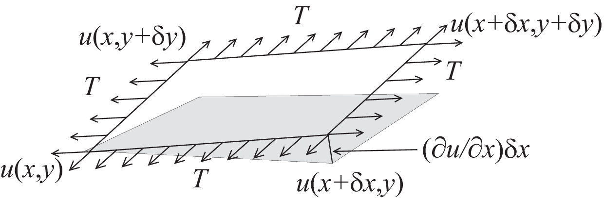|

Similarly, for the edges AB and DC we have

\[
-\mu n_y(x,y)\delta x,\qquad
\mu\left(n_y(x,y)+\p n_y/\p y\right)(x,y)\delta x.
\]

The force in the vertical direction on the surface ABCD due to the tension $\mu$ is given by

\[
\mu\left(\p n_x/\p x\right)\delta x\delta y+T\left(\p n_y/\p y\right)\delta y\delta x.
\]

Assuming small displacements, we have

\begin{eqnarray*}
\nu_x&=&(\p u/\p x)/\sqrt{1+(\p u/\p x)^2+(\p u/\p y)^2}\simeq \p u/\p x,\\
\nu_y&=&(\p u/\p y)/\sqrt{1+(\p u/\p x)^2+(\p u/\p y)^2}\simeq \p u/\p y.
\end{eqnarray*}

Letting $\delta x\to dx,\, \delta y\to dy$, we have the equilibrium of the vertical displacement of soap film on ABCD by $p$

\[
\mu dx dy\p^2 u/\p x^2 +  \mu dx dy\p^2 u/\p y^2
+ p dx dy = 0.
\]

Using the Laplace operator $\Delta = \p^2 /\p x^2 + \p^2 /\p y^2$, we can find the virtual displacement write the following

\begin{equation}
-\Delta u = f\quad \mbox{in }\Omega
\end{equation}

where $f=p/\mu$, $\Omega =\{(x,y);\;x^{2}+y^{2}<1\}$.
Poisson's equation (\ref{eqn:Poisson} 2.1 $\codered$) appears
also in __electrostatics__ taking the form of $f=\rho /\epsilon $ where
$\rho $ is the charge density, $\epsilon $ the dielectric constant and $u$
is named as electrostatic potential. The soap film is glued to the ring $%
\p \Omega =C$, then we have the boundary condition

\begin{equation}
u=0\quad \mbox{on }\p \Omega
\end{equation}

If the force is gravity, for simplify, we assume that $f=-1$.

 __Example__ a\_tutorial.edp

```freefem
border a(t=0,2*pi){ x = cos(t); y = sin(t);label=1;};

mesh disk = buildmesh(a(50));
plot(disk);
fespace femp1(disk,P1);
femp1 u,v;
func f = -1;
problem laplace(u,v) =
    int2d(disk)( dx(u)*dx(v) + dy(u)*dy(v) ) // bilinear form
  - int2d(disk)( f*v ) // linear form
  + on(1,u=0) ; // boundary condition
func ue = (x^2+y^2-1)/4; // ue: exact solution
laplace;
femp1 err = u - ue;

plot (u,ps="aTutorial.eps",value=true,wait=true);
plot(err,value=true,wait=true);

cout << "error L2=" << sqrt(int2d(disk)( err^2) )<< endl;
cout << "error H10=" << sqrt( int2d(disk)((dx(u)-x/2)^2)
                              + int2d(disk)((dy(u)-y/2)^2))<< endl;

disk = adaptmesh(disk,u,err=0.01);
plot(disk,wait=1);

laplace;

plot (u,value=true,wait=true);
err = u - ue; // become FE-function on adapted mesh
plot(err,value=true,wait=true);
cout << "error L2=" << sqrt(int2d(disk)( err^2) )<< endl;
cout << "error H10=" << sqrt(int2d(disk)((dx(u)-x/2)^2)
                             + int2d(disk)((dy(u)-y/2)^2))<< endl;
```

|Fig. 9.1: isovalue of $u$|
|:----:|
|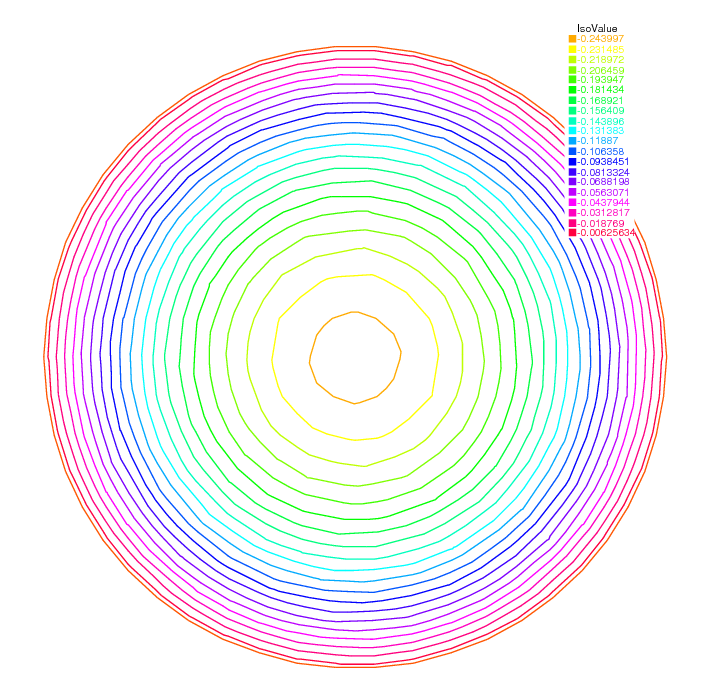|

|Fig 9.2: A side view of $u$|
|:----:|
||

In 19th line, the $L^2$-error estimation between the exact solution $u_e$,
$$
\|u_h - u_e\|_{0,\Omega}=\left(\int_{\Omega}|u_h-u_e|^2\, \d x\d y\right)^{1/2}
$$
and from 20th line to 21th line, the $H^1$-error seminorm estimation
$$
|u_h - u_e|_{1,\Omega}=\left(\int_{\Omega}|\nabla u_h-\nabla u_e|^2\, \d x\d y\right)^{1/2}
$$
are done on the initial mesh. The results are $\|u_h - u_e\|_{0,\Omega}=0.000384045,\, |u_h - u_e|_{1,\Omega}=0.0375506$.

After the adaptation, we have $\|u_h - u_e\|_{0,\Omega}=0.000109043,\, |u_h - u_e|_{1,\Omega}=0.0188411$.
So the numerical solution is improved by adaptation of mesh.


### Electrostatics

We assume that there is no current and a time independent charge distribution.
Then the electric field $\vec E$ satisfies

\begin{eqnarray}
\mathrm{div}\vec E=\rho/\epsilon,\quad \mathrm{curl}\vec E=0
\end{eqnarray}

where $\rho$ is the charge density and $\epsilon$ is called the permittivity of free space. From the second equation in (\ref{eqn:Maxwell0} 9.3 $\codered$), we can introduce
the electrostatic potential such that $\vec E=-\nabla \phi$.
Then we have Poisson's equation $-\Delta \phi=f$, $f=-\rho/\epsilon$.
We now obtain the equipotential line which is the level curve of $\phi$,
when there are no charges except conductors $\{C_i\}_{1,\cdots,K}$.
Let us assume $K$ conductors $C_1,\cdots,C_K$ within an enclosure $C_0$.
Each one is held
at an electrostatic potential $\varphi_i$. We assume that the enclosure $C0$ is
held at
potential 0.
In order to know $\varphi(x)$ at any point $x$ of the domain $\Omega$, we must
solve

\begin{equation}
-\Delta \varphi =0\quad \textrm{in  }\Omega ,
\end{equation}

where $\Omega$ is the interior of $C_0$ minus the conductors $C_i$, and
$\Gamma$ is the boundary of $\Omega$, that is $\sum_{i=0}^N C_i$.
Here $g$ is any function of $x$ equal to $\varphi_i$ on $C_i$ and to
0 on $C_0$. The boundary equation is a reduced form for:

\begin{equation}
\varphi =\varphi_{i}\;\text{on }C_{i},\;i=1...N,\varphi =0\;\text{on }C_{0}.
\end{equation}

__Example__
_First we give the geometrical informations; $C_0=\{(x,y);\; x^2+y^2=5^2\}$,
$C_1=\{(x,y):\; \frac{1}{0.3^2}(x-2)^2+\frac{1}{3^2}y^2=1\}$,
$C_2=\{(x,y):\; \frac{1}{0.3^2}(x+2)^2+\frac{1}{3^2}y^2=1\}$.
Let $\Omega$ be the disk enclosed by $C_0$ with the elliptical holes enclosed
by $C_1$ and $C_2$. Note that $C_0$ is described counterclockwise, whereas the
elliptical holes are described clockwise, because the boundary must be oriented so that the computational domain is to its left._

```freefem
// a circle with center at (0 ,0) and radius 5
border C0(t=0,2*pi) { x = 5 * cos(t); y = 5 * sin(t); }
border C1(t=0,2*pi) { x = 2+0.3 * cos(t); y = 3*sin(t); }
border C2(t=0,2*pi) { x = -2+0.3 * cos(t); y = 3*sin(t); }

mesh Th = buildmesh(C0(60)+C1(-50)+C2(-50));
plot(Th,ps="electroMesh"); // figure \ref{electroMesh} $\codered$
fespace Vh(Th,P1); // P1 FE-space
Vh uh,vh; // unknown and test function.
problem Electro(uh,vh) = // definition of the problem
    int2d(Th)( dx(uh)*dx(vh) + dy(uh)*dy(vh) ) // bilinear
    + on(C0,uh=0) // boundary condition on $C_0$
    + on(C1,uh=1) // +1 volt on $C_1$
    + on(C2,uh=-1) ; // -1 volt on $C_2$

Electro; // solve the problem, see figure \ref{electro} $\codered$ for the solution
plot(uh,ps="electro.eps",wait=true); // figure \ref{electro} $\codered$
```

|Fig. 9.3: Disk with two elliptical holes|Fig. 9.4: Equipotential lines, where $C_1$ is located in right hand side|
|:----:|:----:|
|||

### Aerodynamics

Let us consider a wing profile $S$ in a uniform flow.
Infinity will be represented by a large circle $\Gamma_{\infty}$.
As previously, we must solve

\begin{equation}
\Delta \varphi=0\quad\textrm{in }\Omega,
\quad \varphi|_S=c,\quad
\varphi|_{\Gamma_{\infty}}=u_{\infty 1x}-u_{\infty2x}
\end{equation}

where $\Omega$ is the area occupied by the fluid, $u_{\infty}$ is the air speed at infinity, $c$
is a constant to be determined so that $\p_n\varphi$ is continuous at the trailing edge
$P$ of $S$ (so-called Kutta-Joukowski condition). Lift is proportional to $c$.
To find $c$ we use a superposition method. As all equations in
(\ref{eqn:NACA-5-5} 9.6 $\codered$) are
linear, the solution $\varphi_c$ is a linear function of $c$

\begin{equation}
\varphi_c = \varphi_0 + c\varphi_1,
\end{equation}

where $\varphi_0$ is a solution of (\ref{eqn:NACA-5-5} 9.6 $\codered$) with $c = 0$ and
$\varphi_1$ is a solution with $c = 1$ and
zero speed at infinity.
With these two fields computed, we shall determine $c$
by requiring the continuity of $\p \varphi /\p n$ at the trailing edge.
An equation for the upper surface of a NACA0012 (this is a classical wing
profile in aerodynamics; the rear of the wing is called the trailing edge) is:

\begin{equation}
 y = 0.17735\sqrt{x} - 0.075597x - 0.212836x^2 +
0.17363x^3 - 0.06254x^4.
\end{equation}

Taking an incidence angle $\alpha$ such that $\tan \alpha = 0.1$, we must solve

\begin{equation}
-\Delta\varphi  = 0\qquad \textrm{in }\Omega, \qquad
\varphi|_{\Gamma_1} = y - 0.1x,\quad \varphi |_{\Gamma_2} = c,
\end{equation}

where $\Gamma_2$ is the wing profile and $\Gamma_1$ is an approximation of
infinity. One finds $c$ by solving:

\begin{eqnarray}
-\Delta\varphi_0 = 0 ~~\textrm{in }\Omega,\qquad
\varphi_0|_{\Gamma_1} = y - 0.1x, \quad \varphi_0|_{\Gamma_2} = 0,\\
-\Delta\varphi_1 = 0 ~~\textrm{in }\Omega, \qquad
\varphi_1|_{\Gamma_1} = 0, \quad \varphi_1|_{\Gamma_2} = 1.
\end{eqnarray}

The solution $\varphi  = \varphi_0+c\varphi_1$ allows us to find $c$
by writing that $\p_n\varphi$  has no jump
at the trailing edge $P = (1, 0)$.
We have $\p n\varphi  -(\varphi (P^+)-\varphi (P))/\delta$ where $P^+$
is the point just above $P$ in the direction normal to the profile at a distance
$\delta$. Thus the jump of $\p_n\varphi$  is
$(\varphi_0|_{P^+} +c(\varphi_1|_{P^+} -1))+(\varphi_0|_{P^-} +c(\varphi_1|_{P^-} -1))$
divided by $\delta$ because the normal changes sign between the lower and upper
surfaces. Thus

\begin{equation}
c = -\frac{\varphi_0|_{P^+} + \varphi_0|_{P^-}}
{(\varphi_1|_{P^+} + \varphi_1|_{P^-} - 2)} ,
\end{equation}

which can be programmed as:

\begin{equation}
c = -\frac{\varphi_0(0.99, 0.01) + \varphi_0(0.99,-0.01)}
{(\varphi_1(0.99, 0.01) + \varphi_1(0.99,-0.01) - 2)} .
\end{equation}

__Example__

```freefem
// Computation of the potential flow around a NACA0012 airfoil.
// The method of decomposition is used to apply the Joukowski condition
// The solution is seeked in the form psi0 + beta psi1 and beta is
// adjusted so that the pressure is continuous at the trailing edge

border a(t=0,2*pi) { x=5*cos(t);  y=5*sin(t); };// approximates infinity

border upper(t=0,1) { x = t;
     y = 0.17735*sqrt(t)-0.075597*t
  - 0.212836*(t^2)+0.17363*(t^3)-0.06254*(t^4); }
border lower(t=1,0) { x = t;
     y= -(0.17735*sqrt(t)-0.075597*t
  -0.212836*(t^2)+0.17363*(t^3)-0.06254*(t^4)); }
border c(t=0,2*pi) { x=0.8*cos(t)+0.5;  y=0.8*sin(t); }

wait = true;
mesh Zoom = buildmesh(c(30)+upper(35)+lower(35));
mesh Th = buildmesh(a(30)+upper(35)+lower(35));
fespace Vh(Th,P2); // P1 FE space
Vh psi0,psi1,vh; // unknown and test function.
fespace ZVh(Zoom,P2);

solve Joukowski0(psi0,vh) = // definition of the problem
    int2d(Th)( dx(psi0)*dx(vh) + dy(psi0)*dy(vh) ) // bilinear form
  + on(a,psi0=y-0.1*x) // boundary condition form
  + on(upper,lower,psi0=0);
plot(psi0);

solve Joukowski1(psi1,vh) = // definition of the problem
    int2d(Th)( dx(psi1)*dx(vh) + dy(psi1)*dy(vh) ) // bilinear form
  + on(a,psi1=0) // boundary condition form
  + on(upper,lower,psi1=1);

plot(psi1);

 // continuity of pressure at trailing edge
real beta = psi0(0.99,0.01)+psi0(0.99,-0.01);
beta = -beta / (psi1(0.99,0.01)+ psi1(0.99,-0.01)-2);

Vh psi = beta*psi1+psi0;
plot(psi);
ZVh Zpsi=psi;
plot(Zpsi,bw=true);
ZVh cp = -dx(psi)^2 - dy(psi)^2;
plot(cp);
ZVh Zcp=cp;
plot(Zcp,nbiso=40);
```

|Fig. 9.5: isovalue of $cp = -(\p_x\psi)^2 - (\p_y\psi)^2$|Fig. 9.6: Zooming of $cp$|
|:----:|:----:|
|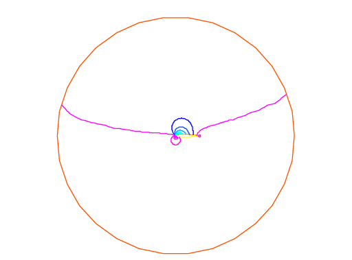||

### Error estimation

There are famous estimation between the numerical result $u_h$ and the
exact solution $u$ of the problem \ref{eqn:Poisson} 2.1 $\codered$ and \ref{eqn:Dirichlet} 2.2 $\codered$:
If triangulations $\{\mathcal{T}_h\}_{h\downarrow 0}$ is regular
(see \refSec{Regular Triangulation} 5.4 $\codered$), then we have the estimates

\begin{eqnarray}
|\nabla u - \nabla u_h|_{0,\Omega}&\le& C_1h\\
\|u - u_h\|_{0,\Omega}&\le& C_2h^2
\end{eqnarray}

with constants $C_1,\, C_2$ independent of $h$,
if $u$ is in $H^2(\Omega)$. It is known that $u\in H^2(\Omega)$
if $\Omega$ is convex.

In this section we check (\ref{eqn:H1err} 9.14 $\codered$) and (\ref{eqn:L2err} 9.15 $\codered$).
We will pick up numericall error if we use the numerical derivative,
so we will use the following for (\ref{eqn:H1err} 9.14 $\codered$).

\begin{eqnarray*}
\int_{\Omega}|\nabla u - \nabla u_h|^2\, \d x\d y
&=&\int_{\Omega}\nabla u\cdot \nabla(u - 2u_h)\, \d x\d y+
\int_{\Omega}\nabla u_h\cdot \nabla u_h\, \d x\d y\\
&=&\int_{\Omega}f(u-2u_h)\, \d x\d y+\int_{\Omega}fu_h\, \d x\d y
\end{eqnarray*}

The constants $C_1,\, C_2$ are depend on $\mathcal{T}_h$ and $f$,
so we will find them by FreeFem++.
In general, we cannot get the solution $u$ as a elementary functions
(see Section \ref{sec:TwoVarFunctions} 4.8 $\codered$) even if spetical functions are added.
Instead of the exact solution, here we use the approximate solution $u_0$  in
$V_h(\mathcal{T}_h,P_2),\, h\sim 0$.

 __Example 9.4__

```freefem
mesh Th0 = square(100,100);
fespace V0h(Th0,P2);
V0h u0,v0;
func f = x*y; // sin(pi*x)*cos(pi*y);

solve Poisson0(u0,v0) =
    int2d(Th0)( dx(u0)*dx(v0) + dy(u0)*dy(v0) ) // bilinear form
  - int2d(Th0)( f*v0 ) // linear form
  + on(1,2,3,4,u0=0) ; // boundary condition

plot(u0);

real[int] errL2(10), errH1(10);

for (int i=1; i<=10; i++) {
   mesh Th = square(5+i*3,5+i*3);
   fespace Vh(Th,P1);
   fespace Ph(Th,P0);
   Ph h = hTriangle; // get the size of all triangles
   Vh u,v;
   solve Poisson(u,v) =
        int2d(Th)( dx(u)*dx(v) + dy(u)*dy(v) ) // bilinear form
        - int2d(Th)( f*v ) // linear form
        + on(1,2,3,4,u=0) ; // boundary condition
   V0h uu = u;
   errL2[i-1] = sqrt( int2d(Th0)((uu - u0)^2) )/h[].max^2;
   errH1[i-1] = sqrt( int2d(Th0)( f*(u0-2*uu+uu) ) )/h[].max;
}
cout << "C1 = " << errL2.max <<"("<<errL2.min<<")"<< endl;
cout << "C2 = " << errH1.max <<"("<<errH1.min<<")"<< endl;
```

We can guess that $C_1=0.0179253(0.0173266)$ and
$C_2=0.0729566(0.0707543)$, where the numbers inside the parentheses
are minimum in calculation.

### Periodic Boundary Conditions

We now solve the Poisson equation
$$ -\Delta u= sin(x+\pi/4.)*cos(y+\pi/4.)$$ on
the square $]0,2\pi[^2$
under bi-periodic boundary condition
$u(0,y)=u(2\pi,y)$ for all $y$ and
$u(x,0)=u(x,2\pi)$ for all $x$.
These boundary conditions are achieved from the definition
of the periodic finite element space.

 __Example 9.5__ periodic.edp

```freefem
mesh Th=square(10,10,[2*x*pi,2*y*pi]);
// defined the fespace with periodic condition
// label :  2 and 4 are left and right side with y the curve abscissa
// 1 and 2 are bottom and upper side with x the curve abscissa
fespace Vh(Th,P2,periodic=[[2,y],[4,y],[1,x],[3,x]]);
 Vh uh,vh; // unknown and test function.
 func f=sin(x+pi/4.)*cos(y+pi/4.); // right hand side function

 problem laplace(uh,vh) = // definion of the problem
    int2d(Th)( dx(uh)*dx(vh) + dy(uh)*dy(vh) ) // bilinear form
  + int2d(Th)( -f*vh ) // linear form
;

  laplace; // solve the problem plot(uh); // to see the result
  plot(uh,ps="period.eps",value=true);
```

|Fig. 9.7: The isovalue of solution $u$ with periodic boundary condition|
|:----:|
|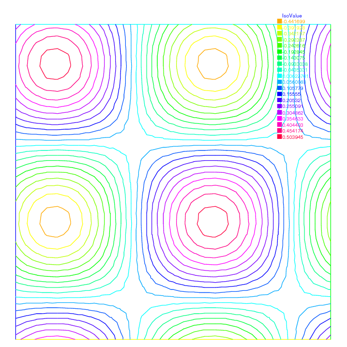|

The periodic condition does not necessarily require
parallel boundaries. Example \ref{exm:periodic4} 9.6 $\codered$
 give such example.

 __Example 9.6__ periodic4.edp

```freefem
real r=0.25;
// a diamond with a hole
border a(t=0,1){x=-t+1; y=t;label=1;};
border b(t=0,1){ x=-t; y=1-t;label=2;};
border c(t=0,1){ x=t-1; y=-t;label=3;};
border d(t=0,1){ x=t; y=-1+t;label=4;};
border e(t=0,2*pi){ x=r*cos(t); y=-r*sin(t);label=0;};
int n = 10;
mesh Th= buildmesh(a(n)+b(n)+c(n)+d(n)+e(n));
plot(Th,wait=1);
real r2=1.732;
func abs=sqrt(x^2+y^2);
// warning for periodic condition:
// side a and c
// on side a (label 1) $ x \in [0,1] $ or $ x-y\in [-1,1] $
// on side c (label 3) $ x \in [-1,0]$ or $ x-y\in[-1,1] $
// so the common abscissa can be respectively $x$ and $x+1$
// or you can can try curviline abscissa $x-y$ and $x-y$
// 1 first way
// fespace Vh(Th,P2,periodic=[[2,1+x],[4,x],[1,x],[3,1+x]]);
// 2 second way
 fespace Vh(Th,P2,periodic=[[2,x+y],[4,x+y],[1,x-y],[3,x-y]]);

 Vh uh,vh;

 func f=(y+x+1)*(y+x-1)*(y-x+1)*(y-x-1);
 real intf = int2d(Th)(f);
 real mTh = int2d(Th)(1);
 real k =  intf/mTh;
 problem laplace(uh,vh) =
    int2d(Th)( dx(uh)*dx(vh) + dy(uh)*dy(vh) ) + int2d(Th)( (k-f)*vh ) ;
 laplace;
 plot(uh,wait=1,ps="perio4.eps");
```

|Fig. 9.8: The isovalue of solution $u$ for $\Delta u = ((y+x)^{2}+1)((y-x)^{2}+1) - k$, in $\Omega$ and $\p_{n} u =0$ on hole, and with two periodic boundary condition on external border|
|:----:|
|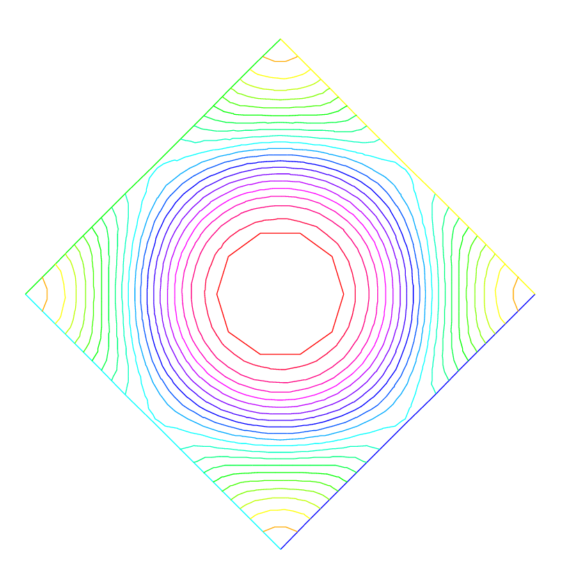|

An other example with no equal border, just to see if the code works.

 __Example 9.7__ periodic4bis.edp

```freefem
// irregular boundary condition.
// to build border AB
macro LINEBORDER(A,B,lab) border A#B(t=0,1){real t1=1.-t;
   x=A#x*t1+B#x*t;y=A#y*t1+B#y*t;label=lab;}//EOM
// compute  ||AB||  a=(ax,ay) et B =(bx,by)
macro dist(ax,ay,bx,by) sqrt(square((ax)-(bx))+ square((ay)-(by))) // EOM
macro Grad(u) [dx(u),dy(u)]//EOM


real Ax=0.9,Ay=1;              real Bx=2,By=1;
real Cx=2.5,Cy=2.5;            real Dx=1,Dy=2;
real gx = (Ax+Bx+Cx+Dx)/4.;    real gy = (Ay+By+Cy+Dy)/4.;


LINEBORDER(A,B,1)
LINEBORDER(B,C,2)
LINEBORDER(C,D,3)
LINEBORDER(D,A,4)

int n=10;

real l1=dist(Ax,Ay,Bx,By);
real l2=dist(Bx,By,Cx,Cy);
real l3=dist(Cx,Cy,Dx,Dy);
real l4=dist(Dx,Dy,Ax,Ay);
func s1=dist(Ax,Ay,x,y)/l1; // absisse on AB  = ||AX||/||AB||
func s2=dist(Bx,By,x,y)/l2; // absisse on BC  = ||BX||/||BC||
func s3=dist(Cx,Cy,x,y)/l3; // absisse on CD  = ||CX||/||CD||
func s4=dist(Dx,Dy,x,y)/l4; // absisse on DA  = ||DX||/||DA||

mesh Th=buildmesh(AB(n)+BC(n)+CD(n)+DA(n),fixedborder=1);//

verbosity=6;// to see the abscisse value pour the periodic condition.
fespace Vh(Th,P1,periodic=[[1,s1],[3,s3],[2,s2],[4,s4]]);
verbosity=1;
Vh u,v;
real cc=0;
cc= int2d(Th)((x-gx)*(y-gy)-cc)/Th.area;
cout << " compatibility =" << int2d(Th)((x-gx)*(y-gy)-cc) <<endl;

solve Poission(u,v)=int2d(Th)(Grad(u)'*Grad(v)+ 1e-10*u*v)
  -int2d(Th)(10*v*((x-gx)*(y-gy)-cc));
plot(u,wait=1,value=1);
```

 __Example 9.8__ Period-Poisson-cube-ballon.edp

```freefem
verbosity=1;
load "msh3"
load "tetgen"
load "medit"

bool buildTh=0;
mesh3 Th;
try { // a way to build one time the mesh an read if the file exist.
  Th=readmesh3("Th-hex-sph.mesh");
 }
catch(...) { buildTh=1;}
if( buildTh ){
  ...
 put the code example page // \ref{cube-ballon} $\codered$\pageref{cube-ballon}
  without the first line
 }

fespace Ph(Th,P0);
verbosity=50;
fespace Vh(Th,P1,periodic=[[3,x,z],[4,x,z],[1,y,z],[2,y,z],[5,x,y],[6,x,y]]);// back and front
verbosity=1;
Ph reg=region;

cout << "  centre = " << reg(0,0,0) << endl;
cout << " exterieur = " << reg(0,0,0.7) << endl;

macro Grad(u) [dx(u),dy(u),dz(u)] // EOM

Vh uh,vh;
real x0=0.3,y0=0.4,z0=06;
func f= sin(x*2*pi+x0)*sin(y*2*pi+y0)*sin(z*2*pi+z0);
real gn = 1.;
real cf= 1;
problem P(uh,vh)=
     int3d(Th,1)( Grad(uh)'*Grad(vh)*100)
  +  int3d(Th,2)( Grad(uh)'*Grad(vh)*2)
  + int3d(Th) (vh*f)
  ;
  P;
plot(uh,wait=1, nbiso=6);
medit("   uh ",Th, uh);
```

$\codered$ bug image

|Fig. 9.9: View of the surface isovalue of periodic solution $uh$|Fig. 9.10: View a the cut of the solution $uh$  with ffmedit|
|:----:|:----:|
|||

### Poisson Problems with mixed boundary condition

Here we consider the Poisson equation with mixed boundary
conditons: For given functions $f$ and $g$, find $u$ such that

\begin{eqnarray}
-\Delta u &=& f\qquad \textrm{in }\Omega\nonumber\\
u&=&g\quad \textrm{on }\Gamma_D,\quad
\p u/\p n=0\quad \textrm{on }\Gamma_N
\end{eqnarray}

where $\Gamma_D$ is a part of the boundary $\Gamma$ and $\Gamma_N=\Gamma\setminus \overline{\Gamma_D}$.
The solution $u$ has the singularity at the points $\{\gamma_1,\gamma_2\}=\overline{\Gamma_D}\cap\overline{\Gamma_N}$.
When $\Omega=\{(x,y);\; -1<x<1,\, 0<y<1\}$, $\Gamma_N=\{(x,y);\; -1\le x<0,\, y=0\}$, $\Gamma_D=\p \Omega\setminus \Gamma_N$,
the singularity will appear at $\gamma_1=(0,0),\, \gamma_2(-1,0)$, and $u$ has the expression
$$
u=K_iu_S + u_R,\, u_R\in H^2(\textrm{near }\gamma_i),\, i=1,2
$$
with a constants $K_i$.
Here $u_S = r_j^{1/2}\sin(\theta_j/2)$ by the local polar coordinate
$(r_j,\theta_j$ at $\gamma_j$ such that $(r_1,\theta_1)=(r,\theta)$.
Instead of poler coordinate system $(r,\theta)$, we use that
$r=$`:::freefem sqrt`($x^2+y^2$) and $\theta =$`:::freefem atan2`($y,x$)
in FreeFem++.

 __Example 9.9__ Assume that $f=-2\times 30(x^2+y^2)$ and $g=u_e=10(x^2+y^2)^{1/4}\sin\left([\tan^{-1}(y/x)]/2\right)+30(x^2y^2)$, where $u_e$S is the exact solution.

```freefem
border N(t=0,1) { x=-1+t; y=0; label=1; };
border D1(t=0,1){ x=t;  y=0; label=2;};
border D2(t=0,1){ x=1; y=t; label=2; };
border D3(t=0,2){ x=1-t; y=1; label=2;};
border D4(t=0,1) { x=-1; y=1-t; label=2; };

mesh T0h = buildmesh(N(10)+D1(10)+D2(10)+D3(20)+D4(10));
plot(T0h,wait=true);
fespace V0h(T0h,P1);
V0h u0, v0;

func f=-2*30*(x^2+y^2); // given function
// the singular term of the solution is K*us (K: constant)
func us = sin(atan2(y,x)/2)*sqrt( sqrt(x^2+y^2) );
real K=10.;
func ue = K*us + 30*(x^2*y^2);

solve Poisson0(u0,v0) =
    int2d(T0h)( dx(u0)*dx(v0) + dy(u0)*dy(v0) ) // bilinear form
  - int2d(T0h)( f*v0 ) // linear form
  + on(2,u0=ue) ; // boundary condition

// adaptation by the singular term
mesh Th = adaptmesh(T0h,us);
for (int i=0;i< 5;i++)
{
  mesh Th=adaptmesh(Th,us);
} ;

fespace Vh(Th, P1);
Vh u, v;
solve Poisson(u,v) =
    int2d(Th)( dx(u)*dx(v) + dy(u)*dy(v) ) // bilinear form
  - int2d(Th)( f*v ) // linear form
  + on(2,u=ue) ; // boundary condition

/* plot the solution */
plot(Th,ps="adaptDNmix.ps");
plot(u,wait=true);

Vh uue = ue;
real H1e = sqrt( int2d(Th)( dx(uue)^2 + dy(uue)^2 + uue^2 ) );

/* calculate the H1 Sobolev norm */
Vh err0 = u0 - ue;
Vh err = u - ue;
Vh H1err0 = int2d(Th)( dx(err0)^2+dy(err0)^2+err0^2 );
Vh H1err = int2d(Th)( dx(err)^2+dy(err)^2+err^2 );
cout <<"Relative error in first mesh "<< int2d(Th)(H1err0)/H1e<<endl;
cout <<"Relative error in adaptive mesh "<< int2d(Th)(H1err)/H1e<<endl;
```

From 24th line to 28th, adaptation of meshes are done using the
base of singular term.
In 42th line, `:::freefem H1e`=$\|u_e\|_{1,\Omega}$ is calculated.
In last 2 lines, the relative errors are calculated, that is,

\begin{eqnarray*}
\|u^0_h-u_e\|_{1,\Omega}/H1e&=&0.120421\\
\|u^a_h-u_e\|_{1,\Omega}/H1e&=&0.0150581
\end{eqnarray*}

where $u^0_h$ is the numerical solution in `:::freefem T0h` and
$u^a_h$ is `:::freefem u` in this program.

### Poisson with mixted finite element

Here we consider the Poisson equation with mixed boundary value
problems:
For given functions $f$ , $g_d$, $g_n$, find $p$ such that

\begin{eqnarray}
-\Delta p &=& 1 \qquad \textrm{in }\Omega\nonumber\\
p&=&g_d\quad \textrm{on }\Gamma_D,\quad
\p p/\p n=g_n\quad \textrm{on }\Gamma_N
\end{eqnarray}

where $\Gamma_D$ is a part of the boundary $\Gamma$ and
$\Gamma_N=\Gamma\setminus \overline{\Gamma_D}$.

The mixte formulation is: find $p$ and $\mathbf{u}$ such that

\begin{eqnarray}
\nabla p +  \mathbf{u}  &=& \mathbf{0} \qquad \textrm{in }\Omega\nonumber\\
\nabla. \mathbf{u} &=& f \qquad \textrm{in }\Omega\nonumber\\
p&=&g_d\quad \textrm{on }\Gamma_D,\quad
\p u. n= \mathbf{g}_n.n \quad \textrm{on }\Gamma_N
\end{eqnarray}

where $\mathbf{g}_n$ is a vector such that $\mathbf{g}_n.n = g_n$.

The variationnal formulation is,

\begin{eqnarray}
  \forall \mathbf{v} \in \mathbb{V}_0 ,  \quad  &\int_\Omega p \nabla.v +  \mathbf{v} \mathbf{v}  &= \int_{\Gamma_d} g_d \mathbf{v}.n \nonumber\\
   \forall {q} \in  \mathbb{P}   \quad  &  \int_\Omega q \nabla.u &= \int_\Omega q f \nonumber\\
   & \p u. n &= \mathbf{g}_n.n \quad \textrm{on }\Gamma_N
\end{eqnarray}

where the functionnal space are:

$$\mathbb{P}= L^2(\Omega),\qquad\mathbb{V}= H(div)=\{\mathbf{v}\in L^2(\Omega)^2,\nabla.\mathbf{v}\in L^2(\Omega)\}$$

and

$$\mathbb{V}_0 = \{\mathbf{v}\in \mathbb{V};\quad\mathbf{v}. n = 0 \quad\mathrm{on }\;\;\Gamma_N\}.$$

To write, the FreeFem++ example, we have just to choose the finites elements spaces.
here $\mathbb{V}$ space is discretize with Raviart-Thomas finite element `:::freefem RT0` and $\mathbb{P}$ is discretize by constant finite element `:::freefem P0`.

 __Example 9.10__ LaplaceRT.edp

```freefem
mesh Th=square(10,10);
fespace Vh(Th,RT0);
fespace Ph(Th,P0);
func gd = 1.;
func g1n = 1.;
func g2n = 1.;

Vh [u1,u2],[v1,v2];
Ph p,q;

problem laplaceMixte([u1,u2,p],[v1,v2,q],
                      solver=GMRES,eps=1.0e-10,
                      tgv=1e30,dimKrylov=150)
      =
     int2d(Th)( p*q*1e-15 // this term is here to be sur
 // that all sub matrix are inversible (LU requirement)
              + u1*v1 + u2*v2 + p*(dx(v1)+dy(v2)) + (dx(u1)+dy(u2))*q )
  + int2d(Th) ( q)
  - int1d(Th,1,2,3)( gd*(v1*N.x +v2*N.y)) // on  $\Gamma_D$
  + on(4,u1=g1n,u2=g2n); // on $\Gamma_N$

 laplaceMixte;

 plot([u1,u2],coef=0.1,wait=1,ps="lapRTuv.eps",value=true);
 plot(p,fill=1,wait=1,ps="laRTp.eps",value=true);
```

### Metric Adaptation and residual error indicator

We do metric mesh adaption and compute the classical
residual error indicator $\eta_{T}$ on the element $T$ for the Poisson problem.

 __Example 9.11__ adaptindicatorP2.edp

First, we solve the same problem as in a previous example.

```freefem
border ba(t=0,1.0){x=t;   y=0;  label=1;}; // see Fig,\ref{L-shape2} $\codered$
border bb(t=0,0.5){x=1;   y=t;  label=2;};
border bc(t=0,0.5){x=1-t; y=0.5;label=3;};
border bd(t=0.5,1){x=0.5; y=t;  label=4;};
border be(t=0.5,1){x=1-t; y=1;  label=5;};
border bf(t=0.0,1){x=0;   y=1-t;label=6;};
mesh Th = buildmesh (ba(6) + bb(4) + bc(4) +bd(4) + be(4) + bf(6));
savemesh(Th,"th.msh");
fespace Vh(Th,P2);
fespace Nh(Th,P0);
Vh u,v;
Nh rho;
real[int] viso(21);
for (int i=0;i<viso.n;i++)
  viso[i]=10.^(+(i-16.)/2.);
real error=0.01;
func f=(x-y);
problem Probem1(u,v,solver=CG,eps=1.0e-6) =
    int2d(Th,qforder=5)( u*v*1.0e-10+  dx(u)*dx(v) + dy(u)*dy(v))
  + int2d(Th,qforder=5)( -f*v);
/*************
```

Now, the local error indicator $\eta_{T}$ is:
\def\Th{\mathcal{T}_{h}}
\def\AK{\mathcal{E}_{K}}
$\codered$

$$\eta_{T} =\left(  h_{T}^{2} || f + \Delta u_{{h}} ||_{L^{2}(T)}^{2} +\sum_{e\in \AK} h_{e} \,||\, [ \frac{\p u_{h}}{\p n_{k}}] \,||^{2}_{L^{2}(e)} \right)^{\frac{1}{2}}
   $$
where $h_{T}$ is the longest's edge of  $T$, ${\cal E}_T$ is the set of $T$ edge not on
$\Gamma=\p \Omega$, $n_{T}$ is the outside unit normal to $K$, $h_{e}$ is the length of edge $e$,
$[ g ]$ is the jump of the function $g$ across edge (left value minus right value).

Of course, we can use a variational form to compute $\eta_{T}^{2}$,
with test function constant function in each triangle.

```freefem
*************/

varf indicator2(uu,chiK) =
     intalledges(Th)(chiK*lenEdge*square(jump(N.x*dx(u)+N.y*dy(u))))
    +int2d(Th)(chiK*square(hTriangle*(f+dxx(u)+dyy(u))) );
for (int i=0;i< 4;i++)
{
  Probem1;
   cout << u[].min << " " << u[].max << endl;
   plot(u,wait=1);
   cout << " indicator2 " << endl;

   rho[] = indicator2(0,Nh);
   rho=sqrt(rho);
   cout << "rho =   min " << rho[].min << " max=" << rho[].max << endl;
   plot(rho,fill=1,wait=1,cmm="indicator density ",ps="rhoP2.eps",
                                   value=1,viso=viso,nbiso=viso.n);
   plot(Th,wait=1,cmm="Mesh ",ps="ThrhoP2.eps");
   Th=adaptmesh(Th,[dx(u),dy(u)],err=error,anisomax=1);
   plot(Th,wait=1);
   u=u;
   rho=rho;
  error = error/2;
} ;
```

If the method is correct, we expect to look the graphics by an almost constant function $\eta$ on your computer as in Fig. \ref{fig:rhoP2} 9.11 $\codered$.

|Fig. 9.11: Density of the error indicator with isotropic $P_{2}$ metric|
|:----:|
||
||

### Adaptation using residual error indicator

In the previous example we compute the error indicator, now we use it, to adapt the mesh.
The new mesh size is given by the following formulae:

$$h_{n+1}(x)=\frac{h_{n}(x)}{f_{n}(\eta_K(x))}$$

where $\eta_n(x)$ is the level of error at point $x$ given by the local
error indicator, $h_n$ is the previous "mesh size" field, and $f_n$ is a user
function define by
$f_n = min(3,max(1/3,\eta_n / \eta_n^* ))$ where $\eta_n^* =mean(\eta_n) c $, and $c$ is an user
 coefficient generally close to one.

 __Example 9.12__ AdaptResidualErrorIndicator.edp

First a macro `:::freefem MeshSizecomputation` to get a $P_1$ mesh size as the average of edge length.

```freefem
// macro the get the current mesh size
// parameter
// in: Th the mesh
// Vh P1 fespace on Th
// out :
// h: the Vh finite element finite set to the current mesh size
macro MeshSizecomputation(Th,Vh,h)
{  /* Th mesh \
	 Vh P1 finite element space
	 h the P1 mesh size value */
	real[int] count(Th.nv);
	/* mesh size (lenEdge =  integral(e) 1 ds)  */
	varf vmeshsizen(u,v)=intalledges(Th,qfnbpE=1)(v);
	/* number of edge / par vertex */
	varf vedgecount(u,v)=intalledges(Th,qfnbpE=1)(v/lenEdge);
   /*
	  computation of the mesh size
	  ----------------------------- */
	count=vedgecount(0,Vh);
	h[]=0.;
	h[]=vmeshsizen(0,Vh);
	cout << " count min = "<< count.min << " " << count.max << endl;
	h[]=h[]./count;
    cout << " -- bound meshsize = " <<h[].min << " " << h[].max << endl;
} // end of macro MeshSizecomputation
```

A second macro to remesh according to the new mesh size.

```freefem
// macro to remesh according the de residual indicator
// in:
// Th the mesh
// Ph P0 fespace on Th
// Vh P1 fespace on Th
// vindicator the varf of to evaluate the indicator to ${}^2$
// coef on etameam ..
// ------

macro ReMeshIndicator(Th,Ph,Vh,vindicator,coef)
{
	Vh h=0;
	/*evalutate the mesh size  */
	MeshSizecomputation(Th,Vh,h);
	Ph etak;
	etak[]=vindicator(0,Ph);
	etak[]=sqrt(etak[]);
	real etastar= coef*(etak[].sum/etak[].n);
	cout << " etastar = " << etastar << " sum=" << etak[].sum << " " << endl;

	/* here etaK is discontinous
	   we use the P1 L2 projection with mass lumping . */

	Vh fn,sigma;
	varf veta(unused,v)=int2d(Th)(etak*v);
	varf vun(unused,v)=int2d(Th)(1*v);
	fn[]  = veta(0,Vh);
	sigma[]= vun(0,Vh);
	fn[]= fn[]./ sigma[];
	fn =  max(min(fn/etastar,3.),0.3333) ;

	/* new mesh size */
	h = h / fn ;
	/* plot(h,wait=1); */
	/*  build the new mesh */
	Th=adaptmesh(Th,IsMetric=1,h,splitpbedge=1,nbvx=10000);
}
```

We skip the mesh construction, see the previous example,

```freefem
// FE space definition ---
fespace Vh(Th,P1); // for the mesh size and solution
fespace Ph(Th,P0); // for the error indicator

real hinit=0.2; // initial mesh size
Vh h=hinit; // the FE function for the mesh size
// to build a mesh with a given mesh size  : meshsize
Th=adaptmesh(Th,h,IsMetric=1,splitpbedge=1,nbvx=10000);
plot(Th,wait=1,ps="RRI-Th-init.eps");
Vh u,v;

func f=(x-y);

problem Poisson(u,v) =
    int2d(Th,qforder=5)( u*v*1.0e-10+  dx(u)*dx(v) + dy(u)*dy(v))
  - int2d(Th,qforder=5)( f*v);

 varf indicator2(unused,chiK) =
     intalledges(Th)(chiK*lenEdge*square(jump(N.x*dx(u)+N.y*dy(u))))
    +int2d(Th)(chiK*square(hTriangle*(f+dxx(u)+dyy(u))) );

for (int i=0;i< 10;i++)
{
	u=u;
	Poisson;
	plot(Th,u,wait=1);
	real cc=0.8;
	if(i>5) cc=1;
	ReMeshIndicator(Th,Ph,Vh,indicator2,cc);
	plot(Th,wait=1);
}
```

|Fig. 9.12: The error indicator with isotropic $P_{1}$, the mesh and isovalue of the solution|
|:----:|
|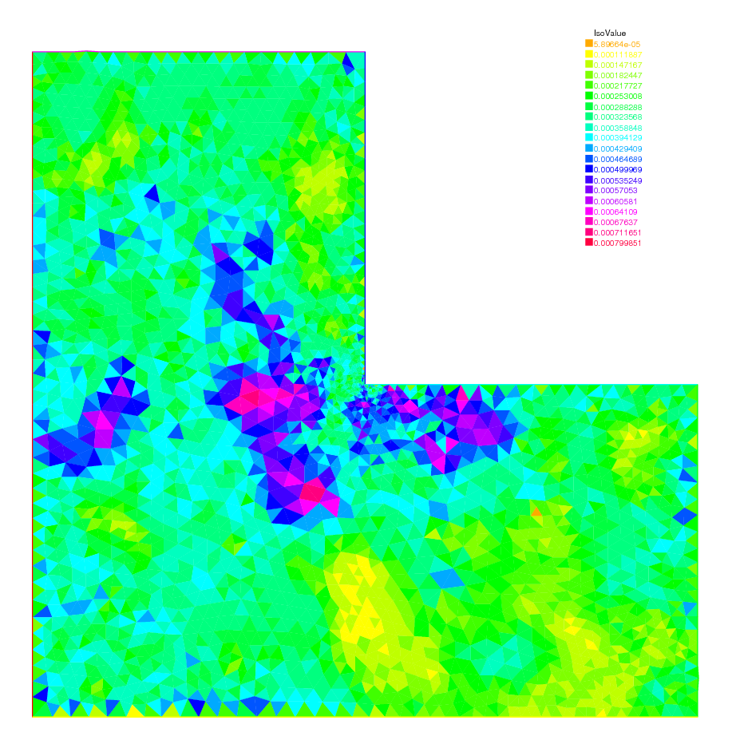|
||

## Elasticity

Consider an elastic plate with undeformed shape $\Omega\times ]-h,h[$
in $\R^3$, $\Omega\subset\R^2$.
By the deformation of the plate,
we assume that a point $P(x_1,x_2,x_3)$ moves to ${\cal P}(\xi_1,\xi_2,\xi_3)$.
The vector $\vec{u}=(u_1,u_2,u_3)=(\xi_1-x_1,\xi_2-x_2,\xi_3-x_3)$ is called the
_displacement vector_.

By the deformation, the line segment $\overline{\mathbf{x},\mathbf{x}+\tau\Delta\mathbf{x}}$ moves approximately to $\overline{\mathbf{x}+u(\mathbf{x}),\mathbf{x}+\tau\Delta\mathbf{x} +u(\mathbf{x}+\tau\Delta\mathbf{x})}$ for small $\tau$,
where
$\mathbf{x}=(x_1,x_2,x_3),\, \Delta\mathbf{x}
=(\Delta x_1,\Delta x_2,\Delta x_3)$.

We now calculate the ratio between two segments

\[
\eta(\tau)=\tau^{-1}|\Delta\mathbf{x}|^{-1}
\left(|u(\mathbf{x}+\tau\Delta\mathbf{x})
-u(\mathbf{x})+\tau\Delta\mathbf{x}|-\tau|\Delta\mathbf{x}|\right)
\]

then we have (see e.g. \cite[p.32]{Necas} $\codered$)

\begin{eqnarray*}
\lim_{\tau\to 0}\eta(\tau)=(1+2e_{ij}\nu_i\nu_j)^{1/2}-1,
\quad 2e_{ij}=\frac{\p u_k}{\p x_i}\frac{\p u_k}{\p x_j}+\left(\frac{\p u_i}{\p x_j}+
\frac{\p u_j}{\p x_i}\right)
\end{eqnarray*}

where $\nu_i=\Delta x_i|\Delta\mathbf{x}|^{-1}$. If the deformation is _small_, then we may consider that

\[
(\p u_k/\p x_i)(\p u_k/\p x_i)\approx 0
\]

and the following is called _small strain tensor_

\[
\varepsilon_{ij}(u)=\frac{1}{2}\left(\frac{\p u_i}{\p x_j}+
\frac{\p u_j}{\p x_i}\right)
\]

The tensor $e_{ij}$ is called _finite strain tensor_.

Consider the small plane $\Delta \Pi(\mathbf{x})$ centered at $\mathbf{x}$ with the unit normal direction $\vec n=(n_1,n_2,n_3)$, then the surface on $\Delta \Pi(\mathbf{x})$ at $\mathbf{x}$ is

\[
(\sigma_{1j}(\mathbf{x})n_j, \sigma_{2j}(\mathbf{x})n_j, \sigma_{3j}(\mathbf{x})n_j)
\]

where $\sigma_{ij}(\mathbf{x})$ is called _stress tensor_ at $\mathbf{x}$.
Hooke's law is the assumption of a linear relation between $\sigma_{ij}$ and $\varepsilon_{ij}$ such as

\[
\sigma_{ij}(\mathbf{x})=c_{ijkl}(\mathbf{x})\varepsilon_{ij}(\mathbf{x})
\]

with the symmetry $c_{ijkl}=c_{jikl}, c_{ijkl}=c_{ijlk}, c_{ijkl}=c_{klij}$.

If Hooke's tensor $c_{ijkl}(\mathbf{x})$ do not depend on the choice of
coordinate system, the material is called _isotropic_ at $\mathbf{x}$.
If $c_{ijkl}$ is constant, the material is called _homogeneous_.
In homogeneous isotropic case, there is _Lamé constants_
$\lambda, \mu$ (see e.g. \cite[p.43]{Necas} $\codered$) satisfying

\begin{eqnarray}
\sigma_{ij}=\lambda\delta_{ij}\textrm{div}u+2\mu \varepsilon_{ij}
\end{eqnarray}

where $\delta_{ij}$ is Kronecker's delta.
We assume that the elastic plate is fixed
on $\Gamma_D\times ]-h,h[,\, \Gamma_D\subset \p\Omega$.
If the body force $f=(f_1,f_2,f_3)$ is given in $\Omega\times]-h,h[$
and surface force $g$ is given in $\Gamma_N\times]-h,h[,
\Gamma_N=\p\Omega\setminus\overline{\Gamma_D}$,
then the equation of equilibrium is given as follows:

\begin{eqnarray}
-\p_j \sigma_{ij}&=&f_i~~\textrm{in }\Omega\times ]-h,h[,\quad
i=1,2,3\\
\sigma_{ij}n_j&=&g_i~~\textrm{on }\Gamma_N\times ]-h,h[,\quad
u_i=0~~\textrm{on }\Gamma_D\times ]-h,h[,\quad i=1,2,3
\end{eqnarray}

We now explain the plain elasticity.

* __Plain strain:__

	On the end of plate, the contact condition $u_3=0,\, g_3=$ is satisfied.
	In this case, we can suppose that $f_3=g_3=u_3=0$ and $\vec u(x_1,x_2,x_3)=\overline{u}(x_1,x_2)$ for all $-h<x_3<h$.

* __Plain stress:__

	The cylinder is assumed to be very thin and subjected to no load on the
	ends $x_3=\pm h$, that is,

	\[
	\sigma_{3i}=0,\quad x_3=\pm h,\quad i~1,2,3
	\]

	The assumption leads that $\sigma_{3i}=0$ in $\Omega\times ]-h,h[$
	and $\vec u(x_1,x_2,x_3)=\overline{u}(x_1,x_2)$ for all $-h<x_3<h$.

* __Generalized plain stress:__

	The cylinder is subjected to no load at $x_3=\pm h$.
	Introducing the mean values with respect to thickness,

	\[
	\overline{u}_i(x_1,x_2)=\frac{1}{2h}
	\int_{-h}^h u(x_1,x_2,x_3)dx_3
	\]

	and we derive $\overline{u}_3\equiv 0$. Similarly we define the mean
	values $\overline{f},\overline{g}$ of the body force and surface force
	as well as the mean values $\overline{\varepsilon}_{ij}$ and
	$\overline{\sigma}_{ij}$ of the components of stress and strain, respectively.

In what follows we omit the overlines of
$\overline{u}, \overline{f},\overline{g}, \overline{\varepsilon}_{ij}$ and
$\overline{\varepsilon}_{ij}$.
Then we obtain similar equation of equilibrium given in (\ref{eqn:elasticity} 9.21 $\codered$)
replacing $\Omega\times ]-h,h[$ with $\Omega$ and changing $i=1,2$.
In the case of plane stress,
$\sigma_{ij}=\lambda^* \delta_{ij}\textrm{div}u+2\mu\varepsilon_{ij},
\lambda^*=(2\lambda \mu)/(\lambda+\mu)$.

The equations of elasticity are naturally written in variational form
for the displacement vector $u(x)\in V$ as

$$
\int_\Omega [2\mu\epsilon_{ij}(\vec u)\epsilon_{ij}(\vec v)
+\lambda \epsilon_{ii}(\vec{u})\epsilon_{jj}(\vec v)]
=\int_\Omega \vec f\cdot \vec v +\int_\Gamma \vec g\cdot \vec v,%\`{u}
\forall \vec v\in V
$$

where $V$ is the linear closed subspace of $H^1(\Omega)^2$.

 __Example 9.13__ Beam.edp

Consider elastic plate with the undeformed rectangle shape
$]0,10[\times ]0,2[$. The body force is the gravity force $\vec f$ and the boundary force $\vec g$ is zero on lower and upper side. On the two vertical sides of the beam are fixed.

```freefem
// a weighting beam sitting on a

int bottombeam = 2;
border a(t=2,0)  { x=0; y=t ;label=1;}; // left beam
border b(t=0,10) { x=t; y=0 ;label=bottombeam;}; // bottom of beam
border c(t=0,2)  { x=10; y=t ;label=1;}; // rigth beam
border d(t=0,10) { x=10-t; y=2; label=3;}; // top beam
real E = 21.5;
real sigma = 0.29;
real mu = E/(2*(1+sigma));
real lambda = E*sigma/((1+sigma)*(1-2*sigma));
real gravity = -0.05;
mesh th = buildmesh( b(20)+c(5)+d(20)+a(5));
fespace Vh(th,[P1,P1]);
Vh [uu,vv], [w,s];
cout << "lambda,mu,gravity ="<<lambda<< " " << mu << " " << gravity << endl;
// deformation of a beam under its own weight
real sqrt2=sqrt(2.);// see lame.edp example \ref{lame.edp} $\codered$
macro epsilon(u1,u2)  [dx(u1),dy(u2),(dy(u1)+dx(u2))/sqrt2] // EOM
macro div(u,v) ( dx(u)+dy(v) ) // EOM

solve bb([uu,vv],[w,s])=
        int2d(th)(
                  lambda*div(w,s)*div(uu,vv)
                  +2.*mu*( epsilon(w,s)'*epsilon(uu,vv) )
                 )
  + int2d(th) (-gravity*s)
  + on(1,uu=0,vv=0)
 ;

plot([uu,vv],wait=1);
plot([uu,vv],wait=1,bb=[[-0.5,2.5],[2.5,-0.5]]);
mesh th1 = movemesh(th, [x+uu, y+vv]);
plot(th1,wait=1);
```

 __Example 9.14__ beam-3d.edp

Consider elastic box with the undeformed parallelepiped shape $]0,5[\times ]0,1[\times]0,1[$. The body force is the gravity force $\vec f$ and the boundary force $\vec g$ is zero on all face except one the one vertical left face where the beam is fixed.

```freefem
include "cube.idp"
int[int]  Nxyz=[20,5,5];
real [int,int]  Bxyz=[[0.,5.],[0.,1.],[0.,1.]];
int [int,int]  Lxyz=[[1,2],[2,2],[2,2]];
mesh3 Th=Cube(Nxyz,Bxyz,Lxyz);

real E = 21.5e4, sigma = 0.29;
real mu = E/(2*(1+sigma));
real lambda = E*sigma/((1+sigma)*(1-2*sigma));
real gravity = -0.05;

fespace Vh(Th,[P1,P1,P1]);
Vh [u1,u2,u3], [v1,v2,v3];
cout << "lambda,mu,gravity ="<<lambda<< " " << mu << " " << gravity << endl;

real sqrt2=sqrt(2.);
macro epsilon(u1,u2,u3)  [dx(u1),dy(u2),dz(u3),(dz(u2)+dy(u3))/sqrt2,
                       (dz(u1)+dx(u3))/sqrt2,(dy(u1)+dx(u2))/sqrt2] // EOM
macro div(u1,u2,u3) ( dx(u1)+dy(u2)+dz(u3) ) // EOM

solve Lame([u1,u2,u3],[v1,v2,v3])=
  int3d(Th)(
	    lambda*div(u1,u2,u3)*div(v1,v2,v3)
	    +2.*mu*( epsilon(u1,u2,u3)'*epsilon(v1,v2,v3) ) //')
	      )
  - int3d(Th) (gravity*v3)
  + on(1,u1=0,u2=0,u3=0)
  ;
real dmax= u1[].max;
cout << " max displacement = " << dmax << endl;
real coef= 0.1/dmax;
int[int] ref2=[1,0,2,0];
mesh3 Thm=movemesh3(Th,transfo=[x+u1*coef,y+u2*coef,z+u3*coef],label=ref2);
Thm=change(Thm,label=ref2);
plot(Th,Thm, wait=1,cmm="coef amplification = "+coef );// see fig \ref{fig-beam-3d} $\codered$
```

%%%ALH-25/2/10-compilation error $\codered$
%%%\plot[height=8cm]{beam-3d}{3d Beam deformed and undeformed box   } $\codered$

### Fracture Mechanics
Consider the plate with the crack whose undeformed shape is a curve $\Sigma$ with the two edges $\gamma_1,\, \gamma_2$.
We assume the stress tensor $\sigma_{ij}$ is the state of plate stress regarding $(x,y)\in \Omega_{\Sigma}=\Omega\setminus \Sigma$.
Here $\Omega$ stands for the undeformed shape of elastic plate without crack.
If the part $\Gamma_N$ of the boundary $\p\Omega$ is fixed and a load ${\cal L}=(\vec f,\vec g)\in
L^2(\Omega)^2\times L^2(\Gamma_N)^2$ is given, then the displacement $\vec u$ is the minimizer of the potential energy functional

\[
{\cal E}(\vec v;{\cal L},\Omega_{\Sigma})
=\int_{\Omega_{\Sigma}}
\{w(x,\vec v)-\vec f\cdot \vec v\}
-\int_{\Gamma_N}\vec g\cdot \vec v\
\]

over the functional space $V(\Omega_{\Sigma})$,

\[
V(\Omega_{\Sigma})
=\left\{ \vec v\in H^1(\Omega_{\Sigma})^2;\;
\vec v=0\quad \hbox{ on }
\Gamma_D=\p\Omega\setminus\overline{\Gamma_N}\right\},
\]

where $w(x,\vec v)=\sigma_{ij}(\vec v)\varepsilon_{ij}(\vec v)/2$,

\[
\sigma_{ij}(\vec v)=C_{ijkl}(x)\varepsilon_{kl}(\vec v),\quad
\varepsilon_{ij}(\vec v)=(\p v_i/\p x_j+
\p v_j/\p x_i)/2,
\qquad (C_{ijkl}:\quad \hbox{Hooke's tensor}).
\]

If the elasticity is homogeneous isotropic, then the
displacement $\vec u(x)$ is decomposed in an open neighborhood $U_k$
of $\gamma_k$ as in (see e.g. \cite{Ohtsuka} $\codered$)

\begin{equation}
\vec u(x) =
\sum_{l=1}^2 K_l(\gamma_k) r_k^{1/2} S^C_{kl}(\theta_k)
+ \vec u_{k,R}(x)
\quad \mbox{for }x\in \Omega_{\Sigma}\cap U_k,\, k=1,2
\end{equation}

with $\vec u_{k,R} \in H^2(\Omega_\Sigma\cap U_k)^2$, where
$U_k,\, k=1,2$ are open neighborhoods of $\gamma_k$ such that
$\p L_1\cap U_1=\gamma_1,\, \p L_m\cap U_2=\gamma_2$,
and

\begin{eqnarray}
 S^C_{k1}(\theta_k) & = & \frac 1 {4\mu} \frac 1 {(2\pi)^{1/2}}
    \left[ \begin{array}{c}
    [2\kappa-1]\cos(\theta_k/2)-\cos(3\theta_k/2)\\
    -[2\kappa+1]\sin(\theta_k/2)+\sin(3\theta_k/2)
    \end{array}\right],\\
 S^C_{k2}(\theta_k) & = & \frac 1 {4\mu} \frac 1 {(2\pi)^{1/2}}
    \left[ \begin{array}{c}
    -[2\kappa-1]\sin(\theta_k/2)+3\sin(3\theta_k/2)\\
    -[2\kappa+1]\cos(\theta_k/2)+\cos(3\theta_k/2)
    \end{array}\right]. \nonumber
\end{eqnarray}

where $\mu$ is the shear modulus of elasticity,
$\kappa=3-4\nu$ ($\nu$ is the Poisson's ratio) for
plane strain and $\kappa=\frac {3-\nu} {1+\nu}$ for plane stress.

The coefficients $K_1(\gamma_i)$ and $K_2(\gamma_i),$ which are important parameters in fracture mechanics,
are called stress intensity factors of the opening mode (mode I)
and the sliding mode (mode II), respectively.

For simplicity, we consider the following simple crack

$$
\Omega=\{(x,y):\; -1<x<1, -1<y<1\},\qquad
\Sigma=\{(x,y):\; -1\le x\le 0, y=0\}
$$

with only one crack tip $\gamma=(0,0)$.
Unfortunately, FreeFem++ cannot treat crack, so we use the modification
of the domain with U-shape channel (see Fig. \ref{U-shape} 5.30 $\codered$)
with $d=0.0001$. The undeformed crack $\Sigma$ is approximated by

\begin{eqnarray*}
\Sigma_d&=&\{(x,y):\; -1\le x\le -10*d, -d\le y\le d\}\\
&&\cup\{(x,y):\; -10*d\le x\le 0, -d+0.1*x\le y\le d-0.1*x\}
\end{eqnarray*}

and $\Gamma_D=$`:::freefem R` $\codered$ (franck: vérifier que le R soit bien du code freefem) in Fig. \ref{U-shape} 5.30 $\codered$.
In this example, we use three technique:

* Fast Finite Element Interpolator from the mesh `:::freefem Th` to `:::freefem Zoom` for the scale-up of
near $\gamma$.

* After obtaining the displacement vector $\vec u=(u,v)$, we shall watch the deformation of the crack near $\gamma$ as follows,

	```freefem
	mesh Plate = movemesh(Zoom,[x+u,y+v]);
	plot(Plate);
	```


* Adaptivity is an important technique here, because a large singularity occurs at $\gamma$ as shown in (\ref{eqn:SIF} 9.23 $\codered$).

The first example creates mode I deformation by the opposed surface force
on `:::freefem B` and `:::freefem T`
in the vertical direction of $\Sigma$, and
the displacement is fixed on `:::freefem R`.

In a laboratory, fracture engineers use
photoelasticity to make stress field visible, which
shows the principal stress difference

\begin{eqnarray}
\sigma_1-\sigma_2=\sqrt{(\sigma_{11}-\sigma_{22})^2+4\sigma_{12}^2}
\end{eqnarray}

where $\sigma_1$ and $\sigma_2$ are the principal stresses.
In opening mode, the photoelasticity make symmetric pattern concentrated at
$\gamma$.

 __Example 9.15__ (Crack Opening, $K_2(\gamma)=0$) CrackOpen.edp

```freefem
real d = 0.0001;
int n = 5;
real cb=1, ca=1, tip=0.0;
border L1(t=0,ca-d) { x=-cb; y=-d-t; }
border L2(t=0,ca-d) { x=-cb; y=ca-t; }
border B(t=0,2) { x=cb*(t-1); y=-ca; }
border C1(t=0,1) { x=-ca*(1-t)+(tip-10*d)*t; y=d; }
border C21(t=0,1) { x=(tip-10*d)*(1-t)+tip*t; y=d*(1-t); }
border C22(t=0,1) { x=(tip-10*d)*t+tip*(1-t); y=-d*t; }
border C3(t=0,1) { x=(tip-10*d)*(1-t)-ca*t; y=-d; }
border C4(t=0,2*d) { x=-ca; y=-d+t; }
border R(t=0,2) { x=cb; y=cb*(t-1); }
border T(t=0,2) { x=cb*(1-t); y=ca; }
mesh Th = buildmesh (L1(n/2)+L2(n/2)+B(n)
                       +C1(n)+C21(3)+C22(3)+C3(n)+R(n)+T(n));
cb=0.1; ca=0.1;
plot(Th,wait=1);
mesh Zoom = buildmesh (L1(n/2)+L2(n/2)+B(n)+C1(n)
                         +C21(3)+C22(3)+C3(n)+R(n)+T(n));
plot(Zoom,wait=1);
real E = 21.5;
real sigma = 0.29;
real mu = E/(2*(1+sigma));
real lambda = E*sigma/((1+sigma)*(1-2*sigma));
fespace Vh(Th,[P2,P2]);
fespace zVh(Zoom,P2);
Vh [u,v], [w,s];
solve Problem([u,v],[w,s])  =
    int2d(Th)(
             2*mu*(dx(u)*dx(w)+ ((dx(v)+dy(u))*(dx(s)+dy(w)))/4 )
             + lambda*(dx(u)+dy(v))*(dx(w)+dy(s))/2
             )
    -int1d(Th,T)(0.1*(4-x)*s)+int1d(Th,B)(0.1*(4-x)*s)
    +on(R,u=0)+on(R,v=0); // fixed
;

zVh Sx, Sy, Sxy, N;
for (int i=1; i<=5; i++)
{
  mesh Plate = movemesh(Zoom,[x+u,y+v]); // deformation near $\gamma$
  Sx = lambda*(dx(u)+dy(v)) + 2*mu*dx(u);
  Sy = lambda*(dx(u)+dy(v)) + 2*mu*dy(v);
  Sxy = mu*(dy(u) + dx(v));
  N = 0.1*1*sqrt((Sx-Sy)^2+4*Sxy^2); //principal stress difference
  if (i==1) {
     plot(Plate,ps="1stCOD.eps",bw=1); // Fig. \ref{1stMode1} $\codered$
     plot(N,ps="1stPhoto.eps",bw=1); // Fig. \ref{1stMode1} $\codered$
  } else if (i==5) {
     plot(Plate,ps="LastCOD.eps",bw=1); // Fig. \ref{LastMode1} $\codered$
     plot(N,ps="LastPhoto.eps",bw=1); // Fig. \ref{LastMode1} $\codered$
     break;
  }
  Th=adaptmesh(Th,[u,v]);
  Problem;
}
```

|Fig. 9.13: Crack open displacement (COD) and Principal stress difference in the first mesh|Fig. 9.14: COD and Principal stress difference in the last adaptive mesh|
|:----:|:----:|
|||

It is difficult to create mode II deformation by the opposed shear force
on `:::freefem B` and `:::freefem T` that is observed in a laboratory.
So we use the body shear force along $\Sigma$, that is, the $x$-component $f_1$
of the body force $\vec f$ is given by

\[
f_1(x,y)=H(y-0.001)*H(0.1-y)-H(-y-0.001)*H(y+0.1)
\]

where $H(t)=1$ if $t>0$; $= 0$ if $t<0$.

 __Example 9.16__ Crack Sliding, $K_2(\gamma)=0$ (use the same mesh Th)

```freefem
cb=0.01; ca=0.01;
mesh Zoom = buildmesh (L1(n/2)+L2(n/2)+B(n)+C1(n)
                         +C21(3)+C22(3)+C3(n)+R(n)+T(n));
(use same FE-space Vh and elastic modulus)
fespace Vh1(Th,P1);
Vh1 fx = ((y>0.001)*(y<0.1))-((y<-0.001)*(y>-0.1)) ;

solve Problem([u,v],[w,s])  =
    int2d(Th)(
             2*mu*(dx(u)*dx(w)+ ((dx(v)+dy(u))*(dx(s)+dy(w)))/4 )
             + lambda*(dx(u)+dy(v))*(dx(w)+dy(s))/2
             )
    -int2d(Th)(fx*w)
    +on(R,u=0)+on(R,v=0); // fixed
;

for (int i=1; i<=3; i++)
{
  mesh Plate = movemesh(Zoom,[x+u,y+v]); // deformation near $\gamma$
  Sx = lambda*(dx(u)+dy(v)) + 2*mu*dx(u);
  Sy = lambda*(dx(u)+dy(v)) + 2*mu*dy(v);
  Sxy = mu*(dy(u) + dx(v));
  N = 0.1*1*sqrt((Sx-Sy)^2+4*Sxy^2); //principal stress difference
  if (i==1) {
     plot(Plate,ps="1stCOD2.eps",bw=1); // Fig. \ref{LastMode2} $\codered$
     plot(N,ps="1stPhoto2.eps",bw=1); // Fig. \ref{1stMode2} $\codered$
  } else if (i==3) {
     plot(Plate,ps="LastCOD2.eps",bw=1); // Fig. \ref{LastMode2} $\codered$
     plot(N,ps="LastPhoto2.eps",bw=1); // Fig. \ref{LastMode2} $\codered$
     break;
  }
  Th=adaptmesh(Th,[u,v]);
  Problem;
}
```

|Fig. 9.15: (COD) and Principal stress difference in the first mesh|Fig. 9.16: COD and Principal stress difference in the last adaptive mesh|
|:----:|:----:|
|||

## Nonlinear Static Problems

Here we propose to solve the following non-linear academic problem of minimization
of a functional $$J(u) = \int_\Omega \frac{1}{2} f(|\nabla u|^2) - u*b $$
where $u$ is function of $H^1_0(\Omega)$
and $f$ defined by
$$
f(x) = a*x + x-ln(1+x), \quad f'(x) = a+\frac{x}{1+x}, \quad f''(x) =  \frac{1}{(1+x)^2}
$$

### Newton-Raphson algorithm

Now, we solve the Euler problem $ \nabla J (u) = 0$
with Newton-Raphson algorithm, that is,
$$
u^{n+1} = u^n - ( \nabla^2 J (u^{n}))^{-1}*\nabla J(u^n)
$$

First we introduce the two variational form `:::freefem vdJ` and `:::freefem vhJ` to
compute respectively $ \nabla J$ and $ \nabla^2 J$

```freefem
// method of Newton-Raphson to solve dJ(u)=0; $\codered$
// $$ u^{n+1} = u^n - (\frac{\p dJ}{\p u_i})^{-1}*dJ(u^n) $$
// ---------------------------------------------
  Ph dalpha ; //to store  $2 f''( |\nabla u|^2) $  optimisation


 // the variational form of evaluate dJ = $ \nabla J$
 // --------------------------------------
 // dJ =  f'()*( dx(u)*dx(vh) + dy(u)*dy(vh)
  varf vdJ(uh,vh) =  int2d(Th)( alpha*( dx(u)*dx(vh) + dy(u)*dy(vh) ) - b*vh)
  + on(1,2,3,4, uh=0);


 // the variational form of evaluate ddJ   $= \nabla^2 J$
 // hJ(uh,vh) =    f'()*( dx(uh)*dx(vh) + dy(uh)*dy(vh)
 // + 2*f''()( dx(u)*dx(uh) + dy(u)*dy(uh) ) * (dx(u)*dx(vh) + dy(u)*dy(vh))
  varf vhJ(uh,vh) = int2d(Th)( alpha*( dx(uh)*dx(vh) + dy(uh)*dy(vh) )
   +  dalpha*( dx(u)*dx(vh) + dy(u)*dy(vh)  )*( dx(u)*dx(uh) + dy(u)*dy(uh) ) )
   + on(1,2,3,4, uh=0);

 // the Newton algorithm
  Vh v,w;
  u=0;
  for (int i=0;i<100;i++)
   {
    alpha =     df( dx(u)*dx(u) + dy(u)*dy(u) ) ; // optimization
    dalpha = 2*ddf( dx(u)*dx(u) + dy(u)*dy(u) ) ; // optimization
    v[]= vdJ(0,Vh); // $ v = \nabla J(u) $
    real res= v[]'*v[]; // the dot product
    cout << i <<  " residu^2 = " <<  res  << endl;
    if( res< 1e-12) break;
    matrix H= vhJ(Vh,Vh,factorize=1,solver=LU); //
    w[]=H^-1*v[];
    u[] -= w[];
   }
   plot (u,wait=1,cmm="solution with Newton-Raphson");
```

Remark: This example is in `:::freefem Newton.edp` file of `:::freefem examples++-tutorial` $\codered$ directory.

## Eigenvalue Problems

This section depends on your installation of FreeFem++; you need to have compiled (see `:::freefem README\_arpack` $\codered$), ARPACK.
This tool is available in FreeFem++ if the word eigenvalue appears in line Load:, like:

```freefem
-- FreeFem++ v1.28 (date Thu Dec 26 10:56:34 CET 2002)
 file : LapEigenValue.edp
 Load: lg_fem lg_mesh eigenvalue
```

This tool is based on the `:::freefem arpack++` \footnote{\url{http://www.caam.rice.edu/software/ARPACK/}}
the object-oriented version of ARPACK eigenvalue package \cite{arpack} $\codered$.

The function EigenValue computes the generalized eigenvalue
of  $A u = \lambda B u$. The Shift-invert method is used by default, with sigma =$\sigma$ the shift of the method.
The matrix $OP$ is defined with $A - \sigma B$.
The return value is the number of converged eigenvalues (can be greater than the number of requested eigenvalues nev=)

```freefem
int k=EigenValue(OP,B,nev= , sigma= );
```

where the matrix $OP=  A - \sigma B $ with a solver and boundary condition,
and the matrix $B$.

From version 3.31 there is also a functional interface:

```freefem
int k=EigenValue(n,FOP1,FB,nev= , sigma= );
```

where $n$ is the size of the problem,  and the operators are now defined through functions, defining respectively the matrix product of $OP^{-1}$ and $B$, as in

```freefem
int n = OP1.n;
func real[int] FOP1(real[int] & u) { real[int] Au=OP^-1*u;return Au;}
func real[int] FB(real[int] & u) { real[int] Au=B*u;return Au;}
```

If you want finer control over the method employed in ARPACK, you can specify which mode ARPACK will work with (mode= , see ARPACK documentation). The operators necessary for the chosen mode can be passed through the optional parameters A=, A1= , B=, B1= (see below).

* mode=1: Regular mode for solving $A u = \lambda u$

	```freefem
	int k=EigenValue(n,A=FOP,mode=1,nev= );
	```

	where the function FOP defines the matrix product of A

* mode=2: Regular inverse mode for solving $A u = \lambda B u$

	```freefem
	int k=EigenValue(n,A=FOP,B=FB,B1=FB1,mode=2, nev= );
	```

	where the functions FOP, FB and FB1 define respectively the matrix product of $A$, $B$ and $B^{-1}$

* mode=3: Shift-invert mode for solving $A u = \lambda B u$

	```freefem
	int k=EigenValue(n,A1=FOP1,B=FB,mode=3,sigma=sigma, nev= );
	```

	where the functions FOP1 and FB define respectively the matrix product of $OP^{-1} = (A - \sigma B)^{-1}$ and $B$

You can also specify which subset of eigenvalues you want to compute (which= ). The default value is which="LM", for eigenvalues with largest magnitude. "SM" is for smallest magnitude, "LA" for largest algebraic value, "SA" for smallest algebraic value, and "BE" for both ends of the spectrum.

Remark: For complex problems, you need to use the keyword `:::freefem complexEigenValue` instead of `:::freefem EigenValue` when passing operators through functions.

!!! note
	Boundary condition and Eigenvalue Problems

	The locking (Dirichlet) boundary condition is make with exact penalization so we put 1e30=tgv on the diagonal term of the locked degree of freedom (see equation (\ref{eq tgv} $\codered$)). So take Dirichlet boundary condition just on $A$ and not on $B$. because we solve $ w=OP^-1*B*v$.

	If you put locking (Dirichlet ) boundary condition on $B$ matrix (with key work `:::freefem on`) you get small spurious modes $(10^{-30})$, due to boundary condition, but if you forget the locking boundary condition on $B$ matrix (no key work "on") you get huge spurious $(10^{30})$ modes associated to these boundary conditons. We compute only small mode, so we get the good one in this case.

* `:::freefem sym=`
	The problem is symmetric (all the eigen value are real)

* `:::freefem nev=`
	The number desired eigenvalues (nev)  close to the shift.

* `:::freefem value=`
	The array to store the real part of the eigenvalues

* `:::freefem ivalue=`
	The array to store the imag. part of the eigenvalues

* `:::freefem vector=`
	The FE function array to store the eigenvectors

* `:::freefem rawvector=`
	An array of type `:::freefem real[int,int]` to store eigenvectors by column. (up to version 2-17).$\codered$

 	For real non symmetric problems, complex eigenvectors are given as two consecutive vectors, so if eigenvalue $k$ and $k+1$ are complex conjugate eigenvalues, the $k$th vector will contain the real part and the $k+1$th vector the imaginary part of the corresponding complex conjugate eigenvectors.

* `:::freefem tol=`
	The relative accuracy to which eigenvalues are to be determined;

* `:::freefem sigma=`
	The shift value;

* `:::freefem maxit=`
	The maximum number of iterations allowed;

* `:::freefem ncv=`
	The number of Arnoldi vectors generated at each iteration of ARPACK;

* `:::freefem mode=`
	The computational mode used by ARPACK (see above);

* `:::freefem which=`
The requested subset of eigenvalues (see above).

 __Example 9.17__ lapEignenValue.edp

In the first example, we compute the eigenvalues and the eigenvectors of the Dirichlet problem on square $\Omega=]0,\pi[^2$.

The problem is to find: $\lambda$, and $\nabla u_{\lambda}$ in $\mathbb{R}{\times} H^1_0(\Omega)$
$$ \int_\Omega \nabla u_{\lambda} \nabla v = \lambda \int_\Omega u v \quad \forall v \in H^1_0(\Omega)$$

The exact eigenvalues are $\lambda_{n,m} =(n^2+m^2), (n,m)\in {\mathbb{N}_*}^2$ with
the associated eigenvectors are $u_{{m,n}}=sin(nx)*sin(my)$.

We use the generalized inverse shift mode of the `:::freefem arpack++` library, to find
20 eigenvalues and eigenvectors close to the shift value $\sigma=20$.

```freefem
// Computation of the eigen value and eigen vector of the
// Dirichlet problem on square $]0,\pi[^2$
// ----------------------------------------
// we use the inverse shift mode
// the shift is given with the real sigma
// -------------------------------------
// find $\lambda$ and $u_\lambda\in H^1_0(\Omega)$ such that:
// $\displaystyle  \int_{\Omega}  \nabla u_{\lambda} \nabla v = \lambda \int_{\Omega} u_{\lambda}   v , \forall v \in H^1_0(\Omega) $
verbosity=10;
mesh Th=square(20,20,[pi*x,pi*y]);
fespace Vh(Th,P2);
Vh u1,u2;

real sigma = 20; // value of the shift

// OP = A - sigma B ; // the shifted matrix
varf op(u1,u2)= int2d(Th)(  dx(u1)*dx(u2) + dy(u1)*dy(u2) - sigma* u1*u2 )
                    +  on(1,2,3,4,u1=0) ; // Boundary condition

varf b([u1],[u2]) = int2d(Th)(  u1*u2 );//no Boundary condition see note \ref{note BC EV} $\codered$
matrix OP= op(Vh,Vh,solver=Crout,factorize=1); // crout solver because the matrix in not positive
matrix B= b(Vh,Vh,solver=CG,eps=1e-20);

// important remark:
// the boundary condition is make with exact penalization:
// we put 1e30=tgv on the diagonal term of the lock degree of freedom.
// So take Dirichlet boundary condition just on $a$ variational form
// and not on  $b$ variational form.
// because we solve $ w=OP^-1*B*v $

int nev=20; // number of computed eigen value close to sigma

real[int] ev(nev); // to store the nev eigenvalue
Vh[int] eV(nev); // to store the nev eigenvector

int k=EigenValue(OP,B,sym=true,sigma=sigma,value=ev,vector=eV,
                   tol=1e-10,maxit=0,ncv=0);

// tol= the tolerance
// maxit= the maximum iteration see arpack doc.
// ncv see arpack doc. \url{http://www.caam.rice.edu/software/ARPACK/} $\codered$
// the return value is number of converged eigen value.

for (int i=0;i<k;i++)
{
  u1=eV[i];
  real gg = int2d(Th)(dx(u1)*dx(u1) + dy(u1)*dy(u1));
  real mm= int2d(Th)(u1*u1) ;
  cout << " ---- " <<  i<< " " << ev[i]<< " err= "
       <<int2d(Th)(dx(u1)*dx(u1) + dy(u1)*dy(u1) - (ev[i])*u1*u1) << " --- "<<endl;
  plot(eV[i],cmm="Eigen Vector "+i+" valeur =" + ev[i]  ,wait=1,value=1);
}
```

The output of this example is:

```freefem
Nb of edges on Mortars  = 0
Nb of edges on Boundary = 80, neb = 80
Nb Of Nodes = 1681
Nb of DF = 1681
Real symmetric eigenvalue problem: A*x - B*x*lambda

Thanks to ARPACK++ class ARrcSymGenEig
Real symmetric eigenvalue problem: A*x - B*x*lambda
Shift and invert mode sigma=20

Dimension of the system            : 1681
Number of 'requested' eigenvalues  : 20
Number of 'converged' eigenvalues  : 20
Number of Arnoldi vectors generated: 41
Number of iterations taken         : 2

Eigenvalues:
  lambda[1]: 5.0002
  lambda[2]: 8.00074
  lambda[3]: 10.0011
  lambda[4]: 10.0011
  lambda[5]: 13.002
  lambda[6]: 13.0039
  lambda[7]: 17.0046
  lambda[8]: 17.0048
  lambda[9]: 18.0083
  lambda[10]: 20.0096
  lambda[11]: 20.0096
  lambda[12]: 25.014
  lambda[13]: 25.0283
  lambda[14]: 26.0159
  lambda[15]: 26.0159
  lambda[16]: 29.0258
  lambda[17]: 29.0273
  lambda[18]: 32.0449
  lambda[19]: 34.049
  lambda[20]: 34.0492

 ---- 0 5.0002 err= -0.000225891 ---
 ---- 1 8.00074 err= -0.000787446 ---
 ---- 2 10.0011 err= -0.00134596 ---
 ---- 3 10.0011 err= -0.00134619 ---
 ---- 4 13.002 err= -0.00227747 ---
 ---- 5 13.0039 err= -0.004179 ---
 ---- 6 17.0046 err= -0.00623649 ---
 ---- 7 17.0048 err= -0.00639952 ---
 ---- 8 18.0083 err= -0.00862954 ---
 ---- 9 20.0096 err= -0.0110483 ---
 ---- 10 20.0096 err= -0.0110696 ---
 ---- 11 25.014 err= -0.0154412 ---
 ---- 12 25.0283 err= -0.0291014 ---
 ---- 13 26.0159 err= -0.0218532 ---
 ---- 14 26.0159 err= -0.0218544 ---
 ---- 15 29.0258 err= -0.0311961 ---
 ---- 16 29.0273 err= -0.0326472 ---
 ---- 17 32.0449 err= -0.0457328 ---
 ---- 18 34.049 err= -0.0530978 ---
 ---- 19 34.0492 err= -0.0536275 ---
```

|Fig. 9.17: Isovalue of 11th eigenvector $u_{4,3}-u_{3,4}$|
|:----:|
|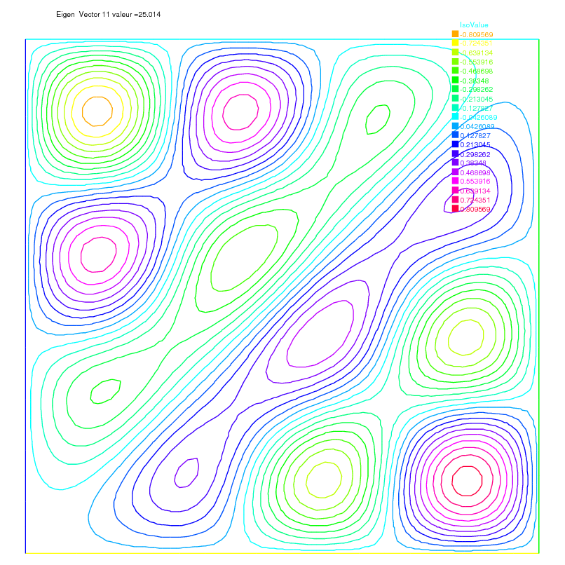|

|Fig. 9.18: Isovalue of 12th eigenvector $u_{4,3}+u_{3,4}$|
|:----:|
||

## Evolution Problems

FreeFem++ also solves evolution problems such as the heat equation:

\begin{eqnarray}
&&\frac{\p u}{\p t}-\mu\Delta u=f\quad \textrm{in }\Omega\times ]0,T[,\\
&&u(\vec x,0)=u_0(\vec x)\quad \textrm{in }\Omega; \qquad
\left(\p u/\p n\right)(\vec x,t)=0\quad\textrm{on }\p\Omega\times ]0,T[.\nonumber
\end{eqnarray}

with a positive viscosity coefficient $\mu$ and homogeneous Neumann boundary conditions.
We solve (\ref{prb:heat} 9.26 $\codered$) by FEM in space and finite differences in time.
We use the definition of the partial derivative of the solution in the time
derivative,

\[
\frac{\p u}{\p t}(x,y,t) = \lim_{\tau \to 0}
\frac{u(x,y,t)-u(x,y,t-\tau )}{\tau }
\]

which indicates that $u^m(x,y)=u(x,y,m\tau )$ will satisfy approximatively

\[
\frac{\p u}{\p t}(x,y,m\tau )\simeq \frac{u^m(x,y)-u^{m-1}(x,y)}{\tau }
\]

The time discretization of heat equation (\ref{eqn:heat} 9.27 $\codered$) is as follows:

\begin{eqnarray}
&&\frac{u^{m+1}-u^{m}}{\tau }-\mu\Delta u^{m+1}=f^{m+1}
\quad \textrm{in }\Omega\\
&&u^0(\vec x)=u_0(\vec x)\quad \textrm{in }\Omega; \qquad
\p u^{m+1}/\p n(\vec x)=0\quad\textrm{on }\p\Omega,\quad
\textrm{for all }m=0,\cdots,[T/\tau ],\nonumber
\end{eqnarray}

which is so-called _backward Euler method_ for (\ref{eqn:heat} 9.27 $\codered$).
To obtain the variational formulation, multiply with the test function $v$ both sides of the equation:

\begin{equation*}
\int_{\Omega }\{u^{m+1}v-\tau \Delta u^{m+1}v\}
=\int_{\Omega }\{u^m+\tau f^{m+1}\}v\, .
\end{equation*}

By the divergence theorem, we have

\begin{equation*}
\int_{\Omega} \{u^{m+1}v+\tau \nabla u^{m+1}\cdot \nabla v\}
-\int_{\p\Omega} \tau \left( \p u^{m+1}/\p n\right) v=\int_{\Omega }\{u^mv+\tau f^{m+1}v\}.
\end{equation*}

By the boundary condition $\p u^{m+1}/\p n=0$, it follows that

\begin{equation}
\int_{\Omega} \{u^{m+1}v+\tau \nabla u^{m+1}\cdot \nabla v\}-
\int_{\Omega }\{u^mv+\tau f^{m+1}v\}=0.
\end{equation}

Using the identity just above, we can calculate the finite element
approximation $u_h^m$ of $u^m$ in a step-by-step manner with respect to $t$.

 __Example 9.18__

We now solve the following example with the exact solution $u(x,y,t)=tx^4$.

\begin{eqnarray*}
&&\frac{{\p u}}{{\p t}} - \mu \Delta u = x^4 - \mu 12tx^2 ~
\textrm{in  } \Omega  \times ]0,3[,\, \Omega = ]0,1[^2 \\
&&u(x,y,0) = 0\quad\textrm{on }\Omega,\qquad \left. u \right|_{\p\Omega}  = t*x^4
\end{eqnarray*}

```freefem
// heat equation  $\p_t u = -\mu \Delta u = x^4 - \mu 12tx^2$ $\codered$
mesh Th=square(16,16);
fespace Vh(Th,P1);

Vh u,v,uu,f,g;
real dt = 0.1, mu = 0.01;
problem dHeat(u,v) =
    int2d(Th)( u*v + dt*mu*(dx(u)*dx(v) + dy(u)*dy(v)))
    + int2d(Th) (- uu*v - dt*f*v )
    + on(1,2,3,4,u=g);

real t = 0; // start from t=0
uu = 0; // u(x,y,0)=0
for (int m=0;m<=3/dt;m++)
{
   t=t+dt;
   f = x^4-mu*t*12*x^2;
   g = t*x^4;
   dHeat;
   plot(u,wait=true);
   uu = u;
   cout <<"t="<<t<<"L^2-Error="<<sqrt( int2d(Th)((u-t*x^4)^2) ) << endl;
}
```

In the last statement, the $L^2$-error
$\left(\int_{\Omega}\left| u-tx^4\right|^2\right)^{1/2}$ is calculated at $t=m\tau, \tau =0.1$. At $t=0.1$, the error is 0.000213269. The errors increase with $m$ and 0.00628589 at $t=3$.

The iteration of the backward Euler (\ref{eqn:BackEuler} 9.28 $\codered$) is made by
__for loop__ (see \refSec{Loops} section 4.11 $\codered$).


!!! note
	The stiffness matrix in the loop is used over and over again. FreeFem++ support reuses of stiffness matrix.

### Mathematical Theory on Time Difference Approximations.

In this section, we show the advantage of implicit schemes.
Let $V, H$ be separable Hilbert space and $V$ is dense in $H$.
Let $a$ be a continuous bilinear form over $V \times V$ with coercivity and
symmetry.
Then $\sqrt{a(v,v)}$ become equivalent to the norm $\| v\|$ of $V$.

__Problem Ev$(f,\Omega)$__: For a given $f\in L^2(0,T;V'),\, u^0\in H$

\begin{eqnarray}
\frac{d}{dt}(u(t),v)+a(u(t),v)&=&( f(t),v)\qquad \forall v\in V,,\quad a.e. \, t\in [0,T]\\
u(0)&=&u^0\nonumber
\end{eqnarray}

where $V'$ is the dual space of $V$.
Then, there is an unique solution $u\in L^{\infty}(0,T;H)\cap L^2(0,T;V)$.

Let us denote the time step by $\tau>0$, $N_T=[T/\tau]$. For the discretization, we put $u^n = u(n\tau)$ and consider the time difference for each $\theta\in [0,1]$

\begin{eqnarray}
\frac{1}{\tau}\left( u_h^{n+1}-u_h^n,\phi_i\right)
+a\left( u_h^{n+\theta},\phi_i\right)=\langle f^{n+\theta},\phi_i\rangle\\
i=1,\cdots, m,\quad n=0,\cdots, N_T\nonumber\\
u_h^{n+\theta}=\theta u_h^{n+1}+(1-\theta)u_h^n,\quad
f^{n+\theta}=\theta f^{n+1}+(1-\theta)f^n\nonumber
\end{eqnarray}

Formula (\ref{eqn:t-method} 9.30 $\codered$) is the _forward Euler scheme_ if
$\theta=0$, _Crank-Nicolson scheme_ if $\theta=1/2$,
the _backward Euler scheme_ if $\theta=1$.

Unknown vectors $u^n=(u_h^1,\cdots,u_h^M)^T$ in

\[
u_h^n(x)=u^n_1\phi_1(x)+\cdots+u^n_m\phi_m(x),\quad u^n_1,\cdots,u^n_m\in \R
\]

are obtained from solving the matrix

\begin{eqnarray}
(M+\theta\tau A)u^{n+1}=\{M-(1-\theta)\tau A\}u^n
+\tau\left\{\theta f^{n+1}+(1-\theta)f^n\right\}\\
M=(m_{ij}),\quad m_{ij}=(\phi_j,\phi_i),\qquad
A=(a_{ij}),\quad a_{ij}=a(\phi_j,\phi_i)\nonumber
\end{eqnarray}

Refer \cite[pp.70--75]{TA94} for solvability of (\ref{eqn:Evolution-1} 9.31 $\codered$).
The stability of (\ref{eqn:Evolution-1} 9.31 $\codered$) is in \cite[Theorem 2.13]{TA94}:

Let $\{\mathcal{T}_h\}_{h\downarrow 0}$ be regular triangulations
(see \refSec{Regular Triangulation} section 5.4).
Then there is a number $c_0>0$ independent of $h$ such that,

\begin{eqnarray}
|u_h^n|^2\le
\left\{
\begin{array}{lr}
\frac{1}{\delta}\left\{
|u^0_h|^2+\tau \sum_{k=0}^{n-1}\|f^{k+\theta}\|^2_{V_h'}
\right\}&\theta\in [0,1/2)\\
|u^0_h|^2+\tau \sum_{k=0}^{n-1}\|f^{k+\theta}\|^2_{V_h'}&\theta\in [1/2,1]
\end{array}
\right.
\end{eqnarray}

if the following are satisfied:

1. When $\theta\in [0,1/2)$ $\codered$, then we can take a time step $\tau$ in such a way that

	\begin{eqnarray}
	\tau <\frac{2(1-\delta)}{(1-2\theta)c_0^2}h^2
	\end{eqnarray}

	for arbitrary $\delta\in (0,1)$.

2. When $1/2\le \theta\le 1$, we can take $\tau$ arbitrary.

 __Example 9.19__

```freefem
mesh Th=square(12,12);
fespace Vh(Th,P1);
fespace Ph(Th,P0);

Ph h = hTriangle; // mesh sizes for each triangle
real tau = 0.1, theta=0.;
func real f(real t) {
   return x^2*(x-1)^2 + t*(-2 + 12*x - 11*x^2 - 2*x^3 + x^4);
}
ofstream out("err02.csv"); // file to store calculations
out << "mesh size = "<<h[].max<<", time step = "<<tau<<endl;
for (int n=0;n<5/tau;n++) \\
   out<<n*tau<<",";
out << endl;
Vh u,v,oldU;
Vh f1, f0;
problem aTau(u,v) =
  int2d(Th)( u*v + theta*tau*(dx(u)*dx(v) + dy(u)*dy(v) + u*v))
  - int2d(Th)(oldU*v - (1-theta)*tau*(dx(oldU)*dx(v)+dy(oldU)*dy(v)+oldU*v))
  - int2d(Th)(tau*( theta*f1+(1-theta)*f0 )*v );

while (theta <= 1.0) {
  real t = 0, T=3; // from t=0 to T
  oldU = 0; // u(x,y,0)=0
  out <<theta<<",";
  for (int n=0;n<T/tau;n++) {
      t = t+tau;
      f0 = f(n*tau); f1 = f((n+1)*tau);
      aTau;
      oldU = u;
      plot(u);
      Vh uex = t*x^2*(1-x)^2; // exact sol.$=tx^2(1-x)^2$
      Vh err = u - uex; // $err=$FE-sol - exact
      out<< abs(err[].max)/abs(uex[].max) <<","; // $\|err \|_{L^\infty(\Omega )}/\|u_{ex} \|_{L^\infty(\Omega )}$
  }
  out << endl;
  theta = theta + 0.1;
}
```

$\codered$ figure compilation issue due to vertical bars in formula:

|Fig. 9.19: $\max_{x\in\Omega}|u_h^n(\theta)-u_{ex}(n\tau)|/\max_{x\in\Omega}|u_{ex}(n\tau)|$ at $n=0,1,\cdots,29$|
|:----:|
||

We can see in Fig. \ref{fig:err02} 9.19 $\codered$ that $u_h^n(\theta)$ become unstable at $\theta=0.4$, and figures are omitted in the case $\theta<0.4$.

### Convection

The hyperbolic equation

\begin{eqnarray}
\p_t u +\vec{\alpha} \cdot \nabla u=f;~~ %% FH pb sign 2008 $\codered$
\textrm{for a vector-valued function }\vec{\alpha},~
\end{eqnarray}

appears frequently in scientific problems, for example in the Navier-Stokes equations, in the Convection-Diffusion equation, etc.

In the case of 1-dimensional space, we can easily find the general solution
$(x,t)\mapsto u(x,t)=u^0(x-\alpha t)$ of the following equation, if $\alpha$ is constant,

\begin{eqnarray}
\p_t u +\alpha\p_x u=0,\qquad u(x,0)=u^0(x),
\end{eqnarray}

because $\p_t u +\alpha\p_x u=-\alpha\dot{u}^0+a\dot{u}^0=0$, where $\dot{u}^0=du^0(x)/dx$.
Even if $\alpha$ is not constant, the construction works on similar principles. One begins with the ordinary differential equation (with the convention that $\alpha$ is prolonged by zero apart from $(0,L)\times (0,T)$):

\[
\dot{X}(\tau )=+\alpha(X(\tau ),\tau ),~~~\tau \in (0,t)\quad X(t)=x
\]
% FH pb sign 2008 $\codered$

In this equation $\tau$ is the variable and $x,t$ are parameters, and we denote the solution by $X_{x,t}(\tau )$. Then it is noticed that $(x,t)\rightarrow v(X(\tau),\tau)$ in $\tau=t$ satisfies the equation

\[
\p _{t}v+\alpha\p _{x}v=\p _{t}X\dot{v}+a\p _{x}X\dot{v}%
=0
\]

and by the definition $\p _{t}X=\dot{X}=+\alpha$ and %% FH pb sign 2008 $\codered$
$\p_{x}X=\p _{x}x$ in $\tau=t$, because if $\tau =t$ we have $X(\tau )=x$.
The general solution of (\ref{eqn:conv0} 9.35 $\codered$) is thus the value of the boundary condition in $X_{x, t}(0)$, that is to say $u(x,t)=u^{0}(X_{x,t}(0))$ where $X_{x,t}(0)$ is on the $x$ axis, $u(x,t)=u^{0}(X_{x,t}(0))$ if $X_{x,t}(0)$ is on the axis of $t$.

In higher dimension $\Omega \subset R^{d},~d=2,3$, the equation for the
convection is written

\[
\p _{t}u+\vec{\alpha}\cdot \nabla u=0\hbox{ in }\Omega \times (0,T)
\]

where  $\vec{a}(x,t)\in R^{d}$.
FreeFem++ implements the Characteristic-Galerkin method for convection operators. Recall that the equation (\ref{eqn:conv} 9.34 $\codered$) can be discretized as

\[
\frac{Du}{Dt} = f\;\;\textrm{i.e. }\frac{du}{dt}\left( {X(t),t} \right) = f\left(X( t ),t \right)\textrm{  where  }\frac{dX}{dt}( t ) = \vec \alpha( {X(t),t})
\]

where $D$  is the total derivative operator.
So a good scheme is one step of backward
convection by the method of Characteristics-Galerkin

\begin{eqnarray}
\frac{1}{{\tau }}\left(u^{m + 1}(x) - u^m(X^m(x))\right) = f^m (x)
\end{eqnarray}

where $X^m (x)$ is an approximation of the solution at $t = m\tau $
of the ordinary differential equation

\[
\frac{d\vec{X}}{dt}(t) = \vec{\alpha}^m(\vec{X}(t)),\, \vec{X}((m + 1)\tau ) = x.
\]

where $\vec{\alpha}^m(x)=(\alpha_1(x,m\tau ),\alpha_2(x,m\tau))$.
Because, by Taylor's expansion, we have

\begin{eqnarray}
u^m(\vec {X}(m\tau ))&=&
u^m(\vec{X}((m+1)\tau )) -
\tau \sum_{i=1}^d \frac{\p u^m}{\p x_i}(\vec{X}((m+1)\tau ))
\frac{\p X_i}{\p t}((m+1)\tau )
+o(\tau )\nonumber\\
&=&u^m(x)-\tau \vec{\alpha}^m(x)\cdot \nabla u^m(x)+o(\tau )
\end{eqnarray}

where $X_i(t)$ are the i-th component of $\vec{X}(t)$,
$u^m(x)=u(x,m\tau )$
and we used the chain rule and $x=\vec{X}((m+1)\tau )$.
From (\ref{eqn:conv1} 9.37 $\codered$), it follows that

\begin{eqnarray}
u^m(X^m(x))=u^m(x)-\tau \vec{\alpha}^m(x)\cdot \nabla u^m(x)+o(\tau ).
\end{eqnarray}

Also we apply Taylor's expansion for
$t\mapsto u^m(x-\vec{\alpha}^m(x)t),\, 0\le t\le \tau $, then

\[
u^m(x-\vec{\alpha}\tau )=u^m(x)-\tau \vec{\alpha}^m(x)\cdot \nabla u^m(x)+o(\tau ).
\]

Putting

`:::freefem convect` $\left( {\vec{\alpha},-\tau ,u^m } \right)\approx u^m \left(x - \vec{\alpha}^m\tau  \right)$

,%% FH 2008 sign $\codered$

we can get the approximation


$u^m \left( {X^m( x )} \right) \approx$ `:::freefem convect` $\left( {[a_1^m ,a_2^m],-\tau ,u^m } \right)\;\;\textrm{by }X^m \approx x \mapsto x- \tau [a_1^m(x) ,a_2^m(x)]$

%% FH 2008 sign $\codered$

A classical convection problem is that of the "rotating bell" (quoted from \cite{Lucquin} $\codered$[p.16]).
Let $\Omega$ be the unit disk centered at 0, with its center rotating with speed $\alpha_1 = y,\, \alpha_2 = -x$. We consider the problem (\ref{eqn:conv} 9.34 $\codered$) with $f=0$ and the initial condition
$u(x,0)=u^0(x)$, that is, from (\ref{eqn:Charac} 9.36 $\codered$)


$u^{m + 1}(x) = u^m(X^m(x))\approx$ `:::freefem convect`$(\vec{\alpha},-\tau ,u^m)$

% FH 2008 sign $\codered$

The exact solution is $u(x, t) = u(\vec{X}(t))$ where $\vec{X}$ equals $x$ rotated around the origin by an angle $\theta = -t$ (rotate in clockwise). So, if $u^0$ in a 3D perspective looks like a bell, then $u$ will have exactly the same shape, but rotated by the same amount. The program consists in solving the equation until $T = 2\pi$, that is for a full revolution and to compare the final solution with the initial one; they should be equal.

 __Example 9.20__ convect.edp

```freefem
border C(t=0, 2*pi) { x=cos(t);  y=sin(t); }; // the unit circle
mesh Th = buildmesh(C(70)); // triangulates the disk
fespace Vh(Th,P1);
Vh u0 = exp(-10*((x-0.3)^2 +(y-0.3)^2)); // give $u^0$

real dt = 0.17,t=0; // time step
Vh a1 = -y, a2 = x; // rotation velocity
Vh u; // $u^{m+1}$
for (int m=0; m<2*pi/dt ; m++) {
    t += dt;
    u=convect([a1,a2],-dt,u0); // $u^{m+1}=u^m(X^m(x))$
    u0=u; // m++
    plot(u,cmm=" t="+t + ", min=" + u[].min + ", max=" +  u[].max,wait=0);
};
```

!!! note

	The scheme `:::freefem convect` is unconditionally stable, then the bell become lower and lower (the maximum of $u^{37}$ is $0.406$ as shown in Fig. \ref{BellLast} 9.21 $\codered$).

|Fig. 9.20: $u^0=e^{-10((x-0.3)^2 +(y-0.3)^2)}$|
|:----:|
||

|Fig. 9.21: The bell at $t=6.29$|
|:----:|
||

### 2D Black-Scholes equation for an European Put option

In mathematical finance, an option on two assets is modeled by a Black-Scholes equations in two space
variables, (see for example Wilmott et al\cite{wilmott} $\codered$ or Achdou et al \cite{achdou} $\codered$).

\begin{eqnarray}
 &&\p _t u + \frac{{\left( {\sigma _1 x } \right)^2 }}{2}\frac{{\p ^2 u}}{{\p x^2 }} + \frac{{\left( {\sigma _2 y } \right)^2 }}{2}\frac{{\p ^2 u}}{{\p y^2 }} \\
 &&{\rm{      }} + \rho x y \frac{{\p ^2 u}}{{\p x \p y }} + rS_1 \frac{{\p u}}{{\p x }} + rS_2 \frac{{\p u}}{{\p y }} - rP = 0 \nonumber
\end{eqnarray}

which is to be integrated in $\left( {0,T} \right) \times \R^ +   \times \R^ +$
subject to, in the case of a put

\begin{eqnarray}
u\left( {x , y ,T} \right) = \left( {K - \max \left( {x ,y } \right)} \right)^ +  .
\end{eqnarray}

Boundary conditions for this problem may not be so easy to device. As in the one dimensional case the PDE contains boundary conditions on the axis $x_1 = 0$ and on the axis $x_2 = 0$, namely two one dimensional Black-Scholes equations driven respectively by the data $u\left( {0, + \infty ,T} \right)$ and $u\left( { + \infty ,0,T} \right)$. These will be automatically accounted for because they are embedded in the PDE. So if we do nothing in the variational form (i.e. if we take a Neumann boundary condition at these two axis in the strong form) there will be no disturbance to these. At infinity in one of the variable, as in 1D, it makes sense to impose $u=0$. We take

\begin{eqnarray}
\sigma _1  = 0.3,\;\;\sigma _2  = 0.3,\;\;\rho  = 0.3,\;\;r = 0.05,\;\;K = 40,\;\;T = 0.5
\end{eqnarray}

An implicit Euler scheme is used and a mesh adaptation is done every 10 time steps. To have an unconditionally stable scheme, the first order terms are treated by the Characteristic Galerkin method, which, roughly, approximates

\begin{eqnarray}
\frac{{\p u}}{{\p t}} + a_1 \frac{{\p u}}{{\p x}} + a_2 \frac{{\p u}}{{\p y}} \approx \frac{1}{{\tau }}\left( {u^{n + 1} \left( x \right) - u^n \left( {x - \vec \alpha\tau } \right)} \right)
\end{eqnarray}

 __Example 9.21__ BlackSchol.edp

```freefem
// file BlackScholes2D.edp
int m=30,L=80,LL=80, j=100;
real sigx=0.3, sigy=0.3, rho=0.3, r=0.05, K=40, dt=0.01;
mesh th=square(m,m,[L*x,LL*y]);
fespace Vh(th,P1);

Vh u=max(K-max(x,y),0.);
Vh xveloc, yveloc, v,uold;

for (int n=0; n*dt <= 1.0; n++)
{
  if(j>20)  { th = adaptmesh(th,u,verbosity=1,abserror=1,nbjacoby=2,
              err=0.001, nbvx=5000, omega=1.8, ratio=1.8, nbsmooth=3,
              splitpbedge=1, maxsubdiv=5,rescaling=1) ;
     j=0;
     xveloc = -x*r+x*sigx^2+x*rho*sigx*sigy/2;
     yveloc = -y*r+y*sigy^2+y*rho*sigx*sigy/2;
     u=u;
    };
  uold=u;
  solve eq1(u,v,init=j,solver=LU) = int2d(th)( u*v*(r+1/dt)
        + dx(u)*dx(v)*(x*sigx)^2/2 + dy(u)*dy(v)*(y*sigy)^2/2
        + (dy(u)*dx(v) + dx(u)*dy(v))*rho*sigx*sigy*x*y/2)
        - int2d(th)( v*convect([xveloc,yveloc],dt,w)/dt) + on(2,3,u=0);

  j=j+1;
};
plot(u,wait=1,value=1);
```

Results are shown on Fig. \ref{blackScholesE} 9.21 $\codered$).

|Fig. 9.22: The adapted triangulation|
|:----:|
||

|Fig. 9.23: The level line of the European basquet put option|
|:----:|
|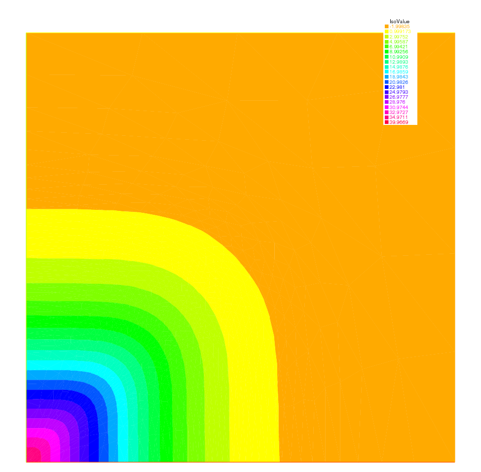|

## Navier-Stokes Equation

### Stokes and Navier-Stokes

The Stokes equations are: for a given $\vec{f}\in L^2(\Omega)^2$,

\begin{equation}
    \left.\begin{array}{cl}
 -\Delta \vec{u}+\nabla p & =\vec{f} \\
 \nabla\cdot \vec{u} &=0
 \end{array}\right\}\quad \hbox{ in }\Omega
\end{equation}

where $\vec{u}=(u_1,u_2)$ is the velocity vector and $p$ the pressure. For simplicity, let us choose Dirichlet boundary conditions on the velocity, $\vec{u}=\vec{u}_{\Gamma}$ on $\Gamma$.

In Temam [Theorem 2.2], there ia a weak form of (\ref{eqn:Stokes} 9.43 $\codered$):
Find $\vec{v}=(v_1,v_2)\in \vec{V}(\Omega)$

\[
\vec{V}(\Omega)=\{\vec{w}\in H^1_0(\Omega)^2|\; \textrm{div}\vec{w}=0\}
\]

which satisfy

\[
\sum_{i=1}^2\int_{\Omega}\nabla u_i\cdot \nabla v_i=\int_{\Omega}\vec{f}\cdot \vec{w}
\quad \textrm{for all }v\in V
\]

Here it is used the existence $p\in H^1(\Omega)$ such that $\vec{u}=\nabla p$, if

\[
\int_{\Omega}\vec{u}\cdot \vec{v}=0\quad \textrm{for all }\vec{v}\in
V
\]

Another weak form is derived as follows: We put

\begin{eqnarray*}
\vec{V}=H^1_0(\Omega)^2;\quad
W=\left\{q\in L^2(\Omega)\left|\; \int_{\Omega}q=0\right.\right\}
\end{eqnarray*}

By multiplying the first equation in (\ref{eqn:Stokes} 9.43 $\codered$) with $v\in V$ and the
second with $q\in W$, subsequent integration over $\Omega$, and an application of Green's formula, we have

\begin{eqnarray*}
\int_{\Omega}\nabla\vec{u}\cdot \nabla\vec{v}-\int_{\Omega}\textrm{div}\vec{v}\, p
&=&\int_{\Omega}\vec{f}\cdot\vec{v}\\
\int_{\Omega}\textrm{div}\vec{u}\, q&=&0
\end{eqnarray*}

This yields the weak form of (\ref{eqn:Stokes} 9.43 $\codered$):
Find $(\vec{u},p)\in \vec{V}\times W$ such that

\begin{eqnarray}
a(\vec{u},\vec{v})+b(\vec{v},p)&=&(\vec{f},\vec{v})\\
b(\vec{u},q)&=&0
\end{eqnarray}

for all $(\vec{v},q)\in V\times W$, where

\begin{eqnarray}
a(\vec{u},\vec{v})&=&\int_{\Omega}\nabla \vec{u}\cdot \nabla\vec{v}
=\sum_{i=1}^2\int_{\Omega}\nabla u_i\cdot \nabla v_i\\
b(\vec{u},q)&=&-\int_{\Omega}\textrm{div}\vec{u}\, q
\end{eqnarray}

Now, we consider finite element spaces $\vec{V}_h\subset \vec{V}$ and $W_h\subset W$,
and we assume the following basis functions

\begin{eqnarray*}
&&\vec{V}_h=V_h\times V_h,\quad
V_h=\{v_h|\; v_h=v_1\phi_1+\cdots +v_{M_V}\phi_{M_V}\},\\
&&W_h=\{q_h|\; q_h=q_1\varphi_1+\cdots +q_{M_W}\varphi_{M_W}\}
\end{eqnarray*}

The discrete weak form is:
Find $(\vec{u}_{h},p_{h}) \in \vec{V}_{h} \times W_{h}$ such that

\begin{equation}
    \begin{array}{cll}
   a(\vec{u}_h,\vec{v}_h)+b(\vec{v}_h,p)  &= (\vec{f},\vec{v}_h) ,
      &\forall \vec{v}_{h} \in \vec{V}_{h} \\
    b(\vec{u}_h,q_h)&= 0,
     &\forall q_{h} \in W_{h}
    \end{array}
\end{equation}

!!! note

	Assume that:

	1. There is a constant $\alpha_h>0$ such that

		\[
		a(\vec{v}_h,\vec{v}_h)\ge \alpha\| \vec{v}_h\|_{1,\Omega}^2\quad \textrm{for all }\vec{v}_h\in Z_h
		\]

		where

		\[
		Z_h=\{\vec{v}_h\in \vec{V}_h|\; b(\vec{w}_h,q_h)=0\quad \textrm{for all }q_h\in W_h\}
		\]

	2. There is a constant $\beta_h>0$ such that

		\[
		\sup_{\vec{v}_h\in \vec{V}_h}\frac{b(\vec{v}_h,q_h)}{\| \vec{v}_h\|_{1,\Omega}}
		\ge \beta_h\| q_h\|_{0,\Omega}\quad \textrm{for all }q_h\in W_h
		\]

	Then we have an unique solution $(\vec{u}_h,p_h)$ of (\ref{eqn:vfStokes} 9.48 $\codered$) satisfying

	\[
	\| \vec{u}-\vec{u}_h\|_{1,\Omega}+\| p-p_h\|_{0,\Omega}
	\le C\left(
	\inf_{\vec{v}_h\in \vec{V}_h}\| u-v_h\|_{1,\Omega}
	+\inf_{q_h\in W_h}\| p-q_h\|_{0,\Omega}\right)
	\]

	with a constant $C>0$ (see e.g. \cite[Theorem 10.4]{RT93} $\codered$).

Let us denote that

\begin{eqnarray}
A&=&(A_{ij}),\, A_{ij}=\int_{\Omega}\nabla \phi_j\cdot \nabla \phi_i\qquad
i,j=1,\cdots,M_{\vec{V}}\\
\vec{B}&=&(Bx_{ij},By_{ij}),\,
Bx_{ij}=-\int_{\Omega}\p \phi_j/\p x\, \varphi_i\qquad
By_{ij}=-\int_{\Omega}\p \phi_j/\p y\, \varphi_i\nonumber\\
&&\qquad i=1,\cdots,M_W;j=1,\cdots,M_V\nonumber
\end{eqnarray}

then (\ref{eqn:vfStokes} 9.48 $\codered$) is written by

\begin{eqnarray}
\left(
\begin{array}{cc}
\vec{A}&\vec{\vec{B}}^*\\
\vec{B}&0
\end{array}
\right)
\left(
\begin{array}{cc}
\vec{U}_h\\
\{p_h\}
\end{array}
\right)
=
\left(
\begin{array}{cc}
\vec{F}_h\\
0
\end{array}
\right)
\end{eqnarray}
where
\begin{eqnarray*}
&&\vec{A}=\left(
\begin{array}{cc}
A&0\\
0&A
\end{array}
\right)
\qquad
\vec{B}^*=\left\{
\begin{array}{c}
Bx^T\\
By^T
\end{array}
\right\}
\qquad
\vec{U}_h=\left\{
\begin{array}{c}
\{u_{1,h}\}\\
\{u_{2,h}\}
\end{array}
\right\}
\qquad
\vec{F}_h=\left\{
\begin{array}{c}
\{\textstyle{\int_{\Omega}f_1\phi_i}\}\\
\{\textstyle{\int_{\Omega}f_2\phi_i}\}
\end{array}
\right\}
\end{eqnarray*}

__Penalty method:__ This method consists of replacing (\ref{eqn:vfStokes} 9.48 $\codered$) by a more regular problem: Find
$(\vec{v}_h^{\epsilon},p_h^{\epsilon})\in \vec{V}_h\times \tilde{W}_{h}$ satisfying

\begin{equation}
    \begin{array}{cll}
   a(\vec{u}_h^\epsilon,\vec{v}_h)+b(\vec{v}_h,p_h^{\epsilon})  &= (\vec{f},\vec{v}_h) ,
      &\forall \vec{v}_{h} \in \vec{V}_{h} \\
    b(\vec{u}_h^{\epsilon},q_h)-\epsilon(p_h^{\epsilon},q_h)&= 0,
     &\forall q_{h} \in \tilde{W}_{h}
    \end{array}
\end{equation}

where $\tilde{W}_h\subset L^2(\Omega)$. Formally, we have

\[
\textrm{div}\vec{u}_h^{\epsilon}=\epsilon p_h^{\epsilon}
\]

and the corresponding algebraic problem

\begin{eqnarray*}
\left(
\begin{array}{cc}
\vec{A}&B^*\\
B&-\epsilon I
\end{array}
\right)
\left(
\begin{array}{cc}
\vec{U}_h^{\epsilon}\\
\{p_h^{\epsilon}\}
\end{array}
\right)
=
\left(
\begin{array}{cc}
\vec{F}_h\\
0
\end{array}
\right)
\end{eqnarray*}

!!! note

	We can eliminate $p_h^\epsilon=(1/\epsilon)BU_h^{\epsilon}$ to obtain

	\begin{eqnarray}
	(A+(1/\epsilon)B^*B)\vec{U}_h^{\epsilon}=\vec{F}_h^{\epsilon}
	\end{eqnarray}

	Since the matrix $A+(1/\epsilon)B^*B$ is symmetric, positive-definite, and sparse, (\ref{eqn:StiffPvfStokes} 9.52 $\codered$) can be solved by known technique. There is a constant $C>0$ independent of $\epsilon$ such that

	\[
	\|\vec{u}_h-\vec{u}_h^\epsilon\|_{1,\Omega}+
	\|p_h-p_h^{\epsilon}\|_{0,\Omega}\le C\epsilon
	\]

	(see e.g. \cite[17.2]{RT93})

 __Example 9.22__ Cavity.edp

The driven cavity flow problem is solved first at zero Reynolds number (Stokes flow) and then at Reynolds 100. The velocity pressure formulation is used first and then the calculation is repeated with the stream function vorticity formulation.

We solve the driven cavity problem by the penalty method (\ref{eqn:PvfStokes} 9.51 $\codered$) where $\vec{u}_{\Gamma}\cdot \vec{n}=0$ and $\vec{u}_{\Gamma}\cdot \vec{s}=1$ on the top boundary and zero elsewhere ($\vec{n}$ is the unit normal to $\Gamma$, and $\vec{s}$ the unit tangent to $\Gamma$).

The mesh is constructed by

```freefem
mesh Th=square(8,8);
```

We use a classical Taylor-Hood element technic to solve the problem:

The velocity is approximated with the $P_{2}$ FE ( $X_{h}$ space), and the pressure is approximated with the $P_{1}$ FE ( $M_{h}$ space), where

$$X_{h} = \left\{ \vec{v} \in H^{1}(]0,1[^2) \left|\; \forall K \in \mathcal{T}_{h}\quad v_{|K} \in P_{2}\right.\right\}$$

and

$$M_{h} = \left\{ v \in H^{1}(]0,1[^2) \left|\; \forall K \in \mathcal{T}_{h}\quad v_{|K} \in P_{1} \right.\right\}$$

The FE spaces and functions are constructed by

```freefem
fespace Xh(Th,P2); // definition of the velocity component space
fespace Mh(Th,P1); // definition of the pressure space
Xh u2,v2;
Xh u1,v1;
Mh p,q;
```

The Stokes operator is implemented as a system-solve for the velocity
$(u1,u2)$ and the pressure $p$. The test function for the velocity is $(v1,v2)$
and $q$ for the pressure, so the variational form (\ref{eqn:vfStokes} 9.48 $\codered$) in freefem
language is:

```freefem
solve Stokes (u1,u2,p,v1,v2,q,solver=Crout) =
    int2d(Th)( ( dx(u1)*dx(v1) + dy(u1)*dy(v1)
            +  dx(u2)*dx(v2) + dy(u2)*dy(v2) )
            - p*q*(0.000001)
            - p*dx(v1) - p*dy(v2)
            - dx(u1)*q - dy(u2)*q
           )
  + on(3,u1=1,u2=0)
  + on(1,2,4,u1=0,u2=0); // see \refSec{Square} for labels 1,2,3,4
```

Each unknown has its own boundary conditions.

If the streamlines are required, they can be computed by finding $\psi$ such that rot$\psi=u$ or better,

$$-\Delta\psi=\nabla\times u$$

```freefem
Xh psi,phi;

solve streamlines(psi,phi) =
      int2d(Th)( dx(psi)*dx(phi) + dy(psi)*dy(phi))
   +  int2d(Th)( -phi*(dy(u1)-dx(u2)))
   +  on(1,2,3,4,psi=0);
```

Now the Navier-Stokes equations are solved

$${\p {u}\over\p t} +u\cdot\nabla u-\nu \Delta u+\nabla p=0,~~~ \nabla\cdot u=0$$

with the same boundary conditions and with initial conditions $u=0$.

This is implemented by using the convection operator `:::freefem convect` for the term ${\p u\over\p t} +u\cdot\nabla u$, giving a discretization in time

\begin{equation}
\begin{array}{cl}
\frac{1}{\tau } (u^{n+1}-u^n\circ X^n) -\nu\Delta u^{n+1} + \nabla p^{n+1} &=0,\\
 \nabla\cdot u^{n+1} &= 0
 \end{array}
\end{equation}

The term $u^n\circ X^n(x)\approx u^n(x-u^n(x)\tau )$ will be computed by the operator `:::freefem convect`, so we obtain

```freefem
int i=0;
real nu=1./100.;
real dt=0.1;
real alpha=1/dt;

Xh up1,up2;

problem NS (u1,u2,p,v1,v2,q,solver=Crout,init=i) =
    int2d(Th)(
             alpha*( u1*v1 + u2*v2)
            + nu * ( dx(u1)*dx(v1) + dy(u1)*dy(v1)
            +  dx(u2)*dx(v2) + dy(u2)*dy(v2) )
            - p*q*(0.000001)
            - p*dx(v1) - p*dy(v2)
            - dx(u1)*q - dy(u2)*q
           )
  + int2d(Th) ( -alpha*
       convect([up1,up2],-dt,up1)*v1 -alpha*convect([up1,up2],-dt,up2)*v2 )
  + on(3,u1=1,u2=0)
  + on(1,2,4,u1=0,u2=0)
;

for (i=0;i<=10;i++)
 {
   up1=u1;
   up2=u2;
   NS;
   if ( !(i % 10)) // plot every 10 iteration
    plot(coef=0.2,cmm=" [u1,u2] and p  ",p,[u1,u2]);
 } ;
```

Notice that the stiffness matrices are reused (keyword `:::freefem init=i`)

### Uzawa Algorithm and Conjugate Gradients

We solve Stokes problem without penalty.
The classical iterative method of Uzawa is described by the algorithm
(see e.g.\cite[17.3]{RT93}, \cite[13]{GP79} or \cite[13]{RG84} $\codered$):

* __Initialize:__ Let $p_h^0$ be an arbitrary chosen element of $L^2(\Omega)$.

* __Calculate $\vec{u}_h$:__ Once $p_h^n$ is known, $\vec{v}_h^n$ is the solution of

  \[
  \vec{u}_h^n = A^{-1}(\vec{f}_h-\vec{B}^*p_h^n)
  \]

* __Advance $p_h$:__ Let $p_h^{n+1}$ be defined by

	\[
	p_h^{n+1}=p_h^n+\rho_n\vec{B}\vec{u}_h^n
	\]

There is a constant $\alpha>0$ such that $\alpha\le \rho_n\le 2$ for each $n$, then $\vec{u}_h^n$ converges to the solution $\vec{u}_h$, and then $B\vec{v}_h^n\to 0$ as $n\to \infty$ from the _Advance $p_h$_. This method in general converges quite slowly.

First we define mesh, and the Taylor-Hood approximation.
So $X_{h}$ is the velocity space, and $M_{h}$ is the pressure space.

 __Example 9.23__ StokesUzawa.edp

```freefem
mesh Th=square(10,10);
fespace Xh(Th,P2),Mh(Th,P1);
Xh u1,u2,v1,v2;
Mh p,q,ppp; // ppp is a working pressure
```

```freefem
varf bx(u1,q) = int2d(Th)( -(dx(u1)*q));
varf by(u1,q) = int2d(Th)( -(dy(u1)*q));
varf a(u1,u2)= int2d(Th)(  dx(u1)*dx(u2) + dy(u1)*dy(u2) )
                    +  on(3,u1=1)  +  on(1,2,4,u1=0) ;
// remark:  put the `:::freefem on(3,u1=1)` before  `:::freefem on(1,2,4,u1=0)`
// because we want zero on intersection %

matrix A= a(Xh,Xh,solver=CG);
matrix Bx= bx(Xh,Mh); // $\vec{B}=(Bx\quad By)$
matrix By= by(Xh,Mh);

Xh bc1; bc1[] = a(0,Xh); // boundary condition contribution on u1
Xh bc2; bc2   = O ; // no boundary condition contribution on u2
Xh b;
```

$p_h^n\to \vec{B}A^{-1}(-\vec{B}^*p_h^n)=-\textrm{div}\vec{u}_h$
is realized as the function `:::freefem divup`.

```freefem
func real[int] divup(real[int] & pp)
{
 // compute u1(pp)
   b[]  = Bx'*pp; b[] *=-1; b[] += bc1[] ;    u1[] = A^-1*b[];
 // compute u2(pp)
   b[]  = By'*pp; b[] *=-1; b[] += bc2[] ;    u2[] = A^-1*b[];
 // $\vec{u}^n=A^{-1}(Bx^Tp^n\quad By^Tp^n)^T$
   ppp[] =   Bx*u1[]; // $  ppp= Bx u_{1} $
   ppp[] +=  By*u2[]; // $   \quad   +  By u_{2} $
   return ppp[] ;
};
```

 Call now the conjugate gradient algorithm:

```freefem
p=0;q=0; // $p_h^0 = 0$
LinearCG(divup,p[],eps=1.e-6,nbiter=50); // $p_h^{n+1}=p_h^n+\vec{B}\vec{u}_h^n$
// if $n> 50$ or $|p_h^{n+1}-p_h^n|\le 10^{-6}$, then the loop end.
divup(p[]); // compute the final solution

plot([u1,u2],p,wait=1,value=true,coef=0.1);
```

### NSUzawaCahouetChabart.edp

In this example we solve the Navier-Stokes equation past a cylinder with the Uzawa algorithm preconditioned by the Cahouet-Chabart method (see \cite{RG03} 36 $\codered$ for all the details).

The idea of the preconditioner is that in a periodic domain, all differential operators commute and the Uzawa algorithm comes to solving the linear operator $\nabla. ( (\alpha Id + \nu \Delta)^{-1} \nabla$, where $ Id $ is the identity operator. So the preconditioner suggested is $\alpha \Delta^{-1} + \nu Id$.

To implement this, we do

 __Example 9.24__ NSUzawaCahouetChabart.edp

```freefem
real D=0.1, H=0.41;
real cx0 = 0.2, cy0 = 0.2; // center of cyl.
real xa = 0.15, ya=0.2, xe = 0.25,ye =0.2;
border fr1(t=0,2.2){x=t; y=0; label=1;}
border fr2(t=0,H){x=2.2; y=t; label=2;}
border fr3(t=2.2,0){x=t; y=H; label=1;}
border fr4(t=H,0){x=0; y=t; label=1;}
border fr5(t=2*pi,0){x=cx0+D*sin(t)/2; y=cy0+D*cos(t)/2; label=3;}
int nn=15;

mesh Th=buildmesh(fr1(5*nn)+fr2(nn)+fr3(5*nn)+fr4(nn)+fr5(-nn*3));
real Um= 1.5;// max velocity (Rey 100)
func Ub = Um*2./3.;
real nu = 1e-3;
real Rey = Ub*D/nu;
// Boundary condition
func U1 = 4.*Um*y*(H-y)/(H*H)  ;
func U2 = 0. ;

real T=2,t=0;
real dt = D/nn/Um;// CFL = 1
 cout << " dt = " << dt <<endl;
real alpha=1/dt,epspq=1e-10;


fespace Mh(Th,[P1]);
fespace Xh(Th,[P2]);
fespace Wh(Th,[P1dc]);
macro grad(u) [dx(u),dy(u)] //
macro div(u1,u2) (dx(u1)+dy(u2)) //


 varf von1([u1,u2,p],[v1,v2,q]) =  on(3,u1=0,u2=0) + on(1,u1=U1,u2=U2);


//remark : the value 100 in next line is manualy fitted, because free outlet.
 varf vA(p,q) =int2d(Th)((grad( p ) '*grad(q)) ) + int1d(Th,2)(100*p*q) ;

 varf vM(p,q) =int2d(Th,qft=qf2pT)(  p*q )+ on(2,p=0);

 varf vu([u1],[v1]) = int2d(Th)(alpha*(u1*v1)+nu*(grad(u1)'*grad(v1) ))
                       + on(1,3,u1=0) ;
 varf vu1([p],[v1]) = int2d(Th)(p*dx(v1)) ;
 varf vu2([p],[v1]) = int2d(Th)(p*dy(v1)) ;


 matrix pAM=vM(Mh,Mh,solver=UMFPACK);
 matrix pAA=vA(Mh,Mh,solver=UMFPACK);
 matrix AU=vu(Xh,Xh,solver=UMFPACK);
 matrix B1=vu1(Mh,Xh);
 matrix B2=vu2(Mh,Xh);
 Xh u1,u2;
 Mh p;
varf vonu1([u1],[v1]) =  on(1,u1=U1) + on(3,u1=0);
varf vonu2([u1],[v1]) =  on(1,u1=U2) + on(3,u1=0);


real[int] brhs1 = vonu1(0,Xh);
real[int] brhs2 = vonu2(0,Xh);

varf vrhs1(uu,vv)  = int2d(Th) (convect([u1,u2],-dt,u1)*vv*alpha)+vonu1 ;
varf vrhs2(v2,v1)  = int2d(Th) (convect([u1,u2],-dt,u2)*v1*alpha)+vonu2;
```

The functions to define Uzawa and the preconditioner part.

```freefem
func real[int]   JUzawa(real[int] & pp)
{
	real[int] b1=brhs1; b1 += B1*pp;
	real[int] b2=brhs2; b2 += B2*pp;
	u1[] = AU^-1 * b1;
	u2[] = AU^-1 * b2;
	pp  = B1'*u1[];
	pp += B2'*u2[];
	pp = -pp;
	return pp;
}

func real[int]   Precon(real[int] & p)
 {
    real[int] pa= pAA^-1*p;
    real[int] pm= pAM^-1*p;
    real[int] pp= alpha*pa+nu*pm;
  	return pp;
 }
```

The loop in time.
Warning with the stop test of the conjugate gradient, because
we start from the previous solution and the end the previous solution
is close to the final solution, don't take a relative stop test to
the first residual, take an absolute stop test ( negative here)

```freefem
 verbosity = 0;
 p=0;

 Wh w; // to store vorticity ..

 real eps=1e-6;
 int ndt = T/dt;
 for(int i=0;i<ndt;++i)
 {
     brhs1 = vrhs1(0,Xh);
     brhs2 = vrhs2(0,Xh);
     int res=LinearCG(JUzawa,p[],precon=Precon,nbiter=100,verbosity=10,veps=eps);
     assert(res==1) ;
     eps = -abs(eps);
     w = -dy(u1)+dx(u2);
     plot(w,fill=1,wait=0, nbiso=40);

     dt = min(dt,T-t);
     t += dt;
     if( dt < 1e-10*T) break;
 }
 plot(w,fill=1,wait=0, nbiso=40,ps="NScahouetChabart"); // see fig. \ref{Fig NScahouetChabart} $\codered$

 cout << " u1 max " << u1[].linfty
      << " u2 max " << u2[].linfty
      << " p max = " << p[].max << endl;
```

|Fig. 9.24: The vorticity at Reynolds number 100 a time 2s with the Cahouet-Chabart method.|
|:----:|
||

## Variational inequality

We present, a classical example of variational inequality.

Let us denote  $\mathcal{C} = \{ u\in H^1_0(\Omega), u \le g \}$

The problem is :
$$
 u = arg \min_{u\in \mathcal{C}}  J(u) = \frac{1}{2} \int_\Omega \nabla u . \nabla u - \int_\Omega f u
$$
where $f$ and $g$ are given function.

The solution is a projection on the convex $\mathcal{C}$ of $f^\star$ for the scalar product $((v,w)) = \int_\Omega \nabla v . \nabla w$ of $H^1_0(\Omega)$ where ${f^\star} $ is solution of $ ((f^\star, v )) = \int_\Omega f v, \forall v \in H^1_0(\Omega)$.

The projection on a convex satisfy clearly $\forall v \in \mathcal{C}, \quad (( u -v ,  u - \tilde{f}  )) \leq 0$, and after expanding, we get the classical inequality

$$\forall v \in \mathcal{C}, \quad \int_\Omega \nabla(u -v) \nabla u  \leq  \int_\Omega (u-v) f .$$

We can also rewrite the problem as a saddle point problem

Find $\lambda, u$ such that:
$$
  \max_{\lambda\in L^2(\Omega), \lambda\geq 0}  \min_{u\in H^1_0(\Omega)}  \mathcal{L}(u,\lambda) = \frac{1}{2} \int_\Omega \nabla u . \nabla u - \int_\Omega f u  + \int_{\Omega} \lambda (u-g)^+
$$
where $((u-g)^+ = max(0,u-g) $

This saddle point problem is equivalent to find $ u, \lambda $ such that:

\begin{equation}
 \left\{
\begin{array}{cc}
\displaystyle \int_\Omega \nabla u . \nabla v + \lambda v^+ \,d\omega= \int_\Omega f u  , &\forall v \in H^1_0(\Omega) \cr
\displaystyle \int_\Omega   \mu (u-g)^+ = 0  , & \forall \mu \in L^2(\Omega) , \mu \geq 0, \lambda \geq 0,
 \end{array}\right.
\end{equation}

An algorithm to solve the previous problem is:

1. k=0, and choose, $\lambda_0$ belong $H^{-1}(\Omega)$

2. Loop on $k = 0, .....$

	* set $\mathcal{I}_{k} = \{ x \in \Omega / \lambda_{k} + c * ( u_{k+1} - g)  \leq 0 \}$
	* $V_{g,k+1} = \{ v\in H^1_0(\Omega) / v = g$ on ${I}_{k} \}$,
	* $V_{0,k+1} = \{ v\in H^1_0(\Omega) / v = 0$ on ${I}_{k} \}$,
	* Find $u_{k+1} \in V_{g,k+1}$ and  $\lambda_{k+1} \in H^{-1}(\Omega)$ such that

		$$
		\left\{\begin{array}{cc}
		\displaystyle  \int_\Omega \nabla u_{k+1}. \nabla v_{k+1}   \,d\omega = \int_\Omega f v_{k+1}  , &\forall v_{k+1} \in V_{0,k+1} \cr
		\displaystyle  <\lambda_{k+1},v>  =  \int_\Omega \nabla u_{k+1}. \nabla v  -  f v \,d\omega &
		 \end{array}\right.
		$$

		where $<,>$ is the duality bracket between $H^{1}_0(\Omega)$ and  $H^{-1}(\Omega)$, and $c$ is a penalty constant (large enough).

You can find all the mathematics about this algorithm in \cite{ItoKunisch} 38 $\codered$.

Now how to do that in FreeFem++. The full example is:

 __Example 9.25__ VI.edp

```freefem
mesh Th=square(20,20);
real eps=1e-5;
fespace Vh(Th,P1); // P1 FE space
int n = Vh.ndof; // number of Degree of freedom
Vh uh,uhp; // solution and previous one
Vh Ik; // to def the set where the containt is reached.
real[int] rhs(n); // to store the right and side of the equation
real c=1000; // the penalty parameter of the algoritm
func f=1; // right hand side function
func fd=0; // Dirichlet boundary condition function
Vh g=0.05; // the discret function g

real[int] Aii(n),Aiin(n); // to store the diagonal of the matrix 2 version

real tgv = 1e30; // a huge value for exact penalization
// of boundary condition
// the variatonal form of the problem:
varf a(uh,vh) = // definition of the problem
    int2d(Th)( dx(uh)*dx(vh) + dy(uh)*dy(vh) ) // bilinear form
  - int2d(Th)( f*vh ) // linear form
  + on(1,2,3,4,uh=fd) ; // boundary condition form


// two version of the matrix of the problem
matrix A=a(Vh,Vh,tgv=tgv,solver=CG); // one changing
matrix AA=a(Vh,Vh,solver:GC); // one for computing residual

 // the mass Matrix construction:
varf vM(uh,vh) = int2d(Th)(uh*vh);
matrix M=vM(Vh,Vh); // to do a fast computing of $L^2$ norm : sqrt( u'*(w=M*u))

Aii=A.diag; // get the diagonal of the matrix (appear in version 1.46-1)

rhs = a(0,Vh,tgv=tgv);
Ik =0;
uhp=-tgv; // previous value is
Vh lambda=0;
for(int iter=0;iter<100;++iter)
{
  real[int] b(n) ; b=rhs; // get a copy of the Right hand side
  real[int] Ak(n); // the complementary of Ik ( !Ik = (Ik-1))
 // Today the operator Ik- 1. is not implement so we do:
  Ak= 1.; Ak  -= Ik[]; // build Ak  = ! Ik
 // adding new locking condition on b and on the diagonal if (Ik ==1 )
  b = Ik[] .* g[];      b *= tgv;     b  -=  Ak .* rhs;
  Aiin = Ik[] *  tgv;      Aiin  +=  Ak  .* Aii; //set Aii= tgv  $ i \in Ik $
  A.diag = Aiin; // set the matrix diagonal  (appear in version 1.46-1)
  set(A,solver=CG); // important to change preconditioning for solving
  uh[] = A^-1* b; // solve the problem with more locking condition
  lambda[] = AA * uh[]; // compute the residual ( fast with matrix)
  lambda[] += rhs; // remark rhs = $-\int f v $

  Ik = ( lambda + c*( g- uh)) < 0.; // the new of locking value

   plot(Ik, wait=1,cmm=" lock set ",value=1,ps="VI-lock.eps",fill=1 );
   plot(uh,wait=1,cmm="uh",ps="VI-uh.eps");
 // trick to compute  $L^2$ norm of the variation (fast method)
      real[int] diff(n),Mdiff(n);
      diff= uh[]-uhp[];
      Mdiff = M*diff;
      real err = sqrt(Mdiff'*diff);
  cout << "  || u_{k=1} - u_{k} ||_2 " << err << endl;
  if(err< eps) break; // stop test
  uhp[]=uh[] ; // set the previous solution
}
savemesh(Th,"mm",[x,y,uh*10]); // for medit plotting
```

Remark, as you can see on this example, some vector , or matrix operator are not implemented
so a way is to skip the expression and we use operator `:::freefem +=`,  `:::freefem -=` to merge
the result.

## Domain decomposition

We present, three classic examples, of domain decomposition
technique:
first, Schwarz algorithm with overlapping, second
Schwarz algorithm without overlapping (also call Shur complement), and
last we show to use the conjugate gradient
to solve the boundary problem of the Shur complement.

### Schwarz Overlap Scheme

To solve

$$-\Delta u =f,\;\mbox{in}\;\Omega=\Omega_1\cup\Omega_2\quad u|_\Gamma=0$$

the Schwarz algorithm runs like this

\begin{eqnarray*}
   -\Delta u^{n+1}_1&=&f\;\mbox{in}\;\Omega_1\quad
    u^{n+1}_1|_{\Gamma_1}=u^n_2\\
    -\Delta u^{n+1}_2&=&f\;\mbox{in}\;\Omega_2\quad
    u^{n+1}_2|_{\Gamma_2}=u^n_1
\end{eqnarray*}

where $\Gamma_i$ is the boundary of $\Omega_i$ and on the
condition that $\Omega_1\cap\Omega_2\neq\emptyset$ and that $u_i$
are zero at iteration 1.

Here we take $\Omega_1$ to be a quadrangle, $\Omega_2$ a disk and
we apply the algorithm starting from zero.

|Fig. 9.25: The 2 overlapping mesh `:::freefem TH` and `:::freefem th`|
|:----:|
||

 __Example 9.26__ Schwarz-overlap.edp

```freefem
int inside = 2; // inside boundary
int outside = 1; // outside boundary
border a(t=1,2){x=t;y=0;label=outside;};
border b(t=0,1){x=2;y=t;label=outside;};
border c(t=2,0){x=t ;y=1;label=outside;};
border d(t=1,0){x = 1-t; y = t;label=inside;};
border e(t=0, pi/2){ x= cos(t); y = sin(t);label=inside;};
border e1(t=pi/2, 2*pi){ x= cos(t); y = sin(t);label=outside;};
int n=4;
mesh th = buildmesh( a(5*n) + b(5*n) + c(10*n) + d(5*n));
mesh TH = buildmesh( e(5*n) + e1(25*n) );
plot(th,TH,wait=1); // to see the 2 meshes
```

The space and problem definition is :

```freefem
fespace vh(th,P1);
fespace VH(TH,P1);
vh u=0,v; VH U,V;
int i=0;

problem PB(U,V,init=i,solver=Cholesky) =
    int2d(TH)( dx(U)*dx(V)+dy(U)*dy(V) )
  + int2d(TH)( -V) + on(inside,U = u)  + on(outside,U= 0 ) ;
problem pb(u,v,init=i,solver=Cholesky) =
    int2d(th)( dx(u)*dx(v)+dy(u)*dy(v) )
  + int2d(th)( -v) + on(inside ,u = U) + on(outside,u = 0 ) ;
```

 The calculation loop:

```freefem
for ( i=0 ;i< 10; i++)
{
   PB;
   pb;
   plot(U,u,wait=true);
};
```

|Fig. 9.26: Isovalues of the solution at iteration 0 and iteration 9|
|:----:|
|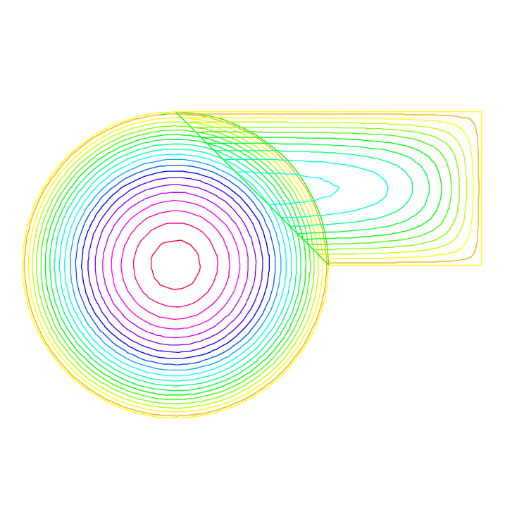|
||

### Schwarz non Overlap Scheme

To solve

$$-\Delta u =f\;\mbox{in}\;\Omega=\Omega_1\cup\Omega_2\quad u|_\Gamma=0,$$

the Schwarz algorithm for domain decomposition without overlapping runs like this

|Fig. 9.27: The two none overlapping mesh `:::freefem TH` and `:::freefem th`|
|:----:|
||

Let introduce $\Gamma_i$ is common the boundary of $\Omega_1$ and
$\Omega_2$ and $\Gamma_e^i= \p \Omega_i \setminus \Gamma_i$.

The problem find $\lambda$ such that $(u_1|_{\Gamma_i}=u_2|_{\Gamma_i})$
where $u_i$ is solution of the following Laplace problem:

$$
    -\Delta u_i=f\;\mbox{in}\;\Omega_i\quad
    u_i|_{\Gamma_i}=\lambda \quad
    u_i|_{\Gamma_e^i} = 0
$$

To solve this problem we just make a loop
with upgrading $\lambda$ with

$$
\lambda = \lambda {\pm} \frac{(u_1-u_2)}{2}
$$

where the sign $+$ or $-$ of ${\pm}$ is choose to have convergence.

 __Example 9.27__ Schwarz-no-overlap.edp

```freefem
// schwarz1 without overlapping
int inside = 2;
int outside = 1;
border a(t=1,2){x=t;y=0;label=outside;};
border b(t=0,1){x=2;y=t;label=outside;};
border c(t=2,0){x=t ;y=1;label=outside;};
border d(t=1,0){x = 1-t; y = t;label=inside;};
border e(t=0, 1){ x= 1-t; y = t;label=inside;};
border e1(t=pi/2, 2*pi){ x= cos(t); y = sin(t);label=outside;};
int n=4;
mesh th = buildmesh( a(5*n) + b(5*n) + c(10*n) + d(5*n));
mesh TH = buildmesh ( e(5*n) + e1(25*n) );
plot(th,TH,wait=1,ps="schwarz-no-u.eps");
fespace vh(th,P1);
fespace VH(TH,P1);
vh u=0,v; VH U,V;
vh lambda=0;
int i=0;

problem PB(U,V,init=i,solver=Cholesky) =
    int2d(TH)( dx(U)*dx(V)+dy(U)*dy(V) )
  + int2d(TH)( -V)
  + int1d(TH,inside)(lambda*V) +    on(outside,U= 0 ) ;
problem pb(u,v,init=i,solver=Cholesky) =
    int2d(th)( dx(u)*dx(v)+dy(u)*dy(v) )
  + int2d(th)( -v)
  + int1d(th,inside)(-lambda*v) +    on(outside,u = 0 ) ;

for ( i=0 ;i< 10; i++)
{
   PB;
   pb;
   lambda = lambda - (u-U)/2;
   plot(U,u,wait=true);
};

plot(U,u,ps="schwarz-no-u.eps");
```

|Fig. 9.26: Isovalues of the solution at iteration 0 and iteration 9 without overlapping|
|:----:|
||
||

### Schwarz-gc.edp

To solve $-\Delta u =f \;\mbox{in}\;\Omega=\Omega_1\cup\Omega_2\quad u|_\Gamma=0,$
the Schwarz algorithm for domain decomposition without overlapping runs like this

Let introduce $\Gamma_i$ is common the boundary of $\Omega_1$ and
$\Omega_2$ and $\Gamma_e^i= \p \Omega_i \setminus  \Gamma_i$.

The problem find $\lambda$ such that $(u_1|_{\Gamma_i}=u_2|_{\Gamma_i})$
where $u_i$ is solution of the following Laplace problem:

$$
    -\Delta u_i=f\;\mbox{in}\;\Omega_i\quad
    u_i|_{\Gamma_i}=\lambda \quad
    u_i|_{\Gamma_e^i} = 0
$$

The version of this example uses the Shur complement. The problem on the border is solved by a conjugate gradient method.

First, we construct the two domain

 __Example 9.28__ Schwarz-gc.edp

```freefem
// Schwarz without overlapping (Shur complement for Neumann to Dirichet)
real cpu=clock();
int inside = 2;
int outside = 1;

border Gamma1(t=1,2){x=t;y=0;label=outside;};
border Gamma2(t=0,1){x=2;y=t;label=outside;};
border Gamma3(t=2,0){x=t ;y=1;label=outside;};

border GammaInside(t=1,0){x = 1-t; y = t;label=inside;};

border GammaArc(t=pi/2, 2*pi){ x= cos(t); y = sin(t);label=outside;};
int n=4;
// build the mesh of $\Omega_1$ and $\Omega_2$
mesh Th1 = buildmesh( Gamma1(5*n) + Gamma2(5*n) + GammaInside(5*n) + Gamma3(5*n));
mesh Th2 = buildmesh ( GammaInside(-5*n) + GammaArc(25*n) );
plot(Th1,Th2);

// defined the 2 FE space
fespace Vh1(Th1,P1),      Vh2(Th2,P1);
```

!!! note

	It is impossible to define a function just on a part of boundary, so the $\lambda$ function must be defined on the all domain $\Omega_1$ such as

	```freefem
	Vh1 lambda=0; // take $\lambda \in V_{h1}$ $\codered$
	```

The two Poisson problem:

```freefem
Vh1 u1,v1;              Vh2 u2,v2;
int i=0; // for factorization optimization
problem Pb2(u2,v2,init=i,solver=Cholesky) =
    int2d(Th2)( dx(u2)*dx(v2)+dy(u2)*dy(v2) )
  + int2d(Th2)( -v2)
  + int1d(Th2,inside)(-lambda*v2) +    on(outside,u2= 0 ) ;
problem Pb1(u1,v1,init=i,solver=Cholesky) =
    int2d(Th1)( dx(u1)*dx(v1)+dy(u1)*dy(v1) )
  + int2d(Th1)( -v1)
  + int1d(Th1,inside)(+lambda*v1) +    on(outside,u1 = 0 ) ;
```

or, we define a border matrix, because the
 $\lambda$ function is none zero inside the domain $\Omega_1$:

```freefem
varf b(u2,v2,solver=CG) =int1d(Th1,inside)(u2*v2);
matrix B= b(Vh1,Vh1,solver=CG);
```

The boundary problem function,

$$
  \lambda \longrightarrow  \int_{\Gamma_i }(u_1-u_2) v_{1}
$$

```freefem
func real[int] BoundaryProblem(real[int] &l)
{
   lambda[]=l; // make FE function form l
   Pb1;     Pb2;
   i++; // no refactorization i !=0
   v1=-(u1-u2);
   lambda[]=B*v1[];
   return lambda[] ;
};
```

!!! note

	The difference between the two notations `:::freefem v1` and `:::freefem v1[]` is:
	`:::freefem v1` is the finite element function and `:::freefem v1[]` is the vector in the canonical basis of the finite element function `:::freefem v1`.

```freefem
Vh1 p=0,q=0;
// solve the problem with Conjugate Gradient
LinearCG(BoundaryProblem,p[],eps=1.e-6,nbiter=100);
// compute the final solution, because CG works with increment
BoundaryProblem(p[]); // solve again to have right u1,u2

cout << " -- CPU time schwarz-gc:" <<  clock()-cpu << endl;
plot(u1,u2); // plot
```

%### mortar.edp
% a faire FH
%  construction de epsi
%  un sous domaine
%  les matrices blocks.
$\codered$

## Fluid/Structures Coupled Problem

This problem involves the Lamé system of elasticity
and the Stokes system for viscous fluids with velocity $\vec u$ and pressure $p$:

\begin{eqnarray*}
-\Delta \vec u +\vec\nabla p = 0, \,
\nabla\cdot \vec u = 0,\;\hbox{in}\;\Omega,\,
\vec u=\vec u_\Gamma\;\hbox{on}\;\Gamma=\p\Omega
\end{eqnarray*}

where $u_\Gamma$ is the velocity of the boundaries. The
force that the fluid applies to the boundaries is the normal stress

$$
\vec h =(\nabla\vec u +\nabla\vec u^T)\vec n -p\vec n
$$

Elastic solids subject to forces deform: a point in the solid, at (x,y) goes to (X,Y) after. When the displacement vector $\vec v=(v_1,v_2) = (X-x, Y-y)$ is small, Hooke's law relates the stress tensor $\sigma$ inside the solid to the deformation tensor $\epsilon$:

$$
\sigma_{ij} = \lambda \delta_{ij} \nabla.\vec v + 2\mu\epsilon_{ij},
\,
\epsilon_{ij} = {1\over 2}({\p v_i\over\p x_j} +
{\p v_j\over\p x_i} )
$$

where $\delta$ is the Kronecker symbol and where $\lambda, \mu$ are two constants describing the material mechanical properties in terms of the modulus of elasticity, and Young's modulus.

The equations of elasticity are naturally written in variational form for the displacement vector $v(x)\in V$ as

$$
\int_\Omega [2\mu\epsilon_{ij}(\vec v)\epsilon_{ij}(\vec w)
+\lambda \epsilon_{ii}(v)\epsilon_{jj}(\vec w)]
=\int_\Omega \vec g\cdot \vec w +\int_\Gamma \vec h\cdot \vec w,%\`{u}
\forall \vec w\in V
$$

The data are the gravity force $\vec g$ and the boundary stress $\vec h$.

 __Example 9.29__ fluidStruct.edp

In our example the Lamé system and the Stokes system are coupled by a common boundary on which the fluid stress creates a displacement of the boundary and hence changes the shape of the domain where the Stokes problem is integrated. The geometry is that of a vertical driven cavity with an elastic lid. The lid is a beam with weight so it will be deformed by its own weight and by the normal stress due to the fluid reaction. The cavity is the $10 \times 10$ square and the lid is a rectangle of height $l=2$.

A beam sits on a box full of fluid rotating because the left vertical side has velocity one. The beam is bent by its own weight, but the pressure of the fluid modifies the bending.

The bending displacement of the beam is given by (uu,vv) whose solution is given as follows.

```freefem
// Fluid-structure interaction for a weighting beam sitting on a
// square cavity filled with a fluid.

int bottombeam = 2; // label of bottombeam
border a(t=2,0)  { x=0; y=t ;label=1;}; // left beam
border b(t=0,10) { x=t; y=0 ;label=bottombeam;}; // bottom of beam
border c(t=0,2)  { x=10; y=t ;label=1;}; // rigth beam
border d(t=0,10) { x=10-t; y=2; label=3;}; // top beam
real E = 21.5;
real sigma = 0.29;
real mu = E/(2*(1+sigma));
real lambda = E*sigma/((1+sigma)*(1-2*sigma));
real gravity = -0.05;
mesh th = buildmesh( b(20)+c(5)+d(20)+a(5));
fespace Vh(th,P1);
Vh uu,w,vv,s,fluidforce=0;
cout << "lambda,mu,gravity ="<<lambda<< " " << mu << " " << gravity << endl;
// deformation of a beam under its own weight
solve bb([uu,vv],[w,s])  =
    int2d(th)(
                  lambda*div(w,s)*div(uu,vv)
                  +2.*mu*( epsilon(w,s)'*epsilon(uu,vv) )
             )
  + int2d(th) (-gravity*s)
  + on(1,uu=0,vv=0)
  + fluidforce[];
 ;

 plot([uu,vv],wait=1);
 mesh th1 = movemesh(th, [x+uu, y+vv]);
 plot(th1,wait=1);
```

Then Stokes equation for fluids ast low speed are solved in the box below the beam,
but the beam has deformed the box (see border h):

```freefem
//Stokes on square b,e,f,g driven cavite on left side g
border e(t=0,10) { x=t; y=-10; label= 1; }; // bottom
border f(t=0,10) { x=10; y=-10+t ; label= 1; }; // right
border g(t=0,10) { x=0; y=-t ;label= 2;}; // left
border h(t=0,10) { x=t; y=vv(t,0)*( t>=0.001 )*(t <= 9.999);
                    label=3;}; // top of cavity deformed

mesh sh = buildmesh(h(-20)+f(10)+e(10)+g(10));
plot(sh,wait=1);
```

 We use the Uzawa conjugate gradient to solve the Stokes problem like in example \refSec{Uzawa} $\codered$

```freefem
fespace Xh(sh,P2),Mh(sh,P1);
Xh u1,u2,v1,v2;
Mh p,q,ppp;

varf bx(u1,q) = int2d(sh)( -(dx(u1)*q));

varf by(u1,q) = int2d(sh)( -(dy(u1)*q));

varf Lap(u1,u2)= int2d(sh)(  dx(u1)*dx(u2) + dy(u1)*dy(u2) )
                    +  on(2,u1=1) +  on(1,3,u1=0)  ;

Xh bc1; bc1[] = Lap(0,Xh);
Xh brhs;

matrix A= Lap(Xh,Xh,solver=CG);
matrix Bx= bx(Xh,Mh);
matrix By= by(Xh,Mh);
Xh bcx=0,bcy=1;

func real[int] divup(real[int] & pp)
{
  int verb=verbosity;
   verbosity=0;
   brhs[]  = Bx'*pp; brhs[] += bc1[] .*bcx[];
   u1[] = A^-1*brhs[];
   brhs[]  = By'*pp; brhs[] += bc1[] .*bcy[];
   u2[] = A^-1*brhs[];
   ppp[] =   Bx*u1[];
   ppp[] +=  By*u2[];
   verbosity=verb;
   return ppp[] ;
};
```

do a loop on the two problems

```freefem
for(step=0;step<2;++step)
 {
   p=0;q=0;u1=0;v1=0;

   LinearCG(divup,p[],eps=1.e-3,nbiter=50);
   divup(p[]);
```

Now the beam will feel the stress constraint from the fluid:

```freefem
  Vh sigma11,sigma22,sigma12;
  Vh uu1=uu,vv1=vv;

  sigma11([x+uu,y+vv]) = (2*dx(u1)-p);
  sigma22([x+uu,y+vv]) = (2*dy(u2)-p);
  sigma12([x+uu,y+vv]) = (dx(u1)+dy(u2));
```

which comes as a boundary condition to the PDE of the beam:

```freefem
  solve bbst([uu,vv],[w,s],init=i)  =
     int2d(th)(
                  lambda*div(w,s)*div(uu,vv)
                  +2.*mu*( epsilon(w,s)'*epsilon(uu,vv) )
              )
  + int2d(th) (-gravity*s)
  + int1d(th,bottombeam)( -coef*(   sigma11*N.x*w + sigma22*N.y*s
                                   + sigma12*(N.y*w+N.x*s) )  )
  + on(1,uu=0,vv=0);
  plot([uu,vv],wait=1);
  real err = sqrt(int2d(th)( (uu-uu1)^2 + (vv-vv1)^2 ));
  cout <<  " Erreur L2 = " << err << "----------\n";
```

Notice that the matrix generated by bbst is reused (see `:::freefem init=i`).
Finally we deform the beam

```freefem
 th1 = movemesh(th, [x+0.2*uu, y+0.2*vv]);
 plot(th1,wait=1);
 } // end of loop
```

|Fig. 9.29: Fluid velocity and pressure (left) $\codered$ and displacement vector (center) $\codered$ of the structure and displaced geometry (right) $\codered$ in the fluid-structure interaction of a soft side and a driven cavity|
|:----:|
|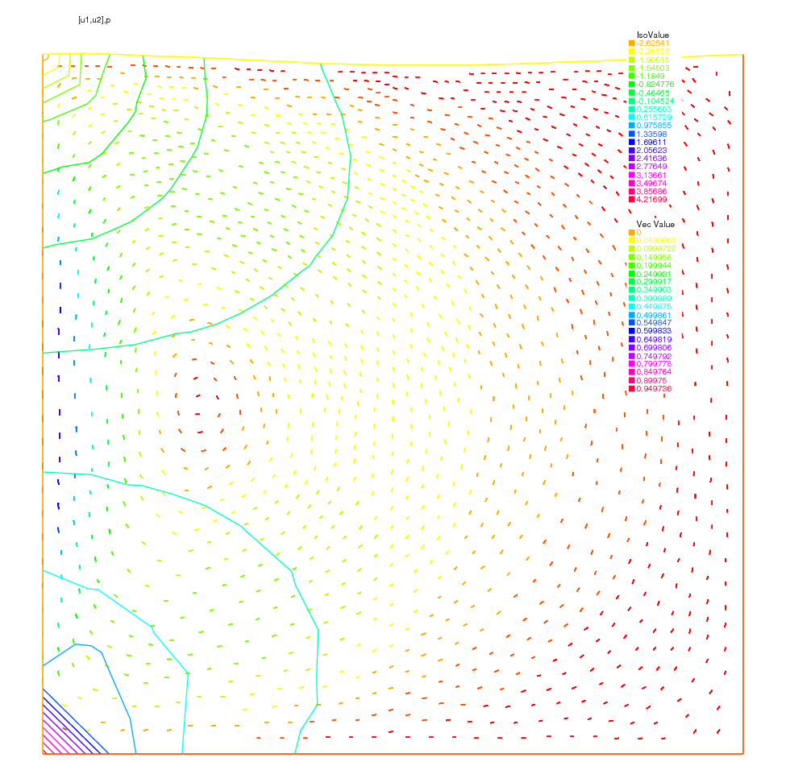|
||
||

## Transmission Problem

Consider an elastic plate whose displacement change vertically, which is made up of three plates of different materials, welded on each other.
Let $\Omega_i,\, i=1,2,3$ be the domain occupied by $i$-th material with tension $\mu_i$ (see \refSec{Soap Film} $\codered$).
The computational domain $\Omega$ is the interior of $\overline{\Omega_1}\cup \overline{\Omega_2}\cup \overline{\Omega_3}$. The vertical displacement $u(x,y)$ is obtained from

\begin{eqnarray}
-\mu_i\Delta u&=&f~\textrm{in }\Omega_i\\
\mu_i\p_n u|_{\Gamma_{i}}&=&-\mu_j\p_n u|_{\Gamma_{j}}
\quad \textrm{on }\overline{\Omega_{i}}\cap\overline{\Omega_{j}}
\qquad \textrm{if }1\le i< j\le 3
\end{eqnarray}

where $\p_n u|_{\Gamma_{i}}$ denotes the value of the normal derivative $\p_n u$ on the boundary $\Gamma_i$ of the domain $\Omega_i$.

By introducing the characteristic function $\chi_i$ of $\Omega_i$, that is,

\begin{equation}
\chi_i(x)=1\quad\textrm{if }x\in \Omega_i;\qquad
\chi_i(x)=0\quad\textrm{if }x\not\in \Omega_i
\end{equation}

we can easily rewrite (\ref{eqn:transm-1} 9.55 $\codered$) and (\ref{eqn:transm-2} 9.56 $\codered$)
to the weak form. Here we assume that $u=0$ on $\Gamma=\p\Omega$.

problem Transmission: For a given function $f$, find $u$ such that

\begin{eqnarray}
a(u,v)&=&\ell(f,v)\quad \textrm{for all }v\in H^1_0(\Omega)\\
a(u,v)=\int_{\Omega}\mu \nabla u\cdot \nabla v,\quad
\ell(f,v)=\int_{\Omega}fv\nonumber
\end{eqnarray}

where $\mu=\mu_1\chi_1+\mu_2\chi_2+\mu_3\chi_3$. Here we notice that $\mu$ become the discontinuous function.

With dissipation, and at the thermal equilibrium, the temperature equation is: $\codered$

This example explains the definition and manipulation of _region_, i.e. subdomains of the whole domain.
Consider this L-shaped domain with 3 diagonals as internal boundaries, defining 4 subdomains:

```freefem
// example using region keyword
// construct a mesh with 4 regions (sub-domains)
border a(t=0,1){x=t;y=0;};
border b(t=0,0.5){x=1;y=t;};
border c(t=0,0.5){x=1-t;y=0.5;};
border d(t=0.5,1){x=0.5;y=t;};
border e(t=0.5,1){x=1-t;y=1;};
border f(t=0,1){x=0;y=1-t;};
// internal boundary
border i1(t=0,0.5){x=t;y=1-t;};
border i2(t=0,0.5){x=t;y=t;};
border i3(t=0,0.5){x=1-t;y=t;};

mesh th = buildmesh (a(6) + b(4) + c(4) +d(4) + e(4) +
    f(6)+i1(6)+i2(6)+i3(6));
fespace Ph(th,P0); // constant discontinuous functions / element
fespace Vh(th,P1); // $P_1$ continuous functions / element

Ph reg=region; // defined the $P_0$ function associated to region number
plot(reg,fill=1,wait=1,value=1);
```

|Fig. 9.30: The function `:::freefem reg`|
|:----:|
||

|Fig. 9.31: The function `:::freefem nu`|
|:----:|
|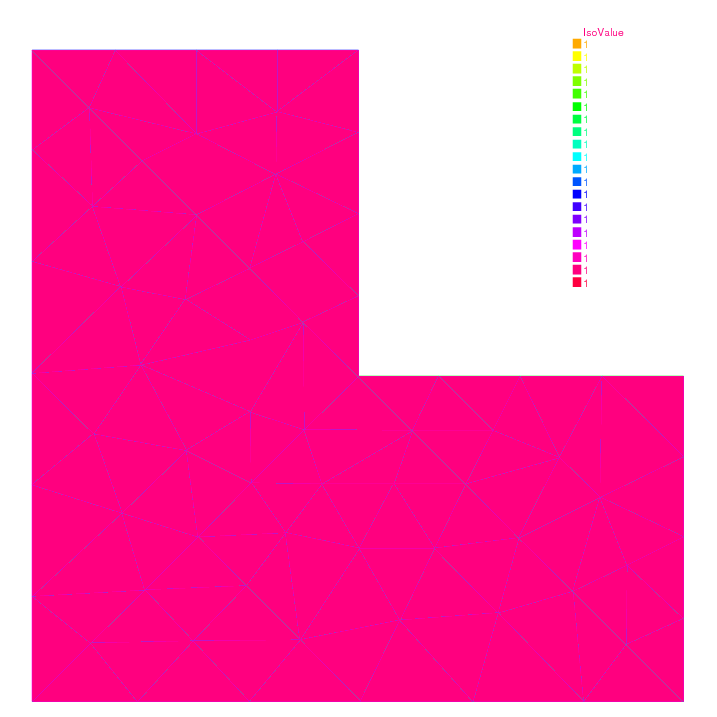|

`:::freefem region` is a keyword of FreeFem++ which is in fact a variable depending of the current position (is not a function today, use `:::freefem Ph reg=region;` to set a function). This variable value returned is the number of the subdomain of the current position. This number is defined by `:::freefem buildmesh` which scans while building the mesh all its connected component.

So to get the number of a region containing a particular point one does:

```freefem
int nupper=reg(0.4,0.9); // get the region number of point (0.4,0.9)
int nlower=reg(0.9,0.1); // get the region number of point (0.4,0.1)
cout << " nlower " <<  nlower << ", nupper = " << nupper<< endl;
// defined the characteristics functions of upper and lower region
Ph nu=1+5*(region==nlower) + 10*(region==nupper);
plot(nu,fill=1,wait=1);
```

This is particularly useful to define discontinuous functions such as might occur
when one part of the domain is copper and the other one is iron, for example.

We this in mind we proceed to solve a Laplace equation with discontinuous coefficients
($\nu$ is 1, 6 and 11 below).

```freefem
Ph nu=1+5*(region==nlower) + 10*(region==nupper);
plot(nu,fill=1,wait=1);
problem lap(u,v) =   int2d(th)( nu*( dx(u)*dx(v)*dy(u)*dy(v) ))
                   + int2d(-1*v) + on(a,b,c,d,e,f,u=0);
plot(u);
```

|Fig. 9.32: The isovalue of the solution $u$|
|:----:|
|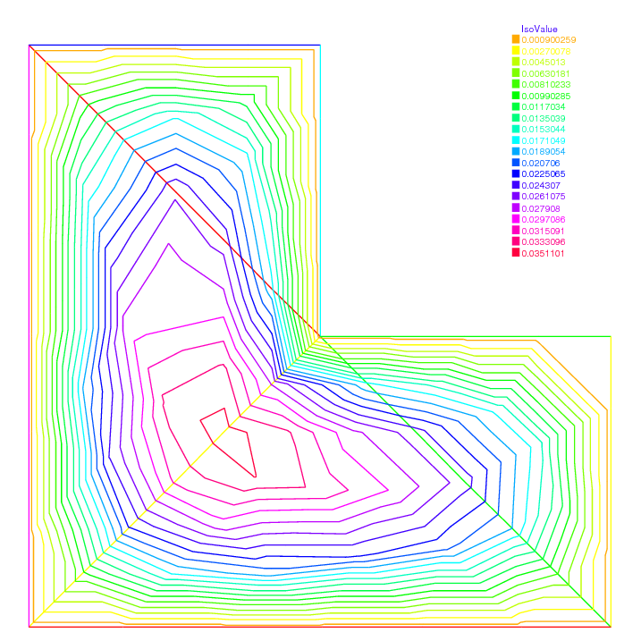|

## Free Boundary Problem

The domain $\Omega$ is defined with:

```freefem
real L=10; //longueur du domaine
real h=2.1; // hauteur du bord gauche
real h1=0.35; // hauteur du bord droite

// maillage d'un tapeze
border a(t=0,L){x=t;y=0;}; // bottom:  $\Gamma_a$ \hfill
border b(t=0,h1){x=L;y=t;}; // right:  $\Gamma_b$ \hfill
border f(t=L,0){x=t;y=t*(h1-h)/L+h;}; // free surface:  $\Gamma_f$ \hfill
border d(t=h,0){x=0;y=t;}; // left:  $\Gamma_d$ \hfill

int n=4;
mesh Th=buildmesh (a(10*n)+b(6*n)+f(8*n)+d(3*n));
plot(Th,ps="dTh.eps");
```

|Fig. 9.33: The mesh of the domain $\Omega$|
|:----:|
||

The free boundary problem is:
Find $u$ and $\Omega$ such that:

$$
\left\{\begin{array}{cl}
\displaystyle - \Delta u = 0  & \mbox{in } \Omega\\
\displaystyle u = y         &\mbox{on } \Gamma_b \\
\displaystyle      {\p u  \over \p n} = 0   &\mbox{on } \Gamma_d \cup \Gamma_a \\
\displaystyle    {\p u  \over \p n} = { q\over K} n_x
          \mbox{and} {u = y}  &\mbox{on} \Gamma_ f
\end{array}\right.
$$

We use a fixed point method;
$\Omega^0 = \Omega$

in two step, fist we solve the classical following problem:

$$
\left\{\begin{array}{rll}
\displaystyle - \Delta u &= 0  & \mbox{in } \Omega^n\\
\displaystyle u &= y         &\mbox{on } \Gamma^n_b \\
\displaystyle      {\p u  \over \p n} &= 0   &\mbox{on } \Gamma^n_d \cup \Gamma^n_a\\
\displaystyle u &= y        &\mbox{on} \Gamma^n_ f
\end{array}\right.
$$

The variational formulation is:

find $u$ on $V=H^1(\Omega^n)$, such than $u=y$ on $\Gamma^n_b$ and $\Gamma^n_f$

$$
 \int_{\Omega^n}  \nabla u \nabla u' = 0,  \quad \forall u' \in V  \mbox{ with }  u' =0 \mbox{ on }
\Gamma^n_b \cup \Gamma^n_f
$$

and secondly to construct a domain deformation $\mathcal{F}(x,y)=[x,y-v(x,y)]$
where $v$ is solution of the following problem:

 $$
\left\{\begin{array}{rll}
\displaystyle - \Delta v &= 0  & \mbox{in } \Omega^n\\
\displaystyle v  &= 0         &\mbox{on } \Gamma^n_a \\
\displaystyle      {\p v \over \p n} &= 0   &\mbox{on } \Gamma^n_b \cup \Gamma^n_d \\
\displaystyle    {\p v  \over \p n}  &=  \displaystyle {\p u  \over \p n} - { q\over K} n_x
            &\mbox{on } \Gamma^n_ f
\end{array}\right. $$

The variational formulation is:

find $v$ on $V$, such than $v=0$ on $\Gamma^n_a$

$$
 \int_{\Omega^n}  \nabla v \nabla v' = \int_{\Gamma_f^n}  ({\p u  \over \p n} - { q\over K} n_x )v',  \quad \forall v' \in V  \mbox{ with }  v' =0 \mbox{ on }
\Gamma^n_a
$$

Finally the new domain $\Omega^{n+1} = \mathcal{F}(\Omega^n)$

 __Example 9.30__ freeboundary.edp

The FreeFem++ implementation is:

```freefem
real q=0.02; //flux entrant
real K=0.5; //permeabilit\'{e}

fespace Vh(Th,P1);
int j=0;

Vh u,v,uu,vv;

problem Pu(u,uu,solver=CG) = int2d(Th)( dx(u)*dx(uu)+dy(u)*dy(uu))
  + on(b,f,u=y) ;

problem Pv(v,vv,solver=CG) = int2d(Th)( dx(v)*dx(vv)+dy(v)*dy(vv))
  +  on (a, v=0) + int1d(Th,f)(vv*((q/K)*N.y- (dx(u)*N.x+dy(u)*N.y)));


real errv=1;
real erradap=0.001;
verbosity=1;
while(errv>1e-6)
{
  j++;
  Pu;
  Pv;
  plot(Th,u,v ,wait=0);
  errv=int1d(Th,f)(v*v);
   real coef=1;

//
  real mintcc = checkmovemesh(Th,[x,y])/5.;
  real mint = checkmovemesh(Th,[x,y-v*coef]);

  if (mint<mintcc ||  j%10==0) { // mesh to bad => remeshing
    Th=adaptmesh(Th,u,err=erradap ) ;
    mintcc = checkmovemesh(Th,[x,y])/5.;
  }

  while (1)
  {
    real mint = checkmovemesh(Th,[x,y-v*coef]);

    if (mint>mintcc) break;

    cout << " min |T]  " << mint << endl;
    coef /= 1.5;
  }

  Th=movemesh(Th,[x,y-coef*v]); // calcul de la deformation
  cout << "\n\n"<<j <<"------------ errv = " << errv << "\n\n";

}
plot(Th,ps="d_Thf.eps");
plot(u,wait=1,ps="d_u.eps");
```

|Fig. 9.34: The final solution on the new domain $\Omega^{72}$|
|:----:|
||

|Fig. 9.35: The adapted mesh of the domain $\Omega^{72}$|
|:----:|
||

## Non linear Elasticity (nolinear-elas.edp)

The nonlinear elasticity problem is: find the displacement $(u_{1},u_{2})$  minimizing  $J$
$$ \min J(u_{1},u_{2}) = \int_{\Omega} f(F2) -  \int_{\Gamma_{p}} P_{a} \,  u_{2} $$
where  $F2(u_{1},u_{2}) =  A(E[u_{1},u_{2}],E[u_{1},u_{2}])$ and $A(X,Y)$ is bilinear sym. positive form with respect two matrix $X,Y$.
where $f$ is a given $\mathcal{C}^2$  function, and $E[u_{1},u_{2}] = (E_{ij})_{i=1,2,\,j=1,2}$ is the Green-Saint Venant deformation tensor defined with:
$$  E_{ij} = 0.5 \big( ( \p_i u_j + \p_j u_i ) + \sum_k \p_i u_k {\times} \p_j u_k \big) $$

Denote $\mathbf{u}=(u_{1},u_{2})$, $\mathbf{v}=(v_{1},v_{2})$, $\mathbf{w}=(w_{1},w_{2})$.

So, the differential of $J$ is
  $$ DJ(\bm{u})(\bm{v}) =  \int DF2(\bm{u})(\bm{v}) \;f'(F2(\bm{u}))) -  \int_{\Gamma_{p}} P_{a}  v_{2}  $$
  where  $ DF2(\bm{u})(\bm{v}) = 2 \; A(\;DE[\mathbf{u}](\mathbf{v})\;,\;E[\mathbf{u}]\;) $ and  $DE$ is the first differential of $E$.

The second order differential is

\begin{eqnarray*}
 D^2 J(\mathbf{u})((\mathbf{v}),(\mathbf{w}))  &=& \displaystyle\int DF2(\bm{u})(\bm{v}) \; DF2(\bm{u})(\bm{w}) \; f''(F2(\mathbf{u}))) \\
 & +&  \displaystyle\int \; D^2F2(\bm{u})(\bm{v},\bm{w}) \; f'(F2(\mathbf{u})))
\end{eqnarray*}

 where
  $$
  D^2F2(\bm{u})(\bm{v},\bm{w}) = 2 \; A(\;D^2E[\mathbf{u}](\bm{v},\bm{w})\;,\;E[\bm{u}]\;) + 2 \; A(\;DE[\bm{u}](\bm{v})\;,DE[\bm{u}](\bm{w})\;) .$$
 and $D^{2}E$ is the second differential of $E$.

So all notations can be define with `:::freefem macro`s:

```freefem
macro EL(u,v) [dx(u),(dx(v)+dy(u)),dy(v)] // is $[\epsilon_{11},2\epsilon_{12},\epsilon_{22}]$

macro ENL(u,v) [
(dx(u)*dx(u)+dx(v)*dx(v))*0.5,
(dx(u)*dy(u)+dx(v)*dy(v))    ,
(dy(u)*dy(u)+dy(v)*dy(v))*0.5 ] // EOM ENL

macro dENL(u,v,uu,vv) [(dx(u)*dx(uu)+dx(v)*dx(vv)),
 (dx(u)*dy(uu)+dx(v)*dy(vv)+dx(uu)*dy(u)+dx(vv)*dy(v)),
 (dy(u)*dy(uu)+dy(v)*dy(vv)) ] //


macro E(u,v) (EL(u,v)+ENL(u,v)) // is $[E_{11},2E_{12},E_{22}]$
macro dE(u,v,uu,vv) (EL(uu,vv)+dENL(u,v,uu,vv)) //
macro ddE(u,v,uu,vv,uuu,vvv) dENL(uuu,vvv,uu,vv) //
macro F2(u,v) (E(u,v)'*A*E(u,v)) //
macro dF2(u,v,uu,vv)  (E(u,v)'*A*dE(u,v,uu,vv)*2. ) //
macro ddF2(u,v,uu,vv,uuu,vvv) (
            (dE(u,v,uu,vv)'*A*dE(u,v,uuu,vvv))*2.
          + (E(u,v)'*A*ddE(u,v,uu,vv,uuu,vvv))*2.  )// EOM
```

The Newton Method is

choose $ n=0$,and $u_O,v_O$ the initial displacement
\begin{itemize}
\item loop: \\
\item  \hspace{1cm}    find $(du,dv)$ :  solution of
$$ D^2J(u_n,v_n)((w,s),(du,dv)) =  DJ(u_n,v_n)(w,s) , \quad \forall w,s $$
\item  \hspace{1cm}      $un =un - du,\quad vn =vn - dv$
\item  \hspace{1cm}      until $(du,dv)$ small is enough
\end{itemize}

\color{black}The way to implement this algorithm in FreeFem++ is
use a macro tool to implement  $A$ and $F2$, $f$, $f'$,$f''$.

A macro is like in `:::freefem ccp` preprocessor of \Cpp, but this begin by
`:::freefem macro` and the end of the macro definition is before the comment $//$.
In this case the macro is very useful because the type of parameter can be change.
And it is easy to make automatic differentiation.

\begin{figure}[hbt]
\begin{center}\includegraphics[width=10cm]{nl-elas}\end{center}
\caption{ The deformed domain}
\end{figure}

```freefem
// non linear elasticity model

// for hyper elasticity problem
// -----------------------------
macro f(u) ((u)*0.5) // end of macro
macro df(u) (0.5) // end of macro
macro ddf(u) (0) // end of macro

// -- du caouchouc --- (see the notes of Herve Le Dret.)
// -------------------------------
real mu = 0.012e5; // $kg/cm^2$
real lambda =  0.4e5; // $kg/cm^2$
//
// $  \sigma = 2 \mu E + \lambda tr(E) Id $
// $   A(u,v)= \sigma(u):E(v) $
//
// ( a b )
// ( b c )
//
// tr*Id : (a,b,c) -> (a+c,0,a+c)
// so the associed matrix is:
// ( 1 0 1 )
// ( 0 0 0 )
// ( 1 0 1 )
// ------------------v
real a11= 2*mu +  lambda  ;
real a22= mu ; // because $[0,2*t12,0]' A [0,2*s12,0]  =$
// $= 2*mu*(t12*s12+t21*s21) = 4*mu*t12*s12$
real a33= 2*mu +   lambda ;
real a12= 0 ;
real a13= lambda ;
real a23= 0 ;
// symetric part
real a21= a12 ;
real a31= a13 ;
real a32= a23 ;

// the matrix A.
func A = [ [ a11,a12,a13],[ a21,a22,a23],[ a31,a32,a33] ];

real Pa=1e2; // a pressure of 100 Pa
// ----------------

int n=30,m=10;
mesh Th= square(n,m,[x,.3*y]); // label: 1 bottom, 2 right, 3 up, 4 left;
int bottom=1, right=2,upper=3,left=4;

plot(Th);

fespace Wh(Th,P1dc);
fespace Vh(Th,[P1,P1]);
fespace Sh(Th,P1);

Wh e2,fe2,dfe2,ddfe2; // optimisation
Wh ett,ezz,err,erz; // optimisation

Vh [uu,vv], [w,s],[un,vn];
[un,vn]=[0,0];// intialisation
[uu,vv]=[0,0];

varf vmass([uu,vv],[w,s],solver=CG) =  int2d(Th)( uu*w + vv*s );
matrix M=vmass(Vh,Vh);
problem NonLin([uu,vv],[w,s],solver=LU)=
 int2d(Th,qforder=1)( // $(D^2 J(un))$ part
                       dF2(un,vn,uu,vv)*dF2(un,vn,w,s)*ddfe2
                    +  ddF2(un,vn,w,s,uu,vv)*ddfe2
	            )
   - int1d(Th,3)(Pa*s)
   - int2d(Th,qforder=1)( // $(D J(un))$ part
           dF2(un,vn,w,s)*dfe2   )
   + on(right,left,uu=0,vv=0);
;
// Newton's method
// ---------------
Sh u1,v1;
for (int i=0;i<10;i++)
{
  cout << "Loop " << i << endl;
  e2 = F2(un,vn);
  dfe2 = df(e2) ;
  ddfe2 = ddf(e2);
  cout << "  e2 max " <<e2[].max << " , min" << e2[].min << endl;
  cout << " de2 max "<< dfe2[].max << " , min" << dfe2[].min << endl;
  cout << "dde2 max "<< ddfe2[].max << " , min" << ddfe2[].min << endl;
  NonLin; // compute $[uu,vv] = (D^2 J(un))^{-1}(D J(un))$

  w[]   = M*uu[];
  real res = sqrt(w[]' * uu[]); // norme  $L^2 of [uu,vv]$
  u1 = uu;
  v1 = vv;
  cout << " L^2 residual = " << res << endl;
  cout << " u1 min =" <<u1[].min << ", u1 max= " << u1[].max << endl;
  cout << " v1 min =" <<v1[].min << ", v2 max= " << v1[].max << endl;
  plot([uu,vv],wait=1,cmm=" uu, vv " );
  un[] -= uu[];
  plot([un,vn],wait=1,cmm=" displacement " );
  if (res<1e-5) break;
}

plot([un,vn],wait=1);
mesh th1 = movemesh(Th, [x+un, y+vn]);
plot(th1,wait=1); // see figure \ref{fig nl-elas} $\codered$
```

## Compressible Neo-Hookean Materials: Computational Solutions

Author : Alex Sadovsky mailsashas@gmail.com

\def\bR{{\bf R}}
\def\bP{{\bf P}}
\def\bZ{{\bf Z}}
\def\bC{{\bf C}}
\def\VS{\bR^2}
\def\SVS{\underline V}
\def\SO{{\bf SO}}
\def\Sym{{\bf Sym}}
\def\qi{{\bf i}}
\def\qj{{\bf j}}
\def\qk{{\bf k}}
\def\ec{\hat{\bf e}}
\def\xc{\hat{\bf x}}
\def\bdr{\partial}
\def\PD{\partial_}
\def\strain{\underline \epsilon}
\def\stress{\underline \sigma}
\def\strainrate{\underline \epsilon^.}
\def\stressrate{\underline \sigma^.}
\def\stiff{\; \underline{\underline C}\;}
\def\comply{\underline{\underline \kappa}\;}
\def\Id{{\bf I}}
\def\Div{\nabla \cdot}
\def\Grad{\vec{\nabla}}
\def\rot{\nabla \times}
\def\lap{\triangle}
\def\tr{{\bf tr}\;}
\def\udH{\underline H}
\def\refX{\vec X}
\def\Jac{\overline{J}}
\def\spatx{\vec x}
\def\ani{\overline a}
\def\mat{\left[\begin{array}}
\def\tam{\end{array}\right]}
\def\arr{\left.\begin{array}}
\def\rra{\end{array}\right\}}
\def\arl{\left\{\begin{array}}
\def\lra{\end{array}\right.}
\def\ar{\begin{array}}
\def\ra{\end{array}}
\def\const{\mbox{ const.}}
\def\eps{\; \epsilon}
\def\sig{\; \sigma}
\def\th{\theta}
\def\sgn{\mbox{sgn}}
\def\qed{\; Q.E.D.\\}

\def\eqn{\begin{equation}}
\def\nqe{\end{equation}}

\def\eqnar{\begin{eqnarray}}
\def\ranqe{\end{eqnarray}}

\def\ol{\overline}
\def\ul{\underline}

\def\bB{{\bf B}}
\def\bC{{\bf C}}
\def\bD{{\bf D}}
\def\bE{{\bf E}}
\def\bF{{\bf F}}
\def\bK{{\bf K}}
\def\bP{{\bf P}}
\def\bS{{\bf S}}
\def\bT{{\bf T}}
\def\bsig{{\bf \sigma}}

### Notation

In what follows, the symbols $\vec{u}, \bF, \bB, \bC, \stress$
denote, respectively, the displacement field, the deformation
gradient, the left Cauchy-Green strain tensor $\bB = \bF \bF^T$, the
right Cauchy-Green strain tensor $\bC =\bF^T \bF$, and the Cauchy stress
tensor.  We also introduce the symbols $I_1 := \tr \bC$ and $J := \det
\bF$.  Use will be made of the identity
\eqn
{\PD{}J \over \PD{}\bC} = J \bC^{-1}
\nqe
The symbol $\Id$ denotes the identity tensor.  The symbol $\Omega_{0}$
denotes the reference configuration of the body to be deformed.  The
unit volume in the reference (resp., deformed) configuration is
denoted $dV$ (resp., $dV_{0}$); these two are related by
$$
dV = J dV_{0},
$$
which allows an integral over $\Omega$ involving the Cauchy stress
$\bT$ to be rewritten as an integral of the Kirchhoff stress $\kappa =
J \bT$ over $\Omega_{0}$.
\subsubsection*{Recommended References}

For an exposition of nonlinear elasticity and of the underlying
linear- and tensor algebra, see \cite{Ogden} $\codered$.  For an advanced
mathematical analysis of the Finite Element Method, see
\cite{Raviart-Thomas} $\codered$.  An explanation of the Finite Element
formulation of a nonlinear elastostatic boundary value problem, see
{\small \url{http://www.engin.brown.edu/courses/en222/Notes/FEMfinitestrain/FEMfinitestrain.htm}}.

### A Neo-Hookean Compressible Material

_Constitutive Theory and Tangent Stress Measures_

The strain energy density function is given by
\eqn
W = {\mu \over 2}(I_1 - \tr \Id - 2 \ln J)
\nqe
(see \cite{Horgan-Saccomandi} $\codered$, formula (12)).

The corresponding 2nd Piola-Kirchoff stress tensor is given by
\eqn
\bS_{n} := {\PD{} W \over \PD{}\bE} (\bF_{n})
=
\mu (\Id - \bC^{-1})
\nqe
The Kirchhoff stress, then, is
\eqn
\kappa
= \bF \bS \bF^{T}
= \mu (\bB  - \Id)
\nqe
The tangent Kirchhoff stress tensor at $\bF_{n}$ acting on
$
\delta \bF_{n+1}
$ is, consequently,
\eqn
{\PD{} \kappa \over \PD{} \bF} (\bF_{n}) \delta \bF_{n+1}
=
\mu
\left[
\bF_{n} (\delta \bF_{n+1})^T
+
\delta \bF_{n+1} (\bF_{n})^T
\right]
\nqe

_The Weak Form of the BVP in the Absence of Body (External) Forces_

The $\Omega_0$ we are considering is an elliptical annulus, whose
boundary consists of two concentric ellipses (each allowed to be a
circle as a special case), with the major axes parallel.  Let $P$ denote the dead stress load (traction) on a portion
$\partial \Omega_0^{t}$ (= the inner ellipse) of the boundary
$\partial \Omega_0$.  On the rest of the boundary, we prescribe zero displacement.

The weak formulation of the boundary value
problem is
$$
\arr{lll}
0
& = &
\int_{\Omega_0}
\kappa[\bF]
\:
:
\:
\left\{
(\Grad \otimes \vec{w}) (\bF)^{-1}
\right\}\\
& - & \int_{\PD{} \Omega_0^{t}} P \cdot \hat{N}_0\\
\rra
$$
{\em
For brevity, in the rest of this section we assume $P = 0$.  The provided
FreeFem++ code, however, does not rely on this assumption and allows
for a general value and direction of $P$.}

Given a Newton approximation $\vec{u}_n$ of the displacement field
$\vec{u}$ satisfying the BVP, we seek the correction $\delta \vec{u}_{n+1}$ to
obtain a better approximation
$$
\vec{u}_{n+1} = \vec{u}_{n} + \delta \vec{u}_{n+1}
$$
by solving the weak formulation
\eqn
\arr{lll}
0
& = &
\int_{\Omega_0}
\kappa[\bF_{n} + \delta \bF_{n+1}]
\:
:
\:
\left\{
(\Grad \otimes \vec{w}) (\bF_{n} + \delta \bF_{n+1})^{-1}
\right\}
- \int_{\PD{} \Omega_0} P \cdot \hat{N}_0
\\
& = &
\int_{\Omega_0}
\left\{
\kappa[\bF_{n}] +
{\PD{} \kappa \over \PD{} \bF}[\bF_{n}]
\delta \bF_{n+1}
\right\}
\:
:
\:
\left\{
(\Grad \otimes \vec{w})
(\bF_{n} + \delta \bF_{n+1})^{-1}
\right\}
\\
& = &
\int_{\Omega_0}
\left\{
\kappa[\bF_{n}] +
{\PD{} \kappa \over \PD{} \bF}[\bF_{n}]
\delta \bF_{n+1}
\right\}
\:
:
\:
\left\{
(\Grad \otimes \vec{w}) (\bF_{n}^{-1} + \bF_{n}^{-2} \delta \bF_{n+1})
\right\}
\\
\\
& = &
\int_{\Omega_0}
\kappa[\bF_{n}]
\:
:
\:
\left\{
(\Grad \otimes \vec{w})
\bF_{n}^{-1}
\right\}\\
&-&
\int_{\Omega_0}
\kappa[\bF_{n}]
\:
:
\:
\left\{
(\Grad \otimes \vec{w})
(\bF_{n}^{-2} \delta \bF_{n+1})
\right\}\\
&+&
\int_{\Omega_0}
\left\{
{\PD{} \kappa \over \PD{} \bF}[\bF_{n}]
\delta \bF_{n+1}
\right\}
\:
:
\:
\left\{
(
\Grad \otimes \vec{w})
\bF_{n}^{-1}
\right\}
\\
\rra
\quad
\mbox{for all test functions $\vec{w}$,}
\nqe
where we have taken
$$
\delta \bF_{n+1} = \Grad \otimes \delta \vec{u}_{n+1}
$$

{\bf Note:}  Contrary to standard notational use, the symbol $\delta$
here bears no variational context.  By $\delta$ we mean simply an
increment in the sense of Newton's Method.  The role of a variational virtual displacement here
is played by $\vec{w}$.

### An Approach to Implementation in FreeFem++

The associated file is  `:::freefem examples++-tutorial/nl-elast-neo-Hookean.edp`.

Introducing the code-like notation, where a string in $< >$'s is to be
read as one symbol, the individual components of the tensor
\eqn
<TanK>
 :=
{\PD{} \kappa \over \PD{} \bF}[\bF_{n}]
\delta \bF_{n+1}
\nqe
will be implemented as the macros $<TanK11>, <TanK12>, \ldots$.

The individual components of the tensor quantities
$$
\bD_{1} :=
\bF_{n} (\delta \bF_{n+1})^T
+
\delta \bF_{n+1} (\bF_{n})^T,
$$
$$
\bD_{2} :=
\bF_{n}^{-T} \delta \bF_{n+1},
$$
$$
\bD_{3} :=
(\Grad \otimes \vec{w})
\bF_{n}^{-2} \delta \bF_{n+1},
$$
and
$$
\bD_{4} :=
(\Grad \otimes \vec{w})
\bF_{n}^{-1},
$$
will be implemented as the macros
\eqn

\arr{l}
<d1Aux11>, <d1Aux12>, \quad \ldots \quad, <d1Aux22>,\\
<d2Aux11>, <d2Aux12>, \quad \ldots \quad, <d2Aux22>\\
<d3Aux11>, <d3Aux12>, \quad \ldots \quad, <d3Aux22>\\
<d4Aux11>, <d4Aux12>, \quad \ldots \quad, <d4Aux22>\\
\rra,
\nqe
respectively.

In the above notation, the tangent Kirchhoff stress term becomes
\eqn
{\PD{} \kappa \over \PD{} \bF} (\bF_{n})
\: \delta \bF_{n+1}
=
\mu
\: \bD_{1}
\nqe
while the weak BVP formulation acquires the form
\eqn
\arr{lll}
0 & = &
\int_{\Omega_0}
\kappa[\bF_{n}]
\:
:
\:
\bD_{4}
\\
&-&
\int_{\Omega_0}
\kappa[\bF_{n}]
\:
:
\:
\bD_{3}
\\
&+&
\int_{\Omega_0}
\left\{
{\PD{} \kappa \over \PD{} \bF}[\bF_{n}]
\delta \bF_{n+1}
\right\}
\:
:
\:
\bD_{4}
\\
\rra
\quad
\mbox{for all test functions $\vec{w}$}
\nqe

## Whispering gallery modes

Written by I. S. Grudinin.

In whispering gallery mode (WGM) resonators, which are typically spheres or disks, electromagnetic field is trapped by total internal reflections from the boundary. Modes of such resonators are distinguished by compact volume and record high quality factors (Q) in a broad range of frequencies. Modern applications of such resonators include microwave and optical cavities for atomic clocks, cavity optomechanics, nonlinear and quantum optics. Analytical solutions for WG modes are only available for a limited number of idealized geometries, such as sphere or ellipsoid. Since resonator dimensions are typically much larger than optical wavelength, direct application of numerical 3D finite difference time domain (FDTD) or finite element methods (FEM) is not practical. It's possible to solve the vectorial wave equation by reducing it to a two dimensional case by taking axial symmetry into account. Such reduction leads to a system of 3 equations to be solved in a 2D "$\rho-z$" section of a resonator. Please refer to \cite{Oxborrow} $\codered$ for a detailed derivation and to \cite{Grudinin} $\codered$ for an example of using FreeFem++ to compute WGMs.

### Wave equation for the WGMs

Since electric field is discontinuous on the surface of a dielectric and magnetic field is typically not, we derive our equations for the magnetic field. The electric field can be easily derived at a later stage from $\vec{E}=\frac{i}{\omega\epsilon_0}\hat{\epsilon}^{-1}\nabla\times\vec{H}$. Following a standard procedure starting with Maxwell equations we derive a wave equation in a single-axis anisotropic medium such as an optical crystal:

\begin{equation}
\nabla\times\left(\hat{\epsilon}^{-1}\nabla\times\vec{H}\right)-k_0^2\vec{H}-\alpha\nabla\left(\nabla\cdot\vec{H}\right)=0
\end{equation}

Here $k_0=\omega/c$ is the wavenumber, $\alpha$ is the penalty term added to fight spurious FEM solutions.  For anisotropic single-axis medium with $\partial\hat{\epsilon}/\partial\phi=0$ in cylindrical system of coordinates we have:

\begin{equation}
\hat{\epsilon}=\begin{pmatrix} \epsilon_{\rho} & 0 & 0 \\ 0 & \epsilon_{\rho} & 0 \\ 0 & 0 & \epsilon_z \end{pmatrix}. \nonumber
\end{equation}

We now assume axial symmetry of our electromagnetic fields and insert an imaginary unity in front of the $H_{\phi}$ to allow all field components to be real numbers and also to account for the phase shift of this component $\vec{H}(\rho,\phi,z)=\left\{H_{\rho}(\rho,z),iH_{\phi}(\rho,z),H_z(\rho,z)\right\}\times e^{im\phi}$.

We write the wave equation (\ref{eq:wave} $\codered$) explicitly in cylindrical coordinates, thus obtaining a set of three differential equations for the domain $\Omega$ given by the resonator's cross section and some space outside:

\begin{eqnarray}
A_1\{{H}_{\rho}^t,{H}_{\phi}^t,{H}_{z}^t\}&=&0\\ \nonumber
A_2\{{H}_{\rho}^t,{H}_{\phi}^t,{H}_{z}^t\}&=&0\\ \nonumber
A_3\{{H}_{\rho}^t,{H}_{\phi}^t,{H}_{z}^t\}&=&0
\end{eqnarray}

 The numerical solutions of these equations and boundary conditions can be found with FreeFem++ if we write the system in the weak, or integral form.

## Weak formulation

In general, to obtain the integral or "weak" statements equivalent to system (\ref{eq:system} $\codered$) and boundary conditions we form a scalar dot product between an arbitrary magnetic field test function $\vec{H}^t=\{{H}_{\rho}^t,{H}_{\phi}^t,{H}_{z}^t\}$ and the components of our vectorial equation $A_1,A_2,A_3$, and integrate over the resonator's cross section domain $\Omega$ (and its boundary for the boundary conditions):

\begin{equation}
\int\limits_{\Omega}(H^t_{\rho}A_1+H^t_{\phi}A_2+H^t_{z}A_3)d\Omega
\end{equation}

We can reduce the order of partial derivatives in this integral by using the Green's formula for integration by parts. For example:

\begin{equation}
\int\limits_{\Omega}H_z^t \frac{\partial^2 H_z}{\partial \rho^2 }d\Omega=
-\int\limits_{\Omega}\frac{\partial H_z^t}{\partial \rho}\frac{\partial H_z}{\partial \rho }d\Omega+\oint H_z^t\frac{\partial H_z}{\partial \rho}n_{\rho}d\Gamma
\end{equation}

Thus converting equations (\ref{eq:system} $\codered$) we obtain a large expression for the weak form (see [1])

### A dielectric sphere example with FreeFem++

We now compute the fundamental mode frequency for a fused silica sphere. The sphere is 36 micrometer in diameter, the refractive index is 1.46, the boundary condition is the magnetic wall (which can actually be omitted as it holds automatically). The example can be found in `:::freefem examples++-eigenvalue/WGM-sphere.edp` in the distribution.
