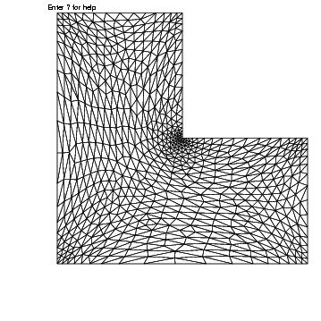
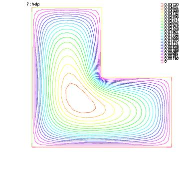
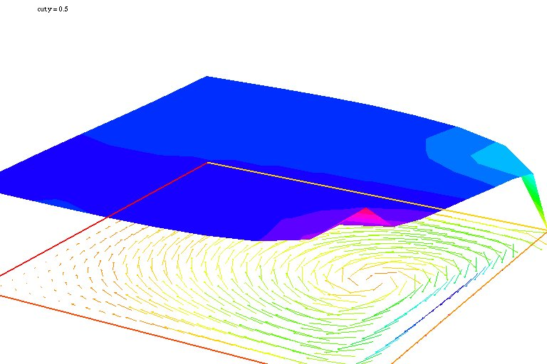
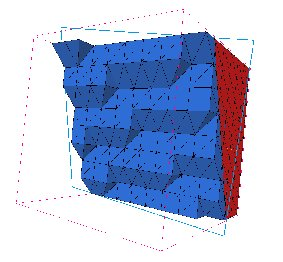

## Poisson's Equation

```freefem
// Parameters
int nn = 20;
real L = 1.;
real H = 1.;
real l = 0.5;
real h = 0.5;

func f = 1.;
func g = 0.;

int NAdapt = 10;

// Mesh
border b1(t=0, L){x=t; y=0;};
border b2(t=0, h){x=L; y=t;};
border b3(t=L, l){x=t; y=h;};
border b4(t=h, H){x=l; y=t;};
border b5(t=l, 0){x=t; y=H;};
border b6(t=H, 0){x=0; y=t;};

mesh Th = buildmesh(b1(nn*L) + b2(nn*h) + b3(nn*(L-l)) + b4(nn*(H-h)) + b5(nn*l) + b6(nn*H));

// Fespace
fespace Vh(Th, P1);	//Change P1 to P2 to test P2 finite element
Vh u, v;

// Macro
macro grad(u) [dx(u), dy(u)] //

// Problem
problem Poisson (u, v, solver=CG, eps=-1.e-6)
	= int2d(Th)(
		  grad(u)' * grad(v)
	)
	+ int2d(Th)(
		  f * v
	)
	+ on(b1, b2, b3, b4, b5, b6, u=g)
	;

// Mesh adaptation iterations
real error = 0.1;
real coef = 0.1^(1./5.);
for (int i = 0; i < NAdapt; i++){
	// Solve
	Poisson;

	// Plot
	plot(Th, u);

	// Adaptmesh
	Th = adaptmesh(Th, u, inquire=1, err=error);
	error = error * coef;
}
```

Solution on adapted mesh and associated mesh | |
:-------------------------:|:-------------------------:
 | 

## Poisson's equation 3D
$\codered$
```freefem
// build de mesh of a Sphere
// --------------------------
load "tetgen"
load "medit"

mesh Th=square(10,20,[x*pi-pi/2,2*y*pi]);  //  $]\frac{-pi}{2},frac{-pi}{2}[\times]0,2\pi[ $
//  a parametrization of a sphere
func f1 =cos(x)*cos(y);
func f2 =cos(x)*sin(y);
func f3 = sin(x);
//  de  partiel derivative of the parametrization DF
func f1x=sin(x)*cos(y);   
func f1y=-cos(x)*sin(y);
func f2x=-sin(x)*sin(y);
func f2y=cos(x)*cos(y);
func f3x=cos(x);
func f3y=0;
// $  M = DF^t DF $
func m11=f1x^2+f2x^2+f3x^2;
func m21=f1x*f1y+f2x*f2y+f3x*f3y;
func m22=f1y^2+f2y^2+f3y^2;

func perio=[[4,y],[2,y],[1,x],[3,x]];  
real hh=0.1;
real vv= 1/square(hh);
verbosity=2;
Th=adaptmesh(Th,m11*vv,m21*vv,m22*vv,IsMetric=1,periodic=perio);
Th=adaptmesh(Th,m11*vv,m21*vv,m22*vv,IsMetric=1,periodic=perio);
plot(Th,wait=1);

verbosity=2;
real[int] domaine =[0.,0.,0.,1,0.01];
mesh3 Th3=tetgtransfo(Th,transfo=[f1,f2,f3],nbofregions=1,regionlist=domaine);
//savemesh(Th3,"sphere.meshb");
medit("sphere",Th3);

// FFCS - check 3D plots
plot(Th3,cmm="sphere");

fespace Vh(Th3,P23d);
func ue =   2*x*x + 3*y*y + 4*z*z+ 5*x*y+6*x*z+1;
func f= -18. ;
Vh uhe = ue; // bug ..
cout << " uhe min:  " << uhe[].min << " max:" << uhe[].max << endl;
cout << uhe(0.,0.,0.) << endl;


//savesol("f3.sol",Th3,ue,ue,[f,ue,f],order=1);
//int bb=meditmeshsol("sol",Th3,solution=1,scalar=uhe);


border cc(t=0,2*pi){x=cos(t);y=sin(t);label=1;}
mesh Th2=buildmesh(cc(50));
fespace Vh2(Th2,P2);

Vh u,v;

macro Grad3(u) [dx(u),dy(u),dz(u)]  // EOM

problem Lap3d(u,v,solver=CG)=int3d(Th3)(Grad3(v)' *Grad3(u)) - int3d(Th3)(f*v) + on(0,1,u=ue);
Lap3d;
cout << " u min::   " << u[]. min << "  max: " << u[].max << endl;
real err= int3d(Th3)( square(u-ue) );
cout << int3d(Th3)(1.) << " = " << Th3.measure << endl;
Vh d= ue-u;
cout <<  " err = " << err <<  " diff l^\intfy = " << d[].linfty << endl;
Vh2 u2=u,u2e=ue;
plot(u2,wait=1);
plot(u2,u2e,wait=1);

// FFCS - check 3D plots
plot(u);

assert(err < 1e-9);
```

## Stoke Equation on a cube

```freefem
load "msh3"
load "medit"	// dynamically loaded tools for 3D

// Parameters
int nn = 8;

// Mesh
mesh Th0 = square(nn, nn);
int[int] rup = [0, 2];
int[int] rdown = [0, 1];
int[int] rmid = [1, 1, 2, 1, 3, 1, 4, 1];
real zmin = 0, zmax = 1;
mesh3 Th = buildlayers(Th0, nn, zbound=[zmin, zmax],
	reffacemid=rmid, reffaceup=rup, reffacelow=rdown);

medit("c8x8x8", Th); // 3d mesh visualization with medit

// Fespaces
fespace Vh2(Th0, P2);
Vh2 ux, uz, p2;

fespace VVh(Th, [P2, P2, P2, P1]);
VVh [u1, u2, u3, p];
VVh [v1, v2, v3, q];

// Macro
macro Grad(u) [dx(u), dy(u), dz(u)] //
macro div(u1,u2,u3) (dx(u1) + dy(u2) + dz(u3)) //

// Problem (directly solved)
solve vStokes ([u1, u2, u3, p], [v1, v2, v3, q])
	= int3d(Th, qforder=3)(
		  Grad(u1)' * Grad(v1)
		+ Grad(u2)' * Grad(v2)
		+ Grad(u3)' * Grad(v3)
		- div(u1, u2, u3) * q
		- div(v1, v2, v3) * p
		+ 1e-10 * q * p
	)
	+ on(2, u1=1., u2=0, u3=0)
	+ on(1, u1=0, u2=0, u3=0)
	;

// Plot
plot(p, wait=1, nbiso=5); // 3d visualization of pressure isolines

// See 10 plan of the velocity in 2D
for(int i = 1; i < 10; i++){
	// Cut plane
	real yy = i/10.;
	// 3D to 2D interpolation
	ux = u1(x,yy,y);
	uz = u3(x,yy,y);
	p2 = p(x,yy,y);
	// Plot
	plot([ux, uz], p2, cmm="cut y = "+yy, wait= 1);
}
```

Solution and associated mesh |
:-------------------------:|
 |
 |

## Mehs Generation

### Mesh adaptation

```freefem
// Parameters
real eps = 0.0001;
real h = 1;
real hmin = 0.05;
func f = 10.0*x^3 + y^3 + h*atan2(eps, sin(5.0*y)-2.0*x);

// Mesh
mesh Th = square(5, 5, [-1+2*x, -1+2*y]);

// Fespace
fespace Vh(Th,P1);
Vh fh = f;
plot(fh);

// Adaptmesh
for (int i = 0; i < 2; i++){
	Th = adaptmesh(Th, fh);
	fh = f; //old mesh is deleted
	plot(Th, fh, wait=true);
}
```

### Mesh adaptation on the Poisson's problem
```freefem
// Parameters
real error = 0.1;

// Mesh
border ba(t=0, 1){x=t; y=0; label=1;}
border bb(t=0, 0.5){x=1; y=t; label=1;}
border bc(t=0, 0.5){x=1-t; y=0.5; label=1;}
border bd(t=0.5, 1){x=0.5; y=t; label=1;}
border be(t=0.5, 1){x=1-t; y=1; label=1;}
border bf(t=0, 1){x=0; y=1-t; label=1;}
mesh Th = buildmesh(ba(6) + bb(4) + bc(4) + bd(4) + be(4) + bf(6));

// Fespace
fespace Vh(Th, P1);
Vh u, v;

// Function
func f = 1;

// Problem
problem Poisson(u, v, solver=CG, eps=1.e-6)
	= int2d(Th)(
		  dx(u)*dx(v)
		+ dy(u)*dy(v)
	)
	- int2d(Th)(
		  f*v
	)
	+ on(1, u=0);

// Adaptmesh loop
for (int i = 0; i < 4; i++){
	Poisson;
	Th = adaptmesh(Th, u, err=error);
	error = error/2;
}

// Plot
plot(u);
```

### Uniforme mesh adaptation

```freefem
mesh Th=square(2, 2); //the initial mesh
plot(Th, wait=true);

Th = adaptmesh(Th, 1./30., IsMetric=1, nbvx=10000);
plot(Th, wait=true);

Th = adaptmesh(Th, 1./30., IsMetric=1, nbvx=10000); //More the one time du to
Th = adaptmesh(Th, 1./30., IsMetric=1, nbvx=10000); //Adaptation bound `maxsubdiv=`
plot(Th, wait=true);
```

### Borders

```freefem
{
	int upper = 1;
	int others = 2;
	int inner = 3;

	border C01(t=0, 1){x=0; y=-1+t; label=upper;}
	border C02(t=0, 1){x=1.5-1.5*t; y=-1; label=upper;}
	border C03(t=0, 1){x=1.5; y=-t; label=upper;}
	border C04(t=0, 1){x=1+0.5*t; y=0; label=others;}
	border C05(t=0, 1){x=0.5+0.5*t; y=0; label=others;}
	border C06(t=0, 1){x=0.5*t; y=0; label=others;}
	border C11(t=0, 1){x=0.5; y=-0.5*t; label=inner;}
	border C12(t=0, 1){x=0.5+0.5*t; y=-0.5; label=inner;}
	border C13(t=0, 1){x=1; y=-0.5+0.5*t; label=inner;}

	int n = 10;
	plot(C01(-n) + C02(-n) + C03(-n) + C04(-n) + C05(-n)
		+ C06(-n) + C11(n) + C12(n) + C13(n), wait=true);

	mesh Th = buildmesh(C01(-n) + C02(-n) + C03(-n) + C04(-n) + C05(-n)
		+ C06(-n) + C11(n) + C12(n) + C13(n));

	plot(Th, wait=true);

	cout << "Part 1 has region number " << Th(0.75, -0.25).region << endl;
	cout << "Part 2 has redion number " << Th(0.25, -0.25).region << endl;
}

{
	border a(t=0, 2*pi){x=cos(t); y=sin(t); label=1;}
	border b(t=0, 2*pi){x=0.3+0.3*cos(t); y=0.3*sin(t); label=2;}
	plot(a(50) + b(30)); //to see a plot of the border mesh
	mesh Thwithouthole = buildmesh(a(50) + b(30));
	mesh Thwithhole = buildmesh(a(50) + b(-30));
	plot(Thwithouthole);
	plot(Thwithhole);
}

{
	real r=1;
	border a(t=0, 2*pi){x=r*cos(t); y=r*sin(t); label=1;}
	r=0.3;
	border b(t=0, 2*pi){x=r*cos(t); y=r*sin(t); label=1;}
//	mesh Thwithhole = buildmesh(a(50) + b(-30)); // bug (a trap) because
		                                         // the two circle have the same radius = $0.3$
}
```

### Change

```freefem
verbosity=3;

// Mesh
mesh Th1 = square(10, 10);
mesh Th2 = square(20, 10, [x+1, y]);

int[int] r1=[2,0];
plot(Th1, wait=true);

Th1 = change(Th1, label=r1); //change the label of Edges 2 in 0.
plot(Th1, wait=true);

int[int] r2=[4,0];
Th2 = change(Th2, label=r2); //change the label of Edges 4 in 0.
plot(Th2, wait=true);

mesh Th = Th1 + Th2; //'gluing together' of meshes Th1 and Th2
cout << "nb lab = " << int1d(Th1,1,3,4)(1./lenEdge)+int1d(Th2,1,2,3)(1./lenEdge)
	 << " == " << int1d(Th,1,2,3,4)(1./lenEdge) << " == " << ((10+20)+10)*2 << endl;
plot(Th, wait=true);

fespace Vh(Th, P1);
Vh u, v;

macro Grad(u) [dx(u),dy(u)] // Definition of a macro

solve P(u, v)
	= int2d(Th)(
		  Grad(u)'*Grad(v)
	)
	-int2d(Th)(
		  v
	)
	+ on(1, 3, u=0)
	;

plot(u, wait=1);
```

### Cube

```freefem
load "msh3"

int[int] l6 = [37, 42, 45, 40, 25, 57];
int r11 = 11;
mesh3 Th = cube(4, 5, 6, [x*2-1, y*2-1, z*2-1], label=l6, flags =3, region=r11);

cout << "Volume = " << Th.measure << ", border area = " << Th.bordermeasure << endl;

int err = 0;
for(int i = 0; i < 100; ++i){
	real s = int2d(Th,i)(1.);
	real sx = int2d(Th,i)(x);
	real sy = int2d(Th,i)(y);
	real sz = int2d(Th,i)(z);

	if(s){
		int ix = (sx/s+1.5);
		int iy = (sy/s+1.5);
		int iz = (sz/s+1.5);
		int ii = (ix + 4*(iy+1) + 16*(iz+1) );
		//value of ix,iy,iz => face min 0, face max 2, no face 1
		cout << "Label = " << i << ", s = " << s << " " << ix << iy << iz << " : " << ii << endl;
		if( i != ii ) err++;
	}
}
real volr11 = int3d(Th,r11)(1.);
cout << "Volume region = " << 11 << ": " << volr11 << endl;
if((volr11 - Th.measure )>1e-8) err++;
plot(Th, fill=false);
cout << "Nb err = " << err << endl;
assert(err==0);
```

### Empty mesh

```freefem
{
	border a(t=0, 2*pi){x=cos(t); y=sin(t); label=1;}
	mesh Th = buildmesh(a(20));
	Th = emptymesh(Th);
	plot(Th);
}
{
	mesh Th = square(10, 10);
	int[int] ssd(Th.nt);
	//build the pseudo region numbering
	for(int i = 0; i < ssd.n; i++){
		int iq = i/2; //because 2 triangles per quad
		int ix = iq%10;
		int iy = iq/10;
		ssd[i] = 1 + (ix>=5) + (iy>=5)*2;
	}
	//build emtpy with all edge $e=T1 \cap T2$ and $ssd[T1] \neq ssd[T2]$
	Th = emptymesh(Th, ssd);
	//plot
	plot(Th);
	savemesh(Th, "emptymesh.msh");
}
```

### Example: 3 points

```freefem
// Square for Three-Point Bend Specimens fixed on Fix1, Fix2
// It will be loaded on Load.
real a = 1, b = 5, c = 0.1;
int n = 5, m = b*n;
border Left(t=0, 2*a){x=-b; y=a-t;}
border Bot1(t=0, b/2-c){x=-b+t; y=-a;}
border Fix1(t=0, 2*c){x=-b/2-c+t; y=-a;}
border Bot2(t=0, b-2*c){x=-b/2+c+t; y=-a;}
border Fix2(t=0, 2*c){x=b/2-c+t; y=-a;}
border Bot3(t=0, b/2-c){x=b/2+c+t; y=-a;}
border Right(t=0, 2*a){x=b; y=-a+t;}
border Top1(t=0, b-c){x=b-t; y=a;}
border Load(t=0, 2*c){x=c-t; y=a;}
border Top2(t=0, b-c){x=-c-t; y=a;}

mesh Th = buildmesh(Left(n) + Bot1(m/4) + Fix1(5) + Bot2(m/2)
	+ Fix2(5) + Bot3(m/4) + Right(n) + Top1(m/2) + Load(10) + Top2(m/2));
plot(Th, bw=true);
```

### Example: Bezier

```freefem
// A cubic Bezier curve connecting two points with two control points
func real bzi(real p0, real p1, real q1, real q2, real t){
	return p0*(1-t)^3 + q1*3*(1-t)^2*t + q2*3*(1-t)*t^2 + p1*t^3;
}

real[int] p00 = [0, 1], p01 = [0, -1], q00 = [-2, 0.1], q01 = [-2, -0.5];
real[int] p11 = [1,-0.9], q10 = [0.1, -0.95], q11=[0.5, -1];
real[int] p21 = [2, 0.7], q20 = [3, -0.4], q21 = [4, 0.5];
real[int] q30 = [0.5, 1.1], q31 = [1.5, 1.2];
border G1(t=0, 1){
	x=bzi(p00[0], p01[0], q00[0], q01[0], t);
	y=bzi(p00[1], p01[1], q00[1], q01[1], t);
}
border G2(t=0, 1){
	x=bzi(p01[0], p11[0], q10[0], q11[0], t);
	y=bzi(p01[1], p11[1], q10[1], q11[1], t);
}
border G3(t=0, 1){
	x=bzi(p11[0], p21[0], q20[0], q21[0], t);
	y=bzi(p11[1], p21[1], q20[1], q21[1], t);
}
border G4(t=0, 1){
	x=bzi(p21[0], p00[0], q30[0], q31[0], t);
	y=bzi(p21[1], p00[1], q30[1], q31[1], t);
}
int m = 5;
mesh Th = buildmesh(G1(2*m) + G2(m) + G3(3*m) + G4(m));
plot(Th, bw=true);
```

### Example: Build layer mesh

```freefem
load "msh3"
load "tetgen"
load "medit"

// Parameters
int C1 = 99;
int C2 = 98;

// 2D mesh
border C01(t=0, pi){x=t; y=0; label=1;}
border C02(t=0, 2*pi){ x=pi; y=t; label=1;}
border C03(t=0, pi){ x=pi-t; y=2*pi; label=1;}
border C04(t=0, 2*pi){ x=0; y=2*pi-t; label=1;}

border C11(t=0, 0.7){x=0.5+t; y=2.5; label=C1;}
border C12(t=0, 2){x=1.2; y=2.5+t; label=C1;}
border C13(t=0, 0.7){x=1.2-t; y=4.5; label=C1;}
border C14(t=0, 2){x=0.5; y=4.5-t; label=C1;}

border C21(t=0, 0.7){x=2.3+t; y=2.5; label=C2;}
border C22(t=0, 2){x=3; y=2.5+t; label=C2;}
border C23(t=0, 0.7){x=3-t; y=4.5; label=C2;}
border C24(t=0, 2){x=2.3; y=4.5-t; label=C2;}

mesh Th = buildmesh(C01(10) + C02(10) + C03(10) + C04(10)
	+ C11(5) + C12(5) + C13(5) + C14(5)
	+ C21(-5) + C22(-5) + C23(-5) + C24(-5));

mesh Ths = buildmesh(C01(10) + C02(10) + C03(10) + C04(10)
	+ C11(5) + C12(5) + C13(5) + C14(5));

// Construction of a box with one hole and two regions
func zmin = 0.;
func zmax = 1.;
int MaxLayer = 10;

func XX = x*cos(y);
func YY = x*sin(y);
func ZZ = z;

int[int] r1 = [0, 41], r2 = [98, 98, 99, 99, 1, 56];
int[int] r3 = [4, 12];//the triangles of uppper surface mesh
					  //generated by the triangle in the 2D region
					  //of mesh Th of label 4 as label 12
int[int] r4 = [4, 45];//the triangles of lower surface mesh
					  //generated by the triangle in the 2D region
					  //of mesh Th of label 4 as label 45.

mesh3 Th3 = buildlayers(Th, MaxLayer, zbound=[zmin, zmax], region=r1,
	labelmid=r2, labelup=r3, labeldown=r4);
medit("box 2 regions 1 hole", Th3);

// Construction of a sphere with TetGen
func XX1 = cos(y)*sin(x);
func YY1 = sin(y)*sin(x);
func ZZ1 = cos(x);

real[int] domain = [0., 0., 0., 0, 0.001];
string test = "paACQ";
cout << "test = " << test << endl;
mesh3 Th3sph = tetgtransfo(Ths, transfo=[XX1, YY1, ZZ1],
	switch=test, nbofregions=1, regionlist=domain);
medit("sphere 2 regions", Th3sph);
```

### Sphere
$\codered$
```freefem
mesh Th=square(10,20,[x*pi-pi/2,2*y*pi]);  //  $]\frac{-pi}{2},frac{-pi}{2}[\times]0,2\pi[ $
//  a paratrization of a sphere
func f1 =cos(x)*cos(y);
func f2 =cos(x)*sin(y);
func f3 = sin(x);
//  de  partiel derivatrive of the parametrization DF
func f1x=sin(x)*cos(y);   
func f1y=-cos(x)*sin(y);
func f2x=-sin(x)*sin(y);
func f2y=cos(x)*cos(y);
func f3x=cos(x);
func f3y=0;
// $  M = DF^t DF $
func m11=f1x^2+f2x^2+f3x^2;
func m21=f1x*f1y+f2x*f2y+f3x*f3y;
func m22=f1y^2+f2y^2+f3y^2;

func perio=[[4,y],[2,y],[1,x],[3,x]];  // to store the periodic condition

// the intial mesh
savemesh(Th,"sphere",[f1,f2,f3]);

real hh=0.1;
real vv= 1/square(hh);
verbosity=2;
Th=adaptmesh(Th,m11*vv,m21*vv,m22*vv,IsMetric=1,inquire=1,periodic=perio);
plot(Th,wait=1);
Th=adaptmesh(Th,m11*vv,m21*vv,m22*vv,IsMetric=1,periodic=perio);
plot(Th,wait=1);
Th=adaptmesh(Th,m11*vv,m21*vv,m22*vv,IsMetric=1,periodic=perio);
plot(Th,wait=1);
Th=adaptmesh(Th,m11*vv,m21*vv,m22*vv,IsMetric=1,periodic=perio);
load "msh3" load "medit"
//savemesh(Th,"sphere-a",[f1,f2,f3]);
plot(Th,wait=1);
mesh3 Th3= movemesh23(Th,transfo=[f1,f2,f3]);
plot(Th3,wait=1);
medit("sphere-a",Th3);// bug un color of u ... FH

//exec("ffmedit sphere-a");
```

## Finite Element

### Periodic 3D
$\codered$
```freefem
load "msh3"
load "medit"
searchMethod=1; // more safe seach algo .. (FH for PICHON ??)
verbosity=1;
real a=1, d=0.5, h=0.5;
border b1(t=0.5,-0.5) {x=a*t; y=-a/2; label=1;};
border b2(t=0.5,-0.5) {x=a/2; y=a*t; label=2;};
border b3(t=0.5,-0.5) {x=a*t; y=a/2; label=3;};
border b4(t=0.5,-0.5) {x=-a/2; y=a*t; label=4;};
border i1(t=0,2*pi) {x=d/2*cos(t); y=-d/2*sin(t); label=7;};
int nnb=7, nni=10;
mesh Th=buildmesh(b1(-nnb)+b3(nnb)+b2(-nnb)+b4(nnb)+i1(nni));//, fixedborder=true);
//Th=adaptmesh(Th,0.1,IsMetric=1,periodic=[[1,x],[3,x],[2,y],[4,y]]);
int nz=3;
{ // for cleanning  memory..
int[int] old2new(0:Th.nv-1);
fespace Vh2(Th,P1);
Vh2 sorder=x+y;
sort(sorder[],old2new);
int[int]  new2old=old2new^-1;   // inverse the permuation
//for(int i=0;i< Th.nv;++i) // so by hand.
//  new2old[old2new[i]]=i;
Th= change(Th,renumv=new2old);
sorder[]=0:Th.nv-1;
}
{
  fespace Vh2(Th,P1);
  Vh2 nu;
  nu[]=0:Th.nv-1;
  plot(nu,cmm="nu=",wait=1);
}
int[int] rup=[0,5], rlow=[0,6], rmid=[1,1,2,2,3,3,4,4,7,7], rtet=[0,41];
func zmin=0;
func zmax=h;
mesh3 Th3=buildlayers(Th, nz, zbound=[zmin,zmax],
reftet=rtet,reffacemid=rmid, reffaceup=rup, reffacelow=rlow);
for(int i=1;i<=6;++i)
  cout << " int " << i << " :  " << int2d(Th3,i)(1.) << " " << int2d(Th3,i)(1./area) << endl;
savemesh(Th3,"Th3.mesh");
plot(Th3,wait=1);
medit("Th3",Th3);

fespace Vh(Th3,P2, periodic=[[1,x,z],[3,x,z],[2,y,z],[4,y,z],[5,x,y],[6,x,y]]);
```

### Lagrange multipliers
$\codered$
```freefem
/*
   solving   Laplace operator with Neumann boundary condition
   with 1D lagrange multiplier

   The variational form is
   find (u,l) such that

   $\forall (v,m)   a(u,v) + b(u,m) + b(v,l) = L(v) $
   where $b(u,m) = int u*m dx$

*/
 mesh Th=square(10,10);
 fespace Vh(Th,P1);     // P1 FE space
int n = Vh.ndof;
int n1 = n+1;

 Vh uh,vh;              // unknown and test function.
 func f=1+x-y;                 //  right hand side function

varf va(uh,vh) =                    //  definition of  the problem
    int2d(Th)( dx(uh)*dx(vh) + dy(uh)*dy(vh) ) //  bilinear form
;
varf vL(uh,vh)=  int2d(Th)( f*vh )  ;
varf vb(uh,vh)= int2d(Th)(1.*vh);

matrix A=va(Vh,Vh);

real[int] b(n);
b = vL(0,Vh);

real[int]  B = vb(0,Vh); 	
// the block matrix

matrix AA = [ [ A ,  B ] ,
              [ B', 0 ] ] ;

real[int]  bb(n+1),xx(n+1),b1(1),l(1);
b1=0;
// build the block rhs
bb = [ b, b1];
set(AA,solver=sparsesolver);
xx = AA^-1*bb; // solve the linear system

[uh[],l] = xx;  // set the value
cout << " l = " << l(0) <<  " ,  b(u,1)  =" << B'*uh[]  << endl;  
plot(uh,wait=1);
```

## Parallelization

### MPI-GMRES 2D
$\codered$
```freefem
// NBPROC 10
// ff-mpirun -np 4 MPIGMRES2D.edp -glut ffglut  -n 11 -k 1  -d 1 -ns -gmres 1
/*
  a first true parallele example fisrt freefem++
  Ok up to 200 proc for a Poisson equation..
  See the Doc for full explaiantion

  F Hecht Dec. 2010.
  -------------------
usage :
ff-mpirun [mpi parameter] MPIGMRES2d.edp  [-glut ffglut]  [-n N] [-k K]  [-d D] [-ns] [-gmres [0|1]
 argument:
   -glut ffglut : to see graphicaly the process
   -n N:  set the mesh cube split NxNxN
   -d D:  set debug flag D must be one for mpiplot
   -k K:  to refined by K all  elemnt
   -ns: reomove script dump
   -gmres 0   : use iterative schwarz algo.  
          1   :  Algo GMRES on residu of schwarz algo.
          2   :  DDM GMRES
          3   :  DDM GMRES with coarse grid preconditionner (Good one)  
*/
load "MPICG"  load "medit"  load "metis"
include "getARGV.idp"
include "MPIplot.idp"
include "MPIGMRESmacro.idp"
//include "AddLayer2d.idp"

searchMethod=0; // more safe seach algo (warning can be very expensive in case lot of ouside point)
assert(version >=3.11);
real[int] ttt(10);int ittt=0;
macro settt {ttt[ittt++]=mpiWtime();}//


verbosity=getARGV("-vv",0);
int vdebug=getARGV("-d",1);
int ksplit=getARGV("-k",3);
int nloc = getARGV("-n",10);
string sff=getARGV("-p,","");
int gmres=getARGV("-gmres",2);
bool dplot=getARGV("-dp",0);
int nC = getARGV("-N" ,max(nloc/10,4));

if(mpirank==0 && verbosity)
{
  cout << "ARGV : ";
  for(int i=0;i<ARGV.n;++i)
    cout << ARGV[i] <<" ";
  cout << endl;
}


if(mpirank==0 && verbosity)
  cout << " vdebug: " << vdebug << " kspilt "<< ksplit << " nloc "<< nloc << " sff "<< sff <<"."<< endl;

int withplot=0;
bool withmetis=1;
bool RAS=1;
string sPk="P2-2gd";     
func Pk=P2;

func bool  plotMPIall(mesh &Th,real[int] & u,string  cm)
{if(vdebug) PLOTMPIALL(mesh,Pk, Th, u,{ cmm=cm,nbiso=20,fill=1,dim=3,value=1}); return 1;}

int sizeoverlaps=1; // size of overlap

mpiComm comm(mpiCommWorld,0,0);// trick : make a no split mpiWorld

int npart=mpiSize(comm); // total number of partion
int ipart= mpiRank(comm); // current partition number

int njpart=0; // nb of part with intersection (a jpart) with ipart without ipart
int[int] jpart(npart); //  list of jpart ..
if(ipart==0)  cout << " Final N=" << ksplit*nloc << " nloc =" << nloc << " split =" << ksplit <<  endl;
int[int] l111=[1,1,1,1];
settt

mesh Thg=square(nloc,nloc,label=l111);
mesh ThC=square(nC,nC,label=l111);//   Caarse Mesh

mesh Thi,Thin;//  with overlap, without olverlap  
fespace Phg(Thg,P0);
fespace Vhg(Thg,P1);
fespace VhC(ThC,P1); // of the coarse problem..


Phg  part;

// build the partitioning ...  
{    
 int[int] nupart(Thg.nt);
 nupart=0;
 if(npart>1 && ipart==0)
   metisdual(nupart,Thg,npart);

 broadcast(processor(0,comm),nupart);
 for(int i=0;i<nupart.n;++i)
    part[][i]=nupart[i];

} // build ...


if(withplot>1)
  plot(part,fill=1,cmm="dual",wait=1);

// overlapping partition

 Phg suppi= abs(part-ipart)<0.1;
 Vhg unssd;                       // boolean function 1 in the subdomain 0 elswhere
 Thin=trunc(Thg,suppi>0,label=10); // non-overlapping mesh, interfaces have label 10
 int nnn = sizeoverlaps*2;// to be sure
 AddLayers(Thg,suppi[],nnn,unssd[]);    // see above ! suppi and unssd are modified  
 unssd[] *= nnn;  //  to put value nnn a 0  
 real nnn0 = nnn - sizeoverlaps +  0.001   ;
 Thi=trunc(Thg,unssd>nnn0 ,label=10); // overlapping mesh, interfaces have label 10

 settt

 fespace Vhi(Thi,P1);
 int npij=npart;
 Vhi[int] pij(npij);// local partition of unit + pii
 Vhi pii;  

 real nnn1=  + 0.001  ;
 { /*
   construction of the partition of the unit,
    let phi_i P1 FE function 1 on Thin and zero ouside of Thi and positive
    the partition is build with  
  $$  p_i = phi_i/ \sum phi_i

    to build the partition of one domain i
    we nned to find all j such that supp(phi_j) \cap supp(phi_j) is not empty
    <=> int phi_j
 */
 //   build a local mesh of thii such that all compuation of the unit partition are
 //   exact in thii
 mesh Thii=trunc(Thg,unssd>nnn1 ,label=10); // overlapping mesh, interfaces have label 10


 {  
   // find all j  mes (supp(p_j) \cap supp(p_i)) >0  
   // compute all phi_j on Thii
   //  remark supp p_i include in Thi
   //  
   fespace Phii(Thii,P0);
   fespace Vhii(Thii,P1);
   Vhi sumphi=0;
   jpart=0;
   njpart=0;
   int nlayer=RAS?1:sizeoverlaps;
   if(ipart==0)
     cout <<" nlayer=" << nlayer << endl;
   pii= max(unssd-nnn+nlayer,0.)/nlayer;
   if(dplot) plot(pii,wait=1,cmm=" 0000");
   sumphi[] +=  pii[];
   if(dplot) plot(sumphi,wait=1,cmm=" summ 0000");
   Vhii phii=0;
   real epsmes=1e-10*Thii.area;
   for (int i=0;i<npart;++i)
     if(i != ipart )
       {
	    Phii suppii=abs(i-part)<0.2;
	    if(suppii[].max > 0.5)
	    {
	     AddLayers(Thii,suppii[],nlayer,phii[]);
	     assert(phii[].min >=0);
	     real interij = int2d(Thi)(  phii);
	     if(interij>epsmes)
	       {  
		     pij[njpart]=abs(phii);	 
		     if(vdebug>2) cout << " ***** " << int2d(Thi)(real(pij[njpart])<0) << " " <<pij[njpart][].min << " " << phii[].min << endl;
		     assert(int2d(Thi)(real(pij[njpart])<0) ==0);
		     if(dplot)  plot(pij[njpart],wait=1,cmm=" j = "+ i + " " + njpart);
		     sumphi[] += pij[njpart][];
		     if(dplot)  plot(sumphi,wait=1,cmm=" sum j = "+ i + " " + njpart);
		     jpart[njpart++]=i;
	       }}}

   if(dplot) plot(sumphi,wait=1,dim=3,cmm="sum ",fill=1 );
   pii[]=pii[] ./ sumphi[];
   for (int j=0;j<njpart;++j)
     pij[j][] = pij[j][] ./ sumphi[];
   jpart.resize(njpart);
   for (int j=0;j<njpart;++j)
     assert(pij[j][].max<=1);
   {
     cout << ipart << " number of jpart " << njpart << " : ";
     for (int j=0;j<njpart;++j)
       cout << jpart[j] << " ";
  	cout << endl;
   }
   sumphi[]=pii[];
   for (int j=0;j<njpart;++j)
     sumphi[]+= pij[j][];
   if(vdebug>2)  
     cout << " sum min " <<sumphi[].min << " " << sumphi[].max << endl;
   assert(sumphi[].min> 1.-1e-6 && sumphi[].max< 1.+1e-6);  
   //  verification
 }}// (Thii is remove here)
  // end of the construction of the local partition of the unity ...
  // on Thi ...  
  // -----------------------------------------------------------------
if(ipart==0) cout << " *** end build partition " << endl;

//  computation of  number of intersection ..
// ------------------------------------------

// here  pii and the pij is the locate partition of the unite on
// Thi ( mesh with overlap )....
//Thi=splitmesh(Thi,2);
if(dplot )
  { plot(Thi,wait=1);
    for(int j=0;j<njpart;++j)
      plot(pij[j],cmm=" j="+j ,wait=1); }

//  Partition of the unity on Thi ..
// computation of message.
// all j> we have to recive
// data on intersection of the support of pij[0] and pij[j]
settt

 if(vdebug) plotMPIall(Thi,pii[],"pi_i");

mesh[int] aThij(njpart);
matrix Pii;  
matrix[int] sMj(njpart); // M of send to j
matrix[int] rMj(njpart); // M to recv from j
fespace Whi(Thi,Pk);
mesh Thij=Thi;
fespace Whij(Thij,Pk);//

// construction of the mesh intersect i,j part
for(int jp=0;jp<njpart;++jp)
  aThij[jp]  = trunc(Thi,pij[jp]>1e-6,label=10); // mesh of the supp of pij

for(int jp=0;jp<njpart;++jp)
  aThij[jp]  = trunc(aThij[jp],1,split=ksplit);

Thi =   trunc(Thi,1,split=ksplit);

settt

if(ipart==0) cout << " *** end build mesh  intersection  " << endl;
// construction of transfert  matrix
{
  Whi wpii=pii;
  Pii = wpii[];
  for(int jp=0;jp<njpart;++jp)
    {
      int j=jpart[jp];
      Thij = aThij[jp];
      matrix I = interpolate(Whij,Whi); // Whji <- Whi
      sMj[jp] = I*Pii;  // Whi -> s Whij  
      rMj[jp] = interpolate(Whij,Whi,t=1);   // Whji -> Whi
      if(vdebug>10) {
      {Whi uuu=1;Whij vvv=-1; vvv[]+=I*uuu[]; cout << jp << " %%% " << vvv[].linfty << endl; assert(vvv[].linfty < 1e-6);}
      {Whi uuu=1;Whij vvv=-1; vvv[]+=rMj[jp]'*uuu[]; cout << jp << " ### " << vvv[].linfty << endl; assert(vvv[].linfty < 1e-6);}}
    }}
if(ipart==0) cout << " *** end build transfert matrix " << endl;
// alloc array of send and recv data ..

InitU(njpart,Whij,Thij,aThij,Usend)  // initU(n,Vh,Th,aTh,U)
InitU(njpart,Whij,Thij,aThij,Vrecv) // ...
if(ipart==0) cout << " *** end init  data for send/revc  " << endl;

Whi ui,vi;

func bool Update(real[int] &ui, real[int] &vi)
{
  for(int j=0;j<njpart;++j)
    Usend[j][]=sMj[j]*ui;
   SendRecvUV(comm,jpart,Usend,Vrecv)
     vi = Pii*ui;
   for(int j=0;j<njpart;++j)
     vi += rMj[j]*Vrecv[j][];
   return true;
}


// the definition of the Problem ....
func G=x*0.1; // ok
func F=1.; // ok
macro grad(u) [dx(u),dy(u)] //
varf vBC(U,V)=  on(1,U=G);
varf vPb(U,V)= int2d(Thi)(grad(U)'*grad(V)) + int2d(Thi)(F*V) + on(10,U=0)+on(1,U=G) ; //');// for emacs
varf vPbC(U,V)= int2d(ThC)(grad(U)'*grad(V))  +on(1,U=0) ; //');// for emacs
varf vPbon(U,V)=on(10,U=1)+on(1,U=1);
varf vPbon10only(U,V)=on(10,U=1)+on(1,U=0);
// remark the order is important we want 0 part on 10 and 1


//----  

matrix Ai = vPb(Whi,Whi,solver=sparsesolver);
matrix AC,Rci,Pci;//


if(mpiRank(comm)==0)
  AC = vPbC(VhC,VhC,solver=sparsesolver);

Pci=   interpolate(Whi,VhC);
Rci =  Pci'*Pii;

real[int] onG10 = vPbon10only(0,Whi);
real[int] onG = vPbon(0,Whi);
real[int] Bi=vPb(0,Whi);


int kiter=-1;


func bool  CoarseSolve(real[int]& V,real[int]& U,mpiComm& comm)
{
   //  solving the coarse probleme
   real[int] Uc(Rci.n),Bc(Uc.n);
   Uc= Rci*U;
   mpiReduce(Uc,Bc,processor(0,comm),mpiSUM);
   if(mpiRank(comm)==0)
      Uc = AC^-1*Bc;
    broadcast(processor(0,comm),Uc);
   V = Pci*Uc;
}//EOF ...
func real[int] DJ(real[int]& U)
{
  ++kiter;
  real[int] V(U.n);
   V =  Ai*U;
  V = onG10 ? 0.: V;  // remove internal boundary  
  return V;
}

func real[int] PDJ(real[int]& U) // C1
{
  real[int] V(U.n);

  real[int] b= onG10 ? 0. :  U;
  V =  Ai^-1*b;
  Update(V,U);
  return U;
}

func real[int] PDJC(real[int]& U) //
{ // Precon  C1= Precon //, C2  precon Coarse
// Idea : F. Nataf.
  //  0 ~  (I C1A)(I-C2A) => I ~  - C1AC2A +C1A +C2A
  //  New Prec P= C1+C2 - C1AC2   = C1(I- A C2) +C2
  // (  C1(I- A C2) +C2 ) Uo
  //   V =  - C2*Uo
  // ....
  real[int] V(U.n);
  CoarseSolve(V,U,comm);
  V = -V; //  -C2*Uo
  U  += Ai*V; // U =  (I-A C2) Uo
  real[int] b= onG10 ? 0. :  U;
  U =  Ai^-1*b;	//  ( C1( I -A C2) Uo
  V = U -V; //  
  Update(V,U);
  return U;
}


 func real[int] DJ0(real[int]& U)
{
  ++kiter;
  real[int] V(U.n);
  real[int] b= onG .* U;
  b  = onG ? b : Bi ;  
  V = Ai^-1*b;
  Update(V,U);
  V -= U;
   return V;
}


Whi u=0,v;
{ // verification.....
  Whi u=1,v;
  Update(u[],v[]);
  u[]-=v[];
  assert( u[].linfty<1e-6); }


settt
u[]=vBC(0,Whi,tgv=1); // set u with tge BC value ...

real epss=1e-6;
int rgmres=0;
if(gmres==1)
  {
   rgmres=MPIAffineGMRES(DJ0,u[],veps=epss,nbiter=300,comm=comm,dimKrylov=100,verbosity=ipart ? 0: 50);
   real[int] b= onG .* u[];
   b  = onG ? b : Bi ;
   v[] = Ai^-1*b;
   Update(v[],u[]);
  }
else if(gmres==2)
  rgmres= MPILinearGMRES(DJ,precon=PDJ,u[],Bi,veps=epss,nbiter=300,comm=comm,dimKrylov=100,verbosity=ipart ? 0: 50);
else if(gmres==3)
   rgmres= MPILinearGMRES(DJ,precon=PDJC,u[],Bi,veps=epss,nbiter=300,comm=comm,dimKrylov=100,verbosity=ipart ? 0: 50);
else // algo Shwarz for demo ...
   for(int iter=0;iter <10; ++iter)
     {
       real[int] b= onG .* u[];
       b  = onG ? b : Bi ;
       v[] = Ai^-1*b;

       Update(v[],u[]);
       if(vdebug) plotMPIall(Thi,u[],"u-"+iter);
        v[] -= u[];

       real err = v[].linfty;
       real umax = u[].max;
       real[int] aa=[err,umax], bb(2);
       mpiAllReduce(aa,bb,comm,mpiMAX);
       real errg = bb[0];
       real umaxg = bb[1];

       if(ipart==0)
	     cout << ipart << " err = " << errg << " u. max  " << umaxg << endl;
       if(errg< 1e-5) break;
     }
if(vdebug) plotMPIall(Thi,u[],"u-final");

settt

real errg =1,umaxg;
{
  real umax = u[].max,umaxg;
  real[int] aa=[umax], bb(1);
  mpiAllReduce(aa,bb,comm,mpiMAX);
  errg=bb[0];
  if(ipart==0)
    cout << " umax global  = " << bb[0] << " Wtime = " << (ttt[ittt-1]-ttt[ittt-2])  << " s " <<  " " << kiter <<  endl;
}

if(sff != "")
  {
    ofstream ff(sff+".txt",append);
    cout << " ++++  " ;
    cout  << mpirank <<"/" <<  mpisize << " k=" <<  ksplit << " n= " << nloc << " " << sizeoverlaps << " it=  " << kiter  ;  
    for (int i=1; i<ittt;++i)
      cout << " " << ttt[i]-ttt[i-1] << " ";
    cout << epss << " " << Ai.nbcoef << " " << Ai.n << endl;

    /*
      1 mpirank
      2 mpisize
      3 ksplit
      4 nloc
      5 sizeoverlaps
      6 kiter
      7 mesh & part build  
      8 build the partion
      9 build mesh, transfere , and the fine mesh ..
      10 build the matrix,  the trans matrix, factorizatioon
      11 GMRES
    */
    ff   << mpirank << " " << mpisize << " " << sPk << " " ;
    ff <<  ksplit << " " << nloc << " " << sizeoverlaps << " " << kiter  ;  
    for (int i=1; i<ittt;++i)
      ff << " " << ttt[i]-ttt[i-1] << " ";
    ff << epss << " " << Ai.nbcoef << " " << Ai.n << " " << gmres << endl;

  }
```

### MPI-GMRES 3D
$\codered$
```freefem
// NBPROC 10
// ff-mpirun -np 4 MPIGMRES2D.edp -glut ffglut  -n 11 -k 1  -d 1 -ns -gmres 1
/*
  a first true parallele example fisrt freefem++
  Ok up to 200 proc for a Poisson equation..
  See the Doc for full explaiantion

  F Hecht Dec. 2010.
  -------------------
usage :
ff-mpirun [mpi parameter] MPIGMRES3d.edp  [-glut ffglut]  [-n N] [-k K]  [-d D] [-ns] [-gmres [0|1|2|3]
 argument:
   -glut ffglut : to see graphicaly the process
   -n N:  set the mesh3 cube split NxNxN
   -d D:  set debug flag D must be one for mpiplot
   -k K:  to refined by K all  elemnt
   -ns: reomove script dump
   -gmres 0   : use iterative schwarz algo.  
          1   :  Algo GMRES on residu of schwarz algo.
          2   :  DDM GMRES
          3   :  DDM GMRES with coarse grid preconditionner (Good one)  
*/
load "MPICG"  load "medit"  load "metis"
include "getARGV.idp"
include "MPIplot.idp"
include "MPIGMRESmacro.idp"
//include "AddLayer3d.idp"
include  "cube.idp"


searchMethod=1; // more safe seach algo (warning can be very expensive in case lot of ouside point)
assert(version >3.11);
real[int] ttt(10);int ittt=0;
macro settt {ttt[ittt++]=mpiWtime();}//


verbosity=getARGV("-vv",0);
int vdebug=getARGV("-d",1);
int ksplit=getARGV("-k",2);
int nloc = getARGV("-n",10);
string sff=getARGV("-p,","");
int gmres=getARGV("-gmres",3);
bool dplot=getARGV("-dp",0);
int nC = getARGV("-N" ,max(nloc/10,4));

if(mpirank==0 && verbosity)
{
  cout << "ARGV : ";
  for(int i=0;i<ARGV.n;++i)
    cout << ARGV[i] <<" ";
  cout << endl;
}


if(mpirank==0 && verbosity)
  cout << " vdebug: " << vdebug << " kspilt "<< ksplit << " nloc "<< nloc << " sff "<< sff <<"."<< endl;

int withplot=0;
bool withmetis=1;
bool RAS=1;
string sPk="P2-3gd";     
func Pk=P2;

func bool  plotMPIall(mesh3 &Th,real[int] & u,string  cm)
{if(vdebug) PLOTMPIALL(mesh3,Pk, Th, u,{ cmm=cm,nbiso=3,fill=0,dim=3,value=1}); return 1;}

int sizeoverlaps=1; // size of overlap

mpiComm comm(mpiCommWorld,0,0);// trick : make a no split mpiWorld

int npart=mpiSize(comm); // total number of partion
int ipart= mpiRank(comm); // current partition number

int njpart=0; // nb of part with intersection (a jpart) with ipart without ipart
int[int] jpart(npart); //  list of jpart ..
if(ipart==0)  cout << " Final N=" << ksplit*nloc << " nloc =" << nloc << " split =" << ksplit <<  endl;
int[int] l111=[1,1,1,1];
settt

int[int,int] LL=[[1,1],[1,1],[1,1]];
real[int,int] BB=[[0,1],[0,1],[0,1]];
int[int] NN=[nloc,nloc,nloc];
int[int] NNC=[nC,nC,nC];
settt
mesh3 Thg=Cube(NN,BB,LL);
mesh3 ThC=Cube(NNC,BB,LL);

mesh3 Thi,Thin;//  with overlap, without olverlap  
fespace Phg(Thg,P0);
fespace Vhg(Thg,P1);
fespace VhC(ThC,P1); // of the coarse problem..


Phg  part;

// build the partitioning ...  
{    
 int[int] nupart(Thg.nt);
 nupart=0;
 if(npart>1 && ipart==0)
   metisdual(nupart,Thg,npart);

 broadcast(processor(0,comm),nupart);
 for(int i=0;i<nupart.n;++i)
    part[][i]=nupart[i];

} // build ...


if(withplot>1)
  plot(part,fill=1,cmm="dual",wait=1);

// overlapping partition

 Phg suppi= abs(part-ipart)<0.1;
 Vhg unssd;                       // boolean function 1 in the subdomain 0 elswhere
 Thin=trunc(Thg,suppi>0,label=10); // non-overlapping mesh3, interfaces have label 10
 int nnn = sizeoverlaps*2;// to be sure
 AddLayers(Thg,suppi[],nnn,unssd[]);    // see above ! suppi and unssd are modified  
 unssd[] *= nnn;  //  to put value nnn a 0  
 real nnn0 = nnn - sizeoverlaps +  0.001   ;
 Thi=trunc(Thg,unssd>nnn0 ,label=10); // overlapping mesh3, interfaces have label 10

 settt

 fespace Vhi(Thi,P1);
 int npij=npart;
 Vhi[int] pij(npij);// local partition of unit + pii
 Vhi pii;  

 real nnn1=  + 0.001  ;
 { /*
   construction of the partition of the unit,
    let phi_i P1 FE function 1 on Thin and zero ouside of Thi and positive
    the partition is build with  
  $$  p_i = phi_i/ \sum phi_i

    to build the partition of one domain i
    we nned to find all j such that supp(phi_j) \cap supp(phi_j) is not empty
    <=> int phi_j
 */
 //   build a local mesh3 of thii such that all compuation of the unit partition are
 //   exact in thii
 mesh3 Thii=trunc(Thg,unssd>nnn1 ,label=10); // overlapping mesh3, interfaces have label 10


 {  
   // find all j  mes (supp(p_j) \cap supp(p_i)) >0  
   // compute all phi_j on Thii
   //  remark supp p_i include in Thi
   //  
   fespace Phii(Thii,P0);
   fespace Vhii(Thii,P1);
   Vhi sumphi=0;
   jpart=0;
   njpart=0;
   int nlayer=RAS?1:sizeoverlaps;
   if(ipart==0)
     cout <<" nlayer=" << nlayer << endl;
   pii= max(unssd-nnn+nlayer,0.)/nlayer;
   if(dplot) plot(pii,wait=1,cmm=" 0000");
   sumphi[] +=  pii[];
   if(dplot) plot(sumphi,wait=1,cmm=" summ 0000");
   Vhii phii=0;
   real epsmes=1e-10*Thii.measure;
   for (int i=0;i<npart;++i)
     if(i != ipart )
       {
	    Phii suppii=abs(i-part)<0.2;
	    if(suppii[].max > 0.5)
	    {
	     AddLayers(Thii,suppii[],nlayer,phii[]);
	     assert(phii[].min >=0);
	     real interij = int3d(Thi)(  phii);
	     if(interij>epsmes)
	       {  
		     pij[njpart]=abs(phii);	 
		     if(vdebug>2) cout << " ***** " << int3d(Thi)(real(pij[njpart])<0) << " " <<pij[njpart][].min << " " << phii[].min << endl;
		     assert(int3d(Thi)(real(pij[njpart])<0) ==0);
		     if(dplot)  plot(pij[njpart],wait=1,cmm=" j = "+ i + " " + njpart);
		     sumphi[] += pij[njpart][];
		     if(dplot)  plot(sumphi,wait=1,cmm=" sum j = "+ i + " " + njpart);
		     jpart[njpart++]=i;
	       }}}

   if(dplot) plot(sumphi,wait=1,dim=3,cmm="sum ",fill=1 );
   pii[]=pii[] ./ sumphi[];
   for (int j=0;j<njpart;++j)
     pij[j][] = pij[j][] ./ sumphi[];
   jpart.resize(njpart);
   for (int j=0;j<njpart;++j)
     assert(pij[j][].max<=1);
   {
     cout << ipart << " number of jpart " << njpart << " : ";
     for (int j=0;j<njpart;++j)
       cout << jpart[j] << " ";
  	cout << endl;
   }
   sumphi[]=pii[];
   for (int j=0;j<njpart;++j)
     sumphi[]+= pij[j][];
   if(vdebug)  
     cout << " sum min " <<sumphi[].min << " " << sumphi[].max << endl;
   assert(sumphi[].min> 1.-1e-6 && sumphi[].max< 1.+1e-6);  
   //  verification
 }}// (Thii is remove here)
  // end of the construction of the local partition of the unity ...
  // on Thi ...  
  // -----------------------------------------------------------------
if(ipart==0) cout << " *** end build partition " << endl;

//  computation of  number of intersection ..
// ------------------------------------------

// here  pii and the pij is the locate partition of the unite on
// Thi ( mesh3 with overlap )....
//Thi=splitmesh(Thi,2);
if(dplot )
  { plot(Thi,wait=1);
    for(int j=0;j<njpart;++j)
      plot(pij[j],cmm=" j="+j ,wait=1); }

//  Partition of the unity on Thi ..
// computation of message.
// all j> we have to recive
// data on intersection of the support of pij[0] and pij[j]
settt

 plotMPIall(Thi,pii[],"pi_i");

mesh3[int] aThij(njpart);
matrix Pii;  
matrix[int] sMj(njpart); // M of send to j
matrix[int] rMj(njpart); // M to recv from j
fespace Whi(Thi,Pk);
mesh3 Thij=Thi;
fespace Whij(Thij,Pk);//

// construction of the mesh3 intersect i,j part
for(int jp=0;jp<njpart;++jp)
  aThij[jp]  = trunc(Thi,pij[jp]>1e-6,label=10); // mesh3 of the supp of pij

for(int jp=0;jp<njpart;++jp)
  aThij[jp]  = trunc(aThij[jp],1,split=ksplit);

Thi =   trunc(Thi,1,split=ksplit);

settt

if(ipart==0) cout << " *** end build mesh3  intersection  " << endl;
// construction of transfert  matrix
{
  Whi wpii=pii;
  Pii = wpii[];
  for(int jp=0;jp<njpart;++jp)
    {
      int j=jpart[jp];
      Thij = aThij[jp];
      matrix I = interpolate(Whij,Whi); // Whji <- Whi
      sMj[jp] = I*Pii;  // Whi -> s Whij  
      rMj[jp] = interpolate(Whij,Whi,t=1);   // Whji -> Whi
      if(vdebug>10) {
      {Whi uuu=1;Whij vvv=-1; vvv[]+=I*uuu[]; cout << jp << " %%% " << vvv[].linfty << endl; assert(vvv[].linfty < 1e-6);}
      {Whi uuu=1;Whij vvv=-1; vvv[]+=rMj[jp]'*uuu[]; cout << jp << " ### " << vvv[].linfty << endl; assert(vvv[].linfty < 1e-6);}}
    }}
if(ipart==0) cout << " *** end build transfert matrix " << endl;
// alloc array of send and recv data ..

InitU(njpart,Whij,Thij,aThij,Usend)  // initU(n,Vh,Th,aTh,U)
InitU(njpart,Whij,Thij,aThij,Vrecv) // ...
if(ipart==0) cout << " *** end init  data for send/revc  " << endl;

Whi ui,vi;

func bool Update(real[int] &ui, real[int] &vi)
{
  for(int j=0;j<njpart;++j)
    Usend[j][]=sMj[j]*ui;
   SendRecvUV(comm,jpart,Usend,Vrecv)
     vi = Pii*ui;
   for(int j=0;j<njpart;++j)
     vi += rMj[j]*Vrecv[j][];
   return true;
}


// the definition of the Problem ....
func G=1.; // ok
func F=1.; // ok
macro grad(u) [dx(u),dy(u),dz(u)] //
varf vBC(U,V)=  on(1,U=G);
varf vPb(U,V)= int3d(Thi)(grad(U)'*grad(V)) + int3d(Thi)(F*V) + on(10,U=0)+on(1,U=G) ; //');// for emacs
varf vPbC(U,V)= int3d(ThC)(grad(U)'*grad(V))  +on(1,U=0) ; //');// for emacs
varf vPbon(U,V)=on(10,U=1)+on(1,U=1);
varf vPbon10only(U,V)=on(10,U=1)+on(1,U=0);

//----  

matrix Ai = vPb(Whi,Whi,solver=sparsesolver);
matrix AC,Rci,Pci;//


if(mpiRank(comm)==0)
  AC = vPbC(VhC,VhC,solver=sparsesolver);

Pci=   interpolate(Whi,VhC);
Rci =  Pci'*Pii;

real[int] onG10 = vPbon10only(0,Whi);
real[int] onG = vPbon(0,Whi);
real[int] Bi=vPb(0,Whi);


int kiter=-1;


func bool  CoarseSolve(real[int]& V,real[int]& U,mpiComm& comm)
{
   //  solving the coarse probleme
   real[int] Uc(Rci.n),Bc(Uc.n);
   Uc= Rci*U;
   mpiReduce(Uc,Bc,processor(0,comm),mpiSUM);
   if(mpiRank(comm)==0)
      Uc = AC^-1*Bc;
    broadcast(processor(0,comm),Uc);
   V = Pci*Uc;
}//EOF ...
func real[int] DJ(real[int]& U)
{
  ++kiter;
  real[int] V(U.n);
   V =  Ai*U;
  V = onG10 ? 0.: V;  // remove internal boundary  
  return V;
}

func real[int] PDJ(real[int]& U) // C1
{
  real[int] V(U.n);

  real[int] b= onG10 ? 0. :  U;
  V =  Ai^-1*b;
  Update(V,U);
  return U;
}

func real[int] PDJC(real[int]& U) //
{ // Precon  C1= Precon //, C2  precon Coarse
// Idea : F. Nataf.
  //  0 ~  (I C1A)(I-C2A) => I ~  - C1AC2A +C1A +C2A
  //  New Prec P= C1+C2 - C1AC2   = C1(I- A C2) +C2
  // (  C1(I- A C2) +C2 ) Uo
  //   V =  - C2*Uo
  // ....
  real[int] V(U.n);
  CoarseSolve(V,U,comm);
  V = -V; //  -C2*Uo
  U  += Ai*V; // U =  (I-A C2) Uo
  real[int] b= onG10 ? 0. :  U;
  U =  Ai^-1*b;	//  ( C1( I -A C2) Uo
  V = U -V; //  
  Update(V,U);
  return U;
}


 func real[int] DJ0(real[int]& U)
{
  ++kiter;
  real[int] V(U.n);
  real[int] b= onG .* U;
  b  = onG ? b : Bi ;  
  V = Ai^-1*b;
  Update(V,U);
  V -= U;
   return V;
}


Whi u=0,v;
{ // verification.....
  Whi u=1,v;
  Update(u[],v[]);
  u[]-=v[];
  assert( u[].linfty<1e-6); }


settt
u[]=vBC(0,Whi,tgv=1); // set u with tge BC value ...

real epss=1e-6;
int rgmres=0;
if(gmres==1)
  {
   rgmres=MPIAffineGMRES(DJ0,u[],veps=epss,nbiter=300,comm=comm,dimKrylov=100,verbosity=ipart ? 0: 50);
   real[int] b= onG .* u[];
   b  = onG ? b : Bi ;
   v[] = Ai^-1*b;
   Update(v[],u[]);
  }
else if(gmres==2)
  rgmres= MPILinearGMRES(DJ,precon=PDJ,u[],Bi,veps=epss,nbiter=300,comm=comm,dimKrylov=100,verbosity=ipart ? 0: 50);
else if(gmres==3)
   rgmres= MPILinearGMRES(DJ,precon=PDJC,u[],Bi,veps=epss,nbiter=300,comm=comm,dimKrylov=100,verbosity=ipart ? 0: 50);
else // algo Shwarz for demo ...
   for(int iter=0;iter <10; ++iter)
     {
       real[int] b= onG .* u[];
       b  = onG ? b : Bi ;
       v[] = Ai^-1*b;

       Update(v[],u[]);
       if(vdebug) plotMPIall(Thi,u[],"u-"+iter);
        v[] -= u[];

       real err = v[].linfty;
       real umax = u[].max;
       real[int] aa=[err,umax], bb(2);
       mpiAllReduce(aa,bb,comm,mpiMAX);
       real errg = bb[0];
       real umaxg = bb[1];

       if(ipart==0)
	     cout << ipart << " err = " << errg << " u. max  " << umaxg << endl;
       if(errg< 1e-5) break;
     }
if(vdebug) plotMPIall(Thi,u[],"u-final");

settt

real errg =1,umaxg;
{
  real umax = u[].max,umaxg;
  real[int] aa=[umax], bb(1);
  mpiAllReduce(aa,bb,comm,mpiMAX);
  errg=bb[0];
  if(ipart==0)
    cout << " umax global  = " << bb[0] << " Wtime = " << (ttt[ittt-1]-ttt[ittt-2])  << " s " <<  " " << kiter <<  endl;
}

if(sff != "")
  {
    ofstream ff(sff+".txt",append);
    cout << " ++++  " ;
    cout  << mpirank <<"/" <<  mpisize << " k=" <<  ksplit << " n= " << nloc << " " << sizeoverlaps << " it=  " << kiter  ;  
    for (int i=1; i<ittt;++i)
      cout << " " << ttt[i]-ttt[i-1] << " ";
    cout << epss << " " << Ai.nbcoef << " " << Ai.n << endl;

    /*
      1 mpirank
      2 mpisize
      3 ksplit
      4 nloc
      5 sizeoverlaps
      6 kiter
      7 mesh3 & part build  
      8 build the partion
      9 build mesh3, transfere , and the fine mesh3 ..
      10 build the matrix,  the trans matrix, factorizatioon
      11 GMRES
    */
    ff   << mpirank << " " << mpisize << " " << sPk << " " ;
    ff <<  ksplit << " " << nloc << " " << sizeoverlaps << " " << kiter  ;  
    for (int i=1; i<ittt;++i)
      ff << " " << ttt[i]-ttt[i-1] << " ";
    ff << epss << " " << Ai.nbcoef << " " << Ai.n << " " << gmres << endl;

  }
```

## Visualization

### Plot

```freefem
mesh Th = square(5,5);
fespace Vh(Th, P1);

//plot scalar and vectorial FE function
Vh uh=x*x+y*y, vh=-y^2+x^2;
plot(Th, uh, [uh, vh], value=true, wait=true);

//zoom on box defined by the two corner points [0.1,0.2] and [0.5,0.6]
plot(uh, [uh, vh], bb=[[0.1, 0.2], [0.5, 0.6]],
	wait=true, grey=true, fill=true, value=true);

//compute a cut
int n = 10;
real[int] xx(10), yy(10);
for (int i = 0; i < n; i++){
	x = i/real(n);
	y = i/real(n);
	xx[i] = i;
	yy[i] = uh; //value of uh at point (i/10., i/10.)
}
plot([xx, yy], wait=true);

{// file for gnuplot
	ofstream gnu("plot.gp");
	for (int i = 0; i < n; i++)
		gnu << xx[i] << " " << yy[i] << endl;
}

// to call gnuplot command and wait 5 second (thanks to unix command)
// and make postscript plot
exec("echo 'plot \"plot.gp\" w l \n pause 5 \n set term postscript \n set output \"gnuplot.eps\" \n replot \n quit' | gnuplot");
```

### HSV

```freefem
// from: \url{http://en.wikipedia.org/wiki/HSV_color_space}
// The HSV (Hue, Saturation, Value) model defines a color space
// in terms of three constituent components:
// HSV color space as a color wheel
// Hue, the color type (such as red, blue, or yellow):
// Ranges from 0-360 (but normalized to 0-100% in some applications like here)
// Saturation, the "vibrancy" of the color: Ranges from 0-100%
// The lower the saturation of a color, the more "grayness" is present
// and the more faded the color will appear.
// Value, the brightness of the color: Ranges from 0-100%

mesh Th = square(10, 10, [2*x-1, 2*y-1]);

fespace Vh(Th, P1);
Vh uh=2-x*x-y*y;

real[int] colorhsv=[ // color hsv model
	4./6., 1 , 0.5, // dark blue
	4./6., 1 , 1, // blue
	5./6., 1 , 1, // magenta
	1, 1. , 1, // red
	1, 0.5 , 1 // light red
	];
 real[int] viso(31);

 for (int i = 0; i < viso.n; i++)
	viso[i] = i*0.1;

 plot(uh, viso=viso(0:viso.n-1), value=true, fill=true, wait=true, hsv=colorhsv);
```

### Medit

```freefem
load "medit"

mesh Th = square(10, 10, [2*x-1, 2*y-1]);

fespace Vh(Th, P1);
Vh u=2-x*x-y*y;

medit("u", Th, u);

// Old way
savemesh(Th, "u", [x, y, u*.5]); //save u.points and u.faces file
// build a u.bb file for medit
{
	ofstream file("u.bb");
	file << "2 1 1 " << u[].n << " 2 \n";
	for (int j = 0; j < u[].n; j++)
		file << u[][j] << endl;
}
//call medit command
exec("ffmedit u");
//clean files on unix-like OS
exec("rm u.bb u.faces u.points");
```

### Paraview

```freefem
load "iovtk"

mesh Th = square(10, 10, [2*x-1, 2*y-1]);

fespace Vh(Th, P1);
Vh u=2-x*x-y*y;

int[int] Order = [1];
string DataName = "u";
savevtk("u.vtu", Th, u, dataname=DataName, order=Order);
```
