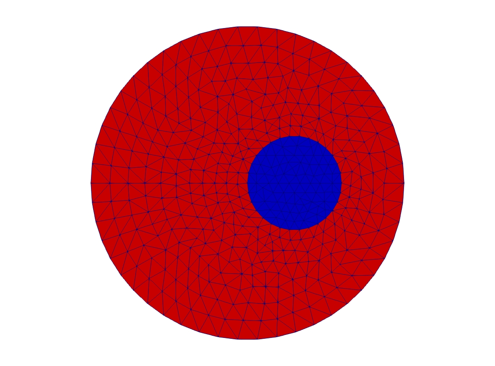
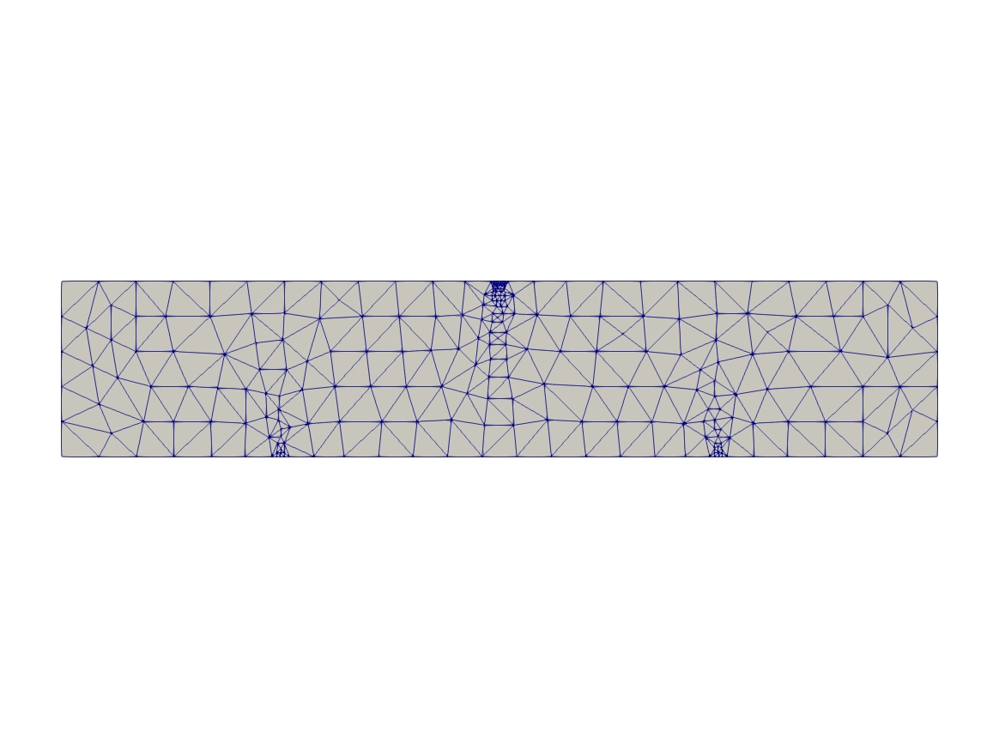
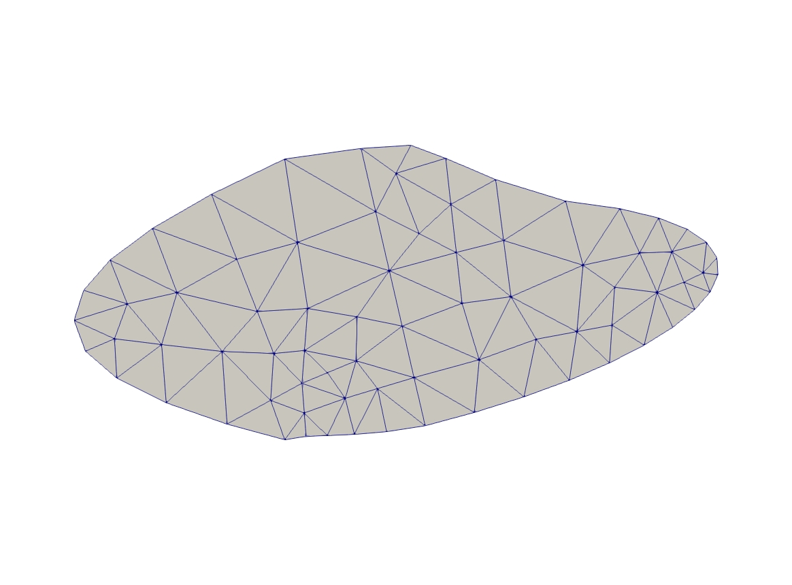
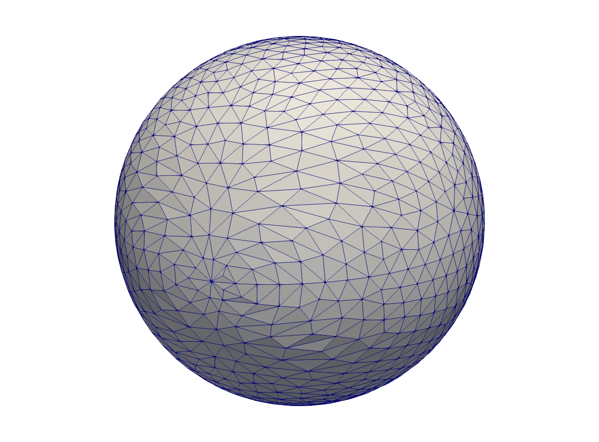
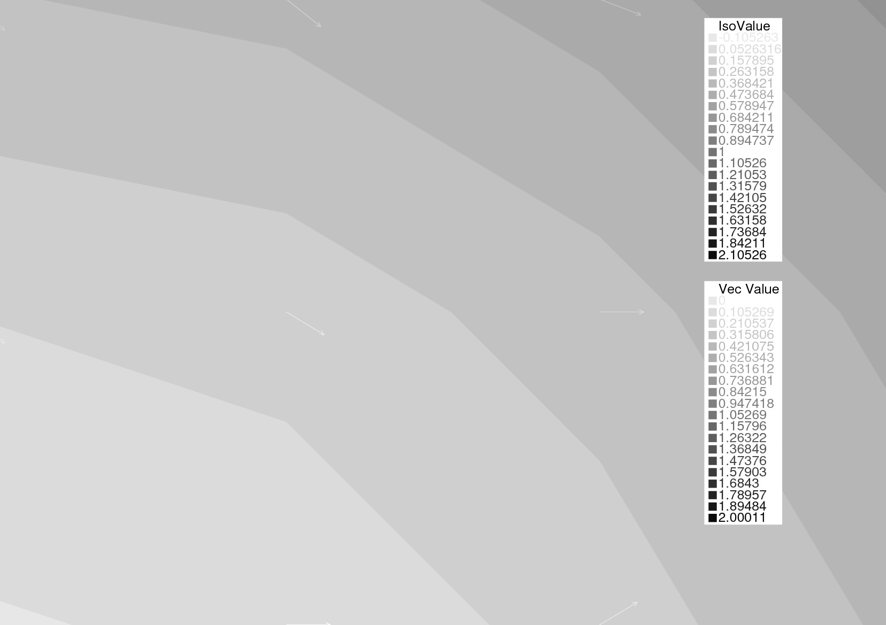
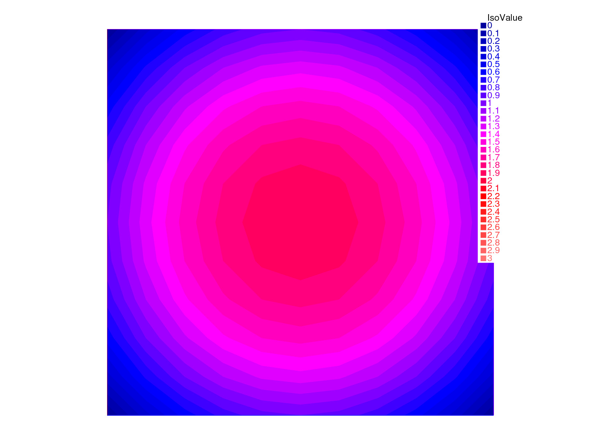
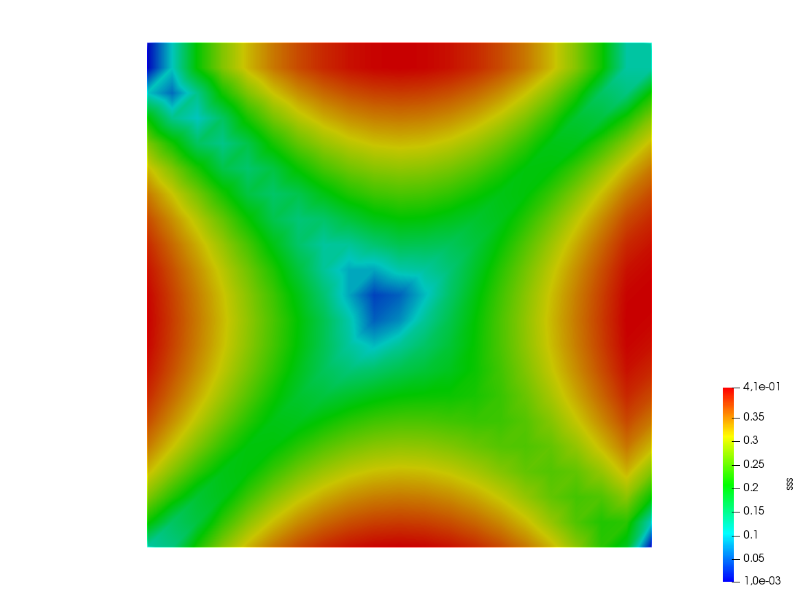
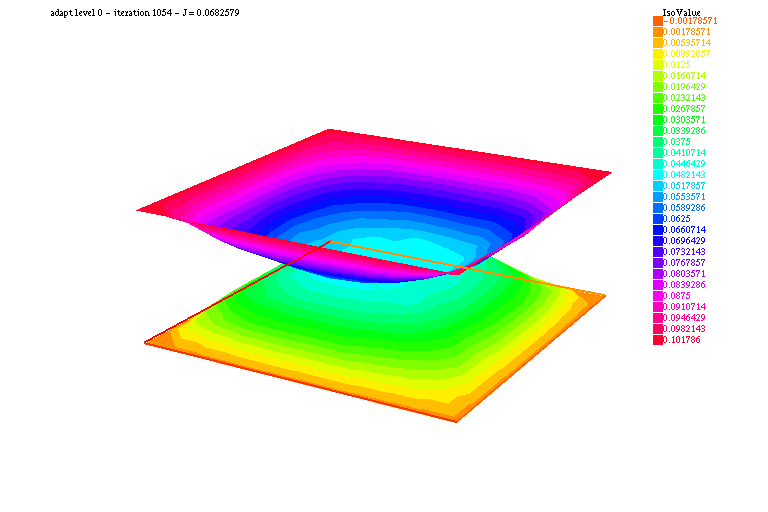
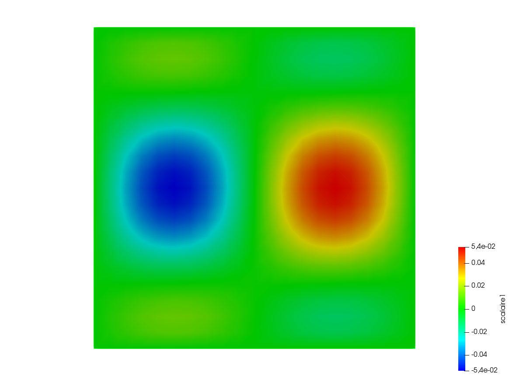

## Poisson's Equation

```freefem
// Parameters
int nn = 20;
real L = 1.;
real H = 1.;
real l = 0.5;
real h = 0.5;

func f = 1.;
func g = 0.;

int NAdapt = 10;

// Mesh
border b1(t=0, L){x=t; y=0;};
border b2(t=0, h){x=L; y=t;};
border b3(t=L, l){x=t; y=h;};
border b4(t=h, H){x=l; y=t;};
border b5(t=l, 0){x=t; y=H;};
border b6(t=H, 0){x=0; y=t;};

mesh Th = buildmesh(b1(nn*L) + b2(nn*h) + b3(nn*(L-l)) + b4(nn*(H-h)) + b5(nn*l) + b6(nn*H));

// Fespace
fespace Vh(Th, P1);	// Change P1 to P2 to test P2 finite element
Vh u, v;

// Macro
macro grad(u) [dx(u), dy(u)] //

// Problem
problem Poisson (u, v, solver=CG, eps=-1.e-6)
	= int2d(Th)(
		  grad(u)' * grad(v)
	)
	+ int2d(Th)(
		  f * v
	)
	+ on(b1, b2, b3, b4, b5, b6, u=g)
	;

// Mesh adaptation iterations
real error = 0.1;
real coef = 0.1^(1./5.);
for (int i = 0; i < NAdapt; i++){
	// Solve
	Poisson;

	// Plot
	plot(Th, u);

	// Adaptmesh
	Th = adaptmesh(Th, u, inquire=1, err=error);
	error = error * coef;
}
```

|Adapted mesh|
|:----:|
||

|Solution on adapted mesh|
|:----:|
||

## Poisson's equation 3D

```freefem
load "tetgen"

// Parameters
real hh = 0.1;
func ue = 2.*x*x + 3.*y*y + 4.*z*z + 5.*x*y + 6.*x*z + 1.;
func f= -18.;

// Mesh
mesh Th = square(10, 20, [x*pi-pi/2, 2*y*pi]); // ]-pi/2, pi/2[X]0,2pi[
func f1 = cos(x)*cos(y);
func f2 = cos(x)*sin(y);
func f3 = sin(x);
func f1x = sin(x)*cos(y);
func f1y = -cos(x)*sin(y);
func f2x = -sin(x)*sin(y);
func f2y = cos(x)*cos(y);
func f3x = cos(x);
func f3y = 0;
func m11 = f1x^2 + f2x^2 + f3x^2;
func m21 = f1x*f1y + f2x*f2y + f3x*f3y;
func m22 = f1y^2 + f2y^2 + f3y^2;
func perio = [[4, y], [2, y], [1, x], [3, x]];
real vv = 1/square(hh);
Th = adaptmesh(Th, m11*vv, m21*vv, m22*vv, IsMetric=1, periodic=perio);
Th = adaptmesh(Th, m11*vv, m21*vv, m22*vv, IsMetric=1, periodic=perio);
plot(Th);

real[int] domain = [0., 0., 0., 1, 0.01];
mesh3 Th3 = tetgtransfo(Th, transfo=[f1, f2, f3], nbofregions=1, regionlist=domain);
plot(Th3);

border cc(t=0, 2*pi){x=cos(t); y=sin(t); label=1;}
mesh Th2 = buildmesh(cc(50));

// Fespace
fespace Vh(Th3, P23d);
Vh u, v;
Vh uhe = ue;
cout << "uhe min: " << uhe[].min << " - max: " << uhe[].max << endl;
cout << uhe(0.,0.,0.) << endl;

fespace Vh2(Th2, P2);
Vh2 u2, u2e;

// Macro
macro Grad3(u) [dx(u), dy(u), dz(u)] //

// Problem
problem Lap3d (u, v, solver=CG)
	= int3d(Th3)(
		  Grad3(v)' * Grad3(u)
	)
	- int3d(Th3)(
		  f * v
	)
	+ on(0, 1, u=ue)
	;

// Solve
Lap3d;
cout << "u min: " << u[]. min << " - max: " << u[].max << endl;

// Error
real err = int3d(Th3)(square(u-ue));
cout << int3d(Th3)(1.) << " = " << Th3.measure << endl;
Vh d = ue - u;
cout << " err = " << err << " - diff l^intfy = " << d[].linfty << endl;

// Plot
u2 = u;
u2e = ue;
plot(u2, wait=true);
plot(u2, u2e,wait=true);
```

|Iso-surfaces of the solution |
|:----:|
||

## Stokes Equation on a cube

```freefem
load "msh3"
load "medit" // Dynamically loaded tools for 3D

// Parameters
int nn = 8;

// Mesh
mesh Th0 = square(nn, nn);
int[int] rup = [0, 2];
int[int] rdown = [0, 1];
int[int] rmid = [1, 1, 2, 1, 3, 1, 4, 1];
real zmin = 0, zmax = 1;
mesh3 Th = buildlayers(Th0, nn, zbound=[zmin, zmax],
	reffacemid=rmid, reffaceup=rup, reffacelow=rdown);

medit("c8x8x8", Th); // 3D mesh visualization with medit

// Fespaces
fespace Vh2(Th0, P2);
Vh2 ux, uz, p2;

fespace VVh(Th, [P2, P2, P2, P1]);
VVh [u1, u2, u3, p];
VVh [v1, v2, v3, q];

// Macro
macro Grad(u) [dx(u), dy(u), dz(u)] //
macro div(u1,u2,u3) (dx(u1) + dy(u2) + dz(u3)) //

// Problem (directly solved)
solve vStokes ([u1, u2, u3, p], [v1, v2, v3, q])
	= int3d(Th, qforder=3)(
		  Grad(u1)' * Grad(v1)
		+ Grad(u2)' * Grad(v2)
		+ Grad(u3)' * Grad(v3)
		- div(u1, u2, u3) * q
		- div(v1, v2, v3) * p
		+ 1e-10 * q * p
	)
	+ on(2, u1=1., u2=0, u3=0)
	+ on(1, u1=0, u2=0, u3=0)
	;

// Plot
plot(p, wait=1, nbiso=5); // 3D visualization of pressure isolines

// See 10 plan of the velocity in 2D
for(int i = 1; i < 10; i++){
	// Cut plane
	real yy = i/10.;
	// 3D to 2D interpolation
	ux = u1(x,yy,y);
	uz = u3(x,yy,y);
	p2 = p(x,yy,y);
	// Plot
	plot([ux, uz], p2, cmm="cut y = "+yy, wait= 1);
}
```

|Solution and associated mesh|
|:----:|
||
||

## Mesh Generation

### Mesh adaptation

```freefem
// Parameters
real eps = 0.0001;
real h = 1;
real hmin = 0.05;
func f = 10.0*x^3 + y^3 + h*atan2(eps, sin(5.0*y)-2.0*x);

// Mesh
mesh Th = square(5, 5, [-1+2*x, -1+2*y]);

// Fespace
fespace Vh(Th,P1);
Vh fh = f;
plot(fh);

// Adaptmesh
for (int i = 0; i < 2; i++){
	Th = adaptmesh(Th, fh);
	fh = f; //old mesh is deleted
	plot(Th, fh, wait=true);
}
```

|Initial mesh|
|:-----:|
||

|Adapted mesh|
|:-----:|
||

### Mesh adaptation for the Poisson's problem

```freefem
// Parameters
real error = 0.1;

// Mesh
border ba(t=0, 1){x=t; y=0; label=1;}
border bb(t=0, 0.5){x=1; y=t; label=1;}
border bc(t=0, 0.5){x=1-t; y=0.5; label=1;}
border bd(t=0.5, 1){x=0.5; y=t; label=1;}
border be(t=0.5, 1){x=1-t; y=1; label=1;}
border bf(t=0, 1){x=0; y=1-t; label=1;}
mesh Th = buildmesh(ba(6) + bb(4) + bc(4) + bd(4) + be(4) + bf(6));

// Fespace
fespace Vh(Th, P1);
Vh u, v;

// Function
func f = 1;

// Problem
problem Poisson(u, v, solver=CG, eps=1.e-6)
	= int2d(Th)(
		  dx(u)*dx(v)
		+ dy(u)*dy(v)
	)
	- int2d(Th)(
		  f*v
	)
	+ on(1, u=0);

// Adaptmesh loop
for (int i = 0; i < 4; i++){
	Poisson;
	Th = adaptmesh(Th, u, err=error);
	error = error/2;
}

// Plot
plot(u);
```

|Initial mesh|
|:-----:|
||

|Adapted mesh|
|:-----:|
||

|Solution on adapted mesh|
|:-----:|
||

### Uniform mesh adaptation

```freefem
mesh Th = square(2, 2); // The initial mesh
plot(Th, wait=true);

Th = adaptmesh(Th, 1./30., IsMetric=1, nbvx=10000);
plot(Th, wait=true);

Th = adaptmesh(Th, 1./30., IsMetric=1, nbvx=10000); // More than one time due to the
Th = adaptmesh(Th, 1./30., IsMetric=1, nbvx=10000); // adaptation bound `maxsubdiv=`
plot(Th, wait=true);
```

|Initial mesh|
|:-----:|
||

|Adapted mesh|
|:-----:|
||

### Borders

```freefem
{
	int upper = 1;
	int others = 2;
	int inner = 3;

	border C01(t=0, 1){x=0; y=-1+t; label=upper;}
	border C02(t=0, 1){x=1.5-1.5*t; y=-1; label=upper;}
	border C03(t=0, 1){x=1.5; y=-t; label=upper;}
	border C04(t=0, 1){x=1+0.5*t; y=0; label=others;}
	border C05(t=0, 1){x=0.5+0.5*t; y=0; label=others;}
	border C06(t=0, 1){x=0.5*t; y=0; label=others;}
	border C11(t=0, 1){x=0.5; y=-0.5*t; label=inner;}
	border C12(t=0, 1){x=0.5+0.5*t; y=-0.5; label=inner;}
	border C13(t=0, 1){x=1; y=-0.5+0.5*t; label=inner;}

	int n = 10;
	plot(C01(-n) + C02(-n) + C03(-n) + C04(-n) + C05(-n)
		+ C06(-n) + C11(n) + C12(n) + C13(n), wait=true);

	mesh Th = buildmesh(C01(-n) + C02(-n) + C03(-n) + C04(-n) + C05(-n)
		+ C06(-n) + C11(n) + C12(n) + C13(n));

	plot(Th, wait=true);

	cout << "Part 1 has region number " << Th(0.75, -0.25).region << endl;
	cout << "Part 2 has redion number " << Th(0.25, -0.25).region << endl;
}

{
	border a(t=0, 2*pi){x=cos(t); y=sin(t); label=1;}
	border b(t=0, 2*pi){x=0.3+0.3*cos(t); y=0.3*sin(t); label=2;}
	plot(a(50) + b(30)); //to see a plot of the border mesh
	mesh Thwithouthole = buildmesh(a(50) + b(30));
	mesh Thwithhole = buildmesh(a(50) + b(-30));
	plot(Thwithouthole);
	plot(Thwithhole);
}

{
	real r=1;
	border a(t=0, 2*pi){x=r*cos(t); y=r*sin(t); label=1;}
	r=0.3;
	border b(t=0, 2*pi){x=r*cos(t); y=r*sin(t); label=1;}
//	mesh Thwithhole = buildmesh(a(50) + b(-30)); // do not do this because the two
		                                         // circles have the same radius = $0.3$
}
```

|Mesh with two regions|
|:-----:|
||

|Mesh without a hole|
|:-----:|
||

|Mesh with a hole|
|:-----:|
||

### Change

```freefem
verbosity=3;

// Mesh
mesh Th1 = square(10, 10);
mesh Th2 = square(20, 10, [x+1, y]);

int[int] r1=[2, 0];
plot(Th1, wait=true);

Th1 = change(Th1, label=r1); // Change edges' label from 2 to 0
plot(Th1, wait=true);

int[int] r2=[4, 0];
Th2 = change(Th2, label=r2); // Change edges' label from 4 to 0
plot(Th2, wait=true);

mesh Th = Th1 + Th2; // 'gluing together' Th1 and Th2 meshes
cout << "nb lab = " << int1d(Th1,1,3,4)(1./lenEdge)+int1d(Th2,1,2,3)(1./lenEdge)
	 << " == " << int1d(Th,1,2,3,4)(1./lenEdge) << " == " << ((10+20)+10)*2 << endl;
plot(Th, wait=true);

fespace Vh(Th, P1);
Vh u, v;

macro Grad(u) [dx(u),dy(u)] // Definition of a macro

solve P(u, v)
	= int2d(Th)(
		  Grad(u)'*Grad(v)
	)
	-int2d(Th)(
		  v
	)
	+ on(1, 3, u=0)
	;

plot(u, wait=1);
```

|Result|
|:-----:|
||

### Cube

```freefem
load "msh3"

int[int] l6 = [37, 42, 45, 40, 25, 57];
int r11 = 11;
mesh3 Th = cube(4, 5, 6, [x*2-1, y*2-1, z*2-1], label=l6, flags =3, region=r11);

cout << "Volume = " << Th.measure << ", border area = " << Th.bordermeasure << endl;

int err = 0;
for(int i = 0; i < 100; ++i){
	real s = int2d(Th,i)(1.);
	real sx = int2d(Th,i)(x);
	real sy = int2d(Th,i)(y);
	real sz = int2d(Th,i)(z);

	if(s){
		int ix = (sx/s+1.5);
		int iy = (sy/s+1.5);
		int iz = (sz/s+1.5);
		int ii = (ix + 4*(iy+1) + 16*(iz+1) );
		//value of ix,iy,iz => face min 0, face max 2, no face 1
		cout << "Label = " << i << ", s = " << s << " " << ix << iy << iz << " : " << ii << endl;
		if( i != ii ) err++;
	}
}
real volr11 = int3d(Th,r11)(1.);
cout << "Volume region = " << 11 << ": " << volr11 << endl;
if((volr11 - Th.measure )>1e-8) err++;
plot(Th, fill=false);
cout << "Nb err = " << err << endl;
assert(err==0);
```

|Cube|
|:-----:|
||

### Empty mesh

```freefem
{
	border a(t=0, 2*pi){x=cos(t); y=sin(t); label=1;}
	mesh Th = buildmesh(a(20));
	Th = emptymesh(Th);
	plot(Th);
}
{
	mesh Th = square(10, 10);
	int[int] ssd(Th.nt);
	// Builds the pseudo region numbering
	for(int i = 0; i < ssd.n; i++){
		int iq = i/2; // Because we have 2 triangles per quad
		int ix = iq%10;
		int iy = iq/10;
		ssd[i] = 1 + (ix>=5) + (iy>=5)*2;
	}
	// Builds an emtpy mesh with all edges that satisfy e=T1 cap T2 and ssd[T1] != ssd[T2]
	Th = emptymesh(Th, ssd);
	// Plot
	plot(Th);
}
```

|Empty square|
|:-----:|
||

|Empty diamond|
|:-----:|
||

### 3 points

```freefem
// Square for Three-Point Bend Specimens fixed on Fix1, Fix2
// It will be loaded on Load
real a = 1, b = 5, c = 0.1;
int n = 5, m = b*n;
border Left(t=0, 2*a){x=-b; y=a-t;}
border Bot1(t=0, b/2-c){x=-b+t; y=-a;}
border Fix1(t=0, 2*c){x=-b/2-c+t; y=-a;}
border Bot2(t=0, b-2*c){x=-b/2+c+t; y=-a;}
border Fix2(t=0, 2*c){x=b/2-c+t; y=-a;}
border Bot3(t=0, b/2-c){x=b/2+c+t; y=-a;}
border Right(t=0, 2*a){x=b; y=-a+t;}
border Top1(t=0, b-c){x=b-t; y=a;}
border Load(t=0, 2*c){x=c-t; y=a;}
border Top2(t=0, b-c){x=-c-t; y=a;}

mesh Th = buildmesh(Left(n) + Bot1(m/4) + Fix1(5) + Bot2(m/2)
	+ Fix2(5) + Bot3(m/4) + Right(n) + Top1(m/2) + Load(10) + Top2(m/2));
plot(Th, bw=true);
```

|3 Points|
|:-----:|
||

### Bezier

```freefem
// A cubic Bezier curve connecting two points with two control points
func real bzi(real p0, real p1, real q1, real q2, real t){
	return p0*(1-t)^3 + q1*3*(1-t)^2*t + q2*3*(1-t)*t^2 + p1*t^3;
}

real[int] p00 = [0, 1], p01 = [0, -1], q00 = [-2, 0.1], q01 = [-2, -0.5];
real[int] p11 = [1,-0.9], q10 = [0.1, -0.95], q11=[0.5, -1];
real[int] p21 = [2, 0.7], q20 = [3, -0.4], q21 = [4, 0.5];
real[int] q30 = [0.5, 1.1], q31 = [1.5, 1.2];
border G1(t=0, 1){
	x=bzi(p00[0], p01[0], q00[0], q01[0], t);
	y=bzi(p00[1], p01[1], q00[1], q01[1], t);
}
border G2(t=0, 1){
	x=bzi(p01[0], p11[0], q10[0], q11[0], t);
	y=bzi(p01[1], p11[1], q10[1], q11[1], t);
}
border G3(t=0, 1){
	x=bzi(p11[0], p21[0], q20[0], q21[0], t);
	y=bzi(p11[1], p21[1], q20[1], q21[1], t);
}
border G4(t=0, 1){
	x=bzi(p21[0], p00[0], q30[0], q31[0], t);
	y=bzi(p21[1], p00[1], q30[1], q31[1], t);
}
int m = 5;
mesh Th = buildmesh(G1(2*m) + G2(m) + G3(3*m) + G4(m));
plot(Th, bw=true);
```

|Bezier|
|:-----:|
||

### Build layer mesh

```freefem
load "msh3"
load "tetgen"
load "medit"

// Parameters
int C1 = 99;
int C2 = 98;

// 2D mesh
border C01(t=0, pi){x=t; y=0; label=1;}
border C02(t=0, 2*pi){ x=pi; y=t; label=1;}
border C03(t=0, pi){ x=pi-t; y=2*pi; label=1;}
border C04(t=0, 2*pi){ x=0; y=2*pi-t; label=1;}

border C11(t=0, 0.7){x=0.5+t; y=2.5; label=C1;}
border C12(t=0, 2){x=1.2; y=2.5+t; label=C1;}
border C13(t=0, 0.7){x=1.2-t; y=4.5; label=C1;}
border C14(t=0, 2){x=0.5; y=4.5-t; label=C1;}

border C21(t=0, 0.7){x=2.3+t; y=2.5; label=C2;}
border C22(t=0, 2){x=3; y=2.5+t; label=C2;}
border C23(t=0, 0.7){x=3-t; y=4.5; label=C2;}
border C24(t=0, 2){x=2.3; y=4.5-t; label=C2;}

mesh Th = buildmesh(C01(10) + C02(10) + C03(10) + C04(10)
	+ C11(5) + C12(5) + C13(5) + C14(5)
	+ C21(-5) + C22(-5) + C23(-5) + C24(-5));

mesh Ths = buildmesh(C01(10) + C02(10) + C03(10) + C04(10)
	+ C11(5) + C12(5) + C13(5) + C14(5));

// Construction of a box with one hole and two regions
func zmin = 0.;
func zmax = 1.;
int MaxLayer = 10;

func XX = x*cos(y);
func YY = x*sin(y);
func ZZ = z;

int[int] r1 = [0, 41], r2 = [98, 98, 99, 99, 1, 56];
int[int] r3 = [4, 12]; // Change upper surface mesh's triangles labels
					   // generated by the 2D mesh's triangles Th
					   // from label 4 to label 12
int[int] r4 = [4, 45]; // Change lower surface mesh's triangles labels
					   // generated by the 2D mesh's triangles Th
					   // from label 4 to label 45

mesh3 Th3 = buildlayers(Th, MaxLayer, zbound=[zmin, zmax], region=r1,
	labelmid=r2, labelup=r3, labeldown=r4);
medit("box 2 regions 1 hole", Th3);

// Construction of a sphere with TetGen
func XX1 = cos(y)*sin(x);
func YY1 = sin(y)*sin(x);
func ZZ1 = cos(x);

real[int] domain = [0., 0., 0., 0, 0.001];
string test = "paACQ";
cout << "test = " << test << endl;
mesh3 Th3sph = tetgtransfo(Ths, transfo=[XX1, YY1, ZZ1],
	switch=test, nbofregions=1, regionlist=domain);
medit("sphere 2 regions", Th3sph);
```

|Box with a hole|
|:-----:|
||

|Sphere|
|:-----:|
||

### Sphere

```freefem
// Parameter
real hh = 0.1;

// Mesh 2D
mesh Th = square(10, 20, [x*pi-pi/2, 2*y*pi]); // ]-pi/2, pi/2[X]0, 2pi[
// A parametrization of a sphere
func f1 = cos(x)*cos(y);
func f2 = cos(x)*sin(y);
func f3 = sin(x);
// Partial derivative of the parametrization DF
func f1x = sin(x)*cos(y);
func f1y = -cos(x)*sin(y);
func f2x = -sin(x)*sin(y);
func f2y = cos(x)*cos(y);
func f3x = cos(x);
func f3y = 0;
//M = DF^t DF
func m11 = f1x^2 + f2x^2 + f3x^2;
func m21 = f1x*f1y + f2x*f2y + f3x*f3y;
func m22 = f1y^2 + f2y^2 + f3y^2;

// Periodic condition
func perio = [[4, y], [2, y], [1, x], [3, x]];

// Mesh adaptation
real vv = 1/square(hh);
Th = adaptmesh(Th, m11*vv, m21*vv, m22*vv, IsMetric=1, inquire=1, periodic=perio);
Th = adaptmesh(Th, m11*vv, m21*vv, m22*vv, IsMetric=1, periodic=perio);
Th = adaptmesh(Th, m11*vv, m21*vv, m22*vv, IsMetric=1, periodic=perio);
Th = adaptmesh(Th, m11*vv, m21*vv, m22*vv, IsMetric=1, periodic=perio);

// Sphere
mesh3 Th3 = movemesh23(Th, transfo=[f1, f2, f3]);
plot(Th3);
```

|Initial mesh|
|:-----:|
||

|Sphere|
|:-----:|
||

## Finite Element

### Periodic 3D

```freefem
load "msh3"
load "medit"

// Parameters
searchMethod=1; // More safe seach algo
real a = 1, d = 0.5, h = 0.5;
int nnb = 7, nni = 10;
int nz = 3;
func zmin = 0;
func zmax = h;

// Mesh 2D
border b1(t=0.5, -0.5){x=a*t; y=-a/2; label=1;}
border b2(t=0.5, -0.5){x=a/2; y=a*t; label=2;}
border b3(t=0.5, -0.5){x=a*t; y=a/2; label=3;}
border b4(t=0.5, -0.5){x=-a/2; y=a*t; label=4;}
border i1(t=0, 2.*pi){x=d/2*cos(t); y=-d/2*sin(t); label=7;}
mesh Th = buildmesh(b1(-nnb) + b3(nnb) + b2(-nnb) + b4(nnb) + i1(nni));

{ // Cleaning the memory correctly
	int[int] old2new(0:Th.nv-1);
	fespace Vh2(Th, P1);
	Vh2 sorder = x + y;
	sort(sorder[], old2new);
	int[int] new2old = old2new^-1; // Inverse permutation
	Th = change(Th, renumv=new2old);
	sorder[] = 0:Th.nv-1;
}
{
	fespace Vh2(Th, P1);
	Vh2 nu;
	nu[] = 0:Th.nv-1;
	plot(nu, cmm="nu=", wait=true);
}

// Mesh 3D
int[int] rup = [0, 5], rlow = [0, 6], rmid = [1, 1, 2, 2, 3, 3, 4, 4, 7, 7], rtet = [0, 41];
mesh3 Th3 = buildlayers(Th, nz, zbound=[zmin, zmax],
	reftet=rtet, reffacemid=rmid, reffaceup=rup, reffacelow=rlow);
for(int i = 1; i <= 6; ++i)
	cout << " int " << i << " : " << int2d(Th3,i)(1.) << " " << int2d(Th3,i)(1./area) << endl;

plot(Th3, wait=true);
medit("Th3", Th3);

fespace Vh(Th3, P2, periodic=[[1, x, z], [3, x, z], [2, y, z], [4, y, z], [5, x, y], [6, x, y]]);
```

|Periodic mesh|
|:-----:|
||

### Lagrange multipliers

```freefem
// Parameters
func f = 1 + x - y;

// Mesh
mesh Th = square(10, 10);

// Fespace
fespace Vh(Th, P1);
int n = Vh.ndof;
int n1 = n+1;
Vh uh, vh;

// Problem
varf va (uh, vh)
	= int2d(Th)(
		  dx(uh)*dx(vh)
		+ dy(uh)*dy(vh)
	)
	;

varf vL (uh, vh) = int2d(Th)(f*vh);
varf vb (uh, vh) = int2d(Th)(1.*vh);

matrix A = va(Vh, Vh);
real[int] b = vL(0, Vh);
real[int] B = vb(0, Vh);

// Block matrix
matrix AA = [ [ A, B ], [ B', 0 ] ];
set(AA, solver=sparsesolver);

real[int] bb(n+1), xx(n+1), b1(1), l(1);
b1 = 0;
// Builds the right hand side block
bb = [b, b1];

// Solve
xx = AA^-1 * bb;

// Set values
[uh[],l] = xx;

// Display
cout << " l = " << l(0) << " , b(u, 1) =" << B'*uh[] << endl;

// Plot
plot(uh);
```

|Result|
|:-----:|
||

## Visualization

### Plot

```freefem
mesh Th = square(5,5);
fespace Vh(Th, P1);

// Plot scalar and vectorial FE function
Vh uh=x*x+y*y, vh=-y^2+x^2;
plot(Th, uh, [uh, vh], value=true, wait=true);

// Zoom on box defined by the two corner points [0.1,0.2] and [0.5,0.6]
plot(uh, [uh, vh], bb=[[0.1, 0.2], [0.5, 0.6]],
	wait=true, grey=true, fill=true, value=true);

// Compute a cut
int n = 10;
real[int] xx(10), yy(10);
for (int i = 0; i < n; i++){
	x = i/real(n);
	y = i/real(n);
	xx[i] = i;
	yy[i] = uh; // Value of uh at point (i/10., i/10.)
}
plot([xx, yy], wait=true);

{ // File for gnuplot
	ofstream gnu("plot.gp");
	for (int i = 0; i < n; i++)
		gnu << xx[i] << " " << yy[i] << endl;
}

// Calls the gnuplot command, waits 5 seconds and generates a postscript plot (UNIX ONLY)
exec("echo 'plot \"plot.gp\" w l \n pause 5 \n set term postscript \n set output \"gnuplot.eps\" \n replot \n quit' | gnuplot");
```

|First plot|
|:-----:|
||

|Second plot|
|:-----:|
||

|Gnuplot|
|:-----:|
||

### HSV

```freefem
// From: http://en.wikipedia.org/wiki/HSV_color_space
// The HSV (Hue, Saturation, Value) model defines a color space
// in terms of three constituent components:
// HSV color space as a color wheel
// Hue, the color type (such as red, blue, or yellow):
// Ranges from 0-360 (but normalized to 0-100% in some applications like here)
// Saturation, the "vibrancy" of the color: Ranges from 0-100%
// The lower the saturation of a color, the more "grayness" is present
// and the more faded the color will appear.
// Value, the brightness of the color: Ranges from 0-100%

mesh Th = square(10, 10, [2*x-1, 2*y-1]);

fespace Vh(Th, P1);
Vh uh=2-x*x-y*y;

real[int] colorhsv=[ // Color hsv model
	4./6., 1 , 0.5, // Dark blue
	4./6., 1 , 1, // Blue
	5./6., 1 , 1, // Magenta
	1, 1. , 1, // Red
	1, 0.5 , 1 // Light red
	];
 real[int] viso(31);

 for (int i = 0; i < viso.n; i++)
	viso[i] = i*0.1;

 plot(uh, viso=viso(0:viso.n-1), value=true, fill=true, wait=true, hsv=colorhsv);
```

|Result|
|:-----:|
||

### Medit

```freefem
load "medit"

mesh Th = square(10, 10, [2*x-1, 2*y-1]);

fespace Vh(Th, P1);
Vh u=2-x*x-y*y;

medit("u", Th, u);

// Old way
savemesh(Th, "u", [x, y, u*.5]); // Saves u.points and u.faces file
// build a u.bb file for medit
{
	ofstream file("u.bb");
	file << "2 1 1 " << u[].n << " 2 \n";
	for (int j = 0; j < u[].n; j++)
		file << u[][j] << endl;
}
// Calls medit command
exec("ffmedit u");
// Cleans files on unix-like OS
exec("rm u.bb u.faces u.points");
```

|2D plot|
|:-----:|
||

|Plot with elevation|
|:-----:|
||

### Paraview

```freefem
load "iovtk"

mesh Th = square(10, 10, [2*x-1, 2*y-1]);

fespace Vh(Th, P1);
Vh u=2-x*x-y*y;

int[int] Order = [1];
string DataName = "u";
savevtk("u.vtu", Th, u, dataname=DataName, order=Order);
```

|Result|
|:-----:|
||

## Algorithms & Optimizations

### Algorithms

```freefem
// Parameters
int nerr = 0;
int debugJ = 0;
int debugdJ = 0;
real umax = 0;

// Algorithms tests
{
	func bool stop (int iter, real[int] u, real[int] g){
		cout << " stop = " << iter << " " << u.linfty << " " << g.linfty << endl;
		return g.linfty < 1e-5 || iter > 15;
	}
	// minimization of J(u) = 1./2 * sum (i+1) u_i^2 - b_i
	real[int] b(10), u(10);

	//J
	func real J (real[int] & u){
		real s = 0;
		for (int i = 0; i < u.n; i++)
			s += (i+1)*u[i]*u[i]*0.5 - b[i]*u[i];
		if (debugJ)
			cout << "J = " << s << ", u = " << u[0] << " " << u[1] << endl;
		return s;
	}

	//the gradiant of J (this is a affine version (the RHS is in)
	func real[int] DJ (real[int] &u){
		for (int i = 0; i < u.n; i++)
			u[i] = (i+1)*u[i];
		if (debugdJ)
			cout << "dJ: u = " << u[0] << " " << u[1] << " " << u[2] << endl;
		u -= b;
		if (debugdJ)
			cout << "dJ-b: u = " << u[0] << " " << u[1] << " " << u[2] << endl;
		return u; //return of global variable ok
	}

	//the gradiant of the bilinear part of J (the RHS is remove)
	func real[int] DJ0 (real[int] &u){
		for (int i = 0 ; i < u.n; i++)
			u[i] = (i+1)*u[i];
		if(debugdJ)
			cout << "dJ0: u =" << u[0] << " " << u[1] << " " << u[2] << endl;
		return u; //return of global variable ok
	}

	//erro calculation
	func real error (real[int] & u, real[int] & b){
		real s = 0;
		for (int i = 0; i < u.n; i++)
			s += abs((i+1)*u[i] - b[i]);
		return s;
	}

	func real[int] matId (real[int] &u){ return u; }

	int verb=5; //verbosity
	b = 1.; //set right hand side
	u = 0.; //set initial gest

	LinearCG(DJ, u, eps=1.e-6, nbiter=20, precon=matId, verbosity=verb);
	cout << "LinearGC (Affine) : J(u) = " << J(u) << ", err = " << error(u, b) << endl;
	nerr += !(error(u,b) < 1e-5);
	if(nerr) cout << "sol: u = " << u[0] << " " << u[1] << " " << u[2] << endl;

	b = 1;
	u = 0;
	LinearCG(DJ, u, eps=1.e-15, nbiter=20, precon=matId, verbosity=verb, stop=stop);
	cout << "LinearGC (Affine with stop) : J(u) = " << J(u) << ", err = " << error(u, b) << endl;
	nerr += !(error(u,b) < 1e-5);
	if(nerr) cout << "sol: u = " << u[0] << " " << u[1] << " " << u[2] << endl;

	b = 1;
	u = 0;
	LinearCG(DJ0, u, b, eps=1.e-6, nbiter=20, precon=matId, verbosity=verb);
	cout << "LinearGC (Linear) : J(u) = " << J(u) << ", err = " << error(u, b) << endl;
	nerr += !(error(u,b) < 1e-5);
	if(nerr) cout << "sol: u = " << u[0] << " " << u[1] << " " << u[2] << endl;


	b = 1;
	u = 0;
	AffineGMRES(DJ, u, eps=1.e-6, nbiter=20, precon=matId, verbosity=verb);
	cout << "AffineGMRES (Affine) : J(u) = " << J(u) << ", err = " << error(u, b) << endl;
	nerr += !(error(u,b) < 1e-5);
	if(nerr) cout << "sol: u = " << u[0] << " " << u[1] << " " << u[2] << endl;

	b=1;
	u=0;
	LinearGMRES(DJ0, u, b, eps=1.e-6, nbiter=20, precon=matId, verbosity=verb);
	cout << "LinearGMRES (Linear) : J(u) = " << J(u) << ", err = " << error(u, b) << endl;
	nerr += !(error(u,b) < 1e-5);
	if(nerr) cout << "sol: u = " << u[0] << " " << u[1] << " " << u[2] << endl;


	b=1;
	u=0;
	NLCG(DJ, u, eps=1.e-6, nbiter=20, precon=matId, verbosity=verb);
	cout << "NLCG: J(u) = " << J(u) << ", err = " << error(u, b) << endl;
	nerr += !(error(u,b) < 1e-5);
	if(nerr) cout << "sol: u =" << u[0] << " " << u[1] << " " << u[2] << endl;


	//warning: BFGS use a full matrix of size nxn (where n=u.n)
	b=1;
	u=2;
	BFGS(J, DJ, u, eps=1.e-6, nbiter=20, nbiterline=20);
	cout << "BFGS: J(u) = " << J(u) << ", err = " << error(u, b) << endl;
	assert(error(u,b) < 1e-5);
	if(nerr) cout << "sol: u =" << u[0] << " " << u[1] << " " << u[2] << endl;

	assert(nerr==0);
}

{ // A real non linear test
	// Parameters
	real a = 0.001;
	real eps = 1e-6;
	//f(u) = a*u + u-ln(1+u), f'(u) = a+ u/(1+u), f''(u) = 1/(1+u)^2
	func real f(real u) { return u*a+u-log(1+u); }
	func real df(real u) { return a+u/(1+u); }
	func real ddf(real u) { return 1/((1+u)*(1+u)); }

	// Mesh
	mesh Th = square(20, 20);

	// Fespace
	fespace Vh(Th, P1);
	Vh b = 1;
	Vh u = 0;

	fespace Ph(Th, P0);
	Ph alpha; //store df(|nabla u|^2)

	// The functionnal J
	//J(u) = 1/2 int_Omega f(|nabla u|^2) - int_Omega u b
	func real J (real[int] & u){
		Vh w;
		w[] = u;
		real r = int2d(Th)(0.5*f(dx(w)*dx(w) + dy(w)*dy(w)) - b*w);
		cout << "J(u) = " << r << " " << u.min << " " << u.max << endl;
		return r;
	}

	// The gradiant of J
	func real[int] dJ (real[int] & u){
		Vh w;
		w[] = u;
		alpha = df(dx(w)*dx(w) + dy(w)*dy(w));
		varf au (uh, vh)
			= int2d(Th)(
				  alpha*(dx(w)*dx(vh) + dy(w)*dy(vh))
				- b*vh
			)
			+ on(1, 2, 3, 4, uh=0)
			;

		u = au(0, Vh);
		return u; //warning: no return of local array
	}

	// Problem
	alpha = df(dx(u)*dx(u) + dy(u)*dy(u));
	varf alap (uh, vh)
		= int2d(Th)(
			  alpha*(dx(uh)*dx(vh) + dy(uh)*dy(vh))
		)
		+ on(1, 2, 3, 4, uh=0)
		;

	varf amass(uh, vh)
		= int2d(Th)(
			  uh*vh
		)
		+ on(1, 2, 3, 4, uh=0)
		;

	matrix Amass = amass(Vh, Vh, solver=CG);
	matrix Alap= alap(Vh, Vh, solver=Cholesky, factorize=1);

	// Preconditionner
	func real[int] C(real[int] & u){
		real[int] w = u;
		u = Alap^-1*w;
		return u; //warning: no return of local array variable
	}

	// Solve
	int conv=0;
	for(int i = 0; i < 20; i++){
		conv = NLCG(dJ, u[], nbiter=10, precon=C, veps=eps, verbosity=5);
		if (conv) break;

		alpha = df(dx(u)*dx(u) + dy(u)*dy(u));
		Alap = alap(Vh, Vh, solver=Cholesky, factorize=1);
		cout << "Restart with new preconditionner " << conv << ", eps =" << eps << endl;
	}

	// Plot
	plot (u, wait=true, cmm="solution with NLCG");
	umax = u[].max;

	Vh sss= df(dx(u)*dx(u) + dy(u)*dy(u));
	plot (sss, fill=true, value=true);
}

assert(nerr==0);
```

|Result `u`|
|:--------:|
||

|`df(dx(u)*dx(u) + dy(u)*dy(u))`|
|:-----------------------------:|
||

### CMAES variational inequality

```freefem
load "ff-cmaes"

// Parameters
int NN = 7;
func f1 = 1.;
func f2 = -1.;
func g1 = 0.;
func g2 = 0.1;
int iter = 0;
int nadapt = 1;
real starttol = 1e-10;
real bctol = 6.e-12;
real pena = 1000.;

// Mesh
mesh Th = square(NN, NN);

// Fespace
fespace Vh(Th, P1);
Vh ou1, ou2;

// Mesh adaptation loops
for (int al = 0; al < nadapt; ++al){
	// Problem
	varf BVF (v, w)
		= int2d(Th)(
			  0.5*dx(v)*dx(w)
			+ 0.5*dy(v)*dy(w)
		)
		;
	varf LVF1 (v, w) = int2d(Th)(f1*w);
	varf LVF2 (v, w) = int2d(Th)(f2*w);

	matrix A =  BVF(Vh, Vh);
	real[int] b1 = LVF1(0, Vh);
	real[int] b2 = LVF2(0, Vh);

	varf Vbord (v, w) = on(1, 2, 3, 4, v=1);

	Vh In, Bord;
	Bord[] = Vbord(0, Vh, tgv=1);
	In[] = Bord[] ? 0:1;
	Vh gh1 = Bord*g1;
	Vh gh2 = Bord*g2;

	// Function which creates a vector of the search space type from
	// two finite element functions
	func int FEFToSSP (real[int] &fef1, real[int] &fef2, real[int] &ssp){
		int kX = 0;
		for (int i = 0; i < Vh.ndof; ++i){
			if (In[][i]){
				ssp[kX] = fef1[i];
				ssp[kX+In[].sum] = fef2[i];
				++kX;
			}
		}
		return 1;
	}

	// Splits a vector from the search space and fills
	// two finite element functions with it
	func int SSPToFEF (real[int] &fef1, real[int] &fef2, real[int] &ssp){
		int kX = 0;
		for (int i = 0; i < Vh.ndof; ++i){
			if (In[][i]){
				fef1[i] = ssp[kX];
				fef2[i] = ssp[kX+In[].sum];
				++kX;
			}
			else{
				fef1[i] = gh1[][i];
				fef2[i] = gh2[][i];
			}
		}
		return 1;
	}

	func real IneqC (real[int] &X){
		real[int] constraints(In[].sum);
		for (int i = 0; i < In[].sum; ++i){
			constraints[i] = X[i] - X[i+In[].sum];
			constraints[i] = constraints[i] <= 0 ? 0. : constraints[i];
		}
		return constraints.l2;
	}

	func real J (real[int] &X){
		Vh u1, u2;
		SSPToFEF(u1[], u2[], X);
		iter++;
		real[int] Au1 = A*u1[], Au2 = A*u2[];
		Au1 -= b1;
		Au2 -= b2;
		real val = u1[]'*Au1 + u2[]'*Au2;
		val +=  pena * IneqC(X);
		if (iter%200 == 199)
			plot(u1, u2, nbiso=30, fill=1, dim=3, cmm="adapt level "+al+" - iteration "+iter+" - J = "+val, value=1);
		return val ;
	}

	// Solve
	real[int] start(2*In[].sum);

	if (al == 0){
		start(0:In[].sum-1) = 0.;
		start(In[].sum:2*In[].sum-1) = 0.1;
	}
	else
		FEFToSSP(ou1[], ou2[], start);

	real mini = cmaes(J, start, stopMaxFunEval=10000*(al+1), stopTolX=1.e-3/(10*(al+1)), initialStdDev=(0.025/(pow(100.,al))));
	Vh best1, best2;
	SSPToFEF(best1[], best2[], start);

	// Mesh adaptation
	Th = adaptmesh(Th, best1, best2);
	ou1 = best1;
	ou2 = best2;
}
```

|Results|
|:-----:|
||

### IPOPT minimal surface & volume

```freefem
load "msh3";
load "medit";
load "ff-Ipopt";

// Parameters
int nadapt = 3;
real alpha = 0.9;
int np = 30;
real regtest;
int shapeswitch = 1;
real sigma = 2*pi/40.;
real treshold = 0.1;
real e = 0.1;
real r0 = 0.25;
real rr = 2-r0;
real E = 1./(e*e);
real RR = 1./(rr*rr);

// Mesh
mesh Th = square(2*np, np, [2*pi*x, pi*y]);

// Fespace
fespace Vh(Th, P1, periodic=[[2, y], [4, y]]);
//Initial shape definition
//outside of the mesh adaptation loop to initialize with the previous optimial shape found on further iterations
Vh startshape = 5;
Vh uz = 1., lz = 1.;

// Mesh adaptation loop
real[int] lm = [1];
for(int kkk = 0; kkk < nadapt; ++kkk){
	int iter=0;
	func sin2 = square(sin(y));

	// A function which transform Th in 3d mesh (r=rho)
	//a point (theta,phi) of Th becomes ( r(theta,phi)*cos(theta)*sin(phi) , r(theta,phi)*sin(theta)*sin(phi) , r(theta,phi)*cos(phi) )
	//then displays the resulting mesh with medit
	func int Plot3D (real[int] &rho, string cmm, bool ffplot){
		Vh rhoo;
		rhoo[] = rho;
		//mesh sTh = square(np, np/2, [2*pi*x, pi*y]);
		//fespace sVh(sTh, P1);
		//Vh rhoplot = rhoo;
		try{
			mesh3 Sphere = movemesh23(Th, transfo=[rhoo(x,y)*cos(x)*sin(y), rhoo(x,y)*sin(x)*sin(y), rhoo(x,y)*cos(y)]);
			if(ffplot)
				plot(Sphere);
			else
				medit(cmm, Sphere);
		}
		catch(...){
			cout << "PLOT ERROR" << endl;
		}
		return 1;
	}

	// Surface computation
	//Maybe is it possible to use movemesh23 to have the surface function less complicated
	//However, it would not simplify the gradient and the hessian
	func real Area (real[int] &X){
		Vh rho;
		rho[] = X;
		Vh rho2 = square(rho);
		Vh rho4 = square(rho2);
		real res = int2d(Th)(sqrt(rho4*sin2 + rho2*square(dx(rho)) + rho2*sin2*square(dy(rho))));
		++iter;
		if(1)
			plot(rho, value=true, fill=true, cmm="rho(theta,phi) on [0,2pi]x[0,pi] - S="+res, dim=3);
		else
			Plot3D(rho[], "shape_evolution", 1);
		return res;
	}

	func real[int] GradArea (real[int] &X){
		Vh rho, rho2;
		rho[] = X;
		rho2[] = square(X);
		Vh sqrtPsi, alpha;
		{
			Vh dxrho2 = dx(rho)*dx(rho), dyrho2 = dy(rho)*dy(rho);
			sqrtPsi = sqrt(rho2*rho2*sin2 + rho2*dxrho2 + rho2*dyrho2*sin2);
			alpha = 2.*rho2*rho*sin2 + rho*dxrho2 + rho*dyrho2*sin2;
		}
		varf dArea (u, v)
			= int2d(Th)(
				1./sqrtPsi * (alpha*v + rho2*dx(rho)*dx(v) + rho2*dy(rho)*sin2*dy(v))
			)
			;

		real[int] grad = dArea(0, Vh);
		return grad;
	}

	matrix hessianA;
	func matrix HessianArea (real[int] &X){
		Vh rho, rho2;
		rho[] = X;
		rho2 = square(rho);
		Vh sqrtPsi, sqrtPsi3, C00, C01, C02, C11, C12, C22, A;
		{
			Vh C0, C1, C2;
			Vh dxrho2 = dx(rho)*dx(rho), dyrho2 = dy(rho)*dy(rho);
			sqrtPsi = sqrt( rho2*rho2*sin2 + rho2*dxrho2 + rho2*dyrho2*sin2);
			sqrtPsi3 = (rho2*rho2*sin2 + rho2*dxrho2 + rho2*dyrho2*sin2)*sqrtPsi;
			C0 = 2*rho2*rho*sin2 + rho*dxrho2 + rho*dyrho2*sin2;
			C1 = rho2*dx(rho);
			C2 = rho2*sin2*dy(rho);
			C00 = square(C0);
			C01 = C0*C1;
			C02 = C0*C2;
			C11 = square(C1);
			C12 = C1*C2;
			C22 = square(C2);
			A = 6.*rho2*sin2 + dxrho2 + dyrho2*sin2;
		}
		varf d2Area (w, v)
			=int2d(Th)(
				1./sqrtPsi * (
					  A*w*v
					+ 2*rho*dx(rho)*dx(w)*v
					+ 2*rho*dx(rho)*w*dx(v)
					+ 2*rho*dy(rho)*sin2*dy(w)*v
					+ 2*rho*dy(rho)*sin2*w*dy(v)
					+ rho2*dx(w)*dx(v)
					+ rho2*sin2*dy(w)*dy(v)
				)
				+ 1./sqrtPsi3 * (
					  C00*w*v
					+ C01*dx(w)*v
					+ C01*w*dx(v)
					+ C02*dy(w)*v
					+ C02*w*dy(v)
					+ C11*dx(w)*dx(v)
					+ C12*dx(w)*dy(v)
					+ C12*dy(w)*dx(v)
					+ C22*dy(w)*dy(v)
				)
			)
			;
		hessianA = d2Area(Vh, Vh);
		return hessianA;
	}

	// Volume computation
	func real Volume (real[int] &X){
		Vh rho;
		rho[] = X;
		Vh rho3 = rho*rho*rho;
		real res = 1./3.*int2d(Th)(rho3*sin(y));
		return res;
	}

	func real[int] GradVolume (real[int] &X){
		Vh rho;
		rho[] = X;
		varf dVolume(u, v) = int2d(Th)(rho*rho*sin(y)*v);
		real[int] grad = dVolume(0, Vh);
		return grad;
	}
	matrix hessianV;
	func matrix HessianVolume(real[int] &X){
		Vh rho;
		rho[] = X;
		varf d2Volume(w, v) = int2d(Th)(2*rho*sin(y)*v*w);
		hessianV = d2Volume(Vh, Vh);
		return hessianV;
	}

	//if we want to use the volume as a constraint function
	//we must wrap it in some freefem functions returning the appropriate type
	//The lagrangian hessian also have to be wrapped since the Volume is not linear with
	//respect to rho, it will constribbute to the hessian.
	func real[int] ipVolume (real[int] &X){ real[int] vol = [Volume(X)]; return vol; }
	matrix mdV;
	func matrix ipGradVolume (real[int] &X) { real[int,int] dvol(1,Vh.ndof); dvol(0,:) = GradVolume(X); mdV = dvol; return mdV; }
	matrix HLagrangian;
	func matrix ipHessianLag (real[int] &X, real objfact, real[int] &lambda){
		HLagrangian = objfact*HessianArea(X) + lambda[0]*HessianVolume(X);
		return HLagrangian;
	}

	//building struct for GradVolume
	int[int] gvi(Vh.ndof), gvj=0:Vh.ndof-1;
	gvi = 0;

	Vh rc = startshape; //the starting value
	Vh ub = 1.e19; //bounds definition
	Vh lb = 0;

	func real Gaussian (real X, real Y, real theta, real phi){
		real deltax2 = square((X-theta)*sin(Y)), deltay2 = square(Y-phi);
		return exp(-0.5 * (deltax2 + deltay2) / (sigma*sigma));
	}

	func disc1 = sqrt(1./(RR+(E-RR)*cos(y)*cos(y)))*(1+0.1*cos(7*x));
	func disc2 = sqrt(1./(RR+(E-RR)*cos(x)*cos(x)*sin2));

	if(1){
		lb = r0;
		for (int q = 0; q < 5; ++q){
			func f = rr*Gaussian(x, y, 2*q*pi/5., pi/3.);
			func g = rr*Gaussian(x, y, 2*q*pi/5.+pi/5., 2.*pi/3.);
			lb = max(max(lb, f), g);
		}
		lb = max(lb, rr*Gaussian(x, y, 2*pi, pi/3));
	}
	lb = max(lb, max(disc1, disc2));
	real Vobj = Volume(lb[]);
	real Vnvc = 4./3.*pi*pow(lb[].linfty,3);

	if(1)
		Plot3D(lb[], "object_inside", 1);
	real[int] clb = 0., cub = [(1-alpha)*Vobj + alpha*Vnvc];

	// Call IPOPT
	int res = IPOPT(Area, GradArea, ipHessianLag, ipVolume, ipGradVolume,
			rc[], ub=ub[], lb=lb[], clb=clb, cub=cub, checkindex=1, maxiter=kkk<nadapt-1 ? 40:150,
			warmstart=kkk, lm=lm, uz=uz[], lz=lz[], tol=0.00001, structjacc=[gvi,gvj]);
	cout << "IPOPT: res =" << res << endl ;

	// Plot
	Plot3D(rc[], "Shape_at_"+kkk, 1);
	Plot3D(GradArea(rc[]), "ShapeGradient", 1);

	// Mesh adaptation
	if (kkk < nadapt-1){
		Th = adaptmesh(Th, rc*cos(x)*sin(y), rc*sin(x)*sin(y), rc*cos(y),
			nbvx=50000, periodic=[[2, y], [4, y]]);
		plot(Th, wait=true);
		startshape = rc;
		uz = uz;
		lz = lz;
	}

	regtest = rc[]'*rc[];
}
```

|Mesh|
|:----:|
||

### CMAES MPI variational inequality

Command:
```bash
ff-mpirun -np 4 CMAESMPIVariationalInequality.edp -glut ffglut
```

```freefem
load "mpi-cmaes"

// Parameters
int NN = 10;
func f1 = 1.;
func f2 = -1.;
func g1 = 0.;
func g2 = 0.1;
int iter = 0;
int nadapt = 1;
real starttol = 1e-10;
real bctol = 6.e-12;
real pena = 1000;

// Mesh
mesh Th = square(NN, NN);

// Fespace
fespace Vh(Th, P1);
Vh ou1, ou2;

// Mehs adaptation loop
for (int al = 0; al < nadapt; ++al){
	// Problem
	varf BVF (v, w)
		= int2d(Th)(
			  0.5*dx(v)*dx(w)
			+ 0.5*dy(v)*dy(w)
		)
		;
	varf LVF1 (v, w) = int2d(Th)(f1*w);
	varf LVF2 (v, w) = int2d(Th)(f2*w);
	matrix A = BVF(Vh, Vh);
	real[int] b1 = LVF1(0, Vh);
	real[int] b2 = LVF2(0, Vh);

	varf Vbord (v, w) = on(1, 2, 3, 4, v=1);

	Vh In, Bord;
	Bord[] = Vbord(0, Vh, tgv=1);
	In[] = Bord[] ? 0:1;
	Vh gh1 = Bord*g1, gh2 = Bord*g2;

	//Function which create a vector of the search space type from
	//two finite element functions
	func int FEFToSSP (real[int] &fef1, real[int] &fef2, real[int] &ssp){
		int kX = 0;
		for (int i = 0; i < Vh.ndof; ++i){
			if (In[][i]){
				ssp[kX] = fef1[i];
				ssp[kX+In[].sum] = fef2[i];
				++kX;
			}
		}
		return 1;
	}

	//Function spliting a vector from the search space and fills
	//two finite element functions with it
	func int SSPToFEF (real[int] &fef1, real[int] &fef2, real[int] &ssp){
		int kX = 0;
		for (int i = 0; i < Vh.ndof; ++i){
			if (In[][i]){
				fef1[i] = ssp[kX];
				fef2[i] = ssp[kX+In[].sum];
				++kX;
			}
			else{
				fef1[i] = gh1[][i];
				fef2[i] = gh2[][i];
			}
		}
		return 1;
	}

	func real IneqC (real[int] &X){
		real[int] constraints(In[].sum);
		for (int i = 0; i < In[].sum; ++i){
			constraints[i] = X[i] - X[i+In[].sum];
			constraints[i] = constraints[i] <= 0 ? 0. : constraints[i];
		}
		return constraints.l2;
	}

	func real J (real[int] &X){
		Vh u1, u2;
		SSPToFEF(u1[], u2[], X);
		iter++;
		real[int] Au1 = A*u1[], Au2 = A*u2[];
		Au1 -= b1;
		Au2 -= b2;
		real val = u1[]'*Au1 + u2[]'*Au2;
		val +=  pena * IneqC(X);
		plot(u1, u2, nbiso=30, fill=1, dim=3, cmm="adapt level "+al+" - iteration "+iter+" - J = "+val, value=1);
		return val ;
	}

	// Solve
	real[int] start(2*In[].sum);

	if (al==0){
		start(0:In[].sum-1) = 0.;
		start(In[].sum:2*In[].sum-1) = 0.1;
	}
	else
		FEFToSSP(ou1[], ou2[], start);

	real mini = cmaesMPI(J, start, stopMaxFunEval=10000*(al+1), stopTolX=1.e-4/(10*(al+1)), initialStdDev=(0.025/(pow(100.,al))));
	Vh best1, best2;
	SSPToFEF(best1[], best2[], start);

	// Mesh adaptation
	Th = adaptmesh(Th, best1, best2);
	ou1 = best1;
	ou2 = best2;
}
```

|Result|
|:----:|
||

## Parallelization

### MPI-GMRES 2D

To launch this script, use for example:
```bash
ff-mpirun -np 12 MPIGMRES2D.edp -d 1 -k 1 -gmres 2 -n 50
```

```freefem
//usage :
//ff-mpirun [mpi parameter] MPIGMRES2d.edp [-glut ffglut] [-n N] [-k K] [-d D] [-ns] [-gmres [0|1]
//arguments:
//-glut ffglut : to see graphicaly the process
//-n N: set the mesh cube split NxNxN
//-d D: set debug flag D must be one for mpiplot
//-k K: to refined by K all element
//-ns: remove script dump
//-gmres
//0: use iterative schwarz algo.
//1: Algo GMRES on residu of schwarz algo
//2: DDM GMRES
//3: DDM GMRES with coarse grid preconditionner (Good one)

load "MPICG"
load "medit"
load "metis"
include "getARGV.idp"
include "MPIplot.idp"
include "MPIGMRESmacro.idp"

searchMethod = 0; //more safe seach algo (warning can be very expensive in case of lot of ouside point)
assert(version >= 3.11); //need at least v3.11
real[int] ttt(10);
int ittt=0;
macro settt {ttt[ittt++] = mpiWtime();}//

// Arguments
verbosity = getARGV("-vv", 0);
int vdebug = getARGV("-d", 1);
int ksplit = getARGV("-k", 3);
int nloc = getARGV("-n", 10);
string sff = getARGV("-p", "");
int gmres = getARGV("-gmres", 2);
bool dplot = getARGV("-dp", 0);
int nC = getARGV("-N", max(nloc/10, 4));

if (mpirank==0 && verbosity){
	cout << "ARGV: ";
	for (int i = 0; i < ARGV.n; ++i)
		cout << ARGV[i] << " ";
	cout << endl;
}

if(mpirank==0 && verbosity)
cout << " vdebug: " << vdebug << ", kspilt "<< ksplit << ", nloc "<< nloc << ", sff "<< sff << "." << endl;

// Parameters
int withplot = 0;
bool withmetis = 1;
bool RAS = 1;
string sPk = "P2-2gd";
func Pk = P2;
int sizeoverlaps = 1; //size of overlap
int[int] l111 = [1, 1, 1, 1]; //mesh labels

// MPI function
func bool plotMPIall(mesh &Th, real[int] &u, string cm){
	if(vdebug)
		PLOTMPIALL(mesh, Pk, Th, u, {cmm=cm, nbiso=20, fill=1, dim=3, value=1});
	return 1;
}

// MPI
mpiComm comm(mpiCommWorld,0,0); //trick : make a no split mpiWorld

int npart = mpiSize(comm); //total number of partion
int ipart = mpiRank(comm); //current partition number

int njpart = 0; //Number of part with intersection (a jpart) with ipart without ipart
int[int] jpart(npart); //list of jpart
if(ipart==0)
	cout << " Final N = " << ksplit*nloc << ", nloc = " << nloc << ", split = " << ksplit << endl;
settt

// Mesh
mesh Thg = square(nloc, nloc, label=l111);
mesh ThC = square(nC, nC, label=l111);// Coarse mesh

mesh Thi, Thin; //with overlap, without olverlap

// Fespace
fespace Phg(Thg, P0);
Phg part;

fespace Vhg(Thg, P1);
Vhg unssd; //boolean function: 1 in the subdomain, 0 elswhere

fespace VhC(ThC, P1); // of the coarse problem

// Partitioning
{
	int[int] nupart(Thg.nt);
	nupart = 0;
	if (npart > 1 && ipart == 0)
		metisdual(nupart, Thg, npart);

	broadcast(processor(0, comm), nupart);
	for(int i = 0; i < nupart.n; ++i)
		part[][i] = nupart[i];
}

if (withplot > 1)
	plot(part, fill=1, cmm="dual", wait=1);

// Overlapping partition
Phg suppi = abs(part-ipart) < 0.1;

Thin = trunc(Thg, suppi>0, label=10); // non-overlapping mesh, interfaces have label 10
int nnn = sizeoverlaps*2;// to be sure
AddLayers(Thg, suppi[], nnn, unssd[]); //see above! suppi and unssd are modified
unssd[] *= nnn; //to put value nnn a 0
real nnn0 = nnn - sizeoverlaps + 0.001;
Thi = trunc(Thg, unssd>nnn0, label=10); //overlapping mesh, interfaces have label 10

settt

// Fespace
fespace Vhi(Thi,P1);
int npij = npart;
Vhi[int] pij(npij); //local partition of unit + pii
Vhi pii;

real nnn1 = +0.001;
{
	/*
	construction of the partition of the unit,
	let phi_i P1 FE function 1 on Thin and zero ouside of Thi and positive
	the partition is build with
	p_i = phi_i/ \sum phi_i

	to build the partition of one domain i
	we nned to find all j such that supp(phi_j) \cap supp(phi_j) is not empty
	<=> int phi_j
	*/
	//build a local mesh of thii such that all computation of the unit partition are
	//exact in thii
	mesh Thii = trunc(Thg, unssd>nnn1, label=10); //overlapping mesh, interfaces have label 10

	{
		//find all j mes (supp(p_j) cap supp(p_i)) >0
		//compute all phi_j on Thii
		//remark: supp p_i include in Thi

		// Fespace
		fespace Phii(Thii, P0);
		fespace Vhii(Thii, P1);
		Vhi sumphi = 0;
		Vhii phii = 0;

		jpart = 0;
		njpart = 0;
		int nlayer = RAS ? 1 : sizeoverlaps;
		if (ipart == 0)
			cout << "nlayer = " << nlayer << endl;
		pii = max(unssd-nnn+nlayer, 0.)/nlayer;
		if(dplot)
			plot(pii, wait=1, cmm=" 0000");
		sumphi[] += pii[];
		if(dplot)
			plot(sumphi, wait=1, cmm=" summ 0000");

		real epsmes = 1e-10*Thii.area;
		for (int i = 0; i < npart; ++i)
			if (i != ipart){
			Phii suppii = abs(i-part) < 0.2;
			if (suppii[].max > 0.5){
				AddLayers(Thii, suppii[], nlayer, phii[]);
				assert(phii[].min >= 0);
				real interij = int2d(Thi)(phii);
				if (interij > epsmes){
					pij[njpart] = abs(phii);
					if(vdebug > 2)
						cout << " ***** " << int2d(Thi)(real(pij[njpart])<0) << " " <<pij[njpart][].min << " " << phii[].min << endl;
					assert(int2d(Thi)(real(pij[njpart]) < 0) == 0);
					if(dplot)
						plot(pij[njpart], wait=1, cmm=" j = "+ i + " " + njpart);
					sumphi[] += pij[njpart][];
					if(dplot)
						plot(sumphi, wait=1, cmm=" sum j = "+ i + " " + njpart);
					jpart[njpart++] = i;
				}
			}
		}

		if(dplot)
			plot(sumphi, wait=1, dim=3, cmm="sum ", fill=1);
		pii[] = pii[] ./ sumphi[];
		for (int j = 0; j < njpart; ++j)
			pij[j][] = pij[j][] ./ sumphi[];
		jpart.resize(njpart);
		for (int j = 0; j < njpart; ++j)
			assert(pij[j][].max <= 1);
		{
			cout << ipart << " number of jpart " << njpart << " : ";
			for (int j = 0; j < njpart; ++j)
				cout << jpart[j] << " ";
			cout << endl;
		}
		sumphi[] = pii[];
		for (int j = 0; j < njpart; ++j)
			sumphi[] += pij[j][];
		if(vdebug > 2)
			cout << "sum min " << sumphi[].min << " " << sumphi[].max << endl;
		assert(sumphi[].min > 1.-1e-6 && sumphi[].max < 1.+1e-6);
	}
} //Thii is remove here
// end of the construction of the local partition of the unity ...
// on Thi
if (ipart == 0)
	cout << "End build partition" << endl;

// Computation of number of intersection
//here pii and the pij is the local partition of the unit on
//Thi (mesh with overlap)
if ( dplot){
	plot(Thi, wait=1);
	for(int j = 0; j < njpart; ++j)
		plot(pij[j], cmm=" j="+j, wait=1);
}

//Partition of the unity on Thi
//computation of message
//all j > we have to receive
//data on intersection of the support of pij[0] and pij[j]
settt

if(vdebug)
	plotMPIall(Thi, pii[], "pi_i");

mesh[int] aThij(njpart);
matrix Pii;
matrix[int] sMj(njpart); //M of send to j
matrix[int] rMj(njpart); //M to recv from j
fespace Whi(Thi, Pk);
mesh Thij = Thi;
fespace Whij(Thij, Pk);//

//construction of the mesh intersect i,j part
for(int jp = 0; jp < njpart; ++jp)
	aThij[jp] = trunc(Thi, pij[jp] > 1e-6, label=10); //mesh of the supp of pij

for(int jp = 0; jp < njpart; ++jp)
	aThij[jp] = trunc(aThij[jp], 1, split=ksplit);

Thi = trunc(Thi, 1, split=ksplit);

settt

if (ipart == 0)
	cout << "End build mesh intersection" << endl;

// Construction of transfert matrix
{
	Whi wpii = pii;
	Pii = wpii[];
	for(int jp = 0; jp < njpart; ++jp){
		int j = jpart[jp];
		Thij = aThij[jp];
		matrix I = interpolate(Whij, Whi); //Whji <- Whi
		sMj[jp] = I*Pii; //Whi -> s Whij
		rMj[jp] = interpolate(Whij, Whi, t=1); //Whji -> Whi
		if(vdebug > 10){
			{Whi uuu=1; Whij vvv=-1; vvv[]+=I*uuu[]; cout << jp << " %%% " << vvv[].linfty << endl; assert(vvv[].linfty < 1e-6);}
			{Whi uuu=1; Whij vvv=-1; vvv[]+=rMj[jp]'*uuu[]; cout << jp << " ### " << vvv[].linfty << endl; assert(vvv[].linfty < 1e-6);}
		}
	}
}
if (ipart == 0)
	cout << "End build transfert matrix" << endl;

// Allocate array of send and recv data
InitU(njpart, Whij, Thij, aThij, Usend) //initU(n, Vh, Th, aTh, U)
InitU(njpart, Whij, Thij, aThij, Vrecv)
if (ipart == 0)
	cout << "End init data for send/revc" << endl;

Whi ui, vi;

func bool Update(real[int] &ui, real[int] &vi){
	for(int j = 0; j < njpart; ++j)
		Usend[j][] = sMj[j]*ui;
	SendRecvUV(comm, jpart, Usend, Vrecv)
	vi = Pii*ui;
	for(int j = 0; j < njpart; ++j)
		vi += rMj[j]*Vrecv[j][];
	return true;
}

// Definition of the Problem
func G = x*0.1;
func F = 1.;
macro grad(u) [dx(u),dy(u)] //
varf vBC (U, V) = on(1, U=G);
varf vPb (U, V) = int2d(Thi)(grad(U)'*grad(V)) + int2d(Thi)(F*V) + on(10, U=0) + on(1, U=G);
varf vPbC (U, V) = int2d(ThC)(grad(U)'*grad(V)) + on(1, U=0);
varf vPbon (U, V) = on(10, U=1) + on(1, U=1);
varf vPbon10only (U, V) = on(10, U=1) + on(1, U=0);
//remark the order is important we want 0 part on 10 and 1

matrix Ai = vPb(Whi, Whi, solver=sparsesolver);
matrix AC, Rci, Pci;

if (mpiRank(comm) == 0)
	AC = vPbC(VhC, VhC, solver=sparsesolver);

Pci = interpolate(Whi, VhC);
Rci = Pci'*Pii;

real[int] onG10 = vPbon10only(0, Whi);
real[int] onG = vPbon(0, Whi);
real[int] Bi=vPb(0, Whi);

int kiter = -1;

func bool CoarseSolve(real[int] &V, real[int] &U, mpiComm &comm){
	//solving the coarse probleme
	real[int] Uc(Rci.n), Bc(Uc.n);
	Uc = Rci*U;
	mpiReduce(Uc, Bc, processor(0, comm), mpiSUM);
	if (mpiRank(comm) == 0)
		Uc = AC^-1*Bc;
	broadcast(processor(0, comm), Uc);
	V = Pci*Uc;
}

func real[int] DJ (real[int] &U){
	++kiter;
	real[int] V(U.n);
	V = Ai*U;
	V = onG10 ? 0.: V; //remove internal boundary
	return V;
}

func real[int] PDJ (real[int] &U){
	real[int] V(U.n);

	real[int] b = onG10 ? 0. : U;
	V = Ai^-1*b;
	Update(V, U);
	return U;
}

func real[int] PDJC (real[int] &U){
	real[int] V(U.n);
	CoarseSolve(V, U, comm);
	V = -V; //-C2*Uo
	U += Ai*V; //U = (I-A C2) Uo
	real[int] b = onG10 ? 0. : U;
	U = Ai^-1*b; // (C1( I -A C2) Uo
	V = U -V;
	Update(V, U);
	return U;
}

func real[int] DJ0(real[int] &U){
	++kiter;
	real[int] V(U.n);
	real[int] b = onG .* U;
	b = onG ? b : Bi ;
	V = Ai^-1*b;
	Update(V, U);
	V -= U;
	return V;
}

Whi u = 0, v;
{ //verification
	Whi u = 1, v;
	Update(u[], v[]);
	u[] -= v[];
	assert(u[].linfty < 1e-6);
}

settt
u[] = vBC(0, Whi, tgv=1); //set u with tgv BC value

real epss = 1e-6;
int rgmres = 0;
if (gmres == 1){
	rgmres = MPIAffineGMRES(DJ0, u[], veps=epss, nbiter=300, comm=comm, dimKrylov=100, verbosity=ipart ? 0: 50);
	real[int] b = onG .* u[];
	b = onG ? b : Bi;
	v[] = Ai^-1*b;
	Update(v[], u[]);
}
else if (gmres == 2)
	rgmres = MPILinearGMRES(DJ, precon=PDJ, u[], Bi, veps=epss, nbiter=300, comm=comm, dimKrylov=100, verbosity=ipart ? 0: 50);
else if (gmres == 3)
	rgmres = MPILinearGMRES(DJ, precon=PDJC, u[], Bi, veps=epss, nbiter=300, comm=comm, dimKrylov=100, verbosity=ipart ? 0: 50);
else //algo Shwarz for demo
	for(int iter = 0; iter < 10; ++iter){
		real[int] b = onG .* u[];
		b = onG ? b : Bi ;
		v[] = Ai^-1*b;

		Update(v[], u[]);
		if(vdebug)
			plotMPIall(Thi, u[], "u-"+iter);
		v[] -= u[];

		real err = v[].linfty;
		real umax = u[].max;
		real[int] aa = [err, umax], bb(2);
		mpiAllReduce(aa, bb, comm, mpiMAX);
		real errg = bb[0];
		real umaxg = bb[1];

		if (ipart == 0)
			cout << ipart << " err = " << errg << " u. max " << umaxg << endl;
		if (errg < 1e-5) break;
	}

if (vdebug)
	plotMPIall(Thi, u[], "u-final");

settt

real errg = 1, umaxg;
{
	real umax = u[].max, umaxg;
	real[int] aa = [umax], bb(1);
	mpiAllReduce(aa, bb, comm, mpiMAX);
	errg = bb[0];
	if (ipart == 0)
		cout << "umax global = " << bb[0] << " Wtime = " << (ttt[ittt-1]-ttt[ittt-2]) << " s " << " " << kiter << endl;
}

if (sff != ""){
	ofstream ff(sff+".txt", append);
	cout << " ++++ ";
	cout << mpirank << "/" << mpisize << " k=" << ksplit << " n= " << nloc << " " << sizeoverlaps << " it= " << kiter;
	for (int i = 1; i < ittt; ++i)
		cout << " " << ttt[i]-ttt[i-1] << " ";
	cout << epss << " " << Ai.nbcoef << " " << Ai.n << endl;

	/*
	1 mpirank
	2 mpisize
	3 ksplit
	4 nloc
	5 sizeoverlaps
	6 kiter
	7 mesh & part build
	8 build the partion
	9 build mesh, transfere , and the fine mesh ..
	10 build the matrix, the trans matrix, factorizatioon
	11 GMRES
	*/

	ff << mpirank << " " << mpisize << " " << sPk << " ";
	ff << ksplit << " " << nloc << " " << sizeoverlaps << " " << kiter;
	for (int i = 1; i < ittt; ++i)
		ff << " " << ttt[i]-ttt[i-1] << " ";
	ff << epss << " " << Ai.nbcoef << " " << Ai.n << " " << gmres << endl;
}
```

Results|
:----:|
|

<!---
### MPI-GMRES 3D

check script
```freefem
// NBPROC 10
// ff-mpirun -np 4 MPIGMRES2D.edp -glut ffglut  -n 11 -k 1  -d 1 -ns -gmres 1
/*
  a first true parallele example fisrt freefem++
  Ok up to 200 proc for a Poisson equation..
  See the Doc for full explaiantion

  F Hecht Dec. 2010.
  -------------------
usage :
ff-mpirun [mpi parameter] MPIGMRES3d.edp  [-glut ffglut]  [-n N] [-k K]  [-d D] [-ns] [-gmres [0|1|2|3]
 argument:
   -glut ffglut : to see graphicaly the process
   -n N:  set the mesh3 cube split NxNxN
   -d D:  set debug flag D must be one for mpiplot
   -k K:  to refined by K all  elemnt
   -ns: reomove script dump
   -gmres 0   : use iterative schwarz algo.
          1   :  Algo GMRES on residu of schwarz algo.
          2   :  DDM GMRES
          3   :  DDM GMRES with coarse grid preconditionner (Good one)
*/
load "MPICG"  load "medit"  load "metis"
include "getARGV.idp"
include "MPIplot.idp"
include "MPIGMRESmacro.idp"
//include "AddLayer3d.idp"
include  "cube.idp"


searchMethod=1; // more safe seach algo (warning can be very expensive in case lot of ouside point)
assert(version >3.11);
real[int] ttt(10);int ittt=0;
macro settt {ttt[ittt++]=mpiWtime();}//


verbosity=getARGV("-vv",0);
int vdebug=getARGV("-d",1);
int ksplit=getARGV("-k",2);
int nloc = getARGV("-n",10);
string sff=getARGV("-p,","");
int gmres=getARGV("-gmres",3);
bool dplot=getARGV("-dp",0);
int nC = getARGV("-N" ,max(nloc/10,4));

if(mpirank==0 && verbosity)
{
  cout << "ARGV : ";
  for(int i=0;i<ARGV.n;++i)
    cout << ARGV[i] <<" ";
  cout << endl;
}


if(mpirank==0 && verbosity)
  cout << " vdebug: " << vdebug << " kspilt "<< ksplit << " nloc "<< nloc << " sff "<< sff <<"."<< endl;

int withplot=0;
bool withmetis=1;
bool RAS=1;
string sPk="P2-3gd";
func Pk=P2;

func bool  plotMPIall(mesh3 &Th,real[int] & u,string  cm)
{if(vdebug) PLOTMPIALL(mesh3,Pk, Th, u,{ cmm=cm,nbiso=3,fill=0,dim=3,value=1}); return 1;}

int sizeoverlaps=1; // size of overlap

mpiComm comm(mpiCommWorld,0,0);// trick : make a no split mpiWorld

int npart=mpiSize(comm); // total number of partion
int ipart= mpiRank(comm); // current partition number

int njpart=0; // nb of part with intersection (a jpart) with ipart without ipart
int[int] jpart(npart); //  list of jpart ..
if(ipart==0)  cout << " Final N=" << ksplit*nloc << " nloc =" << nloc << " split =" << ksplit <<  endl;
int[int] l111=[1,1,1,1];
settt

int[int,int] LL=[[1,1],[1,1],[1,1]];
real[int,int] BB=[[0,1],[0,1],[0,1]];
int[int] NN=[nloc,nloc,nloc];
int[int] NNC=[nC,nC,nC];
settt
mesh3 Thg=Cube(NN,BB,LL);
mesh3 ThC=Cube(NNC,BB,LL);

mesh3 Thi,Thin;//  with overlap, without olverlap
fespace Phg(Thg,P0);
fespace Vhg(Thg,P1);
fespace VhC(ThC,P1); // of the coarse problem..


Phg  part;

// build the partitioning ...
{
 int[int] nupart(Thg.nt);
 nupart=0;
 if(npart>1 && ipart==0)
   metisdual(nupart,Thg,npart);

 broadcast(processor(0,comm),nupart);
 for(int i=0;i<nupart.n;++i)
    part[][i]=nupart[i];

} // build ...


if(withplot>1)
  plot(part,fill=1,cmm="dual",wait=1);

// overlapping partition

 Phg suppi= abs(part-ipart)<0.1;
 Vhg unssd;                       // boolean function 1 in the subdomain 0 elswhere
 Thin=trunc(Thg,suppi>0,label=10); // non-overlapping mesh3, interfaces have label 10
 int nnn = sizeoverlaps*2;// to be sure
 AddLayers(Thg,suppi[],nnn,unssd[]);    // see above ! suppi and unssd are modified
 unssd[] *= nnn;  //  to put value nnn a 0
 real nnn0 = nnn - sizeoverlaps +  0.001   ;
 Thi=trunc(Thg,unssd>nnn0 ,label=10); // overlapping mesh3, interfaces have label 10

 settt

 fespace Vhi(Thi,P1);
 int npij=npart;
 Vhi[int] pij(npij);// local partition of unit + pii
 Vhi pii;

 real nnn1=  + 0.001  ;
 { /*
   construction of the partition of the unit,
    let phi_i P1 FE function 1 on Thin and zero ouside of Thi and positive
    the partition is build with
  $$  p_i = phi_i/ \sum phi_i

    to build the partition of one domain i
    we nned to find all j such that supp(phi_j) \cap supp(phi_j) is not empty
    <=> int phi_j
 */
 //   build a local mesh3 of thii such that all compuation of the unit partition are
 //   exact in thii
 mesh3 Thii=trunc(Thg,unssd>nnn1 ,label=10); // overlapping mesh3, interfaces have label 10


 {
   // find all j  mes (supp(p_j) \cap supp(p_i)) >0
   // compute all phi_j on Thii
   //  remark supp p_i include in Thi
   //
   fespace Phii(Thii,P0);
   fespace Vhii(Thii,P1);
   Vhi sumphi=0;
   jpart=0;
   njpart=0;
   int nlayer=RAS?1:sizeoverlaps;
   if(ipart==0)
     cout <<" nlayer=" << nlayer << endl;
   pii= max(unssd-nnn+nlayer,0.)/nlayer;
   if(dplot) plot(pii,wait=1,cmm=" 0000");
   sumphi[] +=  pii[];
   if(dplot) plot(sumphi,wait=1,cmm=" summ 0000");
   Vhii phii=0;
   real epsmes=1e-10*Thii.measure;
   for (int i=0;i<npart;++i)
     if(i != ipart )
       {
	    Phii suppii=abs(i-part)<0.2;
	    if(suppii[].max > 0.5)
	    {
	     AddLayers(Thii,suppii[],nlayer,phii[]);
	     assert(phii[].min >=0);
	     real interij = int3d(Thi)(  phii);
	     if(interij>epsmes)
	       {
		     pij[njpart]=abs(phii);
		     if(vdebug>2) cout << " ***** " << int3d(Thi)(real(pij[njpart])<0) << " " <<pij[njpart][].min << " " << phii[].min << endl;
		     assert(int3d(Thi)(real(pij[njpart])<0) ==0);
		     if(dplot)  plot(pij[njpart],wait=1,cmm=" j = "+ i + " " + njpart);
		     sumphi[] += pij[njpart][];
		     if(dplot)  plot(sumphi,wait=1,cmm=" sum j = "+ i + " " + njpart);
		     jpart[njpart++]=i;
	       }}}

   if(dplot) plot(sumphi,wait=1,dim=3,cmm="sum ",fill=1 );
   pii[]=pii[] ./ sumphi[];
   for (int j=0;j<njpart;++j)
     pij[j][] = pij[j][] ./ sumphi[];
   jpart.resize(njpart);
   for (int j=0;j<njpart;++j)
     assert(pij[j][].max<=1);
   {
     cout << ipart << " number of jpart " << njpart << " : ";
     for (int j=0;j<njpart;++j)
       cout << jpart[j] << " ";
  	cout << endl;
   }
   sumphi[]=pii[];
   for (int j=0;j<njpart;++j)
     sumphi[]+= pij[j][];
   if(vdebug)
     cout << " sum min " <<sumphi[].min << " " << sumphi[].max << endl;
   assert(sumphi[].min> 1.-1e-6 && sumphi[].max< 1.+1e-6);
   //  verification
 }}// (Thii is remove here)
  // end of the construction of the local partition of the unity ...
  // on Thi ...
  // -----------------------------------------------------------------
if(ipart==0) cout << " *** end build partition " << endl;

//  computation of  number of intersection ..
// ------------------------------------------

// here  pii and the pij is the locate partition of the unite on
// Thi ( mesh3 with overlap )....
//Thi=splitmesh(Thi,2);
if(dplot )
  { plot(Thi,wait=1);
    for(int j=0;j<njpart;++j)
      plot(pij[j],cmm=" j="+j ,wait=1); }

//  Partition of the unity on Thi ..
// computation of message.
// all j> we have to recive
// data on intersection of the support of pij[0] and pij[j]
settt

 plotMPIall(Thi,pii[],"pi_i");

mesh3[int] aThij(njpart);
matrix Pii;
matrix[int] sMj(njpart); // M of send to j
matrix[int] rMj(njpart); // M to recv from j
fespace Whi(Thi,Pk);
mesh3 Thij=Thi;
fespace Whij(Thij,Pk);//

// construction of the mesh3 intersect i,j part
for(int jp=0;jp<njpart;++jp)
  aThij[jp]  = trunc(Thi,pij[jp]>1e-6,label=10); // mesh3 of the supp of pij

for(int jp=0;jp<njpart;++jp)
  aThij[jp]  = trunc(aThij[jp],1,split=ksplit);

Thi =   trunc(Thi,1,split=ksplit);

settt

if(ipart==0) cout << " *** end build mesh3  intersection  " << endl;
// construction of transfert  matrix
{
  Whi wpii=pii;
  Pii = wpii[];
  for(int jp=0;jp<njpart;++jp)
    {
      int j=jpart[jp];
      Thij = aThij[jp];
      matrix I = interpolate(Whij,Whi); // Whji <- Whi
      sMj[jp] = I*Pii;  // Whi -> s Whij
      rMj[jp] = interpolate(Whij,Whi,t=1);   // Whji -> Whi
      if(vdebug>10) {
      {Whi uuu=1;Whij vvv=-1; vvv[]+=I*uuu[]; cout << jp << " %%% " << vvv[].linfty << endl; assert(vvv[].linfty < 1e-6);}
      {Whi uuu=1;Whij vvv=-1; vvv[]+=rMj[jp]'*uuu[]; cout << jp << " ### " << vvv[].linfty << endl; assert(vvv[].linfty < 1e-6);}}
    }}
if(ipart==0) cout << " *** end build transfert matrix " << endl;
// alloc array of send and recv data ..

InitU(njpart,Whij,Thij,aThij,Usend)  // initU(n,Vh,Th,aTh,U)
InitU(njpart,Whij,Thij,aThij,Vrecv) // ...
if(ipart==0) cout << " *** end init  data for send/revc  " << endl;

Whi ui,vi;

func bool Update(real[int] &ui, real[int] &vi)
{
  for(int j=0;j<njpart;++j)
    Usend[j][]=sMj[j]*ui;
   SendRecvUV(comm,jpart,Usend,Vrecv)
     vi = Pii*ui;
   for(int j=0;j<njpart;++j)
     vi += rMj[j]*Vrecv[j][];
   return true;
}


// the definition of the Problem ....
func G=1.; // ok
func F=1.; // ok
macro grad(u) [dx(u),dy(u),dz(u)] //
varf vBC(U,V)=  on(1,U=G);
varf vPb(U,V)= int3d(Thi)(grad(U)'*grad(V)) + int3d(Thi)(F*V) + on(10,U=0)+on(1,U=G) ; //');// for emacs
varf vPbC(U,V)= int3d(ThC)(grad(U)'*grad(V))  +on(1,U=0) ; //');// for emacs
varf vPbon(U,V)=on(10,U=1)+on(1,U=1);
varf vPbon10only(U,V)=on(10,U=1)+on(1,U=0);

//----

matrix Ai = vPb(Whi,Whi,solver=sparsesolver);
matrix AC,Rci,Pci;//


if(mpiRank(comm)==0)
  AC = vPbC(VhC,VhC,solver=sparsesolver);

Pci=   interpolate(Whi,VhC);
Rci =  Pci'*Pii;

real[int] onG10 = vPbon10only(0,Whi);
real[int] onG = vPbon(0,Whi);
real[int] Bi=vPb(0,Whi);


int kiter=-1;


func bool  CoarseSolve(real[int]& V,real[int]& U,mpiComm& comm)
{
   //  solving the coarse probleme
   real[int] Uc(Rci.n),Bc(Uc.n);
   Uc= Rci*U;
   mpiReduce(Uc,Bc,processor(0,comm),mpiSUM);
   if(mpiRank(comm)==0)
      Uc = AC^-1*Bc;
    broadcast(processor(0,comm),Uc);
   V = Pci*Uc;
}//EOF ...
func real[int] DJ(real[int]& U)
{
  ++kiter;
  real[int] V(U.n);
   V =  Ai*U;
  V = onG10 ? 0.: V;  // remove internal boundary
  return V;
}

func real[int] PDJ(real[int]& U) // C1
{
  real[int] V(U.n);

  real[int] b= onG10 ? 0. :  U;
  V =  Ai^-1*b;
  Update(V,U);
  return U;
}

func real[int] PDJC(real[int]& U) //
{ // Precon  C1= Precon //, C2  precon Coarse
// Idea : F. Nataf.
  //  0 ~  (I C1A)(I-C2A) => I ~  - C1AC2A +C1A +C2A
  //  New Prec P= C1+C2 - C1AC2   = C1(I- A C2) +C2
  // (  C1(I- A C2) +C2 ) Uo
  //   V =  - C2*Uo
  // ....
  real[int] V(U.n);
  CoarseSolve(V,U,comm);
  V = -V; //  -C2*Uo
  U  += Ai*V; // U =  (I-A C2) Uo
  real[int] b= onG10 ? 0. :  U;
  U =  Ai^-1*b;	//  ( C1( I -A C2) Uo
  V = U -V; //
  Update(V,U);
  return U;
}


 func real[int] DJ0(real[int]& U)
{
  ++kiter;
  real[int] V(U.n);
  real[int] b= onG .* U;
  b  = onG ? b : Bi ;
  V = Ai^-1*b;
  Update(V,U);
  V -= U;
   return V;
}


Whi u=0,v;
{ // verification.....
  Whi u=1,v;
  Update(u[],v[]);
  u[]-=v[];
  assert( u[].linfty<1e-6); }


settt
u[]=vBC(0,Whi,tgv=1); // set u with tge BC value ...

real epss=1e-6;
int rgmres=0;
if(gmres==1)
  {
   rgmres=MPIAffineGMRES(DJ0,u[],veps=epss,nbiter=300,comm=comm,dimKrylov=100,verbosity=ipart ? 0: 50);
   real[int] b= onG .* u[];
   b  = onG ? b : Bi ;
   v[] = Ai^-1*b;
   Update(v[],u[]);
  }
else if(gmres==2)
  rgmres= MPILinearGMRES(DJ,precon=PDJ,u[],Bi,veps=epss,nbiter=300,comm=comm,dimKrylov=100,verbosity=ipart ? 0: 50);
else if(gmres==3)
   rgmres= MPILinearGMRES(DJ,precon=PDJC,u[],Bi,veps=epss,nbiter=300,comm=comm,dimKrylov=100,verbosity=ipart ? 0: 50);
else // algo Shwarz for demo ...
   for(int iter=0;iter <10; ++iter)
     {
       real[int] b= onG .* u[];
       b  = onG ? b : Bi ;
       v[] = Ai^-1*b;

       Update(v[],u[]);
       if(vdebug) plotMPIall(Thi,u[],"u-"+iter);
        v[] -= u[];

       real err = v[].linfty;
       real umax = u[].max;
       real[int] aa=[err,umax], bb(2);
       mpiAllReduce(aa,bb,comm,mpiMAX);
       real errg = bb[0];
       real umaxg = bb[1];

       if(ipart==0)
	     cout << ipart << " err = " << errg << " u. max  " << umaxg << endl;
       if(errg< 1e-5) break;
     }
if(vdebug) plotMPIall(Thi,u[],"u-final");

settt

real errg =1,umaxg;
{
  real umax = u[].max,umaxg;
  real[int] aa=[umax], bb(1);
  mpiAllReduce(aa,bb,comm,mpiMAX);
  errg=bb[0];
  if(ipart==0)
    cout << " umax global  = " << bb[0] << " Wtime = " << (ttt[ittt-1]-ttt[ittt-2])  << " s " <<  " " << kiter <<  endl;
}

if(sff != "")
  {
    ofstream ff(sff+".txt",append);
    cout << " ++++  " ;
    cout  << mpirank <<"/" <<  mpisize << " k=" <<  ksplit << " n= " << nloc << " " << sizeoverlaps << " it=  " << kiter  ;
    for (int i=1; i<ittt;++i)
      cout << " " << ttt[i]-ttt[i-1] << " ";
    cout << epss << " " << Ai.nbcoef << " " << Ai.n << endl;

    /*
      1 mpirank
      2 mpisize
      3 ksplit
      4 nloc
      5 sizeoverlaps
      6 kiter
      7 mesh3 & part build
      8 build the partion
      9 build mesh3, transfere , and the fine mesh3 ..
      10 build the matrix,  the trans matrix, factorizatioon
      11 GMRES
    */
    ff   << mpirank << " " << mpisize << " " << sPk << " " ;
    ff <<  ksplit << " " << nloc << " " << sizeoverlaps << " " << kiter  ;
    for (int i=1; i<ittt;++i)
      ff << " " << ttt[i]-ttt[i-1] << " ";
    ff << epss << " " << Ai.nbcoef << " " << Ai.n << " " << gmres << endl;

  }
```
--->

### Direct solvers

```freefem
load "MUMPS_FreeFem"
//default solver: real-> MUMPS, complex -> MUMPS
load "real_SuperLU_DIST_FreeFem"
default solver: real-> SuperLU_DIST, complex -> MUMPS
load "real_pastix_FreeFem"
//default solver: real-> pastix, complex -> MUMPS

// Solving with pastix
{
	matrix A =
		[[1, 2, 2, 1, 1],
		[ 2, 12, 0, 10 , 10],
		[ 2, 0, 1, 0, 2],
		[ 1, 10, 0, 22, 0.],
		[ 1, 10, 2, 0., 22]];

	real[int] xx = [1, 32, 45, 7, 2], x(5), b(5), di(5);
	b = A*xx;
	cout << "b = " << b << endl;
	cout << "xx = " << xx << endl;

	set(A, solver=sparsesolver, datafilename="ffpastix_iparm_dparm.txt");
	cout << "solve" << endl;
	x = A^-1*b;
	cout << "b = " << b << endl;
	cout << "x = " << endl;
	cout << x << endl;
	di = xx - x;
	if (mpirank == 0){
		cout << "x-xx = " << endl;
		cout << "Linf = " << di.linfty << ", L2 = " << di.l2 << endl;
	}
}

// Solving with SuperLU_DIST
realdefaulttoSuperLUdist();
//default solver: real-> SuperLU_DIST, complex -> MUMPS
{
	matrix A =
		[[1, 2, 2, 1, 1],
		[ 2, 12, 0, 10 , 10],
		[ 2, 0, 1, 0, 2],
		[ 1, 10, 0, 22, 0.],
		[ 1, 10, 2, 0., 22]];

	real[int] xx = [1, 32, 45, 7, 2], x(5), b(5), di(5);
	b = A*xx;
	cout << "b = " << b << endl;
	cout << "xx = " << xx << endl;

	set(A, solver=sparsesolver, datafilename="ffsuperlu_dist_fileparam.txt");
	cout << "solve" << endl;
	x = A^-1*b;
	cout << "b = " << b << endl;
	cout << "x = " << endl;
	cout << x << endl;
	di = xx - x;
	if (mpirank == 0){
		cout << "x-xx = " << endl;
		cout << "Linf = " << di.linfty << ", L2 = " << di.l2 << endl;
	}
}

// Solving with MUMPS
defaulttoMUMPS();
//default solver: real-> MUMPS, complex -> MUMPS
{
	matrix A =
		[[1, 2, 2, 1, 1],
		[ 2, 12, 0, 10 , 10],
		[ 2, 0, 1, 0, 2],
		[ 1, 10, 0, 22, 0.],
		[ 1, 10, 2, 0., 22]];

	real[int] xx = [1, 32, 45, 7, 2], x(5), b(5), di(5);
	b = A*xx;
	cout << "b = " << b << endl;
	cout << "xx = " << xx << endl;

	set(A, solver=sparsesolver, datafilename="ffmumps_fileparam.txt");
	cout << "solving solution" << endl;
	x = A^-1*b;
	cout << "b = " << b << endl;
	cout << "x = " << endl;
	cout << x << endl;
	di = xx - x;
	if (mpirank == 0){
		cout << "x-xx = " << endl;
		cout << "Linf = " << di.linfty << ", L2 " << di.l2 << endl;
	}
}
```

### Solver MUMPS

```freefem
load "MUMPS_FreeFem"

// Parameters
int[int] ICNTL(40); //declaration of ICNTL parameter for MUMPS

//get value of ICNTL from file
if (mpirank == 0){
	ifstream ff("ffmumps_fileparam.txt");
	string line;
	getline(ff, line);
	getline(ff, line);
	for (int iii = 0; iii < 40; iii++){
		ff >> ICNTL[iii];
		getline(ff, line);
	}
}

broadcast(processor(0), ICNTL);

// Given data of MUMPS solver in array lparams(SYM, PAR, ICNTL)
// There is no symmetric storage for a matrix associated with a sparse solver.
// Therefore, the matrix will be considered unsymmetric for parallel sparse solver even if symmetric.
{
	// Problem
	int SYM = 0;
	int PAR = 1;
	matrix A =
		[
			[40, 0, 45, 0, 0],
			[0, 12, 0, 0, 0],
			[0, 0, 40, 0, 0],
			[12, 0, 0, 22, 0],
			[0, 0, 20, 0, 22]
		];

	// Construction of integer parameter for MUMPS
	int[int] MumpsLParams(42);
	MumpsLParams[0] = SYM;
	MumpsLParams[1] = PAR;
	for (int ii = 0; ii < 40; ii++)
		MumpsLParams[ii+2] = ICNTL[ii]; //ICNTL begin with index 0 here

	real[int] xx = [1, 32, 45, 7, 2], x(5), b(5), di(5);
	b = A*xx;
	if (mpirank == 0)
		cout << "xx = " << xx << endl;

	set(A, solver=sparsesolver, lparams=MumpsLParams); //we take the default value for CNTL MUMPS parameter

	// Solve
	if (mpirank == 0)
		cout << "Solve" << endl;
	x = A^-1*b;
	if (mpirank == 0)
		cout << "b = " << b << endl;
	if (mpirank == 0)
		cout << "x = " << endl; cout << x << endl;
	di = xx-x;
	if (mpirank == 0){
		cout << "x-xx = " << endl;
		cout << "Linf = " << di.linfty << ", L2 = " << di.l2 << endl;
	}
}

// Read parameter of MUMPS solver in file ffmumps_fileparam.txt
{
	// Problem
	matrix A =
		[
			[40, 0, 45, 0, 0],
			[0, 12, 0, 0 , 0],
			[0, 0, 40, 0, 0],
			[12, 0, 0, 22, 0],
			[0, 0, 20, 0, 22]
		];

	real[int] xx = [1, 32, 45, 7000, 2], x(5), b(5), di(5);
	b = A*xx;
	if (mpirank == 0){
		cout << "b = " << b << endl;
		cout << "xx = " << xx << endl;
	}

	set(A, solver=sparsesolver, datafilename="ffmumps_fileparam.txt");

	// Solve
	if (mpirank == 0)
		cout << "Solve" << endl;
	x = A^-1*b;

	if (mpirank == 0){
		cout << "b = " << b << endl;
		cout << "x = " << x << endl;
	}
	di = xx-x;
	if (mpirank == 0){
		cout << "x-xx = " << endl;
		cout << "Linf = " << di.linfty << ", L2 = " << di.l2 << endl;
	}
}
```

### Solver superLU_DIST

$\codered$ write code (SuperLU_DIST seems to have a bug)

### Solver PaStiX

$\codered$ write code (PaStiX seems to have a bug)

## Developers

### FFT

```freefem
load "dfft"

// Parameters
int nx = 32;
real ny = 16;
real N = nx*ny;
func f1 = cos(2*x*2*pi)*cos(3*y*2*pi);

// Mesh
//warning: the fourier space is not exactly the unit square due to periodic condition
mesh Th = square(nx-1, ny-1, [(nx-1)*x/nx, (ny-1)*y/ny]);
//warning: the numbering of the vertices (x,y) is
//given by i = x/nx + nx*y/ny

// Fespace
fespace Vh(Th,P1);
Vh<complex> u = f1, v;
Vh w = f1;
Vh ur, ui;

// FFT
//in dfft the matrix n, m is in row-major order and array n, m is
//store j + m*i (the transpose of the square numbering)
v[] = dfft(u[], ny, -1);
u[] = dfft(v[], ny, +1);
cout << "||u||_\infty " << u[].linfty << endl;

u[] *= 1./N;
cout << "||u||_\infty " << u[].linfty << endl;

ur = real(u);

// Plot
plot(w, wait=1, value=1, cmm="w");
plot(ur, wait=1, value=1, cmm="u");
v = w - u;
cout << "diff = " << v[].max << " " << v[].min << endl;
assert( norm(v[].max) < 1e-10 && norm(v[].min) < 1e-10);

// Other example
//FFT Lapacian
//-\Delta u = f with biperiodic condition
func f = cos(3*2*pi*x)*cos(2*2*pi*y);
func ue = (1./(square(2*pi)*13.))*cos(3*2*pi*x)*cos(2*2*pi*y); //the exact solution
Vh<complex> ff = f;
Vh<complex> fhat;
Vh<complex> wij;

// FFT
fhat[] = dfft(ff[],ny,-1);

//warning in fact we take mode between -nx/2, nx/2 and -ny/2, ny/2
//thanks to the operator ?:
wij = square(2.*pi)*(square(( x<0.5?x*nx:(x-1)*nx)) + square((y<0.5?y*ny:(y-1)*ny)));
wij[][0] = 1e-5; //to remove div / 0
fhat[] = fhat[] ./ wij[];
u[] = dfft(fhat[], ny, 1);
u[] /= complex(N);
ur = real(u); //the solution
w = real(ue); //the exact solution

// Plot
plot(w, ur, value=1, cmm="ue", wait=1);

// Error
w[] -= ur[];
real err = abs(w[].max) + abs(w[].min);
cout << "err = " << err << endl;
assert(err < 1e-6);

fftwplan p1 = plandfft(u[], v[], ny, -1);
fftwplan p2 = plandfft(u[], v[], ny, 1);
real ccc = square(2.*pi);
cout << "ny = " << ny << endl;
map(wij[], ny, ccc*(x*x+y*y));
wij[][0] = 1e-5;
plot(wij, cmm="wij");
```

## References

### Complex

```freefem
real a = 2.45, b = 5.33;
complex z1 = a + b*1i, z2 = a + sqrt(2.)*1i;

func string pc(complex z){
	string r = "(" + real(z);
	if (imag(z) >= 0) r = r + "+";
	return r + imag(z) + "i)";
}

func string toPolar(complex z){
	return "";//abs(z) + "*(cos(" + arg(z) + ")+i*sin(" + arg(z) + "))";
}

cout << "Standard output of the complex " << pc(z1) << " is the pair: " << z1 << endl;
cout << pc(z1) << " + " << pc(z2) << " = " << pc(z1+z2) << endl;
cout << pc(z1) << " - " << pc(z2) << " = " << pc(z1-z2) << endl;
cout << pc(z1) << " * " << pc(z2) << " = " << pc(z1*z2) << endl;
cout << pc(z1) << " / " << pc(z2) << " = " << pc(z1/z2) << endl;
cout << "Real part of " << pc(z1) << " = " << real(z1) << endl;
cout << "Imaginary part of " << pc(z1) << " = " << imag(z1) << endl;
cout << "abs(" << pc(z1) << ") = " << abs(z1) << endl;
cout << "Polar coordinates of " << pc(z2) << " = " << toPolar(z2) << endl;
cout << "de Moivre formula: " << pc(z2) << "^3 = " << toPolar(z2^3) << endl;
cout << " and polar(" << abs(z2) << ", " << arg(z2) << ") = " << pc(polar(abs(z2), arg(z2))) << endl;
cout << "Conjugate of " <<pc(z2) << " = " << pc(conj(z2)) <<endl;
cout << pc(z1) << " ^ " << pc(z2) << " = " << pc(z1^z2) << endl;
```

Output of this script is:
```bash
Standard output of the complex (2.45+5.33i) is the pair: (2.45,5.33)
(2.45+5.33i) + (2.45+1.41421i) = (4.9+6.74421i)
(2.45+5.33i) - (2.45+1.41421i) = (0+3.91579i)
(2.45+5.33i) * (2.45+1.41421i) = (-1.53526+16.5233i)
(2.45+5.33i) / (2.45+1.41421i) = (1.692+1.19883i)
Real part of (2.45+5.33i) = 2.45
Imaginary part of (2.45+5.33i) = 5.33
abs((2.45+5.33i)) = 5.86612
Polar coordinates of (2.45+1.41421i) =
de Moivre formula: (2.45+1.41421i)^3 =
 and polar(2.82887, 0.523509) = (2.45+1.41421i)
Conjugate of (2.45+1.41421i) = (2.45-1.41421i)
(2.45+5.33i) ^ (2.45+1.41421i) = (8.37072-12.7078i)
```

### String

```freefem
// Concatenation
string tt = "toto1" + 1 + " -- 77";

// Append
string t1 = "0123456789";
t1(4:3) = "abcdefghijk-";

// Sub string
string t55 = t1(4:14);

cout << "tt = " << tt << endl;

cout << "t1 = " << t1 << endl;
cout << "t1.find(abc) = " << t1.find("abc") << endl;
cout << "t1.rfind(abc) = " << t1.rfind("abc") << endl;
cout << "t1.find(abc, 10) = " << t1.find("abc",10) << endl;
cout << "t1.ffind(abc, 10) = " << t1.rfind("abc",10) << endl;
cout << "t1.length = " << t1.length << endl;

cout << "t55 = " << t55 << endl;
```

The output of this script is:
```bash
tt = toto11 -- 77
t1 = 0123abcdefghijk-456789
t1.find(abc) = 4
t1.rfind(abc) = 4
t1.find(abc, 10) = -1
t1.ffind(abc, 10) = 4
t1.length = 22
t55 = abcdefghijk
```

### Elementary function

```freefem
real b = 1.;
real a = b;
func real phix(real t){
	return (a+b)*cos(t) - b*cos(t*(a+b)/b);
}
func real phiy(real t){
	return (a+b)*sin(t) - b*sin(t*(a+b)/b);
}

border C(t=0, 2*pi){x=phix(t); y=phiy(t);}
mesh Th = buildmesh(C(50));
plot(Th);
```
Mesh|
:----:|
|

### Array

```freefem
real[int] tab(10), tab1(10); //2 array of 10 real
//real[int] tab2; //bug: array with no size

tab = 1.03; //set all the array to 1.03
tab[1] = 2.15;

cout << "tab: " << tab << endl;
cout << "min: " << tab.min << endl;
cout << "max: " << tab.max << endl;
cout << "sum: " << tab.sum << endl;

tab.resize(12); //change the size of array tab to 12 with preserving first value
tab(10:11) = 3.14; //set values 10 & 11
cout << "resized tab: " << tab << endl;

tab.sort ; //sort the array tab
cout << "sorted tab:" << tab << endl;

real[string] tt; //array with string index
tt["+"] = 1.5;
cout << "tt[\"a\"] = " << tt["a"] << endl;
cout << "tt[\"+\"] = " << tt["+"] << endl;

real[int] a(5), b(5), c(5), d(5);
a = 1;
b = 2;
c = 3;
a[2] = 0;
d = ( a ? b : c ); //for i = 0, n-1 : d[i] = a[i] ? b[i] : c[i]
cout << " d = ( a ? b : c ) is " << d << endl;
d = ( a ? 1 : c ); //for i = 0, n-1: d[i] = a[i] ? 1 : c[i]
d = ( a ? b : 0 ); //for i = 0, n-1: d[i] = a[i] ? b[i] : 0
d = ( a ? 1 : 0 ); //for i = 0, n-1: d[i] = a[i] ? 0 : 1

int[int] ii(0:d.n-1); //set array ii to 0, 1, ..., d.n-1
d = -1:-5; //set d to -1, -2, ..., -5

sort(d, ii); //sort array d and ii in parallel
cout << "d: " << d << endl;
cout << "ii: " << ii << endl;


{
	int[int] A1(2:10); //2, 3, 4, 5, 6, 7, 8, 9, 10
	int[int] A2(2:3:10); //2, 5, 8
	cout << "A1(2:10): " << A1 << endl;
	cout << "A2(2:3:10): " << A1 << endl;
	A1 = 1:2:5;
	cout << "1:2:5 => " << A1 << endl;
}
{
	real[int] A1(2:10); //2, 3, 4, 5, 6, 7, 8, 9, 10
	real[int] A2(2:3:10); //2, 5, 8
	cout << "A1(2:10): " << A1 << endl;
	cout << "A2(2:3:10): " << A1 << endl;
	A1 = 1.:0.5:3.999;
	cout << "1.:0.5:3.999 => " << A1 << endl;
}
{
	complex[int] A1(2.+0i:10.+0i); //2, 3, 4, 5, 6, 7, 8, 9, 10
	complex[int] A2(2.:3.:10.); //2, 5, 8
	cout << " A1(2.+0i:10.+0i): " << A1 << endl;
	cout << " A2(2.:3.:10.)= " << A2 << endl;
	cout << " A1.re real part array: " << A1.re << endl ;
	// he real part array of the complex array
	cout << " A1.im imag part array: " << A1.im << endl ;
	//the imaginary part array of the complex array
}

// Integer array operators
{
	int N = 5;
	real[int] a(N), b(N), c(N);
	a = 1;
	a(0:4:2) = 2;
	a(3:4) = 4;
	cout << "a: " << a << endl;
	b = a + a;
	cout <<"b = a + a: " << b << endl;
	b += a;
	cout <<"b += a: " << b << endl;
	b += 2*a;
	cout <<"b += 2*a: " << b << endl;
	b /= 2;
	cout <<" b /= 2: " << b << endl;
	b .*= a; // same as b = b .* a
	cout << "b .*= a: " << b << endl;
	b ./= a; //same as b = b ./ a
	cout << "b ./= a: " << b << endl;
	c = a + b;
	cout << "c = a + b: " << c << endl;
	c = 2*a + 4*b;
	cout << "c = 2*a + 4b: " << c << endl;
	c = a + 4*b;
	cout << "c = a + 4b: " << c << endl;
	c = -a + 4*b;
	cout << "c = -a + 4b: " << c << endl;
	c = -a - 4*b;
	cout << "c = -a - 4b: " << c << endl;
	c = -a - b;
	cout << "c = -a -b: " << c << endl;

	c = a .* b;
	cout << "c = a .* b: " << c << endl;
	c = a ./ b;
	cout << "c = a ./ b: " << c << endl;
	c = 2 * b;
	cout << "c = 2 * b: " << c << endl;
	c = b * 2;
	cout << "c = b * 2: " << c << endl;

	//this operator do not exist
	//c = b/2;
	//cout << "c = b / 2: " << c << endl;

	//Array methods
	cout << "||a||_1 = " << a.l1 << endl;
	cout << "||a||_2 = " << a.l2 << endl;
	cout << "||a||_infty = " << a.linfty << endl;
	cout << "sum a_i = " << a.sum << endl;
	cout << "max a_i = " << a.max << " a[ " << a.imax << " ] = " << a[a.imax] << endl;
	cout << "min a_i = " << a.min << " a[ " << a.imin << " ] = " << a[a.imin] << endl;

	cout << "a' * a = " << (a'*a) << endl;
	cout << "a quantile 0.2 = " << a.quantile(0.2) << endl;

	//Array mapping
	int[int] I = [2, 3, 4, -1, 3];
	b = c = -3;
	b = a(I); //for (i = 0; i < b.n; i++) if (I[i] >= 0) b[i] = a[I[i]];
	c(I) = a; //for (i = 0; i < I.n; i++) if (I[i] >= 0) C(I[i]) = a[i];
	cout << "b = a(I) : " << b << endl;
	cout << "c(I) = a " << c << endl;
	c(I) += a; //for (i = 0; i < I.n; i++) if (I[i] >= 0) C(I[i]) += a[i];
	cout << "b = a(I) : " << b << endl;
	cout << "c(I) = a " << c << endl;

}

{
	// Array versus matrix
	int N = 3, M = 4;

	real[int, int] A(N, M);
	real[int] b(N), c(M);
	b = [1, 2, 3];
	c = [4, 5, 6, 7];

	complex[int, int] C(N, M);
	complex[int] cb = [1, 2, 3], cc = [10i, 20i, 30i, 40i];

	b = [1, 2, 3];

	int [int] I = [2, 0, 1];
	int [int] J = [2, 0, 1, 3];

	A = 1; //set all the matrix
	A(2, :) = 4; //the full line 2
	A(:, 1) = 5; //the full column 1
	A(0:N-1, 2) = 2; //set the column 2
	A(1, 0:2) = 3; //set the line 1 from 0 to 2

	cout << "A = " << A << endl;

	//outer product
	C = cb * cc';
	C += 3 * cb * cc';
	C -= 5i * cb * cc';
	cout << "C = " << C << endl;

	//this transforms an array into a sparse matrix
	matrix B;
	B = A;
	B = A(I, J); //B(i, j) = A(I(i), J(j))
	B = A(I^-1, J^-1); //B(I(i), J(j)) = A(i,j)

	//outer product
	A = 2. * b * c';
	cout << "A = " << A << endl;
	B = b*c'; //outer product B(i, j) = b(i)*c(j)
	B = b*c'; //outer product B(i, j) = b(i)*c(j)
	B = (2*b*c')(I, J); //outer product B(i, j) = b(I(i))*c(J(j))
	B = (3.*b*c')(I^-1,J^-1); //outer product B(I(i), J(j)) = b(i)*c(j)
	cout << "B = (3.*b*c')(I^-1,J^-1) = " << B << endl;

	//row and column of the maximal coefficient of A
	int i, j, ii, jj;
	ijmax(A, ii, jj);

	i = A.imax;
	j = A.jmax;

	cout << "Max " << i << " " << j << ", = " << A.max << endl;

	//row and column of the minimal coefficient of A
	ijmin(A, i, j);

	ii = A.imin;
	jj = A.jmin;

	cout << "Min " << ii << " " << jj << ", = " << A.min << endl;
}
```

The output os this script is:
```bash
tab: 10
	1.03	2.15	1.03	1.03	1.03
	1.03	1.03	1.03	1.03	1.03

min: 1.03
max: 2.15
sum: 11.42
resized tab: 12
	1.03	2.15	1.03	1.03	1.03
	1.03	1.03	1.03	1.03	1.03
	3.14	3.14
sorted tab:12
	1.03	1.03	1.03	1.03	1.03
	1.03	1.03	1.03	1.03	2.15
	3.14	3.14
tt["a"] = 0
tt["+"] = 1.5
 d = ( a ? b : c ) is 5
	  2	  2	  3	  2	  2

d: 5
	 -5	 -4	 -3	 -2	 -1

ii: 5
	  4	  3	  2	  1	  0

A1(2:10): 9
	  2	  3	  4	  5	  6
	  7	  8	  9	 10
A2(2:3:10): 9
	  2	  3	  4	  5	  6
	  7	  8	  9	 10
1:2:5 => 3
	  1	  3	  5
A1(2:10): 9
	  2	  3	  4	  5	  6
	  7	  8	  9	 10
A2(2:3:10): 9
	  2	  3	  4	  5	  6
	  7	  8	  9	 10
1.:0.5:3.999 => 6
	  1	1.5	  2	2.5	  3
	3.5
 A1(2.+0i:10.+0i): 9
	(2,0)	(3,0)	(4,0)	(5,0)	(6,0)
	(7,0)	(8,0)	(9,0)	(10,0)
 A2(2.:3.:10.)= 3
	(2,0)	(5,0)	(8,0)
 A1.re real part array: 9
	  2	  3	  4	  5	  6
	  7	  8	  9	 10
 A1.im imag part array: 9
	  0	  0	  0	  0	  0
	  0	  0	  0	  0
a: 5
	  2	  1	  2	  4	  4

b = a + a: 5
	  4	  2	  4	  8	  8

b += a: 5
	  6	  3	  6	 12	 12

b += 2*a: 5
	 10	  5	 10	 20	 20

 b /= 2: 5
	  5	2.5	  5	 10	 10

b .*= a: 5
	 10	2.5	 10	 40	 40

b ./= a: 5
	  5	2.5	  5	 10	 10

c = a + b: 5
	  7	3.5	  7	 14	 14

c = 2*a + 4b: 5
	 24	 12	 24	 48	 48

c = a + 4b: 5
	 22	 11	 22	 44	 44

c = -a + 4b: 5
	 18	  9	 18	 36	 36

c = -a - 4b: 5
	-22	-11	-22	-44	-44

c = -a -b: 5
	 -7	-3.5	 -7	-14	-14

c = a .* b: 5
	 10	2.5	 10	 40	 40

c = a ./ b: 5
	0.4	0.4	0.4	0.4	0.4

c = 2 * b: 5
	 10	  5	 10	 20	 20

c = b * 2: 5
	 10	  5	 10	 20	 20

||a||_1 = 13
||a||_2 = 6.40312
||a||_infty = 4
sum a_i = 13
max a_i = 4 a[ 3 ] = 4
min a_i = 1 a[ 1 ] = 1
a' * a = 41
a quantile 0.2 = 2
b = a(I) : 5
	  2	  4	  4	 -3	  4

c(I) = a 5
	 -3	 -3	  2	  4	  2

b = a(I) : 5
	  2	  4	  4	 -3	  4

c(I) = a 5
	 -3	 -3	  4	  9	  4

A = 3 4
	   1   5   2   1
	   3   3   3   1
	   4   5   2   4

C = 3 4
	 (-50,-40) (-100,-80) (-150,-120) (-200,-160)
	 (-100,-80) (-200,-160) (-300,-240) (-400,-320)
	 (-150,-120) (-300,-240) (-450,-360) (-600,-480)

A = 3 4
	   8  10  12  14
	  16  20  24  28
	  24  30  36  42

B = (3.*b*c')(I^-1,J^-1) = # Sparse Matrix (Morse)
# first line: n m (is symmetic) nbcoef
# after for each nonzero coefficient:   i j a_ij where (i,j) \in  {1,...,n}x{1,...,m}
3 4 0  12
        1         1 10
        1         2 12
        1         3 8
        1         4 14
        2         1 15
        2         2 18
        2         3 12
        2         4 21
        3         1 5
        3         2 6
        3         3 4
        3         4 7
```

### Block matrix

```freefem
// Parameters
real f1 = 1.;
real f2 = 1.5;

// Mesh
mesh Th1 = square(10, 10);
mesh Th2 = square(10, 10, [1+x, -1+y]);
plot(Th1, Th2);

// Fespace
fespace Uh1(Th1, P1);
Uh1 u1;

fespace Uh2(Th2, P2);
Uh2 u2;

// Macro
macro grad(u) [dx(u), dy(u)] //

// Problem
varf vPoisson1 (u, v)
	= int2d(Th1)(
		  grad(u)' * grad(v)
	)
	- int2d(Th1)(
		  f1 * v
	)
	+ on(1, 2, 3, 4, u=0)
	;

varf vPoisson2 (u, v)
	= int2d(Th2)(
		  grad(u)' * grad(v)
	)
	- int2d(Th2)(
		  f1 * v
	)
	+ on(1, 2, 3, 4, u=0)
	;
matrix<real> Poisson1 = vPoisson1(Uh1, Uh1);
real[int] Poisson1b = vPoisson1(0, Uh1);

matrix<real> Poisson2 = vPoisson2(Uh2, Uh2);
real[int] Poisson2b = vPoisson2(0, Uh2);

//block matrix
matrix<real> G = [[Poisson1, 0], [0, Poisson2]];
set(G, solver=sparsesolver);

//block right hand side
real[int] Gb = [Poisson1b, Poisson2b];

// Solve
real[int] sol = G^-1 * Gb;

// Dispatch
[u1[], u2[]] = sol;

// Plot
plot(u1, u2);
```

Result|
:----:|
|

### Matrix operations

```freefem
// Mesh
mesh Th = square(2, 1);

// Fespace
fespace Vh(Th, P1);
Vh f, g;
f = x*y;
g = sin(pi*x);

Vh<complex> ff, gg; //a complex valued finite element function
ff= x*(y+1i);
gg = exp(pi*x*1i);

// Problem
varf mat (u, v)
	= int2d(Th)(
		  1*dx(u)*dx(v)
		+ 2*dx(u)*dy(v)
		+ 3*dy(u)*dx(v)
		+ 4*dy(u)*dy(v)
	)
	+ on(1, 2, 3, 4, u=1)
	;

varf mati (u, v)
	= int2d(Th)(
		 1*dx(u)*dx(v)
		+ 2i*dx(u)*dy(v)
		+ 3*dy(u)*dx(v)
		+ 4*dy(u)*dy(v)
	)
	+ on(1, 2, 3, 4, u=1)
	;

matrix A = mat(Vh, Vh);
matrix<complex> AA = mati(Vh, Vh); //a complex sparse matrix

// Operations
Vh m0; m0[] = A*f[];
Vh m01; m01[] = A'*f[];
Vh m1; m1[] = f[].*g[];
Vh m2; m2[] = f[]./g[];

// Display
cout << "f = " << f[] << endl;
cout << "g = " << g[] << endl;
cout << "A = " << A << endl;
cout << "m0 = " << m0[] << endl;
cout << "m01 = " << m01[] << endl;
cout << "m1 = "<< m1[] << endl;
cout << "m2 = "<< m2[] << endl;
cout << "dot Product = "<< f[]'*g[] << endl;
cout << "hermitien Product = "<< ff[]'*gg[] << endl;
cout << "outer Product = "<< (A=f[]*g[]') << endl;
cout << "hermitien outer Product = "<< (AA=ff[]*gg[]') << endl;

// Diagonal
real[int] diagofA(A.n);
diagofA = A.diag; //get the diagonal of the matrix
A.diag = diagofA ; //set the diagonal of the matrix

// Sparse matrix set
int[int] I(1), J(1);
real[int] C(1);

[I, J, C] = A; //get the sparse term of the matrix A (the array are resized)
cout << "I = " << I << endl;
cout << "J = " << J << endl;
cout << "C = " << C << endl;

A = [I, J, C]; //set a new matrix
matrix D = [diagofA]; //set a diagonal matrix D from the array diagofA
cout << "D = " << D << endl;
```

The output of this script is:
```bash
f = 6
	  0	  0	  0	  0	0.5
	  1
g = 6
	  0	  1	1.224646799e-16	  0	  1
	1.224646799e-16
A = # Sparse Matrix (Morse)
# first line: n m (is symmetic) nbcoef
# after for each nonzero coefficient:   i j a_ij where (i,j) \in  {1,...,n}x{1,...,m}
6 6 0  24
        1         1 1.0000000000000000199e+30
        1         2 0.49999999999999994449
        1         4 0
        1         5 -2.5
        2         1 0
        2         2 1.0000000000000000199e+30
        2         3 0.49999999999999994449
        2         5 0.49999999999999977796
        2         6 -2.5
        3         2 0
        3         3 1.0000000000000000199e+30
        3         6 0.49999999999999977796
        4         1 0.49999999999999977796
        4         4 1.0000000000000000199e+30
        4         5 0
        5         1 -2.5
        5         2 0.49999999999999977796
        5         4 0.49999999999999994449
        5         5 1.0000000000000000199e+30
        5         6 0
        6         2 -2.5
        6         3 0
        6         5 0.49999999999999994449
        6         6 1.0000000000000000199e+30

m0 = 6
	-1.25	-2.25	0.5	  0	5e+29
	1e+30
m01 = 6
	-1.25	-2.25	  0	0.25	5e+29
	1e+30
m1 = 6
	  0	  0	  0	  0	0.5
	1.224646799e-16
m2 = 6
	-nan	  0	  0	-nan	0.5
	8.165619677e+15
dot Product = 0.5
hermitien Product = (1.11022e-16,2.5)
outer Product = # Sparse Matrix (Morse)
# first line: n m (is symmetic) nbcoef
# after for each nonzero coefficient:   i j a_ij where (i,j) \in  {1,...,n}x{1,...,m}
6 6 0  8
        5         2 0.5
        5         3 6.1232339957367660359e-17
        5         5 0.5
        5         6 6.1232339957367660359e-17
        6         2 1
        6         3 1.2246467991473532072e-16
        6         5 1
        6         6 1.2246467991473532072e-16

hermitien outer Product = # Sparse Matrix (Morse)
# first line: n m (is symmetic) nbcoef
# after for each nonzero coefficient:   i j a_ij where (i,j) \in  {1,...,n}x{1,...,m}
6 6 0  24
        2         1 (0,0.5)
        2         2 (0.5,3.0616169978683830179e-17)
        2         3 (6.1232339957367660359e-17,-0.5)
        2         4 (0,0.5)
        2         5 (0.5,3.0616169978683830179e-17)
        2         6 (6.1232339957367660359e-17,-0.5)
        3         1 (0,1)
        3         2 (1,6.1232339957367660359e-17)
        3         3 (1.2246467991473532072e-16,-1)
        3         4 (0,1)
        3         5 (1,6.1232339957367660359e-17)
        3         6 (1.2246467991473532072e-16,-1)
        5         1 (0.5,0.5)
        5         2 (0.5,-0.49999999999999994449)
        5         3 (-0.49999999999999994449,-0.50000000000000011102)
        5         4 (0.5,0.5)
        5         5 (0.5,-0.49999999999999994449)
        5         6 (-0.49999999999999994449,-0.50000000000000011102)
        6         1 (1,1)
        6         2 (1,-0.99999999999999988898)
        6         3 (-0.99999999999999988898,-1.000000000000000222)
        6         4 (1,1)
        6         5 (1,-0.99999999999999988898)
        6         6 (-0.99999999999999988898,-1.000000000000000222)

I = 8
	  4	  4	  4	  4	  5
	  5	  5	  5
J = 8
	  1	  2	  4	  5	  1
	  2	  4	  5
C = 8
	0.5	6.123233996e-17	0.5	6.123233996e-17	  1
	1.224646799e-16	  1	1.224646799e-16
  -- Raw Matrix    nxm  =6x6 nb  none zero coef. 8
  -- Raw Matrix    nxm  =6x6 nb  none zero coef. 6
D = # Sparse Matrix (Morse)
# first line: n m (is symmetic) nbcoef
# after for each nonzero coefficient:   i j a_ij where (i,j) \in  {1,...,n}x{1,...,m}
6 6 1  6
        1         1 0
        2         2 0
        3         3 0
        4         4 0
        5         5 0.5
        6         6 1.2246467991473532072e-16
```

!!!warning
	Due to `Fortran` indices starting at one, the output of a diagonal matrix `D` is indexed from 1. but in __`FreeFem++`__, the indices start from 0.

### Matrix inversion

```freefem
load "lapack"
load "fflapack"

// Matrix
int n = 5;
real[int, int] A(n, n), A1(n, n), B(n,n);
for (int i = 0; i < n; ++i)
	for (int j = 0; j < n; ++j)
		A(i, j) = (i == j) ? n+1 : 1;
cout << A << endl;

// Inversion (lapack)
A1 = A^-1; //def in "lapack"
cout << A1 << endl;

B = 0;
for (int i = 0; i < n; ++i)
	for (int j = 0; j < n; ++j)
		for (int k = 0; k < n; ++k)
			B(i, j) += A(i,k)*A1(k,j);
cout << B << endl;

// Inversion (fflapack)
inv(A1); //def in "fflapack"
cout << A1 << endl;
```

The output of this script is:
```bash
5 5
	   6   1   1   1   1
	   1   6   1   1   1
	   1   1   6   1   1
	   1   1   1   6   1
	   1   1   1   1   6

5 5
	 0.18 -0.02 -0.02 -0.02 -0.02
	 -0.02 0.18 -0.02 -0.02 -0.02
	 -0.02 -0.02 0.18 -0.02 -0.02
	 -0.02 -0.02 -0.02 0.18 -0.02
	 -0.02 -0.02 -0.02 -0.02 0.18

5 5
	   1 1.040834086e-17 1.040834086e-17 1.734723476e-17 2.775557562e-17
	 3.469446952e-18   1 -1.734723476e-17 1.734723476e-17 2.775557562e-17
	 2.428612866e-17 -3.122502257e-17   1 1.734723476e-17 2.775557562e-17
	 2.081668171e-17 -6.938893904e-17 -3.469446952e-17   1   0
	 2.775557562e-17 -4.163336342e-17 -2.775557562e-17   0   1

5 5
	   6   1   1   1   1
	   1   6   1   1   1
	   1   1   6   1   1
	   1   1   1   6   1
	   1   1   1   1   6
```

!!!tip
	To compile `lapack.cpp` and `fflapack.cpp`, you must have the `lapack` library on your system and compile the plugin with the command:
	```bash
	ff-c++ lapack.cpp -llapack
	ff-c++ fflapack.cpp -llapack
	```

### FE array

```freefem
// Mesh
mesh Th = square(20, 20, [2*x, 2*y]);

// Fespace
fespace Vh(Th, P1);
Vh u, v, f;

// Problem
problem Poisson (u, v)
	= int2d(Th)(
		  dx(u)*dx(v)
		+ dy(u)*dy(v)
	)
	+ int2d(Th)(
		- f*v
	)
	+ on(1, 2, 3, 4, u=0)
	;

Vh[int] uu(3); //an array of FE function
// Solve problem 1
f = 1;
Poisson;
uu[0] = u;
// Solve problem 2
f = sin(pi*x)*cos(pi*y);
Poisson;
uu[1] = u;
// Solve problem 3
f = abs(x-1)*abs(y-1);
Poisson;
uu[2] = u;

// Plot
for (int i = 0; i < 3; i++)
	plot(uu[i], wait=true);
```

First result|
:----:|
|

Second result|
:----:|
|

Third result|
:----:|
|

### Loop

```freefem
for (int i = 0; i < 10; i=i+1)
	cout << i << endl;

real eps = 1.;
while (eps > 1e-5){
	eps = eps/2;
	if (i++ < 100)
		break;
	cout << eps << endl;
}

for (int j = 0; j < 20; j++){
	if (j < 10) continue;
	cout << "j = " << j << endl;
}
```

### Implicit loop

```freefem
real [int, int] a(10, 10);
real [int] b(10);

for [i, bi : b]{
	bi = i+1;
	cout << i << " " << bi << endl;
}
cout << "b = " << b << endl;

for [i, j, aij : a]{
	aij = 1./(2+i+j);
	if (abs(aij) < 0.2) aij = 0;
}
cout << "a = " << a << endl;

matrix A = a;
string[string] ss; //a map
ss["1"] = 1;
ss["2"] = 2;
ss["3"] = 5;
for [i, bi : ss]
	bi = i + 6 + "-dddd";
cout << "ss = " << ss << endl;

int[string] si;
si[1] = 2;
si[50] = 1;
for [i, vi : si]{
	cout << " i " << setw(3) << i << " " << setw(10) << vi << endl;
	vi = atoi(i)*2;
}
cout << "si = " << si << endl;

for [i, j, aij : A]{
	cout << i << " " << j << " " << aij << endl;
	aij = -aij;
}
cout << A << endl;
```

The output of this script is:
```bash
0 1
1 2
2 3
3 4
4 5
5 6
6 7
7 8
8 9
9 10
b = 10
	  1	  2	  3	  4	  5
	  6	  7	  8	  9	 10

a = 10 10
	 0.5 0.3333333333 0.25 0.2   0   0   0   0   0   0
	 0.3333333333 0.25 0.2   0   0   0   0   0   0   0
	 0.25 0.2   0   0   0   0   0   0   0   0
	 0.2   0   0   0   0   0   0   0   0   0
	   0   0   0   0   0   0   0   0   0   0
	   0   0   0   0   0   0   0   0   0   0
	   0   0   0   0   0   0   0   0   0   0
	   0   0   0   0   0   0   0   0   0   0
	   0   0   0   0   0   0   0   0   0   0
	   0   0   0   0   0   0   0   0   0   0

ss = 1 1
2 2
3 5

 i   1          2
 i  50          1
si = 1 2
50 100

0 0 0.5
0 1 0.333333
0 2 0.25
0 3 0.2
1 0 0.333333
1 1 0.25
1 2 0.2
2 0 0.25
2 1 0.2
3 0 0.2
# Sparse Matrix (Morse)
# first line: n m (is symmetic) nbcoef
# after for each nonzero coefficient:   i j a_ij where (i,j) \in  {1,...,n}x{1,...,m}
10 10 0  10
        1         1 -0.5
        1         2 -0.33333333333333331483
        1         3 -0.25
        1         4 -0.2000000000000000111
        2         1 -0.33333333333333331483
        2         2 -0.25
        2         3 -0.2000000000000000111
        3         1 -0.25
        3         2 -0.2000000000000000111
        4         1 -0.2000000000000000111
```

### I/O

```freefem
int i;
cout << "std-out" << endl;
cout << " enter i = ?";
cin >> i;

{
	ofstream f("toto.txt");
	f << i << "hello world'\n";
} //close the file f because the variable f is delete

{
	ifstream f("toto.txt");
	f >> i;
}

{
	ofstream f("toto.txt", append);
	//to append to the existing file "toto.txt"
	f << i << "hello world'\n";
} //close the file f because the variable f is delete

cout << i << endl;
```

### File stream

```freefem
int where;
real[int] f = [0, 1, 2, 3, 4, 5];
real[int] g(6);

{
	ofstream file("f.txt", binary);
	file.precision(16);
	file << f << endl;
	where = file.tellp();
	file << 0.1 ;

	cout << "Where in file " << where << endl;
	file << " # comment bla bla ... 0.3 \n";
	file << 0.2 << endl;
	file.flush; //to flush the buffer of file
}

//Function to skip comment starting with # in a file
func ifstream skipcomment(ifstream &ff){
	while(1){
		int where = ff.tellg(); //store file position
		string comment;
		ff >> comment;
		if (!ff.good()) break;
		if (comment(0:0)=="#"){
			getline(ff, comment);
			cout << " -- #" << comment << endl;
		}
		else{
			ff.seekg(where); //restore file position
			break;
		}
	}
	return ff;
}

{
	real xx;
	ifstream file("f.txt", binary);
	cout << "Where " << file.seekg << endl;
	file.seekg(where);
	file >> xx;
	cout << " xx = " << xx << " good ? " << file.good() << endl;
	assert(xx == 0.1);
	skipcomment(file) >> xx;
	assert(xx == 0.2);
	file.seekg(0); //rewind
	cout << "Where " << file.tellg() << " " << file.good() << endl;
	file >> g;
}
```

### Command line arguments

When using the command:
```bash
FreeFem++ script.edp arg1 arg2
```

The arguments can be used in the script with:
```freefem
for (int i = 0; i < ARGV.n; i++)
	cout << ARGV[i] << endl;
```

When using the command:
```bash
FreeFem++ script.edp -n 10 -a 1. -d 42.
```

The arguments can be used in the script with:
```freefem
include "getARGV.idp"

int n = getARGV("n", 1);
real a = getARGV("a", 1.);
real d = getARGV("d", 1.);
```

### Macro

```freefem
// Macro without parameters
macro xxx() {
	real i = 0;
	int j = 0;
	cout << i << " " << j << endl;
}//

xxx

// Macro with parameters
macro toto(i) i //

toto({real i = 0; int j = 0; cout << i << " " << j << endl;})

// Macro as parameter of a macro
real[int,int] CC(7, 7), EE(6, 3), EEps(4, 4);

macro VIL6(v, i) [v(1,i), v(2,i), v(4,i), v(5,i), v(6,i)] //
macro VIL3(v, i) [v(1,i), v(2,i)] //
macro VV6(v, vv) [
	v(vv,1), v(vv,2),
	v(vv,4), v(vv,5),
	v(vv,6)] //
macro VV3(v, vv) [v(vv,1), v(vv,2)] //

func C5x5 = VV6(VIL6, CC);
func E5x2 = VV6(VIL3, EE);
func Eps = VV3(VIL3, EEps);

// Macro concatenation
mesh Th = square(2, 2);
fespace Vh(Th, P1);
Vh Ux=x, Uy=y;

macro div(V) (dx(V#x) + dy(V#y)) //

cout << int2d(Th)(div(U)) << endl;

// Verify the quoting
macro foo(i, j, k) i j k //
foo(, , )
foo({int[}, {int] a(10}, {);})

//NewMacro - EndMacro
NewMacro grad(u) [dx(u), dy(u)] EndMacro
cout << int2d(Th)(grad(Ux)' * grad(Uy)) << endl;

// IFMACRO - ENDIFMACRO
macro AA CAS1 //

IFMACRO(AA,CAS1 )
cout << "AA = " << Stringification(AA) << endl;
macro CASE file1.edp//
ENDIFMACRO
IFMACRO(AA, CAS2)
macro CASE file2.edp//
ENDIFMACRO

cout << "CASE = " << Stringification(CASE) << endl;

IFMACRO(CASE)
include Stringification(CASE)
ENDIFMACRO

// FILE - LINE
cout << "In " << FILE << ", line " << LINE << endl;
```

The output script generated with macros is:
```freefem
1 : // Macro without parameters
2 :  macro xxx {
3 : 	real i = 0;
4 : 	int j = 0;
5 : 	cout << i << " " << j << endl;
6 : }//
7 :
8 :
1 :
2 :
3 :
4 :  {
1 : 	real i = 0;
2 : 	int j = 0;
3 : 	cout << i << " " << j << endl;
4 : }
9 :
10 : // Macro with parameters
11 :  macro toto(i )   i //
12 :
13 :                    real i = 0; int j = 0; cout << i << " " << j << endl;
14 :
15 : // Macro as parameter of a macro
16 : real[int,int] CC(7, 7), EE(6, 3), EEps(4, 4);
17 :
18 :   macro VIL6(v,i )   [v(1,i), v(2,i), v(4,i), v(5,i), v(6,i)] //
19 :   macro VIL3(v,i )   [v(1,i), v(2,i)] //
20 :   macro VV6(v,vv )   [
21 : 	v(vv,1), v(vv,2),
22 : 	v(vv,4), v(vv,5),
23 : 	v(vv,6)] //
24 :   macro VV3(v,vv )   [v(vv,1), v(vv,2)] //
25 :
26 : func C5x5 =
1 :
2 :
3 : 	  [
1 : 	        [ CC(1,1),  CC(2,1),  CC(4,1),  CC(5,1),  CC(6,1)] ,         [ CC(1,2),  CC(2,2),  CC(4,2),  CC(5,2),  CC(6,2)] ,
2 : 	        [ CC(1,4),  CC(2,4),  CC(4,4),  CC(5,4),  CC(6,4)] ,         [ CC(1,5),  CC(2,5),  CC(4,5),  CC(5,5),  CC(6,5)] ,
3 : 	        [ CC(1,6),  CC(2,6),  CC(4,6),  CC(5,6),  CC(6,6)] ] ;
27 : func E5x2 =
1 :
2 :
3 : 	  [
1 : 	     [ EE(1,1),  EE(2,1)] ,      [ EE(1,2),  EE(2,2)] ,
2 : 	     [ EE(1,4),  EE(2,4)] ,      [ EE(1,5),  EE(2,5)] ,
3 : 	     [ EE(1,6),  EE(2,6)] ] ;
28 : func Eps =      [     [ EEps(1,1),  EEps(2,1)] ,      [ EEps(1,2),  EEps(2,2)] ] ;
29 :
30 : // Macro concatenation
31 : mesh Th = square(2, 2);
32 : fespace Vh(Th, P1);
33 : Vh Ux=x, Uy=y;
34 :
35 :  macro div(V )   (dx(V#x) + dy(V#y)) //
36 :
37 : cout << int2d(Th)(     (dx(Ux) + dy(Uy)) ) << endl;
38 :
39 : // Verify the quoting
40 :    macro foo(i,j,k )   i j k //
41 :
42 :         int[ int] a(10 );
43 :
44 : //NewMacro - EndMacro
45 :  macro grad(u )   [dx(u), dy(u)]
46 : cout << int2d(Th)(    [dx(Ux), dy(Ux)] ' *     [dx(Uy), dy(Uy)] ) << endl;
47 :
48 : // IFMACRO - ENDIFMACRO
49 :   macro AACAS1 //
50 :
51 :
1 : cout << "AA = " << Stringification( CAS1 ) << endl;
2 :   macro CASEfile1.edp//
3 :
52 :
53 :
54 : cout << "CASE = " << Stringification(file1.edp) << endl;
55 :
56 :
1 : include Stringification(file1.edp)cout << "This is the file 1" << endl;
2 :
2 :
57 :
58 : // FILE - LINE
59 : cout << "In " << FILE << ", line " << LINE << endl;
```

The output os this script is:
```bash
AA = CAS1
CASE = file1.edp
This is the file 1
In Macro.edp, line 59
```

### Basic error handling

```freefem
real a;
try{
	a = 1./0.;
}
catch (...) //all exceptions can be caught
{
	cout << "Catch an ExecError" << endl;
	a = 0.;
}
```

The output of this script is:
```bash
1/0 : d d d
  current line = 3
Exec error :  Div by 0
   -- number :1
Catch an ExecError
```

### Error handling

```freefem
// Parameters
int nn = 5;
func f = 1; //right hand side function
func g = 0; //boundary condition function

// Mesh
mesh Th = square(nn, nn);

// Fespace
fespace Vh(Th, P1);
Vh uh, vh;

// Problem
real cpu = clock();
problem laplace (uh, vh, solver=Cholesky, tolpivot=1e-6)
	= int2d(Th)(
		  dx(uh)*dx(vh)
		+ dy(uh)*dy(vh)
	)
	+ int2d(Th)(
		- f*vh
	)
	;

try{
	cout << "Try Cholesky" << endl;

	// Solve
	laplace;

	// Plot
	plot(uh);

	// Display
	cout << "laplacian Cholesky " << nn << ", x_" << nn << " : " << -cpu+clock() << " s, max = " << uh[].max << endl;
}
catch(...) { //catch all error
	cout << " Catch cholesky PB " << endl;
}
```

The output of this script is:
```bash
Try Cholesky
ERREUR choleskypivot (35)= -6.43929e-15 < 1e-06
  current line = 29
Exec error : FATAL ERREUR dans ./../femlib/MatriceCreuse_tpl.hpp
cholesky line:
   -- number :688
 catch an erreur in  solve  =>  set  sol = 0 !!!!!!!
 Catch cholesky PB
```
