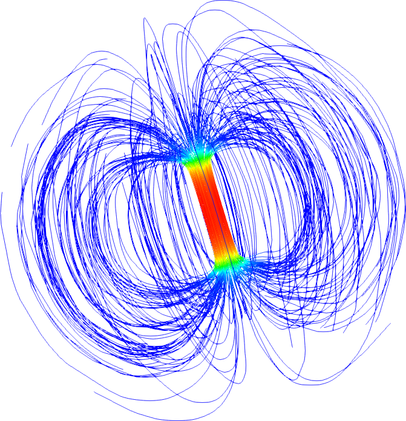

# Welcome to FreeFem++ documentation

FreeFem++ is a partial differential equation solver. It has its own language. FreeFem++ scripts can solve multiphysics non linear systems in 2D and 3D.

Problems involving PDE (2d, 3d) from several branches of physics such as fluid-structure interactions require interpolations of data on several meshes and their manipulation within one program. FreeFem++ includes a fast 2d-tree-based interpolation algorithm and a language for the manipulation of data on multiple meshes.

FreeFem++ is written in C++ and the FreeFem++ language is a C++ idiom.

For more informations, visit the [FreeFem++ website](http://www.freefem.org/ff++/).

