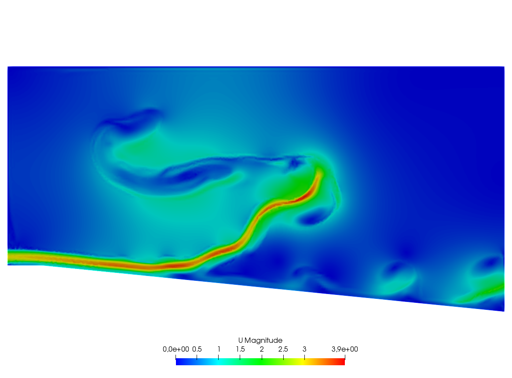
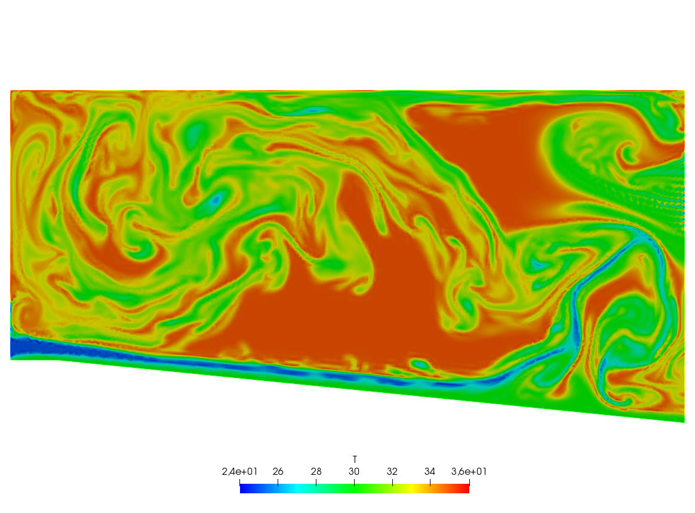
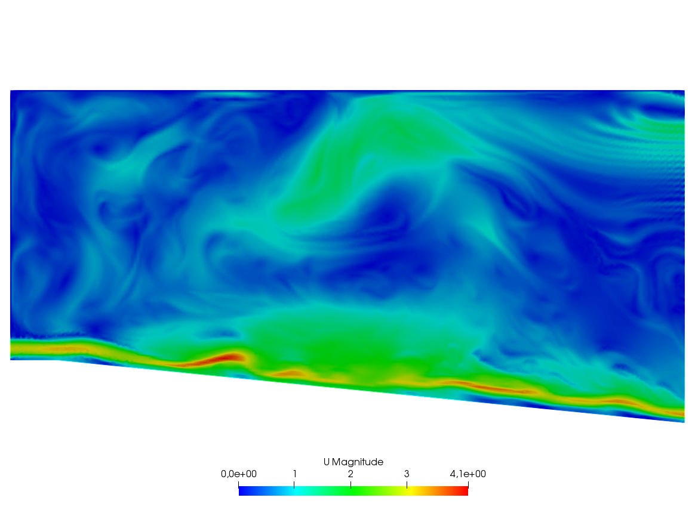

# A Large Fluid Problem

A friend of one of us in Auroville-India was building a ramp to access an air conditioned room. As I was visiting the construction site he told me that he expected to cool air escaping by the door to the room to slide down the ramp and refrigerate the feet of the coming visitors. I told him "no way" and decided to check numerically.

The fluid velocity and pressure are solution of the Navier-Stokes equations with varying density function of the temperature.

The geometry is trapezoidal with prescribed inflow made of cool air at the bottom and warm air above and so are the initial conditions; there is free outflow, slip velocity at the top (artificial) boundary and no-slip at the bottom. However the Navier-Stokes cum temperature equations have a RANS $k-\epsilon$ model and a Boussinesq approximation for the buoyancy. This comes to :

\begin{eqnarray}
	\p_t\theta+u\n\theta-\n\cdot(\kappa_T^m\n\theta) &=& 0\\
	\p_t u +u\n u -\n\cdot(\mu_T\n u) +\n p+ e(\theta-\theta_0)\vec e_2 &=&0\\
	\n\cdot u &=& 0\\
	\mu_T &=& c_\mu\frac{k^2}\epsilon\\
	\kappa_T &=& \kappa\mu_T\\
	\p_t k + u\n k + \epsilon -\n\cdot(\mu_T\n k) &=& \frac{\mu_T}2|\n u+\n u^T|^2\\
	\p_t\epsilon+u\n\epsilon + c_2\frac{\epsilon^2} k -\frac{c_\epsilon}{c_\mu}\n\cdot (\mu_T\n\epsilon) &=& \frac{c_1}2 k|\n u+\n u^T|^2\\
\end{eqnarray}

We use a time discretization which preserves positivity and uses the method of characteristics ($X^m(x)\approx x-u^m(x)\delta t$)

\begin{eqnarray}
\frac 1{\delta t}(\theta^{m+1}-\theta^m \circ X^m)-\n\cdot(\kappa_T^m\n\theta^{m+1}) &=& 0\\
\frac1{\delta t}(u^{m+1}-u^m \circ X^m) -\n\cdot(\mu_T^m\n u^{m+1}) +\n p^{m+1}+ e(\theta^{m+1}-\theta_0)\vec e_2 &=& 0\\
\n\cdot u^{m+1} &=& 0\\
\frac1{\delta t}(k^{m+1}-k^m \circ X^m) + k^{m+1}\frac{\epsilon^m}{k^m} -\n\cdot(\mu_T^m\n k^{m+1}) &=& \frac{\mu_T^m}2|\n u^m+{\n u^m}^T|^2\\
\frac1{\delta t}(\epsilon^{m+1}-\epsilon^m \circ X^m) + c_2\epsilon^{m+1}\frac{\epsilon^m} {k^m} -\frac{c_\epsilon}{c_\mu}\n\dot(\mu_T^m\n\epsilon^{m+1}) &=& \frac{c_1}2 k^m|\n u^m+{\n u^m}^T|^2\\
\mu_T ^{m+1} &=& c_\mu\frac{{k^{m+1}}^2}{\epsilon^{m+1}}\\
\kappa_T^{m+1} &=& \kappa\mu_T^{m+1}
\end{eqnarray}

In variational form and with appropriated boundary conditions the problem is :

```freefem
load "iovtk"

verbosity=0;

// Parameters
int nn = 15;
int nnPlus = 5;
real l = 1.;
real L = 15.;
real hSlope = 0.1;
real H = 6.;
real h = 0.5;

real reylnods =500;
real beta = 0.01;

real eps = 9.81/303.;
real nu = 1;
real numu = nu/sqrt(0.09);
real nuep = pow(nu,1.5)/4.1;
real dt = 0.;

real Penalty = 1.e-6;

// Mesh
border b1(t=0, l){x=t; y=0;}
border b2(t=0, L-l){x=1.+t; y=-hSlope*t;}
border b3(t=-hSlope*(L-l), H){x=L; y=t;}
border b4(t=L, 0){x=t; y=H;}
border b5(t=H, h){x=0; y=t;}
border b6(t=h, 0){x=0; y=t;}

mesh Th=buildmesh(b1(nnPlus*nn*l) + b2(nn*sqrt((L-l)^2+(hSlope*(L-l))^2)) + b3(nn*(H + hSlope*(L-l))) + b4(nn*L) + b5(nn*(H-h)) + b6(nnPlus*nn*h));
plot(Th);

// Fespaces
fespace Vh2(Th, P1b);
Vh2 Ux, Uy;
Vh2 Vx, Vy;
Vh2 Upx, Upy;

fespace Vh(Th,P1);
Vh p=0, q;
Vh Tp, T=35;
Vh k=0.0001, kp=k;
Vh ep=0.0001, epp=ep;

fespace V0h(Th,P0);
V0h muT=1;
V0h prodk, prode;
Vh kappa=0.25e-4, stress;

// Macro
macro grad(u) [dx(u), dy(u)] //
macro Grad(U) [grad(U#x), grad(U#y)] //
macro Div(U) (dx(U#x) + dy(U#y)) //

// Functions
func g = (x) * (1-x) * 4;

// Problem
real alpha = 0.;

problem Temperature(T, q)
	= int2d(Th)(
		  alpha * T * q
		+ kappa* grad(T)' * grad(q)
	)
	+ int2d(Th)(
		- alpha*convect([Upx, Upy], -dt, Tp)*q
	)
	+ on(b6, T=25)
	+ on(b1, b2, T=30)
	;

problem KineticTurbulence(k, q)
	= int2d(Th)(
		  (epp/kp + alpha) * k * q
		+ muT* grad(k)' * grad(q)
	)
	+ int2d(Th)(
		  prodk * q
		- alpha*convect([Upx, Upy], -dt, kp)*q
	)
	+ on(b5, b6, k=0.00001)
	+ on(b1, b2, k=beta*numu*stress)
	;

problem ViscosityTurbulence(ep, q)
	= int2d(Th)(
		  (1.92*epp/kp + alpha) * ep * q
		+ muT * grad(ep)' * grad(q)
	)
	+ int1d(Th, b1, b2)(
		  T * q * 0.001
	)
	+ int2d(Th)(
		  prode * q
		- alpha*convect([Upx, Upy], -dt, epp)*q
	)
	+ on(b5, b6, ep=0.00001)
	+ on(b1, b2, ep=beta*nuep*pow(stress,1.5))
	;

// Initialization with stationary solution
solve NavierStokes ([Ux, Uy, p], [Vx, Vy, q])
	= int2d(Th)(
		  alpha * [Ux, Uy]' * [Vx, Vy]
		+ muT * (Grad(U) : Grad(V))
		+ p * q * Penalty
		- p * Div(V)
		- Div(U) * q
	)
	+ int1d(Th, b1, b2, b4)(
		  Ux * Vx * 0.1
	)
	+ int2d(Th)(
		  eps * (T-35) * Vx
		- alpha*convect([Upx, Upy], -dt, Upx)*Vx
		- alpha*convect([Upx, Upy], -dt, Upy)*Vy
	)
	+ on(b6, Ux=3, Uy=0)
	+ on(b5, Ux=0, Uy=0)
	+ on(b1, b4, Uy=0)
	+ on(b2, Uy=-Upx*N.x/N.y)
	+ on(b3, Uy=0)
	;

plot([Ux, Uy], p, value=true, coef=0.2, cmm="[Ux, Uy] - p");

{
	real[int] xx(21), yy(21), pp(21);
	for (int i = 0 ; i < 21; i++){
		yy[i] = i/20.;
		xx[i] = Ux(0.5,i/20.);
		pp[i] = p(i/20.,0.999);
	}
	cout << " " << yy << endl;
	plot([xx, yy], wait=true, cmm="Ux x=0.5 cup");
	plot([yy, pp], wait=true, cmm="p y=0.999 cup");
}

// Initialization
dt = 0.1; //probably too big
int nbiter = 3;
real coefdt = 0.25^(1./nbiter);
real coefcut = 0.25^(1./nbiter);
real cut = 0.01;
real tol = 0.5;
real coeftol = 0.5^(1./nbiter);
nu = 1./reylnods;

T = T - 10*((x<1)*(y<0.5) + (x>=1)*(y+0.1*(x-1)<0.5));

// Convergence loop
real T0 = clock();
for (int iter = 1; iter <= nbiter; iter++){
	cout << "Iteration " << iter << " - dt = " << dt << endl;
	alpha = 1/dt;

	// Time loop
	real t = 0.;
	for (int i = 0; i <= 500; i++){
		t += dt;
		cout << "Time step " << i << " - t = " << t << endl;

		// Update
		Upx = Ux;
		Upy = Uy;
		kp = k;
		epp = ep;
		Tp = max(T, 25); //for beauty only should be removed
		Tp = min(Tp, 35); //for security only should be removed
		kp = max(k, 0.0001); epp = max(ep, 0.0001); // to be secure: should not be active
		muT = 0.09*kp*kp/epp;

		// Solve NS
		NavierStokes;

		// Update
		prode = -0.126*kp*(pow(2*dx(Ux),2)+pow(2*dy(Uy),2)+2*pow(dx(Uy)+dy(Ux),2))/2;
		prodk = -prode*kp/epp*0.09/0.126;
		kappa = muT/0.41;
		stress = abs(dy(Ux));

		// Solve k-eps-T
		KineticTurbulence;
		ViscosityTurbulence;
		Temperature;

		// Plot
		plot(T, value=true, fill=true);
		plot([Ux, Uy], p, coef=0.2, cmm=" [Ux, Uy] - p", WindowIndex=1);

		// Time
		cout << "\tTime = " << clock()-T0 << endl;
	}

	// Check
	if (iter >= nbiter) break;

	// Adaptmesh
	Th = adaptmesh(Th, [dx(Ux), dy(Ux), dx(Ux), dy(Uy)], splitpbedge=1, abserror=0, cutoff=cut, err=tol, inquire=0, ratio=1.5, hmin=1./1000);
	plot(Th);

	// Update
	dt = dt * coefdt;
	tol = tol * coeftol;
	cut = cut * coefcut;
}
cout << "Total Time = " << clock()-T0 << endl;
```

|<a name="Fig1">Fig. 1</a>: Temperature at time steps 100, 200, 300, 400, 500. | <a name="Fig2">Fig. 2</a>: Velocity at time steps 100, 200, 300, 400, 500. |
|:----:|:----:|
|||
|||
|||
|||
|||
