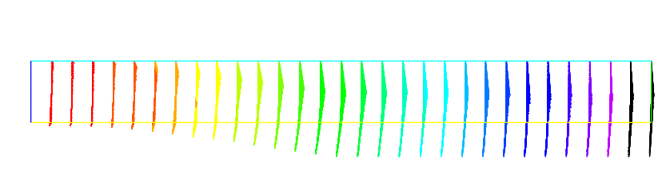

# The System of elasticity

**Elasticity**

Solid objects deform under the action of applied forces:

a point in the solid, originally at $(x,y,z)$ will come to $(X,Y,Z)$ after some time; the vector $\mathbf{u}=(u_1,u_2,u_3) = (X-x, Y-y, Z-z)$ is called the displacement. When the displacement is small and the solid is elastic, Hooke's law gives a relationship between the stress tensor $\sigma(u)=(\sigma_{ij}(u) )$ and the strain tensor $\epsilon(u)=\epsilon_{ij}(u)$

$$
\sigma_{ij}(u) = \lambda \delta_{ij} \nabla.\mathbf{u}+ 2\mu\epsilon_{ij}(u),
$$

where the Kronecker symbol $\delta_{ij} = 1$ if $i=j$, $0$ otherwise, with

$$
\epsilon_{ij}(u) = {1\over 2}({\p u_i\over\p x_j} +
{\p u_j\over\p x_i} ),
$$

and where $\lambda, \mu$ are two constants that describe the mechanical properties of the solid, and are themselves related to the better known constants $E$, Young's modulus, and $\nu$, Poisson's ratio:

$$
\mu = {E\over 2( 1+\nu)}, \quad \lambda = {E\nu\over (1+\nu)(1-2\nu)}.
$$

**Lamé's system**

Let us consider a beam with axis $Oz$ and with perpendicular section
$\Omega$. The components along $x$ and $y$ of the strain ${\bf u}(x)$
in a section $\Omega$ subject to forces ${\bf f}$ perpendicular to the
axis are governed by

$$
	-\mu \Delta {\bf u} - (\mu+\lambda) \nabla (\nabla .{\bf u})={\bf f}~~\hbox{in}~~\Omega,
$$

where $\lambda$ ,$\mu$ are the Lamé coefficients introduced above.

Remark, we do not used this equation because the associated variationnal form does not give the right boundary condition, we simply use

$$
	- div( \sigma ) = \mathbf{f} \quad \mbox{in}~~\Omega
$$

where the corresponding variationnal form is:

$$
 \int_{\Omega} \sigma(u) : \epsilon(\mathbf{v})\;dx - \int_{\Omega} \mathbf{v} f \;dx =0;
$$

where $:$ denote the tensor scalar product,  i.e. $ a: b = \sum_{i,j} a_{ij}b_{ij}$.

So the variationnal form can be written as :

$$
 \int_{\Omega} \lambda \nabla.u \nabla.v + 2 \mu \epsilon(\mathbf{u}):\epsilon(\mathbf{v}) \; dx - \int_{\Omega} \mathbf{v} f \;dx =0;
$$

!!! example
	Consider elastic plate with the undeformed rectangle shape $[0,20]\times [-1,1]$.

	The body force is the gravity force $\mathbf{f}$ and the boundary force $\mathbf{g}$ is zero on lower, upper and right sides. The left vertical sides of the beam is fixed. The boundary conditions are

	\begin{eqnarray*}
	\sigma . {\bf n} &=& \mathbf{g} = 0 ~~\hbox{on}~~\Gamma_1, \Gamma_4, \Gamma_3, \\
	{\bf u} &=& \mathbf{0} ~~\hbox{on}~~\Gamma_2
	\end{eqnarray*}

Here ${\bf u}=(u,v) $ has two components.

The above two equations are strongly coupled by their mixed derivatives, and thus any iterative solution on each of the components is risky. One should rather use FreeFem++'s system approach and write:

```freefem
// Parameters
real E = 21e5;
real nu = 0.28;

real f = -1;

// Mesh
mesh Th = square(10, 10, [20*x,2*y-1]);

// Fespace
fespace Vh(Th, P2);
Vh u, v;
Vh uu, vv;

// Macro
real sqrt2=sqrt(2.);
macro epsilon(u1,u2) [dx(u1),dy(u2),(dy(u1)+dx(u2))/sqrt2] //
// The sqrt2 is because we want: epsilon(u1,u2)'* epsilon(v1,v2) $== \epsilon(\bm{u}): \epsilon(\bm{v})$
macro div(u,v) ( dx(u)+dy(v) ) //

// Problem
real mu= E/(2*(1+nu));
real lambda = E*nu/((1+nu)*(1-2*nu));

solve lame([u, v], [uu, vv])
	= int2d(Th)(
		  lambda * div(u, v) * div(uu, vv)
		+ 2.*mu * ( epsilon(u,v)' * epsilon(uu,vv) )
	)
	- int2d(Th)(
			f*vv
	)
	+ on(4, u=0, v=0)
	;

// Plot
real coef=100;
plot([u, v], wait=1, ps="lamevect.eps", coef=coef);

// Move mesh
mesh th1 = movemesh(Th, [x+u*coef, y+v*coef]);
plot(th1,wait=1,ps="lamedeform.eps");

// Output
real dxmin = u[].min;
real dymin = v[].min;

cout << " - dep. max x = "<< dxmin << " y=" << dymin << endl;
cout << "   dep. (20, 0) = " << u(20, 0) << " " << v(20, 0) << endl;
```

The numerical results are shown on [figure 1](#Fig1) and the output is:

```
 -- square mesh : nb vertices  =121 ,  nb triangles = 200 ,  nb boundary edges 40
 -- Solve :           min -0.00174137  max 0.00174105
          min -0.0263154  max 1.47016e-29
 - dep.  max   x = -0.00174137 y=-0.0263154
   dep.  (20,0)  = -1.8096e-07 -0.0263154
times: compile 0.010219s, execution 1.5827s
```

| <a name="Fig1">Fig. 1 :</a> Solution of Lamé's equations for elasticity for a 2D beam deflected by its own weight and clamped by its left vertical side. Result are shown with a amplification factor equal to  100. The size of the arrow is automatically bound, but the color gives the real length.|
|:----:|
||
||
