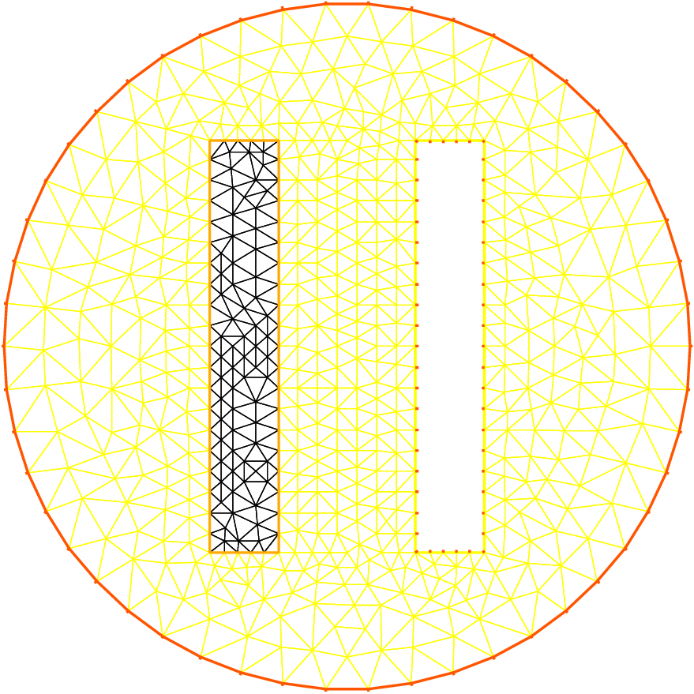

# Heat Exchanger

**Summary:** _Here we shall learn more about geometry input and triangulation files, as well as read and write operations._

**The problem**
Let $\{C_{i}\}_{1,2}$, be 2 thermal conductors within an enclosure $C_0$.

The first one is held at a constant temperature ${u} _{1}$ the other one has a given thermal conductivity $\kappa_2$ 5 times larger than the one of $C_0$.

We assume that the border of enclosure $C_0$ is held at temperature $20^\circ C$ and that we have waited long enough for thermal equilibrium.

In order to know ${u} (x)$ at any point $x$ of the domain $\Omega$, we must solve

$$
\n\cdot(\kappa\n{u}) = 0 \hbox{ in } \Omega,
\quad {u}_{|\Gamma} = g
$$

where $\Omega$ is the interior of $C_0$ minus the conductors $C_1$ and $\Gamma$ is the boundary of $\Omega$, that is $C_0\cup C_1$.

Here $g$ is any function of $x$ equal to ${u}_i$ on $C_i$.

The second equation is a reduced form for:

$$
{u} ={u} _{i} \hbox{ on } C_{i}, \quad i=0,1.
$$

The variational formulation for this problem is in the subspace $H^1_0(\Omega) \subset H^1(\Omega)$ of functions which have zero traces on $\Gamma$.

$
u-g\in H^1_0(\Omega) : \int_\Omega\n u\n v =0 \forall v\in H^1_0(\Omega)
$

Let us assume that $C_0$ is a circle of radius 5 centered at the origin, $C_i$ are rectangles, $C_1$ being at the constant temperature $u_1=60^\circ C$.

```freefem
// Parameters
int C1=99;
int C2=98; //could be anything such that !=0 and C1!=C2

// Mesh
border C0(t=0., 2.*pi){x=5.*cos(t); y=5.*sin(t);}

border C11(t=0., 1.){x=1.+t; y=3.; label=C1;}
border C12(t=0., 1.){x=2.; y=3.-6.*t; label=C1;}
border C13(t=0., 1.){x=2.-t; y=-3.; label=C1;}
border C14(t=0., 1.){x=1.; y=-3.+6.*t; label=C1;}

border C21(t=0., 1.){x=-2.+t; y=3.; label=C2;}
border C22(t=0., 1.){x=-1.; y=3.-6.*t; label=C2;}
border C23(t=0., 1.){x=-1.-t; y=-3.; label=C2;}
border C24(t=0., 1.){x=-2.; y=-3.+6.*t; label=C2;}

plot(   C0(50) //to see the border of the domain
	+ C11(5)+C12(20)+C13(5)+C14(20)
	+ C21(-5)+C22(-20)+C23(-5)+C24(-20),
	wait=true, ps="heatexb.eps");

mesh Th=buildmesh(C0(50)
	+ C11(5)+C12(20)+C13(5)+C14(20)
	+ C21(-5)+C22(-20)+C23(-5)+C24(-20));

plot(Th,wait=1);

// Fespace
fespace Vh(Th, P1);
Vh u, v;
Vh kappa=1 + 2*(x<-1)*(x>-2)*(y<3)*(y>-3);

// Solve
solve a(u, v)
	= int2d(Th)(
		  kappa*(
			  dx(u)*dx(v)
			+ dy(u)*dy(v)
		)
	)
	+on(C0, u=20)
	+on(C1, u=60)
	;

// Plot
plot(u, wait=true, value=true, fill=true, ps="HeatExchanger.eps");
```

Note the following:

* `C0` is oriented counterclockwise by $t$, while `C1` is oriented clockwise and `C2` is oriented counterclockwise. This is why `C1` is viewed as a hole by `:::freefem buildmesh`.

* `C1` and `C2` are built by joining pieces of straight lines. To group them in the same logical unit to input the boundary conditions in a readable way we assigned a label on the boundaries. As said earlier, borders have an internal number corresponding to their order in the program (check it by adding a `:::freefem cout << C22;` above). This is essential to understand how a mesh can be output to a file and re-read (see below).

* As usual the mesh density is controlled by the number of vertices assigned to each boundary. It is not possible to change the (uniform) distribution of vertices but a piece of boundary can always be cut in two or more parts, for instance `C12` could be replaced by `C121+C122`:
```freefem
// border C12(t=0.,1.){x=2.; y=3.-6.*t; label=C1;}
border C121(t=0.,0.7){x=2.; y=3.-6.*t; label=C1;}
border C122(t=0.7,1.){x=2.; y=3.-6.*t; label=C1;}
...
buildmesh(.../*+ C12(20) */ + C121(12) + C122(8) + ...);
```

| Figure 1 - The heat exchanger ||
| :----: | :----: |
|||

!!! note
	**Exercise :** Use the symmetry of the problem with respect to the axes.

	Triangulate only one half of the domain, and set Dirichlet conditions on the vertical axis, and Neumann conditions on the horizontal axis.

**Writing and reading triangulation files**
Suppose that at the end of the previous program we added the line

```freefem
savemesh(Th, "condensor.msh");
```

and then later on we write a similar program but we wish to read the mesh from that file. Then this is how the condenser should be computed:

```freefem
// Mesh
mesh Sh = readmesh("condensor.msh");

// Fespace
fespace Wh(Sh, P1);
Wh us, vs;

// Solve
solve b(us, vs)
	= int2d(Sh)(
		  dx(us)*dx(vs)
		+ dy(us)*dy(vs)
	)
	+on(1, us=0)
	+on(99, us=1)
	+on(98, us=-1)
	;

// Plot
plot(us);
```

Note that the names of the boundaries are lost but either their internal number (in the case of `C0`) or their label number (for `C1` and `C2`) are kept.
