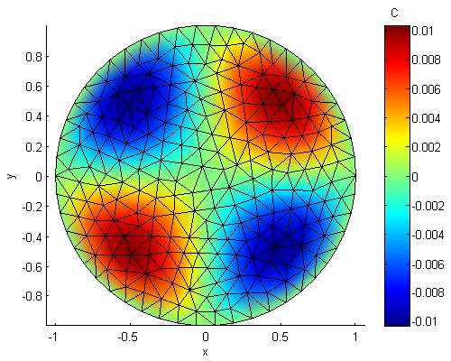
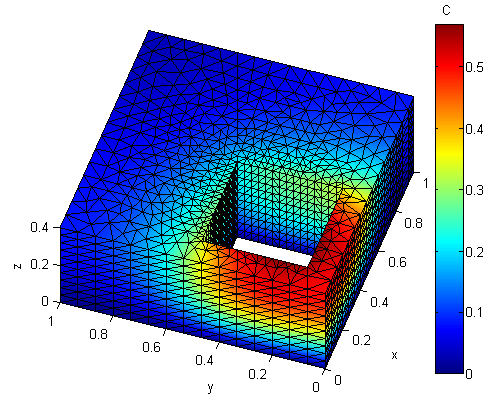

# Plotting in Matlab or Octave

This chapter will focus on plotting 2D and 3D FreeFem++ simulation results with [Matlab&copy; ](https://www.mathworks.com/) or [Octave](https://www.gnu.org/software/octave/).

## Overview

In general three basic steps are necessary to create a plot:

  * Writing of the simulation results into a text file via the FreeFem++ script
  * Reading and converting the results in Matlab / Octave with the [ffmatlib](https://github.com/samplemaker/freefem_matlab_octave_plot) commands
  * Plotting of the results with the [patch()](https://de.mathworks.com/help/matlab/ref/patch.html) command and customizing the plot output.

!!! info
	In order to call `ffmatlib` commands the path name of the `ffmatlib` must be added to the search path. This can be done at the beginning of a Matlab / Octave script with the statement `'addpath('Path to ffmatlib');'`

## Creating 2D Plots

The 2D plot examples focus on the display of functions of the type $\mathbb{R}^2 \rightarrow \mathbb{R}$ as a 2D density or 3D surf plot either. First a 2D simulation run is performed and the simulation result is written to a file (for more information see also chapter [Poisson's equation](../tutorial/Poisson)):

```freefem
border C(t=0,2* pi){x=cos(t); y=sin(t);}
mesh Th = buildmesh (C(50));
fespace Vh(Th,P1);
Vh u,v;
func f = x*y;

solve Poisson(u,v,solver=LU) =
     int2d(Th)(dx(u) * dx(v) + dy(u) * dy(v))
   - int2d(Th)(f*v)
   + on(C,u=0) ;

//Writes the simulation results to a file
ofstream file ("temp_demo1_getstarted.txt");
for (int i = 0; i < Th.nt; i++){
  for (int j = 0; j < 3; j++){
    file << Th[i][j].x << ";"
         << Th[i][j].y << ";"
         << u[][Vh(i,j)] << "\n";
  }
}

plot(u);
```

Next the following script will be executed in Matlab / Octave:

```Matlab
addpath('ffmatlib');

%Reads the file content and converts to patch() - plot data
[X,Y,C]=ffread2patch('temp_demo1_getstarted.txt','Delimiter',';', ...
                     'Format','%f %f %f');

%Plots the facets and display the mesh
%Sets the the color C equal to the solution of the PDE (Z-value)
patch(X,Y,C,'EdgeColor',[0 0 0],'LineWidth',1);

%Creates a colorbar
colormap(jet(192));
caxis([min(min(C)) max(max(C))]);
hcb=colorbar;
title(hcb,'C');

ylabel('y');
xlabel('x');
title('2D Density Plot');

%Sets the view point specification to 2d
view(2);
%Sets 1:1 aspect ratio
axis tight equal;
```
The output should look like [figure 1](#Fig1).

<center>

|<a name="Fig1">Fig. 1:</a> 2D example created with Matlab|
|:----:|
||

</center>

### Customizing

!!! info
	The `patch()` command basically renders a set of polygons (=facets, patches). The patch polygons are defined by a color value and the spatial coordinates at the polygon vertices.

  * To hide the mesh the `'EdgeColor'` property has to be set to `'none'`:

```Matlab
patch(X,Y,C,'EdgeColor','none');
```

  * To show only the mesh, the `'EdgeColor'` property has to be set to a fixed color value (here blue) and the third argument (the polygon vertice colors) has to be set to white:

```Matlab
patch(X,Y,[1 1 1],'EdgeColor',[0 0 1],'LineWidth',1);
```

  * To create a 3D surf plot a Z-value which has to be set identical to the color value C is added to the `patch()` command. In addition the viewpoint specification must be changed from `view(2)` to `view(3)` and an appropiate aspect ratio of the X, Y, and Z axes must be set instead of `axis tight equal;`:

```Matlab
patch(X,Y,C,C,'EdgeColor',[0 0 0],'LineWidth',1);
```
and

```Matlab
view(3);
daspect([1 1 1*(max(max(C))-min(min(C)))]);
```

**Download run through example:**  
[Matlab / Octave file](../tutorial/scripts/matlab_octave_2d_examples.m)  
[FreeFem++ script](../tutorial/scripts/matlab_octave_2d_examples.edp)

## Creating 3D Plots

The 3D plot examples focus on the display of functions of the type $\mathbb{R}^3 \rightarrow \mathbb{R}$. A plot of this type can basically be divided into two different classes:

  * Domain boundary plot in order to display the boundary / object surface
  * Slicing the simulation result to create cross sections

In the first use case it is necessary to write the triangles at the domain boundary from within the FreeFem++ script. In the second use case the mesh elements from within the domain must be written as well. A small example looks like this:

```freefem
load "msh3"
load "medit"

int C1=90,C2=91;

border C01(t=0,1){x=t; y=0; label=C1;};
border C02(t=1,0){x=t; y=1; label=C1;};
border C03(t=0,1){x=1; y=t; label=C1;};
border C04(t=1,0){x=0; y=t; label=C1;};
border C11(t=0,0.4){x=0.1+t; y=0.1; label=C2;};
border C12(t=0.4,0){x=0.1+t; y=0.1+0.4; label=C2;};
border C13(t=0,0.4){x=0.1+0.4; y=0.1+t; label=C2;};
border C14(t=0.4,0){x=0.1; y=0.1+t; label=C2;};

int n=15, m=15, k=10;
mesh Th2d=buildmesh(C01(n)+C03(n)+C02(n)+C04(n)
                   +C11(-m)+C12(-m)+C13(-m)+C14(-m));

int[int] rup=[0,1],rdown=[0,2],rmid=[C2,3],rtet=[0,0];

mesh3 Th3d=buildlayers(Th2d,k,
                       zbound=[0,0.4],
                       reftet=rtet,
                       labelmid=rmid,
                       labelup=rup,
                       labeldown=rdown);

fespace Vh(Th3d,P1);
Vh u,v;

macro Grad(u) [dx(u),dy(u),dz(u)] // EOM

solve Poisson(u,v,solver=CG) =
              int3d(Th3d)( Grad(u)'*Grad(v) )
            + on(2,u=0)
            - int2d(Th3d,3)(v);

ofstream tetdata ("temp_demo4_tetdata3d_box.txt");
for (int i=0; i<Th3d.nt; i++){
  for (int j=0; j<4; j++){
    tetdata << Th3d[i][j].x << ";"
            << Th3d[i][j].y << ";"
            << Th3d[i][j].z << ";"
            << u[][Vh(i,j)] << "\n";

  }
}

int idx;
int nbelement=Th3d.nbe;
ofstream bddata ("temp_demo4_bddata3d_box.txt");
for (int k=0;k<nbelement;++k){
  for (int num=0;num<3;num++){
    idx = Th3d.be(k)[num];
    bddata << Th3d(idx).x << ";"
           << Th3d(idx).y << ";"
           << Th3d(idx).z << ";"
           << u(Th3d(idx).x,Th3d(idx).y,Th3d(idx).z) << "\n";
  }
}

medit("U",Th3d,u);
```

The following example will create a 3D surface plot including the mesh. The surface is colored according to the solution of the PDE at the domain boundary:

```Matlab
addpath('ffmatlib');

%Reads the file content and converts to patch() - plot data
[X,Y,Z,C] = ffread2patch('temp_demo4_bddata3d_box.txt', ...
                         'Delimiter',';','Format','%f %f %f %f');

%Plots the facets and display the mesh
%Sets the the color C equal to the solution of the PDE
patch(X,Y,Z,C,'EdgeColor',[0 0 0],'LineWidth',1);

%Creates a colorbar
colormap(jet(250));
caxis([min(min(C)) max(max(C))]);
hcb=colorbar;
title(hcb,'C');

zlabel('z');
ylabel('y');
xlabel('x');
title('3D Plot of a Surface Boundary');

%Sets the view point specification to 3d
view(3);
%Sets 1:1:1 aspect ratio
daspect([1 1 1]);
```

The output should look like [figure 2](#Fig2).

<center>

|<a name="Fig2">Fig. 2:</a> 3D example created with Matlab|
|:----:|
||

</center>

### Customizing

  * In order to plot the mesh alone the procedure is analogous to the 2D case:

```Matlab
patch(X,Y,Z,[1 1 1],'EdgeColor',[0 0 1],'LineWidth',1);
```

  * In order to draw a sliced problem `ffmatlib` must be used more extensively:
    * Read boundary data and the data from within the domain
    * Define the cutting plane via three points `S1,S2,S3`
    * Create the cross section
    * Plot the result invoking the `patch()` command

!!! info
	The `ffmatlib` contains a Matlab / Octave GUI which simplifies  slicing of simulation results.

```Matlab
%Reads boundary and mesh data from within the domain
[bdata,tdata] = ffreadfile('File1','temp_demo4_bddata3d_box.txt', ...
                           'File2','temp_demo4_tetdata3d_box.txt', ...
                           'Delimiter',';','Format','%f %f %f %f');

%Slicing plane definition
S1=[0 0 0]';
S2=[1 0.5 0]';
S3=[1 1.3 1]';

%Cut boundary as well as the complete domain
[BX,BY,BZ,BC] = slicebd2patch(bdata,S1,S2,S3);
[SX,SY,SZ,SC] = slicetet2patch(tdata,S1,S2,S3);

%Plot
patch([SX BX],[SY BY],[SZ BZ],[SC BC]);
%Adjust to correct colors
colormap(jet(250));
caxis([min(min([SC BC])) max(max([SC BC]))]);
```

**Download run through example:**  
[Matlab / Octave script](../tutorial/scripts/matlab_octave_3d_examples.m)<br>
[FreeFem++ script](../tutorial/scripts/matlab_octave_3d_examples.edp)

## Contour- and Vector 2D Plots

Additional functionalities such as the creation of `2D contour`- or `2D vector` plots and more documentation on this topic can be found in the `ffmatlib` repository.

## References

  * [Octave][octave]
  * [Matlab][matlab]
  * [ffmatlib][ffmatlib]

[ffmatlib]:   https://github.com/samplemaker/freefem_matlab_octave_plot
             "Interface to plot FreeFem++ results in Matlab / Octave"
[octave]:     https://www.gnu.org/software/octave/
             "GNU Octave scientific programming language"
[matlab]:     https://www.mathworks.com/
             "Matlab scientific programming language"

