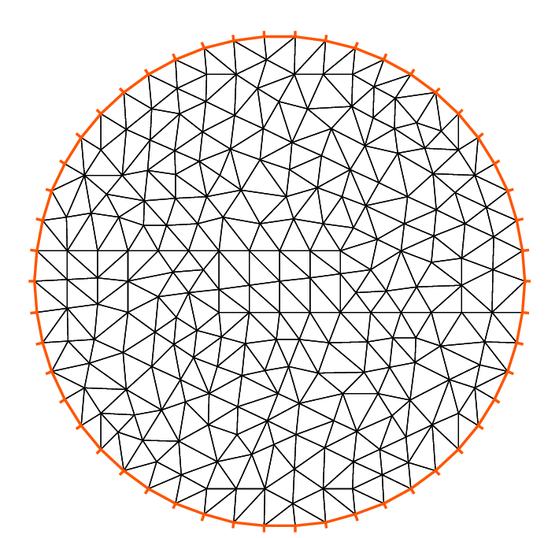
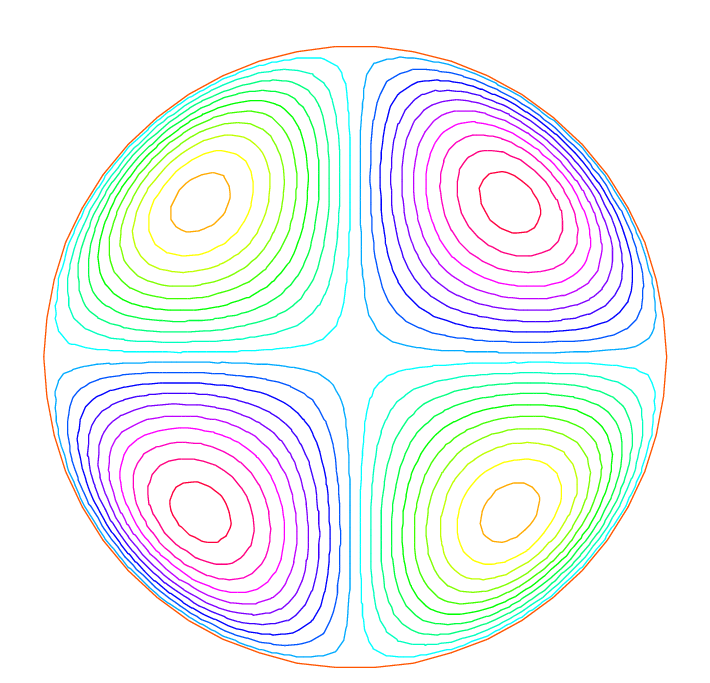
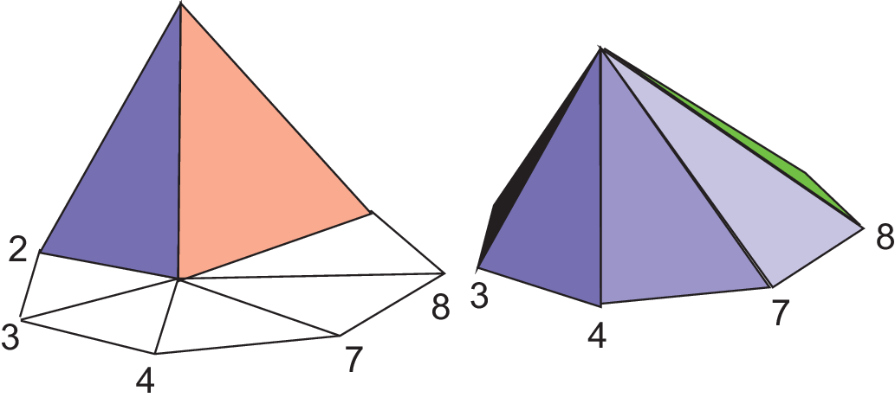

## Solving Poisson’s equation

For a given function $f(x,y)$, find a function $u(x,y)$ satisfying :

\begin{eqnarray}
	-\Delta u(x,y) &= f(x,y) & \mbox{ for all }(x,y)\mbox{ in }\Omega\label{eqn:Poisson}\\
	u(x,y) &= 0 & \mbox{ for all }(x,y)\mbox{ on }\p\Omega\label{eqn:Dirichlet}
\end{eqnarray}

Here $\p\Omega$ is the boundary of the bounded open set $\Omega\subset\R^2$ and $\Delta u = \frac{\p^2 u}{\p x^2 } + \frac{\p^2 u}{\p y^2}$.

We will compute $u$ with $f(x,y)=xy$ and $\Omega$ the unit disk. The boundary $C=\partial\Omega$ is defined as:
$$
C=\{(x,y)|\; x=\cos(t),\, y=\sin(t),\, 0\le t\le 2\pi\}
$$

!!! note
	In FreeFem++, the domain $\Omega$ is assumed to be described by the left side of its boundary.

The following is the Freefem++ program which computes $u$:
```freefem
// Define mesh boundary
border C(t=0, 2*pi){x=cos(t); y=sin(t);}

// The triangulated domain Th is on the left side of its boundary
mesh Th = buildmesh(C(50));

// The finite element space defined over Th is called here Vh
fespace Vh(Th, P1);
Vh u, v;// Define u and v as piecewise-P1 continuous functions

// Define a function f
func f= x*y;

// Get the clock in second
real cpu=clock();

// Define the PDE
solve Poisson(u, v, solver=LU)
	= int2d(Th)(	// The bilinear part
		  dx(u)*dx(v)
		+ dy(u)*dy(v)
	)
	- int2d(Th)(	// The right hand side
		  f*v
	)
	+ on(C, u=0);	// The Dirichlet boundary condition

// Plot the result
plot(u);

// Display the total computational time
cout << "CPU time = " << (clock()-cpu) << endl;
```
<!--- > -->
As illustrated in [figure 1.2](#Fig1.2), we can see the isovalue of $u$ by using Freefem++ `:::freefem plot` command (see line 29
above).

<a name="Fig1.1">Figure 1.1</a> - Mesh Th by `:::freefem buildmesh(C(50))` | <a name="Fig1.2">Figure 1.2</a> - isovalue by `:::freefem plot(u)`
:-------------------------:|:-------------------------:
 | 

!!! note
	The qualifier `:::freefem solver=LU` (line 18) is not required and by default a multi-frontal `:::freefem LU` is used.

	The lines containing `:::freefem clock` are equally not required.

!!! success ""
	Note how close to the mathematics FreeFem++ language is. Lines 19 to 24 correspond to the mathematical variational equation:
	$$
		 \int_{T_h}
			(
				 \frac{\p u}{\p x}\frac{\p v}{\p x}
				+ \frac{\p u}{\p y}\frac{\p v}{\py}
			)\d x \d y
		= \int_{T_h}f v\d x\d y
	$$
	for all $v$ which are in the finite element space $V_h$ and zero on the boundary $C$.

!!! example "Exercise:"
	Change `:::freefem P1` into `:::freefem P2` and run the program.

This first example shows how FreeFem++ executes with no effort all the usual steps required by the finite element method (FEM). Let's
go through them one by one.

**On the line 2**:

The boundary $\Gamma$ is described analytically by a parametric equation for $x$ and for $y$. When $\Gamma=\sum_{j=0}^J \Gamma_j$ then each curve $\Gamma_j$ must be specified and crossings of $\Gamma_j$ are not allowed except at end points .

The keyword `:::freefem label` can be added to define a group of boundaries for later use (boundary conditions for instance). Hence the circle could also have been described as two half circle with the same label:
```freefem
border Gamma1(t=0, pi){x=cos(t); y=sin(t); label=C};
border Gamma2(t=pi, 2.*pi){x=cos(t); y=sin(t); label=C};
```

Boundaries can be referred to either by name (`Gamma1` for example) or by label (`C` here) or even by its internal number here 1 for the first half circle and 2 for the second (more examples are in $\ref{Meshing Examples}$).

**On the line 5**

The triangulation $\mathcal{T}_h$ of $\Omega$ is automatically generated by `:::freefem buildmesh(C(50))` using 50 points on `C` as in [figure 1.1](#Fig1.1).

The domain is assumed to be on the left side of the boundary which is implicitly oriented by the parametrization. So an elliptic hole can be added by typing:
```freefem
border C(t=2.*pi, 0){x=0.1+0.3*cos(t); y=0.5*sin(t);};
```

If by mistake one had written
```freefem
border C(t=0, 2.*pi){x=0.1+0.3*cos(t); y=0.5*sin(t);};
```
then the inside of the ellipse would be triangulated as well as the outside.

!!! info
	Automatic mesh generation is based on the Delaunay-Voronoi algorithm. Refinement of the mesh are done by increasing the number of points on $\Gamma$, for example `:::freefem buildmesh(C(100))`, because inner vertices are determined by the density of points on the boundary.

	Mesh adaptation can be performed also against a given function `f` by calling `:::freefem adaptmesh(Th,f)`.

Now the name $\mathcal{T}_h$ (`:::freefem Th` in FreeFem++) refers to the family $\{T_k\}_{k=1,\cdots,n_t}$ of triangles shown in [figure 1.1](#Fig1.1).

Traditionally $h$ refers to the mesh size, $n_t$ to the number of triangles in $\mathcal{T}_h$ and $n_v$ to the number of vertices, but it is seldom that we will have to use them explicitly.

If $\Omega$ is not a polygonal domain, a "skin" remains between the exact domain $\Omega$ and its approximation $\Omega_h=\cup_{k=1}^{n_t}T_k$. However, we notice that all corners of $\Gamma_h = \p\Omega_h$ are on $\Gamma$.

**On line 8:**

A finite element space is, usually, a space of polynomial functions on elements, triangles here only, with certain matching properties
at edges, vertices etc. Here `:::freefem fespace Vh(Th, P1)` defines $V_h$ to be the space of continuous functions which are affine in $x,y$ on each triangle of $T_h$.

As it is a linear vector space of finite dimension, basis can be found. The canonical basis is made of functions, called the _hat function_ $\phi_k$ which are continuous piecewise affine and are equal to 1 on one vertex and 0 on all others. A typical hat function is shown on [figure 2.2](#Fig2.2).

<a name="Fig2.1">Figure 2.1</a>: `:::freefem mesh Th` | <a name="Fig2.2">Figure 2.2</a>: Graph of $\phi_1$ (left) and $\phi_6$
:-------------------------:|:-------------------------:
 | 

!!! info
	The easiest way to define $\phi_k$ is by making use of the _barycentric coordinates_ $\lambda_i(x,y),~i=1,2,3$ of a point $q=(x,y)\in T$, defined by $\sum_i\lambda_i=1,~~~\sum_i\lambda_i\vec q^i=\vec q$ where $q^i,~i=1,2,3$ are the 3 vertices of $T$. Then it is easy to see that the restriction of $\phi_k$ on $T$ is precisely $\lambda_k$.

Then
\begin{equation}\label{equation3}
V_h(\mathcal{T}_h,P_1)=\left\{w(x,y)\left|\; w(x,y)=\sum_{k=1}^{M}w_k\phi_k(x,y),\, w_k\textrm{ are real numbers}\right.\right\}
\end{equation}

where $M$ is the dimension of $V_h$, i.e. the number of vertices. The $w_k$ are called the _degree of freedom_ of $w$ and $M$ the number of degree of freedom.

It is said also that the _nodes_ of this finite element method are the vertices.

**Setting the problem**

On line 9, `:::freefem Vh u,v` declares that $u$ and $v$ are approximated as above, namely
\begin{equation}\label{defu}
u(x,y)\simeq u_h(x,y)=\sum_{k=0}^{M-1} u_k\phi_k(x,y)
\end{equation}

On the line 12, the right hand side `f` is defined analytically using the keyword `:::freefem func`.

Line 18 to 26 define the bilinear form of equation (\ref{eqn:Poisson}) and its Dirichlet boundary conditions (\ref{eqn:Dirichlet}).

This _variational formulation_ is derived by multiplying (\ref{eqn:Poisson}) by $v(x,y)$ and integrating the result over $\Omega$:
$$
-\int_{\Omega}v\Delta u \,\d x\d y = \int_{\Omega} vf\, \d x\d y
$$

Then, by Green's formula, the problem is converted into finding $u$ such that

\begin{eqnarray}
\label{eqn:weakform}
&&a(u,v) - \ell(f,v) = 0
\qquad \forall v \hbox{ satisfying $v=0$ on }\p\Omega.\\
&&\hbox{with }a(u,v)=\int_{\Omega}\nabla u\cdot \nabla v \,\d x\d y ,
\quad \ell(f,v)=\int_{\Omega}fv\, \d x\d y
\label{eqn:bilinear}
\end{eqnarray}

In FreeFem++ the **Poisson** problem can be declared only as in
```freefem
Vh u,v; problem Poisson(u,v) = ...
```
and solved later as in
```freefem
Poisson; //the problem is solved here
```
or declared and solved at the same time as in
```freefem
Vh u,v; solve Poisson(u,v) = ...
```
and (\ref{eqn:weakform}) is written with `:::freefem dx(u)` $=\p u/\p x$, `:::freefem dy(u)` $=\p u/\p y$ and

$\displaystyle{\int_{\Omega}\nabla u\cdot \nabla v\, \d x\d y \longrightarrow}$ `:::freefem int2d(Th)( dx(u)*dx(v) + dy(u)*dy(v) )`

$\displaystyle{\int_{\Omega}fv\, \d x\d y \longrightarrow}$ `:::freefem int2d(Th)( f*v )` (Notice here, $u$ is unused)

!!! warning
	In FreeFem++ **bilinear terms and linear terms should not be under the same integral** indeed to construct the linear systems FreeFem++ finds out which integral contributes to the bilinear form by checking if both terms, the unknown (here `u`) and test functions (here `v`) are present.

**Solution and visualization**

On line 15, the current time in seconds is stored into the real-valued variable `cpu`.

Line 18, the problem is solved.

Line 29, the visualization is done as illustrated in [figure 1.2](#Fig1.2).

**(see \refSec{Plot} for zoom, postscript and other commands).**

Line 32, the computing time (not counting graphics) is written on the console. Notice the C++-like syntax; the user needs not study C++ for using FreeFem++, but it helps to guess what is allowed in the language.

**Access to matrices and vectors**

Internally FreeFem++ will solve a linear system of the type

\begin{eqnarray}
\label{eqn:Equation}
\sum_{j=0}^{M-1} A_{ij}u_j - F_i=0 ,\quad i=0,\cdots,M-1;\qquad
F_i=\int_{\Omega}f\phi_i\, \d x\d y
\end{eqnarray}

which is found by using (\ref{defu}) and replacing $v$ by $\phi_i$ in (\ref{eqn:weakform}).
The Dirichlet conditions are implemented by penalty, namely by setting $A_{ii}=10^{30}$ and $F_i=10^{30}*0$ if $i$ is a boundary degree of freedom.

!!! info
	The number $10^{30}$ is called `:::freefem tgv` (_très grande valeur_ or _very high value_ in english) and it is generally possible to change this value, see the item `:::freefem solve, tgv=`

The matrix $A=(A_{ij})$ is called _stiffness matrix_. If the user wants to access $A$ directly he can do so by using (see section \ref{matrix-varf} page \pageref{matrix-varf} for details).

```freefem
varf a(u,v)
	= int2d(Th)(
		  dx(u)*dx(v)
		+ dy(u)*dy(v)
	)
	+ on(C, u=0)
	;
matrix A = a(Vh, Vh); //stiffness matrix
```

The vector $F$ in (\ref{eqn:Equation}) can also be constructed manually
```freefem
varf l(unused,v)
	= int2d(Th)(
		  f*v
	)
	+ on(C, unused=0)
	;
Vh F;
F[] = l(0,Vh); //F[] is the vector associated to the function F
```

The problem can then be solved by
```freefem
u[] = A^-1*F[]; //u[] is the vector associated to the function u
```

!!! info
	Here `u` and `F` are finite element function, and `u[]` and `F[]` give the array of value associated (`u[]` $\equiv (u_i)_{i=0,\dots,M-1}$ and `F[]` $\equiv (F_i)_{i=0,\dots,M-1}$).

	So we have
	$$
	\mathtt{u}(x,y) = \sum_{i=0}^{M-1} \mathtt{u[][}i\mathtt{]} \phi_i(x,y) ,
	\qquad \mathtt{F}(x,y) = \sum_{i=0}^{M-1} \mathtt{F[][}i\mathtt{]} \phi_i(x,y)
	$$
	where $\phi_i, i=0...,,M-1$ are the basis functions of `Vh` like in equation (\ref{equation3}), and $M = \mathtt{Vh.ndof}$ is the number of degree of freedom (i.e. the dimension of the space `Vh`).

The linear system (\ref{eqn:Equation}) is solved by `:::freefem UMFPACK` unless another option is mentioned specifically as in
```freefem
Vh u, v;
problem Poisson(u, v, solver=CG) = int2d(...
```
meaning that `Poisson` is declared only here and when it is called (by simply writing `Poisson;`) then (\ref{eqn:Equation}) will be solved by the Conjugate Gradient method.
