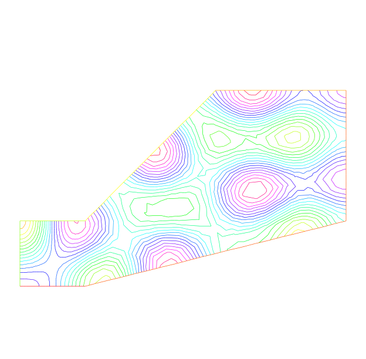
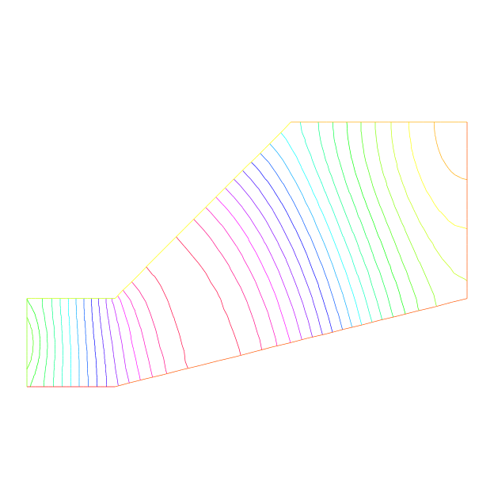

#Acoustics

**Summary :** _Here we go to grip with ill posed problems and eigenvalue problems_

Pressure variations in air at rest are governed by the wave equation:
\[
     {\p^2 u \over \p t^2} - c^2 \Delta u =0.
\]
When the solution wave is monochromatic (and that depend on the boundary and initial conditions),
$u$ is of the form
$u(x,t)=Re(v(x) e^{ik t})$ where $v$ is a solution of Helmholtz's equation:

\begin{eqnarray}
k ^{2}v  + c^{2}\Delta v  =0 ~\hbox{~in~}~~\Omega,
\frac{\p v}{\p n}|_\Gamma=g.
\end{eqnarray}

where $g$ is the source.
Note the "+" sign in front of the Laplace operator and that $k>0$ is real. This sign may make the problem ill posed for some values of $\frac c k$, a phenomenon called
"resonance".
At resonance there are non-zero solutions even when $g=0$. So the following program may or may not work:

```freefem
// file sound.edp
real kc2=1;
func g=y*(1-y);

border a0(t=0,1) { x= 5; y= 1+2*t ;}
border a1(t=0,1) { x=5-2*t; y= 3 ;}
border a2(t=0,1) { x= 3-2*t; y=3-2*t ;}
border a3(t=0,1) { x= 1-t; y= 1 ;}
border a4(t=0,1) { x= 0; y= 1-t ;}
border a5(t=0,1) { x= t; y= 0  ;}
border a6(t=0,1) { x= 1+4*t; y= t ;}

mesh Th=buildmesh( a0(20) + a1(20) + a2(20)
        + a3(20) + a4(20) + a5(20) + a6(20));
fespace Vh(Th,P1);
Vh u,v;

solve sound(u,v)=int2d(Th)(u*v * kc2 - dx(u)*dx(v) - dy(u)*dy(v))
                 - int1d(Th,a4)(g*v);
plot(u, wait=1, ps="sound.eps");
```

Results are on Fig. 3.3.  But when $kc2$ is an eigenvalue of the problem, then the
solution is not unique:
if $u_e \neq 0$ is an eigen state, then for any given solution $u+u_e$ is **another a** solution.

To find all the $u_e$ one can do the following :

```freefem
real sigma = 20; // Value of the shift
// OP = A - sigma B ; // The shifted matrix
varf  op(u1,u2)= int2d(Th)(  dx(u1)*dx(u2) + dy(u1)*dy(u2) - sigma* u1*u2 );
varf b([u1],[u2]) = int2d(Th)( u1*u2 ) ; // No Boundary condition see note \ref{note BC EV}

matrix OP= op(Vh,Vh,solver=Crout,factorize=1);
matrix B= b(Vh,Vh,solver=CG,eps=1e-20);

int nev=2; // Number of requested eigenvalues near sigma

real[int] ev(nev); // To store the  nev eigenvalue
Vh[int] eV(nev);   // To store the nev eigenvector

int k=EigenValue(OP,B,sym=true,sigma=sigma,value=ev,vector=eV,
                   tol=1e-10,maxit=0,ncv=0);
cout<<ev(0)<<" 2 eigen values "<<ev(1)<<endl;
v=eV[0];
plot(v,wait=1,ps="eigen.eps");
```

\begin{figure}[htbp]
\begin{center}
\includegraphics[width=8cm]{sound0}~~~
\includegraphics[width=8cm]{eigen}

| Fig. 3.X: Amplitude of an acoustic signal coming from the left vertical wall.| First eigen state ($\lambda=(k/c)^2=19.4256$) close to $20$ of eigenvalue problem :$ -\Delta \varphi = \lambda \varphi$ and $ \frac{\partial \varphi}{\partial n} = 0$ on $\Gamma$}|
|:----:|:----:|
|||


\caption{\label{figsound}Left:Amplitude of an acoustic signal coming from the left vertical wall.
Right:  first eigen state ($\lambda=(k/c)^2=19.4256$) close to $20$ of eigenvalue problem :$ -\Delta \varphi = \lambda \varphi$ and $ \frac{\partial \varphi}{\partial n} = 0$ on $\Gamma$}
\end{center}
\end{figure}

