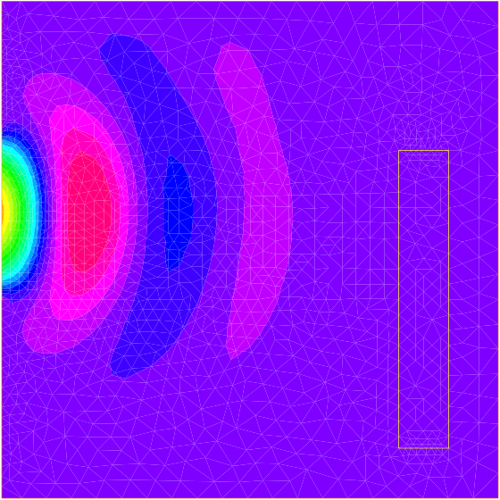
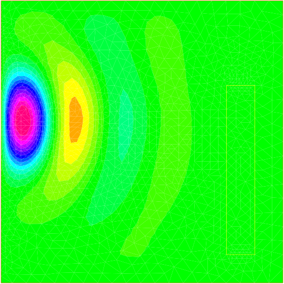
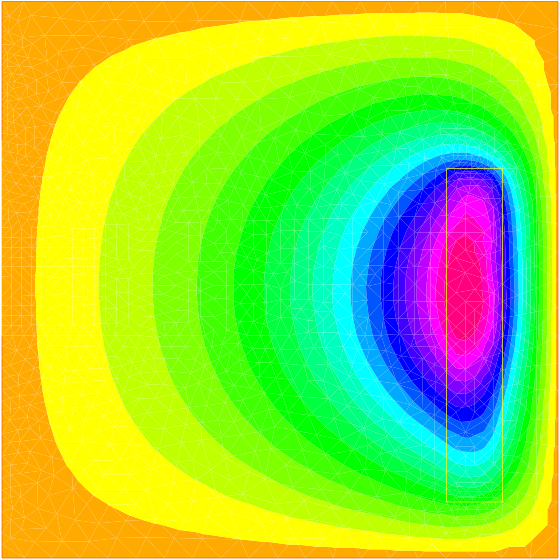

# An Example with Complex Numbers

In a microwave oven heat comes from molecular excitation by an
electromagnetic field. For a plane monochromatic wave, amplitude is
given by Helmholtz's equation:

$$ \beta v + \Delta v = 0.
$$

We consider a rectangular oven where the wave is emitted by part of
the upper wall. So the boundary of the domain is made up of a part
$\Gamma_1$ where $v=0$ and of another part $\Gamma_2=[c,d]$ where for
instance $v=\sin(\pi{y-c\over c-d})$.

Within an object to be cooked, denoted by $B$, the heat source is proportional to $v^2$. At equilibrium, one has :

$$-\Delta\theta = v^2 I_B, \quad \theta_\Gamma = 0
$$

where $I_B$ is $1$ in the object and $0$ elsewhere.

In the program below $\beta = 1/(1-I/2)$ in the air and $2/(1-I/2)$
in the object ($i=\sqrt{-1}$):

```freefem
// file muwave.edp
real a=20, b=20, c=15, d=8, e=2, l=12, f=2, g=2;
border a0(t=0,1) {x=a*t; y=0;label=1;}
border a1(t=1,2) {x=a; y= b*(t-1);label=1;}
border a2(t=2,3) { x=a*(3-t);y=b;label=1;}
border a3(t=3,4){x=0;y=b-(b-c)*(t-3);label=1;}
border a4(t=4,5){x=0;y=c-(c-d)*(t-4);label=2;}
border a5(t=5,6){ x=0; y= d*(6-t);label=1;}

border b0(t=0,1) {x=a-f+e*(t-1);y=g; label=3;}
border b1(t=1,4) {x=a-f; y=g+l*(t-1)/3; label=3;}
border b2(t=4,5) {x=a-f-e*(t-4); y=l+g; label=3;}
border b3(t=5,8) {x=a-e-f; y= l+g-l*(t-5)/3; label=3;}
int n=2;
mesh Th = buildmesh(a0(10*n)+a1(10*n)+a2(10*n)+a3(10*n)
        +a4(10*n)+a5(10*n)+b0(5*n)+b1(10*n)+b2(5*n)+b3(10*n));
plot(Th,wait=1);
fespace Vh(Th,P1);
real meat =  Th(a-f-e/2,g+l/2).region, air= Th(0.01,0.01).region;
Vh R=(region-air)/(meat-air);

Vh<complex> v,w;
solve muwave(v,w) = int2d(Th)(v*w*(1+R)
                -(dx(v)*dx(w)+dy(v)*dy(w))*(1-0.5i))
   + on(1,v=0) + on(2, v=sin(pi*(y-c)/(c-d)));
Vh vr=real(v), vi=imag(v);
plot(vr,wait=1,ps="rmuonde.ps", fill=true);
plot(vi,wait=1,ps="imuonde.ps", fill=true);

fespace Uh(Th,P1); Uh u,uu, ff=1e5*(vr^2 + vi^2)*R;

solve temperature(u,uu)= int2d(Th)(dx(u)* dx(uu)+ dy(u)* dy(uu))
     - int2d(Th)(ff*uu) + on(1,2,u=0);
plot(u,wait=1,ps="tempmuonde.ps", fill=true);
```

Results are shown on fig. 3.11

|Fig. 3.11: A microwave oven: real (top) and imaginary (middle) parts of wave  and temperature (bottom).|
|:----|
||
||
||


