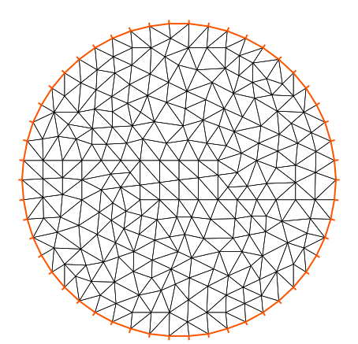
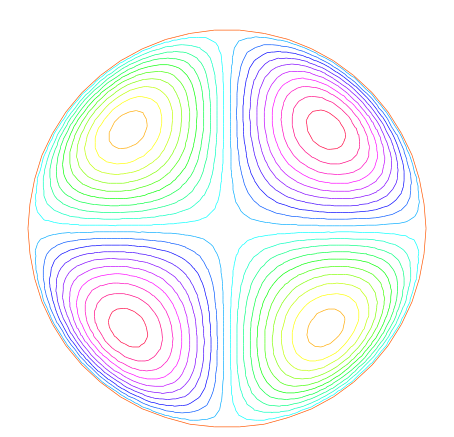
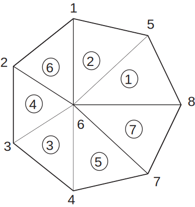
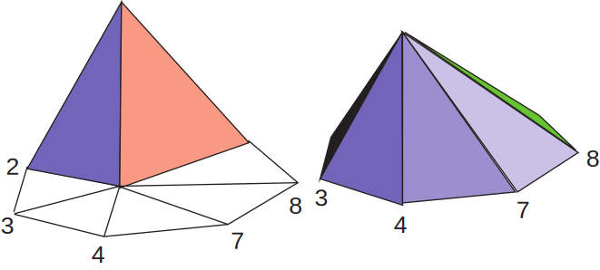
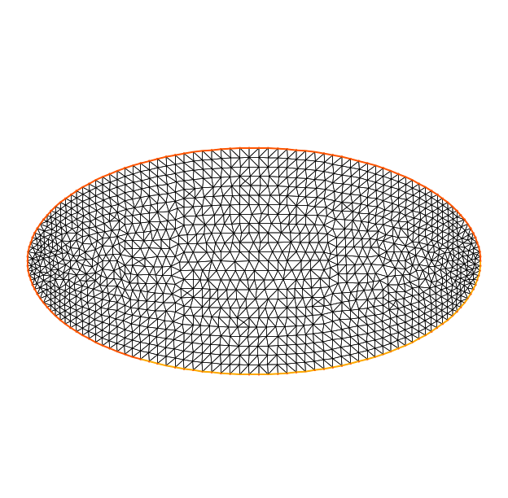
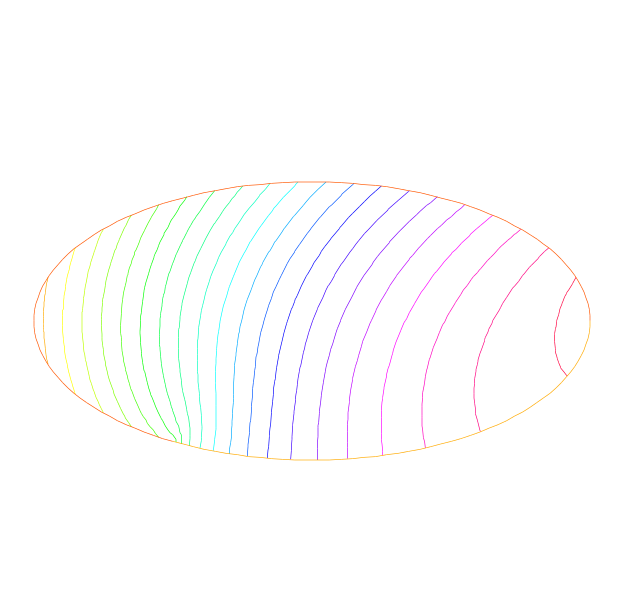
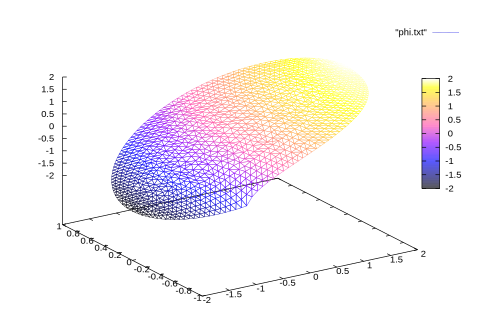

# Getting started

## Finite Elements

Currently FreeFem++ implements the following elements in 2d, (see section 6\ref{finite elements} for the full description)

`P0` piecewise constant,  
`P1` continuous piecewise linear,  
`P2` continuous piecewise quadratic,  
`P3` continuous piecewise cubic (need  `load "Element_P3"`).  
`P4` continuous piecewise quartic (need  `load "Element_P4"`).  
`RT0` Raviart-Thomas piecewise constant,  
`RT1` Raviart-Thomas degree 1  piecewise constant (need  `load "Element_Mixte"`).  
`BDM1` Brezzi-Douglas-Marini degree 1  piecewise constant (need  `load "Element_Mixte"`).     
`RT0Ortho` Nedelec type 1 degree 0  piecewise constant.  
`RT1Ortho` Nedelec type 1 degree 1  piecewise constant (need `load "Element_Mixte"`).  
`BDM1Ortho` Brezzi-Douglas-Marini degree 1  piecewise constant (need `load "Element_Mixte"`).  
`P1nc` piecewise linear non-conforming,  
`P1dc` piecewise linear discontinuous,  
`P2dc` piecewise quadratic discontinuous,  
`P2h` quadratic homogene continuous (without `P1`).  
`P3dc` piecewise cubic discontinuous (need `load "Element_P3dc"`).  
`P4dc` piecewise quartic discontinuous (need `load "Element_P4dc"`).  
`P1b` piecewise linear continuous plus bubble,  
`P2b` piecewise quadratic continuous plus bubble.  
`Morley` Morley finite element (need `load "Morley"`).  
`HCT` Hsieh-Clough-Tocher $C^1$ finite element (need `load "Element_HCT"` version 3.40).  
`P2BR` P2 Bernardi-Raugel finite element (need `load "BernadiRaugel.cpp"`).  
`P0edge` a finite element constant per edge  
`P1edge` to `P5edge`  a finite element polynomial  on edge (need `load "Element_PkEdge"`)  
...

Currently FreeFem++ implements the following elements in 3d, (see section \ref{finite elements} for the full description)

`P03d` piecewise constant,
`P13d` continuous piecewise linear,
`P23d` continuous piecewise quadratic,
`RT03d` Raviart-Thomas piecewise constant,
`Edge03d`,`Edge13d`,`Edge23d` The Nedelec Edge element 0,1,2 
`P1b3d` piecewise linear continuous plus bubble,
...

To get the full list, in a unix terminal, in directory **examples++-tutorial** do

```
FreeFem++ dumptable.edp
grep TypeOfFE lestables
```

Note that other elements can be added fairly easily.

## Solving Poisson’s equation  
_For a given function $f(x,y)$, find a function $u(x,y)$ satisfying_

$$\begin{eqnarray}
\label{eqn:Poisson}
-\Delta u(x,y) &=& f(x,y)\quad \mbox{ for all }(x,y)\in\Omega,
 \\ \label{eqn:Dirichlet}
  u(x,y) &=& 0\quad \mbox{ for all }(x,y)\mbox{ on }\p\Omega,.
\end{eqnarray}$$

Here $\p\Omega$ is the boundary of the bounded open set $\Omega\subset \R^2$
and  $\Delta u = \frac{\p^2 u}{\p x^2 } + \frac{\p^2 u}{\p y^2}$.

The following is a Freefem++ program which computes $u$ when
$f(x,y)=xy$  and $\Omega$ is the unit disk. The boundary
$C=\partial\Omega$ is
$$
C=\{(x,y)|\; x=\cos(t),\, y=\sin(t),\, 0\le t\le 2\pi\}
$$

Note that in FreeFem++ the domain $\Omega$ is assumed to described by its boundary
that is on the left side of its boundary oriented by the parameter.

As illustrated in Fig. 2.2,
we can see the isovalue of $u$ by using freefem++'s `plot` command (see line 13
below).

Figure 2.1: mesh Th by `build(C(50))` |  Figure 2.2: isovalue by `plot(u)`
:-------------------------:|:-------------------------:
  |  

```freefem
// Define mesh boundary
border C(t=0, 2*pi){x=cos(t); y=sin(t);}

// The triangulated domain Th is on the left side of its boundary
mesh Th = buildmesh(C(50));

// The finite element space defined over Th is called here Vh
fespace Vh(Th, P1);
Vh u, v;// Define u and v as piecewise-P1 continuous functions

// Define a function f
func f= x*y;

// Get the clock in second
real cpu=clock();

// Define the PDE
solve Poisson(u, v, solver=LU)
	= int2d(Th)(	// The bilinear part
		  dx(u)*dx(v)
		+ dy(u)*dy(v)
	)
	- int2d(Th)(	// The right hand side
		  f*v
	)
	+ on(C, u=0);	// The Dirichlet boundary condition

// Plot the result
plot(u);

// Display the total computational time
cout << "CPU time = " << (clock()-cpu) << endl;
```

Note that the qualifier `solver=LU` is not required and by default a
multi-frontal `LU` would have been used. Note also that the lines
containing `clock` are equally not required. Finally note how
close to the mathematics FreeFem++ input language is. Lines 19 to 24
correspond to the mathematical variational equation
\[
    \int_{T_h}(\frac{\p u}{\p x}\frac{\p v}{\p x}
    +\frac{\p u}{\p y}\frac{\p v}{\p
    y})\d x \d y
    =
   \int_{T_h}f v\d x\d y
\]
for all $v$ which are in the finite element space $V_h$ and zero on
the boundary $C$.


Exercise:
Change `P1` into `P2` and run the program.


This first example shows how FreeFem++ executes with no effort all
the usual steps required by the finite element method (FEM). Let's
go through them one by one.

**On the first line,** the boundary $\Gamma$ is described analytically
by a parametric equation for $x$ and for $y$. When
$\Gamma=\sum_{j=0}^J \Gamma_j$ then each curve $\Gamma_j$, must be
specified and crossings of $\Gamma_j$ are not allowed except at end
points .

The keyword `label` can be added to define a group
of boundaries for later use (boundary conditions for instance).
 Hence the circle could also have been described as two half circle with
 the same label:

```freefem
border Gamma1(t=0,pi)   {x=cos(t); y=sin(t); label=C}
border Gamma2(t=pi,2*pi){x=cos(t); y=sin(t); label=C}
```

Boundaries can be referred to  either by name `Gamma1` for example) or by label (`C` here)
or even by its internal number here 1 for the first half circle and 2 for the second
(more examples are in $\refSec{Meshing Examples}$).

**On the 2nd line,** the triangulation $\mathcal{T}_h$ of $\Omega$ is
automatically generated  by `buildmesh(C(50))` using 50
points on `C` as in Fig. 2.1

The domain is assumed to be on the left side of the boundary which is implicitly
oriented by the parametrization. So an elliptic hole can be added by

```freefem
border C(t=2*pi,0){x=0.1+0.3*cos(t); y=0.5*sin(t);}
```

If by mistake one had written
```freefem
border C(t=0,2*pi){x=0.1+0.3*cos(t); y=0.5*sin(t);}
```

then the inside of the ellipse would be triangulated as well as the outside.

Automatic mesh generation is
based on the Delaunay-Voronoi algorithm. Refinement of the mesh are
done by increasing the number of points on $\Gamma$, for example,
`buildmesh(C(100))`, because inner vertices are determined
by the density of points on the boundary. Mesh adaptation can be performed also
against a given function `f` by calling `adaptmesh(Th,f)`.

Now the name $\mathcal{T}_h$ (`Th` in FreeFem++) refers to
the family $\{T_k\}_{k=1,\cdots,n_t}$ of triangles shown in fig. 2.1.
Traditionally  $h$ refers to the mesh size, $n_t$ to the number of
triangles in $\mathcal{T}_h$ and $n_v$ to the number of vertices, but it is seldom
that we will have to use them explicitly.
If $\Omega$ is not a polygonal domain, a "skin" remains between
the exact domain $\Omega$ and its approximation $\Omega_h=\cup_{k=1}^{n_t}T_k$.
However, we notice that all corners of $\Gamma_h = \p\Omega_h$ are
on $\Gamma$.

**On the 3rd line:** A finite element space is, usually, a space of
polynomial functions on elements, triangles here only, with certain matching properties
at edges, vertices etc.  Here `fespace Vh(Th,P1)` defines $V_h$ to be the
space of continuous functions which are affine in $x,y$ on each triangle of $T_h$.  As it is a
linear vector space of finite dimension, basis can be found.
The canonical basis is made of functions, called the _hat function_ $\phi_k$ which are continuous piecewise affine and are equal to 1 on one vertex and 0 on all others. A typical hat function is shown on figure 2.4 

Figure 2.3: `mesh Th` |  Figure 2.4: Graph of $\phi_1$ (left) and $\phi_6$
:-------------------------:|:-------------------------:
  |  

!!! info
	The easiest way to define $\phi_k$ is by making use of the _barycentric coordinates_ $\lambda_i(x,y),~i=1,2,3$ of a point $q=(x,y)\in T$, defined by
	$\sum_i\lambda_i=1,~~~\sum_i\lambda_i\vec q^i=\vec q$
	where $q^i,~i=1,2,3$ are the 3 vertices of $T$. Then it is easy to see that the restriction of $\phi_k$ on $T$ is precisely $\lambda_k$.

Then
\begin{equation}\label{equation3}
V_h(\mathcal{T}_h,P_1)=\left\{w(x,y)\left|\;
w(x,y)=\sum_{k=1}^{M}w_k\phi_k(x,y),\, w_k\textrm{ are real numbers}\right.\right\}
\end{equation}

where $M$ is the dimension of $V_h$, i.e. the number of vertices.
The $w_k$ are called the _degree of freedom_ of $w$ and $M$ the number of
the degree of freedom.

It is said also that the _nodes_ of this finite element method
are the vertices.

**Step3: Setting the problem**
On line 4, `Vh u,v` declares that $u$ and $v$ are approximated as above, namely

\begin{equation}\label{defu}
u(x,y)\simeq u_h(x,y)=\sum_{k=0}^{M-1} u_k\phi_k(x,y)
\end{equation}

On the line 5, the right hand side `f` is defined analytically using the keyword
`func`.

Line 7 to 9 define the bilinear form of equation (\ref{eqn:Poisson}) and
its Dirichlet boundary conditions (\ref{eqn:Dirichlet}).

This _variational formulation_ is derived by multiplying (\ref{eqn:Poisson}) by $v(x,y)$ and integrating the result over $\Omega$:
$$
-\int_{\Omega}v\Delta u \,\d x\d y = \int_{\Omega} vf\, \d x\d y
$$

Then, by Green's formula, the problem  is converted into finding $u$
such that

\begin{eqnarray}\label{eqn:weakform}
&&a(u,v) - \ell(f,v) = 0
\qquad \forall v \hbox{ satisfying $v=0$ on }\p\Omega.\\
&&\hbox{with }a(u,v)=\int_{\Omega}\nabla u\cdot \nabla v \,\d x\d y ,
\quad \ell(f,v)=\int_{\Omega}fv\, \d x\d y
\label{eqn:bilinear}
\end{eqnarray}

In FreeFem++
the **Poisson** problem can be  declared only as in

```freefem
  Vh u,v; problem Poisson(u,v) =
```

and solved later as in

```freefem
  Poisson; //   the problem is solved here
```

or declared and solved at the same time as in

```freefem
Vh u,v; solve Poisson(u,v) =int(...
```

and (\ref{eqn:weakform}) is written with `dx(u)` $=\p u/\p x$, `dy(u)` $=\p u/\p y$ and


$\displaystyle{\int_{\Omega}\nabla u\cdot \nabla v\, \d x\d y \longrightarrow}$ `:::freefem int2d(Th)( dx(u)*dx(v) + dy(u)*dy(v) )`


$\displaystyle{\int_{\Omega}fv\, \d x\d y \longrightarrow}$ `:::freefem int2d(Th)( f*v )` (Notice here, $u$ is unused)


In FreeFem++ **bilinear terms and linear terms should not be under the same integral** indeed to construct the linear systems
 FreeFem++ finds out which integral contributes to the bilinear form by checking if both terms , the unknown (here `u`) and test functions (here `v`) are present.

**Step4: Solution and visualization**

On line 6, the current time in seconds is stored into the real-valued variable `cpu`.

Line 7, the problem is solved.

Line 11, the visualization is done as illustrated in Fig. 2.2
**(see \refSec{Plot} for zoom, postscript and other commands).**

Line 12, the computing time (not counting graphics) is written on the console.
Notice the C++-like syntax; the user needs not study C++ for using FreeFem++,
but it helps to guess what is allowed in the language.

**Access to matrices and vectors**

Internally FreeFem++ will solve a linear system of the type

\begin{eqnarray}
\label{eqn:Equation}
\sum_{j=0}^{M-1} A_{ij}u_j - F_i=0 ,\quad i=0,\cdots,M-1;\qquad
F_i=\int_{\Omega}f\phi_i\, \d x\d y
\end{eqnarray}

which is found by using (\ref{defu}) and replacing $v$ by $\phi_i$ in (\ref{eqn:weakform}).
The Dirichlet conditions are implemented by penalty, namely by setting $A_{ii}=10^{30}$  and $F_i=  10^{30}*0$ if $i$ is a boundary degree of freedom.

!!! info 
	The number $10^{30}$ is called `tgv` (_très grande valeur_ or _very high value_ in english) and it is generally possible to change this value, see the item `solve!tgv=`

The matrix $A=(A_{ij})$ is called _stiffness matrix_.
If the user wants to access $A$ directly he can do so
by using (see section \ref{matrix-varf} page \pageref{matrix-varf} for details)

```freefem
varf a(u,v) = int2d(Th)( dx(u)*@dx(v) + dy(u)*dy(v)) + on(C,u=0);
matrix A=a(Vh,Vh); // stiffness matrix
```

The vector $F$ in (\ref{eqn:Equation}) can also be constructed manually

```freefem
varf l(unused,v) = int2d(Th)(f*v) + on(C,unused=0);
Vh F;  F[] = l(0,Vh); // F[] is the vector associated to the function F
```

The problem can then be solved by

```freefem
u[]=A^-1*F[]; //u[] is the vector associated to the function u
```


!!! info
	Here `u` and `F` are finite element function, and  `u[]` and `F[]` give the array 	of value associated (`u[]` $\equiv (u_i)_{i=0,\dots,M-1}$ and
	`F[]` $\equiv (F_i)_{i=0,\dots,M-1}$).
	So we have
	$$
	\mathtt{u}(x,y) = \sum_{i=0}^{M-1} \mathtt{u[][}i\mathtt{]} \phi_i(x,y) ,
	\qquad \mathtt{F}(x,y) = \sum_{i=0}^{M-1} \mathtt{F[][}i\mathtt{]} \phi_i(x,y)
	$$
	where $\phi_i, i=0...,,M-1$ are the basis functions of `Vh` like in equation (\ref{equation3}), and $M = \mathtt{Vh.ndof}$ is the number of degree of freedom (i.e. the dimension of the space `Vh`).

The linear system (\ref{eqn:Equation}) is solved by `UMFPACK`
unless another option is mentioned specifically  as in
```freefem
Vh u,v; problem Poisson(u,v,solver=CG) = int2d(...
```
meaning that `Poisson` is declared only here and when it is called (by simply writing `Poisson;`) then (\ref{eqn:Equation}) will be solved by the Conjugate Gradient method.

## Some Features of FreeFem++

The language of FreeFem++ is typed, polymorphic and reentrant with macro generation (see
\ref{macro}). Every variable must be typed and declared in a
statement each statement separated from the next by a semicolon ";".
The syntax is that of C++ by default augmented with something that is more akin
to $TeX$.
For the specialist, one key guideline is that FreeFem++ rarely generates an internal
finite element  array;
this was adopted for speed and
consequently FreeFem++ could be hard to beat in terms of execution speed, except
for the time lost in the interpretation of the language (which can be reduced by a systematic usage
of `varf` and matrices instead of `problem`.


## The Development Cycle: Edit--Run/Visualize--Revise

An integrated environment is provided with FreeFem++ by A. Le Hyaric;
Many examples and tutorials are also given along with this documentation and it is best
to study them and learn by example.
Explanations for some of these examples are given in this documentation in the next chapter. If you are a
FEM beginner, you may also have to read a book on variational formulations.

The development cycle will have the following steps:

**Modeling:** From strong forms of PDE to weak forms, one must know the variational formulation
to use FreeFem++; one should also have an eye on the reusability of the variational
formulation so as to keep the same internal matrices; a typical example is the
time dependent heat equation with an implicit time scheme: the internal matrix can be factorized
only once and FreeFem++ can be taught to do so.

**Programming:** Write the code in FreeFem++ language using a text editor such as the one
provided in the integrated environment.

**Run:** Run the code (here written in file mycode.edp).
note that this can also be done in terminal mode by :

`% FreeFem++ mycode.edp`


**Visualization:** Use the keyword `plot` to display functions while FreeFem++ is running.
Use the plot-parameter `wait=1` to stop the program at each plot. Use the
plot-parameter `ps="toto.eps"` to generate a postscript file to archive the results.

**Debugging:** A global variable "debug" (for example) can help as in
`wait=true` to `wait=false`.

```freefem
bool debug = true;
border a(t=0,2*pi){ x=cos(t); y=sin(t);label=1;}
border b(t=0,2*pi){ x=0.8+0.3*cos(t); y=0.3*sin(t);label=2;}
plot(a(50)+b(-30),wait=debug); // plot the borders  to see the intersection
// so change (0.8 in 0.3 in b) then needs a mouse click
mesh Th = buildmesh(a(50)+b(-30));
plot(Th,wait=debug); // plot Th then needs a mouse click
fespace Vh(Th,P2);
Vh f = sin(pi*x)*cos(pi*y);
plot(f,wait=debug);  // plot the function f
Vh g = sin(pi*x + cos(pi*y));
plot(g,wait=debug);  // plot the function g
```
Changing debug to false will make the plots flow continuously;  watching the flow of graphs
on the screen (while drinking coffee) can then become a pleasant experience.

Error messages are displayed in the console window. They are not always very explicit because of the
template structure of the C++ code, (we did our best)!  Nevertheless they are displayed at the right place.
For example, if you forget parenthesis as in

```freefem
bool debug = true;
mesh Th = square(10,10);
plot(Th);
```

then you will get the following message from FreeFem++,

```freefem
    2 : mesh Th = square(10,10);
 Error line number 2, in file bb.edp, before  token ;
parse error
  current line = 2
Compile error : parse error
        line number :2, ;
error Compile error : parse error
        line number :2, ;
 code = 1
```

If you use the same symbol twice as in

```freefem
real aaa =1;
real aaa;
```

then you will get the message

```freefem
    2 : real aaa; The identifier aaa exists
          the existing type is <Pd>
          the new  type is <Pd>

```

If you find that the program isn't doing what you want you may also use `cout`
to display in text format on the console window the value of variables, just as you would do in C++.

The following example works:

```freefem
...;
@fespace Vh...; Vh u;...
cout<<u;...
@matrix A=a(Vh,Vh);...
cout<<A;
```

Another trick is to _comment in and out_ by using the "//" as in C++.
For example

```freefem
real aaa =1;
// real aaa;
```

## Membranes

**Summary :** _Here we shall learn how to solve a Dirichlet and/or
mixed Dirichlet Neumann problem for the Laplace operator with
application to the equilibrium of a membrane under load.  We shall
also check the accuracy of the method and interface with other graphics packages_

An elastic membrane $\Omega$ is attached to a planar rigid support
$\Gamma$, and a force $f(x) dx$ is exerted on each surface element
$\d{x}=\d{x}_1 \d{x}_2$. The vertical membrane displacement,
$\varphi(x)$, is  obtained by solving  Laplace's equation:

$$
     -\Delta \varphi =f ~\hbox{in}~ \Omega.
$$

As the membrane is fixed to its planar support, one has:
$$ \varphi |_{\Gamma }=0.$$

If the support wasn't planar but at an elevation $z(x_1,x_2)$ then
the boundary conditions would be of non-homogeneous Dirichlet type.
$$ \varphi|_{\Gamma}=z.$$

If a part $\Gamma_2$ of the membrane border $\Gamma$ is not fixed to
the support but is left hanging, then due to the membrane's rigidity the angle with the
normal vector $n$ is zero; thus the boundary conditions are

$$
    \varphi|_{\Gamma_1}=z,~~~~\frac{\p\varphi}{\p n}|_{\Gamma_2}=0
$$

where $\Gamma_1=\Gamma-\Gamma_2$; recall that
 $\frac{\p\varphi}{\p n}=\n\varphi\cdot n$.
  Let us recall also that the Laplace operator
$\Delta$ is defined by:

$$
    \Delta \varphi = {\p ^{2}\varphi \over \p x^{2}_{1} }
    + {\p ^{2}\varphi \over \p x_{2}^{2} }.
$$

With such "mixed boundary conditions" the problem has a unique
solution (**see (1987)**, Dautray-Lions (1988), Strang (1986) and
Raviart-Thomas (1983)); the easiest proof is to notice that
$\varphi$ is the state of least energy, i.e.

 $$
    E(\phi) =\min_{\varphi-z\in V} E(v) ,\quad \mbox{with} \quad E(v)=\int_\Omega(\frac12|\n v|^2-fv )
 $$

and where  $V$ is the subspace of the Sobolev space $H^1(\Omega)$ of
functions which have zero trace on $\Gamma_1$.  
Recall that ($x\in\R^d,~d=2$ here)

$$
    H^1(\Omega)=\{u\in L^2(\Omega)~:~\n u\in (L^2(\Omega))^d\}
$$

Calculus of variation shows that the minimum must satisfy, what is known as the weak form
of the PDE or its
variational formulation (also known here as the theorem of virtual work)

$$
    \int_\Omega \n\varphi\cdot\n w = \int_\Omega f w\quad\forall w\in V
$$

Next an integration by parts (Green's formula) will show that this is equivalent to
the PDE when second derivatives exist.

!!! warning
	Unlike Freefem+ which had both weak and strong forms, FreeFem++ implements only weak formulations. It is not possible to go further in using this software if you don't know the weak form (i.e. variational formulation) of your problem: either you read a book, or ask help form a colleague or drop the matter. Now if you want to solve a system of PDE like $A(u,v)=0,~ B(u,v)=0$ don't close this manual, because in weak form it is
	$$
    	\int_\Omega(A(u,v)w_1+B(u,v)w_2)=0~~\forall w_1,w_2...
	$$

**Example**

Let an ellipse have the length of the semimajor axis $a=2$, and unitary the semiminor axis
Let the surface force be $f=1$. Programming this case with FreeFem++ gives:

```freefem
// file membrane.edp
real theta=4.*pi/3.;
real a=2.,b=1.; // The length of the semimajor axis and  semiminor axis
func z=x;

border Gamma1(t=0,theta)    { x = a * cos(t); y = b*sin(t); }
border Gamma2(t=theta,2*pi) { x = a * cos(t); y = b*sin(t); }
mesh Th=buildmesh(Gamma1(100)+Gamma2(50));

fespace Vh(Th,P2); // P2 conforming triangular FEM
Vh phi,w, f=1;

solve Laplace(phi,w)=int2d(Th)(dx(phi)*dx(w) + dy(phi)*dy(w))
                - int2d(Th)(f*w) + on(Gamma1,phi=z);
plot(phi,wait=true, ps="membrane.eps"); //Plot phi
plot(Th,wait=true, ps="membraneTh.eps"); //Plot Th

savemesh(Th,"Th.msh");
```

Figure 3.1: Mesh and level lines of the membrane deformation. | Below the 3D version drawn by `gnuplot` from a file generated by FreeFem++  
:-------------------------:|:-------------------------:
  |  
  ||

A triangulation is built by the keyword `buildmesh`. This keyword
calls a triangulation subroutine based on the Delaunay test, which
first triangulates with only the boundary points, then adds internal
points by subdividing the edges. How fine  the triangulation becomes is controlled
by the size of the closest boundary edges.

The PDE is then discretized using the triangular second order finite
element method on the triangulation; as was briefly indicated in the previous chapter,
a linear system is derived from the discrete formulation whose size is the number of vertices plus the number of mid-edges in the triangulation. The system is solved by a multi-frontal Gauss LU factorization implemented in the package `UMFPACK`. The keyword plot will display both $\T_h$ and $\varphi$ (remove `Th` if $\varphi$ only is desired) and the qualifier `fill=true` replaces the default option (colored level lines) by a full color display.
Results are on fig. 3.1.

```freefem
plot(phi,wait=true,fill=true); //Plot phi with full color display
```

Next we would like to check the results !

One simple way is to adjust the parameters so as to know the solutions. For instance
on the unit circle `a=1` , $\varphi_e=\sin(x^2+y^2-1)$ solves the problem when

\[
    z=0,~f=-4(\cos(x^2+y^2-1)-(x^2+y^2)\sin(x^2+y^2-1))
\]

except that on $\Gamma_2$ $\p_n\varphi=2$ instead of zero. So we will consider
a non-homogeneous Neumann condition and solve

$$
    \int_\Omega(\n\varphi\cdot\n w = \int_\Omega f w+\int_{\Gamma_2}2w\quad\forall w\in V
$$

We will do that with two triangulations, compute the $L^2$ error:

\[
\epsilon = \int_\Omega|\varphi-\varphi_e|^2
\]

and print the error in both cases as well as the log of their ratio an indication of
the rate of convergence.

```freefem
// file membranerror.edp
verbosity =0; // to remove all default output
real theta=4.*pi/3.;
real a=1.,b=1.; // the length of the semimajor axis and  semiminor axis
border Gamma1(t=0,theta)    { x = a * cos(t); y = b*sin(t); }
border Gamma2(t=theta,2*pi) { x = a * cos(t); y = b*sin(t); }

func f=-4*(cos(x^2+y^2-1) -(x^2+y^2)*sin(x^2+y^2-1));
func phiexact=sin(x^2+y^2-1);

real[int] L2error(2); // an array two values
for(int n=0;n<2;n++)
{
  mesh Th=buildmesh(Gamma1(20*(n+1))+Gamma2(10*(n+1)));
  fespace Vh(Th,P2);
  Vh phi,w;

  solve laplace(phi,w)=int2d(Th)(dx(phi)*dx(w) + dy(phi)*dy(w))
    - int2d(Th)(f*w) - int1d(Th,Gamma2)(2*w)+ on(Gamma1,phi=0);
  plot(Th,phi,wait=true,ps="membrane.eps"); //Plot Th and phi

  L2error[n]= sqrt(int2d(Th)((phi-phiexact)^2));
}

for(int n=0;n<2;n++)
 cout << " L2error " << n << " = "<<  L2error[n] <<endl;

cout <<" convergence rate = "<< log(L2error[0]/L2error[1])/log(2.)  <<endl;
```

the output is

```freefem
L2error 0 = 0.00462991
L2error 1 = 0.00117128
convergence rate = 1.9829
times: compile 0.02s, execution 6.94s
```

We find a rate of 1.93591, which is not close enough to the 3 predicted by the theory.
The Geometry is always a polygon so we lose one order due to the geometry approximation in $O(h^2)$

Now if you are not satisfied with the `.eps` plot generated by FreeFem++ and you want to use other graphic facilities, then you must store the solution in a file very much like in `C++`. It will be useless if you don't save the triangulation as well, consequently you must do

```freefem
{
  ofstream ff("phi.txt");
  ff << phi[];
}
savemesh(Th,"Th.msh");
```

For the triangulation the name is important: it is the extension that determines the format.

Still that may not take you where you want. Here is an interface with gnuplot to produce the right part of fig. 3.2.

```freefem
// to build a gnuplot data file
{
  ofstream ff("graph.txt");
   for (int i=0;i<Th.nt;i++)
   {
    for (int j=0; j <3; j++)
     ff<<Th[i][j].x  << "    "<< Th[i][j].y<< "  "<<phi[][Vh(i,j)]<<endl;
    
    ff<<Th[i][0].x  << "    "<< Th[i][0].y<< "  "<<phi[][Vh(i,0)]<<"\n\n\n"
   }
}
```

We use the finite element numbering, where `Wh(i,j)` is the global index of
$j^{Th}$  degrees of freedom of triangle number $i$.

Then open `gnuplot` and do

```freefem
set palette rgbformulae 30,31,32
splot "graph.txt" w l pal
```

This works with `P2` and `P1`, but not with `P1nc`
because the 3 first degrees of freedom  of  `P2` or `P2` are on vertices
and not with `P1nc`.
