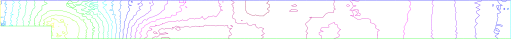

# A projection algorithm for the Navier-Stokes equations

**Summary :** _Fluid flows require good algorithms and good triangultions. We show
here an example of a complex algorithm and or first example of mesh adaptation._

An incompressible viscous fluid satisfies:

$$ \p _t u + u\cdot\nabla u + \nabla p - \nu\Delta u = 0,\quad  \nabla\cdot u=0
\quad  \hbox{ in } \Omega\times ]0,T[,
$$

$$ u|_{t=0} = u^0,\quad  u|_\Gamma = u_\Gamma.
$$

A possible algorithm, proposed by Chorin, is :

$$ {1\over \delta t}[u^{m+1} - u^moX^m] + \nabla p^m -\nu\Delta u^m= 0,\quad  u|_\Gamma = u_\Gamma, \nu \p_n u|_{\Gamma_{out}}=0 
$$

$$ -\Delta p^{m+1} = -\nabla\cdot  u^moX^m, \quad  \p _n p^{m+1} = 0 \mbox{ on } \Gamma , p^{m+1} = 0 \mbox{ on } \Gamma_{out}
$$

where $uoX(x) = u(x-u(x)\delta t)$ since $\p _t u + u\cdot\nabla
u $ is approximated by the method of characteristics, as in the previous section.

We use the Chorin's algorithm with free boundary condition  at outlet (i.e.  $p=0,\nu \p_n u = 0$),  to compute a correction, q,
to the pressure. 
\[
    -\Delta q= \n\cdot\vec u ,  \quad q=0 \mbox{ on } \Gamma_{out}
\]
and define
\[
    u^{m+1}=\tilde u + P \n q\delta t,~~~p^{m+1}=p^m-q
\]
where $\tilde u$ is the $(u^{m+1},v^{m+1})$ of Chorin's algorithm,
and  where $P$ is the  $L^2$ projection with mass lumping ( a sparse matrix). 

**The backward facing step**

The geometry is that of a channel with a backward facing step so that
the inflow section is smaller than the outflow section. This geometry
produces a fluid recirculation zone that must be captured correctly.

This can only be done if the triangulation is sufficiently fine, or
well adapted to the flow.

Remark (FH), The are a technical difficulty is the example, is the output B.C., here 
we put $p=0$ and $ \nu \p_n u = 0$.  

```freefem
// file NSprojection.edp
// Version july 2014, 
// FH. Change B.C on u on outpout , more simple .. 
// ............
verbosity=0;
border a0(t=1,0){ x=-2;      y=t;      label=1;}
border a1(t=-2,0){ x=t;    y=0;        label=2;}
border a2(t=0,-0.5){ x=0;      y=t;       label=2;}
border a3(t=0,1){ x=18*t^1.2;  y=-0.5;       label=2;}
border a4(t=-0.5,1){ x=18;     y=t;   label=3;}
border a5(t=1,0){ x=-2+20*t; y=1;        label=4;}
int n=1;
mesh Th= buildmesh(a0(3*n)+a1(20*n)+a2(10*n)+a3(150*n)+a4(5*n)+a5(100*n));

plot(Th);
fespace Vh(Th,P1);
real nu = 0.0025, dt = 0.2; // Reynolds=200

Vh w,u = 0, v =0, p = 0, q=0;

real epsv = 1e-6, epsu = 1e-6, epsp = 1e-6;// Eps CG ..

// Definition of Matrix dtMx and dtMy
matrix dtM1x,dtM1y;
 
macro  BuildMat()
 { /* for memory managenemt */
   varf vM(unused,v) = int2d(Th)(v) ;
   varf vdx(u,v) = int2d(Th)(v*dx(u)*dt) ;
   varf vdy(u,v) = int2d(Th)(v*dy(u)*dt) ;

   real[int] Mlump = vM(0,Vh); 
   real[int] one(Vh.ndof); one = 1;  
   real[int] M1 =  one ./ Mlump; 
   matrix dM1 = M1;
   matrix Mdx = vdx(Vh,Vh);
   matrix Mdy = vdy(Vh,Vh);
   dtM1x = dM1*Mdx;
   dtM1y = dM1*Mdy; 
 }// EOF \hfilll
 
BuildMat

real err=1, outflux=1;
for(int n=0;n<300;n++)
 {	
  Vh uold = u,  vold = v, pold=p;
  
  solve pb4u(u,w,init=n,solver=CG,eps=epsu)
        =int2d(Th)(u*w/dt +nu*(dx(u)*dx(w)+dy(u)*dy(w)))
        -int2d(Th)((convect([uold,vold],-dt,uold)/dt-dx(p))*w)
        + on(1,u = 4*y*(1-y)) + on(2,4,u = 0) ; // Neuman on $Gamma_3$
       
  plot(u);

  solve pb4v(v,w,init=n,solver=CG,eps=epsv)
        = int2d(Th)(v*w/dt +nu*(dx(v)*dx(w)+dy(v)*dy(w)))
        -int2d(Th)((convect([uold,vold],-dt,vold)/dt-dy(p))*w)
        +on(1,2,3,4,v = 0);

 solve pb4p(q,w,solver=CG,init=n,eps=epsp) = int2d(Th)(dx(q)*dx(w)+dy(q)*dy(w))
    - int2d(Th)((dx(u)+ dy(v))*w/dt)+ on(3,q=0);

 // To have absolute epsilon in CG algorithm. 
  epsv = -abs(epsv);
  epsu = -abs(epsu);
  epsp = -abs(epsp);

  p = pold-q;
  u[] += dtM1x*q[];
  v[] += dtM1y*q[];
 
  
  if(n%50==49){
    Th = adaptmesh(Th,[u,v],q,err=0.04,nbvx=100000);
    plot(Th, wait=true);
    BuildMat // Rebuild mat.   
 }
 
  err = sqrt(int2d(Th)(square(u-uold)+square(v-vold))/Th.area) ;
  outflux = int1d(Th)( [u,v]'*[N.x,N.y]) ;
  cout << " iter " << n << " Err L2 = " << err 
       <<  " flux sortant = "<< outflux << endl; 
  if(err < 1e-3) break;
}
assert(abs(outflux)< 2e-3); // Verification ... 
plot(p,wait=1,ps="NSprojP.eps");
plot(u,wait=1,ps="NSprojU.eps");
```

We show in fig. 3.9 the numerical results obtained for a Reynolds number of 400 where mesh adaptation is done after 50 iterations on the first mesh.

|Fig. 3.9: Rannacher's projection algorithm: result on an adapted mesh (top) showing the pressure (middle) and the horizontal velocity $u$ at Reynolds 400.|
|:----:|
||
||
||


