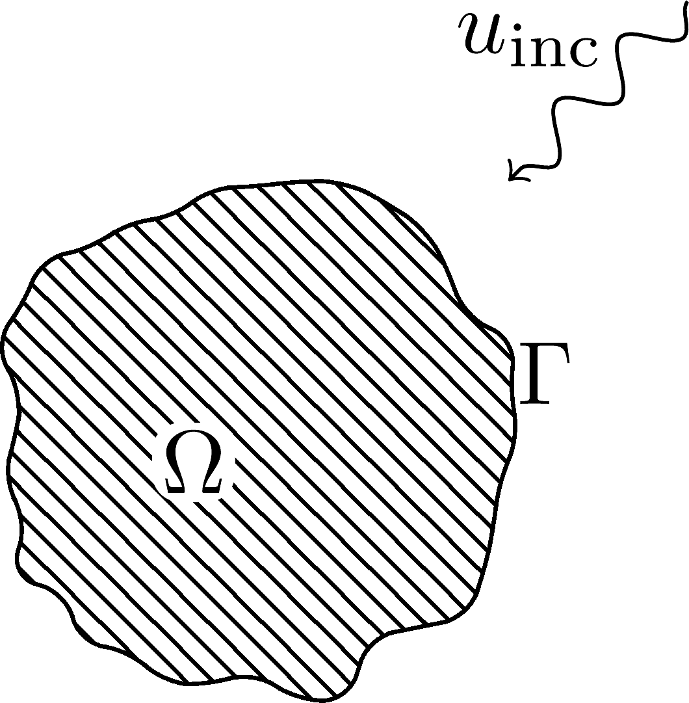
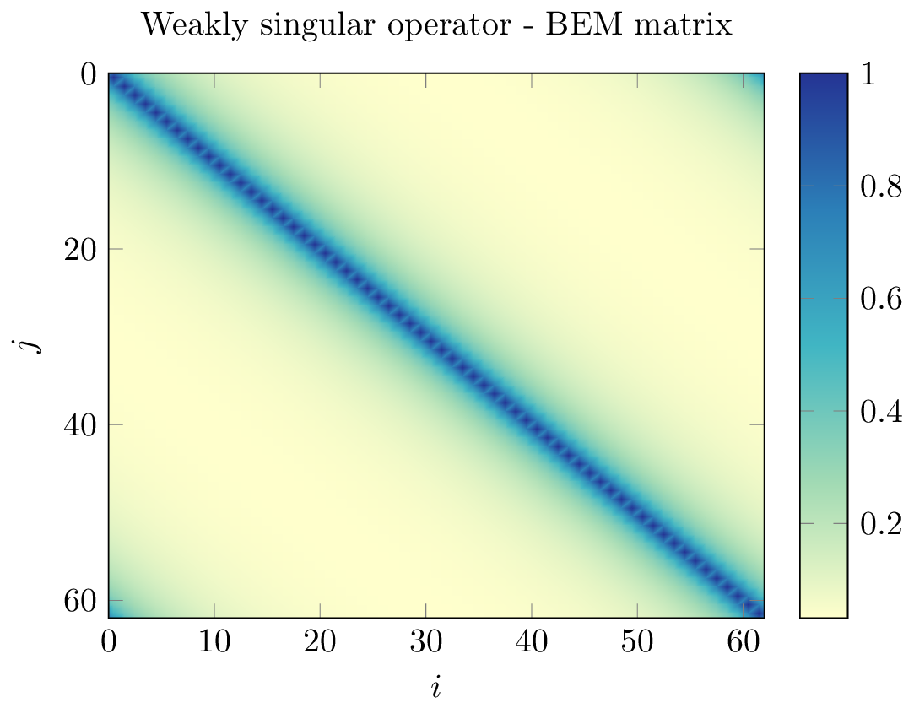
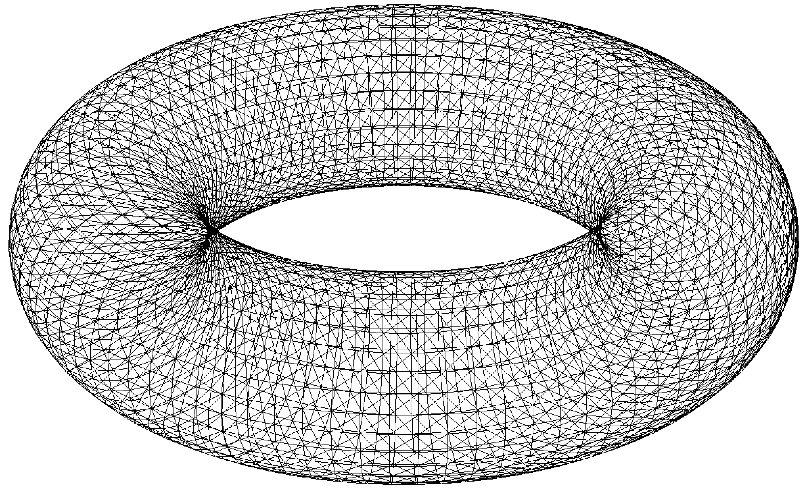
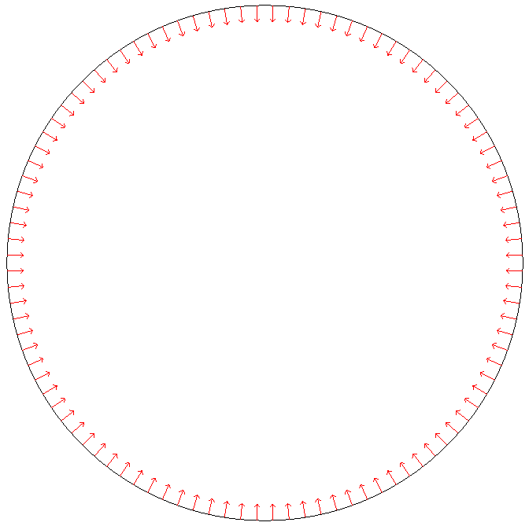
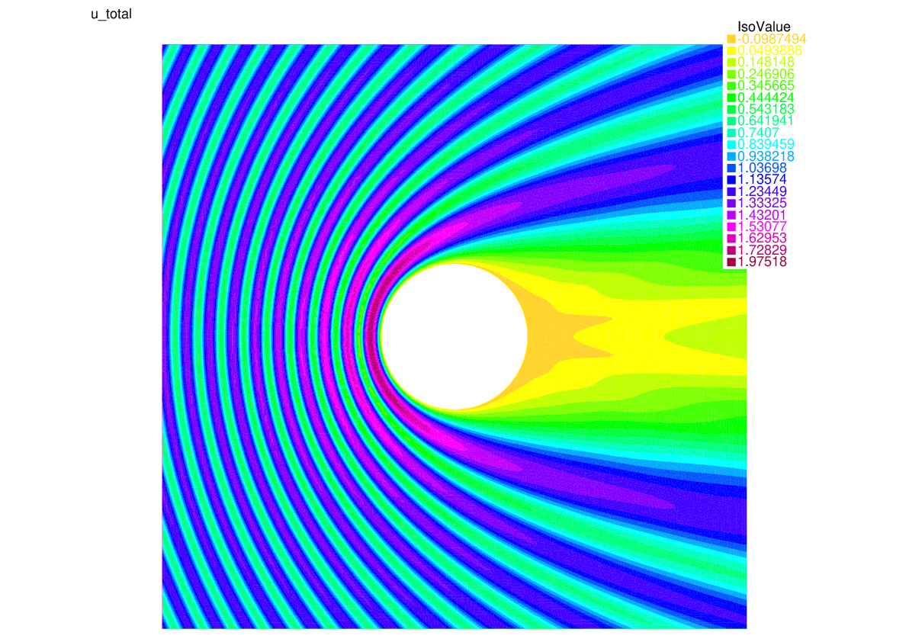
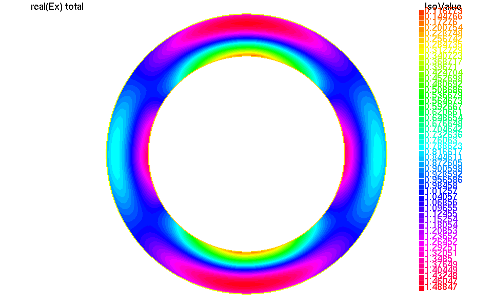
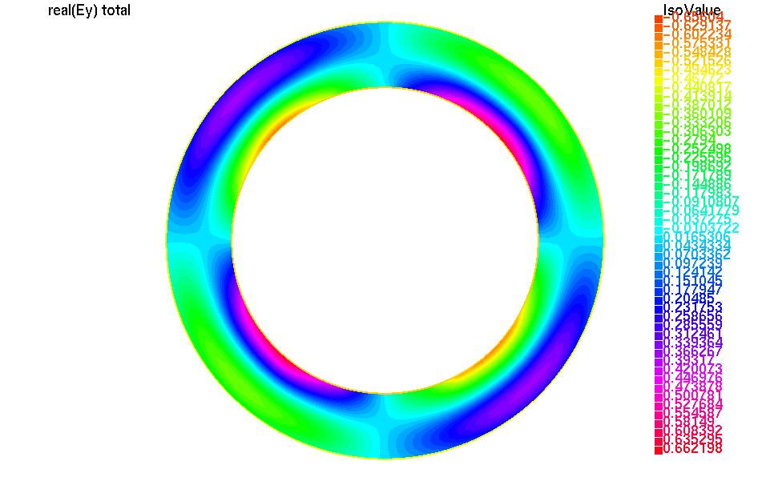

.. role:: freefem(code)
  :language: freefem

.. _BEM:

The Boundary Element Method
===========================

Introduction to the Boundary Element Method (BEM)
-------------------------------------------------

This is a short overview of the Boundary Element Method, introduced through a simple model example. For a thorough mathematical description of the Boundary Element Method you can refer to the `PhD thesis of Pierre Marchand <https://hal.archives-ouvertes.fr/tel-02922455>`__. Some figures used in this documentation are taken from the manuscript. All BEM examples in **FreeFEM** can be found in the `examples/bem <https://github.com/FreeFem/FreeFem-sources/tree/master/examples/bem>`__ subdirectory.

.. _BEMintromodel:

Model problem
~~~~~~~~~~~~~

The model problem we consider here is the scattering of an incoming acoustic wave :math:`u_\text{inc}` by an obstacle :math:`\Omega`. Thus, we want to solve the following homogeneous Helmholtz equation written in terms of the scattered field :math:`u`:

.. math::
  :label: eq_modelpb

  \left \{
  \begin{aligned}
  - \Delta u - k^2 u &= 0 \;\; &\text{in} \;\; &\mathbb{R}^3 \backslash \Omega \\
  u &= - u_\text{inc}  \;\; &\text{on} \;\; &\Gamma\\
  &\text{+ radiation condition}\hspace{-2.8cm}
  \end{aligned}
  \right .

with the Sommerfeld radiation condition at infinity, which states that there can be only outgoing waves at infinity:

.. math::
  \lim_{|\boldsymbol{x}| \rightarrow \infty} |\boldsymbol{x}| \left( \frac{\partial}{\partial |\boldsymbol{x}|} - \imath k \right) u(\boldsymbol{x}) = 0

and where the total field :math:`u_\text{tot} = u_\text{inc} + u`.

If the wavenumber :math:`k` is **constant** in :math:`\mathbb{R}^3 \backslash \Omega`, the boundary element method can be applied. It consists in reformulating the problem in terms of unknowns on the boundary :math:`\Gamma` of :math:`\Omega`.  

First, let us introduce the *Green kernel* :math:`\mathcal{G}_{k}`, which for the helmholtz equation in 3D is

.. math::
  :label: eq_p

  \mathcal{G}_{k}(\boldsymbol{x}) = \exp(\imath k |\boldsymbol{x}|) / (4 \pi |\boldsymbol{x}|).

Let us also introduce the *Single Layer Potential* :math:`\operatorname{SL}`, which for any :math:`q \in H^{-1/2}(\Gamma)` is defined as

.. math::
  :label: eq_sl

  \operatorname{SL}(q)(\boldsymbol{x}) = \int_{\Gamma} \mathcal{G}_{k}(\boldsymbol{x}-\boldsymbol{y}) q(\boldsymbol{y}) d\sigma(\boldsymbol{y}), \quad \forall \boldsymbol{x} \in \mathbb{R}^3 \backslash \Gamma.

An interesting property of :math:`\text{SL}` is that it produces solutions of the PDE at hand in :math:`\mathbb{R}^3 \backslash \Gamma` which satisfy the necessary conditions at infinity (here the Helmholtz equation and the Sommerfeld radiation condition).

Thus, we now need to find a so-called *ansatz* :math:`p \in H^{-1/2}(\Gamma)` such that :math:`\forall \boldsymbol{x} \in \mathbb{R}^3 \backslash \Omega`

.. math::
  :label: eq_pv

  u(\boldsymbol{x}) = \operatorname{SL}(p)(\boldsymbol{x}) = \int_{\Gamma} \mathcal{G}_{k}(\boldsymbol{x}-\boldsymbol{y}) p(\boldsymbol{y}) d\sigma(\boldsymbol{y}),

where :math:`u` also verifies the Dirichlet boundary condition :math:`u = - u_\text{inc}` on :math:`\Gamma`.  

In order to find :math:`p`, we define a variational problem by multiplying :eq:`eq_pv` by a test function `q` and integrating over :math:`\Gamma`:

.. math::
  \int_{\Gamma} u(\boldsymbol{x}) q(\boldsymbol{x}) d\sigma(\boldsymbol{x}) =
  \int_{\Gamma \times \Gamma} \frac{\exp(\imath k |\boldsymbol{x}-\boldsymbol{y}|)}{4 \pi |\boldsymbol{x}-\boldsymbol{y}|} p(\boldsymbol{y}) q(\boldsymbol{x}) d\sigma(\boldsymbol{x,y}) \quad \forall q : \Gamma \rightarrow \mathbb{C}.

Using the Dirichlet boundary condition :math:`u = - u_\text{inc}` on :math:`\Gamma`, we end up with the following variational problem to solve: find :math:`p : \Gamma \rightarrow \mathbb{C}` such that

.. math::
  :label: eq_bem

  \int_{\Gamma \times \Gamma} \frac{\exp(\imath k |\boldsymbol{x}-\boldsymbol{y}|)}{4 \pi |\boldsymbol{x}-\boldsymbol{y}|} p(\boldsymbol{y}) q(\boldsymbol{x}) d\sigma(\boldsymbol{x,y}) = - \int_{\Gamma} u_\text{inc}(\boldsymbol{x}) q(\boldsymbol{x}) d\sigma(\boldsymbol{x}) \quad \forall q : \Gamma \rightarrow \mathbb{C}.

Note that knowing :math:`p` on :math:`\Gamma`, we can indeed compute :math:`u` anywhere using the *potential* formulation :eq:`eq_pv`. Thus, we essentially gained one space dimension, as we only have to solve for :math:`p : \Gamma \rightarrow \mathbb{C}` in :eq:`eq_bem`. Another advantage of the boundary element method is that for a given mesh size, it is usually more accurate than the finite element method.

Of course, these benefits of the boundary element method come with a drawback: after discretization of :eq:`eq_bem`, for example with piecewise linear continuous (P1) functions on :math:`\Gamma`, we end up with a linear system whose matrix is **full**: because :math:`\mathcal{G}_{k}(\boldsymbol{x}-\boldsymbol{y})` never vanishes, every interaction coefficient is nonzero. Thus, the matrix :math:`A` of the linear system can be very costly to store (:math:`N^2` coefficients) and invert (factorization in :math:`\mathcal{O}(N^3)`) (:math:`N` is the size of the linear system).  
Moreover, compared to the finite element method, the matrix coefficients are much more expensive to compute because of the double integral and the evaluation of the Green function :math:`\mathcal{G}_{k}`. Plus, the choice of the quadrature formulas has to be made with extra care because of the singularity of :math:`\mathcal{G}_{k}`.

.. _BEMintroBIO:

Boundary Integral Operators
~~~~~~~~~~~~~~~~~~~~~~~~~~~

In order to formulate our model Dirichlet problem, we have used the **Single Layer Potential** :math:`\operatorname{SL}`:

.. math::
  q \mapsto \operatorname{SL}(q)(\boldsymbol{x}) = \int_{\Gamma} \mathcal{G}_{k}(\boldsymbol{x}-\boldsymbol{y}) q(\boldsymbol{y}) d\sigma(\boldsymbol{y}).

Depending on the choice of the boundary integral formulation or boundary condition, the **Double Layer Potential** :math:`\operatorname{DL}` can also be of use:

.. math::
  q \mapsto \operatorname{DL}(q)(\boldsymbol{x}) = \int_{\Gamma} \frac{\partial}{\partial \boldsymbol{n} (\boldsymbol{y})} \mathcal{G}_{k}(\boldsymbol{x}-\boldsymbol{y}) q(\boldsymbol{y}) d\sigma(\boldsymbol{y}).

Similarly, we have used the **Single Layer Operator** :math:`\mathcal{SL}` in our variational problem

.. math::
  p, q \mapsto \mathcal{SL}(p,q) = \int_{\Gamma \times \Gamma} p(\boldsymbol{x}) q(\boldsymbol{y}) \mathcal{G}_{k}(\boldsymbol{x - y}) d \sigma(\boldsymbol{x,y}).

There are three other building blocks that can be of use in the boundary element method, and depending on the problem and the choice of the formulation a boundary integral method makes use of one or a combination of these building blocks:

the **Double Layer Operator** :math:`\mathcal{DL}`:

.. math::
  p, q \mapsto \mathcal{DL}(p,q) = \int_{\Gamma \times \Gamma} p(\boldsymbol{x}) q(\boldsymbol{y}) \frac{\partial}{\partial \boldsymbol{n} (\boldsymbol{y})} \mathcal{G}_{k}(\boldsymbol{x - y}) d \sigma(\boldsymbol{x,y})

the **Transpose Double Layer Operator** :math:`\mathcal{TDL}`:

.. math::
  p, q \mapsto \mathcal{TDL}(p,q) = \int_{\Gamma \times \Gamma} p(\boldsymbol{x}) q(\boldsymbol{y}) \frac{\partial}{\partial \boldsymbol{n} (\boldsymbol{x})} \mathcal{G}_{k}(\boldsymbol{x - y}) d \sigma(\boldsymbol{x,y})

the **Hypersingular Operator** :math:`\mathcal{HS}`:

.. math::
  p, q \mapsto \mathcal{HS}(p,q) = \int_{\Gamma \times \Gamma} p(\boldsymbol{x}) q(\boldsymbol{y})  \frac{\partial}{\partial \boldsymbol{n} (\boldsymbol{x})} \frac{\partial}{\partial \boldsymbol{n} (\boldsymbol{y})} \mathcal{G}_{k}(\boldsymbol{x - y}) d \sigma(\boldsymbol{x,y})

the BEMTool library
~~~~~~~~~~~~~~~~~~~

In order to compute the coefficients of the BEM matrix, **FreeFEM** is interfaced with the boundary element library `BEMTool`_. **BEMTool** is a general purpose header-only C++ library written by Xavier Claeys, which handles

- BEM Potentials and Operators for Laplace, Yukawa, Helmholtz and Maxwell equations
- both in 2D and in 3D
- 1D, 2D and 3D triangulations
- :math:`\mathbb{P}_k`-Lagrange for :math:`k = 0,1,2` and surface :math:`\mathbb{RT}_0`

.. _BEMTool: https://github.com/xclaeys/BemTool

.. _BEMintroHMatrices:

Hierarchical matrices
~~~~~~~~~~~~~~~~~~~~~

Although **BEMTool** can compute the BEM matrix coefficients by accurately and efficiently evaluating the boundary integral operator, it is very costly and often prohibitive to compute and store all :math:`N^2` coefficients of the matrix. Thus, we have to rely on a *matrix compression* technique. To do so, **FreeFEM** relies on the **Hierarchical Matrix**, or **H-Matrix** format.

Low-rank approximation
**********************

Let :math:`\textbf{B} \in \mathbb{C}^{N \times N}` be a dense matrix. Assume that :math:`\textbf{B}` can be written as follows:

.. math::
  \textbf{B} = \sum_{j=1}^r \textbf{u}_j \textbf{v}_j^T

where :math:`r \leq N, \textbf{u}_j \in \mathbb{C}^{N}, \textbf{v}_j \in \mathbb{C}^{N}.`

If :math:`r < \frac{N^2}{2 N}`, the computing and storage cost is reduced to :math:`\mathcal{O}(r N) < \mathcal{O}(N^2)`. We say that :math:`\textbf{B}` is **low rank**.  

Usually, the matrices we are interested in are not low-rank, but they may be well-approximated by low-rank matrices. We may start by writing their Singular Value Decomposition (SVD):

.. math::
  \textbf{B} = \sum_{j=1}^N \sigma_j \textbf{u}_j \textbf{v}_j^T

where :math:`(\sigma_j)_{j=1}^N` are the *singular values* of :math:`\textbf{B}` in decreasing order, and :math:`(\textbf{u}_j)_{j=1}^N` and :math:`(\textbf{v}_j)_{j=1}^N` its *left and right singular vectors* respectively.  

Indeed, if :math:`\textbf{B}` has fast decreasing singular values :math:`\sigma_j`, we can obtain a good approximation of :math:`\textbf{B}` by truncating the SVD sum, keeping only the first :math:`r` terms. Although the truncated SVD is actually the best low-rank approximation possible (Eckart-Young-Mirsky theorem), computing the SVD is costly (:math:`\mathcal{O}(N^3)`) and requires computing all :math:`N^2` coefficients of the matrix, which we want to avoid.  

Thankfully, there exist several techniques to approximate a truncated SVD by computing only some coefficients of the initial matrix, such as randomized SVD, or **Partially pivoted Adaptive Cross Approximation (partial ACA)**, which requires only :math:`2 r N` coefficients.

Hierarchical block structure
****************************

Unfortunately, BEM matrices generally do not have fast decreasing singular values. However, they can exhibit sub-blocks with rapidly decreasing singular values, thanks to the asymptotically smooth nature of the BEM kernel. Let us look for example at the absolute value of the matrix coefficients in the 2D (circle) case below:

- blocks *near* the diagonal contain information about the *near-field interactions*, which are not low-rank in nature
- blocks *away* from the diagonal corresponding to the interaction between two clusters of geometric points :math:`X` and :math:`Y` satisfying the so-called **admissibility condition**

.. math::
  :label: eq_ac

  \max(\text{diam}(X),\text{diam}(Y)) \leq \eta \text{ dist}(X,Y)

are *far-field interactions* and have exponentially decreasing singular values. Thus, they can be well-approximated by low-rank matrices.  

The idea is then to build a **hierarchical representation** of the blocks of the matrix, then identify and compress admissible blocks using low-rank approximation.  

We can then build the *H-Matrix* by taking the following steps:

1. build a *hierarchical partition* of the geometry, leading to a **cluster tree** of the unknowns. It can for example be defined using bisection and principal component analysis.
2. from this hierarchical clustering, define and traverse the **block cluster tree** representation of the matrix structure, identifying the compressible blocks using admissibility condition :eq:`eq_ac`
3. compute the low-rank approximation of the identified compressible blocks using e.g. *partial ACA* ; the remaining leaves corresponding to *near-field* interactions are computed as dense blocks.

.. only:: html

  .. image:: images/BEM_fighmatrix.svg
    :name: BEMfighmatrix
    :align: center
    :width: 80%

.. only:: latex

  .. image:: images/BEM_fighmatrix.pdf
    :name: BEMfighmatrix
    :align: center
    :width: 80%

The Htool library
*****************

the H-Matrix format is implemented in the C++ library `Htool`_. **Htool** is a parallel header-only library written by Pierre Marchand and Pierre-Henri Tournier. It is interfaced with **FreeFEM** and provides routines to build hierarchical matrix structures (cluster trees, block trees, low-rank matrices, block matrices) as well as efficient parallel matrix-vector and matrix-matrix product using MPI and OpenMP. **Htool** is interfaced with **BemTool** to allow the compression of BEM matrices using the H-Matrix format in **FreeFEM**.

.. only:: html

  .. image:: images/BEM_fighmatrixpara.svg
    :name: BEMfighmatrixpara
    :align: center
    :width: 45%

.. only:: latex

  .. image:: images/BEM_fighmatrixpara.pdf
    :name: BEMfighmatrixpara
    :align: center
    :width: 45%

.. _Htool: https://github.com/htool-ddm/htool

Solve a BEM problem with FreeFEM
--------------------------------

Build the geometry
~~~~~~~~~~~~~~~~~~

The geometry of the problem (i.e. the boundary :math:`\Gamma`) can be discretized by a line (2D) or surface (3D) mesh:

2D
**

In 2D, the geometry of the boundary can be defined with the :freefem:`border` keyword and discretized by constructing a *line* or *curve* mesh of type :freefem:`meshL` using :freefem:`buildmeshL`:

.. code-block:: freefem
  :linenos:

  border b(t = 0, 2*pi){x=cos(t); y=sin(t);}
  meshL ThL = buildmeshL(b(100));

With the :freefem:`extract` keyword, we can also extract the boundary of a 2D :freefem:`mesh` (need to :freefem:`load "msh3"`):

.. code-block:: freefem
  :linenos:

  load "msh3"
  mesh Th = square(10,10);
  meshL ThL = extract(Th);

or of a :freefem:`meshS` ; we can also specify the boundary labels we want to extract:

.. code-block:: freefem
  :linenos:

  load "msh3"
  meshS ThS = square3(10,10);
  int[int] labs = [1,2];
  meshL ThL = extract(ThS, label=labs);

You can find much more information about curve mesh generation :ref:`here <meshLtype>`.

3D
**

In 3D, the geometry of the boundary surface can be discretized with a surface mesh of type :freefem:`meshS`, which can be built by several ways, for example using the :freefem:`square3` constructor:

.. code-block:: freefem
  :linenos:

  load "msh3"
  real R = 3, r=1, h=0.2;
  int nx = R*2*pi/h, ny = r*2*pi/h;
  func torex = (R+r*cos(y*pi*2))*cos(x*pi*2);
  func torey = (R+r*cos(y*pi*2))*sin(x*pi*2);
  func torez = r*sin(y*pi*2);
  meshS ThS = square3(nx,ny,[torex,torey,torez],removeduplicate=true);

or from a 2D :freefem:`mesh` using the :freefem:`movemesh23` keyword:

.. code-block:: freefem
  :linenos:

  load "msh3"
  mesh Th = square(10,10);
  meshS ThS = movemesh23(Th, transfo=[x,y,cos(x)^2+sin(y)^2]);

We can also extract the boundary of a :freefem:`mesh3`:

.. code-block:: freefem
  :linenos:

  load "msh3"
  mesh3 Th3 = cube(10,10,10);
  int[int] labs = [1,2,3,4];
  meshS ThS = extract(Th3, label=labs);

You can find much more information about surface mesh generation :ref:`here <meshStype>`.

Orientation of normal vector
****************************

Depending on whether your problem is posed on a bounded or unbounded domain, you may have to set the orientation of the outward normal vector :math:`\boldsymbol{n}` to the boundary. You can use the :freefem:`OrientNormal` function with the parameter :freefem:`unbounded` set to :freefem:`0` or :freefem:`1` (the normal vector :math:`\boldsymbol{n}` will then point to the exterior of the domain you are interested in):

.. code-block:: freefem
  :linenos:

  border b(t = 0, 2*pi){x=cos(t); y=sin(t);}
  meshL ThL = buildmeshL(b(100));
  ThL = OrientNormal(ThL,unbounded=1);
  plot(ThL,dim=2);

You can use ``shift + t`` on a plot of a boundary mesh to display the outward normal vector :math:`\boldsymbol{n}`:

Define the type of operator
~~~~~~~~~~~~~~~~~~~~~~~~~~~

For now, FreeFEM allows to solve the following PDE with the boundary element method:

.. math::
  -\Delta u - k^2 u = 0, \quad k \in \mathbb{C},

with

- :math:`k = 0` (Laplace)
- :math:`k \in \mathbb{R}^*_+` (Helmholtz)
- :math:`k \in \imath \mathbb{R}^*_+` (Yukawa)

FreeFEM can also solve Maxwell's equations with the Electric Field Integral Equation (EFIE) formulation. More details are given in the section :ref:`BEM for Maxwell's equations <BEMmaxwell>`.

First, the BEM plugin needs to be loaded:

.. code-block:: freefem
  :linenos:

  load "bem"

The information about the type of operator and the PDE can be specified by defining a variable of type :freefem:`BemKernel`:

.. code-block:: freefem
  :linenos:

  BemKernel Ker("SL",k=2*pi);

You can choose the type of operator depending on your formulation (see :ref:`Boundary Integral Operators <BEMintroBIO>`):

- :freefem:`"SL"`: **Single Layer Operator** :math:`\mathcal{SL}`
- :freefem:`"DL"`: **Double Layer Operator** :math:`\mathcal{DL}`
- :freefem:`"TDL"`: **Transpose Double Layer Operator** :math:`\mathcal{TDL}`
- :freefem:`"HS"`: **Hyper Singular Operator** :math:`\mathcal{HS}`

Define the variational problem
~~~~~~~~~~~~~~~~~~~~~~~~~~~~~~

We can then define the variational form of the BEM problem. The double BEM integral is represented by the :freefem:`int1dx1d` keyword in the 2D case, and by :freefem:`int2dx2d` for a 3D problem. The :freefem:`BEM` keyword inside the integral takes the BEM kernel operator as argument: 

.. code-block:: freefem
  :linenos:

  BemKernel Ker("SL", k=2*pi);
  varf vbem(u,v) = int2dx2d(ThS)(ThS)(BEM(Ker,u,v));

You can also specify the BEM kernel directly inside the integral:

.. code-block:: freefem
  :linenos:

  varf vbem(u,v) = int2dx2d(ThS)(ThS)(BEM(BemKernel("SL",k=2*pi),u,v));

Depending on the choice of the BEM formulation, there can be additional terms in the variational form. For example, **Second kind formulations** have an additional mass term:

.. code-block:: freefem
  :linenos:

  BemKernel Ker("HS", k=2*pi);
  varf vbem(u,v) = int2dx2d(ThS)(ThS)(BEM(Ker,u,v)) - int2d(ThS)(0.5*u*v);

We can also define a linear combination of two BEM kernels, which is useful for **Combined formulations**:

.. code-block:: freefem
  :linenos:

  complex k=2*pi;
  BemKernel Ker1("HS", k=k);
  BemKernel Ker2("DL", k=k);
  BemKernel Ker = 1./(1i*k) * Ker1 + Ker2;
  varf vbem(u,v) = int2dx2d(ThS)(ThS)(BEM(Ker,u,v)) - int2d(ThS)(0.5*u*v);

As a starting point, you can find how to solve a 2D scattering problem by a disk using a **First kind**, **Second kind** and **Combined** formulation, for a Dirichlet (`here <https://github.com/FreeFem/FreeFem-sources/blob/master/examples/bem/Helmholtz_circle_Dirichlet_all_direct.edp>`__) and Neumann (`here <https://github.com/FreeFem/FreeFem-sources/blob/master/examples/bem/Helmholtz_circle_Neumann_all_direct.edp>`__) boundary condition.

Assemble the H-Matrix
~~~~~~~~~~~~~~~~~~~~~

Assembling the matrix corresponding to the discretization of the variational form on an :freefem:`fespace` :freefem:`Uh` is similar to the finite element case, except that we end up with an :freefem:`HMatrix` instead of a sparse :freefem:`matrix`:

.. code-block:: freefem
  :linenos:

  fespace Uh(ThS,P1);
  HMatrix<complex> H = vbem(Uh,Uh);

Behind the scenes, **FreeFEM** is using **Htool** and **BEMTool** to assemble the H-Matrix.

.. note:: Since **Htool** is a parallel library, you need to use ``FreeFem++-mpi`` or ``ff-mpirun`` to be able to run your BEM script. The MPI parallelism is transparent to the user. You can speed up the computation by using multiple cores:

  .. code-block:: freefem
    :linenos:

    ff-mpirun -np 4 script.edp -wg

You can specify the different **Htool** parameters as below. These are the default values:

.. code-block:: freefem
  :linenos:

  HMatrix<complex> H = vbem(Uh,Uh,
    compressor = "partialACA", // or "fullACA", "SVD"
    eta = 10.,                 // parameter for the admissibility condition
    eps = 1e-3,                // target compression error for each block
    minclustersize = 10,       // minimum block side size min(n,m)
    maxblocksize = 1000000,    // maximum n*m block size
    commworld = mpiCommWorld); // MPI communicator

You can also set the default parameters globally in the script by changing the value of the global variables :freefem:`htoolEta`, :freefem:`htoolEpsilon`, :freefem:`htoolMinclustersize` and :freefem:`htoolMaxblocksize`.  

Once assembled, the H-Matrix can also be plotted with

.. code-block:: freefem
  :linenos:

  display(H, wait=true);

**FreeFEM** can also output some information and statistics about the assembly of :freefem:`H`:

.. code-block:: freefem
  :linenos:

  if (mpirank == 0) cout << H.infos << endl;

Solve the linear system
~~~~~~~~~~~~~~~~~~~~~~~

Generally, the right-hand-side of the linear system is built as the discretization of a standard linear form:

.. code-block:: freefem
  :linenos:

  Uh<complex> p, b;
  varf vrhs(u,v) = -int2d(ThS)(uinc*v);
  b[] = vrhs(0,Uh);

We can then solve the linear system to obtain :math:`p`, with the standard syntax:

.. code-block:: freefem
  :linenos:

  p[] = H^-1*b[];

Under the hood, **FreeFEM** solves the linear system with GMRES with a Jacobi (diagonal) preconditioner.

.. _BEMcomputeSolution:

Compute the solution
~~~~~~~~~~~~~~~~~~~~

Finally, knowing :math:`p`, we can compute the solution :math:`u` of our initial problem :eq:`eq_modelpb` using the Potential as in :eq:`eq_pv`. As for the :freefem:`BemKernel`, the information about the type of potential can be specified by defining a variable of type :freefem:`BemPotential`:

.. code-block:: freefem
  :linenos:

  BemPotential Pot("SL", k=2*pi);

In order to benefit from low-rank compression, instead of using :eq:`eq_pv` to sequentially compute the value :math:`u(\boldsymbol{x})` at each point of interest :math:`\boldsymbol{x}`, we can compute the discretization of the Potential on a target finite element space :freefem:`UhOut` defined on an output mesh :freefem:`ThOut` with an H-Matrix.  

First, let us define the variational form corresponding to the potential that we want to use to reconstruct our solution. Similarly to the kernel case, the :freefem:`POT` keyword takes the potential as argument. Note that we have a single integral, and that :freefem:`v` plays the role of :math:`\boldsymbol{x}`.

.. code-block:: freefem
  :linenos:

  varf vpot(u,v) = int2d(ThS)(POT(Pot,u,v));

We can then assemble the rectangular H-Matrix from the potential variational form:

.. code-block:: freefem
  :linenos:

  fespace UhOut(ThOut,P1);
  HMatrix<complex> HP = vpot(Uh,UhOut);

Computing :math:`u` on :freefem:`UhOut` is then just a matter of performing the matrix-vector product of :freefem:`HP` with :freefem:`p`:

.. code-block:: freefem
  :linenos:

  UhOut<complex> u;
  u[] = HP*p[];
  plot(u);

2D example script
-----------------

Let us summarize what we have learned with a 2D version of our :ref:`model problem <BEMintromodel>` where we study the scattering of a plane wave by a disc:

.. code-block:: freefem
  :linenos:

  load "bem"
  load "msh3"

  real k = 10;

  int n = 100;

  border circle(t = 0, 2*pi){x=cos(t); y=sin(t);}
  meshL ThL = buildmeshL(circle(n));
  ThL = OrientNormal(ThL,unbounded=1);

  varf vbem(u,v) = int1dx1d(ThL)(ThL)(BEM(BemKernel("SL",k=k),u,v));

  fespace Uh(ThL,P1);
  HMatrix<complex> H = vbem(Uh,Uh);

  func uinc = exp(1i*k*x);
  Uh<complex> p, b;
  varf vrhs(u,v) = -int1d(ThL)(uinc*v);
  b[] = vrhs(0,Uh);

  p[] = H^-1*b[];

  varf vpot(u,v) = int1d(ThL)(POT(BemPotential("SL",k=k),u,v));

  int np = 200;
  int R = 4;
  border b1(t=-R, R){x=t; y=-R;}
  border b2(t=-R, R){x=R; y=t;}
  border b3(t=-R, R){x=-t; y=R;}
  border b4(t=-R, R){x=-R; y=-t;}
  mesh ThOut = buildmesh(b1(np)+b2(np)+b3(np)+b4(np)+circle(-n));

  fespace UhOut(ThOut,P1);
  HMatrix<complex> HP = vpot(Uh,UhOut);

  UhOut<complex> u, utot;
  u[] = HP*p[];

  utot = u + uinc;
  plot(utot,fill=1,value=1,cmm="u_total");

.. _BEMmaxwell:

BEM for Maxwell's equations
---------------------------

We can also use the boundary element method to solve the time-harmonic Maxwell's equations of electromagnetism through the Electric Field Integral Equation (EFIE) formulation. Here again, we present the equations in the context of a scattering problem. We use **BemTool** notations for the EFIE.

.. _BEMmodelMaxwell:

EFIE for the scattering problem
~~~~~~~~~~~~~~~~~~~~~~~~~~~~~~~

We consider the time convention :math:`\exp (- \imath \omega t )`. The choice of the time convention as an impact on the formulation.

The problem we consider here is the scattering of an incoming field :math:`(\boldsymbol{E}_{\text{inc}}, \boldsymbol{H}_{\text{inc}})` by an obstacle :math:`\Omega` of boundary :math:`\Gamma`. Thus, we want to solve the following homogeneous time-harmonic Maxwell's equations written in terms of the scattered field :math:`(\boldsymbol{E},\boldsymbol{H})`. The obstacle is a perfect electric conductor (PEC) object. The exterior domain corresponds to vacuum space.

.. math::
  :label: eq_time_harmo_Maxwell

  \left \{
  \begin{aligned}
  \mathrm{curl} \boldsymbol{E} - \imath \omega \mu_{0} \boldsymbol{H} &= 0, \quad  \text{in} \:\mathbb{R}^3 \backslash \Omega \\
  \mathrm{curl} \boldsymbol{H} + \imath \omega \epsilon_{0} \boldsymbol{E} &= 0, \quad \text{in} \: \mathbb{R}^3 \backslash \Omega \\
  \boldsymbol{E} \wedge \boldsymbol{n} &= - \boldsymbol{E}_{inc} \wedge  \boldsymbol{n}, \quad \text{on} \: \Gamma\\
  \lim_{r \rightarrow +\infty} r \left \|  \sqrt{\epsilon_{0}} \boldsymbol{E} - \sqrt{\mu_{0}}  \boldsymbol{H} \wedge \frac{\boldsymbol{r}}{|\boldsymbol{r}|} \right \| &= 0,
  \end{aligned}
  \right.

where :math:`\boldsymbol{E}` is the scattered electric field, :math:`\boldsymbol{H}` is the scattered magnetic field, :math:`\omega` is the angular frequency, :math:`\epsilon_{0}` is the vacuum permittivity and :math:`\mu_{0}` is the vacuum magnetic permeability. The angular frequency verifies :math:`\omega = 2 \pi f` where :math:`f` is the frequency.

The total electric and magnetic fields are given by

.. math ::
  :label: eq_total_E_H_Field

  \left \{
  \begin{aligned}
  \boldsymbol{E}_{\text{total}} &=  \boldsymbol{E}_{\text{inc}} + \boldsymbol{E} \\
  \boldsymbol{H}_{\text{total}} &=  \boldsymbol{H}_{\text{inc}} + \boldsymbol{H}.
  \end{aligned}
  \right.

We introduce the total magnetic current :math:`\boldsymbol{j}` defined on the surface :math:`\Gamma`:

.. math ::
  \boldsymbol{j} = \imath \: \kappa \: Z_{0} \: \boldsymbol{n} \wedge  \left ( H + H_{\text{inc}} \right),

where :math:`Z_{0}=\sqrt{\frac{\mu_{0}}{\epsilon_{0}}}` is the vacuum impedance and :math:`\kappa= \frac{\omega}{c}` is the wave number, with :math:`c=\frac{1}{\sqrt{\mu_{0} \epsilon_{0}}}` the speed of light.

..
  INFO: DOC MFIE IN THE FUTURE
  We introduce the total electric curents :math:`\boldsymbol{m}` defined on the surface :math:`\Gamma`:

  .. math ::
    \boldsymbol{m} =  \left ( E + E_{\text{inc}} \right) \wedge \boldsymbol{n}.

  INFO: ATTENTION AU SIGNE A LA DEFINITION DE M.
  ON A PRIS ICI LA DEFINITION DU COURS DE BENDALI.

The current :math:`\boldsymbol{j}` verifies the Electric Field Integral Equation (EFIE):

.. math ::
  :label: eq_EFIE

  \int_{\Gamma \times \Gamma} \mathcal{G}_{\kappa}(\boldsymbol{x}-\boldsymbol{y}) \big ( \boldsymbol{j} (\boldsymbol{x})\cdot \boldsymbol{v}(\boldsymbol{y})
  -\frac{1}{\kappa^2} \: \mathrm{div}_{\Gamma}\boldsymbol{j}(\boldsymbol{x}) \: \mathrm{div}_{\Gamma}\boldsymbol{v}(\boldsymbol{y}) \big) \: d\sigma(\boldsymbol{x}) \:  d\sigma(\boldsymbol{y}) \\
  = - \int_{\Gamma} \boldsymbol{E}_{inc}(\boldsymbol{x}) \cdot \boldsymbol{v}(\boldsymbol{x}) \: d\sigma(\boldsymbol{x}) \quad \forall \boldsymbol{v} : \Gamma \rightarrow \mathbb{C}^3,

where :math:`\mathcal{G}_{\kappa}` is the Green kernel defined in :eq:`eq_p`.

Note that knowing :math:`\boldsymbol{j}`, we can compute the scattered field :math:`(\boldsymbol{E},\boldsymbol{H})` with the Stratton-Chu formula:

.. math ::
  :label: eq_Stratton_Chu

  \begin{aligned}
    \boldsymbol{E}(\boldsymbol{y}) &= \int_{\Gamma} \mathcal{G}_{\kappa}(|\boldsymbol{y}-\boldsymbol{x}|) \boldsymbol{j}(\boldsymbol{x}) d\sigma(\boldsymbol{x}) + \frac{1}{\kappa^2} \nabla_{y} \left( \int_{\Gamma}  \mathcal{G}_{\kappa}(|\boldsymbol{y}-\boldsymbol{x}|) \: \mathrm{div}_{\Gamma}\boldsymbol{j}(\boldsymbol{x}) \: d\sigma(\boldsymbol{x}) \right),\\
    \boldsymbol{H}(\boldsymbol{y}) &=\frac{i}{\kappa Z_{0}} \mathrm{curl} \left( \int_{\Gamma} \mathcal{G}_{\kappa}(|\boldsymbol{y}-\boldsymbol{x}|) \: \boldsymbol{j}(\boldsymbol{x}) \: d\sigma(\boldsymbol{x}) \right).
  \end{aligned}

The computation of the Stratton-Chu formula is implemented in the **BemTool** library.

..
  // Texte pour la MFIE quand elle sera ajoutée à FreeFEM (A verfier avec Xavier)
  The Magnetic Field integral equation is given by:

  .. math ::
    \frac{1}{2} \int_{\Gamma} \boldsymbol{j} (\boldsymbol{y}) \cdot \boldsymbol{v}(\boldsymbol{y}) d\sigma(\boldsymbol{y}) + \int_{\Gamma} \boldsymbol{v} (\boldsymbol{y}) \cdot \boldsymbol{n} \wedge
    \left ( \int_{\Gamma} \nabla_{\boldsymbol{x}} \mathcal{G}_{\kappa}(|\boldsymbol{y}-\boldsymbol{x}|) \wedge \boldsymbol{j} (\boldsymbol{x}) \: d\sigma(\boldsymbol{x}) \right) \: d\sigma(\boldsymbol{y}) \\
    = \int_{\Gamma} \boldsymbol{v} (\boldsymbol{y}) \cdot \boldsymbol{n} \wedge \boldsymbol{H}_{inc}(\boldsymbol{x}) \: d\sigma(\boldsymbol{x}).

To summarize, the solution of our :ref:`Maxwell problem <BEMmodelMaxwell>` can be obtained with the following steps:

  #. Solve for the magnetic current :math:`\boldsymbol{j}` with :eq:`eq_EFIE`.

  #. Compute the scattered field :math:`(\boldsymbol{E},\boldsymbol{H})` with :eq:`eq_Stratton_Chu`.

  #. Recover the total electric and magnetic fields with :eq:`eq_total_E_H_Field`.

Similarly to the scalar case, here we make use of the Maxwell **Single Layer Operator** :math:`\mathcal{SL}_\text{MA}` in Step 1

.. math::
  \boldsymbol{p},\boldsymbol{q} \mapsto \mathcal{SL}_\text{MA}(\boldsymbol{p},\boldsymbol{q}) = \int_{\Gamma \times \Gamma} \mathcal{G}_{\kappa}(\boldsymbol{x}-\boldsymbol{y}) \big ( \boldsymbol{p} (\boldsymbol{x})\cdot \boldsymbol{q}(\boldsymbol{y})
  - \frac{1}{\kappa^2} \: \mathrm{div}_{\Gamma}\boldsymbol{p}(\boldsymbol{x}) \: \mathrm{div}_{\Gamma}\boldsymbol{q}(\boldsymbol{y}) \big) \: d\sigma(\boldsymbol{x}) \:  d\sigma(\boldsymbol{y})

and the Maxwell **Single Layer Potential** :math:`\operatorname{SL}_\text{MA}` in Step 2

.. math::
  \boldsymbol{q} \mapsto \operatorname{SL}_\text{MA}(\boldsymbol{q})(\boldsymbol{x}) = \int_{\Gamma} \mathcal{G}_{\kappa}(|\boldsymbol{x}-\boldsymbol{y}|) \: \boldsymbol{q}(\boldsymbol{y}) d\sigma(\boldsymbol{y})
  + \frac{1}{\kappa^2} \nabla_{x} \left( \int_{\Gamma}  \mathcal{G}_{\kappa}(|\boldsymbol{x}-\boldsymbol{y}|) \: \mathrm{div}_{\Gamma} \: \boldsymbol{q}(\boldsymbol{y}) \: d\sigma(\boldsymbol{y}) \right).

.. note::
  The EFIE formulation in **FreeFEM** is valid only for a closed boundary :math:`\Gamma`.

Maxwell BEM problem in FreeFEM
~~~~~~~~~~~~~~~~~~~~~~~~~~~~~~

Our Maxwell model problem consists in the electromagnetic scattering of a plane wave at frequency 600 Mhz by a sphere :math:`\Gamma` of radius 1. Here we highlight the differences with the :ref:`scalar case <BEMintromodel>` in the **FreeFEM** script. You can find the full script `here <https://github.com/FreeFem/FreeFem-sources/blob/master/examples/bem/Maxwell_EFIE_sphere.edp>`__.

The sphere :math:`\Gamma` is a :freefem:`meshS`. We can build the surface mesh with:

.. code-block:: freefem
  :linenos:

    // definition of the surface mesh
    include "MeshSurface.idp"
    real radius = 1;
    int nlambda = 4;                // number of points per wavelength
    real hs = lambda/(1.0*nlambda); // mesh size of the sphere
    meshS ThS = Sphere(radius,hs,7,1);

For the discretization of the EFIE, we use the surface Raviart-Thomas Element of order 0 :freefem:`RT0S`:

.. code-block:: freefem
  :linenos:

  // fespace for the EFIE
  fespace Uh3(ThS,RT0S);

It is a vector finite element space of size 3. The magnetic current :math:`\boldsymbol{j}` belongs to this space:

.. code-block:: freefem
  :linenos:

  Uh3<complex> [mcx,mcy,mcz]; // FE function for the magnetic current

The **Single Layer Operator** :math:`\mathcal{SL}_\text{MA}` involved in the EFIE :eq:`eq_EFIE` is defined as a :freefem:`BemKernel` with the string :freefem:`"MA_SL"`:

.. code-block:: freefem
  :linenos:

  BemKernel KerMA("MA_SL",k=k);

We are working in a vector space with 3 components. Hence, the BEM variational form is:

.. code-block:: freefem
  :linenos:

  // definition of the variational form for the EFIE operator
  varf vEFIE([u1,u2,u3],[v1,v2,v3]) =
      int2dx2d(ThS)(ThS)(BEM(KerMA,[u1,u2,u3],[v1,v2,v3]));

As before, we can use low-rank compression to build a H-Matrix approximation of the discrete bilinear form (see :ref:`Hierarchical matrices <BEMintroHMatrices>`):

.. code-block:: freefem
  :linenos:

  // construction of the H-matrix for the EFIE operator
  HMatrix<complex> H = vEFIE(Uh3,Uh3,eta=10,eps=1e-3,
                        minclustersize=10,maxblocksize=1000000);

The right-hand side of equation :eq:`eq_EFIE` can be computed as

.. code-block:: freefem
  :linenos:

  // computation of the rhs of the EFIE
  Uh3<complex> [rhsx,rhsy,rhsz]; // FE function for rhs
  varf vrhs([u1,u2,u3],[v1,v2,v3]) = -int2d(ThS)([v1,v2,v3]'*[fincx,fincy,fincz]);
  rhsx[] = vrhs(0,Uh3);

where :freefem:`[fincx,fincy,fincz]` is the incoming plane wave :math:`\boldsymbol{E}_{inc}`.

We can then solve the linear system to obtain the magnetic current :math:`\boldsymbol{j}`:

.. code-block:: freefem
  :linenos:

  // solve for the magnetic current
  mcx[] = H^-1*rhsx[];

Following the same steps as in the section :ref:`Compute the solution <BEMcomputeSolution>`, we can reconstruct the scattered electric field :math:`\boldsymbol{E}` using the **Single Layer Potential** :math:`\operatorname{SL}_\text{MA}`:

.. code-block:: freefem
  :linenos:

  // Maxwell potential for the electric field
  BemPotential PotMA("MA_SL", k=k);

The variational form for the potential is:

.. code-block:: freefem
  :linenos:

  varf vMApot([u1,u2,u3],[v1,v2,v3]) =
          int2d(ThS)(POT(PotMA,[u1,u2,u3],[v1,v2,v3]));

where :math:`[v1,v2,v3]` plays the role of the scattered electric field :math:`\boldsymbol{E}` that we want to reconstruct at a set of points :math:`[x,y,z]`.

We consider an output mesh :freefem:`ThOut` on which we want to reconstruct a P1 approximation of the three components of :math:`\boldsymbol{E}`:

.. code-block:: freefem
  :linenos:

  fespace UhOutV(ThOut,[P1,P1,P1]);
  // FE function of the scattered field E
  UhOutV<complex> [Ex, Ey, Ez];

We can build the rectangular H-Matrix corresponding to the variational form for the potential:

.. code-block:: freefem
  :linenos:

  HMatrix<complex> HpotMA = vpotMA(Uh3,UhOutV,eta=10,eps=1e-3,
                                minclustersize=10,maxblocksize=1000000);

Finally, the scattered electric field :math:`\boldsymbol{E}` can be obtained by performing a matrix-vector product with the potential H-Matrix :freefem:`HpotMA` and the discrete magnetic current :freefem:`[mcx,mcy,mcz]`:

.. code-block:: freefem
  :linenos:

  // compute the scattered electric field
  Ex[] = HpotMA*mcx[];

We can plot the real part of the total electric field with:

.. code-block:: freefem
  :linenos:

  // compute the real part of the total electric field
  UhOutV [Etotx,Etoty,Etotz] = [real(Ex+fincx),
                                real(Ey+fincy),
                                real(Ez+fincz)];
  plot([Etotx,Etoty,Etotz]);

.. subfigstart::

   real part of the x component of the total electric field

   real part of the y component of the total electric field

.. subfigend::
   :width: 0.49
   :alt: total electric field
   :label: BEMfigmaxwellE
