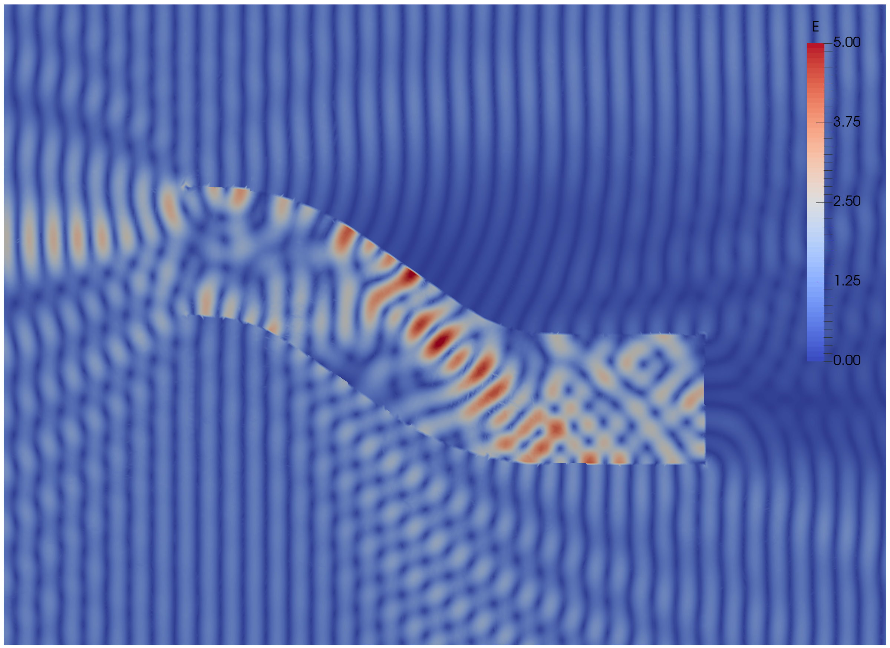
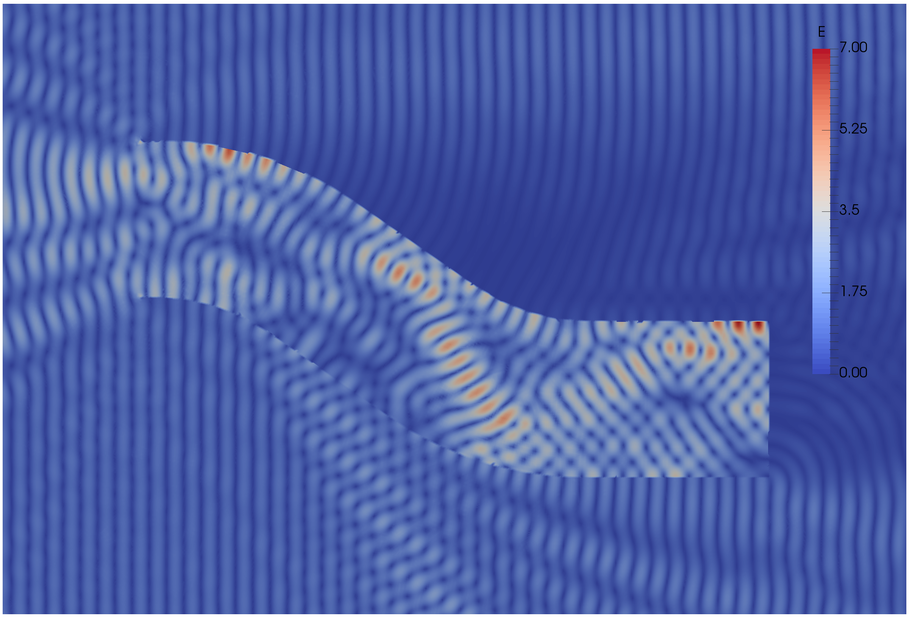

.. _ffddmTutorial:

Tutorial
========

Authors: Pierre-Henri Tournier - Frédéric Nataf - Pierre Jolivet

.. only:: html

  **We recommend checking the** `slides`_ **version of this tutorial.**

.. _slides: ../../_static/html/tutorial-slides.html

What is **ffddm** ?
-------------------

- **ffddm** implements a class of parallel solvers in *FreeFEM*: *overlapping Schwarz domain decomposition methods*

- The entire **ffddm** framework is written in the *FreeFEM* language **ffddm** aims at simplifying the use of parallel solvers in *FreeFEM*
    You can find the **ffddm** scripts `here <https://github.com/FreeFem/FreeFem-sources/tree/develop/idp>`__ ('ffddm*.idp' files) and examples `here <https://github.com/FreeFem/FreeFem-sources/tree/develop/examples/ffddm>`__

- **ffddm** provides a set of high-level macros and functions to
    - handle data distribution: distributed meshes and linear algebra
    - build DD preconditioners for your variational problems
    - solve your problem using preconditioned Krylov methods

- **ffddm** implements scalable two level Schwarz methods, with a coarse space correction built either from a coarse mesh or a `GenEO <https://link.springer.com/article/10.1007%2Fs00211-013-0576-y>`__ coarse space *Ongoing research*: approximate coarse solves and three level methods

- **ffddm** can also act as a wrapper for the `HPDDM <https://github.com/hpddm/hpddm>`__ library.
    **HPDDM** is an efficient C++11 implementation of various domain decomposition methods and Krylov subspace algorithms with advanced block and recycling techniques More details on how to use **HPDDM** within **ffddm** :ref:`here <ffddmDocumentationHPDDMffddm>`

Why Domain Decomposition Methods ?
----------------------------------

How can we solve a large sparse linear system :math:`A u = b \in \mathbb{R}^n` ?

.. image:: figures/Methods_Solves_1.png
  :width: 100%

Step 1: Decompose the mesh
~~~~~~~~~~~~~~~~~~~~~~~~~~

See :ref:`documentation <ffddmDocumentationOverlappingMeshDecomposition>`

Build a collection of :math:`N` overlapping sub-meshes :math:`(Th_{i})_{i=1}^N` from the global mesh :math:`Th`

+-----------+-----------+
| |Domain1| | |Domain2| |
+-----------+-----------+

.. |Domain1| image:: figures/domain1.png
   :width: 100%

.. |Domain2| image:: figures/domain2.png
   :width: 100%

.. code-block:: freefem
    :linenos:

    ffddmbuildDmesh( prmesh , ThGlobal , comm )

- mesh distributed over the MPI processes of communicator **comm**
- initial mesh **ThGlobal** partitioned with *metis* by default
- size of the overlap given by :ref:`ffddmoverlap <ffddmParametersGlobal>` (default 1)

`prmesh#Thi` is the local mesh of the subdomain for each mpi process

.. code-block:: freefem
    :linenos:

    macro dimension 2// EOM            // 2D or 3D

    include "ffddm.idp"

    mesh ThGlobal = square(100,100);    // global mesh

    // Step 1: Decompose the mesh
    ffddmbuildDmesh( M , ThGlobal , mpiCommWorld )

    medit("Th"+mpirank, MThi);

Copy and paste this to a file 'test.edp' and run it:

.. code-block:: bash
    :linenos:

    ff-mpirun -np 2 test.edp -glut ffglut

Step 2: Define your finite element
~~~~~~~~~~~~~~~~~~~~~~~~~~~~~~~~~~

See :ref:`documentation <ffddmDocumentationLocalFiniteElementSpaces>`

.. code-block:: freefem
    :linenos:

    ffddmbuildDfespace( prfe , prmesh , scalar , def , init , Pk )

builds the local finite element spaces and associated distributed operators on top of the mesh decomposition **prmesh**

- **scalar**: type of data for this finite element: *real* or *complex*
- **Pk**: your type of finite element: P1, [P2,P2,P1], ...
- **def**, **init**: macros specifying how to define and initialize a **Pk** FE function

`prfe#Vhi` is the local FE space defined on `prmesh#Thi` for each mpi process

Example for P2 *complex*:

.. code-block:: freefem
    :linenos:

    macro def(u)  u // EOM
    macro init(u) u // EOM
    ffddmbuildDfespace( FE, M, complex,
                        def, init, P2 )

Example for [P2,P2,P1] *real*:

.. code-block:: freefem
    :linenos:

    macro def(u)  [u, u#B, u#C] // EOM
    macro init(u) [u, u, u]     // EOM
    ffddmbuildDfespace( FE, M, real, def,
                        init, [P2,P2,P1] )

Distributed vectors and restriction operators
'''''''''''''''''''''''''''''''''''''''''''''

.. image:: figures/domain2.png
   :align: center
   :width: 50%

Natural decomposition of the set of d.o.f.'s :math:`{\mathcal N}` of :math:`Vh` into the :math:`N` subsets of d.o.f.'s :math:`({\mathcal N}_i)_{i=1}^N` each associated with the local FE space :math:`Vh_i`

.. math::
    {\mathcal N} = \cup_{i=1}^N {\mathcal N}_i\,,

but with duplications of the d.o.f.'s in the overlap

**_Definition_** a *distributed vector* is a collection of local vectors :math:`({\mathbf V_i})_{1\le i\le N}` so that the values on the duplicated d.o.f.'s are the same:

.. math::
    {\mathbf V}_i = R_i\,{\mathbf V}, \quad i = 1, ..., N

where :math:`{\mathbf V}` is the corresponding global vector
and :math:`R_i` is the *restriction operator* from :math:`{\mathcal N}` into :math:`{\mathcal N}_i`

**Remark** :math:`R_i^T` is the *extension operator*: extension by :math:`0` from :math:`{\mathcal N}_i` into :math:`{\mathcal N}`

Partition of unity
''''''''''''''''''

.. image:: figures/domain3.png
   :align: center
   :width: 75%

Duplicated unknowns coupled via a *partition of unity*:

.. math::
    I = \sum_{i = 1}^N R_i^T D_i R_i

:math:`(D_i)_{1\le i \le N}` are square diagonal matrices of size :math:`\#{\mathcal N}_i`

.. math::
    {\mathbf V} = \sum_{i = 1}^N R_i^T D_i R_i {\mathbf V} = \sum_{i = 1}^N R_i^T D_i {\mathbf V_i}

Data exchange between neighbors
'''''''''''''''''''''''''''''''

.. code-block:: freefem
    :linenos:

    func prfe#update(K[int] vi, bool scale)

synchronizes local vectors :math:`{\mathbf V}_i` between subdomains :math:`\Rightarrow` exchange the values of :math:`mathbf{V}_i` shared with neighbors in the overlap region

.. math::
    {\mathbf V}_i \leftarrow R_i \left( \sum_{j=1}^N R_j^T D_j {\mathbf V}_j \right) = D_i {\mathbf V}_i + \sum_{j\in \mathcal{O}(i)} R_i\,R_j^T\,D_j {\mathbf V}_j

where :math:`\mathcal{O}(i)` is the set of neighbors of subdomain $i$. Exchange operators :math:`R_i\,R_j^T` correspond to neighbor-to-neighbor MPI communications

.. code-block:: freefem
    :linenos:

    FEupdate(vi, false);

.. math::
    {\mathbf V}_i \leftarrow R_i \left( \sum_{j=1}^N R_j^T {\mathbf V}_j \right)

.. code-block:: freefem
    :linenos:

    FEupdate(vi, true);

.. math::
    {\mathbf V}_i \leftarrow R_i \left( \sum_{j=1}^N R_j^T D_j {\mathbf V}_j  \right)

.. code-block:: freefem
    :linenos:

    macro dimension 2// EOM            // 2D or 3D

    include "ffddm.idp"

    mesh ThGlobal = square(100,100);    // global mesh

    // Step 1: Decompose the mesh
    ffddmbuildDmesh( M , ThGlobal , mpiCommWorld )

    // Step 2: Define your finite element
    macro def(u)  u // EOM
    macro init(u) u // EOM
    ffddmbuildDfespace( FE , M , real , def , init , P2 )

    FEVhi vi = x;
    medit("v"+mpirank, MThi, vi);

    vi[] = FEDk[mpirank];
    medit("D"+mpirank, MThi, vi);

    vi = 1;
    FEupdate(vi[],true);
    ffddmplot(FE,vi,"1")

    FEupdate(vi[],false);
    ffddmplot(FE,vi,"multiplicity")

.. _ffddmTutorialDefineYourProblem:

Step 3: Define your problem
~~~~~~~~~~~~~~~~~~~~~~~~~~~

See :ref:`documentation <ffddmDocumentationDefineProblemToSolve>`

.. code-block:: freefem
    :linenos:

    ffddmsetupOperator( pr , prfe , Varf )

builds the distributed operator associated to your variational form on top of the distributed FE **prfe**

**Varf** is a macro defining your abstract variational form

.. code-block:: freefem
    :linenos:

    macro Varf(varfName, meshName, VhName)
        varf varfName(u,v) = int2d(meshName)(grad(u)'* grad(v))
                           + int2d(meshName)(f*v) + on(1, u = 0);  // EOM

:math:`\Rightarrow` assemble local 'Dirichlet' matrices :math:`A_i = R_i A R_i^T`

.. math::
    A = \sum_{i=1}^N R_i^T D_i A_i R_i

.. warning:: only true because :math:`D_i R_i A = D_i A_i R_i` due to the fact that :math:`D_i` vanishes at the interface **!!**

`pr#A` applies :math:`A` to a distributed vector: :math:`{\mathbf U}_i \leftarrow R_i \sum_{j=1}^N R_j^T D_j A_j {\mathbf V}_j`

:math:`\Rightarrow` multiply by :math:`A_i` + `prfe#update`

.. code-block:: freefem
    :linenos:

    macro dimension 2// EOM            // 2D or 3D

    include "ffddm.idp"

    mesh ThGlobal = square(100,100);    // global mesh

    // Step 1: Decompose the mesh
    ffddmbuildDmesh( M , ThGlobal , mpiCommWorld )

    // Step 2: Define your finite element
    macro def(u)  u // EOM
    macro init(u) u // EOM
    ffddmbuildDfespace( FE , M , real , def , init , P2 )

    // Step 3: Define your problem
    macro grad(u) [dx(u), dy(u)] // EOM
    macro Varf(varfName, meshName, VhName)
        varf varfName(u,v) = int2d(meshName)(grad(u)'* grad(v))
                           + int2d(meshName)(1*v) + on(1, u = 0);  // EOM
    ffddmsetupOperator( PB , FE , Varf )

    FEVhi ui, bi;
    ffddmbuildrhs( PB , Varf , bi[] )

    ui[] = PBA(bi[]);
    ffddmplot(FE, ui, "A*b")

Summary so far: translating your sequential *FreeFEM* script
--------------------------------------------------------------

Step 1: Decompose the mesh
~~~~~~~~~~~~~~~~~~~~~~~~~~

See :ref:`documentation <ffddmDocumentationOverlappingMeshDecomposition>`

.. code-block:: freefem
    :linenos:

    mesh Th = square(100,100);

.. code-block:: freefem
    :linenos:

    mesh Th = square(100,100);
    ffddmbuildDmesh(M, Th, mpiCommWorld)

Step 2: Define your finite element

See :ref:`documentation<ffddmDocumentationLocalFiniteElementSpaces>`

.. code-block:: freefem
    :linenos:

    fespace Vh(Th, P1);

.. code-block:: freefem
    :linenos:

    macro def(u)  u // EOM
    macro init(u) u // EOM
    ffddmbuildDfespace(FE, M, real, def, init, P1)

Step 3: Define your problem

See :ref:`documentation <ffddmDocumentationDefineProblemToSolve>`

.. code-block:: freefem
    :linenos:

    varf Pb(u, v) = ...
    matrix A = Pb(Vh, Vh);

.. code-block:: freefem
    :linenos:

    macro Varf(varfName, meshName, VhName)
        varf varfName(u,v) = ... // EOM
    ffddmsetupOperator(PB, FE, Varf)

Solve the linear system
~~~~~~~~~~~~~~~~~~~~~~~

See :ref:`documentation <ffddmDocumentationDefineProblemToSolve>`

.. code-block:: freefem
    :linenos:

    u[] = A^-1 * b[];

.. code-block:: freefem
    :linenos:

    ui[] = PBdirectsolve(bi[]);

Solve the linear system with the parallel direct solver *MUMPS*
~~~~~~~~~~~~~~~~~~~~~~~~~~~~~~~~~~~~~~~~~~~~~~~~~~~~~~~~~~~~~~~

See :ref:`documentation <ffddmDocumentationDefineProblemToSolve>`

.. code-block:: freefem
    :linenos:

    func K[int] pr#directsolve(K[int]& bi)

We have :math:`A` and :math:`b` in distributed form, we can solve the linear system :math:`A u = b` using the parallel direct solver *MUMPS*

.. code-block:: freefem
    :linenos:

    // Solve the problem using the direct parallel solver MUMPS
    ui[] = PBdirectsolve(bi[]);
    ffddmplot(FE, ui, "u")

Step 4: Define the one level DD preconditioner
~~~~~~~~~~~~~~~~~~~~~~~~~~~~~~~~~~~~~~~~~~~~~~

See :ref:`documentation <ffddmDocumentationOneLevelPreconditioners>`

.. code-block:: freefem
    :linenos:

    ffddmsetupPrecond( pr , VarfPrec )

builds the one level preconditioner for problem **pr**.

By default it is the *Restricted Additive Schwarz (RAS)* preconditioner:

.. math::
    M^{-1}_1 = M^{-1}_{\text{RAS}} = \sum_{i=1}^N R_i^T D_i A_i^{-1} R_i \quad \text{with}\; A_i = R_i A R_i^T

**_Setup step_**: compute the :math:`LU` (or :math:`L D L^T`) factorization of local matrices :math:`A_i`

`pr#PREC1` applies :math:`M^{-1}_1` to a distributed vector: :math:`{\mathbf U}_i \leftarrow R_i \sum_{j=1}^N R_j^T D_j A_j^{-1} {\mathbf V}_i`

:math:`\Rightarrow` apply :math:`A_i^{-1}` (forward/backward substitutions) + `prfe#update`

Step 5: Solve the linear system with preconditioned GMRES
~~~~~~~~~~~~~~~~~~~~~~~~~~~~~~~~~~~~~~~~~~~~~~~~~~~~~~~~~

See :ref:`documentation <ffddmDocumentationSolvingLinearSystem>`

.. code-block:: freefem
    :linenos:

    func K[int] pr#fGMRES(K[int]& x0i, K[int]& bi, real eps, int itmax, string sp)

solves the linear system with flexible GMRES with DD preconditioner :math:`M^{-1}`

- **x0i**: initial guess
- **bi**: right-hand side
- **eps**: relative tolerance
- **itmax**: maximum number of iterations
- **sp**: `"left"` or `"right"` preconditioning

*left preconditioning*

solve :math:`M^{-1} A x = M^{-1} b`

*right preconditioning*

solve :math:`A M^{-1} y = b`

:math:`\Rightarrow x = M^{-1} y`

.. code-block:: freefem
    :linenos:

    macro dimension 2// EOM            // 2D or 3D
    include "ffddm.idp"

    mesh ThGlobal = square(100,100);    // global mesh
    // Step 1: Decompose the mesh
    ffddmbuildDmesh( M , ThGlobal , mpiCommWorld )
    // Step 2: Define your finite element
    macro def(u)  u // EOM
    macro init(u) u // EOM
    ffddmbuildDfespace( FE , M , real , def , init , P2 )
    // Step 3: Define your problem
    macro grad(u) [dx(u), dy(u)] // EOM
    macro Varf(varfName, meshName, VhName)
        varf varfName(u,v) = int2d(meshName)(grad(u)'* grad(v))
                           + int2d(meshName)(1*v) + on(1, u = 0);  // EOM
    ffddmsetupOperator( PB , FE , Varf )

    FEVhi ui, bi;
    ffddmbuildrhs( PB , Varf , bi[] )

    // Step 4: Define the one level DD preconditioner
    ffddmsetupPrecond( PB , Varf )

    // Step 5: Solve the linear system with GMRES
    FEVhi x0i = 0;
    ui[] = PBfGMRES(x0i[], bi[], 1.e-6, 200, "right");

    ffddmplot(FE, ui, "u")
    PBwritesummary

Define a two level DD preconditioner
------------------------------------

See :ref:`documentation <ffddmDocumentationTwoLevelPreconditioners>`

**Goal** improve scalability of the one level method

:math:`\Rightarrow` enrich the one level preconditioner with a *coarse problem* coupling all subdomains

Main ingredient is a rectangular matrix :math:`\color{red}{Z}` of size :math:`n \times n_c,\,` where :math:`n_c \ll n`
:math:`\color{red}{Z}` is the *coarse space* matrix

The *coarse space operator* :math:`E = \color{red}{Z}^T A \color{red}{Z}` is a square matrix of size :math:`n_c \times n_c`

The simplest way to enrich the one level preconditioner is through the *additive coarse correction* formula:

.. math::
    M^{-1}_2 = M^{-1}_1 + \color{red}{Z} E^{-1} \color{red}{Z}^T

How to choose :math:`\color{red}{Z}` ?

Build the GenEO coarse space
----------------------------

See :ref:`documentation <ffddmDocumentationBuildingGeneoCoarseSpace>`

.. code-block:: freefem
    :linenos:

    ffddmgeneosetup( pr , Varf )

The *GenEO* method builds a robust coarse space for highly heterogeneous or anisotropic **SPD** problems

:math:`\Rightarrow` solve a local generalized eigenvalue problem in each subdomain

.. math::
    D_i A_i D_i\, V_{i,k} = \lambda_{i,k}\, A_i^{\text{Neu}} \,V_{i,k}

with :math:`A_i^{\text{Neu}}` the local Neumann matrices built from **Varf** (same **Varf** as :ref:`Step 3 <ffddmTutorialDefineYourProblem>`)

The GenEO coarse space is :math:`\color{red}{Z} = (R_i^T D_i V_{i,k})^{i=1,...,N}_{\lambda_{i,k} \ge \color{blue}{\tau}}`
The eigenvectors :math:`V_{i,k}` selected to enter the coarse space correspond to eigenvalues :math:`\lambda_{i,k} \ge \color{blue}{\tau}`, where :math:`\color{blue}{\tau}` is a threshold parameter

 **Theorem**
 the spectrum of the preconditioned operator lies in the interval :math:`[\displaystyle \frac{1}{1+k_1 \color{blue}{\tau}} , k_0 ]`
 where :math:`k_0 - 1` is the \# of neighbors and :math:`k_1` is the multiplicity of intersections
 :math:`\Rightarrow` :math:`k_0` and :math:`k_1` do not depend on :math:`N` nor on the PDE

.. code-block:: freefem
    :linenos:

    macro dimension 2// EOM            // 2D or 3D
    include "ffddm.idp"

    mesh ThGlobal = square(100,100);    // global mesh
    // Step 1: Decompose the mesh
    ffddmbuildDmesh( M , ThGlobal , mpiCommWorld )
    // Step 2: Define your finite element
    macro def(u)  u // EOM
    macro init(u) u // EOM
    ffddmbuildDfespace( FE , M , real , def , init , P2 )
    // Step 3: Define your problem
    macro grad(u) [dx(u), dy(u)] // EOM
    macro Varf(varfName, meshName, VhName)
        varf varfName(u,v) = int2d(meshName)(grad(u)'* grad(v))
                           + int2d(meshName)(1*v) + on(1, u = 0);  // EOM
    ffddmsetupOperator( PB , FE , Varf )

    FEVhi ui, bi;
    ffddmbuildrhs( PB , Varf , bi[] )

    // Step 4: Define the one level DD preconditioner
    ffddmsetupPrecond( PB , Varf )

    // Build the GenEO coarse space
    ffddmgeneosetup( PB , Varf )

    // Step 5: Solve the linear system with GMRES
    FEVhi x0i = 0;
    ui[] = PBfGMRES(x0i[], bi[], 1.e-6, 200, "right");

Build the coarse space from a coarse mesh
-----------------------------------------

See :ref:`documentation <ffddmDocumentationBuildingCoarseSpaceFromCoarseMesh>`

.. code-block:: freefem
    :linenos:

    ffddmcoarsemeshsetup( pr , Thc , VarfEprec , VarfAprec )

For **non SPD** problems, an alternative is to build the coarse space by discretizing the PDE on a coarser mesh **Thc**

:math:`Z` will be the *interpolation matrix* from the coarse FE space :math:`{Vh}_c` to the original FE space :math:`Vh`

:math:`\Rightarrow E=\color{red}{Z}^{T} A \color{red}{Z}` is the matrix of the problem discretized on the coarse mesh

The variational problem to be discretized on **Thc** is given by macro **VarfEprec**

**VarfEprec** can differ from the original **Varf** of the problem

*Example*: added absorption for wave propagation problems

Similarly, **VarfAprec** specifies the global operator involved in multiplicative coarse correction formulas. It defaults to :math:`A` if **VarfAprec** is not defined

.. code-block:: freefem
    :linenos:

    macro dimension 2// EOM            // 2D or 3D
    include "ffddm.idp"

    mesh ThGlobal = square(100,100);    // global mesh
    // Step 1: Decompose the mesh
    ffddmbuildDmesh( M , ThGlobal , mpiCommWorld )
    // Step 2: Define your finite element
    macro def(u)  u // EOM
    macro init(u) u // EOM
    ffddmbuildDfespace( FE , M , real , def , init , P2 )
    // Step 3: Define your problem
    macro grad(u) [dx(u), dy(u)] // EOM
    macro Varf(varfName, meshName, VhName)
        varf varfName(u,v) = int2d(meshName)(grad(u)'* grad(v))
                           + int2d(meshName)(1*v) + on(1, u = 0);  // EOM
    ffddmsetupOperator( PB , FE , Varf )

    FEVhi ui, bi;
    ffddmbuildrhs( PB , Varf , bi[] )

    // Step 4: Define the one level DD preconditioner
    ffddmsetupPrecond( PB , Varf )

    // Build the coarse space from a coarse mesh
    mesh Thc = square(10,10);
    ffddmcoarsemeshsetup( PB , Thc , Varf , null )

    // Step 5: Solve the linear system with GMRES
    FEVhi x0i = 0;
    ui[] = PBfGMRES(x0i[], bi[], 1.e-6, 200, "right");

Use **HPDDM** within **ffddm**
------------------------------

See :ref:`documentation <ffddmDocumentationHPDDMffddm>`

**ffddm** allows you to use **HPDDM** to solve your problem, effectively replacing the **ffddm** implementation of all parallel linear algebra computations

:math:`\Rightarrow` define your problem with **ffddm**, solve it with **HPDDM**

:math:`\Rightarrow` **ffddm** acts as a finite element interface for **HPDDM**

- you can use **HPDDM** features unavailable in **ffddm** such as advanced Krylov subspace methods implementing block and recycling techniques
- conversely, some features of **ffddm** such as two level methods built from a coarse mesh are not implemented in **HPDDM**

To switch to **HPDDM**, simply define the macro `pr#withhpddm` before using `ffddmsetupOperator` (:ref:`Step 3 <ffddmTutorialDefineYourProblem>`). You can then pass **HPDDM** options
with command-line arguments or directly to the underlying **HPDDM** operator:

.. code-block:: freefem
    :linenos:

    macro PBwithhpddm()1 // EOM
    ffddmsetupOperator( PB , FE , Varf )
    set(PBhpddmOP,sparams="-hpddm_krylov_method gcrodr");

Or, define `pr#withhpddmkrylov` to use **HPDDM** only for the Krylov method

Example `here <https://github.com/FreeFem/FreeFem-sources/blob/develop/examples/ffddm/Helmholtz-2d-HPDDM-BGMRES.edp>`__: Helmholtz problem with multiple rhs solved with Block GMRES

Some results: Heterogeneous 3D elasticity with GenEO
----------------------------------------------------

Heterogeneous 3D linear elasticity equation discretized with P2 FE solved on 4096 MPI processes :math:`n\approx` 262 million

.. image:: figures/comparisonAMG.png
   :width: 75%

Some results: 2-level DD for Maxwell equations, scattering from the COBRA cavity
--------------------------------------------------------------------------------

f = 10 GHz

+----------------+------------+
| |10GhzBorders| | |10GhzNew| |
+----------------+------------+

.. |10GhzBorders| image:: figures/10GHz_borders_new_v2.png
   :width: 75%

f = 16 GHz

Some results: 2-level DD for Maxwell equations, scattering from the COBRA cavity
--------------------------------------------------------------------------------

- order 2 Nedelec edge FE
- fine mesh: 10 points per wavelength
- coarse mesh: 3.33 points per wavelength
- two level ORAS preconditioner with added absorption
- f = 10 GHz: :math:`n\approx` 107 million, :math:`n_c \approx` 4 million

    f = 16 GHz: :math:`n\approx` 198 million, :math:`n_c \approx` 7.4 million

:math:`\rightarrow` coarse problem too large for a direct solver
:math:`\Rightarrow` inexact coarse solve: GMRES + one level ORAS preconditioner

.. image:: figures/table.png
   :align: center
   :width: 75%

speedup of 1.81 from 1536 to 3072 cores at 10GHz

1.51 from 3072 to 6144 cores at 16GHz

You can find the script `here <https://github.com/FreeFem/FreeFem-sources/blob/develop/examples/ffddm/Maxwell_Cobracavity.edp>`__
