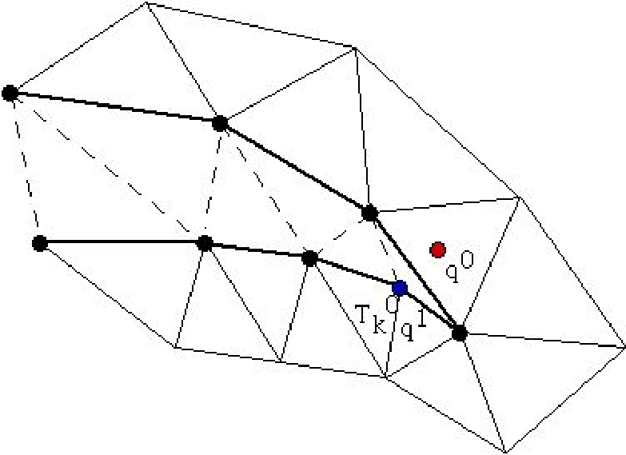

.. role:: freefem(code)
   :language: freefem

.. _finiteElement:

Finite element
==============

As stated in :ref:`tutorials <tutorials>`, FEM approximates all functions :math:`w` as:

.. math::
   w(x,y)\simeq w_0\phi_0(x,y)+w_1\phi_1(x,y)+\cdots+w_{M-1}\phi_{M-1}(x,y)

with finite element basis functions :math:`\phi_k(x,y)` and numbers :math:`w_k` (:math:`k=0,\cdots,M-1`).
The functions :math:`\phi_k(x,y)` are constructed from the triangle :math:`T_{i_k}`, and called *shape functions*.

In **FreeFEM**, the finite element space:

.. math::
   V_h=\left\{w\left|\; w_0\phi_0+w_1\phi_1+\cdots+w_{M-1}\phi_{M-1},\, w_i\in \R\right.\right\}

is easily created by:

.. code-block:: freefem
   :linenos:

   fespace IDspace(IDmesh,<IDFE>);

or with :math:`\ell` pairs of periodic boundary conditions in 2D:

.. code-block:: freefem
   :linenos:

   fespace IDspace(IDmesh,<IDFE>,
       periodic=[[la1, sa1], [lb1, sb1],
                 ...
                 [lak, sak], [lbk, sbl]]);

and in 3D:

.. code-block:: freefem
   :linenos:

   fespace IDspace(IDmesh,<IDFE>,
       periodic=[[la1, sa1, ta1], [lb1, sb1, tb1],
                 ...
                 [lak, sak, tak], [lbk, sbl, tbl]]);

where :freefem:`IDspace` is the name of the space (e.g. :freefem:`Vh`), :freefem:`IDmesh` is the name of the associated mesh and :freefem:`<IDFE>` is an identifier of finite element type.

In 2D we have a pair of periodic boundary conditions, if :math:`[la_i, sa_i]`, :math:`[lb_i, sb_i]` is a pair of :freefem:`int`, and the 2 labels :math:`la_i` and :math:`lb_i` refer to 2 pieces of boundary to be in equivalence.

If :math:`[la_i, sa_i]`, :math:`[lb_i, sb_i]` is a pair of :freefem:`real`, then :math:`sa_i` and :math:`sb_i` give two common abscissa on the two boundary curves, and two points are identified as one if the two abscissa are equal.

In 2D, we have a pair of periodic boundary conditions, if :math:`[la_i, sa_i, ta_i]`, :math:`[lb_i, sb_i, tb_i]` is a pair of :freefem:`int`, the 2 labels :math:`la_i` and :math:`lb_i` define the 2 pieces of boundary to be in equivalence.

If :math:`[la_i, sa_i, ta_i]`, :math:`[lb_i, sb_i, tb_i]` is a pair of :freefem:`real`, then :math:`sa_i`, :math:`ta_i` and :math:`sb_i`, :math:`tb_i` give two common parameters on the two boundary surfaces, and two points are identified as one if the two parameters are equal.

.. note:: The 2D mesh of the two identified borders must be the same, so to be sure, use the parameter :freefem:`fixedborder=true` in :freefem:`buildmesh` command (see :ref:`fixedborder <meshBorder>`).

As of today, the known types of finite elements are:

-  :freefem:`[P0, P03d]` piecewise constant discontinuous finite element (2d, 3d), the degrees of freedom are the barycenter element value.

    .. math::
        \P^0_{h} = \left\{ v \in L^2(\Omega) \left|\; \textrm{for all }K \in \mathcal{T}_{h}\;\;\textrm{there is }\alpha_{K}\in \R : \;\; v_{|K} = \alpha_{K } \right.\right\}
        :label: eq:P0

-  :freefem:`[P1, P13d]` piecewise linear continuous finite element (2d, 3d), the degrees of freedom are the vertices values.

    .. math::
        \P^1_{h} = \left\{ v \in H^{1}(\Omega) \left|\; \forall K \in \mathcal{T}_{h},\ v_{|K} \in P_{1} \right.\right\}
        :label: eq:P1

-  :freefem:`[P1dc]` piecewise linear discontinuous finite element

    .. math::
        \P^1_{dc|h} = \left\{ v \in L^{2}(\Omega) \left|\; \forall K \in \mathcal{T}_{h}, \ v_{|K} \in P_{1} \right.\right\}
        :label: eq:P1dc

   .. warning:: Due to an interpolation problem, the degree of freedom is not the vertices but three vertices which move inside :math:`T(X)= G + .99 (X-G)` where :math:`G` is the barycenter.

-  :freefem:`[P1b, P1b3d]` piecewise linear continuous finite element plus bubble (2d, 3d)

   **The 2D Case:**

    .. math::
        \P^1_{b|h} = \left\{ v \in H^{1}(\Omega) \left|\; \forall K \in \mathcal{T}_{h}, \ v_{|K} \in P_{1} \oplus \mathrm{Span}\{ \lambda^{K}_{0} \lambda^{K}_{1} \lambda^{K}_{2} \} \right.\right\}
        :label: eq:P1b

   **The 3D Case:**

    .. math::
        \P^1_{b|h} = \left\{ v \in H^{1}(\Omega) \left|\; \forall K \in \mathcal{T}_{h}, \ v_{|K} \in P_{1} \oplus \mathrm{Span}\{ \lambda^{K}_{0} \lambda^{K}_{1} \lambda^{K}_{2} \lambda^{K}_{3} \} \right.\right\}
        :label: eq:P1b-3d

    where :math:`\lambda^{K}_{i}, i=0,..,d` are the :math:`d+1` barycentric coordinate functions of the element :math:`K` (triangle or tetrahedron).

-  :freefem:`P1bl,P1bl3d` piecewise linear continuous finite element plus linear bubble (2d, 3d).

   The bubble is built by splitting the :math:`K`, a barycenter in :math:`d+1` sub element. (need :freefem:`load "Element_P1bl"`)

-  :freefem:`[P2, P23d]` piecewise :math:`P_{2}` continuous finite element (2d, 3d)

    .. math::
        \P^2_{h} = \left\{ v \in H^{1}(\Omega) \left|\; \forall K \in \mathcal{T}_{h}, \ v_{|K} \in P_{2} \right.\right\}

    where :math:`P_{2}` is the set of polynomials of :math:`\R^{2}` of degrees :math:`\le 2`.

-  :freefem:`[P2b]` piecewise :math:`P_{2}` continuous finite element plus bubble

    .. math::
        \P^2_{h} = \left\{ v \in H^{1}(\Omega) \left|\; \forall K \in \mathcal{T}_{h}, \ v_{|K} \in P_{2} \oplus \mathrm{Span}\{ \lambda^{K}_{0} \lambda^{K}_{1} \lambda^{K}_{2} \} \right.\right\}

-  :freefem:`[P2dc]` piecewise :math:`P_{2}` discontinuous finite element

    .. math::
        \P^2_{dc|h} = \left\{ v \in L^{2}(\Omega) \left|\; \forall K \in \mathcal{T}_{h}, \ v_{|K} \in P_{2} \right.\right\}

   .. warning:: Due to an interpolation problem, the degree of freedom is not the six P2 nodes but six nodes which move inside :math:`T(X)= G + .99 (X-G)` where :math:`G` is the barycenter.

-  :freefem:`[P2h]` quadratic homogeneous continuous (without :freefem:`P1`).

-  :freefem:`[P3]` piecewise :math:`P_{3}` continuous finite element (2d) (needs :freefem:`load "Element_P3"`)

    .. math::
        \P^3_{h} = \left\{ v \in H^{1}(\Omega) \left|\; \forall K \in \mathcal{T}_{h}, \ v_{|K} \in P_{3} \right.\right\}

    where :math:`P_{3}` is the set of polynomials of :math:`\R^{2}` of degrees :math:`\le 3`.

-  :freefem:`[P3dc]` piecewise :math:`P_{3}` discontinuous finite element (2d) (needs :freefem:`load "Element_P3dc"`)

    .. math::
        \P^3_{dc|h} = \left\{ v \in L^2(\Omega) \left|\; \forall K \in \mathcal{T}_{h}, \ v_{|K} \in P_{3} \right.\right\}

    where :math:`P_{3}` is the set of polynomials of :math:`\R^{2}` of degrees :math:`\le 3`.

-  :freefem:`[P4]` piecewise :math:`P_{4}` continuous finite element (2d) (needs :freefem:`load "Element_P4"`)

    .. math::
        \P^4_{h} = \left\{ v \in H^{1}(\Omega) \left|\; \forall K \in \mathcal{T}_{h},\ v_{|K} \in P_{4} \right.\right\}

    where :math:`P_{4}` is the set of polynomials of :math:`\R^{2}` of degrees :math:`\le 4`.

-  :freefem:`[P4dc]` piecewise :math:`P_{4}` discontinuous finite element (2d) (needs :freefem:`load "Element_P4dc"`)

    .. math::
        \P^4_{dc|h} = \left\{ v \in L^2(\Omega) \left|\; \forall K \in \mathcal{T}_{h}, \ v_{|K} \in P_{3} \right.\right\}

    where :math:`P_{4}` is the set of polynomials of :math:`\R^{2}` of degrees :math:`\le 3`.

-  :freefem:`[P0Edge]` piecewise :math:`P_{0}` discontinuous finite element (2d) contained on each edge of the mesh.

-  :freefem:`[P1Edge]` piecewise :math:`P_{1}` discontinuous finite element (2d) (needs :freefem:`load "Element_PkEdge"`) :math:`P_1` on each edge of the mesh.

-  :freefem:`[P2Edge]` piecewise :math:`P_{2}` discontinuous finite element (2d) (needs :freefem:`load "Element_PkEdge"`) :math:`P_2` on each edge of the mesh.

-  :freefem:`[P3Edge]` piecewise :math:`P_{3}` discontinuous finite element (2d) (needs :freefem:`load "Element_PkEdge"`) :math:`P_3` on each edge of the mesh.

-  :freefem:`[P4Edge]` piecewise :math:`P_{4}` discontinuous finite element (2d) (needs :freefem:`load "Element_PkEdge"`) :math:`P_4` on each edge of the mesh.

-  :freefem:`[P5Edge]` piecewise :math:`P_{5}` discontinuous finite element (2d) (needs :freefem:`load "Element_PkEdge"`) :math:`P_5` on each edge of the mesh.

-  :freefem:`[P2Morley]` piecewise :math:`P_{2}` non conform finite element (2d) (needs :freefem:`load "Morley"`)

    .. math::
        \P^2_{h} = \left\{ v \in L^2(\Omega) \left|\; \forall K \in \mathcal{T}_{h}, \ v_{|K} \in P_{3},
        \left\{\begin{array}{c}
            v \mbox{ continuous at vertices,}\\
            \p_n{v} \mbox{ continuous at middle of edge,}
        \end{array}\right.
        \right.\right\}

    where :math:`P_{2}` is the set of polynomials of :math:`\R^{2}` of degrees :math:`\le 2`.

    .. warning:: To build the interplant of a function :math:`u` (scalar) for this finite element, we need the function and 2 partial derivatives :math:`(u,u_x, u_y)`, creating this vectorial finite element with 3 components :math:`(u,u_x,u_y)`.

    See our example for solving the BiLaplacien problem:

    .. code-block:: freefem
        :linenos:

        load "Morley"

        // Parameters
        int nn = 10;
        real h = 0.01;

        real f = 1;

        // Mesh
        mesh Th = square(nn, nn);
        Th = adaptmesh(Th, h, IsMetric=1);

        // Fespace
        fespace Vh(Th, P2Morley); //The Morley finite element space
        Vh [u, ux, uy], [v, vx, vy];

        // Macro
        macro bilaplacien(u, v) (dxx(u)*dxx(v) + dyy(u)*dyy(v) + 2.*dxy(u)*dxy(v)) //

        // Problem
        solve bilap ([u, ux, uy], [v, vx, vy])
            = int2d(Th)(
                bilaplacien(u, v)
            )
            - int2d(Th)(
                f*v
            )
            + on(1, 2, 3, 4, u=0, ux=0, uy=0)
            ;

        // Plot
        plot(u, cmm="u");

-  :freefem:`[HCT]` :math:`P_3` :math:`C^1` conforms finite element (2d) (needs :freefem:`load "Element_HCT"`) one 3 sub triangles.

    Lets call :math:`\mathcal{T}^\triangle_{h}` the sub mesh of :math:`\mathcal{T}_{h}` where all triangles are split in 3 at the barycenter.

    .. math::
        \P^{HCT}_{h} = \left\{ v \in C^1(\Omega) \left|\; \forall K \in \mathcal{T}^\triangle_{h}, \ v_{|K} \in P_{3} \right.\right\}

    where :math:`P_{3}` is the set of polynomials of :math:`\R^{2}` of degrees :math:`\le 3`.

    The degrees of freedom are the values of the normal derivative at the mid-point of each edge [BERNADOU1980]_.

    .. warning:: To build the interplant of a function :math:`u` (scalar) for this finite element, we need the function and 2 partial derivatives :math:`(u,u_x, u_y)`, creating this vectorial finite element with 3 components :math:`(u,u_x,u_y)` like in previous finite element.

-  :freefem:`[P2BR]` (needs :freefem:`load "BernadiRaugel"`) the Bernadi Raugel Finite Element is a Vectorial element (2d) with 2 components, see [BERNARDI1985]_.

    It is a 2D coupled Finite Element, where the Polynomial space is :math:`P_1^2` with 3 normal bubble edge functions :math:`(P_2)`.
    There are 9 degrees of freedom:

    - 2 components at each of the 3 vertices and
    - the 3 flux on the 3 edges.

-  :freefem:`[RT0, RT03d]` Raviart-Thomas finite element of degree :math:`0`.

    **The 2D Case:**

    .. math::
        RT0_{h} = \left\{ \mathbf{v} \in H(\textrm{div}) \left|\; \forall K \in \mathcal{T}_{h} ,\ \mathbf{v}_{|K}(x,y) =
        \vecttwo{\alpha^1_{K}}{\alpha^2_{K}} + \beta_{K}\vecttwo{x}{y} \right.\right\}
        :label: eq:RT0

    **The 3D Case:**

    .. math::
        RT0_{h} = \left\{ \mathbf{v} \in H(\textrm{div}) \left|\; \forall K \in \mathcal{T}_{h},\ \mathbf{v}_{|K}(x,y,z) =
        \vectthree{\alpha^1_{K}}{\alpha^2_{K}}{\alpha^3_{K}} + \beta_{K}\vectthree{x}{y}{z} \right.\right\}
        :label: eq:RT03d

    where by writing :math:`\textrm{div }\mathbf{w}=\sum_{i=1}^d\p w_i/\p x_i` with :math:`\mathbf{w}=(w_i)_{i=1}^d`:

    .. math::
        H(\textrm{div})=\left\{\mathbf{w}\in L^{2}(\Omega)^d\left|\textrm{div } \mathbf{w}\in L^{2}(\Omega)\right.\right\}

    and where :math:`\alpha^1_{K}`, :math:`\alpha^2_{K}`, :math:`\alpha^3_{K}`, :math:`\beta_{K}` are real numbers.

-  :freefem:`[RT0Ortho]` Raviart-Thomas Orthogonal, or Nedelec finite element type I of degree :math:`0` in dimension 2

    .. math::
        RT0Ortho{h} = \left\{ \mathbf{v} \in H(\textrm{curl}) \left|\; \forall K \in \mathcal{T}_{h},\ \mathbf{v}_{|K}(x,y) =
        \vecttwo{\alpha^1_{K}}{\alpha^2_{K}} + \beta_{K}\vecttwo{-y}{x} \right.\right\}
        :label: RT0Ortho

-  :freefem:`[Edge03d]` 3d Nedelec finite element or Edge Element of degree :math:`0`.

    .. math::
        Edge0_{h} = \left\{ \mathbf{v} \in H(\textrm{Curl}) \left|\; \forall K \in\mathcal{T}_{h}, \ \mathbf{v}_{|K}(x,y,z) =
            \vectthree{\alpha^1_{K}}{\alpha^2_{K}}{\alpha^3_{K}} + \vectthree{\beta^1_{K}}{\beta^2_{K}}{\beta^3_{K}}\times\vectthree{x}{y}{z} \right.\right\}
        :label:eq:Edge03d

    where by writing :math:`\textrm{curl}\mathbf{w}=\vectthree{\p w_2/\p x_3-\p w_3/\p x_2}{\p w_3/\p x_1-\p w_1/\p x_3}{\p w_1/\p x_2-\p w_2/\p x_1}` with :math:`\mathbf{w}=(w_i)_{i=1}^d`:

    .. math::
        H(\textrm{curl})=\left\{\mathbf{w}\in L^{2}(\Omega)^d\left|\textrm{curl } \mathbf{w}\in L^{2}(\Omega)^d\right.\right\}

    and :math:`\alpha^1_{K},\alpha^2_{K},\alpha^3_{K},\beta^1_{K},\beta^2_{K},\beta^3_{K}` are real numbers.

-  :freefem:`[Edge13d]` (needs :freefem:`load "Element_Mixte3d"`) 3d Nedelec finite element or Edge Element of degree :math:`1`.

-  :freefem:`[Edge23d]` (needs :freefem:`load "Element_Mixte3d"`) 3d Nedelec finite element or Edge Element of degree :math:`2`.

-  :freefem:`[P1nc]` piecewise linear element continuous at the mid-point of the edge only in 2D (Crouzeix-Raviart Finite Element 2D).

-  :freefem:`[P2pnc]` piecewise quadratic plus a P3 bubble element with the continuity of the 2 moments on each edge (needs :freefem:`load "Element_P2pnc"`)

-  :freefem:`[RT1]` (needs :freefem:`load "Element_Mixte"`)

    .. math::
        RT1_{h} = \left\{ \mathbf{v} \in H(\textrm{div}) \left|\; \forall K \in\mathcal{T}_{h}, \ \alpha^1_{K}, \alpha^2_{K}, \beta_{K} \in P_1^2,P_0, \mathbf{v}_{|K}(x,y) =
            \vecttwo{\alpha^1_{K}}{\alpha^2_{K}} + \beta_{K}\vecttwo{x}{y} \right.\right\}
        :label: eq:RT1

-  :freefem:`[RT1Ortho]` (needs :freefem:`load "Element_Mixte"`)

    .. math::
        RT1_{h} = \left\{ \mathbf{v} \in H(\textrm{curl}) \left|\; \forall K \in\mathcal{T}_{h},\ \alpha^1_{K}, \alpha^2_{K}, \beta_{K} \in P_1^2,P_0, \mathbf{v}_{|K}(x,y) =
            \vecttwo{\alpha^1_{K}}{\alpha^2_{K}} + \beta_{K}\vecttwo{-y}{x} \right.\right\}
        :label: eq:RT1Ortho

-  :freefem:`[RT2]` (needs :freefem:`load "Element_Mixte"`)

    .. math::
        RT2_{h} = \left\{ \mathbf{v} \in H(\textrm{div}) \left|\; \forall K \in\mathcal{T}_{h},\ \alpha^1_{K}, \alpha^2_{K}, \beta_{K} \in P_2^2, P_1, \mathbf{v}_{|K}(x,y) =
            \vecttwo{\alpha^1_{K}}{\alpha^2_{K}} + \beta_{K}\vecttwo{x}{y} \right.\right\}
        :label: eq:RT2

-  :freefem:`[RT2Ortho]` (needs :freefem:`load "Element_Mixte"`)

    .. math::
        RT2_{h} = \left\{ \mathbf{v} \in H(\textrm{curl}) \left|\; \forall K \in\mathcal{T}_{h} ,\ \alpha^1_{K}, \alpha^2_{K}, \beta_{K} \in P_2^2, P_1,\ \mathbf{v}_{|K}(x,y) =
            \vecttwo{\alpha^1_{K}}{\alpha^2_{K}} + \beta_{K}\vecttwo{-y}{x} \right.\right\}
        :label: eq:RT2Ortho

-  :freefem:`[BDM1]` (needs :freefem:`load "Element_Mixte"`) the Brezzi-Douglas-Marini finite element:

    .. math::
        BDM1_{h} = \left\{ \mathbf{v} \in H(\textrm{div}) \left|\; \forall K \in\mathcal{T}_{h},\ \mathbf{v}_{|K} \in P_1^2\right.\right\}
        :label: eq:BDM1

-  :freefem:`[BDM1Ortho]` (needs :freefem:`load "Element_Mixte"`) the Brezzi-Douglas-Marini Orthogonal also call Nedelec of type II , finite element

    .. math::
        BDM1Ortho_{h} = \left\{ \mathbf{v} \in H(\textrm{curl}) \left|\; \forall K \in\mathcal{T}_{h},\ \mathbf{v}_{|K} \in P_1^2\right.\right\}
        :label: eq:BDM1Ortho

-  :freefem:`[FEQF]` (needs :freefem:`load "Element_QF"`) the finite element to store functions at default quadrature points (so the quadrature is :freefem:`qf5pT` in 2D and is :freefem:`qfV5` in 3d).

    For over quadrature you have the following corresponding finite element’s quadrature formula.

    -  :freefem:`FEQF1` :math:`\mapsto` :freefem:`qf1pT`,
    -  :freefem:`FEQF2` :math:`\mapsto` :freefem:`qf2pT`,
    -  :freefem:`FEQF5` :math:`\mapsto` :freefem:`qf5pT`,
    -  :freefem:`FEQF7` :math:`\mapsto` :freefem:`qf7pT`,
    -  :freefem:`FEQF9` :math:`\mapsto` :freefem:`qf9pT`,
    -  :freefem:`FEQF13d` :math:`\mapsto` :freefem:`qfV1`,
    -  :freefem:`FEQF23d` :math:`\mapsto` :freefem:`qfV2`,
    -  :freefem:`FEQF53d` :math:`\mapsto` :freefem:`qfV5`

You can use this element to optimize the storage and reuse of functions with a long formula inside an integral for non linear processes.

Use of freefem fespace in 2D
----------------------------

With the 2D finite element spaces

.. math::
    X_{h} = \left\{ v \in H^{1}(]0,1[^2) |\; \forall K \in \mathcal{T}_{h}\quad v_{|K} \in P_{1} \right\}

.. math::
    X_{ph} = \left\{ v \in X_{h} |\; v\left(\vecttwo{0}{.}\right) = v\left(\vecttwo{1}{.}\right) , v\left(\vecttwo{.}{0}\right) = v\left(\vecttwo{.}{1}\right) \right\}

.. math::
    M_{h} = \left\{ v \in H^{1}(]0,1[^2) |\; \forall K \in \mathcal{T}_{h}\quad v_{|K} \in P_{2} \right\}

.. math::
    R_{h} = \left\{ \mathbf{v} \in H^{1}(]0,1[^2)^{2} |\; \forall K \in \mathcal{T}_{h}\quad \mathbf{v}_{|K}(x,y) = \vecttwo{\alpha_{K}}{\beta_{K}} + \gamma_{K}\vecttwo{x}{y} \right\}

when :math:`\mathcal{T}_h` is a mesh :math:`10\times 10` of the unit square :math:`]0,1[^2`, we only write in **FreeFEM**:

.. code-block:: freefem
    :linenos:

    mesh Th = square(10, 10);
    fespace Xh(Th, P1); //scalar FE
    fespace Xph(Th,P1,
        periodic=[[2, y], [4, y], [1, x], [3, x]]); //bi-periodic FE
    fespace Mh(Th, P2); //scalar FE
    fespace Rh(Th, RT0); //vectorial FE

where :freefem:`Xh, Mh, Rh` expresses finite element spaces (called FE spaces) :math:`X_h,\, M_h,\, R_h`, respectively.

To use FE-functions :math:`u_{h},v_{h} \in X_{h}`, :math:`p_{h},q_{h} \in M_{h}` and :math:`U_{h},V_{h} \in R_{h}`, we write:

.. code-block:: freefem
    :linenos:

    Xh uh, vh;
    Xph uph, vph;
    Mh ph, qh;
    Rh [Uxh, Uyh], [Vxh, Vyh];
    Xh[int] Uh(10);         //array of 10 functions in Xh
    Rh[int] [Wxh, Wyh](10); //array of 10 functions in Rh
    Wxh[5](0.5,0.5);        //the 6th function at point (0.5, 0.5)
    Wxh[5][];               //the array of the degree of freedom of the 6th function

The functions :math:`U_{h}, V_{h}` have two components so we have

.. math::
    U_{h}=\vecttwo{Uxh}{Uyh} \quad \mbox{and}\quad V_{h}=\vecttwo{Vxh}{Vyh}

Use of fespace in 3D
--------------------

With the 3D finite element spaces

.. math::
    X_{h} = \{ v \in H^{1}(]0,1[^3) |\; \forall K \in \mathcal{T}_{h}\quad v_{|K} \in P_{1} \}

.. math::
    X_{ph} = \left\{ v \in X_{h} |\; v\left(\vecttwo{0}{.}\right) = v\left(\vecttwo{1}{.}\right) , v\left(\vecttwo{.}{0}\right) = v\left(\vecttwo{.}{1}\right) \right\}

.. math::
    M_{h} = \{ v \in H^{1}(]0,1[^2) |\; \forall K \in \mathcal{T}_{h}\quad v_{|K} \in P_{2} \}

.. math::
    R_{h} = \left\{ \mathbf{v} \in H^{1}(]0,1[^2)^{2} |\; \forall K \in \mathcal{T}_{h}\quad \mathbf{v}_{|K}(x,y) = \vecttwo{\alpha_{K}}{\beta_{K}} + \gamma_{K}\vecttwo{x}{y} \right\}

when :math:`\mathcal{T}_h` is a mesh :math:`10\times 10\times 10` of the unit cubic :math:`]0,1[^2`, we write in **FreeFEM**:

.. code-block:: freefem
    :linenos:

    mesh3 Th = buildlayers(square(10, 10),10, zbound=[0,1]);
    //label: 0 up, 1 down, 2 front, 3 left, 4 back, 5 right
    fespace Xh(Th, P1); //scalar FE
    fespace Xph(Th, P1,
        periodic=[[0, x, y], [1, x, y],
            [2, x, z], [4, x, z],
            [3, y, z], [5, y, z]]); //three-periodic FE
    fespace Mh(Th, P2); //scalar FE
    fespace Rh(Th, RT03d); //vectorial FE

where :freefem:`Xh, Mh, Rh` expresses finite element spaces (called FE spaces) :math:`X_h,\, M_h,\, R_h`, respectively.

To define and use FE-functions :math:`u_{h},v_{h} \in X_{h}`, :math:`p_{h},q_{h} \in M_{h}` and :math:`U_{h},V_{h} \in R_{h}`, we write:

.. code-block:: freefem
    :linenos:

    Xh uh, vh;
    Xph uph, vph;
    Mh ph, qh;
    Rh [Uxh, Uyh, Uyzh], [Vxh, Vyh, Vyzh];
    Xh[int] Uh(10);             //array of 10 functions in Xh
    Rh[int] [Wxh,Wyh,Wzh](10);  // array of 10 functions in Rh
    Wxh[5](0.5,0.5,0.5);        //the 6th function at point (0.5, 0.5, 0.5)
    Wxh[5][];                   //the array of the degree of freedom of the 6th function

The functions :math:`U_{h}, V_{h}` have three components, so we have:

.. math::
    U_{h}=\vectthree{Uxh}{Uyh}{Uzh} \quad \mbox{and}\quad V_{h}=\vectthree{Vxh}{Vyh}{Vzh}

.. note:: One challenge of the periodic boundary condition is that the mesh must have equivalent faces.

    The :freefem:`buildlayers` mesh generator splits each quadrilateral face with the diagonal passing through the vertex with maximum number, so to be sure to have the same mesh one both face periodic the 2D numbering in corresponding edges must be compatible (for example the same variation).

    By Default, the numbering of square vertex is correct.

    To change the mesh numbering you can use the :freefem:`change` function like:

    .. code-block:: freefem
        :linenos:

        {
            int[int] old2new(0:Th.nv-1); //array set on 0, 1, .., nv-1
            fespace Vh2(Th, P1);
            Vh2 sorder = x+y; //choose an order increasing on 4 square borders with x or y
            sort(sorder[], old2new); //build the inverse permutation
            int[int] new2old = old2new^-1; //inverse the permutation
            Th = change(Th, renumv=new2old);
        }

    The full example is in :ref:`examples <examplePeriodic3D>`.

Lagrangian Finite Elements
--------------------------

P0-element
~~~~~~~~~~

For each triangle (d=2) or tetrahedron (d=3) :math:`T_k`, the basis function :math:`\phi_k` in :freefem:`Vh(Th, P0)` is given by:

.. math::
    \phi_k(\mathbf{x})=
    \left\{
    \begin{array}{cl}
        1 & \textrm{ if }(\mathbf{x})\in T_k\\
        0 & \textrm{ if }(\mathbf{x})\not\in T_k
    \end{array}
    \right.

If we write:

.. code-block:: freefem
    :linenos:

    Vh(Th, P0);
    Vh fh = f(x,y);

then for vertices :math:`q^{k_i},\, i=1,2,.. d+1` in :numref:`finiteElementP1P2`, :math:`f_h` is built as :freefem:`fh=` :math:`\displaystyle f_h(x,y)=\sum_k f(\frac{\sum_i q^{k_i}}{d+1}) \phi_k`

See :numref:`finiteElementProjP0` for the projection of :math:`f(x,y)=\sin(\pi x)\cos(\pi y)` on :freefem:`Vh(Th, P0)` when the mesh :freefem:`Th` is a :math:`4\times 4`-grid of :math:`[-1,1]^2` as in :numref:`finiteElementP0P1P2P1nc`.

P1-element
~~~~~~~~~~

.. figure:: images/FiniteElement_P1P2.png
    :name: finiteElementP1P2
    :width: 100%

    :math:`P_1` and :math:`P_2` degrees of freedom on triangle :math:`T_k`

For each vertex :math:`q^i`, the basis function :math:`\phi_i` in :freefem:`Vh(Th, P1)` is given by:

.. math::
    \phi_i(x,y)&=a^k_i+b^k_ix+c^k_iy \textrm{ for }(x,y)\in T_k,\\
    \phi_i(q^i)&=1,\quad \phi_i(q^j)=0 \textrm{ if }i\neq j

The basis function :math:`\phi_{k_1}(x,y)` with the vertex :math:`q^{k_1}` in :numref:`finiteElementP1P2` at point :math:`p=(x,y)` in triangle :math:`T_k` simply coincide with the *barycentric coordinates* :math:`\lambda^k_1` *(area coordinates)*:

.. math::
    \phi_{k_1}(x,y) = \lambda^k_{1}(x,y)=
    \frac{\textrm{area of triangle} (p, q^{k_2},q^{k_3})}
    {\textrm{area of triangle}(q^{k_1},q^{k_2},q^{k_3})}

If we write:

.. code-block:: freefem
   :linenos:

   Vh(Th, P1);
   Vh fh = g(x.y);

then:

:freefem:`fh =` :math:`\displaystyle f_h(x,y)=\sum_{i=1}^{n_v}f(q^i)\phi_i(x,y)`

See :numref:`finiteElementProjP1` for the projection of :math:`f(x,y)=\sin(\pi x)\cos(\pi y)` into :freefem:`Vh(Th, P1)`.

.. subfigstart::

.. _finiteElementP0P1P2P1nc:

.. figure:: images/FiniteElement_P0P1P2P1nc.png
   :alt: FiniteElement_P0P1P2P1nc
   :width: 90%

   Test mesh :freefem:`Th` for projection

.. _finiteElementProjP0:

.. figure:: images/FiniteElement_projP0.png
   :alt: FiniteElement_projP0
   :width: 90%

   Projection to :freefem:`Vh(Th, P0)`

.. subfigend::
   :width: 0.49
   :alt: FiniteElement
   :label: FiniteElement

   Finite element :freefem:`P0`

P2-element
~~~~~~~~~~

For each vertex or mid-point :math:`q^i`.
The basis function :math:`\phi_i` in :freefem:`Vh(Th, P2)` is given by:

.. math::
    \begin{array}{rcl}
        \phi_i(x,y)&=&a^k_i+b^k_ix+c^k_iy+d^k_ix^2+e^k_ixy+f^f_jy^2\textrm{ for }(x,y)\in T_k,\\
        \phi_i(q^i)&=&1,\quad \phi_i(q^j)=0\textrm{ if }i\neq j
    \end{array}

The basis function :math:`\phi_{k_1}(x,y)` with the vertex :math:`q^{k_1}` in :numref:`finiteElementP1P2` is defined by the *barycentric coordinates*:

.. math::
    \phi_{k_1}(x,y) = \lambda^k_{1}(x,y)(2\lambda^k_1(x,y)-1)

and for the mid-point :math:`q^{k_2}`:

.. math::
    \phi_{k_2}(x,y) = 4\lambda^k_1(x,y)\lambda^k_4(x,y)

If we write:

.. code-block:: freefem
   :linenos:

   Vh(Th, P2);
   Vh fh = f(x.y);

then:

:freefem:`fh =` :math:`\displaystyle f_h(x,y)=\sum_{i=1}^{M}f(q^i)\phi_i(x,y)\quad (\textrm{summation over all vertex or mid-point})`

See :ref:`finiteElementProjP2` for the projection of :math:`f(x,y)=\sin(\pi x)\cos(\pi y)` into :freefem:`Vh(Th, P2)`.

.. subfigstart::

.. _finiteElementProjP1:

.. figure:: images/FiniteElement_projP1.png
   :alt: FiniteElement_projP1
   :width: 90%

   Projection to :freefem:`Vh(Th, P1)`

.. _finiteElementProjP2:

.. figure:: images/FiniteElement_projP2.png
   :alt: FiniteElement_projP2
   :width: 90%

   Projection to :freefem:`Vh(Th, P2)`

.. subfigend::
   :width: 0.49
   :alt: FiniteElement
   :label: FiniteElement

   Finite elements :freefem:`P1, P2`

P1 Nonconforming Element
------------------------

Refer to [THOMASSET2012]_ for details; briefly, we now consider non-continuous approximations so we will lose the property:

.. math::
    w_h\in V_h\subset H^1(\Omega)

If we write:

.. code-block:: freefem
    :linenos:

    Vh(Th, P1nc);
    Vh fh = f(x.y);

then:

:freefem:`fh =` :math:`\displaystyle f_h(x,y)=\sum_{i=1}^{n_v}f(m^i)\phi_i(x,y)\quad (\textrm{summation over all midpoint})`

Here the basis function :math:`\phi_i` associated with the mid-point :math:`m^i=(q^{k_i}+q^{k_{i+1}})/2` where :math:`q^{k_i}` is the :math:`i`-th point in :math:`T_k`, and we assume that :math:`j+1=0` if :math:`j=3`:

.. math::
    \phi_i(x,y) &= a^k_i+b^k_ix+c^k_iy~\textrm{for }(x,y)\in T_k,\\
    \phi_i(m^i) &= 1,\quad \phi_i(m^j)=0\textrm{ if }i\neq j

Strictly speaking :math:`\p \phi_i/\p x,\, \p \phi_i/\p y` contain Dirac distribution :math:`\rho \delta_{\p T_k}`.

The numerical calculations will automatically *ignore* them.
In [THOMASSET2012]_, there is a proof of the estimation

.. math::
    \left(\sum_{k=1}^{n_v}\int_{T_k}|\nabla w-\nabla w_h|^2\d x\d y\right)^{1/2} =O(h)

The basis functions :math:`\phi_k` have the following properties.

1. For the bilinear form :math:`a` defined in :numref:`finiteElementProjP1nc` satisfy:

    .. math::
        \begin{array}{rcl}
            a(\phi_i,\phi_i)>0,\qquad a(\phi_i,\phi_j)&\le& 0\quad\textrm{if }i\neq j\\
            \sum_{k=1}^{n_v}a(\phi_i,\phi_k)&\ge& 0
        \end{array}

2. :math:`f\ge 0 \Rightarrow u_h\ge 0`

3. If :math:`i\neq j`, the basis function :math:`\phi_i` and :math:`\phi_j` are :math:`L^2`-orthogonal:

    .. math::
        \int_{\Omega}\phi_i\phi_j\, \d x\d y=0\qquad \textrm{if }i\neq j

    which is false for :math:`P_1`-element.

See :numref:`finiteElementProjP1nc` for the projection of :math:`f(x,y)=\sin(\pi x)\cos(\pi y)` into :freefem:`Vh(Th, P1nc)`.

.. subfigstart::

.. _finiteElementProjP1nc:

.. figure:: images/FiniteElement_projP1nc.png
   :alt: FiniteElement_projP1nc
   :width: 90%

   Projection to :freefem:`Vh(Th, P1nc)`

.. _finiteElementProjP1b:

.. figure:: images/FiniteElement_projP1b.png
   :alt: FiniteElement_projP1b
   :width: 90%

   Projection to :freefem:`Vh(Th, P1b)`

.. subfigend::
   :width: 0.49
   :alt: FiniteElement
   :label: FiniteElement

   Finite elements :freefem:`P1nc, P1b`

Other FE-space
--------------

For each triangle :math:`T_k\in \mathcal{T}_h`, let :math:`\lambda_{k_1}(x,y),\, \lambda_{k_2}(x,y),\, \lambda_{k_3}(x,y)` be the area cordinate of the triangle (see :numref:`finiteElementP1P2`), and put:

.. math::
    \beta_k(x,y)=27\lambda_{k_1}(x,y)\lambda_{k_2}(x,y)\lambda_{k_3}(x,y)

called *bubble* function on :math:`T_k`.
The bubble function has the feature: 1. :math:`\beta_k(x,y)=0\quad \textrm{if }(x,y)\in \p T_k`.

2. :math:`\beta_k(q^{k_b})=1` where :math:`q^{k_b}` is the barycenter :math:`\frac{q^{k_1}+q^{k_2}+q^{k_3}}{3}`.

If we write:

.. code-block:: freefem
    :linenos:

    Vh(Th, P1b);
    Vh fh = f(x.y);

then:

:freefem:`fh =` :math:`\displaystyle f_h(x,y)=\sum_{i=1}^{n_v}f(q^i)\phi_i(x,y)+\sum_{k=1}^{n_t}f(q^{k_b})\beta_k(x,y)`

See :numref:`finiteElementProjP1b` for the projection of :math:`f(x,y)=\sin(\pi x)\cos(\pi y)` into :freefem:`Vh(Th, P1b)`.

Vector Valued FE-function
-------------------------

Functions from :math:`\R^{2}` to :math:`\R^{N}` with :math:`N=1` are called scalar functions and called *vector valued* when :math:`N>1`.
When :math:`N=2`

.. code-block:: freefem
    :linenos:

    fespace Vh(Th, [P0, P1]) ;

makes the space

.. math::
    V_h=\{\mathbf{w}=(w_1,w_2)|\; w_1\in V_h(\mathcal{T}_h,P_0),\,
    w_2\in V_h(\mathcal{T}_h,P_1)\}

Raviart-Thomas Element
~~~~~~~~~~~~~~~~~~~~~~

In the Raviart-Thomas finite element :math:`RT0_{h}`, the degrees of freedom are the fluxes across edges :math:`e` of the mesh, where the flux of the function :math:`\mathbf{f} : \R^2 \longrightarrow \R^2` is :math:`\int_{e} \mathbf{f}.n_{e}`, :math:`n_{e}` is the unit normal of edge :math:`e`.

This implies an orientation of all the edges of the mesh, for example we can use the global numbering of the edge vertices and we just go from small to large numbers.

To compute the flux, we use a quadrature with one Gauss point, the mid-point of the edge.

Consider a triangle :math:`T_k` with three vertices :math:`(\mathbf{a},\mathbf{b},\mathbf{c})`.

Lets denote the vertices numbers by :math:`i_{a},i_{b},i_{c}`, and define the three edge vectors :math:`\mathbf{e}^{1},\mathbf{e}^{2},\mathbf{e}^{3}` by :math:`sgn(i_{b}-i_{c})(\mathbf{b}-\mathbf{c})`, :math:`sgn(i_{c}-i_{a})(\mathbf{c}-\mathbf{a})`, :math:`sgn(i_{a}-i_{b})(\mathbf{a}-\mathbf{b})`.

We get three basis functions:

.. math::
    \boldsymbol{\phi}^{k}_{1}= \frac{sgn(i_{b}-i_{c})}{2|T_k|}(\mathbf{x}-\mathbf{a}),\quad
    \boldsymbol{\phi}^{k}_{2}= \frac{sgn(i_{c}-i_{a})}{2|T_k|}(\mathbf{x}-\mathbf{b}),\quad
    \boldsymbol{\phi}^{k}_{3}= \frac{sgn(i_{a}-i_{b})}{2|T_k|}(\mathbf{x}-\mathbf{c}),

where :math:`|T_k|` is the area of the triangle :math:`T_k`.
If we write:

.. code-block:: freefem
   :linenos:

   Vh(Th, RT0);
   Vh [f1h, f2h] = [f1(x, y), f2(x, y)];

then:

:freefem:`fh =` :math:`\displaystyle \mathbf{f}_h(x,y)=\sum_{k=1}^{n_t}\sum_{l=1}^6 n_{i_lj_l}|\mathbf{e^{i_l}}|f_{j_l}(m^{i_l})\phi_{i_lj_l}`

where :math:`n_{i_lj_l}` is the :math:`j_l`-th component of the normal vector :math:`\mathbf{n}_{i_l}`,

.. math::
    \{m_1,m_2,m_3\} = \left\{\frac{\mathbf{b}+\mathbf{c}}{2},
    \frac{\mathbf{a}+\mathbf{c}}{2},
    \frac{\mathbf{b}+\mathbf{a}}{2} \right\}

and :math:`i_l=\{1,1,2,2,3,3\},\, j_l=\{1,2,1,2,1,2\}` with the order of :math:`l`.

.. figure:: images/FiniteElement_RT0.png
    :name: finiteElementRT0
    :width: 50%

    Normal vectors of each edge

.. code-block:: freefem
    :linenos:

    // Mesh
    mesh Th = square(2, 2);

    // Fespace
    fespace Xh(Th, P1);
    Xh uh = x^2 + y^2, vh;

    fespace Vh(Th, RT0);
    Vh [Uxh, Uyh] = [sin(x), cos(y)]; //vectorial FE function

    // Change the mesh
    Th = square(5,5);

    //Xh is unchanged
    //Uxh = x; //error: impossible to set only 1 component
              //of a vector FE function
    vh = Uxh;//ok
    //and now vh use the 5x5 mesh
    //but the fespace of vh is always the 2x2 mesh

    // Plot
    plot(uh);
    uh = uh; //do a interpolation of uh (old) of 5x5 mesh
            //to get the new uh on 10x10 mesh
    plot(uh);

    vh([x-1/2, y]) = x^2 + y^2; //interpolate vh = ((x-1/2)^2 + y^2)

.. subfigstart::

.. _finiteElementOnOldMesh:

.. figure:: images/FiniteElement_onoldmesh.png
   :alt: FiniteElement_onoldmesh
   :width: 90%

   :freefem:`vh` Iso on mesh :math:`2\times 2`

.. _finiteElementOnNewMesh:

.. figure:: images/FiniteElement_onnewmesh.png
   :alt: FiniteElement_onnewmesh
   :width: 90%

   :freefem:`vh` Iso on  mesh :math:`5\times 5`

.. subfigend::
   :width: 0.49
   :alt: FiniteElement
   :label: FiniteElement

To get the value at a point :math:`x=1,y=2` of the FE function :freefem:`uh`, or :freefem:`[Uxh, Uyh]`, one writes:

.. code-block:: freefem
    :linenos:

    real value;
    value = uh(2,4); //get value = uh(2, 4)
    value = Uxh(2, 4); //get value = Uxh(2, 4)
    //OR
    x = 1; y = 2;
    value = uh; //get value = uh(1, 2)
    value = Uxh; //get value = Uxh(1, 2)
    value = Uyh; //get value = Uyh(1, 2)

To get the value of the array associated to the FE function :freefem:`uh`, one writes

.. code-block:: freefem
    :linenos:

    real value = uh[][0]; //get the value of degree of freedom 0
    real maxdf = uh[].max; //maximum value of degree of freedom
    int size = uh.n; //the number of degree of freedom
    real[int] array(uh.n) = uh[]; //copy the array of the function uh

.. warning:: For a non-scalar finite element function :freefem:`[Uxh, Uyh]` the two arrays :freefem:`Uxh[]` and :freefem:`Uyh[]` are the same array, because the degree of freedom can touch more than one component.

A Fast Finite Element Interpolator
----------------------------------

In practice, one may discretize the variational equations by the Finite Element method.
Then there will be one mesh for :math:`\Omega_1` and another one for :math:`\Omega_2`.
The computation of integrals of products of functions defined on different meshes is difficult.

Quadrature formula and interpolations from one mesh to another at quadrature points are needed.
We present below the interpolation operator which we have used and which is new, to the best of our knowledge.

Let :math:`{\cal T}_{h}^0=\cup_k T^0_k,{\cal T}_{h}^1=\cup_k T^1_k` be two triangulations of a domain :math:`\Omega`.
Let:

.. math::
    V({\hbox{{\cal T}}_{h}^i}) =\{ C^0(\Omega_h^i)~:~f|_{T^i_k}\in P_0\},~~~i=0,1

be the spaces of continuous piecewise affine functions on each triangulation.

Let :math:`f\in V({\cal T}_{h}^0)`.
The problem is to find :math:`g\in V({\cal T}_{h}^1)` such that:

.. math::
    g(q) = f(q) \quad \forall q\hbox{~vertex of ~} {\cal T}_{h}^1

Although this is a seemingly simple problem, it is difficult to find an efficient algorithm in practice.

We propose an algorithm which is of complexity :math:`N^1\log N^0`, where :math:`N^i` is the number of vertices of :math:`\cal T_{h}^i`, and which is very fast for most practical 2D applications.

**Algorithm**

The method has 5 steps.

First a quadtree is built containing all the vertices of the mesh :math:`{\cal T}_{h}^0` such that in each terminal cell there are at least one, and at most 4, vertices of :math:`{\cal T}_{h}^0`.

For each :math:`q^1`, vertex of :math:`{\cal T}_{h}^1` do:

1. Find the terminal cell of the quadtree containing :math:`q^1`.
2. Find the the nearest vertex :math:`q^0_j` to :math:`q^1` in that cell.
3. Choose one triangle :math:`T_k^0\in{\cal T}_{h}^0` which has :math:`q^0_j` for vertex.
4. Compute the barycentric coordinates :math:`\{\lambda_j\}_{j=1,2,3}` of :math:`q^1` in :math:`T^0_k`.

    -  if all barycentric coordinates are positive, go to Step 5
    -  otherwise, if one barycentric coordinate :math:`\lambda_i` is negative, replace :math:`T^0_k` by the adjacent triangle opposite :math:`q^0_i` and go to Step 4.
    -  otherwise, if two barycentric coordinates are negative, take one of the two randomly and replace :math:`T^0_k` by the adjacent triangle as above.

5. Calculate :math:`g(q^1)` on :math:`T^0_k` by linear interpolation of :math:`f`:

    .. math::
        g(q^1) = \sum_{j=1,2,3} \lambda_j f(q^0_j)

    To interpolate a function at :math:`q^0`, the knowledge of the triangle which contains :math:`q^0` is needed. The algorithm may start at :math:`q^1\in T_k^0` and stall on the boundary (thick line) because the line :math:`q^0q^1` is not inside :math:`\Omega`.
    But if the holes are triangulated too (doted line) then the problem does not arise.

Two problems need to be solved:

-  *What if :math:`q^1` is not in* :math:`\Omega^0_h` *?* Then Step 5 will stop with a boundary triangle.

    So we add a step which tests the distance of :math:`q^1` with the two adjacent boundary edges and selects the nearest, and so on till the distance grows.

-  *What if* :math:`\Omega^0_h` *is not convex and the marching process of Step 4 locks on a boundary?* By construction Delaunay-Voronoï’s mesh generators always triangulate the convex hull of the vertices of the domain.

    Therefore, we make sure that this information is not lost when :math:`{\cal T}_{h}^0,{\cal T}_{h}^1` are constructed and we keep the triangles which are outside the domain on a special list.

    That way, in step 5 we can use that list to step over holes if needed.

.. note:: Sometimes, in rare cases, the interpolation process misses some points, we can change the search algorithm through a global variable :freefem:`searchMethod`

    .. code-block:: freefem
        :linenos:

        searchMethod = 0; // default value for fast search algorithm
        searchMethod = 1; // safe search algorithm, uses brute force in case of missing point
        // (warning: can be very expensive in cases where a lot of points are outside of the domain)
        searchMethod = 2; // always uses brute force. It is very computationally expensive.

.. note:: Step 3 requires an array of pointers such that each vertex points to one triangle of the triangulation.

.. note:: The operator :freefem:`=` is the interpolation operator of **FreeFEM**, the continuous finite functions are extended by continuity to the outside of the domain.

   Try the following example :

    .. code-block:: freefem
        :linenos:

        // Mesh
        mesh Ths = square(10, 10);
        mesh Thg = square(30, 30, [x*3-1, y*3-1]);
        plot(Ths, Thg, wait=true);

        // Fespace
        fespace Ch(Ths, P2);
        Ch us = (x-0.5)*(y-0.5);

        fespace Dh(Ths, P2dc);
        Dh vs = (x-0.5)*(y-0.5);

        fespace Fh(Thg, P2dc);
        Fh ug=us, vg=vs;

        // Plot
        plot(us, ug, wait=true);
        plot(vs, vg, wait=true);

    .. subfigstart::

    .. _finiteElementUsUg:

    .. figure:: images/FiniteElement_UsUg.png
        :alt: FiniteElement_UsUg
        :width: 90%

        Extension of a continuous FE-function

    .. _finiteElementVsVg:

    .. figure:: images/FiniteElement_VsVg.png
        :alt: FiniteElement_VsVg
        :width: 90%

        Extension of discontinuous FE-function

    .. subfigend::
        :width: 0.49
        :alt: Extension
        :label: Extension

        Extension of FE-function

Keywords: Problem and Solve
---------------------------

For **FreeFEM**, a problem must be given in variational form, so we need a bilinear form :math:`a(u,v)`, a linear form :math:`\ell(f,v)`, and possibly a boundary condition form must be added.

.. code-block:: freefem
    :linenos:

    problem P (u, v)
        = a(u,v) - l(f,v)
        + (boundary condition)
        ;

.. note:: When you want to formulate the problem and solve it in the same time, you can use the keyword :freefem:`solve`.

Weak Form and Boundary Condition
~~~~~~~~~~~~~~~~~~~~~~~~~~~~~~~~

To present the principles of Variational Formulations, also called weak form, for the Partial Differential Equations, let’s take a model problem: a Poisson equation with Dirichlet and Robin Boundary condition.

The problem: Find :math:`u` a real function defined on a domain :math:`\Omega` of :math:`\R^d` :math:`(d=2,3)` such that:

.. math::
    \begin{array}{rcll}
        -\nabla\cdot(\kappa \nabla u) &=& f & \mbox{ in }\Omega\\
        a u + \kappa \frac{\p u}{\p n} &=& b & \mbox{ on }\Gamma_r\\
        u &=& g & \mbox{ on }\Gamma_d
    \end{array}

where:

-  if :math:`d=2` then :math:`\nabla.(\kappa \nabla u) = \p_x(\kappa \p_x u ) + \p_y(\kappa \p_y u )` with :math:`\p_x u = \frac{\p u}{\p x}` and :math:`\p_y u = \frac{\p u}{\p y}`
-  if :math:`d=3` then :math:`\nabla.(\kappa \nabla u) = \p_x(\kappa \p_x u) + \p_y(\kappa \p_y u) + \p_z(\kappa \p_z u)` with :math:`\p_x u = \frac{\p u}{\p x}`, :math:`\p_y u = \frac{\p u}{\p y}` and , :math:`\p_z u = \frac{\p u}{\p z}`
-  The border :math:`\Gamma=\p \Omega` is split in :math:`\Gamma_d` and :math:`\Gamma_n` such that :math:`\Gamma_d \cap \Gamma_n = \emptyset` and :math:`\Gamma_d \cup \Gamma_n = \p \Omega`,
-  :math:`\kappa` is a given positive function, such that :math:`\exists \kappa_0 \in \R ,\quad 0 < \kappa_0 \leq \kappa`.
-  :math:`a` a given non negative function,
-  :math:`b` a given function.

.. note:: This is the well known Neumann boundary condition if :math:`a=0`, and if :math:`\Gamma_d` is empty.

    In this case the function appears in the problem just by its derivatives, so it is defined only up to a constant (if :math:`u` is a solution then :math:`u+c` is also a solution).

Let :math:`{v}`, a regular test function, null on :math:`\Gamma_d`, by integration by parts we get:

.. math::
    - \int_{\Omega} \nabla\cdot(\kappa \nabla u) \, {v} \,d\omega
    = \int_{\Omega} \kappa \nabla{ v} \cdot \nabla u \,d\omega
    - \int_{\Gamma} {v}\kappa \frac{ \p u}{\p \mathbf{n}} \,d\gamma,= \int_{\Omega} f {v} \,d\omega

where if :math:`d=2` the :math:`\nabla{ v} . \nabla u = (\frac{\p u}{\p x}\frac{\p { v}}{\p x}+\frac{\p u}{\p y}\frac{\p { v}}{\p y})`,

where if :math:`d=3` the :math:`\nabla{ v} . \nabla u = (\frac{\p u}{\p x}\frac{\p { v}}{\p x}+\frac{\p u}{\p y}\frac{\p { v}}{\p y} + \frac{\p u}{\p z}\frac{\p { v}}{\p z})`,

and where :math:`\mathbf{n}` is the unitary outer-pointing normal of the :math:`\Gamma`.

Now we note that :math:`\kappa \frac{ \p u}{\p n} = - a u + b` on :math:`\Gamma_r` and :math:`v=0` on :math:`\Gamma_d` and :math:`\Gamma = \Gamma_d \cup \Gamma_n` thus:

.. math::
    - \int_{\Gamma} {v}
    \kappa \frac{ \p u}{\p n} = \int_{\Gamma_r} a u v - \int_{\Gamma_r} b v

The problem becomes:

Find :math:`u \in V_g = \{w \in H^1(\Omega) / w = g \mbox{ on } \Gamma_d \}` such that:

.. math::
    {\int_{\Omega} \kappa \nabla{ v} . \nabla u \,d\omega + \int_{\Gamma_r} a u v \,d\gamma = \int_{\Omega} f {v}} \,d\omega
    + \int_{\Gamma_r} b v \,d\gamma , \quad \forall v \in V_0
    :label: eqn::v-poisson

where :math:`V_0 = \{v \in H^1(\Omega) / v = 0 \mbox{ on } \Gamma_d \}`

Except in the case of Neumann conditions everywhere, the problem :eq:`eqn::v-poisson` is well posed when :math:`\kappa\geq \kappa_0>0`.

.. note:: If we have only the Neumann boundary condition, linear algebra tells us that the right hand side must be orthogonal to the kernel of the operator for the solution to exist.

    One way of writing the compatibility condition is:

    .. math::
        \int_{\Omega} f \,d\omega + \int_{\Gamma} b \,d\gamma=0

    and a way to fix the constant is to solve for :math:`u \in H^1(\Omega)` such that:

    .. math::
        {\int_{\Omega} (\varepsilon u v \; + \; \kappa \nabla{ v} . \nabla u) \,d\omega
        = \int_{\Omega} f {v}} \,d\omega + \int_{\Gamma_r} b v \,d\gamma , \quad \forall v \in H^1(\Omega)

    where :math:`\varepsilon` is a small parameter (:math:`\sim \kappa\; 10^{-10} |\Omega|^{\frac2d}`).

   Remark that if the solution is of order :math:`\frac{1}{\varepsilon}` then the compatibility condition is unsatisfied, otherwise we get the solution such that :math:`\int_\Omega u = 0`, you can also add a Lagrange multiplier to solve the real mathematical problem like in the :ref:`Lagrange multipliers example <exampleLagrangeMultipliers>`.

In **FreeFEM**, the bidimensional problem :eq:`eqn::v-poisson` becomes:

.. code-block:: freefem
    :linenos:

    problem Pw (u, v)
        = int2d(Th)( //int_{Omega} kappa nabla v . nabla u
            kappa*(dx(u)*dx(v) + dy(u)*dy(v))
        )
        + int1d(Th, gn)( //int_{Gamma_r} a u v
            a * u*v
        )
        - int2d(Th)( //int_{Omega} f v
            f*v
        )
        - int1d(Th, gn)( //int_{Gamma_r} b v
            b * v
        )
        + on(gd, u=g) //u = g on Gamma_d
        ;

where :freefem:`Th` is a mesh of the bi-dimensional domain :math:`\Omega`, and :freefem:`gd` and :freefem:`gn` are respectively the boundary labels of boundary :math:`\Gamma_d` and :math:`\Gamma_n`.

And the three dimensional problem :eq:`eqn::v-poisson` becomes

.. code-block:: freefem
    :linenos:

    macro Grad(u) [dx(u), dy(u), dz(u) ]//
    problem Pw (u, v)
        = int3d(Th)( //int_{Omega} kappa nabla v . nabla u
            kappa*(Grad(u)'*Grad(v))
        )
        + int2d(Th, gn)( //int_{Gamma_r} a u v
            a * u*v
        )
        - int3d(Th)( //int_{Omega} f v
            f*v
        )
        - int2d(Th, gn)( //int_{Gamma_r} b v
            b * v
        )
        + on(gd, u=g) //u = g on Gamma_d
        ;

where :freefem:`Th` is a mesh of the three dimensional domain :math:`\Omega`, and :freefem:`gd` and :freefem:`gn` are respectively the boundary labels of boundary :math:`\Gamma_d` and :math:`\Gamma_n`.

Parameters affecting solve and problem
--------------------------------------

The parameters are FE functions real or complex, the number :math:`n` of parameters is even (:math:`n=2*k`), the :math:`k` first function parameters are unknown, and the :math:`k` last are test functions.

.. note:: If the functions are a part of vectorial FE then you must give all the functions of the vectorial FE in the same order (see :ref:`Poisson problem with mixed finite element <modelStaticPoissonWithMixedBoundaryCondition>` for example).

.. note:: Don’t mix complex and real parameters FE function.

.. warning:: **Bug:**

    The mixing of multiple :freefem:`fespace` with different periodic boundary conditions are not implemented.

    So all the finite element spaces used for tests or unknown functions in a problem, must have the same type of periodic boundary conditions or no periodic boundary conditions.

    No clean message is given and the result is unpredictable.

The parameters are:

-  **solver=** :freefem:`LU`, :freefem:`CG`, :freefem:`Crout`,  :freefem:`Cholesky`, :freefem:`GMRES`, :freefem:`sparsesolver`, :freefem:`UMFPACK` …

    The default solver is :freefem:`sparsesolver` (it is equal to :freefem:`UMFPACK` if no other sparse solver is defined) or is set to :freefem:`LU` if no direct sparse solver is available.

    The storage mode of the matrix of the underlying linear system depends on the type of solver chosen; for :freefem:`LU` the matrix is sky-line non symmetric, for :freefem:`Crout` the matrix is sky-line symmetric, for :freefem:`Cholesky` the matrix is sky-line symmetric positive definite, for :freefem:`CG` the matrix is sparse symmetric positive, and for :freefem:`GMRES`, :freefem:`sparsesolver` or :freefem:`UMFPACK` the matrix is just sparse.

-  **eps=** a real expression.

    :math:`\varepsilon` sets the stopping test for the iterative methods like :freefem:`CG`.

    Note that if :math:`\varepsilon` is negative then the stopping test is:

    .. math::
        || A x - b || < |\varepsilon|

    if it is positive, then the stopping test is:

    .. math::
        || A x - b || < \frac{|\varepsilon|}{|| A x_{0} - b ||}

-  **init=** boolean expression, if it is false or 0 the matrix is reconstructed.

    Note that if the mesh changes the matrix is reconstructed too.

-  **precon=** name of a function (for example :freefem:`P`) to set the preconditioner.

    The prototype for the function :freefem:`P` must be:

    .. code-block:: freefem
        :linenos:

        func real[int] P(real[int] & xx);

-  **tgv=** Huge value (:math:`10^{30}`) used to implement Dirichlet boundary conditions.

-  **tolpivot=** sets the tolerance of the pivot in :freefem:`UMFPACK` (:math:`10^{-1}`) and, :freefem:`LU`, :freefem:`Crout`, :freefem:`Cholesky` factorisation (:math:`10^{-20}`).

-  **tolpivotsym=** sets the tolerance of the pivot sym in :freefem:`UMFPACK`

-  **strategy=** sets the integer :freefem:`UMFPACK` strategy (:math:`0` by default).

.. _problemDefinition:

Problem definition
------------------

Below :freefem:`v` is the unknown function and :freefem:`w` is the test function.

After the "=" sign, one may find sums of:

-  Identifier(s); this is the name given earlier to the variational form(s) (type :freefem:`varf` ) for possible reuse.

    Remark, that the name in the :freefem:`varf` of the unknown test function is forgotten, we use the order in the argument list to recall names as in a ``C++`` function,

-  The terms of the bilinear form itself: if :math:`K` is a given function,

-  Bilinear part for 3D meshes :freefem:`Th`

    -  :freefem:`int3d(Th)(K*v*w) =` :math:`\displaystyle\sum_{T\in\mathtt{Th}}\int_{T } K\,v\,w`

    -  :freefem:`int3d(Th, 1)(K*v*w) =` :math:`\displaystyle\sum_{T\in\mathtt{Th},T\subset \Omega_{1}}\int_{T} K\,v\,w`

    -  :freefem:`int3d(Th, levelset=phi)(K*v*w) =` :math:`\displaystyle\sum_{T\in\mathtt{Th}}\int_{T,\phi<0} K\,v\,w`

    -  :freefem:`int3d(Th, l, levelset=phi)(K*v*w) =` :math:`\displaystyle\sum_{T\in\mathtt{Th},T\subset \Omega_{l}}\int_{T,\phi<0} K\,v\,w`

    -  :freefem:`int2d(Th, 2, 5)(K*v*w) =` :math:`\displaystyle\sum_{T\in\mathtt{Th}}\int_{(\p T\cup\Gamma) \cap ( \Gamma_2 \cup \Gamma_{5})} K\,v\,w`

    -  :freefem:`int2d(Th, 1)(K*v*w) =` :math:`\displaystyle\sum_{T\in\mathtt{Th},T\subset \Omega_{1}}\int_{T} K\,v\,w`

    -  :freefem:`int2d(Th, 2, 5)(K*v*w) =` :math:`\displaystyle\sum_{T\in\mathtt{Th}}\int_{(\p T\cup\Gamma) \cap (\Gamma_2 \cup \Gamma_{5})} K\,v\,w`

    -  :freefem:`int2d(Th, levelset=phi)(K*v*w) =` :math:`\displaystyle\sum_{T\in\mathtt{Th}}\int_{T,\phi=0} K\,v\,w`

    -  :freefem:`int2d(Th, l, levelset=phi)(K*v*w) =` :math:`\displaystyle\sum_{T\in\mathtt{Th},T\subset \Omega_{l}}\int_{T,\phi=0} K\,v\,w`

    -  :freefem:`intallfaces(Th)(K*v*w) =` :math:`\displaystyle\sum_{T\in\mathtt{Th}}\int_{\p T } K\,v\,w`

    -  :freefem:`intallfaces(Th, 1)(K*v*w) =` :math:`\displaystyle\sum_{{T\in\mathtt{Th},T\subset \Omega_{1}}}\int_{\p T } K\,v\,w`

    -  They contribute to the sparse matrix of type :freefem:`matrix` which, whether declared explicitly or not, is constructed by **FreeFEM**.

-  Bilinear part for 2D meshes :freefem:`Th`

    -  :freefem:`int2d(Th)(K*v*w) =` :math:`\displaystyle\sum_{T\in\mathtt{Th}}\int_{T } K\,v\,w`

    -  :freefem:`int2d(Th, 1)(K*v*w) =` :math:`\displaystyle\sum_{T\in\mathtt{Th},T\subset \Omega_{1}}\int_{T} K\,v\,w`

    -  :freefem:`int2d(Th, levelset=phi)(K*v*w) =` :math:`\displaystyle\sum_{T\in\mathtt{Th}}\int_{T,\phi<0} K\,v\,w`

    -  :freefem:`int2d(Th, l, levelset=phi)(K*v*w) =` :math:`\displaystyle\sum_{T\in\mathtt{Th},T\subset \Omega_{l}}\int_{T,\phi<0} K\,v\,w`

    -  :freefem:`int1d(Th, 2, 5)(K*v*w) =` :math:`\displaystyle\sum_{T\in\mathtt{Th}}\int_{(\p T\cup\Gamma) \cap ( \Gamma_2 \cup \Gamma_{5})} K\,v\,w`

    -  :freefem:`int1d(Th, 1)(K*v*w) =` :math:`\displaystyle\sum_{T\in\mathtt{Th},T\subset \Omega_{1}}\int_{T} K\,v\,w`

    -  :freefem:`int1d(Th, 2, 5)(K*v*w) =` :math:`\displaystyle\sum_{T\in\mathtt{Th}}\int_{(\p T\cup\Gamma) \cap ( \Gamma_2 \cup \Gamma_{5})} K\,v\,w`

    -  :freefem:`int1d(Th, levelset=phi)(K*v*w) =` :math:`\displaystyle\sum_{T\in\mathtt{Th}}\int_{T,\phi=0} K\,v\,w`

    -  :freefem:`int1d(Th, l, levelset=phi)(K*v*w) =` :math:`\displaystyle\sum_{T\in\mathtt{Th},T\subset \Omega_{l}}\int_{T,\phi=0} K\,v\,w`

    -  :freefem:`intalledges(Th)(K*v*w) =` :math:`\displaystyle\sum_{T\in\mathtt{Th}}\int_{\p T } K\,v\,w`

    -  :freefem:`intalledges(Th, 1)(K*v*w) =` :math:`\displaystyle\sum_{{T\in\mathtt{Th},T\subset \Omega_{1}}}\int_{\p T } K\,v\,w`

    -  They contribute to the sparse matrix of type :freefem:`matrix` which, whether declared explicitly or not, is constructed by **FreeFEM**.

-  The right hand-side of the Partial Differential Equation in 3D, the terms of the linear form: for given functions :math:`K,\, f`:

    -  :freefem:`int3d(Th)(K*w) =` :math:`\displaystyle\sum_{T\in\mathtt{Th}}\int_{T} K\,w`

    -  :freefem:`int3d(Th, l)(K*w) =` :math:`\displaystyle\sum_{T\in\mathtt{Th},T\in\Omega_l}\int_{T} K\,w`

    -  :freefem:`int3d(Th, levelset=phi)(K*w) =` :math:`\displaystyle\sum_{T\in\mathtt{Th}}\int_{T,\phi<0} K\,w`

    -  :freefem:`int3d(Th, l, levelset=phi)(K*w) =` :math:`\displaystyle\sum_{T\in\mathtt{Th},T\subset\Omega_{l}}\int_{T,\phi<0} K\,w`

    -  :freefem:`int2d(Th, 2, 5)(K*w) =` :math:`\displaystyle\sum_{T\in\mathtt{Th}}\int_{(\p T\cup\Gamma) \cap ( \Gamma_2 \cup \Gamma_{5}) } K \,w`

    -  :freefem:`int2d(Th, levelset=phi)(K*w) =` :math:`\displaystyle\sum_{T\in\mathtt{Th}}\int_{T,\phi=0} K\,w`

    -  :freefem:`int2d(Th, l, levelset=phi)(K*w) =` :math:`\displaystyle\sum_{T\in\mathtt{Th},T\subset \Omega_{l}}\int_{T,\phi=0} K\,w`

    -  :freefem:`intallfaces(Th)(f*w) =` :math:`\displaystyle\sum_{T\in\mathtt{Th}}\int_{\p T } f\,w`

    -  A vector of type :freefem:`real[int]`

-  The right hand-side of the Partial Differential Equation in 2D, the terms of the linear form: for given functions :math:`K,\, f`:

    -  :freefem:`int2d(Th)(K*w) =` :math:`\displaystyle\sum_{T\in\mathtt{Th}}\int_{T} K\,w`

    -  :freefem:`int2d(Th, l)(K*w) =` :math:`\displaystyle\sum_{T\in\mathtt{Th},T\in\Omega_l}\int_{T} K\,w`

    -  :freefem:`int2d(Th, levelset=phi)(K*w) =` :math:`\displaystyle\sum_{T\in\mathtt{Th}}\int_{T,\phi<0} K\,w`

    -  :freefem:`int2d(Th, l, levelset=phi)(K*w) =` :math:`\displaystyle\sum_{T\in\mathtt{Th},T\subset\Omega_{l}}\int_{T,\phi<0} K\,w`

    -  :freefem:`int1d(Th, 2, 5)(K*w) =` :math:`\displaystyle\sum_{T\in\mathtt{Th}}\int_{(\p T\cup\Gamma) \cap ( \Gamma_2 \cup \Gamma_{5}) } K \,w`

    -  :freefem:`int1d(Th, levelset=phi)(K*w) =` :math:`\displaystyle\sum_{T\in\mathtt{Th}}\int_{T,\phi=0} K\,w`

    -  :freefem:`int1d(Th, l, levelset=phi)(K*w) =` :math:`\displaystyle\sum_{T\in\mathtt{Th},T\subset\Omega_{l}}\int_{T,\phi=0} K\,w`

    -  :freefem:`intalledges(Th)(f*w) =` :math:`\displaystyle\sum_{T\in\mathtt{Th}}\int_{\p T } f\,w`

    -  a vector of type :freefem:`real[int]`

-  The boundary condition terms:

    -  An "on" scalar form (for Dirichlet) : :freefem:`on(1, u=g)`

        Used for all degrees of freedom :math:`i` of the boundary referred by "1", the diagonal term of the matrix :math:`a_{ii}= tgv` with the *terrible giant value* :freefem:`tgv` (= :math:`10^{30}` by default), and the right hand side :math:`b[i] = "(\Pi_h g)[i]" \times tgv`, where the :math:`"(\Pi_h g)g[i]"` is the boundary node value given by the interpolation of :math:`g`.

        .. note:: if :math:`\mathrm{tgv} < 0` then we put to :math:`0` all term of the line :math:`i` in the matrix, except diagonal term :math:`a_{ii}=1`, and :math:`b[i] = "(\Pi_h g)[i]"`.

    -  An "on" vectorial form (for Dirichlet): :freefem:`on(1, u1=g1, u2=g2)`

    If you have vectorial finite element like :freefem:`RT0`, the 2 components are coupled, and so you have : :math:`b[i] = "(\Pi_h (g1,g2))[i]" \times tgv`, where :math:`\Pi_h` is the vectorial finite element interpolant.

    -  A linear form on :math:`\Gamma` (for Neumann in 2d) :freefem:`-int1d(Th)(f*w)` or :freefem:`-int1d(Th, 3)(f*w)`

    -  A bilinear form on :math:`\Gamma` or :math:`\Gamma_{2}` (for Robin in 2d) :freefem:`int1d(Th)(K*v*w)` or :freefem:`int1d(Th,2)(K*v*w)`

    -  A linear form on :math:`\Gamma` (for Neumann in 3d) :freefem:`-int2d(Th)(f*w)` or :freefem:`-int2d(Th, 3)(f*w)`

    -  A bilinear form on :math:`\Gamma` or :math:`\Gamma_{2}` (for Robin in 3d) :freefem:`int2d(Th)(K*v*w)` or :freefem:`int2d(Th,2)(K*v*w)`

.. note::
    * If needed, the different kind of terms in the sum can appear more than once.
    * The integral mesh and the mesh associated to test functions or unknown functions can be different in the case of linear form.
    * :freefem:`N.x`, :freefem:`N.y` and :freefem:`N.z` are the normal’s components.

.. warning:: It is not possible to write in the same integral the linear part and the bilinear part such as in :freefem:`int1d(Th)(K*v*w - f*w)`.

Numerical Integration
---------------------

Let :math:`D` be a :math:`N`-dimensional bounded domain.

For an arbitrary polynomial :math:`f` of degree :math:`r`, if we can find particular (quadrature) points :math:`\mathbf{\xi}_j,\, j=1,\cdots,J` in :math:`D` and (quadrature) constants :math:`\omega_j` such that

.. math::
    \int_{D}f(\mathbf{x}) = \sum_{\ell =1}^L c_\ell f(\mathbf{\xi}_\ell)

then we have an error estimate (see [CROUZEIX1984]_), and then there exists a constant :math:`C>0` such that

.. math::
    \left|\int_{D}f(\mathbf{x}) - \sum_{\ell =1}^L \omega_\ell
    f(\mathbf{\xi}_\ell )\right|
    \le C|D|h^{r+1}

for any function :math:`r + 1` times continuously differentiable :math:`f` in :math:`D`, where :math:`h` is the diameter of :math:`D` and :math:`|D|` its measure (a point in the segment :math:`[q^iq^j]` is given as

.. math::
   \{(x,y)|\; x=(1-t)q^i_x+tq^j_x,\, y=(1-t)q^i_y+tq^j_y,\, 0\le t\le 1\}

For a domain :math:`\Omega_h=\sum_{k=1}^{n_t}T_k,\, \mathcal{T}_h=\{T_k\}`, we can calculate the integral over :math:`\Gamma_h=\p\Omega_h` by:

:math:`\int_{\Gamma_h}f(\mathbf{x})ds` =\ :freefem:`int1d(Th)(f)`
=\ :freefem:`int1d(Th, qfe=*)(f)`
=\ :freefem:`int1d(Th, qforder=*)(f)`

where * stands for the name of the quadrature formula or the precision (order) of the Gauss formula.

+---------------------------------------------------------------------------------------------------------------------------------------------------------------------------------+
| Quadrature formula on an edge                                                                                                                                                   |
+-----------+----------------------+--------------------+--------------------------------------------+------------------------------------------------+---------------------------+
| :math:`L` | :freefem:`qfe`       | :freefem:`qforder` | Point in :math:`[q^i, q^j]`                | :math:`\omega_\ell`                            | Exact on :math:`P_k,\ k=` |
+===========+======================+====================+============================================+================================================+===========================+
| :math:`1` | :freefem:`qf1pE`     | :math:`2`          | :math:`1/2`                                | :math:`||q^iq^j||`                             | :math:`1`                 |
+-----------+----------------------+--------------------+--------------------------------------------+------------------------------------------------+---------------------------+
| :math:`2` | :freefem:`qf2pE`     | :math:`3`          | :math:`(1\pm\sqrt{1/3})/2`                 | :math:`||q^iq^j||/2`                           | :math:`3`                 |
+-----------+----------------------+--------------------+--------------------------------------------+------------------------------------------------+---------------------------+
| :math:`3` | :freefem:`qf3pE`     | :math:`6`          | :math:`(1\pm\sqrt{3/5})/2`                 | :math:`(5/18)||q^iq^j||`                       | :math:`5`                 |
|           |                      |                    |                                            |                                                |                           |
|           |                      |                    | :math:`1/2`                                | :math:`(8/18)||q^iq^j||`                       |                           |
+-----------+----------------------+--------------------+--------------------------------------------+------------------------------------------------+---------------------------+
| :math:`4` | :freefem:`qf4pE`     | :math:`8`          | :math:`(1\pm\frac{525+70\sqrt{30}}{35})/2` | :math:`\frac{18-\sqrt{30}}{72}||q^iq^j||`      | :math:`7`                 |
|           |                      |                    |                                            |                                                |                           |
|           |                      |                    | :math:`(1\pm\frac{525-70\sqrt{30}}{35})/2` | :math:`\frac{18+\sqrt{30}}{72}||q^iq^j||`      |                           |
+-----------+----------------------+--------------------+--------------------------------------------+------------------------------------------------+---------------------------+
| :math:`5` | :freefem:`qf5pE`     | :math:`10`         | :math:`(1\pm\frac{245+14\sqrt{70}}{21})/2` | :math:`\frac{322-13\sqrt{70}}{1800}||q^iq^j||` | :math:`9`                 |
|           |                      |                    |                                            |                                                |                           |
|           |                      |                    | :math:`1/2`                                | :math:`\frac{64}{225}||q^iq^j||`               |                           |
|           |                      |                    |                                            |                                                |                           |
|           |                      |                    | :math:`(1\pm\frac{245-14\sqrt{70}}{21})/2` | :math:`\frac{322+13\sqrt{70}}{1800}||q^iq^j||` |                           |
+-----------+----------------------+--------------------+--------------------------------------------+------------------------------------------------+---------------------------+
| :math:`2` | :freefem:`qf1pElump` | :math:`2`          | :math:`0`                                  | :math:`||q^iq^j||/2`                           | :math:`1`                 |
|           |                      |                    |                                            |                                                |                           |
|           |                      |                    | :math:`1`                                  | :math:`||q^iq^j||/2`                           |                           |
+-----------+----------------------+--------------------+--------------------------------------------+------------------------------------------------+---------------------------+

where :math:`|q^iq^j|` is the length of segment :math:`\overline{q^iq^j}`.

For a part :math:`\Gamma_1` of :math:`\Gamma_h` with the label "1", we can calculate the integral over :math:`\Gamma_1` by:

:math:`\int_{\Gamma_1}f(x,y)ds` =\ :freefem:`int1d(Th, 1)(f)`
=\ :freefem:`int1d(Th, 1, qfe=qf2pE)(f)`

The integrals over :math:`\Gamma_1,\, \Gamma_3` are given by:

:math:`\int_{\Gamma_1\cup \Gamma_3}f(x,y)ds`=\ :freefem:`int1d(Th, 1, 3)(f)`

For each triangle :math:`T_k=[q^{k_1}q^{k_2}q^{k_3}]`, the point :math:`P(x,y)` in :math:`T_k` is expressed by the *area coordinate* as :math:`P(\xi,\eta)`:

.. math::
    &|T_k|=\frac12 \left|
    \begin{array}{ccc}
        1&q^{k_1}_x&q^{k_1}_y\\
        1&q^{k_2}_x&q^{k_2}_y\\
        1&q^{k_3}_x&q^{k_3}_y
    \end{array}
    \right|\quad
    D_1=\left|
    \begin{array}{ccc}
        1&x&y\\
        1&q^{k_2}_x&q^{k_2}_y\\
        1&q^{k_3}_x&q^{k_3}_y
    \end{array}
    \right|
    \quad
    D_2=\left|
    \begin{array}{ccc}
        1&q^{k_1}_x&q^{k_1}_y\\
        1&x&y\\
        1&q^{k_3}_x&q^{k_3}_y
    \end{array}
    \right|
    \quad
    D_3=\left|
    \begin{array}{ccc}
        1&q^{k_1}_x&q^{k_1}_y\\
        1&q^{k_2}_x&q^{k_2}_y\\
        1&x&y
    \end{array}
    \right|\\
    &\xi=\frac12 D_1/|T_k|\qquad
    \eta=\frac12 D_2/|T_k|\qquad \textrm{then }
    1-\xi-\eta=\frac12 D_3/|T_k|

For a two dimensional domain or a border of three dimensional domain :math:`\Omega_h=\sum_{k=1}^{n_t}T_k,\, \mathcal{T}_h=\{T_k\}`, we can calculate the integral over :math:`\Omega_h` by:

:math:`\int_{\Omega_h}f(x,y)` =\ :freefem:`int2d(Th)(f)`
=\ :freefem:`int2d(Th, qft=*)(f)`
=\ :freefem:`int2d(Th, qforder=*)(f)`

where * stands for the name of quadrature formula or the order of the Gauss formula.

+-----------------------------------------------------------------------------------------------------------------------------------------------------------------------------------------------------+
| Quadrature formula on a triangle                                                                                                                                                                    |
+-----------+----------------------+--------------------+---------------------------------------------------------------------+-------------------------------------------+---------------------------+
| :math:`L` | :freefem:`qft`       | :freefem:`qforder` | Point in :math:`T_k`                                                | :math:`\omega_\ell`                       | Exact on :math:`P_k,\ k=` |
+===========+======================+====================+=====================================================================+===========================================+===========================+
| 1         | :freefem:`qf1pT`     | 2                  | :math:`\left(\frac{1}{3},\frac{1}{3}\right)`                        | :math:`|T_k|`                             | :math:`1`                 |
+-----------+----------------------+--------------------+---------------------------------------------------------------------+-------------------------------------------+---------------------------+
| 3         | :freefem:`qf2pT`     | 3                  | :math:`\left(\frac{1}{2},\frac{1}{2}\right)`                        | :math:`|T_k|/3`                           | :math:`2`                 |
|           |                      |                    |                                                                     |                                           |                           |
|           |                      |                    | :math:`\left(\frac{1}{2},0\right)`                                  | :math:`|T_k|/3`                           |                           |
|           |                      |                    |                                                                     |                                           |                           |
|           |                      |                    | :math:`\left(0,\frac{1}{2}\right)`                                  | :math:`|T_k|/3`                           |                           |
+-----------+----------------------+--------------------+---------------------------------------------------------------------+-------------------------------------------+---------------------------+
| 7         | :freefem:`qf5pT`     | 6                  | :math:`\left(\frac{1}{3},\frac{1}{3}\right)`                        | :math:`0.225|T_k|`                        | :math:`5`                 |
|           |                      |                    |                                                                     |                                           |                           |
|           |                      |                    | :math:`\left(\frac{6-\sqrt{15}}{21},\frac{6-\sqrt{15}}{21}\right)`  | :math:`\frac{(155-\sqrt{15})|T_k|}{1200}` |                           |
|           |                      |                    |                                                                     |                                           |                           |
|           |                      |                    | :math:`\left(\frac{6-\sqrt{15}}{21},\frac{9+2\sqrt{15}}{21}\right)` | :math:`\frac{(155-\sqrt{15})|T_k|}{1200}` |                           |
|           |                      |                    |                                                                     |                                           |                           |
|           |                      |                    | :math:`\left(\frac{9+2\sqrt{15}}{21},\frac{6-\sqrt{15}}{21}\right)` | :math:`\frac{(155-\sqrt{15})|T_k|}{1200}` |                           |
|           |                      |                    |                                                                     |                                           |                           |
|           |                      |                    | :math:`\left(\frac{6+\sqrt{15}}{21},\frac{6+\sqrt{15}}{21}\right)`  | :math:`\frac{(155+\sqrt{15})|T_k|}{1200}` |                           |
|           |                      |                    |                                                                     |                                           |                           |
|           |                      |                    | :math:`\left(\frac{6+\sqrt{15}}{21},\frac{9-2\sqrt{15}}{21}\right)` | :math:`\frac{(155+\sqrt{15})|T_k|}{1200}` |                           |
|           |                      |                    |                                                                     |                                           |                           |
|           |                      |                    | :math:`\left(\frac{9-2\sqrt{15}}{21},\frac{6+\sqrt{15}}{21}\right)` | :math:`\frac{(155+\sqrt{15})|T_k|}{1200}` |                           |
+-----------+----------------------+--------------------+---------------------------------------------------------------------+-------------------------------------------+---------------------------+
| 3         | :freefem:`qf1pTlump` |                    | :math:`\left(0,0\right)`                                            | :math:`|T_k|/3`                           | :math:`1`                 |
|           |                      |                    |                                                                     |                                           |                           |
|           |                      |                    | :math:`\left(1,0\right)`                                            | :math:`|T_k|/3`                           |                           |
|           |                      |                    |                                                                     |                                           |                           |
|           |                      |                    | :math:`\left(0,1\right)`                                            | :math:`|T_k|/3`                           |                           |
+-----------+----------------------+--------------------+---------------------------------------------------------------------+-------------------------------------------+---------------------------+
| 9         | :freefem:`qf2pT4P1`  |                    | :math:`\left(\frac{1}{4},\frac{3}{4}\right)`                        | :math:`|T_k|/12`                          | :math:`1`                 |
|           |                      |                    |                                                                     |                                           |                           |
|           |                      |                    | :math:`\left(\frac{3}{4},\frac{1}{4}\right)`                        | :math:`|T_k|/12`                          |                           |
|           |                      |                    |                                                                     |                                           |                           |
|           |                      |                    | :math:`\left(0,\frac{1}{4}\right)`                                  | :math:`|T_k|/12`                          |                           |
|           |                      |                    |                                                                     |                                           |                           |
|           |                      |                    | :math:`\left(0,\frac{3}{4}\right)`                                  | :math:`|T_k|/12`                          |                           |
|           |                      |                    |                                                                     |                                           |                           |
|           |                      |                    | :math:`\left(\frac{1}{4},0\right)`                                  | :math:`|T_k|/12`                          |                           |
|           |                      |                    |                                                                     |                                           |                           |
|           |                      |                    | :math:`\left(\frac{3}{4},0\right)`                                  | :math:`|T_k|/12`                          |                           |
|           |                      |                    |                                                                     |                                           |                           |
|           |                      |                    | :math:`\left(\frac{1}{4},\frac{1}{4}\right)`                        | :math:`|T_k|/6`                           |                           |
|           |                      |                    |                                                                     |                                           |                           |
|           |                      |                    | :math:`\left(\frac{1}{4},\frac{1}{2}\right)`                        | :math:`|T_k|/6`                           |                           |
|           |                      |                    |                                                                     |                                           |                           |
|           |                      |                    | :math:`\left(\frac{1}{2},\frac{1}{4}\right)`                        | :math:`|T_k|/6`                           |                           |
+-----------+----------------------+--------------------+---------------------------------------------------------------------+-------------------------------------------+---------------------------+
| 15        | :freefem:`qf7pT`     | 8                  | See [TAYLOR2005]_ for detail                                        |                                           | 7                         |
+-----------+----------------------+--------------------+---------------------------------------------------------------------+-------------------------------------------+---------------------------+
| 21        | :freefem:`qf9pT`     | 10                 | See [TAYLOR2005]_ for detail                                        |                                           | 9                         |
+-----------+----------------------+--------------------+---------------------------------------------------------------------+-------------------------------------------+---------------------------+

For a three dimensional domain :math:`\Omega_h=\sum_{k=1}^{n_t}T_k,\, \mathcal{T}_h=\{T_k\}`, we can calculate the integral over :math:`\Omega_h` by:

:math:`\int_{\Omega_h}f(x,y)` =\ :freefem:`int3d(Th)(f)`
=\ :freefem:`int3d(Th,qfV=*)(f)`
=\ :freefem:`int3D(Th,qforder=*)(f)`

where * stands for the name of quadrature formula or the order of the Gauss formula.

+------------------------------------------------------------------------------------------------------------------------------------------------------------------------+
| Quadrature formula on a tetrahedron                                                                                                                                    |
+-----------+---------------------+--------------------+----------------------------------------------------------+--------------------------+---------------------------+
| :math:`L` | :freefem:`qfV`      | :freefem:`qforder` | Point in :math:`T_k\in\R^3`                              | :math:`\omega_\ell`      | Exact on :math:`P_k,\ k=` |
+===========+=====================+====================+==========================================================+==========================+===========================+
| 1         | :freefem:`qfV1`     | :math:`2`          | :math:`\left(\frac{1}{4},\frac{1}{4},\frac{1}{4}\right)` | :math:`|T_k|`            | :math:`1`                 |
+-----------+---------------------+--------------------+----------------------------------------------------------+--------------------------+---------------------------+
| 4         | :freefem:`qfV2`     | :math:`3`          | :math:`G4(0.58\ldots,0.13\ldots,0.13\ldots)`             | :math:`|T_k|/4`          | :math:`2`                 |
+-----------+---------------------+--------------------+----------------------------------------------------------+--------------------------+---------------------------+
| 14        | :freefem:`qfV5`     | :math:`6`          | :math:`G4(0.72\ldots,0.092\ldots,0.092\ldots)`           | :math:`0.073\ldots|T_k|` | :math:`5`                 |
|           |                     |                    |                                                          |                          |                           |
|           |                     |                    | :math:`G4(0.067\ldots,0.31\ldots,0.31\ldots)`            | :math:`0.11\ldots|T_k|`  |                           |
|           |                     |                    |                                                          |                          |                           |
|           |                     |                    | :math:`G6(0.45\ldots,0.045\ldots,0.45\ldots)`            | :math:`0.042\ldots|T_k|` |                           |
+-----------+---------------------+--------------------+----------------------------------------------------------+--------------------------+---------------------------+
| 4         | :freefem:`qfV1lump` |                    | :math:`G4(1,0,0)`                                        | :math:`|T_k|/4`          | :math:`1`                 |
+-----------+---------------------+--------------------+----------------------------------------------------------+--------------------------+---------------------------+

Where :math:`G4(a,b,b)` such that :math:`a+3b=1` is the set of the four point in barycentric coordinate:

.. math::
    \{(a,b,b,b),(b,a,b,b),(b,b,a,b),(b,b,b,a)\}

and where :math:`G6(a,b,b)` such that :math:`2a+2b=1` is the set of the six points in barycentric coordinate:

.. math::
    \{(a,a,b,b),(a,b,a,b),(a,b,b,a),(b,b,a,a),(b,a,b,a),(b,a,a,b)\}

.. note:: These tetrahedral quadrature formulae come from http://nines.cs.kuleuven.be/research/ecf/mtables.html

.. note:: By default, we use the formula which is exact for polynomials of degree :math:`5` on triangles or edges (in bold in three tables).

It is possible to add an own quadrature formulae with using plugin :freefem:`qf11to25` on segment, triangle or Tetrahedron.

The quadrature formulae in :math:`D` dimension is a bidimentional array of size :math:`N_q\times (D+1)` such that the :math:`D+1` value of on row :math:`i=0,...,N_p-1` are :math:`w^i,\hat{x}^i_1,...,\hat{x}^i_D` where :math:`w^i` is the weight of the quadrature point, and :math:`1-\sum_{k=1}^D \hat{x}^i_k ,\hat{x}^i_1,...,\hat{x}^i_D` is the barycentric coordinate the quadrature point.

.. code-block:: freefem
    :linenos:

    load "qf11to25"

    // Quadrature on segment
    real[int, int] qq1 = [
        [0.5, 0],
        [0.5, 1]
    ];

    QF1 qf1(1, qq1); //def of quadrature formulae qf1 on segment
    //remark:
    //1 is the order of the quadrature exact for polynome of degree < 1

    //Quadrature on triangle
    real[int, int] qq2 = [
        [1./3., 0, 0],
        [1./3., 1, 0],
        [1./3., 0, 1]
    ];

    QF2 qf2(1, qq2); //def of quadrature formulae qf2 on triangle
    //remark:
    //1 is the order of the quadrature exact for polynome of degree < 1
    //so must have sum w^i = 1

    // Quadrature on tetrahedron
    real[int, int] qq3 = [
        [1./4., 0, 0, 0],
        [1./4., 1, 0, 0],
        [1./4., 0, 1, 0],
        [1./4., 0, 0, 1]
    ];

    QF3 qf3(1, qq3); //def of quadrature formulae qf3 on get
    //remark:
    //1 is the order of the quadrature exact for polynome of degree < 1)

    // Verification in 1d and 2d
    mesh Th = square(10, 10);

    real I1 = int1d(Th, qfe=qf1)(x^2);
    real I1l = int1d(Th, qfe=qf1pElump)(x^2);

    real I2 = int2d(Th, qft=qf2)(x^2);
    real I2l = int2d(Th, qft=qf1pTlump)(x^2);

    cout << I1 << " == " << I1l << endl;
    cout << I2 << " == " << I2l << endl;
    assert( abs(I1-I1l) < 1e-10 );
    assert( abs(I2-I2l) < 1e-10 );

The output is

.. code-block:: bash
    :linenos:

    1.67 == 1.67
    0.335 == 0.335

.. _variationalFormSparseMatrixPDE:

Variational Form, Sparse Matrix, PDE Data Vector
------------------------------------------------

In **FreeFEM** it is possible to define variational forms, and use them to build matrices and vectors, and store them to speed-up the script (4 times faster here).

For example let us solve the :ref:`Thermal Conduction problem <thermalConduction>`.

The variational formulation is in :math:`L^2(0,T;H^1(\Omega))`; we shall seek :math:`u^n` satisfying:

.. math::
    \forall w \in V_{0}; \qquad \int_\Omega \frac{u^n-u^{n-1}}{\delta t} w + \kappa\n u^n\n w) +\int_\Gamma\alpha(u^n-u_{ue})w=0

where :math:`V_0 = \{w\in H^1(\Omega)/ w_{|\Gamma_{24}}=0\}`.

So to code the method with the matrices :math:`A=(A_{ij})`, :math:`M=(M_{ij})`, and the vectors :math:`u^n, b^n, b',b", b_{cl}` (notation if :math:`w` is a vector then :math:`w_i` is a component of the vector).

.. math::
    u^n = A^{-1} b^n, \quad
    \quad b' = b_0 + M u^{n-1},
    \quad b"= \frac{1}{\varepsilon} \; b_{cl},
    \quad b^n_i = \left\{
    \begin{array}{cl} b"_i & \mbox{if }\ i \in \Gamma_{24} \\
    b'_i & \mbox{else if } \not\in \Gamma_{24} \end{array}\right.

Where with :math:`\frac{1}{\varepsilon} = \mathtt{tgv} = 10^{30}`:

.. math::
    \begin{array}{rcl}
        A_{ij} &=& \left\{\begin{array}{cl} \frac{1}{\varepsilon} & \mbox{if } i \in \Gamma_{24}, \mbox{and} j=i \\
        \displaystyle
            \int_{\Omega} w_j w_i / dt + k (\nabla w_j. \nabla w_i ) + \int_{\Gamma_{13}} \alpha w_j w_i & \mbox{else if } i \not\in \Gamma_{24}, \mbox{or} j\ne i
            \end{array}\right.\\
            M_{ij} &=& \left\{\begin{array}{cl} \frac{1}{\varepsilon} & \mbox{if } i \in \Gamma_{24}, \mbox{and} j=i\\
        \displaystyle
            \int_{\Omega} w_j w_i / dt
            & \mbox{else if }i \not\in \Gamma_{24}, \mbox{or} j\ne i \end{array}\right. \\
            b_{0,i} &=& \int_{\Gamma_{13}} \alpha u_{ue} w_i \\
            b_{cl} &=& u^{0} \quad \mbox{the initial data}
    \end{array}

.. code-block:: freefem
    :linenos:

    // Parameters
    func fu0 = 10 + 90*x/6;
    func k = 1.8*(y<0.5) + 0.2;
    real ue = 25.;
    real alpha = 0.25;
    real T = 5;
    real dt = 0.1 ;

    // Mesh
    mesh Th = square(30, 5, [6*x, y]);

    // Fespace
    fespace Vh(Th, P1);
    Vh u0 = fu0, u = u0;

Create three variational formulation, and build the matrices :math:`A`,\ :math:`M`.

.. code-block:: freefem
    :linenos:

    // Problem
    varf vthermic (u, v)
        = int2d(Th)(
            u*v/dt
            + k*(dx(u)*dx(v) + dy(u)*dy(v))
        )
        + int1d(Th, 1, 3)(
            alpha*u*v
        )
        + on(2, 4, u=1)
        ;

    varf vthermic0 (u, v)
        = int1d(Th, 1, 3)(
            alpha*ue*v
        )
        ;

    varf vMass (u, v)
        = int2d(Th)(
            u*v/dt
        )
        + on(2, 4, u=1)
        ;

    real tgv = 1e30;
    matrix A = vthermic(Vh, Vh, tgv=tgv, solver=CG);
    matrix M = vMass(Vh, Vh);

Now, to build the right hand size we need 4 vectors.

.. code-block:: freefem
    :linenos:

    real[int] b0 = vthermic0(0, Vh); //constant part of the RHS
    real[int] bcn = vthermic(0, Vh); //tgv on Dirichlet boundary node ( !=0 )
    //we have for the node i : i in Gamma_24 -> bcn[i] != 0
    real[int] bcl = tgv*u0[]; //the Dirichlet boundary condition part

.. note:: The boundary condition is implemented by penalization and vector :freefem:`bcn` contains the contribution of the boundary condition :math:`u=1`, so to change the boundary condition, we have just to multiply the vector :freefem:`bc[]` by the current value :freefem:`f` of the new boundary condition term by term with the operator :freefem:`.*`.

    :ref:`Uzawa model <navierStokesUzawaConjugateGradients>` gives a real example of using all this features.

And the new version of the algorithm is now:

.. code-block:: freefem
    :linenos:

    // Time loop
    ofstream ff("thermic.dat");
    for(real t = 0; t < T; t += dt){
        // Update
        real[int] b = b0; //for the RHS
        b += M*u[]; //add the the time dependent part
        //lock boundary part:
        b = bcn ? bcl : b; //do forall i: b[i] = bcn[i] ? bcl[i] : b[i]

        // Solve
        u[] = A^-1*b;

        // Save
        ff << t << " " << u(3, 0.5) << endl;

        // Plot
        plot(u);
    }

    // Display
    for(int i = 0; i < 20; i++)
        cout << dy(u)(6.0*i/20.0, 0.9) << endl;

    // Plot
    plot(u, fill=true, wait=true);

.. note:: The functions appearing in the variational form are formal and local to the :freefem:`varf` definition, the only important thing is the order in the parameter list, like in:

    .. code-block:: freefem
        :linenos:

        varf vb1([u1, u2], q) = int2d(Th)((dy(u1) + dy(u2))*q) + int2d(Th)(1*q);
        varf vb2([v1, v2], p) = int2d(Th)((dy(v1) + dy(v2))*p) + int2d(Th)(1*p);

To build matrix :math:`A` from the bilinear part the variational form :math:`a` of type :freefem:`varf` simply write:

.. code-block:: freefem
    :linenos:

    A = a(Vh, Wh , []...]);
    // where
    //Vh is "fespace" for the unknown fields with a correct number of component
    //Wh is "fespace" for the test fields with a correct number of component

Possible named parameters in :freefem:`, [...]` are

-  :freefem:`solver=` :freefem:`LU`, :freefem:`CG`, :freefem:`Crout`, :freefem:`Cholesky`, :freefem:`GMRES`, :freefem:`sparsesolver`, :freefem:`UMFPACK` …

    The default solver is :freefem:`GMRES`.

    The storage mode of the matrix of the underlying linear system depends on the type of solver chosen; for :freefem:`LU` the matrix is sky-line non symmetric, for :freefem:`Crout` the matrix is sky-line symmetric, for :freefem:`Cholesky` the matrix is sky-line symmetric positive definite, for :freefem:`CG` the matrix is sparse symmetric positive, and for :freefem:`GMRES`, :freefem:`sparsesolver` or :freefem:`UMFPACK` the matrix is just sparse.

-  :freefem:`factorize =` If true then do the matrix factorization for :freefem:`LU`, :freefem:`Cholesky` or :freefem:`Crout`, the default value is :freefem:`false`.

-  :freefem:`eps=` A real expression.

    :math:`\varepsilon` sets the stopping test for the iterative methods like :freefem:`CG`.

    Note that if :math:`\varepsilon` is negative then the stopping test is:

    .. math::
        || A x - b || < |\varepsilon|

    if it is positive then the stopping test is

    .. math::
        || A x - b || < \frac{|\varepsilon|}{|| A x_{0} - b ||}

-  :freefem:`precon=` Name of a function (for example :freefem:`P`) to set the preconditioner.

   The prototype for the function :freefem:`P` must be:

   .. code-block:: freefem
      :linenos:

      func real[int] P(real[int] & xx) ;

-  :freefem:`tgv=` Huge value (:math:`10^{30}`) used to implement Dirichlet boundary conditions.

-  :freefem:`tolpivot=` Set the tolerance of the pivot in :freefem:`UMFPACK` (:math:`10^-1`) and, :freefem:`LU`, :freefem:`Crout`, :freefem:`Cholesky` factorization (:math:`10^{-20}`).

-  :freefem:`tolpivotsym=` Set the tolerance of the pivot sym in :freefem:`UMFPACK`

-  :freefem:`strategy=` Set the integer UMFPACK strategy (:math:`0` by default).

.. note:: The line of the matrix corresponding to the space :freefem:`Wh` and the column of the matrix corresponding to the space :freefem:`Vh`.

To build the dual vector :freefem:`b` (of type :freefem:`real[int]`) from the linear part of the variational form :freefem:`a` do simply:

.. code-block:: freefem
    :linenos:

    real b(Vh.ndof);
    b = a(0, Vh);

A first example to compute the area of each triangle :math:`K` of mesh :math:`Th`, just do:

.. code-block:: freefem
    :linenos:

    fespace Nh(Th, P0); //the space function constant / triangle
    Nh areaK;
    varf varea (unused, chiK) = int2d(Th)(chiK);
    etaK[] = varea(0, Ph);

Effectively, the basic functions of space :math:`Nh`, are the characteristic function of the element of Th, and the numbering is the numeration of the element, so by construction:

.. math::
    \mathtt{etaK}[i] = \int {1}_{|K_i} = \int_{K_i} 1;

Now, we can use this to compute error indicators like in example :ref:`Adaptation using residual error indicator <modelStaticProblemAdaptationUsingResidualErrorIndicator>`.

First to compute a continuous approximation to the function :math:`h` "density mesh size" of the mesh :math:`Th`.

.. code-block:: freefem
    :linenos:

    fespace Vh(Th, P1);
    Vh h ;
    real[int] count(Th.nv);
    varf vmeshsizen (u, v) = intalledges(Th, qfnbpE=1)(v);
    varf vedgecount (u, v) = intalledges(Th, qfnbpE=1)(v/lenEdge);

    // Computation of the mesh size
    count = vedgecount(0, Vh); //number of edge / vertex
    h[] = vmeshsizen(0, Vh); //sum length edge / vertex
    h[] = h[]./count; //mean length edge / vertex

To compute error indicator for Poisson equation:

.. math::
    {\eta_K = \int_K h_K^2 |( f + \Delta u_h)|^2 + \int_{\partial K} h_e |[ \frac{\partial u_h}{\partial n} ]|^2 }

where :math:`h_K` is size of the longest edge (:freefem:`hTriangle`), :math:`h_e` is the size of the current edge (:freefem:`lenEdge`), :math:`n` the normal.

.. code-block:: freefem
    :linenos:

    fespace Nh(Th, P0); // the space function constant / triangle
    Nh etak;
    varf vetaK (unused, chiK)
        = intalledges(Th)(
            chiK*lenEdge*square(jump(N.x*dx(u) + N.y*dy(u)))
        )
        + int2d(Th)(
            chiK*square(hTriangle*(f + dxx(u) + dyy(u)))
        )
        ;

    etak[] = vetaK(0, Ph);

We add automatic expression optimization by default, if this optimization creates problems, it can be removed with the keyword :freefem:`optimize` as in the following example:

.. code-block:: freefem
    :linenos:

    varf a (u1, u2)
        = int2d(Th, optimize=0)(
            dx(u1)*dx(u2)
            + dy(u1)*dy(u2)
        )
        + on(1, 2, 4, u1=0)
        + on(3, u1=1)
        ;

or you can also do optimization and remove the check by setting :freefem:`optimize=2`.

Remark, it is all possible to build interpolation matrix, like in the following example:

.. code-block:: freefem
    :linenos:

    mesh TH = square(3, 4);
    mesh th = square(2, 3);
    mesh Th = square(4, 4);

    fespace VH(TH, P1);
    fespace Vh(th, P1);
    fespace Wh(Th, P1);

    matrix B = interpolate(VH, Vh); //build interpolation matrix Vh->VH
    matrix BB = interpolate(Wh, Vh); //build interpolation matrix Vh->Wh

and after some operations on sparse matrices are available for example:

.. code-block:: freefem
    :linenos:

    int N = 10;
    real [int, int] A(N, N); //a full matrix
    real [int] a(N), b(N);
    A = 0;
    for (int i = 0; i < N; i++){
        A(i, i) = 1+i;
        if (i+1 < N) A(i, i+1) = -i;
        a[i] = i;
    }
    b = A*b;
    matrix sparseA = A;
    cout << sparseA << endl;
    sparseA = 2*sparseA + sparseA';
    sparseA = 4*sparseA + sparseA*5;
    matrix sparseB = sparseA + sparseA + sparseA; ;
    cout << "sparseB = " << sparseB(0,0) << endl;

Interpolation matrix
--------------------

It is also possible to store the matrix of a linear interpolation operator from a finite element space :math:`V_h` to another :math:`W_h` to :freefem:`interpolate`\ (:math:`W_h`,\ :math:`V_h`,…) a function.

Note that the continuous finite functions are extended by continuity outside of the domain.

The named parameters of function :freefem:`interpolate` are:

-  :freefem:`inside=` set true to create zero-extension.
-  :freefem:`t=` set true to get the transposed matrix
-  :freefem:`op=` set an integer written below

    -  0 the default value and interpolate of the function
    -  1 interpolate the :math:`\p_x`
    -  2 interpolate the :math:`\p_y`
    -  3 interpolate the :math:`\p_z`

-  :freefem:`U2Vc=` set the which is the component of :math:`W_h` come in :math:`V_h` in interpolate process in a int array so the size of the array is number of component of :math:`W_h`, if the put :math:`-1` then component is set to :math:`0`, like in the following example: (by default the component number is unchanged).

    .. code-block:: freefem
        :linenos:

        fespace V4h(Th4, [P1, P1, P1, P1]);
        fespace V3h(Th, [P1, P1, P1]);
        int[int] u2vc = [1, 3, -1]; //-1 -> put zero on the component
        matrix IV34 = interpolate(V3h, V4h, inside=0, U2Vc=u2vc); //V3h <- V4h
        V4h [a1, a2, a3, a4] = [1, 2, 3, 4];
        V3h [b1, b2, b3] = [10, 20, 30];
        b1[] = IV34*a1[];

    So here we have: ``freefem   b1 == 2, b2 == 4, b3 == 0 ...``

.. tip:: Matrix interpolation

    .. code-block:: freefem
        :linenos:

        // Mesh
        mesh Th = square(4, 4);
        mesh Th4 = square(2, 2, [x*0.5, y*0.5]);
        plot(Th, Th4, wait=true);

        // Fespace
        fespace Vh(Th, P1);
        Vh v, vv;
        fespace Vh4(Th4, P1);
        Vh4 v4=x*y;

        fespace Wh(Th, P0);
        fespace Wh4(Th4, P0);

        // Interpolation
        matrix IV = interpolate(Vh, Vh4); //here the function is exended by continuity
        cout << "IV Vh<-Vh4 " << IV << endl;

        v=v4;
        vv[]= IV*v4[]; //here v == vv

        real[int] diff= vv[] - v[];
        cout << "|| v - vv || = " << diff.linfty << endl;
        assert( diff.linfty<= 1e-6);

        matrix IV0 = interpolate(Vh, Vh4, inside=1); //here the function is exended by zero
        cout << "IV Vh<-Vh4 (inside=1) " << IV0 << endl;

        matrix IVt0 = interpolate(Vh, Vh4, inside=1, t=1);
        cout << "IV Vh<-Vh4^t (inside=1) " << IVt0 << endl;

        matrix IV4t0 = interpolate(Vh4, Vh);
        cout << "IV Vh4<-Vh^t " << IV4t0 << endl;

        matrix IW4 = interpolate(Wh4, Wh);
        cout << "IV Wh4<-Wh " << IW4 << endl;

        matrix IW4V = interpolate(Wh4, Vh);
        cout << "IV Wh4<-Vh " << IW4 << endl;

    Build interpolation matrix :math:`A` at a array of points :math:`(xx[j],yy[j]),\ i = 0,\ 2` here:

    .. math::
        a_ij = dop(w^i_c (xx[j],yy[j]))

    where :math:`w_i` is the basic finite element function, :math:`c` the component number, :math:`dop` the type of diff operator like in op def.

    .. code-block:: freefem
        :linenos:

        real[int] xx = [.3, .4], yy = [.1, .4];
        int c = 0, dop = 0;
        matrix Ixx = interpolate(Vh, xx, yy, op=dop, composante=c);
        cout << Ixx << endl;
        Vh ww;
        real[int] dd = [1, 2];
        ww[] = Ixx*dd;

.. tip:: Schwarz

    The following shows how to implement with an interpolation matrix a domain decomposition algorithm based on Schwarz method with Robin conditions.

    Given a non-overlapping partition :math:`\bar\Omega=\bar\Omega_0\cup\bar\Omega_1` with :math:`\Omega_0\cap\Omega_1=\emptyset`, :math:`\Sigma:=\bar\Omega_0\cap\bar\Omega_1` the algorithm is:

    .. math::
        -\Delta u_i &= f \hbox{ in }\Omega_i,~i=0,1,\\
        \frac{\partial(u_1-u_0)}{\partial n} + \alpha (u_1-u_0) &=0\hbox{ on }\Sigma.

    The same in variational form is:

    .. math::
        \begin{array}{rcl}
            &\int_{\Omega_i}\nabla u_i\cdot\nabla v &+ \int_\Sigma\alpha u_i v = \int_{\Omega_i}f v\\
            - \int_{\Omega_j}(\nabla u_j\cdot\nabla v-f v) + \int_\Sigma\alpha u_j v,~~
            \forall v\in H^1_0(\Omega), i,j=[0,1]\cup[1,0]
        \end{array}

    To discretized with the :math:`P^1` triangular Lagrangian finite element space :math:`V_h` simply replace :math:`H^1_0(\Omega)` by :math:`V_h(\Omega_0)\cup V_h(\Omega_1)`.

    Then difficulty is to compute :math:`\int_{\Omega_j} \nabla u_j\cdot\nabla v` when :math:`v` is a basis function of :math:`V_h(\Omega_i)`, :math:`i\ne j`.

    It is done as follows (with :math:`\Gamma=\partial\Omega`):

    .. code-block:: freefem
        :linenos:

        // Parameters
        int n = 30;
        int Gamma = 1;
        int Sigma = 2;

        func f = 1.;
        real alpha = 1.;

        int Niter = 50;

        // Mesh
        mesh[int] Th(2);
        int[int] reg(2);

        border a0(t=0, 1){x=t; y=0; label=Gamma;}
        border a1(t=1, 2){x=t; y=0; label=Gamma;}
        border b1(t=0, 1){x=2; y=t; label=Gamma;}
        border c1(t=2, 1){x=t; y=1; label=Gamma;}
        border c0(t=1, 0){x=t; y=1; label=Gamma;}
        border b0(t=1, 0){x=0; y=t; label=Gamma;}
        border d(t=0, 1){x=1; y=t; label=Sigma;}
        plot(a0(n) + a1(n) + b1(n) + c1(n) + c0(n) + b0(n) + d(n));
        mesh TH = buildmesh(a0(n) + a1(n) + b1(n) + c1(n) + c0(n) + b0(n) + d(n));

        reg(0) = TH(0.5, 0.5).region;
        reg(1) = TH(1.5, 0.5).region;

        for(int i = 0; i < 2; i++) Th[i] = trunc(TH, region==reg(i));

        // Fespace
        fespace Vh0(Th[0], P1);
        Vh0 u0 = 0;

        fespace Vh1(Th[1], P1);
        Vh1 u1 = 0;

        // Macro
        macro grad(u) [dx(u), dy(u)] //

        // Problem
        int i;
        varf a (u, v)
            = int2d(Th[i])(
                grad(u)'*grad(v)
            )
            + int1d(Th[i], Sigma)(
                alpha*u*v
            )
            + on(Gamma, u=0)
            ;

        varf b (u, v)
            = int2d(Th[i])(
                f*v
            )
            + on(Gamma, u=0)
            ;

        varf du1dn (u, v)
            =-int2d(Th[1])(
                grad(u1)'*grad(v)
                - f*v
            )
            + int1d(Th[1], Sigma)(
                alpha*u1*v
            )
            +on(Gamma, u=0)
            ;

        varf du0dn (u, v)
            =-int2d(Th[0])(
                grad(u0)'*grad(v)
                - f*v
            )
            + int1d(Th[0], Sigma)(
                alpha*u0*v
            )
            +on(Gamma, u=0)
            ;

        matrix I01 = interpolate(Vh1, Vh0);
        matrix I10 = interpolate(Vh0, Vh1);

        matrix[int] A(2);
        i = 0; A[i] = a(Vh0, Vh0);
        i = 1; A[i] = a(Vh1, Vh1);

        // Solving loop
        for(int iter = 0; iter < Niter; iter++){
            // Solve on Th[0]
            {
                i = 0;
                real[int] b0 = b(0, Vh0);
                real[int] Du1dn = du1dn(0, Vh1);
                real[int] Tdu1dn(Vh0.ndof); Tdu1dn = I01'*Du1dn;
                b0 += Tdu1dn;
                u0[] = A[0]^-1*b0;
            }
            // Solve on Th[1]
            {
                i = 1;
                real[int] b1 = b(0, Vh1);
                real[int] Du0dn = du0dn(0, Vh0);
                real[int] Tdu0dn(Vh1.ndof); Tdu0dn = I10'*Du0dn;
                b1 += Tdu0dn;
                u1[] = A[1]^-1*b1;
            }
            plot(u0, u1, cmm="iter="+iter);
        }

Finite elements connectivity
----------------------------

Here, we show how to get informations on a finite element space :math:`W_h({\cal T}_n,*)`, where "*" may be :freefem:`P1, P2, P1nc`, etc.

-  :freefem:`Wh.nt` gives the number of element of :math:`W_h`
-  :freefem:`Wh.ndof` gives the number of degrees of freedom or unknown
-  :freefem:`Wh.ndofK` gives the number of degrees of freedom on one element
-  :freefem:`Wh(k,i)` gives the number of :math:`i`\ th degrees of freedom of element :math:`k`.

See the following example:

.. tip:: Finite element connectivity

    .. code-block:: freefem
        :linenos:

        // Mesh
        mesh Th = square(5, 5);

        // Fespace
        fespace Wh(Th, P2);

        cout << "Number of degree of freedom = " << Wh.ndof << endl;
        cout << "Number of degree of freedom / ELEMENT = " << Wh.ndofK << endl;

        int k = 2, kdf = Wh.ndofK; //element 2
        cout << "Degree of freedom of element " << k << ":" << endl;
        for (int i = 0; i < kdf; i++)
            cout << Wh(k,i) << " ";
        cout << endl;

    The output is:

    .. code-block:: bash
        :linenos:

        Number of degree of freedom = 121
        Number of degree of freedom / ELEMENT = 6
        Degree of freedom of element 2:
        78 95 83 87 79 92
