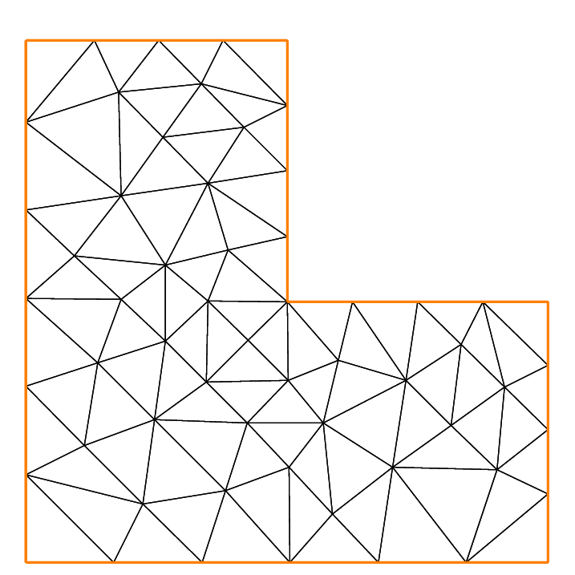
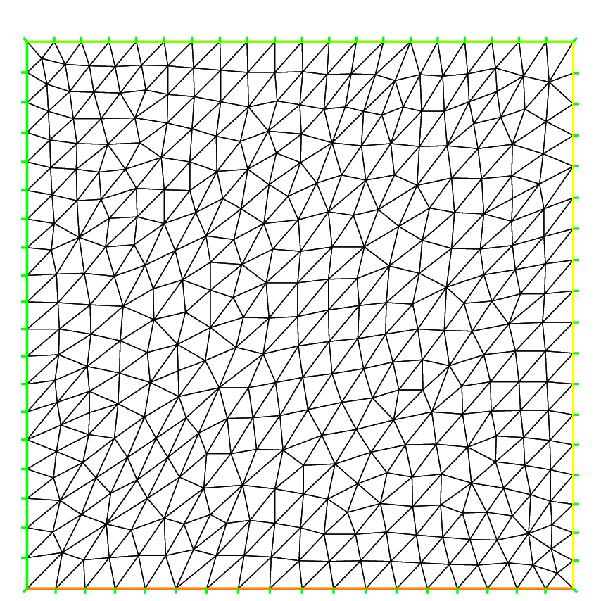
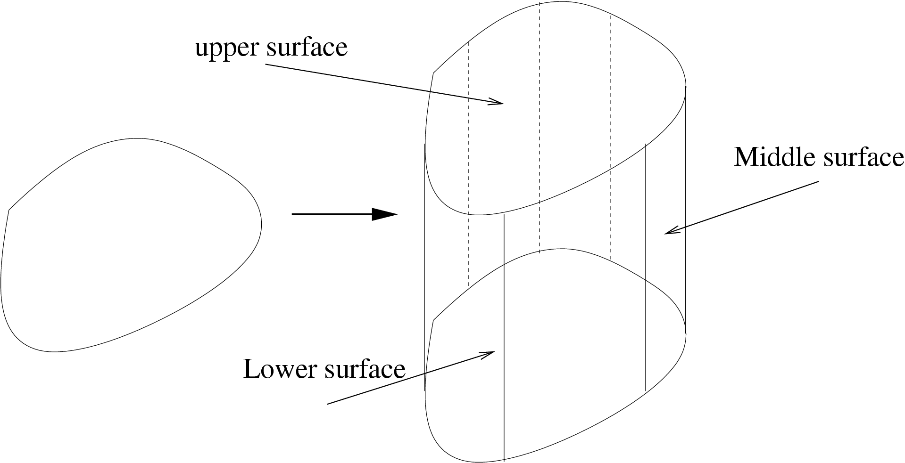
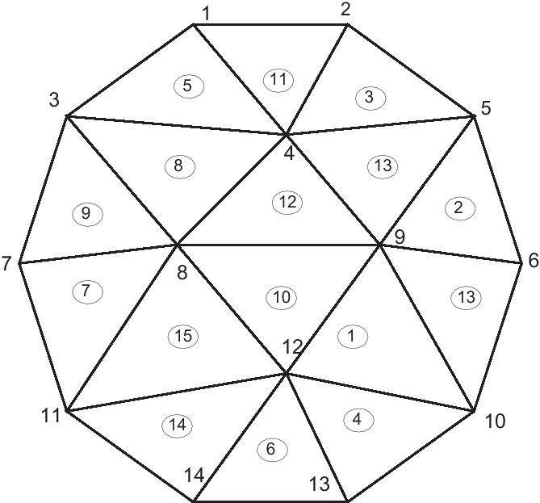

.. role:: freefem(code)
   :language: freefem

.. _meshGeneration:

Mesh Generation
===============

In this section, operators and tools on meshes are presented.

FreeFEM type for mesh variable:

 - 1D mesh: :freefem:`meshL`
 - 2D mesh: :freefem:`mesh`
 - 3D volume mesh: :freefem:`mesh3`
 - 3D border meshes
 	- 3D surface :freefem:`meshS`
	- 3D curve :freefem:`meshL`
	
Through this presentation, the principal commands for the mesh generation and links between :freefem:`mesh` - :freefem:`mesh3` - :freefem:`meshS` - :freefem:`meshL` are described.

.. _mesh2d:

**The type mesh in 2 dimension**
--------------------------------

Commands for 2d mesh Generation
^^^^^^^^^^^^^^^^^^^^^^^^^^^^^^^

The **FreeFEM** type to define a 2d mesh object is :freefem:`mesh`.

.. _meshSquare:

The command *square*
''''''''''''''''''''

The command :freefem:`square` triangulates the unit square.

The following generates a :math:`4 \times 5` grid in the unit square :math:`[0,1]^2`. The labels of the boundaries are shown in :numref:`figBoundaryLabels`.

.. code-block:: freefem
  :linenos:

  mesh Th = square(4, 5);

.. figure:: images/MeshGeneration_Square.png
  :name: figBoundaryLabels
  :width: 50%

  Boundary labels of the mesh by :freefem:`square(10,10)`

To construct a :math:`n\times m` grid in the rectangle :math:`[x_0,x_1]\times [y_0,y_1]`, proceed as follows:

.. code-block:: freefem
  :linenos:

  real x0 = 1.2;
  real x1 = 1.8;
  real y0 = 0;
  real y1 = 1;
  int n = 5;
  real m = 20;
  mesh Th = square(n, m, [x0+(x1-x0)*x, y0+(y1-y0)*y]);

.. note:: Adding the named parameter :freefem:`flags=icase` with icase:

  0. will produce a mesh where all quads are split with diagonal :math:`x-y=constant`
  1. will produce a *Union Jack flag* type of mesh
  2. will produce a mesh where all quads are split with diagonal :math:`x+y=constant`
  3. same as in case 0, except two corners where the triangles are the same as case 2, to avoid having 3 vertices on the boundary
  4. same as in case 2, except two corners where the triangles are the same as case 0, to avoid having 3 vertices on the boundary

  .. code-block:: freefem
    :linenos:

    mesh Th = square(n, m, [x0+(x1-x0)*x, y0+(y1-y0)*y], flags=icase);

.. note:: Adding the named parameter :freefem:`label=labs` will
  change the 4 default label numbers to :freefem:`labs[i-1]`, for
  example :freefem:`int[int] labs=[11, 12, 13, 14]`, and adding the
  named parameter :freefem:`region=10` will change the region number
  to :math:`10`, for instance (v 3.8).

  To see all of these flags at work, check :ref:`Square mesh example <exampleMeshSquare>`:

  .. code-block:: freefem
      :linenos:

      for (int i = 0; i < 5; ++i){
         int[int] labs = [11, 12, 13, 14];
         mesh Th = square(3, 3, flags=i, label=labs, region=10);
         plot(Th, wait=1, cmm="square flags = "+i );
      }

.. _meshBorder:

The command *buildmesh*
'''''''''''''''''''''''

*mesh building with* :freefem:`border`

Boundaries are defined piecewise by parametrized curves. The pieces can only intersect at their endpoints, but it is possible to join more than two endpoints. This can be used to structure the mesh if an area touches a border and create new regions by dividing larger ones:

.. code-block:: freefem
  :linenos:

  int upper = 1;
  int others = 2;
  int inner = 3;

  border C01(t=0, 1){x=0; y=-1+t; label=upper;}
  border C02(t=0, 1){x=1.5-1.5*t; y=-1; label=upper;}
  border C03(t=0, 1){x=1.5; y=-t; label=upper;}
  border C04(t=0, 1){x=1+0.5*t; y=0; label=others;}
  border C05(t=0, 1){x=0.5+0.5*t; y=0; label=others;}
  border C06(t=0, 1){x=0.5*t; y=0; label=others;}
  border C11(t=0, 1){x=0.5; y=-0.5*t; label=inner;}
  border C12(t=0, 1){x=0.5+0.5*t; y=-0.5; label=inner;}
  border C13(t=0, 1){x=1; y=-0.5+0.5*t; label=inner;}

  int n = 10;
  plot(C01(-n) + C02(-n) + C03(-n) + C04(-n) + C05(-n)
    + C06(-n) + C11(n) + C12(n) + C13(n), wait=true);

  mesh Th = buildmesh(C01(-n) + C02(-n) + C03(-n) + C04(-n) + C05(-n)
    + C06(-n) + C11(n) + C12(n) + C13(n));

  plot(Th, wait=true);

  cout << "Part 1 has region number " << Th(0.75, -0.25).region << endl;
  cout << "Part 2 has redion number " << Th(0.25, -0.25).region << endl;

Borders and mesh are respectively shown in :numref:`figMultipleBorder` and :numref:`figGeneratedMesh`.

.. subfigstart::

.. _figMultipleBorder:

.. figure:: images/MeshGeneration_Border1.png
   :alt: MeshGeneration_Border1
   :width: 90%

   Multiple border ends intersect

.. _figGeneratedMesh:

.. figure:: images/MeshGeneration_Border2.png
   :alt: MeshGeneration_Border2
   :width: 90%

   Generated mesh

.. subfigend::
   :width: 0.49
   :alt: MeshGeneration_Border
   :label: MeshGeneration_Border

   Border

Triangulation keywords assume that the domain is defined as being on the *left* (resp *right*) of its oriented parameterized boundary

.. math::

   \Gamma_j = \{(x,y)\left|\; x=\varphi_x(t),\, y=\varphi_y(t),\, a_j\le t\le b_j\right.\}

To check the orientation plot :math:`t\mapsto (\varphi_x(t),\varphi_y(t)),\, t_0\le t\le t_1`. If it is as in :numref:`figBorder`, then the domain lies on the shaded area, otherwise it lies on the opposite side.

.. figure:: images/MeshGeneration_Border3.png
  :name: figBorder
  :width: 100%

  Orientation of the boundary defined by :math:`(\phi_x(t),\phi_y(t))`

The general expression to define a triangulation with :freefem:`buildmesh` is

.. code-block:: freefem
   :linenos:

   mesh Mesh_Name = buildmesh(Gamma1(m1)+...+GammaJ(mj), OptionalParameter);

where :math:`m_j` are positive or negative numbers to indicate how many vertices should be on :math:`\Gamma_j,\, \Gamma=\cup_{j=1}^J \Gamma_J`, and the optional parameter (see also :ref:`References <referenceBuildMesh>`), separated with a comma, can be:

-  :freefem:`nbvx= int`, to set the maximum number of vertices in the mesh.
-  :freefem:`fixedborder= bool`, to say if the mesh generator can change the boundary mesh or not (by default the boundary mesh can change; beware that with periodic boundary conditions (see. :ref:`Finite Element <finiteElement>`), it can be dangerous.

The orientation of boundaries can be changed by changing the sign of :math:`m_j`.

The following example shows how to change the orientation. The example generates the unit disk with a small circular hole, and assigns "1" to the unit disk ("2" to the circle inside). The boundary label **must be non-zero**, but it can also be omitted.

.. code-block:: freefem
   :linenos:

   border a(t=0, 2*pi){x=cos(t); y=sin(t); label=1;}
   border b(t=0, 2*pi){x=0.3+0.3*cos(t); y=0.3*sin(t); label=2;}
   plot(a(50) + b(30)); //to see a plot of the border mesh
   mesh Thwithouthole = buildmesh(a(50) + b(30));
   mesh Thwithhole = buildmesh(a(50) + b(-30));
   plot(Thwithouthole, ps="Thwithouthole.eps");
   plot(Thwithhole, ps="Thwithhole.eps");

.. note:: Notice that the orientation is changed by :freefem:`b(-30)` in the 5th line. In the 7th line, :freefem:`ps="fileName"` is used to generate a postscript file with identification shown on the figure.

.. subfigstart::

.. _figMesWithouthHole:

.. figure:: images/MeshGeneration_Border4.png
   :alt: MeshGeneration_Border4
   :width: 90%

   Mesh without hole

.. _figMeshWithHole:

.. figure:: images/MeshGeneration_Border5.png
   :alt: MeshGeneration_Border5
   :width: 90%

   Mesh with hole

.. subfigend::
   :width: 0.49
   :alt: MeshWithHole
   :label: MeshWithHole

   Mesh with a hole

.. note:: Borders are evaluated only at the time :freefem:`plot` or :freefem:`buildmesh` is called so the global variables are defined at this time. In this case, since :math:`r` is changed between the two border calls, the following code will not work because the first border will be computed with r=0.3:

  .. code-block:: freefem
    :linenos:

    real r=1;
    border a(t=0, 2*pi){x=r*cos(t); y=r*sin(t); label=1;}
    r=0.3;
    border b(t=0, 2*pi){x=r*cos(t); y=r*sin(t); label=1;}
    mesh Thwithhole = buildmesh(a(50) + b(-30)); // bug (a trap) because
        // the two circles have the same radius = :math:`0.3`

*mesh building with array of* :freefem:`border`

Sometimes it can be useful to make an array of the border, but unfortunately it is incompatible with the **FreeFEM** syntax. To bypass this problem, if the number of segments of the discretization :math:`n` is an array, we make an implicit loop on all of the values of the array, and the index variable :math:`i` of the loop is defined after the parameter definition, like in :freefem:`border a(t=0, 2*pi; i)` ...

A first very small example:

.. code-block:: freefem
   :linenos:

   border a(t=0, 2*pi; i){x=(i+1)*cos(t); y=(i+1)*sin(t); label=1;}
   int[int] nn = [10, 20, 30];
   plot(a(nn)); //plot 3 circles with 10, 20, 30 points

And a more complex example to define a square with small circles:

.. code-block:: freefem
   :linenos:

   real[int] xx = [0, 1, 1, 0],
             yy = [0, 0, 1, 1];
   //radius, center of the 4 circles
   real[int] RC = [0.1, 0.05, 0.05, 0.1],
             XC = [0.2, 0.8, 0.2, 0.8],
             YC = [0.2, 0.8, 0.8, 0.2];
   int[int] NC = [-10,-11,-12,13]; //list number of :math:`\pm` segments of the 4 circles borders

   border bb(t=0, 1; i)
   {
       // i is the index variable of the multi border loop
       int ii = (i+1)%4;
       real t1 = 1-t;
       x = xx[i]*t1 + xx[ii]*t;
       y = yy[i]*t1 + yy[ii]*t;
       label = 0;
   }

   border cc(t=0, 2*pi; i)
   {
       x = RC[i]*cos(t) + XC[i];
       y = RC[i]*sin(t) + YC[i];
       label = i + 1;
   }
   int[int] nn = [4, 4, 5, 7]; //4 border, with 4, 4, 5, 7 segment respectively
   plot(bb(nn), cc(NC), wait=1);
   mesh th = buildmesh(bb(nn) + cc(NC));
   plot(th, wait=1);

Mesh Connectivity and data
^^^^^^^^^^^^^^^^^^^^^^^^^^

The following example explains methods to obtain mesh information.

.. code-block:: freefem
   :linenos:

   // Mesh
   mesh Th = square(2, 2);

   cout << "// Get data of the mesh" << endl;
   {
       int NbTriangles = Th.nt;
       real MeshArea = Th.measure;
       real BorderLength = Th.bordermeasure;

       cout << "Number of triangle(s) = " << NbTriangles << endl;
       cout << "Mesh area = " << MeshArea << endl;
       cout << "Border length = " << BorderLength << endl;

       // Th(i) return the vextex i of Th
       // Th[k] return the triangle k of Th
       // Th[k][i] return the vertex i of the triangle k of Th
       for (int i = 0; i < NbTriangles; i++)
           for (int j = 0; j < 3; j++)
               cout << i << " " << j << " - Th[i][j] = " << Th[i][j]
                    << ", x = " << Th[i][j].x
                    << ", y= " << Th[i][j].y
                    << ", label=" << Th[i][j].label << endl;
   }

   cout << "// Hack to get vertex coordinates" << endl;
   {
       fespace femp1(Th, P1);
       femp1 Thx=x,Thy=y;

       int NbVertices = Th.nv;
       cout << "Number of vertices = " << NbVertices << endl;

       for (int i = 0; i < NbVertices; i++)
           cout << "Th(" << i << ") : " << Th(i).x << " " << Th(i).y << " " << Th(i).label
                << endl << "\told method: " << Thx[][i] << " " << Thy[][i] << endl;
   }

   cout << "// Method to find information of point (0.55,0.6)" << endl;
   {
       int TNumber = Th(0.55, 0.6).nuTriangle; //the triangle number
       int RLabel = Th(0.55, 0.6).region; //the region label

       cout << "Triangle number in point (0.55, 0.6): " << TNumber << endl;
       cout << "Region label in point (0.55, 0.6): " << RLabel << endl;
   }

   cout << "// Information of triangle" << endl;
   {
       int TNumber = Th(0.55, 0.6).nuTriangle;
       real TArea = Th[TNumber].area; //triangle area
       real TRegion = Th[TNumber].region; //triangle region
       real TLabel = Th[TNumber].label; //triangle label, same as region for triangles

       cout << "Area of triangle " << TNumber << ": " << TArea << endl;
       cout << "Region of triangle " << TNumber << ": " << TRegion << endl;
       cout << "Label of triangle " << TNumber << ": " << TLabel << endl;
   }

   cout << "// Hack to get a triangle containing point x, y or region number (old method)" << endl;
   {
       fespace femp0(Th, P0);
       femp0 TNumbers; //a P0 function to get triangle numbering
       for (int i = 0; i < Th.nt; i++)
           TNumbers[][i] = i;
       femp0 RNumbers = region; //a P0 function to get the region number

       int TNumber = TNumbers(0.55, 0.6); // Number of the triangle containing (0.55, 0,6)
       int RNumber = RNumbers(0.55, 0.6); // Number of the region containing (0.55, 0,6)

       cout << "Point (0.55,0,6) :" << endl;
       cout << "\tTriangle number = " << TNumber << endl;
       cout << "\tRegion number = " << RNumber << endl;
   }

   cout << "// New method to get boundary information and mesh adjacent" << endl;
   {
       int k = 0;
       int l=1;
       int e=1;

       // Number of boundary elements
       int NbBoundaryElements = Th.nbe;
       cout << "Number of boundary element = " << NbBoundaryElements << endl;
       // Boundary element k in {0, ..., Th.nbe}
       int BoundaryElement = Th.be(k);
       cout << "Boundary element " << k << " = " << BoundaryElement << endl;
       // Vertice l in {0, 1} of boundary element k
       int Vertex = Th.be(k)[l];
       cout << "Vertex " << l << " of boundary element " << k << " = " << Vertex << endl;
       // Triangle containg the boundary element k
       int Triangle = Th.be(k).Element;
       cout << "Triangle containing the boundary element " << k << " = " << Triangle << endl;
       // Triangle egde nubmer containing the boundary element k
       int Edge = Th.be(k).whoinElement;
       cout << "Triangle edge number containing the boundary element " << k << " = " << Edge << endl;
       // Adjacent triangle of the triangle k by edge e
       int Adjacent = Th[k].adj(e); //The value of e is changed to the corresponding edge in the adjacent triangle
       cout << "Adjacent triangle of the triangle " << k << " by edge " << e << " = " << Adjacent << endl;
       cout << "\tCorresponding edge = " << e << endl;
       // If there is no adjacent triangle by edge e, the same triangle is returned
       //Th[k] == Th[k].adj(e)
       // Else a different triangle is returned
       //Th[k] != Th[k].adj(e)
   }

   cout << "// Print mesh connectivity " << endl;
   {
       int NbTriangles = Th.nt;
       for (int k = 0; k < NbTriangles; k++)
           cout << k << " : " << int(Th[k][0]) << " " << int(Th[k][1])
                << " " << int(Th[k][2])
                << ", label " << Th[k].label << endl;

       for (int k = 0; k < NbTriangles; k++)
           for (int e = 0, ee; e < 3; e++)
               //set ee to e, and ee is change by method adj,
               cout << k << " " << e << " <=> " << int(Th[k].adj((ee=e))) << " " << ee
                    << ", adj: " << (Th[k].adj((ee=e)) != Th[k]) << endl;

       int NbBoundaryElements = Th.nbe;
       for (int k = 0; k < NbBoundaryElements; k++)
           cout << k << " : " << Th.be(k)[0] << " " << Th.be(k)[1]
                << " , label " << Th.be(k).label
                << ", triangle " << int(Th.be(k).Element)
                << " " << Th.be(k).whoinElement << endl;

       real[int] bb(4);
       boundingbox(Th, bb);
       // bb[0] = xmin, bb[1] = xmax, bb[2] = ymin, bb[3] =ymax
       cout << "boundingbox:" << endl;
       cout << "xmin = " << bb[0]
            << ", xmax = " << bb[1]
            << ", ymin = " << bb[2]
            << ", ymax = " << bb[3] << endl;
   }

The output is:

.. code-block:: bash
   :linenos:

   // Get data of the mesh
   Number of triangle = 8
   Mesh area = 1
   Border length = 4
   0 0 - Th[i][j] = 0, x = 0, y= 0, label=4
   0 1 - Th[i][j] = 1, x = 0.5, y= 0, label=1
   0 2 - Th[i][j] = 4, x = 0.5, y= 0.5, label=0
   1 0 - Th[i][j] = 0, x = 0, y= 0, label=4
   1 1 - Th[i][j] = 4, x = 0.5, y= 0.5, label=0
   1 2 - Th[i][j] = 3, x = 0, y= 0.5, label=4
   2 0 - Th[i][j] = 1, x = 0.5, y= 0, label=1
   2 1 - Th[i][j] = 2, x = 1, y= 0, label=2
   2 2 - Th[i][j] = 5, x = 1, y= 0.5, label=2
   3 0 - Th[i][j] = 1, x = 0.5, y= 0, label=1
   3 1 - Th[i][j] = 5, x = 1, y= 0.5, label=2
   3 2 - Th[i][j] = 4, x = 0.5, y= 0.5, label=0
   4 0 - Th[i][j] = 3, x = 0, y= 0.5, label=4
   4 1 - Th[i][j] = 4, x = 0.5, y= 0.5, label=0
   4 2 - Th[i][j] = 7, x = 0.5, y= 1, label=3
   5 0 - Th[i][j] = 3, x = 0, y= 0.5, label=4
   5 1 - Th[i][j] = 7, x = 0.5, y= 1, label=3
   5 2 - Th[i][j] = 6, x = 0, y= 1, label=4
   6 0 - Th[i][j] = 4, x = 0.5, y= 0.5, label=0
   6 1 - Th[i][j] = 5, x = 1, y= 0.5, label=2
   6 2 - Th[i][j] = 8, x = 1, y= 1, label=3
   7 0 - Th[i][j] = 4, x = 0.5, y= 0.5, label=0
   7 1 - Th[i][j] = 8, x = 1, y= 1, label=3
   7 2 - Th[i][j] = 7, x = 0.5, y= 1, label=3
   // Hack to get vertex coordinates
   Number of vertices = 9
   Th(0) : 0 0 4
      old method: 0 0
   Th(1) : 0.5 0 1
      old method: 0.5 0
   Th(2) : 1 0 2
      old method: 1 0
   Th(3) : 0 0.5 4
      old method: 0 0.5
   Th(4) : 0.5 0.5 0
      old method: 0.5 0.5
   Th(5) : 1 0.5 2
      old method: 1 0.5
   Th(6) : 0 1 4
      old method: 0 1
   Th(7) : 0.5 1 3
      old method: 0.5 1
   Th(8) : 1 1 3
      old method: 1 1
   // Method to find the information of point (0.55,0.6)
   Triangle number in point (0.55, 0.6): 7
   Region label in point (0.55, 0.6): 0
   // Information of a triangle
   Area of triangle 7: 0.125
   Region of triangle 7: 0
   Label of triangle 7: 0
   // Hack to get a triangle containing point x, y or region number (old method)
   Point (0.55,0,6) :
      Triangle number = 7
      Region number = 0
   // New method to get boundary information and mesh adjacent
   Number of boundary element = 8
   Boundary element 0 = 0
   Vertex 1 of boundary element 0 = 1
   Triangle containing the boundary element 0 = 0
   Triangle edge number containing the boundary element 0 = 2
   Adjacent triangle of the triangle 0 by edge 1 = 1
      Corresponding edge = 2
   // Print mesh connectivity
   0 : 0 1 4, label 0
   1 : 0 4 3, label 0
   2 : 1 2 5, label 0
   3 : 1 5 4, label 0
   4 : 3 4 7, label 0
   5 : 3 7 6, label 0
   6 : 4 5 8, label 0
   7 : 4 8 7, label 0
   0 0 <=> 3 1, adj: 1
   0 1 <=> 1 2, adj: 1
   0 2 <=> 0 2, adj: 0
   1 0 <=> 4 2, adj: 1
   1 1 <=> 1 1, adj: 0
   1 2 <=> 0 1, adj: 1
   2 0 <=> 2 0, adj: 0
   2 1 <=> 3 2, adj: 1
   2 2 <=> 2 2, adj: 0
   3 0 <=> 6 2, adj: 1
   3 1 <=> 0 0, adj: 1
   3 2 <=> 2 1, adj: 1
   4 0 <=> 7 1, adj: 1
   4 1 <=> 5 2, adj: 1
   4 2 <=> 1 0, adj: 1
   5 0 <=> 5 0, adj: 0
   5 1 <=> 5 1, adj: 0
   5 2 <=> 4 1, adj: 1
   6 0 <=> 6 0, adj: 0
   6 1 <=> 7 2, adj: 1
   6 2 <=> 3 0, adj: 1
   7 0 <=> 7 0, adj: 0
   7 1 <=> 4 0, adj: 1
   7 2 <=> 6 1, adj: 1
   0 : 0 1 , label 1, triangle 0 2
   1 : 1 2 , label 1, triangle 2 2
   2 : 2 5 , label 2, triangle 2 0
   3 : 5 8 , label 2, triangle 6 0
   4 : 6 7 , label 3, triangle 5 0
   5 : 7 8 , label 3, triangle 7 0
   6 : 0 3 , label 4, triangle 1 1
   7 : 3 6 , label 4, triangle 5 1
   boundingbox:
   xmin = 0, xmax = 1, ymin = 0, ymax = 1

The real characteristic function of a mesh :freefem:`Th` is :freefem:`chi(Th)` in 2D and 3D where:

:freefem:`chi(Th)(P)=1` if :math:`P\in Th`

:freefem:`chi(Th)(P)=0` if :math:`P\not\in Th`

The keyword "triangulate"
^^^^^^^^^^^^^^^^^^^^^^^^^

**FreeFEM** is able to build a triangulation from a set of points.
This triangulation is a Delaunay mesh of the convex hull of the set of points.
It can be useful to build a mesh from a table function.

The coordinates of the points and the value of the table function are defined separately with rows of the form: :freefem:`x y f(x,y)` in a file such as:

.. code-block:: freefem
   :linenos:

   0.51387 0.175741 0.636237
   0.308652 0.534534 0.746765
   0.947628 0.171736 0.899823
   0.702231 0.226431 0.800819
   0.494773 0.12472 0.580623
   0.0838988 0.389647 0.456045
   ...............

.. subfigstart::

.. _figDelaunayMesh:

.. figure:: images/MeshGeneration_Triangulate1.png
   :alt: MeshGeneration_Triangulate1
   :width: 90%

   Delaunay mesh of the convex hull of point set in file xy

.. _figIsovalue:

.. figure:: images/MeshGeneration_Triangulate2.png
   :alt: MeshGeneration_Triangulate2
   :width: 90%

   Isolvalue of table function

.. subfigend::
   :width: 0.49
   :alt: Triangulate
   :label: Triangulate

   Triangulate

The third column of each line is left untouched by the :freefem:`triangulate` command.
But you can use this third value to define a table function with rows of the form: :freefem:`x y f(x,y)`.

The following example shows how to make a mesh from the file ``xyf`` with the format stated just above.
The command :freefem:`triangulate` only uses the 1st and 2nd columns.

.. code-block:: freefem
   :linenos:

   // Build the Delaunay mesh of the convex hull
   mesh Thxy=triangulate("xyf"); //points are defined by the first 2 columns of file `xyf`

   // Plot the created mesh
   plot(Thxy);

   // Fespace
   fespace Vhxy(Thxy, P1);
   Vhxy fxy;

   // Reading the 3rd column to define the function fxy
   {
       ifstream file("xyf");
       real xx, yy;
       for(int i = 0; i < fxy.n; i++)
           file >> xx >> yy >> fxy[][i]; //to read third row only.
                                         //xx and yy are just skipped
   }

   // Plot
   plot(fxy);

One new way to build a mesh is to have two arrays: one for the :math:`x` values and the other for the :math:`y` values.

.. code-block:: freefem
   :linenos:

   //set two arrays for the x's and y's
   Vhxy xx=x, yy=y;
   //build the mesh
   mesh Th = triangulate(xx[], yy[]);

2d Finite Element space on a boundary
^^^^^^^^^^^^^^^^^^^^^^^^^^^^^^^^^^^^^

To define a Finite Element space on a boundary, we came up with the idea of a mesh with no internal points (called empty mesh).
It can be useful to handle Lagrange multipliers in mixed and mortar methods.

So the function :freefem:`emptymesh` removes all the internal points of a mesh except points on internal boundaries.

.. code-block:: freefem
   :linenos:

   {
       border a(t=0, 2*pi){x=cos(t); y=sin(t); label=1;}
       mesh Th = buildmesh(a(20));
       Th = emptymesh(Th);
       plot(Th);
   }

It is also possible to build an empty mesh of a pseudo subregion with :freefem:`emptymesh(Th, ssd)` using the set of edges from the mesh :freefem:`Th`; an edge :math:`e` is in this set when, with the two adjacent triangles :math:`e =t1\cap t2` and :math:`ssd[T1] \neq ssd[T2]` where :math:`ssd` refers to the pseudo region numbering of triangles, they are stored in the :freefem:`int[int]` array of size "the number of triangles".

.. code-block:: freefem
   :linenos:

   {
       mesh Th = square(10, 10);
       int[int] ssd(Th.nt);
       //build the pseudo region numbering
       for(int i = 0; i < ssd.n; i++){
           int iq = i/2; //because 2 triangles per quad
           int ix = iq%10;
           int iy = iq/10;
           ssd[i] = 1 + (ix>=5) + (iy>=5)*2;
       }
       //build emtpy with all edges $e=T1 \cap T2$ and $ssd[T1] \neq ssd[T2]$
       Th = emptymesh(Th, ssd);
       //plot
       plot(Th);
       savemesh(Th, "emptymesh.msh");
   }

.. subfigstart::

.. _figEmptyMesh1:

.. figure:: images/MeshGeneration_EmptyMesh1.png
   :alt: MeshGeneration_EmptyMesh1
   :width: 90%

   The empty mesh with boundary

.. _figEmptyMesh2:

.. figure:: images/MeshGeneration_EmptyMesh2.png
    :alt: MeshGeneration_EmptyMesh2
    :width: 90%

    An empty mesh defined from a pseudo region numbering of triangle

.. subfigend::
   :width: 0.49
   :alt: EmptyMesh
   :label: EmptyMesh

   Empty mesh

Remeshing
^^^^^^^^^

.. _meshGenerationMoveMesh:

The command *movemesh*
''''''''''''''''''''''

Meshes can be translated, rotated, and deformed by :freefem:`movemesh`; this is useful for elasticity to watch the deformation due to the displacement :math:`\mathbf{\Phi}(x,y)=(\Phi_1(x,y),\Phi_2(x,y))` of shape.

It is also useful to handle free boundary problems or optimal shape problems.

If :math:`\Omega` is triangulated as :math:`T_h(\Omega)`, and :math:`\mathbf{\Phi}` is a displacement vector then :math:`\mathbf{\Phi}(T_h)` is obtained by:

.. code-block:: freefem
   :linenos:

   mesh Th = movemesh(Th,[Phi1, Phi2]);

Sometimes the transformed mesh is invalid because some triangles have flipped over (meaning it now has a negative area).
To spot such problems, one may check the minimum triangle area in the transformed mesh with :freefem:`checkmovemesh` before any real transformation.

For example:

.. math::
    \begin{array}{rcl}
        \Phi_1(x,y) &=& x+k*\sin(y*\pi)/10)\\
        \Phi_2(x,y) &=& y+k*\cos(y\pi)/10)
    \end{array}

for a big number :math:`k>1`.

.. code-block:: freefem
   :linenos:

   verbosity = 4;

   // Parameters
   real coef = 1;

   // Mesh
   border a(t=0, 1){x=t; y=0; label=1;};
   border b(t=0, 0.5){x=1; y=t; label=1;};
   border c(t=0, 0.5){x=1-t; y=0.5; label=1;};
   border d(t=0.5, 1){x=0.5; y=t; label=1;};
   border e(t=0.5, 1){x=1-t; y=1; label=1;};
   border f(t=0, 1){x=0; y=1-t; label=1;};
   mesh Th = buildmesh(a(6) + b(4) + c(4) + d(4) + e(4) + f(6));
   plot(Th, wait=true, fill=true, ps="Lshape.eps");

   // Function
   func uu = sin(y*pi)/10;
   func vv = cos(x*pi)/10;

   // Checkmovemesh
   real minT0 = checkmovemesh(Th, [x, y]); //return the min triangle area
   while(1){ // find a correct move mesh
       real minT = checkmovemesh(Th, [x+coef*uu, y+coef*vv]);
       if (minT > minT0/5) break; //if big enough
       coef /= 1.5;
   }

   // Movemesh
   Th = movemesh(Th, [x+coef*uu, y+coef*vv]);
   plot(Th, wait=true, fill=true, ps="MovedMesh.eps");

.. subfigstart::

.. _figLShape:

   L-shape

.. _figMovedLShape:

.. figure:: images/MeshGeneration_MoveMesh2.png
   :alt: MeshGeneration_MoveMesh2
   :width: 90%

   Moved L-shape

.. subfigend::
   :width: 0.49
   :alt: MoveMesh
   :label: MoveMesh

   Move mesh

.. note:: Consider a function :math:`u` defined on a mesh :freefem:`Th`.
    A statement like :freefem:`Th=movemesh(Th...)` does not change :math:`u` and so the old mesh still exists.
    It will be destroyed when no function uses it.
    A statement like :math:`u=u` redefines :math:`u` on the new mesh :freefem:`Th` with interpolation and therefore destroys the old :freefem:`Th`, if :math:`u` was the only function using it.

Now, we give an example of moving a mesh with a Lagrangian function :math:`u` defined on the moving mesh.

.. code-block:: freefem
   :linenos:

   // Parameters
   int nn = 10;
   real dt = 0.1;

   // Mesh
   mesh Th = square(nn, nn);

   // Fespace
   fespace Vh(Th, P1);
   Vh u=y;

   // Loop
   real t=0;
   for (int i = 0; i < 4; i++){
       t = i*dt;
       Vh f=x*t;
       real minarea = checkmovemesh(Th, [x, y+f]);
       if (minarea > 0) //movemesh will be ok
       Th = movemesh(Th, [x, y+f]);

       cout << " Min area = " << minarea << endl;

       real[int] tmp(u[].n);
       tmp = u[]; //save the value
       u = 0;//to change the FEspace and mesh associated with u
       u[] = tmp;//set the value of u without any mesh update
       plot(Th, u, wait=true);
   }
   // In this program, since u is only defined on the last mesh, all the
   // previous meshes are deleted from memory.

.. _meshRegularTriangulation:

The command *hTriangle*
'''''''''''''''''''''''

This section presents the way to obtain a regular triangulation with **FreeFEM**.

For a set :math:`S`, we define the diameter of :math:`S` by

.. math::

  \textrm{diam}(S)=\sup\{|\mathbf{x}-\mathbf{y}|; \; \mathbf{x},\, \mathbf{y}\in S\}

The sequence :math:`\{\mathcal{T}_h\}_{h\rightarrow 0}` of
:math:`\Omega` is called *regular* if they satisfy the following:

1. :math:`\lim_{h\rightarrow 0}\max\{\textrm{diam}(T_k)|\; T_k\in \mathcal{T}_h\}=0`

2. There is a number :math:`\sigma>0` independent of :math:`h` such that :math:`\frac{\rho(T_k)}{\textrm{diam}(T_k)}\ge \sigma\quad \textrm{for all }T_k\in \mathcal{T}_h` where :math:`\rho(T_k)` are the diameter of the inscribed circle of :math:`T_k`.

We put :math:`h(\mathcal{T}_h)=\max\{\textrm{diam}(T_k)|\; T_k\in \mathcal{T}_h\}`, which is obtained by

.. code-block:: freefem
   :linenos:

   mesh Th = ......;
   fespace Ph(Th, P0);
   Ph h = hTriangle;
   cout << "size of mesh = " << h[].max << endl;

The command *adaptmesh*
'''''''''''''''''''''''

The function:

.. math::

  f(x,y) = 10.0x^3+y^3+\tan^{-1}[\varepsilon/(\sin(5.0y)-2.0x)],\ \varepsilon = 0.0001

sharply varies in value and the initial mesh given by one of the commands in the :ref:`Mesh Generation part <meshGeneration>` cannot reflect its sharp variations.

.. code-block:: freefem
   :linenos:

   // Parameters
   real eps = 0.0001;
   real h = 1;
   real hmin = 0.05;
   func f = 10.0*x^3 + y^3 + h*atan2(eps, sin(5.0*y)-2.0*x);

   // Mesh
   mesh Th = square(5, 5, [-1+2*x, -1+2*y]);

   // Fespace
   fespace Vh(Th,P1);
   Vh fh = f;
   plot(fh);

   // Adaptmesh
   for (int i = 0; i < 2; i++){
       Th = adaptmesh(Th, fh);
       fh = f; //old mesh is deleted
       plot(Th, fh, wait=true);
   }

.. figure:: images/MeshGeneration_AdaptMesh1.png
  :name: figMeshAdaptation
  :width: 100%

  3D graphs for the initial mesh and 1st and 2nd mesh adaptations

**FreeFEM** uses a variable metric/Delaunay automatic meshing algorithm.

The command:

.. code-block:: freefem
   :linenos:

   mesh ATh = adaptmesh(Th, f);

create the new mesh :freefem:`ATh` adapted to the Hessian

.. math::

  D^2f=(\partial^2 f/\partial x^2,\, \partial^2 f/\partial x\partial y, \partial^2 f/\partial y^2)

of a function (formula or FE-function).

Mesh adaptation is a very powerful tool when the solution of a problem varies locally and sharply.

Here we solve the :ref:`Poisson’s problem <tutorialPoisson>`, when :math:`f=1` and :math:`\Omega` is an L-shape domain.

.. subfigstart::

.. _adaptMesh2:

.. figure:: images/MeshGeneration_AdaptMesh2.png
   :alt: MeshGeneration_AdaptMesh2
   :width: 90%

   L-shape domain and its boundary name

.. _adaptMesh3:

.. figure:: images/MeshGeneration_AdaptMesh3.png
   :alt: MeshGeneration_AdaptMesh3
   :width: 90%

   Final solution after 4-times adaptation

.. subfigend::
   :width: 0.49
   :alt: Adaptmesh
   :label: AdaptMesh

   Mesh adaptation

.. tip:: The solution has the singularity :math:`r^{3/2},\, r=|x-\gamma|` at the point :math:`\gamma` of the intersection of two lines :math:`bc` and :math:`bd` (see :numref:`adaptMesh2`).

.. code-block:: freefem
   :linenos:

   // Parameters
   real error = 0.1;

   // Mesh
   border ba(t=0, 1){x=t; y=0; label=1;}
   border bb(t=0, 0.5){x=1; y=t; label=1;}
   border bc(t=0, 0.5){x=1-t; y=0.5; label=1;}
   border bd(t=0.5, 1){x=0.5; y=t; label=1;}
   border be(t=0.5, 1){x=1-t; y=1; label=1;}
   border bf(t=0, 1){x=0; y=1-t; label=1;}
   mesh Th = buildmesh(ba(6) + bb(4) + bc(4) + bd(4) + be(4) + bf(6));

   // Fespace
   fespace Vh(Th, P1);
   Vh u, v;

   // Function
   func f = 1;

   // Problem
   problem Poisson(u, v, solver=CG, eps=1.e-6)
       = int2d(Th)(
             dx(u)*dx(v)
           + dy(u)*dy(v)
       )
       - int2d(Th)(
             f*v
       )
       + on(1, u=0);

   // Adaptmesh loop
   for (int i = 0; i < 4; i++){
       Poisson;
       Th = adaptmesh(Th, u, err=error);
       error = error/2;
   }

   // Plot
   plot(u);

To speed up the adaptation, the default parameter :freefem:`err` of :freefem:`adaptmesh` is changed by hand; it specifies the required precision, so as to make the new mesh finer or coarser.

The problem is coercive and symmetric, so the linear system can be solved with the conjugate gradient method (parameter :freefem:`solver=CG`) with the stopping criteria on the residual, here :freefem:`eps=1.e-6`).

By :freefem:`adaptmesh`, the slope of the final solution is correctly computed near the point of intersection of :math:`bc` and :math:`bd` as in :numref:`adaptMesh3`.

This method is described in detail in [HECHT1998]_.
It has a number of default parameters which can be modified.

If :freefem:`f1,f2` are functions and :freefem:`thold, Thnew` are meshes:

.. code-block:: freefem
   :linenos:

      Thnew = adaptmesh(Thold, f1 ... );
      Thnew = adaptmesh(Thold, f1,f2 ... ]);
      Thnew = adaptmesh(Thold, [f1,f2] ... );

The additional parameters of :freefem:`adaptmesh` are:

See :ref:`Reference part <referenceAdaptMesh>` for more inforamtions

-  :freefem:`hmin=` Minimum edge size.
    Its default is related to the size of the domain to be meshed and the precision of the mesh generator.

-  :freefem:`hmax=` Maximum edge size.
    It defaults to the diameter of the domain to be meshed.

-  :freefem:`err=` :math:`P_1` interpolation error level (0.01 is the default).

-  :freefem:`errg=` Relative geometrical error.
    By default this error is 0.01, and in any case it must be lower than :math:`1/\sqrt{2}`.
    Meshes created with this option may have some edges smaller than the :freefem:`-hmin` due to geometrical constraints.

-  :freefem:`nbvx=` Maximum number of vertices generated by the mesh generator (9000 is the default).

-  :freefem:`nbsmooth=` number of iterations of the smoothing procedure (5 is the default).

-  :freefem:`nbjacoby=` number of iterations in a smoothing procedure during the metric construction, 0 means no smoothing, 6 is the default.

-  :freefem:`ratio=` ratio for a prescribed smoothing on the metric.
    If the value is 0 or less than 1.1 no smoothing is done on the metric. 1.8 is the default.
    If :freefem:`ratio > 1.1`, the speed of mesh size variations is bounded by :math:`log(\mathtt{ratio})`.

    .. note:: As :freefem:`ratio` gets closer to 1, the number of generated vertices increases.
        This may be useful to control the thickness of refined regions near shocks or boundary layers.

-  :freefem:`omega=` relaxation parameter for the smoothing procedure. 1.0 is the default.

-  :freefem:`iso=` If true, forces the metric to be isotropic. :freefem:`false` is the default.

-  :freefem:`abserror=` If false, the metric is evaluated using the criteria of equi-repartion of relative error.
    :freefem:`false` is the default.
    In this case the metric is defined by:

    .. math::
        \mathcal{M} = \left({1\over\mathtt{err}\,\, \mathtt{coef}^2} \quad {
        |\mathcal{H}| \over max(\mathtt{CutOff},|\eta|)}\right)^p

    Otherwise, the metric is evaluated using the criteria of equi-distribution of errors.
    In this case the metric is defined by:

    .. math::
        \mathcal{M} = \left({1\over \mathtt{err}\,\,\mathtt{coef}^2} \quad
        {|{\mathcal{H}|} \over
        {\sup(\eta)-\inf(\eta)}}\right)^p.\label{eq err abs}

-  :freefem:`cutoff=` lower limit for the relative error evaluation.
   1.0e-6 is the default.

-  :freefem:`verbosity=` informational messages level (can be chosen between 0 and :math:`\infty`).
    Also changes the value of the global variable verbosity (obsolete).

-  :freefem:`inquire=` To inquire graphically about the mesh.
   :freefem:`false` is the default.

-  :freefem:`splitpbedge=` If true, splits all internal edges in half with two boundary vertices.
    :freefem:`true` is the default.

-  :freefem:`maxsubdiv=` Changes the metric such that the maximum subdivision of a background edge is bound by :freefem:`val`.
    Always limited by 10, and 10 is also the default.

-  :freefem:`rescaling=` if true, the function, with respect to which the mesh is adapted, is rescaled to be between 0 and 1.
    :freefem:`true` is the default.

-  :freefem:`keepbackvertices=` if true, tries to keep as many vertices from the original mesh as possible.
    :freefem:`true` is the default.

-  :freefem:`IsMetric=` if true, the metric is defined explicitly.
    :freefem:`false` is the default.
    If the 3 functions :math:`m_{11}, m_{12}, m_{22}` are given, they directly define a symmetric matrix field whose Hessian is computed to define a metric.
    If only one function is given, then it represents the isotropic mesh size at every point.

    For example, if the partial derivatives :freefem:`fxx` (:math:`=\partial^2 f/\partial x^2`), :freefem:`fxy` (:math:`=\partial^2 f/\partial x\partial y`), :freefem:`fyy` (:math:`=\partial^2 f/\partial y^2`) are given, we can set :freefem:`Th = adaptmesh(Th, fxx, fxy, fyy, IsMetric=1, nbvx=10000, hmin=hmin);`

-  :freefem:`power=` exponent power of the Hessian used to compute the metric.
    1 is the default.

-  :freefem:`thetamax=` minimum corner angle in degrees.
    Default is :math:`10^\circ` where the corner is :math:`ABC` and the angle is the angle of the two vectors :math:`{AB}, {BC}`, (:math:`0` imply no corner, :math:`90` imply perpendicular corner, …).

-  :freefem:`splitin2=` boolean value.
    If true, splits all triangles of the final mesh into 4 sub-triangles.

-  :freefem:`metric=` an array of 3 real arrays to set or get metric data information.
    The size of these three arrays must be the number of vertices.
    So if :freefem:`m11,m12,m22` are three P1 finite elements related to the mesh to adapt, you can write: :freefem:`metric=[m11[],m12[],m22[]]` (see file :freefem:`convect-apt.edp` for a full example)

-  :freefem:`nomeshgeneration=` If true, no adapted mesh is generated (useful to compute only a metric).

-  :freefem:`periodic=` Writing :freefem:`periodic=[[4,y],[2,y],[1,x],[3,x]];` builds an adapted periodic mesh.
    The sample builds a biperiodic mesh of a square.
    (see :ref:`periodic finite element spaces <finiteElement>`, and see :ref:`the Sphere example <exampleSphere>` for a full example)

We can use the command :freefem:`adaptmesh` to build a uniform mesh with a constant mesh size.
To build a mesh with a constant mesh size equal to :math:`\frac{1}{30}` try:

.. code-block:: freefem
   :linenos:

   mesh Th=square(2, 2); //the initial mesh
   plot(Th, wait=true, ps="square-0.eps");

   Th = adaptmesh(Th, 1./30., IsMetric=1, nbvx=10000);
   plot(Th, wait=true, ps="square-1.eps");

   Th = adaptmesh(Th, 1./30., IsMetric=1, nbvx=10000); //More the one time du to
   Th = adaptmesh(Th, 1./30., IsMetric=1, nbvx=10000); //Adaptation bound `maxsubdiv=`
   plot(Th, wait=true, ps="square-2.eps");

.. subfigstart::

.. _adaptMesh4:

.. figure:: images/MeshGeneration_AdaptMesh4.png
   :alt: MeshGeneration_AdaptMesh4
   :width: 90%

   Initial mesh

.. _adaptMesh5:

   First iteration

.. _adaptMesh6:

.. figure:: images/MeshGeneration_AdaptMesh6.png
   :alt: MeshGeneration_AdaptMesh6
   :width: 90%

   Last iteration

.. subfigend::
   :width: 0.49
   :alt: AdaptMesh2
   :label: AdaptMesh2

   Mesh adaptation

The command *trunc*
'''''''''''''''''''

Two operators have been introduced to remove triangles from a mesh or to divide them.
Operator :freefem:`trunc` has the following parameters:

- boolean function to keep or remove elements
-  :freefem:`label=` sets the label number of new boundary item, one by default.
-  :freefem:`split=` sets the level :math:`n` of triangle splitting.
    Each triangle is split in :math:`n\times n`, one by default.

To create the mesh :freefem:`Th3` where all triangles of a mesh :freefem:`Th` are split in :math:`3{\times}3`, just write:

.. code-block:: freefem
   :linenos:

   mesh Th3 = trunc(Th, 1, split=3);

The following example construct all "trunced" meshes to the support of the basic function of the space :freefem:`Vh` (cf. :freefem:`abs(u)>0`), split all the triangles in :math:`5{\times} 5`, and put a label number to :math:`2` on a new boundary.

.. code-block:: freefem
   :linenos:

   // Mesh
   mesh Th = square(3, 3);

   // Fespace
   fespace Vh(Th, P1);
   Vh u=0;

   // Loop on all degrees of freedom
   int n=u.n;
   for (int i = 0; i < n; i++){
       u[][i] = 1; // The basis function i
       plot(u, wait=true);
       mesh Sh1 = trunc(Th, abs(u)>1.e-10, split=5, label=2);
       plot(Th, Sh1, wait=true, ps="trunc"+i+".eps");
       u[][i] = 0; // reset
   }

.. subfigstart::

.. _trunc1:

.. figure:: images/MeshGeneration_Trunc1.png
   :alt: MeshGeneration_Trunc1
   :width: 49%

   Mesh of support the function P1 number 0, split in :math:`5{\times}5`

.. _trunc6:

.. figure:: images/MeshGeneration_Trunc1.png
   :alt: MeshGeneration_Trunc1
   :width: 49%

   Mesh of support the function P1 number 6, split in :math:`5{\times}5`

.. subfigend::
   :width: 0.49
   :alt: Trunc
   :label: Trunc

   Trunc

The command *change*
''''''''''''''''''''

This command changes the label of elements and border elements of a mesh.

Changing the label of elements and border elements will be done using the keyword :freefem:`change`.
The parameters for this command line are for two dimensional and three dimensional cases:

-  :freefem:`refe=` is an array of integers to change the references on edges
-  :freefem:`reft=` is an array of integers to change the references on triangles
-  :freefem:`label=` is an array of integers to change the 4 default label numbers
-  :freefem:`region=` is an array of integers to change the default region numbers
-  :freefem:`renumv=` is an array of integers, which explicitly gives the new numbering of vertices in the new mesh. By default, this numbering is that of the original mesh
-  :freefem:`renumt=` is an array of integers, which explicitly gives the new numbering of elements in the new mesh, according the new vertices numbering given by :freefem:`renumv=`. By default, this numbering is that of the original mesh
-  :freefem:`flabel=` is an integer function given the new value of the label
-  :freefem:`fregion=` is an integer function given the new value of the region
-  :freefem:`rmledges=` is an integer to remove edges in the new mesh, following a label
-  :freefem:`rmInternalEdges=` is a boolean, if equal to true to remove the internal edges. By default, the internal edges are stored

These vectors are composed of :math:`n_{l}` successive pairs of numbers :math:`O,N` where :math:`n_{l}` is the number (label or region) that we want to change.
For example, we have :

.. math::
    \mathtt{label} &= [ O_{1}, N_{1}, ..., O_{n_{l}},N_{n_{l}} ] \\
    \mathtt{region} &= [ O_{1}, N_{1}, ..., O_{n_{l}},N_{n_{l}} ]
    :label: eq.org.vector.change.label

An application example is given here:

.. code-block:: freefem
   :linenos:

   // Mesh
   mesh Th1 = square(10, 10);
   mesh Th2 = square(20, 10, [x+1, y]);

   int[int] r1=[2,0];
   plot(Th1, wait=true);
   
   Th1 = change(Th1, label=r1); //change the label of Edges 2 in 0.
   plot(Th1, wait=true);
   
   // boundary label: 1 -> 1 bottom, 2 -> 1 right, 3->1 top, 4->1 left boundary label is 1
   int[int] re=[1,1, 2,1, 3,1, 4,1]
   Th2=change(Th2,refe=re); 
   plot(Th2,wait=1) ;

The command *splitmesh*
'''''''''''''''''''''''

Another way to split mesh triangles is to use :freefem:`splitmesh`, for example:

.. code-block:: freefem
   :linenos:

   // Mesh
   border a(t=0, 2*pi){x=cos(t); y=sin(t); label=1;}
   mesh Th = buildmesh(a(20));
   plot(Th, wait=true, ps="NotSplittedMesh.eps");

   // Splitmesh
   Th = splitmesh(Th, 1 + 5*(square(x-0.5) + y*y));
   plot(Th, wait=true, ps="SplittedMesh.eps");

.. subfigstart::

.. _splitMesh1:

.. figure:: images/MeshGeneration_SplitMesh1.png
   :alt: MeshGeneration_SplitMesh1
   :width: 90%

   Initial mesh

.. _splitMesh2:

.. figure:: images/MeshGeneration_SplitMesh2.png
   :alt: MeshGeneration_SplitMesh2
   :width: 90%

   All left mesh triangle is split conformaly in :freefem:`int(1+5*(square(x-0.5)+y*y)^2` triangles

.. subfigend::
   :width: 0.49
   :alt: SplitMesh
   :label: SplitMesh

   Split mesh

.. _meshExamples:

Meshing Examples
^^^^^^^^^^^^^^^^

.. tip:: Two rectangles touching by a side

    .. code-block:: freefem
        :linenos:

        border a(t=0, 1){x=t; y=0;};
        border b(t=0, 1){x=1; y=t;};
        border c(t=1, 0){x=t; y=1;};
        border d(t=1, 0){x=0; y=t;};
        border c1(t=0, 1){x=t; y=1;};
        border e(t=0, 0.2){x=1; y=1+t;};
        border f(t=1, 0){x=t; y=1.2;};
        border g(t=0.2, 0){x=0; y=1+t;};
        int n=1;
        mesh th = buildmesh(a(10*n) + b(10*n) + c(10*n) + d(10*n));
        mesh TH = buildmesh(c1(10*n) + e(5*n) + f(10*n) + g(5*n));
        plot(th, TH, ps="TouchSide.esp");

    .. figure:: images/MeshGeneration_Example_NACA0012_1.png
        :width: 50%
        :name: naca00121

        Two rectangles touching by a side

.. tip:: NACA0012 Airfoil

    .. code-block:: freefem
        :linenos:

        border upper(t=0, 1){x=t; y=0.17735*sqrt(t) - 0.075597*t - 0.212836*(t^2) + 0.17363*(t^3) - 0.06254*(t^4);}
        border lower(t=1, 0){x = t; y=-(0.17735*sqrt(t) -0.075597*t - 0.212836*(t^2) + 0.17363*(t^3) - 0.06254*(t^4));}
        border c(t=0, 2*pi){x=0.8*cos(t) + 0.5; y=0.8*sin(t);}
        mesh Th = buildmesh(c(30) + upper(35) + lower(35));
        plot(Th, ps="NACA0012.eps", bw=true);

    .. figure:: images/MeshGeneration_Example_NACA0012_2.png
        :width: 50%
        :name: naca00122

        NACA0012 Airfoil

.. tip:: Cardioid

    .. code-block:: freefem
        :linenos:

        real b = 1, a = b;
        border C(t=0, 2*pi){x=(a+b)*cos(t)-b*cos((a+b)*t/b); y=(a+b)*sin(t)-b*sin((a+b)*t/b);}
        mesh Th = buildmesh(C(50));
        plot(Th, ps="Cardioid.eps", bw=true);

    .. figure:: images/MeshGeneration_Example_Cardioid1.png
        :name: cardioid1
        :width: 50%

        Domain with Cardioid curve boundary

.. tip:: Cassini Egg

    .. code-block:: freefem
        :linenos:

        border C(t=0, 2*pi) {x=(2*cos(2*t)+3)*cos(t); y=(2*cos(2*t)+3)*sin(t);}
        mesh Th = buildmesh(C(50));
        plot(Th, ps="Cassini.eps", bw=true);

    .. figure:: images/MeshGeneration_Example_Cardioid2.png
        :width: 50%
        :name: cardioid2

        Domain with Cassini egg curve boundary

.. tip:: By cubic Bezier curve

    .. code-block:: freefem
        :linenos:

        // A cubic Bezier curve connecting two points with two control points
        func real bzi(real p0, real p1, real q1, real q2, real t){
            return p0*(1-t)^3 + q1*3*(1-t)^2*t + q2*3*(1-t)*t^2 + p1*t^3;
        }

        real[int] p00 = [0, 1], p01 = [0, -1], q00 = [-2, 0.1], q01 = [-2, -0.5];
        real[int] p11 = [1,-0.9], q10 = [0.1, -0.95], q11=[0.5, -1];
        real[int] p21 = [2, 0.7], q20 = [3, -0.4], q21 = [4, 0.5];
        real[int] q30 = [0.5, 1.1], q31 = [1.5, 1.2];
        border G1(t=0, 1){
            x=bzi(p00[0], p01[0], q00[0], q01[0], t);
            y=bzi(p00[1], p01[1], q00[1], q01[1], t);
        }
        border G2(t=0, 1){
            x=bzi(p01[0], p11[0], q10[0], q11[0], t);
            y=bzi(p01[1], p11[1], q10[1], q11[1], t);
        }
        border G3(t=0, 1){
            x=bzi(p11[0], p21[0], q20[0], q21[0], t);
            y=bzi(p11[1], p21[1], q20[1], q21[1], t);
        }
        border G4(t=0, 1){
            x=bzi(p21[0], p00[0], q30[0], q31[0], t);
            y=bzi(p21[1], p00[1], q30[1], q31[1], t);
        }
        int m = 5;
        mesh Th = buildmesh(G1(2*m) + G2(m) + G3(3*m) + G4(m));
        plot(Th, ps="Bezier.eps", bw=true);

    .. figure:: images/MeshGeneration_Example_Bezier.png
        :width: 50%
        :name: bezier

        Boundary drawn by Bezier curves

.. tip:: Section of Engine

    .. code-block:: freefem
        :linenos:

        real a = 6., b = 1., c = 0.5;

        border L1(t=0, 1){x=-a; y=1+b-2*(1+b)*t;}
        border L2(t=0, 1){x=-a+2*a*t; y=-1-b*(x/a)*(x/a)*(3-2*abs(x)/a );}
        border L3(t=0, 1){x=a; y=-1-b+(1+b)*t; }
        border L4(t=0, 1){x=a-a*t; y=0;}
        border L5(t=0, pi){x=-c*sin(t)/2; y=c/2-c*cos(t)/2;}
        border L6(t=0, 1){x=a*t; y=c;}
        border L7(t=0, 1){x=a; y=c+(1+b-c)*t;}
        border L8(t=0, 1){x=a-2*a*t; y=1+b*(x/a)*(x/a)*(3-2*abs(x)/a);}
        mesh Th = buildmesh(L1(8) + L2(26) + L3(8) + L4(20) + L5(8) + L6(30) + L7(8) + L8(30));
        plot(Th, ps="Engine.eps", bw=true);

    .. figure:: images/MeshGeneration_Example_Engine.png
        :width: 50%
        :name: engine

        Section of Engine

.. tip:: Domain with U-shape channel

    .. code-block:: freefem
        :linenos:

        real d = 0.1; //width of U-shape
        border L1(t=0, 1-d){x=-1; y=-d-t;}
        border L2(t=0, 1-d){x=-1; y=1-t;}
        border B(t=0, 2){x=-1+t; y=-1;}
        border C1(t=0, 1){x=t-1; y=d;}
        border C2(t=0, 2*d){x=0; y=d-t;}
        border C3(t=0, 1){x=-t; y=-d;}
        border R(t=0, 2){x=1; y=-1+t;}
        border T(t=0, 2){x=1-t; y=1;}
        int n = 5;
        mesh Th = buildmesh(L1(n/2) + L2(n/2) + B(n) + C1(n) + C2(3) + C3(n) + R(n) + T(n));
        plot(Th, ps="U-shape.eps", bw=true);

    .. figure:: images/MeshGeneration_Example_UShape.png
        :width: 50%
        :name: ushape

        Domain with U-shape channel changed by :freefem:`d`

.. tip:: Domain with V-shape cut

    .. code-block:: freefem
        :linenos:

        real dAg = 0.02; //angle of V-shape
        border C(t=dAg, 2*pi-dAg){x=cos(t); y=sin(t);};
        real[int] pa(2), pb(2), pc(2);
        pa[0] = cos(dAg);
        pa[1] = sin(dAg);
        pb[0] = cos(2*pi-dAg);
        pb[1] = sin(2*pi-dAg);
        pc[0] = 0;
        pc[1] = 0;
        border seg1(t=0, 1){x=(1-t)*pb[0]+t*pc[0]; y=(1-t)*pb[1]+t*pc[1];};
        border seg2(t=0, 1){x=(1-t)*pc[0]+t*pa[0]; y=(1-t)*pc[1]+t*pa[1];};
        mesh Th = buildmesh(seg1(20) + C(40) + seg2(20));
        plot(Th, ps="V-shape.eps", bw=true);

    .. figure:: images/MeshGeneration_Example_VShape.png
        :width: 50%
        :name: vshape

        Domain with V-shape cut changed by :freefem:`dAg`

.. tip:: Smiling face

    .. code-block:: freefem
        :linenos:

        real d=0.1; int m = 5; real a = 1.5, b = 2, c = 0.7, e = 0.01;

        border F(t=0, 2*pi){x=a*cos(t); y=b*sin(t);}
        border E1(t=0, 2*pi){x=0.2*cos(t)-0.5; y=0.2*sin(t)+0.5;}
        border E2(t=0, 2*pi){x=0.2*cos(t)+0.5; y=0.2*sin(t)+0.5;}
        func real st(real t){
            return sin(pi*t) - pi/2;
        }
        border C1(t=-0.5, 0.5){x=(1-d)*c*cos(st(t)); y=(1-d)*c*sin(st(t));}
        border C2(t=0, 1){x=((1-d)+d*t)*c*cos(st(0.5)); y=((1-d)+d*t)*c*sin(st(0.5));}
        border C3(t=0.5, -0.5){x=c*cos(st(t)); y=c*sin(st(t));}
        border C4(t=0, 1){x=(1-d*t)*c*cos(st(-0.5)); y=(1-d*t)*c*sin(st(-0.5));}
        border C0(t=0, 2*pi){x=0.1*cos(t); y=0.1*sin(t);}

        mesh Th=buildmesh(F(10*m) + C1(2*m) + C2(3) + C3(2*m) + C4(3)
            + C0(m) + E1(-2*m) + E2(-2*m));
        plot(Th, ps="SmileFace.eps", bw=true);

    .. figure:: images/MeshGeneration_Example_SmilingFace.png
        :width: 50%
        :name: smilingFace

        Smiling face (Mouth is changeable)

.. tip:: 3 points bending

    .. code-block:: freefem
        :linenos:

        // Square for Three-Point Bend Specimens fixed on Fix1, Fix2
        // It will be loaded on Load.
        real a = 1, b = 5, c = 0.1;
        int n = 5, m = b*n;
        border Left(t=0, 2*a){x=-b; y=a-t;}
        border Bot1(t=0, b/2-c){x=-b+t; y=-a;}
        border Fix1(t=0, 2*c){x=-b/2-c+t; y=-a;}
        border Bot2(t=0, b-2*c){x=-b/2+c+t; y=-a;}
        border Fix2(t=0, 2*c){x=b/2-c+t; y=-a;}
        border Bot3(t=0, b/2-c){x=b/2+c+t; y=-a;}
        border Right(t=0, 2*a){x=b; y=-a+t;}
        border Top1(t=0, b-c){x=b-t; y=a;}
        border Load(t=0, 2*c){x=c-t; y=a;}
        border Top2(t=0, b-c){x=-c-t; y=a;}
        mesh Th = buildmesh(Left(n) + Bot1(m/4) + Fix1(5) + Bot2(m/2)
            + Fix2(5) + Bot3(m/4) + Right(n) + Top1(m/2) + Load(10) + Top2(m/2));
        plot(Th, ps="ThreePoint.eps", bw=true);

    .. figure:: images/MeshGeneration_Example_ThreePoints.png
        :width: 75%
        :name: threePoints

        Domain for three-point bending test

**The type mesh3 in 3 dimension**
---------------------------------

.. note::

   Up to the version 3, FreeFEM allowed to consider a surface problem such as the PDE
   is treated like boundary conditions on the boundary domain (on triangles describing
   the boundary domain). With the version 4, in particular 4.2.1, a completed model for
   surface problem is possible, with the definition of a surface mesh and a surface problem
   with a variational form on domain ( with triangle elements) and application of boundary
   conditions on border domain (describing by edges). The keywords to define a surface
   mesh is **meshS**.

3d mesh generation
^^^^^^^^^^^^^^^^^^

.. note::

   For 3D mesh tools, put :freefem:`load "msh3"` at the top of the .edp script. 

The command *cube*
''''''''''''''''''

The function :freefem:`cube` like its 2d function :freefem:`square` is a simple way to build cubic objects, it is contained in plugin :freefem:`msh3` (import with :freefem:`load "msh3"`).

The following code generates a :math:`3\times 4 \times 5` grid in the unit cube :math:`[0, 1]^3`.

.. code-block:: freefem
   :linenos:

   mesh3 Th = cube(3, 4, 5);

By default the labels are :

1. face :math:`y=0`,
2. face :math:`x=1`,
3. face :math:`y=1`,
4. face :math:`x=0`,
5. face :math:`z=0`,
6. face :math:`z=1`

and the region number is :math:`0`.

A full example of this function to build a mesh of cube :math:`]-1,1[^3` with face label given by :math:`(ix + 4*(iy+1) + 16*(iz+1))` where :math:`(ix, iy, iz)` are the coordinates of the barycenter of the current face, is given below.

.. code-block:: freefem
   :linenos:

   load "msh3"

   int[int] l6 = [37, 42, 45, 40, 25, 57];
   int r11 = 11;
   mesh3 Th = cube(4, 5, 6, [x*2-1, y*2-1, z*2-1], label=l6, flags =3, region=r11);

   cout << "Volume = " << Th.measure << ", border area = " << Th.bordermeasure << endl;

   int err = 0;
   for(int i = 0; i < 100; ++i){
       real s = int2d(Th,i)(1.);
       real sx = int2d(Th,i)(x);
       real sy = int2d(Th,i)(y);
       real sz = int2d(Th,i)(z);

       if(s){
           int ix = (sx/s+1.5);
           int iy = (sy/s+1.5);
           int iz = (sz/s+1.5);
           int ii = (ix + 4*(iy+1) + 16*(iz+1) );
           //value of ix,iy,iz => face min 0, face max 2, no face 1
           cout << "Label = " << i << ", s = " << s << " " << ix << iy << iz << " : " << ii << endl;
           if( i != ii ) err++;
       }
   }
   real volr11 = int3d(Th,r11)(1.);
   cout << "Volume region = " << 11 << ": " << volr11 << endl;
   if((volr11 - Th.measure )>1e-8) err++;
   plot(Th, fill=false);
   cout << "Nb err = " << err << endl;
   assert(err==0);

The output of this script is:

.. code-block:: freefem
   :linenos:

   Enter: BuildCube: 3
     kind = 3 n tet Cube = 6 / n slip 6 19
   Cube  nv=210 nt=720 nbe=296
   Out:  BuildCube
   Volume = 8, border area = 24
   Label = 25, s = 4 110 : 25
   Label = 37, s = 4 101 : 37
   Label = 40, s = 4 011 : 40
   Label = 42, s = 4 211 : 42
   Label = 45, s = 4 121 : 45
   Label = 57, s = 4 112 : 57
   Volume region = 11: 8
   Nb err = 0

.. figure:: images/MeshGeneration_Cube.jpg
    :width: 50%
    :name: meshGeneration_cube

    The 3D mesh of function :freefem:`cube(4, 5, 6, flags=3)`

.. _meshReadWrite3D:

The command *buildlayers*
'''''''''''''''''''''''''

This mesh is obtained by extending a two dimensional mesh in the :math:`z`-axis.

The domain :math:`\Omega_{3d}` defined by the layer mesh is equal to :math:`\Omega_{3d} = \Omega_{2d} \times [zmin, zmax]` where :math:`\Omega_{2d}` is the domain defined by the two dimensional meshes.
:math:`zmin` and :math:`zmax` are functions of :math:`\Omega_{2d}` in :math:`\R` that defines respectively the lower surface and upper surface of :math:`\Omega_{3d}`.

    Example of Layer mesh in three dimensions.

For a vertex of a two dimensional mesh :math:`V_{i}^{2d} = (x_{i},y_{i})`, we introduce the number of associated vertices in the :math:`z-`\ axis :math:`M_{i}+1`.

We denote by :math:`M` the maximum of :math:`M_{i}` over the vertices of the two dimensional mesh.
This value is called the number of layers (if :math:`\forall i, \; M_{i}=M` then there are :math:`M` layers in the mesh of :math:`\Omega_{3d}`).
:math:`V_{i}^{2d}` generated :math:`M+1` vertices which are defined by:

.. math::
   \forall j=0, \ldots, M, \quad V_{i,j}^{3d} = ( x_{i}, y_{i}, \theta_{i}(z_{i,j}) ),

where :math:`(z_{i,j})_{j=0,\ldots,M}` are the :math:`M+1` equidistant points on the interval :math:`[zmin( V_{i}^{2d} ), zmax( V_{i}^{2d})]`:

.. math::
    z_{i,j} = j \: \delta \alpha + zmin(V_{i}^{2d}), \quad \delta \alpha= \frac{ zmax( V_{i}^{2d} ) - zmin( V_{i}^{2d}) }{M}.

The function :math:`\theta_{i}`, defined on :math:`[zmin( V_{i}^{2d} ), zmax( V_{i}^{2d} )]`, is given by:

.. math::
   \theta_{i}(z) = \left \{
   \begin{array}{cl}
   \theta_{i,0} & \mbox{if} \: z=zmin(V_{i}^{2d}), \\
   \theta_{i,j} & \mbox{if} \: z \in ] \theta_{i,j-1}, \theta_{i,j}],\\
   \end{array}
   \right.

with :math:`(\theta_{i,j})_{j=0,\ldots,M_{i}}` are the :math:`M_{i}+1` equidistant points on the interval :math:`[zmin( V_{i}^{2d} ), zmax( V_{i}^{2d} )]`.

Set a triangle :math:`K=(V_{i1}^{2d}`, :math:`V_{i2}^{2d}`, :math:`V_{i3}^{2d})` of the two dimensional mesh.
:math:`K` is associated with a triangle on the upper surface (resp. on the lower surface) of layer mesh:

:math:`( V_{i1,M}^{3d}, V_{i2,M}^{3d}, V_{i3,M}^{3d} )` (resp. :math:`( V_{i1,0}^{3d}, V_{i2,0}^{3d}, V_{i3,0}^{3d})`).

Also :math:`K` is associated with :math:`M` volume prismatic elements which are defined by:

.. math::
   \forall j=0,\ldots,M, \quad H_{j} = ( V_{i1,j}^{3d}, V_{i2,j}^{3d}, V_{i3,j}^{3d}, V_{i1,j+1}^{3d}, V_{i2,j+1}^{3d}, V_{i3,j+1}^{3d} ).

Theses volume elements can have some merged point:

-  0 merged point : prism
-  1 merged points : pyramid
-  2 merged points : tetrahedra
-  3 merged points : no elements

The elements with merged points are called degenerate elements.
To obtain a mesh with tetrahedra, we decompose the pyramid into two tetrahedra and the prism into three tetrahedra.
These tetrahedra are obtained by cutting the quadrilateral face of pyramid and prism with the diagonal which have the vertex with the maximum index (see [HECHT1992]_ for the reason of this choice).

The triangles on the middle surface obtained with the decomposition of the volume prismatic elements are the triangles generated by the edges on the border of the two dimensional mesh.
The label of triangles on the border elements and tetrahedra are defined with the label of these associated elements.

The arguments of :freefem:`buildlayers` is a two dimensional mesh and the number of layers :math:`M`.

The parameters of this command are:

-  :freefem:`zbound=` :math:`[zmin,zmax]` where :math:`zmin` and :math:`zmax` are functions expression.
    Theses functions define the lower surface mesh and upper mesh of surface mesh.

-  :freefem:`coef=` A function expression between [0,1].
    This parameter is used to introduce degenerate element in mesh.

   The number of associated points or vertex :math:`V_{i}^{2d}` is the integer part of :math:`coef(V_{i}^{2d}) M`.

-  :freefem:`region=` This vector is used to initialize the region of tetrahedra.

   This vector contains successive pairs of the 2d region number at index :math:`2i` and the corresponding 3d region number at index :math:`2i+1`, like :ref:`change <meshGenerationChangeLabel>`.

-  :freefem:`labelmid=` This vector is used to initialize the 3d labels number of the vertical face or mid face from the 2d label number.

   This vector contains successive pairs of the 2d label number at index :math:`2i` and the corresponding 3d label number at index :math:`2i+1`, like :ref:`change <meshGenerationChangeLabel>`.

-  :freefem:`labelup=` This vector is used to initialize the 3d label numbers of the upper/top face from the 2d region number.

   This vector contains successive pairs of the 2d region number at index :math:`2i` and the corresponding 3d label number at index :math:`2i+1`, like :ref:`change <meshGenerationChangeLabel>`.

-  :freefem:`labeldown=` Same as the previous case but for the lower/down face label.

Moreover, we also add post processing parameters that allow to moving the mesh.
These parameters correspond to parameters :freefem:`transfo`, :freefem:`facemerge` and :freefem:`ptmerge` of the command line :freefem:`movemesh`.

The vector :freefem:`region`, :freefem:`labelmid`, :freefem:`labelup` and :freefem:`labeldown` These vectors are composed of :math:`n_{l}` successive pairs of number :math:`O_i,N_l` where :math:`n_{l}` is the number (label or region) that we want to get.

An example of this command is given in the :ref:`Build layer mesh example <exampleBuildLayerMesh>`.

.. tip:: Cube

    .. code-block:: freefem
        :linenos:

        //Cube.idp
        load "medit"
        load "msh3"

        func mesh3 Cube (int[int] &NN, real[int, int] &BB, int[int, int] &L){
            real x0 = BB(0,0), x1 = BB(0,1);
            real y0 = BB(1,0), y1 = BB(1,1);
            real z0 = BB(2,0), z1 = BB(2,1);

            int nx = NN[0], ny = NN[1], nz = NN[2];

            // 2D mesh
            mesh Thx = square(nx, ny, [x0+(x1-x0)*x, y0+(y1-y0)*y]);

            // 3D mesh
            int[int] rup = [0, L(2,1)], rdown=[0, L(2,0)];
            int[int] rmid=[1, L(1,0), 2, L(0,1), 3, L(1,1), 4, L(0,0)];
            mesh3 Th = buildlayers(Thx, nz, zbound=[z0,z1],
            labelmid=rmid, labelup = rup, labeldown = rdown);

            return Th;
        }

.. tip:: Unit cube

    .. code-block:: freefem
        :linenos:

        include "Cube.idp"

        int[int] NN = [10,10,10]; //the number of step in each direction
        real [int, int] BB = [[0,1],[0,1],[0,1]]; //the bounding box
        int [int, int] L = [[1,2],[3,4],[5,6]]; //the label of the 6 face left,right, front, back, down, right
        mesh3 Th = Cube(NN, BB, L);
        medit("Th", Th);

    .. figure:: images/MeshGeneration_LayerMesh_Example1.png
        :width: 50%
        :name: meshGenerationLayerMeshExample1

        The mesh of a cube made with :freefem:`cube.edp`

.. tip:: Cone

    An axisymtric mesh on a triangle with degenerateness

    .. code-block:: freefem
        :linenos:

        load "msh3"
        load "medit"

        // Parameters
        real RR = 1;
        real HH = 1;

        int nn=10;

        // 2D mesh
        border Taxe(t=0, HH){x=t; y=0; label=0;}
        border Hypo(t=1, 0){x=HH*t; y=RR*t; label=1;}
        border Vert(t=0, RR){x=HH; y=t; label=2;}
        mesh Th2 = buildmesh(Taxe(HH*nn) + Hypo(sqrt(HH*HH+RR*RR)*nn) + Vert(RR*nn));
        plot(Th2, wait=true);

        // 3D mesh
        real h = 1./nn;
        int MaxLayersT = (int(2*pi*RR/h)/4)*4;//number of layers
        real zminT = 0;
        real zmaxT = 2*pi; //height 2*pi
        func fx = y*cos(z);
        func fy = y*sin(z);
        func fz = x;
        int[int] r1T = [0,0], r2T = [0,0,2,2], r4T = [0,2];
        //trick function:
        //The function defined the proportion
        //of number layer close to axis with reference MaxLayersT
        func deg = max(.01, y/max(x/HH, 0.4)/RR);
        mesh3 Th3T = buildlayers(Th2, coef=deg, MaxLayersT,
            zbound=[zminT, zmaxT], transfo=[fx, fy, fz],
            facemerge=0, region=r1T, labelmid=r2T);
        medit("cone", Th3T);

    .. figure:: images/MeshGeneration_LayerMesh_Example2.png
        :width: 50%
        :name: meshGenerationLayerMeshExample2

        The mesh of a cone made with :freefem:`cone.edp`

.. tip:: Buildlayer mesh

    .. code-block:: freefem
        :linenos:

        load "msh3"
        load "TetGen"
        load "medit"

        // Parameters
        int C1 = 99;
        int C2 = 98;

        // 2D mesh
        border C01(t=0, pi){x=t; y=0; label=1;}
        border C02(t=0, 2*pi){ x=pi; y=t; label=1;}
        border C03(t=0, pi){ x=pi-t; y=2*pi; label=1;}
        border C04(t=0, 2*pi){ x=0; y=2*pi-t; label=1;}

        border C11(t=0, 0.7){x=0.5+t; y=2.5; label=C1;}
        border C12(t=0, 2){x=1.2; y=2.5+t; label=C1;}
        border C13(t=0, 0.7){x=1.2-t; y=4.5; label=C1;}
        border C14(t=0, 2){x=0.5; y=4.5-t; label=C1;}

        border C21(t=0, 0.7){x=2.3+t; y=2.5; label=C2;}
        border C22(t=0, 2){x=3; y=2.5+t; label=C2;}
        border C23(t=0, 0.7){x=3-t; y=4.5; label=C2;}
        border C24(t=0, 2){x=2.3; y=4.5-t; label=C2;}

        mesh Th = buildmesh(C01(10) + C02(10) + C03(10) + C04(10)
            + C11(5) + C12(5) + C13(5) + C14(5)
            + C21(-5) + C22(-5) + C23(-5) + C24(-5));

        mesh Ths = buildmesh(C01(10) + C02(10) + C03(10) + C04(10)
            + C11(5) + C12(5) + C13(5) + C14(5));

        // Construction of a box with one hole and two regions
        func zmin = 0.;
        func zmax = 1.;
        int MaxLayer = 10;

        func XX = x*cos(y);
        func YY = x*sin(y);
        func ZZ = z;

        int[int] r1 = [0, 41], r2 = [98, 98, 99, 99, 1, 56];
        int[int] r3 = [4, 12];  //the triangles of uppper surface mesh
                                //generated by the triangle in the 2D region
                                //of mesh Th of label 4 as label 12
        int[int] r4 = [4, 45];  //the triangles of lower surface mesh
                                //generated by the triangle in the 2D region
                                //of mesh Th of label 4 as label 45.

        mesh3 Th3 = buildlayers(Th, MaxLayer, zbound=[zmin, zmax], region=r1,
            labelmid=r2, labelup=r3, labeldown=r4);
            medit("box 2 regions 1 hole", Th3);

        // Construction of a sphere with TetGen
        func XX1 = cos(y)*sin(x);
        func YY1 = sin(y)*sin(x);
        func ZZ1 = cos(x);

        real[int] domain = [0., 0., 0., 0, 0.001];
        string test = "paACQ";
        cout << "test = " << test << endl;
        mesh3 Th3sph = tetgtransfo(Ths, transfo=[XX1, YY1, ZZ1],
            switch=test, nbofregions=1, regionlist=domain);
        medit("sphere 2 regions", Th3sph);

Remeshing
^^^^^^^^^

.. _meshGenerationChangeLabel:

.. note::
   if an operation on a :freefem:`mesh3` is performed then the same operation is applyed on its surface part (its :freefem:`meshS` associated) 	

The command *change*
''''''''''''''''''''

This command changes the label of elements and border elements of a mesh. It's the equivalent command in 2d mesh case.

Changing the label of elements and border elements will be done using the keyword :freefem:`change`.
The parameters for this command line are for two dimensional and three dimensional cases:

-  :freefem:`reftet=` is a vector of integer that contains successive pairs of the old label number to the new label number.
-  :freefem:`refface=` is a vector of integer that contains successive pairs of the old region number to new region number.
-  :freefem:`flabel=` is an integer function given the new value of the label.
-  :freefem:`fregion=` is an integer function given the new value of the region.
-  :freefem:`rmInternalFaces=` is a boolean, equal true to remove the internal faces.
-  :freefem:`rmlfaces=` is a vector of integer, where triangle's label given are remove of the mesh

These vectors are composed of :math:`n_{l}` successive pairs of numbers :math:`O,N` where :math:`n_{l}` is the number (label or region) that we want to change.
For example, we have:

.. math::
   \mathtt{label} &= [ O_{1}, N_{1}, ..., O_{n_{l}},N_{n_{l}} ] \\
   \mathtt{region} &= [ O_{1}, N_{1}, ..., O_{n_{l}},N_{n_{l}} ]
   

An example of use:

.. code-block:: freefem
   :linenos:

   // Mesh
   mesh3 Th1 = cube(10, 10);
   mesh3 Th2 = cube(20, 10, [x+1, y,z]);

   int[int] r1=[2,0];
   plot(Th1, wait=true);
   
   Th1 = change(Th1, label=r1); //change the label of Edges 2 in 0.
   plot(Th1, wait=true);
   
   // boundary label: 1 -> 1 bottom, 2 -> 1 right, 3->1 top, 4->1 left boundary label is 1
   int[int] re=[1,1, 2,1, 3,1, 4,1]
   Th2=change(Th2,refe=re); 
   plot(Th2,wait=1) ;

.. _meshGenerationtrunc:

The command *trunc*
'''''''''''''''''''

This operator have been introduce to remove a piece of mesh or/and split all element or for a particular label element
The three named parameter
- boolean function to keep or remove elements
- :freefem:`split=` sets the level n of triangle splitting. each triangle is splitted in n × n ( one by default)
- freefem:`label=`   sets the label number of new boundary item (1 by default)

An example of use

.. code-block:: freefem
   :linenos:

   load "msh3"
   load "medit"
   int nn=8;
   mesh3 Th=cube(nn,nn,nn);
   //  remove the small cube $]1/2,1[^2$
   Th= trunc(Th,((x<0.5) |(y< 0.5)| (z<0.5)), split=3, label=3); 
   medit("cube",Th);

The command *movemesh*
'''''''''''''''''''''''

3D meshes  can be translated, rotated, and deformed using the command line :freefem:`movemesh` as in the 2D case (see :ref:`section movemesh <meshGenerationMoveMesh>`).
If :math:`\Omega` is tetrahedrized as :math:`T_{h}(\Omega)`, and :math:`\Phi(x,y)=(\Phi1(x,y,z), \Phi2(x,y,z), \Phi3(x,y,z))` is the transformation vector then :math:`\Phi(T_{h})` is obtained by:

.. code-block:: freefem
   :linenos:

   mesh3 Th = movemesh(Th, [Phi1, Phi2, Phi3], ...);
   mesh3 Th = movemesh3(Th, transfo=[Phi1, Phi2, Phi3], ...);  (syntax with transfo=)

The parameters of movemesh in three dimensions are:

-  :freefem:`transfo=` sets the geometric transformation :math:`\Phi(x,y)=(\Phi1(x,y,z), \Phi2(x,y,z), \Phi3(x,y,z))`

-  :freefem:`region=` sets the integer labels of the tetrahedra.
    0 by default.

-  :freefem:`label=` sets the labels of the border faces.
    This parameter is initialized as the label for the keyword :ref:`change <meshGenerationChangeLabel>`.

-  :freefem:`facemerge=` An integer expression.
    When you transform a mesh, some faces can be merged.
    This parameter equals to one if the merges’ faces is considered.
    Otherwise it equals to zero.
    By default, this parameter is equal to 1.

-  :freefem:`ptmerge =` A real expression.
    When you transform a mesh, some points can be merged.
    This parameter is the criteria to define two merging points.
    By default, we use

    .. math::
        ptmerge \: = \: 1e-7 \: \:Vol( B ),

   where :math:`B` is the smallest axis parallel boxes containing the discretion domain of :math:`\Omega` and :math:`Vol(B)` is the volume of this box.

-  :freefem:`orientation =` An integer expression 
   equal 1, give the oientation of the triangulation, elements must be in the reference orientation (counter clock wise)
   equal -1 reverse the orientation of the tetrahedra
    
.. note::
   The orientation of tetrahedra are checked by the positivity of its area and automatically corrected during the building of the adjacency.  
   
   
   
An example of this command can be found in the :ref:`Poisson’s equation 3D example <examplePoissonEquation3D>`.

.. code-block:: freefem
   :linenos:

   load "medit"
   include "cube.idp"
   int[int]  Nxyz=[20,5,5];
   real [int,int]  Bxyz=[[0.,5.],[0.,1.],[0.,1.]];
   int [int,int]  Lxyz=[[1,2],[2,2],[2,2]];
   real E = 21.5e4;
   real sigma = 0.29;
   real mu = E/(2*(1+sigma));
   real lambda = E*sigma/((1+sigma)*(1-2*sigma));
   real gravity = -0.05;
   real sqrt2=sqrt(2.);

   mesh3 Th=Cube(Nxyz,Bxyz,Lxyz);
   fespace Vh(Th,[P1,P1,P1]);
   Vh [u1,u2,u3], [v1,v2,v3];
 
   macro epsilon(u1,u2,u3)  [dx(u1),dy(u2),dz(u3),(dz(u2)+dy(u3))/sqrt2,(dz(u1)+dx(u3))/sqrt2,(dy(u1)+dx(u2))/sqrt2] // EOM
   macro div(u1,u2,u3) ( dx(u1)+dy(u2)+dz(u3) ) // EOM
  
   solve Lame([u1,u2,u3],[v1,v2,v3])=
     int3d(Th)(  
	       lambda*div(u1,u2,u3)*div(v1,v2,v3)	
	       +2.*mu*( epsilon(u1,u2,u3)'*epsilon(v1,v2,v3) ) 
	         )
     - int3d(Th) (gravity*v3)
     + on(1,u1=0,u2=0,u3=0);

   real dmax= u1[].max;
   real coef= 0.1/dmax;

   int[int] ref2=[1,0,2,0]; // array 
   mesh3 Thm=movemesh(Th,[x+u1*coef,y+u2*coef,z+u3*coef],label=ref2);
   // mesh3 Thm=movemesh3(Th,transfo=[x+u1*coef,y+u2*coef,z+u3*coef],label=ref2); older syntax
   Thm=change(Thm,label=ref2);
   plot(Th,Thm, wait=1,cmm="coef  amplification = "+coef );

movemesh doesn't use the prefix tranfo= [.,.,.], the geometric transformation is directly given by  [.,.,.] in the arguments list

The command *extract*
'''''''''''''''''''''

This command offers the possibility to extract a boundary part of a :freefem:`mesh3`

-  :freefem:`refface`     , is a vector of integer that contains a list of triangle face references, where the extract function must be apply.
-  :freefem:`label`       , is a vector of integer that contains a list of tetrahedra label

.. code-block:: freefem
   :linenos:

   load"msh3"
   int nn = 30;
   int[int] labs = [1, 2, 2, 1, 1, 2]; // Label numbering
   mesh3 Th = cube(nn, nn, nn, label=labs);
   // extract the surface (boundary) of the cube
   int[int] llabs = [1, 2]; 
   meshS ThS = extract(Th,label=llabs);

The command *buildSurface*
''''''''''''''''''''''''''

This new function allows to build the surface mesh of a volume mesh, under the condition the surface is the boundary of the volume.
By definition, a **mesh3** is defined by a list of vertices, tetrahedron elements and triangle border elements. *buildSurface* function create the meshS corresponding, given 
the list vertices which are on the border domain, the triangle elements and build the list of edges.
Remark, for a closed surface mesh, the edges list is empty. 

The command *movemesh23*
''''''''''''''''''''''''
A simple method to tranform a 2D mesh in 3D Surface mesh. The principe is to project a two dimensional domain in a three dimensional space, 2d surface in the (x,y,z)-space to create a surface mesh 3D, **meshS**.

.. warning::
   Since the release 4.2.1, the **FreeFEM** function movemesh23 returns a meshS type.
  
  
This corresponds to translate, rotate or deforme the domain by a displacement vector of this form :math:`\mathbf{\Phi(x,y)} = (\Phi1(x,y), \Phi2(x,y), \Phi3(x,y))`.

The result of moving a two dimensional mesh Th2 by this three dimensional displacement is obtained using:

.. code-block:: freefem
   :linenos:

   **meshS** Th3 = movemesh23(Th2, transfo=[Phi(1), Phi(2), Phi(3)]);

The parameters of this command line are:

-  :freefem:`transfo=` [:math:`\Phi 1`, :math:`\Phi 2`, :math:`\Phi 3`] sets the displacement vector of transformation :math:`\mathbf{\Phi(x,y)} = [\Phi1(x,y), \Phi2(x,y), \Phi3(x,y)]`.

-  :freefem:`label=` sets an integer label of triangles.

-  :freefem:`orientation=` sets an integer orientation to give the global orientation of the surface of mesh. Equal 1, give a triangulation in the reference orientation (counter clock wise)
   equal -1 reverse the orientation of the triangles

-  :freefem:`ptmerge=` A real expression.
    When you transform a mesh, some points can be merged.
    This parameter is the criteria to define two merging points.
    By default, we use

    .. math::
            ptmerge \: = \: 1e-7 \: \:Vol( B ),

   where :math:`B` is the smallest axis, parallel boxes containing the discretized domain of :math:`\Omega` and :math:`Vol(B)` is the volume of this box.

We can do a "gluing" of surface meshes using the process given in :ref:`Change section <meshGenerationChangeLabel>`.
An example to obtain a three dimensional mesh using the command line :freefem:`tetg` and :freefem:`movemesh23` is given below.

.. code-block:: freefem
   :linenos:

   load "msh3"
   load "tetgen"

   // Parameters
   real x10 = 1.;
   real x11 = 2.;
   real y10 = 0.;
   real y11 = 2.*pi;

   func ZZ1min = 0;
   func ZZ1max = 1.5;
   func XX1 = x;
   func YY1 = y;

   real x20 = 1.;
   real x21 = 2.;
   real y20=0.;
   real y21=1.5;

   func ZZ2 = y;
   func XX2 = x;
   func YY2min = 0.;
   func YY2max = 2*pi;

   real x30=0.;
   real x31=2*pi;
   real y30=0.;
   real y31=1.5;

   func XX3min = 1.;
   func XX3max = 2.;
   func YY3 = x;
   func ZZ3 = y;

   // Mesh
   mesh Thsq1 = square(5, 35, [x10+(x11-x10)*x, y10+(y11-y10)*y]);
   mesh Thsq2 = square(5, 8, [x20+(x21-x20)*x, y20+(y21-y20)*y]);
   mesh Thsq3 = square(35, 8, [x30+(x31-x30)*x, y30+(y31-y30)*y]);

   // Mesh 2D to 3D surface
   meshS Th31h = movemesh23(Thsq1, transfo=[XX1, YY1, ZZ1max], orientation=1);
   meshS Th31b = movemesh23(Thsq1, transfo=[XX1, YY1, ZZ1min], orientation=-1);

   meshS Th32h = movemesh23(Thsq2, transfo=[XX2, YY2max, ZZ2], orientation=-1);
   meshS Th32b = movemesh23(Thsq2, transfo=[XX2, YY2min, ZZ2], orientation=1);

   meshS Th33h = movemesh23(Thsq3, transfo=[XX3max, YY3, ZZ3], orientation=1);
   meshS Th33b = movemesh23(Thsq3, transfo=[XX3min, YY3, ZZ3], orientation=-1);

   // Gluing surfaces
   meshS Th33 = Th31h + Th31b + Th32h + Th32b + Th33h + Th33b;
   plot(Th33, cmm="Th33");

   // Tetrahelize the interior of the cube with TetGen
   real[int] domain =[1.5, pi, 0.75, 145, 0.0025];
   meshS Thfinal = tetg(Th33, switch="paAAQY", regionlist=domain);
   plot(Thfinal, cmm="Thfinal");

   // Build a mesh of a half cylindrical shell of interior radius 1, and exterior radius 2 and a height of 1.5
   func mv2x = x*cos(y);
   func mv2y = x*sin(y);
   func mv2z = z;
   meshS Thmv2 = movemesh(Thfinal, transfo=[mv2x, mv2y, mv2z], facemerge=0);
   plot(Thmv2, cmm="Thmv2");

.. _meshing-examples-1:

3d Meshing examples
^^^^^^^^^^^^^^^^^^^

.. tip:: Lake

    .. code-block:: freefem
        :linenos:

        load "msh3"
        load "medit"

        // Parameters
        int nn = 5;

        // 2D mesh
        border cc(t=0, 2*pi){x=cos(t); y=sin(t); label=1;}
        mesh Th2 = buildmesh(cc(100));

        // 3D mesh
        int[int] rup = [0, 2], rlow = [0, 1];
        int[int] rmid = [1, 1, 2, 1, 3, 1, 4, 1];
        func zmin = 2-sqrt(4-(x*x+y*y));
        func zmax = 2-sqrt(3.);

        mesh3 Th = buildlayers(Th2, nn,
            coef=max((zmax-zmin)/zmax, 1./nn),
            zbound=[zmin,zmax],
            labelmid=rmid,
            labelup=rup,
            labeldown=rlow);

        medit("Th", Th);

.. tip:: Hole region

    .. code-block:: freefem
        :linenos:

        load "msh3"
        load "TetGen"
        load "medit"

        // 2D mesh
        mesh Th = square(10, 20, [x*pi-pi/2, 2*y*pi]); // ]-pi/2, pi/2[X]0,2pi[

        // 3D mesh
        //parametrization of a sphere
        func f1 = cos(x)*cos(y);
        func f2 = cos(x)*sin(y);
        func f3 = sin(x);
        //partial derivative of the parametrization
        func f1x = sin(x)*cos(y);
        func f1y = -cos(x)*sin(y);
        func f2x = -sin(x)*sin(y);
        func f2y = cos(x)*cos(y);
        func f3x = cos(x);
        func f3y = 0;
        //M = DF^t DF
        func m11 = f1x^2 + f2x^2 + f3x^2;
        func m21 = f1x*f1y + f2x*f2y + f3x*f3y;
        func m22 = f1y^2 + f2y^2 + f3y^2;

        func perio = [[4, y], [2, y], [1, x], [3, x]];
        real hh = 0.1;
        real vv = 1/square(hh);
        verbosity = 2;
        Th = adaptmesh(Th, m11*vv, m21*vv, m22*vv, IsMetric=1, periodic=perio);
        Th = adaptmesh(Th, m11*vv, m21*vv, m22*vv, IsMetric=1, periodic=perio);
        plot(Th, wait=true);

        //construction of the surface of spheres
        real Rmin = 1.;
        func f1min = Rmin*f1;
        func f2min = Rmin*f2;
        func f3min = Rmin*f3;

        meshS ThSsph = movemesh23(Th, transfo=[f1min, f2min, f3min]);

        real Rmax = 2.;
        func f1max = Rmax*f1;
        func f2max = Rmax*f2;
        func f3max = Rmax*f3;

        meshS ThSsph2 = movemesh23(Th, transfo=[f1max, f2max, f3max]);

        //gluing meshes
        meshS ThS = ThSsph + ThSsph2;

        cout << " TetGen call without hole " << endl;
        real[int] domain2 = [1.5, 0., 0., 145, 0.001, 0.5, 0., 0., 18, 0.001];
        mesh3 Th3fin = tetg(ThS, switch="paAAQYY", nbofregions=2, regionlist=domain2);
        medit("Sphere with two regions", Th3fin);

        cout << " TetGen call with hole " << endl;
        real[int] hole = [0.,0.,0.];
        real[int] domain = [1.5, 0., 0., 53, 0.001];
        mesh3 Th3finhole = tetg(ThS, switch="paAAQYY",
            nbofholes=1, holelist=hole, nbofregions=1, regionlist=domain);
        medit("Sphere with a hole", Th3finhole);

.. tip:: Build a 3d mesh of a cube with a balloon

   .. code-block:: freefem
      :linenos:

      load "msh3"
      load "TetGen"
      load "medit"
      include "MeshSurface.idp"

      // Parameters
      real hs = 0.1; //mesh size on sphere
      int[int] N = [20, 20, 20];
      real [int,int] B = [[-1, 1], [-1, 1], [-1, 1]];
      int [int,int] L = [[1, 2], [3, 4], [5, 6]];

      // Meshes
      meshS ThH = SurfaceHex(N, B, L, 1);
      meshS ThS = Sphere(0.5, hs, 7, 1);

      meshS ThHS = ThH + ThS;
      medit("Hex-Sphere", ThHS);

      real voltet = (hs^3)/6.;
      cout << "voltet = " << voltet << endl;
      real[int] domain = [0, 0, 0, 1, voltet, 0, 0, 0.7, 2, voltet];
      mesh3 Th = tetg(ThHS, switch="pqaAAYYQ", nbofregions=2, regionlist=domain);
      medit("Cube with ball", Th);

.. subfigstart::

.. _meshGenerationCubeSphere1:

.. figure:: images/MeshGeneration_CubeSphere1.png
   :alt: MeshGeneration_CubeSphere1
   :width: 90%

   The surface mesh of the hex with internal sphere

.. _meshGenerationCubeSphere2:

.. figure:: images/MeshGeneration_CubeSphere2.png
   :alt: MeshGeneration_CubeSphere2
   :width: 90%

   The tetrahedral mesh of the cube with internal ball

.. subfigend::
   :width: 0.49
   :alt: CubeSphere
   :label: CubeSphere

   Cube sphere
   
   

.. _meshStype:

**The type meshS in 3 dimension**
---------------------------------

.. warning::
   Since the release 4.2.1, the surface :freefem:`mesh3` object (list of vertices and border elements, without tetahedra elements) is remplaced by :freefem:`meshS` type.

Commands for 3d surface mesh generation
^^^^^^^^^^^^^^^^^^^^^^^^^^^^^^^^^^^^^^^

The command *square3*
'''''''''''''''''''''
The function :freefem:`square3` like the function :freefem:`square` in 2d is the simple way to a build the unit square plan in the space :math:`\mathbb{R^3}`. 
To use this command, it is necessary to load the pluging :freefem:`msh3` (need :freefem:`load "msh3"`).
A square in 3d consists in building a 2d square which is projected from :math:`\mathbb{R^2}` to :math:`\mathbb{R^3}`.
The parameters of this command line are:
 
 - n,m  generates a n×m grid in the unit square
 - :freefem:`[.,.,.]` is  [ :math:`\Phi 1`, :math:`\Phi 2`, :math:`\Phi 3` ] is the geometric transformation from :math:`\mathbb{R^2}` to :math:`\mathbb{R^3}`. By default, [ :math:`\Phi 1`, :math:`\Phi 2`, :math:`\Phi 3` ] = [x,y,0]
 - :freefem:`orientation=` 
   equal 1, gives the orientation of the triangulation, elements are in the reference orientation (counter clock wise)
   equal -1 reverse the orientation of the triangles
   it's the global orientation of the surface 1 extern (-1 intern)

.. code-block:: freefem
   :linenos:
    
	real R = 3, r=1; 
	real h = 0.2; // 
	int nx = R*2*pi/h;
	int ny = r*2*pi/h;
	func torex= (R+r*cos(y*pi*2))*cos(x*pi*2);
	func torey= (R+r*cos(y*pi*2))*sin(x*pi*2);
	func torez= r*sin(y*pi*2);

	meshS ThS=square3(nx,ny,[torex,torey,torez],orientation=-1) ;

The following code generates a :math:`3\times 4 \times 5` grid in the unit cube :math:`[0, 1]^3` with a clock wise triangulation.

surface mesh builders
'''''''''''''''''''''

Adding at the top of a *FreeFEM* script :freefem:`include "MeshSurface.idp"`, constructors of sphere, ellipsoid, surface mesh of a 3d box are available.

 - :freefem:`SurfaceHex(N, B, L, orient)`
  
   + this operator allows to build the surface mesh of a 3d box 
   + int[int]  N=[nx,ny,nz]; //  the number of seg in the 3 direction
   + real [int,int]  B=[[xmin,xmax],[ymin,ymax],[zmin,zmax]]; // bounding bax  
   + int [int,int]  L=[[1,2],[3,4],[5,6]]; // the label of the 6 face left,right, front, back, down, right
   + orient the global orientation of the surface 1 extern (-1 intern),
   + returns a :freefem:`meshS` type

 - :freefem:`Ellipsoide (RX, RY, RZ, h, L, OX, OY, OZ, orient)` 

   + h is the mesh size 
   + L is the label
   + orient the global orientation of the surface 1 extern (-1 intern)
   + OX, OY, OZ are real numbers to give the Ellipsoide center ( optinal, by default is (0,0,0) ) 
   + where RX, RY, RZ are real numbers such as the parametric equations of the ellipsoid is: 
   + returns a :freefem:`meshS` type
   
 .. math::
    \forall u \in [- \frac{\pi}{2},\frac{\pi}{2}  [ \text{ and } v \in [0, 2 \pi], \vectthree{x=\text{Rx } cos(u)cos(v) + \text{Ox }}{y=\text{Ry } cos(u)sin(v) + \text{Oy }}{z = \text{Rz } sin(v)  + \text{Oz }    }
	

 - :freefem:`Sphere(R, h, L, OX, OY, OZ, orient)`

   + where R is the raduis of the sphere, 
   + OX, OY, OZ are real numbers to give the Ellipsoide center ( optinal, by default is (0,0,0) ) 
   + h is the mesh size  of  the shpere
   + L is the label the the sphere
   + orient the global orientation of the surface 1 extern (-1 intern)
   + returns a :freefem:`meshS` type

.. code-block:: freefem
   :linenos:
   
   func meshS SurfaceHex(int[int] & N,real[int,int] &B ,int[int,int] & L,int orientation){
       real x0=B(0,0),x1=B(0,1);
       real y0=B(1,0),y1=B(1,1);
       real z0=B(2,0),z1=B(2,1);
    
       int nx=N[0],ny=N[1],nz=N[2];
    
       mesh Thx = square(ny,nz,[y0+(y1-y0)*x,z0+(z1-z0)*y]);
       mesh Thy = square(nx,nz,[x0+(x1-x0)*x,z0+(z1-z0)*y]);
       mesh Thz = square(nx,ny,[x0+(x1-x0)*x,y0+(y1-y0)*y]);
    
       int[int] refx=[0,L(0,0)],refX=[0,L(0,1)];   //  Xmin, Ymax faces labels renumbering 
       int[int] refy=[0,L(1,0)],refY=[0,L(1,1)];   //  Ymin, Ymax faces labesl renumbering 
       int[int] refz=[0,L(2,0)],refZ=[0,L(2,1)];   //  Zmin, Zmax faces labels renumbering 
    
       meshS Thx0 = movemesh23(Thx,transfo=[x0,x,y],orientation=-orientation,label=refx);
       meshS Thx1 = movemesh23(Thx,transfo=[x1,x,y],orientation=+orientation,label=refX);
       meshS Thy0 = movemesh23(Thy,transfo=[x,y0,y],orientation=+orientation,label=refy);
       meshS Thy1 = movemesh23(Thy,transfo=[x,y1,y],orientation=-orientation,label=refY);
       meshS Thz0 = movemesh23(Thz,transfo=[x,y,z0],orientation=-orientation,label=refz);
       meshS Thz1 = movemesh23(Thz,transfo=[x,y,z1],orientation=+orientation,label=refZ);
       meshS Th= Thx0+Thx1+Thy0+Thy1+Thz0+Thz1;
       
    return Th;
    }

    func meshS Ellipsoide (real RX,real RY,real RZ,real h,int L,real Ox,real Oy,real Oz,int orientation) {
       mesh  Th=square(10,20,[x*pi-pi/2,2*y*pi]);  //  $]\frac{-pi}{2},frac{-pi}{2}[\times]0,2\pi[ $
       //  a parametrization of a sphere 
       func f1 =RX*cos(x)*cos(y);
       func f2 =RY*cos(x)*sin(y);
       func f3 =RZ*sin(x);
   	   //    partiel derivative 
       func f1x= -RX*sin(x)*cos(y);   
       func f1y= -RX*cos(x)*sin(y);
       func f2x= -RY*sin(x)*sin(y);
       func f2y= +RY*cos(x)*cos(y);
       func f3x=-RZ*cos(x);
       func f3y=0;
       // the metric on the sphere  $  M = DF^t DF $
       func m11=f1x^2+f2x^2+f3x^2;
       func m21=f1x*f1y+f2x*f2y+f3x*f3y;
       func m22=f1y^2+f2y^2+f3y^2;
       func perio=[[4,y],[2,y],[1,x],[3,x]];  // to store the periodic condition 
       real hh=h;// hh  mesh size on unite sphere
       real vv= 1/square(hh);
       Th=adaptmesh(Th,m11*vv,m21*vv,m22*vv,IsMetric=1,periodic=perio);
       Th=adaptmesh(Th,m11*vv,m21*vv,m22*vv,IsMetric=1,periodic=perio);
       Th=adaptmesh(Th,m11*vv,m21*vv,m22*vv,IsMetric=1,periodic=perio);
       Th=adaptmesh(Th,m11*vv,m21*vv,m22*vv,IsMetric=1,periodic=perio);
       int[int] ref=[0,L];  
       meshS ThS=movemesh23(Th,transfo=[f1,f2,f3],orientation=orientation,refface=ref);
       ThS=mmgs(ThS,hmin=h,hmax=h,hgrad=2.);
     return ThS;
    } 
    
    func meshS Ellipsoide (real RX,real RY,real RZ,real h,int L,int orientation) { 
     return Ellipsoide (RX,RY,RZ,h,L,0.,0.,0.,orientation);
    }
    func meshS Sphere(real R,real h,int L,int orientation) {
     return Ellipsoide(R,R,R,h,L,orientation);
    }
    func meshS Sphere(real R,real h,int L,real Ox,real Oy,real Oz,int orientation) {
     return Ellipsoide(R,R,R,h,L,Ox,Oy,Oz,orientation);
    }

2D mesh generators combined with  *movemesh23*
'''''''''''''''''''''''''''''''''''''''''''''' 

**FreeFEM** 's meshes can be built by the composition of the :freefem:`movemesh23` command from a 2d mesh generation. 
The operation is a projection of a 2d plane in :math:`\mathbb{R^3}` following the geometric transformation  [ :math:`\Phi 1`, :math:`\Phi 2`, :math:`\Phi 3` ].

.. code-block:: freefem
   :linenos:
   
   load "msh3"
   real l = 3;
   border a(t=-l,l){x=t; y=-l;label=1;};
   border b(t=-l,l){x=l; y=t;label=1;};
   border c(t=l,-l){x=t; y=l;label=1;};
   border d(t=l,-l){x=-l; y=t;label=1;};
   int n = 100;
   border i(t=0,2*pi){x=1.1*cos(t);y=1.1*sin(t);label=5;};
   mesh th= buildmesh(a(n)+b(n)+c(n)+d(n)+i(-n));
   meshS Th= movemesh23(th,transfo=[x,y,cos(x)^2+sin(y)^2]);

Remeshing
^^^^^^^^^

The command *trunc*
'''''''''''''''''''

This operator allows to define a :freefem:`meshS` by truncating another one, i.e. by removing triangles, and/or by splitting each triangle by a given positive integer s.
In a FreeFEM script, this function must be called as follows:

:freefem:`meshS` TS2= :freefem:`trunc` (TS1, boolean function to keep or remove elements, split = s, label = ...)

The command has the following arguments:
 
- boolean function to keep or remove elements
- :freefem:`split=` sets the level n of triangle splitting. each triangle is splitted in n × n ( one by default)
- :freefem:`label=`   sets the label number of new boundary item (1 by default)

An example of how to call the function

.. code-block:: freefem
   :linenos:
   
   real R = 3, r=1; 
   real h = 0.2; // 
   int nx = R*2*pi/h;
   int ny = r*2*pi/h;
   func torex= (R+r*cos(y*pi*2))*cos(x*pi*2);
   func torey= (R+r*cos(y*pi*2))*sin(x*pi*2);
   func torez= r*sin(y*pi*2);
   // build a tore
   meshS ThS=square3(nx,ny,[torex,torey,torez]) ;
   ThS=trunc(ThS, (x < 0.5) | (y < 0.5) | (z > 1.), split=4); 
   
   
The command *movemesh*
''''''''''''''''''''''

Like 2d and 3d type meshes in **FreeFEM**, :freefem:`meshS` can be translated, rotated or deformated by an application [:math:`\Phi 1`, :math:`\Phi 2`, :math:`\Phi 3`].
The image :math:`T_{h}(\Omega)` is obtained by the command :freefem:`movemeshS`.

The parameters of movemeshS are:

-  :freefem:`transfo=` sets the geometric transformation :math:`\Phi(x,y)=(\Phi1(x,y,z), \Phi2(x,y,z), \Phi3(x,y,z))`

-  :freefem:`region=` sets the integer labels of the triangles.
    0 by default.

-  :freefem:`label=` sets the labels of the border edges.
    This parameter is initialized as the label for the keyword :ref:`change <meshGenerationChangeLabel>`.

-  :freefem:`edgemerge=` An integer expression.
    When you transform a mesh, some triangles can be merged and fix the parameter to 1, else 0
    By default, this parameter is equal to 1.

-  :freefem:`ptmerge =` A real expression.
    When you transform a mesh, some points can be merged.
    This parameter is the criteria to define two merging points.
    By default, we use
	
	.. math::
	   ptmerge \: = \: 1e-7 \: \:Vol( B ),

	where :math:`B` is the smallest axis parallel boxes containing the discretion domain of :math:`\Omega` and :math:`Vol(B)` is the volume of this box.

 -  :freefem:`orientation =` An integer expression 
	   equal 1, give the oientation of the triangulation, elements must be in the reference orientation (counter clock wise)
	   equal -1 reverse the orientation of the triangles. It's the global orientation of the normals at the surface 1 extern (-1 intern)
	
	
Example of using

.. code-block:: freefem
   :linenos:

   meshS Th1 = square3(n,n,[2*x,y,1],orientation=-1);
   meshS Th2=movemeshS(Th1, transfo=[x,y,z]);
   meshS Th3=movemesh(Th1, [x,y,z]);

The command *change*
''''''''''''''''''''

Equivalent for a 2d or 3d mesh, the command :freefem:`change` changes the label of elements and border elements of a :freefem:`meshS`.

The parameters for this command line are:

-  :freefem:`reftri=` is a vector of integer that contains successive pairs of the old label number to the new label number for elements.
-  :freefem:`refedge=` is a vector of integer that contains successive pairs of the old region number to new region number for boundary elements.
-  :freefem:`flabel=` is an integer function given the new value of the label.
-  :freefem:`fregion=` is an integer function given the new value of the region.
-  :freefem:`rmledges=` is a vector of integer, where edge's label given are remove of the mesh

These vectors are composed of :math:`n_{l}` successive pairs of numbers :math:`O,N` where :math:`n_{l}` is the number (label or region) that we want to change.
For example, we have:

.. math::
   \mathtt{label} &= [ O_{1}, N_{1}, ..., O_{n_{l}},N_{n_{l}} ] \\
   \mathtt{region} &= [ O_{1}, N_{1}, ..., O_{n_{l}},N_{n_{l}} ]
   

Link with a mesh3
^^^^^^^^^^^^^^^^^

In topology and mathematics, the boundary of a subset S of a topological space X is the set of points which can be approached both from S and from the outside of S.
The general definitions to the boundary of a subset S of a topological space X are:
 
 - the closure of S without the interior of S :math:`\partial S = S  \backslash \mathring S`.
 - the intersection of the closure of S with the closure of its complement :math:`\partial S = S  \cap (X  \backslash S)`.
 -  the set of points p of X such that every neighborhood of p contains at least one point of S and at least one point not of S.
 
More concretely in FreeFEM, the gestion of a 3D mesh is as follows. Let be :math:`\Omega` a subset of :math:`\mathbb{R}^3` and :math:`\partial \Omega` is boundary, the finite element discretization :math:`\Omega_h` of this domain gives:
 
 - a mesh3 type, denotes Th3, meshing the volume domain. It contains all the nodes, the tetrahedrons   :math:`\Omega_i` such as  :math:`\Omega_h = \cup_i \Omega_i` and the list of triangles describing the boundary domain
 - a meshS type, denotes ThS, meshing the boundary of the volume domain. Typically, containing the nodes belonging to the boundary of Th3 and, if it exists the boundary triangles and the edges.

Remark: Condition of meshS existence 
| In FreeFEM, a meshS can be defined in 2 cases such as: 
 
 - Th3 :math:`\subset` ThS where it exactly describes the bounder of Th3. 
 - a mehS is an explicite surface mesh given by a list of vertices, triangle finite elements and boundary edge elements (can be optional follows the geometry domain)

.. note::
   Hence, if an input mesh (.msh freefem or .mesh format) contains a list of vertices, tetrahedra, triangles and edges, **FreeFEM** builds a :freefem:`mesh3` whitch contains explicitly a surface mesh type :freefem:`meshS`.
   
    

The command *Gamma*
'''''''''''''''''''
The command :freefem:`Gamma` allows to build and manipulate the border mesh independly of a volume mesh such as the surface is described by triangle elements and edges border elements in 3d. Use this function, suppose that the :freefem:`mesh3` object even contains the geometric description of its surface. That means, the input mesh explicitly contains the list of vertices, tetrahedra, triangles and edges. In case where the surface mesh doesn't exist, before calling :freefem:`Gamma`, must build it by calling the :freefem:`buildSurface` function (see the next function description).

.. code-block:: freefem
   :linenos:
   
    load "msh3"
    int n= 10;
    int nvb = (n+1)^3 - (n-1)^3;// Nb boundary vertices
    int ntb = n*n*12; // Nb of Boundary triangle 
    mesh3 Th=cube(n,n,n);
    Th = buildBdMesh(Th); // build the surface mesh
    // build Th1, the surface of Th, defined by triangles elements and edges border elements list
    meshS Th1 = Th.Gamma;

The command *buildBdMesh*
''''''''''''''''''''''''''
Let Th3 a volume mesh (mesh3 type) ; such as the geometry description is a list of vertices, tetrahedra elements and triangle border elements. 
**FreeFEM** can generate the surface mesh associated to Th3. The intern mechanism of **FreeFEM** created directly the :freefem:`meshS` associated to Th3 and accessible by the command :freefem:`meshS ThS = Th3.Gamma;`.

The command *savesurfacemesh*
'''''''''''''''''''''''''''''

Available for 3d meshes, the command :freefem:`savesurfacemesh` saves the entire surface of a 3d volume :freefem:`mesh3` at the format .mesh.
Two possibilies about the mesh3 surface:
 
 - the geometric surface isn't explicite, that means the :freefem:`mesh3` doesn't contain surface elements (triangles) and border surface elements (edge). The surface is defined by the border of the volume. Hence, :freefem:`savesurfacemesh` returns the list of vertices and faces of the volume mesh, according to a local numbring at the border mesh. 
 - the geometric surface is explicite and known by the :freefem:`mesh3` type. This may be due to the nature of the data mesh (list of vertices, tetrahedra, triangles, edges) or a surface building by **FreeFEM** with the calling of :freefem:`buildSurface` operator. In this case, :freefem:`savesurfacemesh` allows to save the real geometry of the surface 3d mesh (list of vertices, triangles, edges)

Example of use 

.. code-block:: freefem
   :linenos:
   
    load "msh3"
    mesh3 Th3=cube(10,15,5);
    savemesh(Th3, "surf.mesh");
    savesurfacemesh(Th3, "surfreal.mesh");
    mesh3 ThS3 = trunc(Th3, 1, split=3);
    meshS ThSS = ThS3.Gamma;
    savesurfacemesh(ThS3, "surfacesplit.mesh");
    savemesh(ThSS,"GammaSplit.mesh" );
	
volume mesh and meshS=NULL

savesurfmesh(Th,filename_mesh)
write in the file the vertices list and the triangle list (face of the volum mesh) according to a numbering in local surface  

savesurfmesh(Th,filename_points,filename_faces)
The operation does the same thing that the first exept to 

Glue of meshS meshes
''''''''''''''''''''

A surface 3d mesh can be the result of the generation of several assembled meshes, with caution of the right orientation at the merged interfaces. 

.. code-block:: freefem
   :linenos:
	
    meshS Th1 = square3(n,n,[2*x,y,1],orientation=-1);
	meshS Th2 = square3(n,n,[2*x,y,0],orientation=1);
	meshS Th11 = square3(n,n,[2*x,1,y],orientation=1);
	meshS Th22 = square3(n,n,[2*x,0,y],orientation=-1);
	meshS Th5 = square3(n,n,[1,y,x]);
	meshS Th6 = square3(n,n,[2,y,x],orientation=1);
	meshS Th = Th1+Th2+Th11+Th22+Th5+Th6;
	assert(Th.nbnomanifold==40);

.. warning::

   For the moment, the case of no manifold mesh are not considered in FreeFEM. To check if the meshS contains no manifold elements, the command :freefem:`nbnomanifold`. 

.. _meshLtype:

**The type meshL in 3 dimension**
---------------------------------

Commands for 3d curve mesh generation
^^^^^^^^^^^^^^^^^^^^^^^^^^^^^^^^^^^^^

The command *segment*
'''''''''''''''''''''
The function :freefem:`segment` is a basic command to define a curve in 3D space.

The parameters of this command line are:
 
 - n generates a n subsegments from the unit line
 - :freefem:`[.,.,.]` is  [ :math:`\Phi 1`, :math:`\Phi 2`, :math:`\Phi 3` ] is the geometric transformation from :math:`\mathbb{R^1}` to :math:`\mathbb{R^3}`. By default, [ :math:`\Phi 1`, :math:`\Phi 2`, :math:`\Phi 3` ] = [x,0,0]
 - :freefem:`orientation=` 
   equal 1, gives the orientation of the triangulation, elements are in the reference orientation (counter clock wise)
   equal -1 reverse the orientation of the triangles
   it's the global orientation of the surface 1 extern (-1 intern)
 - :freefem:`cleanmesh=` is a boolean, allowing remove the duplicated nodes 
 - :freefem:`removeduplicate=` is a boolean, allowing remove the duplicated elements and border elements
 - :freefem:`precismesh` this parameter is the criteria to define two merging points.
     By default, it value is 1e-7 and define the smallest axis parallel boxes containing the discretion domain of :math:`\Omega`
	 
 By defaut, the border points are marked by label 1 and 2.
 
.. code-block:: freefem
   :linenos:
    
	real R = 3, r=1; 
	real h = 0.1; // 
	int nx = R*2*pi/h;
	func torex= (R+r*cos(y*pi*2))*cos(x*pi*2);
	func torey= (R+r*cos(y*pi*2))*sin(x*pi*2);
	func torez= r*sin(y*pi*2);
	meshL Th=segment(nx,[torex,torey,torez],removeduplicate=true) ;

The following code generates a 10 subsegments from the unit line with a clock wise triangulation, according to the geometric transformation [torex,torey,torez] and removing the duplicated points/elements

The command *buildmesh*
'''''''''''''''''''''''

This operator allows to define a curve mesh from multi-borders. 
The domain can be defined by a parametrized curve (keyword :freefem:`border`), such as Th1 in the following example
or piecewise by parametrized curves, such as the construction of the mesh Th2.
 
The pieces can only intersect at their endpoints, but it is possible to join more than two endpoints. 

.. code-block:: freefem
   :linenos:

   load "msh3" 
   
   // conical helix
   border E1(t=0, 10.*pi){x=(1.)*t*cos(t); y=-(1.)*t*sin(t); z=t;}
   meshL Th1=buildmeshL(E1(1000));
   
   int upper = 1, others = 2, inner = 3, n = 10;
   border D01(t=0, 1) {x=0; y=-1+t; }
   border D02(t=0, 1){x=1.5-1.5*t; y=-1; z=3;label=upper;} 
   border D03(t=0, 1){x=1.5; y=-t; z=3;label=upper;}
   border D04(t=0, 1){x=1+0.5*t; y=0; z=3;label=others;}
   border D05(t=0, 1){x=0.5+0.5*t; y=0; z=3;label=others;}
   border D06(t=0, 1){x=0.5*t; y=0; z=3;label=others;}
   border D11(t=0, 1){x=0.5; y=-0.5*t; z=3;label=inner;}
   border D12(t=0, 1){x=0.5+0.5*t; y=-0.5; z=3;label=inner;}
   border D13(t=0, 1){x=1; y=-0.5+0.5*t; z=3;label=inner;}
   
   meshL Th2=buildmeshL(D01(-n) + D02(-n) + D03(-n) + D04(-n) + D05(-n)
      + D06(-n) + D11(n) + D12(n) + D13(n));
	
 
Remeshing
^^^^^^^^^

The command *trunc*
'''''''''''''''''''

This operator allows to define a :freefem:`meshL` by truncating another one, i.e. by removing segments, and/or by splitting each element by a given positive integer s.
Here, an example to use this function:

:freefem:`meshL` ThL2= :freefem:`trunc` (ThL1, boolean function to keep or remove elements, split = s, label = ...)

The command has the following arguments:
 
- boolean function to keep or remove elements
- :freefem:`split=` sets the level n of edge splitting, each edge is splitted in n subpart( one by default)
- :freefem:`label=`   sets the label number of new boundary item (1 by default)
- :freefem:`new2old`
- :freefem:`old2new`
- :freefem:`renum`
- :freefem:`orientation=` 
   equal 1, gives the orientation of the triangulation, elements are in the reference orientation (counter clock wise)
   equal -1 reverse the orientation of the triangles
   it's the global orientation of the surface 1 extern (-1 intern)
- :freefem:`cleanmesh=` is a boolean, allowing remove the duplicated nodes 
- :freefem:`removeduplicate=` is a boolean, allowing remove the duplicated elements and border elements
- :freefem:`precismesh` this parameter is the criteria to define two merging points.
   By default, it value is 1e-7 and define the smallest axis parallel boxes containing the discretion domain of :math:`\Omega`

An example of how to call this function

.. code-block:: freefem
   :linenos:
   
   int nx=10;
   meshL Th=segment(nx,[5.*x,cos(pi*x),sin(pi*x)]);
   Th=trunc(Th, (x < 0.5) | (y < 0.5) | (z > 1.), split=4); 
   
   
The command *movemesh*
''''''''''''''''''''''

This is the classical mesh transformation **FreeFEM** function, :freefem:`meshL` can be deformed by an application [ :math:`\Phi 1`, :math:`\Phi 2`, :math:`\Phi 3` ].
The image :math:`T_{h}(\Omega)` is obtained by the command :freefem:`movemeshL`.

The parameters of movemesh are:

-  :freefem:`transfo=` sets the geometric transformation :math:`\Phi(x,y)=(\Phi1(x,y,z), \Phi2(x,y,z), \Phi3(x,y,z))`

-  :freefem:`refedge=` sets the integer labels of the triangles.
    0 by default.

-  :freefem:`refpoint=` sets the labels of the border points.
    This parameter is initialized as the label for the keyword :ref:`change <meshGenerationChangeLabel>`.

- :freefem:`precismesh` this parameter is the criteria to define two merging points.
    By default, it value is 1e-7 and define the smallest axis parallel boxes containing the discretion domain of :math:`\Omega`

-  :freefem:`orientation =` An integer expression 
	   equal 1, give the oientation of the triangulation, elements must be in the reference orientation (counter clock wise)
	   equal -1 reverse the orientation of the triangles. It's the global orientation of the normals at the surface 1 extern (-1 intern)

- :freefem:`cleanmesh=` is a boolean, allowing remove the duplicated nodes 

- :freefem:`removeduplicate=` is a boolean, allowing remove the duplicated elements and border elements

.. note:: The definition of the geometric transformation depends on the space dimension of the studied problem. It means that, with curve FEM, it's possible to treat a real 1D problem (space coordinate is x) then the transformation is given by x: ->F(x), that means [F_x] and F_y=F_z=0 in FreeFEM function. 	
	
Example of using

.. code-block:: freefem
   :linenos:

   int nx=100;
   meshL Th=Sline(nx);
   meshL Th31=movemesh(Th, [x]);
   meshL Th32=movemesh(Th, [x,-x*(x-1)]);
   meshL Th3=Th31+Th32;

The command *change*
''''''''''''''''''''

The command :freefem:`change` changes the label of elements and border elements of a :freefem:`meshL`.

The parameters for this command line are:

-  :freefem:`refedge=` is a vector of integer that contains successive pairs of the old label number to the new label number for elements.
-  :freefem:`refpoint=` is a vector of integer that contains successive pairs of the old region number to new region number for boundary elements.
-  :freefem:`flabel=` is an integer function given the new value of the label.
-  :freefem:`fregion=` is an integer function given the new value of the region.
-  :freefem:`rmlpoint=` is a vector of integer, where edge's label given are remove of the mesh

These vectors are composed of :math:`n_{l}` successive pairs of numbers :math:`O,N` where :math:`n_{l}` is the number (label or region) that we want to change.
For example, we have:

.. math::
   \mathtt{label} &= [ O_{1}, N_{1}, ..., O_{n_{l}},N_{n_{l}} ] \\
   \mathtt{region} &= [ O_{1}, N_{1}, ..., O_{n_{l}},N_{n_{l}} ]
   

The commands *buildBdMesh* and *Gamma*
''''''''''''''''''''''''''''''''''''''

The command :freefem:`Gamma` allows to extract the border mesh independly of a surface mesh.
With this function, the constructed border mesh contains the full geometric description of th eboundary surface. In case where the border mesh doesn't exist, before calling :freefem:`Gamma`, must build it by calling the :freefem:`buildBdMesh` function (see the next function description).

.. code-block:: freefem
   :linenos:
   
   load "msh3"
   int n= 10;
   meshS Th=square3(n,n);
   Th = buildBdMesh(Th); // build the border mesh
   // build Th1, the border of Th, defined by edges elements and point border elements 
   meshL Th1 = Th.Gamma;

Glue of meshL meshes
''''''''''''''''''''

An assembling of :freefem:`meshL` is possible thanks to the operator :freefem:`+`. The result returns a :freefem:`meshL`, with caution of the right orientation at the merged interfaces. Here, the function :freefem:`checkmesh` can be called.

.. code-block:: freefem
   :linenos:
   
    int n=10;
    meshL Th1 = segment(n);
    meshL Th2 = segment(n,[0,x,0],orientation=1);
    meshL Th3 = segment(n,[x,0,1],orientation=1);
    meshL Th4 = segment(n,[0,0,x],orientation=-1);

    meshL Th = Th1+Th2+Th3+Th4;
    Th=rebuildBorder(Th, ridgeangledetection=pi/2.+0.0001);

.. warning::

   For the moment, the case of no manifold mesh are not considered in FreeFEM. To check if the meshL contains no manifold elements, the command :freefem:`nbnomanifold`. 

The command extract
'''''''''''''''''''

This operator allows to extract a labeled piece or the entire border of a 2D mesh and project it in 3D. Optionally, a geometic transformation can be applied.

.. code-block:: freefem
   :linenos:
   
	mesh Th=square(10,10);
	int[int] ll=[4];
	meshL ThL = extract(Th,[x+2,y*5],refedge=ll);

The commands *rebuildBorder*
''''''''''''''''''''''''''''

This operator, used in the last example, allows to reconstruted the border elements following a special criteria :freefem:`ridgeangledetection`. By default, it value is :math:`\frac{8}{9}*arctan(1)\approx40°`, the diedral angle for a decahedron.

The commands *checkmesh*
^^^^^^^^^^^^^^^^^^^^^^^^^

This function is avalaible for all 3D meshes. It checkes and validates the a given mesh, allows to remove duplicate vertices and/or elements and border elements. The possible arguments are 

- :freefem:`precismesh=` this parameter is the criteria to define two merging points.
    By default, it value is 1e-7 and define the smallest axis parallel boxes containing the discretion domain of :math:`\Omega`

- :freefem:`removeduplicate=` is a boolean, allowing remove the duplicated elements and border elements

- :freefem:`rebuildboundary=` is a boolean, allowing rebuild the border elements (in case of incomplete list given by the mesh) 
Example:

.. code-block:: freefem
   :linenos:
   
    mesh3 Th = checkmesh(Th); 
	  

TetGen: A tetrahedral mesh generator
^^^^^^^^^^^^^^^^^^^^^^^^^^^^^^^^^^^^

TetGen is a software developed by Dr. Hang Si of Weierstrass Institute for Applied Analysis and Stochastics in Berlin, Germany [HANG2006]_.
TetGen is free for research and non-commercial use.
For any commercial license utilization, a commercial license is available upon request to Hang Si.

This software is a tetrahedral mesh generator of a three dimensional domain defined by its boundary (a surface).
The input domain takes into account a polyhedral or a piecewise linear complex.
This tetrahedralization is a constrained Delaunay tetrahedralization.

The method used in TetGen to control the quality of the mesh is a Delaunay refinement due to Shewchuk [SHEWCHUK1998]_.
The quality measure of this algorithm is the Radius-Edge Ratio (see Section 1.3.1 [HANG2006]_ for more details).
A theoretical bound of this ratio of the Shewchuk algorithm is obtained for a given complex of vertices, constrained segments and facets of surface mesh, with no input angle less than 90 degrees.
This theoretical bound is 2.0.

The launch of TetGen is done with the keyword :freefem:`tetg`.
The parameters of this command line is:

-  :freefem:`reftet=` sets the label of tetrahedra.

-  :freefem:`label=` is a vector of integers that contains the old labels number at index :math:`2i` and the new labels number at index :math:`2i+1` of Triangles.
    This parameter is initialized as a label for the keyword :ref:`change <meshGenerationChangeLabel>`.

-  :freefem:`switch=` A string expression.
    This string corresponds to the command line switch of TetGen see Section 3.2 of [HANG2006]_.

-  :freefem:`nbofholes=` Number of holes (default value: "size of :freefem:`holelist` / 3").

-  :freefem:`holelist=` This array corresponds to :freefem:`holelist` of TetGenio data structure [HANG2006]_.
    A real vector of size :freefem:`3 * nbofholes`.
    In TetGen, each hole is associated with a point inside this domain.
    This vector is :math:`x_{1}^{h}, y_{1}^{h}, z_{1}^{h}, x_{2}^{h}, y_{2}^{h}, z_{2}^{h}, \cdots,` where :math:`x_{i}^{h},y_{i}^{h},z_{i}^{h}` is the associated point with the :math:`i^{\mathrm{th}}` hole.

-  :freefem:`nbofregions=` Number of regions (default value: "size of :freefem:`regionlist` / 5").

-  :freefem:`regionlist=` This array corresponds to :freefem:`regionlist` of TetGenio data structure [HANG2006]_.

   The attribute and the volume constraint of region are given in this real vector of size :freefem:`5 * nbofregions`.
   The :math:`i^{\mathrm{th}}` region is described by five elements: :math:`x-`\ coordinate, :math:`y-`\ coordinate and :math:`z-`\ coordinate of a point inside this domain (:math:`x_{i},y_{i},z_{i}`); the attribute (:math:`at_{i}`) and the maximum volume for tetrahedra (:math:`mvol_{i}`) for this region.

   The :freefem:`regionlist` vector is: :math:`x_{1}, y_{1}, z_{1}, at_{1}, mvol_{1}, x_{2}, y_{2}, z_{2}, at_{2}, mvol_{2}, \cdots`.

-  :freefem:`nboffacetcl=` Number of facets constraints "size of :freefem:`facetcl` / 2").

-  :freefem:`facetcl=` This array corresponds to :freefem:`facetconstraintlist` of TetGenio data structure [HANG2006]_.

   The :math:`i^{th}` facet constraint is defined by the facet marker :math:`Ref_{i}^{fc}` and the maximum area for faces :math:`marea_{i}^{fc}`.
   The :freefem:`facetcl` array is: :math:`Ref_{1}^{fc}, marea_{1}^{fc}, Ref_{2}^{fc}, marea_{2}^{fc}, \cdots`.

   This parameters has no effect if switch :freefem:`q` is not selected.

Principal switch parameters in TetGen:

-  :freefem:`p` Tetrahedralization of boundary.

-  :freefem:`q` Quality mesh generation.
    The bound of Radius-Edge Ratio will be given after the option :freefem:`q`.
    By default, this value is 2.0.

-  :freefem:`a` Constructs with the volume constraints on tetrahedra.
    These volumes constraints are defined with the bound of the previous switch :freefem:`q` or in the parameter :freefem:`regionlist`.

-  :freefem:`A` Attributes reference to region given in the :freefem:`regionlist`.
    The other regions have label 0.

   The option ``AA`` gives a different label at each region.
   This switch works with the option :freefem:`p`.
   If option :freefem:`r` is used, this switch has no effect.

-  :freefem:`r` Reconstructs and Refines a previously generated mesh.
    This character is only used with the command line :freefem:`tetgreconstruction`.

-  :freefem:`Y` This switch preserves the mesh on the exterior boundary.

   This switch must be used to ensure a conformal mesh between two adjacent meshes.

-  :freefem:`YY` This switch preserves the mesh on the exterior and interior boundary.

-  :freefem:`C` The consistency of the result’s mesh is testing by TetGen.

-  :freefem:`CC` The consistency of the result’s mesh is testing by TetGen and also constrained checks of Delaunay mesh (if :freefem:`p` switch is selected) or the consistency of Conformal Delaunay (if :freefem:`q` switch is selected).

-  :freefem:`V` Give information of the work of TetGen.
    More information can be obtained in specified :freefem:`VV` or :freefem:`VVV`.

-  :freefem:`Q` Quiet: No terminal output except errors

-  :freefem:`M` The coplanar facets are not merging.

-  :freefem:`T` Sets a tolerance for coplanar test.
    The default value is :math:`1e-8`.

-  :freefem:`d` Intersections of facets are detected.

To obtain a tetrahedral mesh with TetGen, we need the surface mesh of a three dimensional domain.
We now give the command line in **FreeFEM** to construct these meshes.

**The keyword tetgtransfo**

This keyword corresponds to a composition of command line :freefem:`tetg` and :freefem:`movemesh23`.

.. code-block:: freefem
   :linenos:

   tetgtransfo(Th2, transfo=[Phi(1), Phi(2), Phi(3)]), ...) = tetg(Th3surf, ...),

where :freefem:`Th3surf = movemesh23(Th2, transfo=[Phi(1), Phi(2), Phi(3)])` and :freefem:`Th2` is the input two dimensional mesh of :freefem:`tetgtransfo`.

The parameters of this command line are, on one hand, the parameters :freefem:`label`, :freefem:`switch`, :freefem:`regionlist`, :freefem:`nboffacetcl`, :freefem:`facetcl` of keyword :freefem:`tetg` and on the other hand, the parameter :freefem:`ptmerge` of keyword :freefem:`movemesh23`.

.. note:: To use :freefem:`tetgtransfo`, the result’s mesh of :freefem:`movemesh23` must be a closed surface and define one region only. Therefore, the parameter :freefem:`regionlist` is defined for one region.

   An example of this keyword can be found in line 61 of the :ref:`Build layer mesh example <exampleBuildLayerMesh>`.

**The keyword tetgconvexhull**

**FreeFEM**, using TetGen, is able to build a tetrahedralization from a set of points.
This tetrahedralization is a Delaunay mesh of the convex hull of the set of points.

The coordinates of the points can be initialized in two ways.
The first is a file that contains the coordinate of points :math:`X_{i}=(x_{i}, y_{i}, z_{i})`.
This file is organized as follows:

.. math::
   \begin{array}{ccc}
   n_{v} & & \\
   x_{1} & y_{1} & z_{1} \\
   x_{2} & y_{2} & z_{2} \\
   \vdots &\vdots & \vdots \\
   x_{n_v} & y_{n_v} & z_{n_v}
   \end{array}

The second way is to give three arrays that correspond respectively to the :math:`x-`\ coordinates, :math:`y-`\ coordinates and :math:`z-`\ coordinates.

The parameters of this command line are :

-  :freefem:`switch=` A string expression.
    This string corresponds to the command line :freefem:`switch` of TetGen see Section 3.2 of [HANG2006]_.

-  :freefem:`reftet=` An integer expression.
    Set the label of tetrahedra.

-  :freefem:`label=` An integer expression.
    Set the label of triangles.

In the string :freefem:`switch`, we can’t used the option :freefem:`p` and :freefem:`q` of TetGen.

Reconstruct/Refine a 3d mesh with TetGen
^^^^^^^^^^^^^^^^^^^^^^^^^^^^^^^^^^^^^^^^

Meshes in three dimension can be refined using TetGen with the command line :freefem:`tetgreconstruction`.

The parameter of this keyword are

-  :freefem:`region=` an integer array that changes the region number of tetrahedra.
    This array is defined as the parameter :freefem:`reftet` in the keyword :freefem:`change`.

-  :freefem:`label=` an integer array that changes the label of boundary triangles.
    This array is defined as the parameter :freefem:`label` in the keyword :freefem:`change`.

-  :freefem:`sizeofvolume=` a reel function.
    This function constraints the volume size of the tetrahedra in the domain (see :ref:`Isotrope mesh adaption section <meshFirstIsotropeMeshAdaptation>` to build a 3d adapted mesh).

The parameters :freefem:`switch`, :freefem:`nbofregions`, :freefem:`regionlist`, :freefem:`nboffacetcl` and :freefem:`facetcl` of the command line which call TetGen (:freefem:`tetg`) is used for :freefem:`tetgrefine`.

In the parameter :freefem:`switch=`, the character :freefem:`r` should be used without the character :freefem:`p`.

For instance, see the manual of TetGen [HANG2006]_ for effect of :freefem:`r` to other character.

The parameter :freefem:`regionlist` defines a new volume constraint in the region.
The label in the :freefem:`regionlist` will be the previous label of region.

This parameter and :freefem:`nbofregions` can’t be used with the parameter :freefem:`sizeofvolume`.

`**Example refinesphere.edp** <https://github.com/FreeFem/FreeFem-sources/blob/develop/examples/3d/refinesphere.edp>`_

.. code-block:: freefem
   :linenos:

   load "msh3"
   load "tetgen"
   load "medit"

   mesh Th=square(10,20,[x*pi-pi/2,2*y*pi]);  //  $]\frac{-pi}{2},frac{-pi}{2}[\times]0,2\pi[ $
   //  a parametrization of a sphere 
   func f1 =cos(x)*cos(y);
   func f2 =cos(x)*sin(y);
   func f3 = sin(x);
   //  partiel derivative of the parametrization DF
   func f1x=sin(x)*cos(y);   
   func f1y=-cos(x)*sin(y);
   func f2x=-sin(x)*sin(y);
   func f2y=cos(x)*cos(y);
   func f3x=cos(x);
   func f3y=0;
   // $  M = DF^t DF $
   func m11=f1x^2+f2x^2+f3x^2;
   func m21=f1x*f1y+f2x*f2y+f3x*f3y;
   func m22=f1y^2+f2y^2+f3y^2;

   func perio=[[4,y],[2,y],[1,x],[3,x]];  
   real hh=0.1;
   real vv= 1/square(hh);
   verbosity=2;
   Th=adaptmesh(Th,m11*vv,m21*vv,m22*vv,IsMetric=1,periodic=perio);
   Th=adaptmesh(Th,m11*vv,m21*vv,m22*vv,IsMetric=1,periodic=perio);
   plot(Th,wait=1);

   verbosity=2;

   // construction of the surface of spheres
   real Rmin  = 1.;
   func f1min = Rmin*f1;
   func f2min = Rmin*f2;
   func f3min = Rmin*f3;

   meshS ThS=movemesh23(Th,transfo=[f1min,f2min,f3min]);

   real[int] domain = [0.,0.,0.,145,0.01];
   mesh3 Th3sph=tetg(ThS,switch="paAAQYY",nbofregions=1,regionlist=domain);

   int[int] newlabel = [145,18];
   real[int] domainrefine = [0.,0.,0.,145,0.0001];
   mesh3 Th3sphrefine=tetgreconstruction(Th3sph,switch="raAQ",region=newlabel,nbofregions=1,regionlist=domainrefine,sizeofvolume=0.0001);

   int[int] newlabel2 = [145,53];
   func fsize = 0.01/(( 1 + 5*sqrt( (x-0.5)^2+(y-0.5)^2+(z-0.5)^2) )^3);
   mesh3 Th3sphrefine2=tetgreconstruction(Th3sph,switch="raAQ",region=newlabel2,sizeofvolume=fsize);

    medit("sphere",Th3sph,wait=1);
    medit("sphererefinedomain",wait=1,Th3sphrefine);
    medit("sphererefinelocal",wait=1,Th3sphrefine2);

   // FFCS: testing 3d plots
   plot(Th3sph);
   plot(Th3sphrefine);
   plot(Th3sphrefine2);
   

.. _meshDataStructureReadWrite:

Read/Write Statements for meshes
--------------------------------

2d case
^^^^^^^

format of  mesh data 
''''''''''''''''''''

Users who want to read a triangulation made elsewhere should see the structure of the file generated below:

.. code-block:: freefem
   :linenos:

   border C(t=0, 2*pi){x=cos(t); y=sin(t);}
   mesh Th1 = buildmesh(C(10));
   savemesh(Th1, "mesh.msh");
   mesh Th2=readmesh("mesh.msh");

The mesh is shown on :numref:`figBuildMesh`.

The information about :freefem:`Th` are saved in the file :freefem:`mesh.msh` whose structure is shown on :numref:`tabMeshStructure`.
An external file contains a mesh at format .mesh can be read by the ommand :freefem:`readmesh(file_name)`.

There, :math:`n_v` denotes the number of vertices, :math:`n_t` the number of triangles and :math:`n_s` the number of edges on boundary.

For each vertex :math:`q^i,\, i=1,\cdots,n_v`, denoted by :math:`(q^i_x,q^i_y)` the :math:`x`-coordinate and :math:`y`-coordinate.

Each triangle :math:`T_k, k=1,\cdots,n_t` has three vertices :math:`q^{k_1},\, q^{k_2},\,q^{k_3}` that are oriented counter-clockwise.

The boundary consists of 10 lines :math:`L_i,\, i=1,\cdots,10` whose end points are :math:`q^{i_1},\, q^{i_2}`.

  Mesh by :freefem:`buildmesh(C(10))`

In the :numref:`figBuildMesh`, we have the following.

:math:`n_v=14, n_t=16, n_s=10`

:math:`q^1=(-0.309016994375, 0.951056516295)`

:math:`\dots`

:math:`q^{14}=(-0.309016994375, -0.951056516295)`

The vertices of :math:`T_1` are :math:`q^9, q^{12},\, q^{10}`.

:math:`\dots`

The vertices of :math:`T_{16}` are :math:`q^9, q^{10}, q^{6}`.

The edge of the 1st side :math:`L_1` are :math:`q^6, q^5`.

:math:`\dots`

The edge of the 10th side :math:`L_{10}` are :math:`q^{10}, q^6`.

.. table:: The structure of :freefem:`mesh_sample.msh`
    :name: tabMeshStructure

    +-----------------------------------+---------------------------------------------------------------+
    | Content of the file               | Explanation                                                   |
    +===================================+===============================================================+
    | 14 16 10                          | :math:`n_v\quad n_t\quad n_e`                                 |
    +-----------------------------------+---------------------------------------------------------------+
    | -0.309016994375 0.951056516295 1  | :math:`q^1_x\quad q^1_y\quad` boundary label :math:`=1`       |
    |                                   |                                                               |
    | 0.309016994375 0.951056516295 1   | :math:`q^2_x\quad q^2_y\quad` boundary label :math:`=1`       |
    |                                   |                                                               |
    | ...                               | ...                                                           |
    |                                   |                                                               |
    | -0.309016994375 -0.951056516295 1 | :math:`q^{14}_x\quad q^{14}_y\quad` boundary label :math:`=1` |
    +-----------------------------------+---------------------------------------------------------------+
    | 9 12 10 0                         | :math:`1_1\quad 1_2\quad 1_3\quad` region label :math:`=0`    |
    |                                   |                                                               |
    | 5 9 6 0                           | :math:`2_1\quad 2_2\quad 2_3\quad` region label :math:`=0`    |
    |                                   |                                                               |
    | ...                               | ...                                                           |
    |                                   |                                                               |
    | 9 10 6 0                          | :math:`16_1\quad 16_2\quad 16_3\quad` region label :math:`=0` |
    +-----------------------------------+---------------------------------------------------------------+
    | 6 5 1                             | :math:`1_1\quad 1_2\quad` boundary label :math:`=1`           |
    |                                   |                                                               |
    | 5 2 1                             | :math:`2_1\quad 2_2\quad` boundary label :math:`=1`           |
    |                                   |                                                               |
    | ...                               | ...                                                           |
    |                                   |                                                               |
    | 10 6 1                            | :math:`10_1\quad 10_2\quad` boundary label :math:`=1`         |
    +-----------------------------------+---------------------------------------------------------------+

In **FreeFEM** there are many mesh file formats available for communication with other tools such as ``emc2``, ``modulef``, … (see :ref:`Mesh format chapter <meshFileDataStructure>` ).

The extension of a file implies its format.
More details can be found on the file format .msh in the article by F. Hecht "bamg : a bidimensional anisotropic mesh generator" [HECHT1998_2]_.

A mesh file can be read into **FreeFEM** except that the names of the borders are lost and only their reference numbers are kept.
So these borders have to be referenced by the number which corresponds to their order of appearance in the program, unless this number is overwritten by the keyword :freefem:`label`. Here are some examples:

.. code-block:: freefem
  :linenos:
  
  // Parameters
  int n = 10;

  // Mesh
  border floor(t=0, 1){x=t; y=0; label=1;};
  border right(t=0, 1){x=1; y=t; label=5;};
  border ceiling(t=1, 0){x=t; y=1; label=5;};
  border left(t=1, 0){x=0; y=t; label=5;};

  mesh th = buildmesh(floor(n) + right(n) + ceiling(n) + left(n));

  //save mesh in different formats
  savemesh(th, "toto.am_fmt"); // format "formated Marrocco"
  savemesh(th, "toto.Th"); // format database db mesh "bamg"
  savemesh(th, "toto.msh"); // format freefem
  savemesh(th, "toto.nopo"); // modulef format
 
  // Fespace
  fespace femp1(th, P1);
  femp1 f = sin(x)*cos(y);
  femp1 g;

  //save the fespace function in a file
  {
    ofstream file("f.txt");
    file << f[] << endl;
  } //the file is automatically closed at the end of the block
  //read a file and put it in a fespace function
  {
    ifstream file("f.txt");
    file >> g[] ;
  }//the file is equally automatically closed

  // Plot
  plot(g);

  // Mesh 2
  //read the mesh for freefem format saved mesh
  mesh th2 = readmesh("toto.msh");

  // Fespace 2
  fespace Vh2(th2, P1);
  Vh2 u, v;

  // Problem
  //solve:
  //  $u + \Delta u = g$ in $\Omega $
  //  $u=0$ on $\Gamma_1$
  //  $\frac{\partial u }{\partial n} = g$ on $\Gamma_2$
  solve Problem(u, v)
    = int2d(th2)(
        u*v
      - dx(u)*dx(v)
      - dy(u)*dy(v)
    )
    + int2d(th2)(
      - g*v
    )
    + int1d(th2, 5)(
        g*v
    )
    + on(1, u=0)
    ;

  // Plot
  plot(th2, u);

   

Input/output for a mesh
'''''''''''''''''''''''

 - the command *readmesh*
 
The function :freefem:`readmesh` allows to build a :freefem:`mesh` from a data file 
 .. code-block:: freefem
    :linenos:

    mesh Th=readmeshS("Th.mesh");
    mesh Thff = readmesh("Thff.msh"); // FreeFEM format
	 
 - the command *savemesh*

The function :freefem:`savemesh` allows to export a :freefem:`mesh`
 .. code-block:: freefem
    :linenos:

    savemesh(Th,"Th.mesh")
    savemesh(Thff,"Thff.msh") // FreeFEM format
	
    savemesh(th, "toto.msh"); // format freefem	 savemesh(th, "toto.am_fmt"); // format "formated Marrocco"
    savemesh(th, "toto.Th"); // format database db mesh "bamg"
    savemesh(th, "toto.nopo"); // modulef format 
    // allows to save the 2d mesh with the 3rd space coordinate as a scalar solution for visualise
    savemesh(Th,"mm",[x,y,u]); //  save surface mesh for medit, see for example minimal-surf.edp
    exec("medit mm;rm mm.bb mm.faces mm.points");  
 	
	
	
	
 - the command *vtkloadS*

The function :freefem:`vtkload` allows to build a :freefem:`mesh` from a data mesh at vtk format mesh
  
 .. code-block:: freefem
    :linenos:

    load "iovtk"
    mesh Th=vtkloadS("mymesh.vtk");
 

- the command *savevtk*

The function :freefem:`savevtk` allows to export a :freefem:`mesh` to a data mesh at vtk format mesh
 .. code-block:: freefem
    :linenos:

     load "iovtk"
     savevtk("Th.vtk",Th);
 

 - the command *gmshload*

The function :freefem:`gmshloadS` allows to build a :freefem:`mesh` from a data mesh file at formatmsh (GMSH)
 .. code-block:: freefem
    :linenos:

    load "gmsh"
    mesh Th=gmshload("mymesh.msh");

 - the command *savegmsh*

The function :freefem:`savegmsh` allows to export a :freefem:`mesh` to a data mesh msh (GMSH)
   .. code-block:: freefem
      :linenos:
      
	  load "gmsh"
      savegmsh(Th, "Th");

   
  
3d case
^^^^^^^

format of  mesh data 
''''''''''''''''''''

In three dimensions, the file mesh format supported for input and output files by **FreeFEM** are the extension .msh and .mesh.
These formats are described in the :ref:`Mesh Format section <meshFileDataStructure>`.

**Extension file .msh** The structure of the files with extension .msh in 3D is given by:

.. math::
    \begin{array}{cccccc}
        n_v & n_{tet} & n_{tri} & & \\
        q^1_x & q^1_y & q^1_z & Vertex label & \\
        q^2_x & q^2_y & q^2_z & Vertex label & \\
        \vdots & \vdots & \vdots & \vdots & \\
        q^{n_v}_x & q^{n_v}_y & q^{n_v}_z & Vertex label & \\
        1_1 & 1_2 & 1_3 & 1_4 & region label \\
        2_1 & 2_2 & 2_3 & 2_4 & region label \\
        \vdots & \vdots & \vdots & \vdots & \vdots \\
        (n_{tet})_1 & (n_{tet})_2 & (n_{tet})_3 & (n_{tet})_4 & region label \\
        1_1 & 1_2 & 1_3 & boundary label & \\
        2_1 & 2_2 & 2_3 & boundary label & \\
        \vdots & \vdots & \vdots & \vdots & \\
        (n_tri)_{1} & (n_{tri})_2 & (n_{tri})_3 & boundary label & \\
    \end{array}

In this structure, :math:`n_v` denotes the number of vertices, :math:`n_{tet}` the number of tetrahedra and :math:`n_{tri}` the number of triangles.

For each vertex :math:`q^i,\, i=1,\cdots,n_v`, we denote by :math:`(q^i_x,q^i_y,q^i_z)` the :math:`x`-coordinate, the :math:`y`-coordinate and the :math:`z`-coordinate.

Each tetrahedra :math:`T_k, k=1,\cdots,n_{tet}` has four vertices :math:`q^{k_1},\, q^{k_2},\,q^{k_3}, \,q^{k_4}`.

The boundary consists of a union of triangles.
Each triangle :math:`tri_j, j=1,\cdots,n_{tri}` has three vertices :math:`q^{j_1},\, q^{j_2},\,q^{j_3}`.

**extension file .mesh** The data structure for a three dimensional mesh is composed of the data structure presented in :ref:`Mesh Format section <meshFileDataStructure>` and a data structure for the tetrahedra. The tetrahedra of a three dimensional mesh are referred using the following field:

.. code-block:: bash
   :linenos:

   Tetrahedra
   NbTetrahedra
   Vertex1 Vertex2 Vertex3 Vertex4 Label
   ...
   Vertex1 Vertex2 Vertex3 Vertex4 Label
   Triangles
   NbTriangles
   Vertex1 Vertex2 Vertex3 Label
   ...
   Vertex1 Vertex2 Vertex3 Label
   
This field is express with the notation of :ref:`Mesh Format section <meshFileDataStructure>`.

Input/output for a mesh3
''''''''''''''''''''''''

 - the command *readmesh3*
 
The function :freefem:`readmesh3` allows to build a :freefem:`mesh3` from a data file 
 .. code-block:: freefem
    :linenos:

    mesh3 Th3=readmesh3("Th3.mesh");
    mesh3 Th3ff = readmesh3("Th3ff.msh"); // FreeFEM format
	 
 - the command *savemesh*

The function :freefem:`savemesh` allows to export a :freefem:`mesh3`
 .. code-block:: freefem
    :linenos:

    savemesh(Th3,"Th3.mesh")
    savemesh(Th3ff,"Th3ff.msh") // FreeFEM format
	
 - the command *vtkload3*

The function :freefem:`vtkload3` allows to build a :freefem:`mesh3` from a data mesh at vtk format mesh
  
 .. code-block:: freefem
    :linenos:

    load "iovtk"
    mesh3 Th3=vtkloadS("mymesh.vtk");
 

- the command *savevtk*

The function :freefem:`savevtk` allows to export a :freefem:`mesh3` to a data mesh at vtk format mesh
 .. code-block:: freefem
    :linenos:

     load "iovtk"
     savevtk("Th3.vtk",Th3);
 

 - the command *gmshload3*

The function :freefem:`gmshload3` allows to build a :freefem:`mesh3` from a data mesh file at formatmsh (GMSH)
 .. code-block:: freefem
    :linenos:

    load "gmsh"
    mesh3 Th3=gmshload3("mymesh.msh");

 - the command *savegmsh*

The function :freefem:`savegmsh` allows to export a :freefem:`mesh3` to a data mesh msh (GMSH)
   .. code-block:: freefem
      :linenos:
      
	  load "gmsh"
      savegmsh(Th3, "Th3");

Surface 3d case 
^^^^^^^^^^^^^^^
 
format of  mesh data 
''''''''''''''''''''

Like 2d and 3d, the input and output format files supported by **FreeFEM** are the extension .msh and .mesh.
These formats are described in the :ref:`Mesh Format section <meshFileDataStructure>`.

**Extension file .msh** The structure of the files with extension .msh in surface 3D is given by:

.. math::
    \begin{array}{cccccc}
        n_v & n_{tri} & n_{edges} & & \\
        q^1_x & q^1_y & q^1_z & Vertex label & \\
        q^2_x & q^2_y & q^2_z & Vertex label & \\
        \vdots & \vdots & \vdots & \vdots & \\
        q^{n_v}_x & q^{n_v}_y & q^{n_v}_z & Vertex label & \\
        1_1 & 1_2 & 1_3  & region label \\
        2_1 & 2_2 & 2_3  & region label \\
        \vdots & \vdots & \vdots  & \vdots \\
        (n_{tri})_1 & (n_{tri})_2 & (n_{tri})_3 & region label \\
        1_1 & 1_2 & boundary label & \\
        2_1 & 2_2 & boundary label & \\
        \vdots &  \vdots & \vdots & \\
        (n_edge)_{1} & (n_{edge})_2 & boundary label & \\
    \end{array}

In this structure, :math:`n_v` denotes the number of vertices, :math:`n_{tet}` the number of tetrahedra and :math:`n_{tri}` the number of triangles.

For each vertex :math:`q^i,\, i=1,\cdots,n_v`, we denote by :math:`(q^i_x,q^i_y,q^i_z)` the :math:`x`-coordinate, the :math:`y`-coordinate and the :math:`z`-coordinate.

Each tetrahedra :math:`T_k, k=1,\cdots,n_{tet}` has four vertices :math:`q^{k_1},\, q^{k_2},\,q^{k_3}, \,q^{k_4}`.

The boundary consists of a union of triangles.
Each triangle :math:`be_j, j=1,\cdots,n_{tri}` has three vertices :math:`q^{j_1},\, q^{j_2},\,q^{j_3}`.

**extension file .mesh** The data structure for a three dimensional mesh is composed of the data structure presented in :ref:`Mesh Format section <meshFileDataStructure>` and a data structure for the tetrahedra. The tetrahedra of a three dimensional mesh are referred using the following field:

.. code-block:: bash
   :linenos:

   MeshVersionFormatted 2
   Dimension 3

   Vertices
   NbVertices
   (v0)x (v0)y (v0)z
   ...
   (vn)x (vn)y (vn)z
   
   Triangles
   NbTriangles
   Vertex1 Vertex2 Vertex3 Label
   ...
   Vertex1 Vertex2 Vertex3 Label
   
   Edges
   NbEdges
   Vertex1 Vertex2 Label
   ...
   Vertex1 Vertex2 Label
   
   End
   
   
   
   

This field is express with the notation of :ref:`Mesh Format section <meshFileDataStructure>`.

Input/output for a meshS
''''''''''''''''''''''''

 - the command *readmesh3*
 
The function :freefem:`readmeshS` allows to build a :freefem:`meshS` from a data file 
 .. code-block:: freefem
    :linenos:

    meshS ThS=readmeshS("ThS.mesh");
    meshS Th3ff = readmeshS("ThSff.msh"); // FreeFEM format
	 
 - the command *savemesh*

The function :freefem:`savemesh` allows to export a :freefem:`meshS`
 .. code-block:: freefem
    :linenos:

    savemesh(ThS,"ThS.mesh")
    savemesh(ThSff,"ThSff.msh") // FreeFEM format
	
 - the command *vtkloadS*

The function :freefem:`vtkloadS` allows to build a :freefem:`meshS` from a data mesh at vtk format mesh
  
 .. code-block:: freefem
    :linenos:

    load "iovtk"
    meshS ThS=vtkloadS("mymesh.vtk");
 

- the command *savevtk*

The function :freefem:`savevtk` allows to export a :freefem:`meshS` to a data mesh at vtk format mesh
 .. code-block:: freefem
    :linenos:

     load "iovtk"
     savevtk("ThS.vtk",ThS);
 

 - the command *gmshloadS*

The function :freefem:`gmshloadS` allows to build a :freefem:`meshS` from a data mesh file at formatmsh (GMSH)
 .. code-block:: freefem
    :linenos:

    load "gmsh"
    meshS ThS=gmshloadS("mymesh.msh");

 - the command *savegmsh*

The function :freefem:`savegmsh` allows to export a :freefem:`meshS` to a data mesh msh (GMSH)
   .. code-block:: freefem
      :linenos:
      
	  load "gmsh"
      savegmsh(ThS, "ThS");

 
 
 
 
 
 
   

Medit
-----

The keyword :freefem:`medit` allows to display a mesh alone or a mesh and one or several functions defined on the mesh using the Pascal Frey’s freeware ``medit``.
``medit`` opens its own window and uses OpenGL extensively.
Naturally to use this command ``medit`` must be installed.

A vizualisation with :freefem:`medit` of scalar solutions :math:`f1` and :math:`f2` continuous, piecewise linear and known at the vertices of the mesh Th is obtained using:

.. code-block:: freefem
   :linenos:

   medit("sol1 sol2", Th, f1, f2, order=1);

The first plot named :freefem:`sol1` display f1.
The second plot names :freefem:`sol2` display f2.

The arguments of the function :freefem:`medit` are the name of the differents scenes (separated by a space) of :freefem:`medit`, a mesh and solutions.

Each solution is associated with one scene.
The scalar, vector and symmetric tensor solutions are specified in the format described in the section dealing with the keyword :freefem:`savesol`.

The parameters of this command line are :

-  :freefem:`order=` 0 if the solution is given at the center of gravity of elements.
    1 is the solution is given at the vertices of elements.

-  :freefem:`meditff=` set the name of execute command of medit.
    By default, this string is medit.

-  :freefem:`save=` set the name of a file :freefem:`.sol` or :freefem:`.solb` to save solutions.

This command line allows also to represent two differents meshes and solutions on them in the same windows.
The nature of solutions must be the same.
Hence, we can vizualize in the same window the different domains in a domain decomposition method for instance.
A vizualisation with medit of scalar solutions :math:`h1` and :math:`h2` at vertices of the mesh Th1 and Th2 respectively are obtained using:

.. code-block:: freefem
   :linenos:

   medit("sol2domain", Th1, h1, Th2, h2, order=1);

.. tip:: Medit

    .. code-block:: freefem
        :linenos:

        load "medit"

        // Initial Problem:
        // Resolution of the following EDP:
        // -Delta u_s = f on \Omega = { (x,y) | 1 <= sqrt(x^2+y^2) <= 2 }
        // -Delta u_1 = f1 on \Omega_1 = { (x,y) | 0.5 <= sqrt(x^2+y^2) <= 1. }
        // u = 1 on Gamma
        // Null Neumman condition on Gamma_1 and on Gamma_2
        // We find the solution u by solving two EDP defined on domain Omega and Omega_1
        // This solution is visualize with medit

        verbosity=3;

        // Mesh
        border Gamma(t=0, 2*pi){x=cos(t); y=sin(t); label=1;};
        border Gamma1(t=0, 2*pi){x=2*cos(t); y=2*sin(t); label=2;};
        border Gamma2(t=0, 2*pi){x=0.5*cos(t); y=0.5*sin(t); label=3;};

        mesh Th = buildmesh(Gamma1(40) + Gamma(-40)); //Omega
        mesh Th1 = buildmesh(Gamma(40) + Gamma2(-40)); //Omega_1

        // Fespace
        fespace Vh(Th, P2);
        func f = sqrt(x*x + y*y);
        Vh us, v;

        fespace Vh1(Th1, P2);
        func f1 = 10*sqrt(x*x+y*y);
        Vh1 u1, v1;

        // Macro
        macro Grad2(us) [dx(us), dy(us)] // EOM

        // Problem
        problem Lap2dOmega (us, v, init=false)
            = int2d(Th)(
                Grad2(v)' * Grad2(us)
            )
            - int2d(Th)(
                f*v
            )
            +on(1, us=1)
            ;

        problem Lap2dOmega1 (u1, v1, init=false)
            = int2d(Th1)(
                Grad2(v1)' * Grad2(u1)
            )
            - int2d(Th1)(
                f1*v1
            )
            + on(1, u1=1)
            ;

        // Solve
        Lap2dOmega;
        Lap2dOmega1;

        // Plot with medit
        medit("solution", Th, us, Th1, u1, order=1, save="testsavemedit.solb");

.. _meshGenerationMshmet:

Mshmet
------

Mshmet is a software developed by P. Frey that allows to compute an anisotropic metric based on solutions (i.e. Hessian-based).
This software can return also an isotropic metric.
Moreover, ``mshmet`` can also construct a metric suitable for levelset interface capturing.
The solution can be defined on 2D or 3D structured/unstructured meshes.
For example, the solution can be an error estimate of a FE solution.

Solutions for :freefem:`mshmet` are given as an argument.
The solution can be a :freefem:`func`, a vector :freefem:`func`, a symmetric tensor, a :freefem:`fespace` function, a :freefem:`fespace` vector function and a :freefem:`fespace` symmetric tensor.
The symmetric tensor argument is defined as this type of data for datasol argument.
This software accepts more than one solution.

For example, the metric :math:`M` computed with :freefem:`mshmet` for the solution :math:`u` defined on the mesh :math:`Th` is obtained by writing:

.. code-block:: freefem
   :linenos:

   fespace Vh(Th, P1);
   Vh u; //a scalar fespace function
   real[int] M = mshmet(Th, u);

The parameters of the keyword :freefem:`mshmet` are :

-  :freefem:`normalization =` (b) do a normalization of all solution in :math:`[0,1]`.
-  :freefem:`aniso =` (b) build anisotropic metric if 1 (default 0: isotropic)
-  :freefem:`levelset =` (b) build metric for levelset method (default: :freefem:`false`)
-  :freefem:`verbosity =` (l) level of verbosity
-  :freefem:`nbregul =` (l) number of regularization’s iteration of solutions given (default 0).
-  :freefem:`hmin =` (d)
-  :freefem:`hmax =` (d)
-  :freefem:`err =` (d) level of error.
-  :freefem:`width =` (d) the width
-  :freefem:`metric =` a vector of double.
    This vector contains an initial metric given to :freefem:`mshmet`.
    The structure of the metric vector is described in the next paragraph.
-  :freefem:`loptions =` a vector of integer of size 7.
    This vector contains the integer parameters of :freefem:`mshmet` (for expert only).

    -  loptions(0): normalization (default 1).
    -  loptions(1): isotropic parameters (default 0).
        1 for isotropic metric results otherwise 0.
    -  loptions(2): level set parameters (default 0).
        1 for building level set metric otherwise 0.
    -  loptions(3): debug parameters (default 0).
        1 for turning on debug mode otherwise 0.
    -  loptions(4): level of verbosity (default 10).
    -  loptions(5): number of regularization’s iteration of solutions given (default 0).
    -  loptions(6): previously metric parameter (default 0).
        1 for using previous metric otherwise 0.

-  :freefem:`doptions=` a vector of double of size 4.
    This vector contains the real parameters of :freefem:`mshmet` (for expert only).

    -  doptions(0): hmin : min size parameters (default 0.01).
    -  doptions(1): hmax : max size parameters (default 1.0).
    -  doptions(2): eps : tolerance parameters (default 0.01).
    -  doptions(2): width : relative width for Level Set (:math:`0<w<1`) (default 0.05).

The result of the keyword :freefem:`mshmet` is a :freefem:`real[int]` which contains the metric computed by :freefem:`mshmet` at the different vertices :math:`V_{i}` of the mesh.

With :math:`nv` is the number of vertices, the structure of this vector is:

.. math::
    M_{iso}= (m(V_0), m(V_1), \ldots, m(V_{nv}))^t

for a isotropic metric :math:`m`.
For a symmetric tensor metric :math:`h=\left(\begin{array}{ccc} m_{1 1} & m_{1 2} & m_{1 3}\\ m_{2 1} & m_{2 2} & m_{2 3} \\ m_{3 1} & m_{3 2} & m_{3 3} \end{array}\right)` , the parameters :freefem:`metric` is:

.. math::
    M_{aniso}= (H(V_{0}), \ldots, H(V_{nv}) )^t

where :math:`H(V_{i})` is the vector of size 6 defined by :math:`[m11,m21,m22,m31,m32,m33]`

.. tip:: mshmet

    .. code-block:: freefem
        :linenos:

        load "mshmet"
        load "medit"
        load "msh3"

        // Parameters
        real error = 0.01;
        func zmin = 0;
        func zmax = 1;
        int MaxLayer = 10;

        // Mesh
        border a(t=0, 1.0){x=t; y=0; label=1;};
        border b(t=0, 0.5){x=1; y=t; label=2;};
        border c(t=0, 0.5){x=1-t; y=0.5; label=3;};
        border d(t=0.5, 1){x=0.5; y=t; label=4;};
        border e(t=0.5, 1){x=1-t; y=1; label=5;};
        border f(t=0.0, 1){x=0; y=1-t; label=6;};
        mesh Th = buildmesh(a(6) + b(4) + c(4) + d(4) + e(4) + f(6));
        mesh3 Th3 = buildlayers(Th, MaxLayer, zbound=[zmin, zmax]);

        // Fespace
        fespace Vh3(Th3, P2);
        Vh3 u3, v3;

        fespace Vh3P1(Th3, P1);
        Vh3P1 usol;

        // Problem
        problem Problem2(u3, v3, solver=sparsesolver)
            = int3d(Th3)(
                u3*v3*1.0e-10
                + dx(u3)*dx(v3)
                + dy(u3)*dy(v3)
                + dz(u3)*dz(v3)
            )
            - int3d(Th3)(
                v3
            )
            +on(0, 1, 2, 3, 4, 5, 6, u3=0)
            ;

        // Solve
        Problem2;
        cout << u3[].min << " " << u3[].max << endl;

        medit("Sol", Th3, u3);

        real[int] bb = mshmet(Th3,u3);
        cout << "Metric:" << bb << endl;
        for (int ii = 0; ii < Th3.nv; ii++)
            usol[][ii] = bb[ii];

        medit("Metric", Th3, usol);

FreeYams
--------

FreeYams is a surface mesh adaptation software which is developed by P. Frey.
This software is a new version of yams.
The adapted surface mesh is constructed with a geometric metric tensor field.
This field is based on the intrinsic properties of the discrete surface.

Also, this software allows to construct a simplification of a mesh.
This decimation is based on the Hausdorff distance between the initial and the current triangulation.
Compared to the software yams, FreeYams can be used also to produce anisotropic triangulations adapted to levelset simulations.
A technical report on freeYams documentation is available `here <https://www.ljll.math.upmc.fr/frey/publications/RT-0252.pdf>`__.

To call FreeYams in **FreeFEM**, we used the keyword :freefem:`freeyams`.
The arguments of this function are the initial mesh and/or metric.
The metric with :freefem:`freeyams` are a :freefem:`func`, a :freefem:`fespace` function, a symmetric tensor function, a symmetric tensor :freefem:`fespace` function or a vector of double (:freefem:`real[int]`).
If the metric is a vector of double, this data must be given in :freefem:`metric` parameter.
Otherwise, the metric is given in the argument.

For example, the adapted mesh of ``Thinit`` defined by the metric :math:`u` defined as :freefem:`fespace` function is obtained by writing:

.. code-block:: freefem
   :linenos:

   fespace Vh(Thinit, P1);
   Vh u;
   mesh3 Th = freeyams(Thinit, u);

The symmetric tensor argument for :freefem:`freeyams` keyword is defined as this type of data for datasol argument.

-  :freefem:`aniso=` (b) aniso or iso metric (default 0, iso)
-  :freefem:`mem=` (l) memory of for freeyams in Mb (default -1,
   freeyams choose)
-  :freefem:`hmin=` (d)
-  :freefem:`hmax=` (d)
-  :freefem:`gradation=` (d)
-  :freefem:`option=` (l)

   -  0 : mesh optimization (smoothing+swapping)
   -  1 : decimation+enrichment adaptated to a metric map. (default)
   -  -1 : decimation adaptated to a metric map.
   -  2 : decimation+enrichment with a Hausdorff-like method
   -  -2 : decimation with a Hausdorff-like method
   -  4 : split triangles recursively.
   -  9 : No-Shrinkage Vertex Smoothing

-  :freefem:`ridgeangle=` (d)
-  :freefem:`absolute=` (b)
-  :freefem:`verbosity=` (i)
-  :freefem:`metric=` vector expression.
    This parameters contains the metric at the different vertices on the initial mesh.
    With :math:`nv` is the number of vertices, this vector is:

   .. math::
       M_{iso}= ( m(V_0), m(V_1), \ldots, m(V_{nv}) )^t

   for a scalar metric :math:`m`.
   For a symmetric tensor metric
   :math:`h=\left(\begin{array}{ccc} m_{1 1} & m_{1 2} & m_{1 3}\\ m_{2 1} & m_{2 2} & m_{2 3} \\ m_{3 1} & m_{3 2} & m_{3 3} \end{array}\right)`, the parameters :freefem:`metric` is:

   .. math::
       M_{aniso}= ( H(V_{0}), \ldots, H(V_{nv}) )^t

   where :math:`H(V_{i})` is the vector of size 6 defined by :math:`[m11,m21,m22,m31,m32,m33]`

-  :freefem:`loptions=` a vector of integer of size 13.
    This vectors contains the integer options of FreeYams. (just for the expert)

    -  loptions(0): anisotropic parameter (default 0).
        If you give an anisotropic metric 1 otherwise 0.
    -  loptions(1): Finite Element correction parameter (default 0).
        1 for *no* Finite Element correction otherwise 0.
    -  loptions(2): Split multiple connected points parameter (default 1).
        1 for splitting multiple connected points otherwise 0.
    -  loptions(3): maximum value of memory size in Mbytes (default -1: the size is given by freeyams).
    -  loptions(4): set the value of the connected component which we want to obtain.
        (Remark: freeyams give an automatic value at each connected component).
    -  loptions(5): level of verbosity
    -  loptions(6): Create point on straight edge (no mapping) parameter (default 0).
        1 for creating point on straight edge otherwise 0.
    -  loptions(7): validity check during smoothing parameter.
        This parameter is only used with No-Shrinkage Vertex Smoothing optimization (optimization option parameter 9).
        1 for No validity checking during smoothing otherwise 0.
    -  loptions(8): number of desired’s vertices (default -1).
    -  loptions(9): number of iteration of optimizations (default 30).
    -  loptions(10): no detection parameter (default 0).
        1 for detecting the ridge on the mesh otherwise 0.
        The ridge definition is given in the parameter doptions(12).
    -  loptions(11): no vertex smoothing parameter (default 0).
        1 for smoothing the vertices otherwise 0.
    -  loptions(12): Optimization level parameter (default 0).

      -  0 : mesh optimization (smoothing+swapping)
      -  1 : decimation+enrichment adaptated to a metric map.
      -  -1: decimation adaptated to a metric map.
      -  2 : decimation+enrichment with a Hausdorff-like method
      -  -2: decimation with a Hausdorff-like method
      -  4 : split triangles recursively.
      -  9 : No-Shrinkage Vertex Smoothing

-  :freefem:`doptions=` a vector of double of size 11.
    This vectors contains the real options of freeyams.

   -  doptions(0): Set the geometric approximation (Tangent plane deviation) (default 0.01).
   -  doptions(1): Set the lamda parameter (default -1).
   -  doptions(2): Set the mu parmeter (default -1).
   -  doptions(3): Set the gradation value (Mesh density control) (default 1.3).
   -  doptions(4): Set the minimal size(hmin) (default -2.0: the size is automatically computed).
   -  doptions(5): Set the maximal size(hmax) (default -2.0: the size is automatically computed).
   -  doptions(6): Set the tolerance of the control of Chordal deviation (default -2.0).
   -  doptions(7): Set the quality of degradation (default 0.599).
   -  doptions(8): Set the declic parameter (default 2.0).
   -  doptions(9): Set the angular walton limitation parameter (default 45 degree).
   -  doptions(10): Set the angular ridge detection (default 45 degree).

.. tip:: freeyams

    .. code-block:: freefem
        :linenos:

        load "msh3"
        load "medit"
        load "freeyams"

        // Parameters
        int nn = 20;
        real zmin = 0;
        real zmax = 1;

        // Mesh
        mesh Th2 = square(nn, nn);
        int[int] rup = [0, 2], rdown = [0, 1];
        int[int] rmid = [1, 1, 2, 1, 3, 1, 4, 1];
        mesh3 Th = buildlayers(Th2, nn, zbound=[zmin, zmax], reffacemid=rmid, reffaceup=rup, reffacelow=rdown);
        mesh3 Th3 = freeyams(Th);

        medit("SurfaceMesh", Th3);

mmg3d
-----

.. todo:: mmg3d-v4.0

`Mmg3d <http://www.mmgtools.org>`__ is a 3D remeshing software developed by C. Dobrzynski and P. Frey.

This software allows to remesh an initial mesh made of tetrahedra.
This initial mesh is adapted to a geometric metric tensor field or to a displacement vector (moving rigid body).
The metric can be obtained with :ref:`mshmet <meshGenerationMshmet>`.

.. note::
    - If no metric is given, an isotropic metric is computed by analyzing the size of the edges in the initial mesh.
    - If a displacement is given, the vertices of the surface triangles are moved without verifying the geometrical structure of the new surface mesh.

The parameters of :freefem:`mmg3d` are :

-  :freefem:`options=` vector expression.
    This vector contains the option parameters of :freefem:`mmg3d`.
    It is a vector of 6 values, with the following meaning:

   -  Optimization parameters : (default 1)

      0 : mesh optimization.

      1 : adaptation with metric (deletion and insertion vertices) and optimization.

      -1 : adaptation with metric (deletion and insertion vertices) without optimization.

      4 : split tetrahedra (be careful modify the surface).

      9 : moving mesh with optimization.

      -9 : moving mesh without optimization.

   -  Debug mode : (default 0)

      1 : turn on debug mode.

      0 : otherwise.

   -  Specify the size of bucket per dimension (default 64)

   -  Swapping mode : (default 0)

      1 : no edge or face flipping.

      0 : otherwise.

   -  Insert points mode : (default 0)

      1 : no edge splitting or collapsing and no insert points.

      0 : otherwise.

   5. Verbosity level (default 3)

-  :freefem:`memory=` integer expression.
    Set the maximum memory size of new mesh in Mbytes.
    By default the number of maximum vertices, tetrahedra and triangles are respectively 500 000, 3000 000, 100000 which represent approximately a memory of 100 Mo.

-  :freefem:`metric=` vector expression.
    This vector contains the metric given at :freefem:`mmg3d`.
    It is a vector of size :math:`nv` or 6 :math:`nv` respectively for an isotropic and anisotropic metric where :math:`nv` is the number of vertices in the initial mesh.
    The structure of :freefem:`metric` vector is described in the :ref:`mshmet <meshGenerationMshmet>`.

-  :freefem:`displacement=` :math:`[\Phi1, \Phi2, \Phi3]` set the displacement vector of the initial mesh :math:`\mathbf{\Phi(x,y)} = [\Phi1(x,y), \Phi2(x,y), \Phi3(x,y)]`.

-  :freefem:`displVect=` sets the vector displacement in a vector expression.
    This vector contains the displacement at each point of the initial mesh.
    It is a vector of size 3 :math:`nv`.

.. tip:: mmg3d

    .. code-block:: freefem
        :linenos:

        load "msh3"
        load "medit"
        load "mmg3d"
        include "Cube.idp"

        // Parameters
        int n = 6;
        int[int] Nxyz = [12, 12, 12];
        real [int, int] Bxyz = [[0., 1.], [0., 1.], [0., 1.]];
        int [int, int] Lxyz = [[1, 1], [2, 2], [2, 2]];

        // Mesh
        mesh3 Th = Cube(Nxyz, Bxyz, Lxyz);

        real[int] isometric(Th.nv);
        for (int ii = 0; ii < Th.nv; ii++)
            isometric[ii] = 0.17;

        mesh3 Th3 = mmg3d(Th, memory=100, metric=isometric);

        // Plot
        medit("Initial", Th);
        medit("Isometric", Th3);

.. tip:: Falling spheres

    .. code-block:: freefem
        :linenos:

        load "msh3"
        load "TetGen"
        load "medit"
        load "mmg3d"
        include "MeshSurface.idp"

        // Parameters
        real hs = 0.8;
        int[int] N = [4/hs, 8/hs, 11.5/hs];
        real [int, int] B = [[-2, 2], [-2, 6], [-10, 1.5]];
        int [int, int] L = [[311, 311], [311, 311], [311, 311]];

        int[int] opt = [9, 0, 64, 0, 0, 3];
        real[int] vit=[0, 0, -0.3];
        func zero = 0.;
        func dep = vit[2];

        // Meshes
        meshS ThH = SurfaceHex(N, B, L, 1);
        meshS ThSg = Sphere(1, hs, 300, -1);
        meshS ThSd = Sphere(1, hs, 310, -1);
        ThSd = movemesh(ThSd, [x, 4+y, z]);
        meshS ThHS = ThH + ThSg + ThSd;
        medit("ThHS", ThHS);

        real voltet = (hs^3)/6.;
        real[int] domain = [0, 0, -4, 1, voltet];
        real [int] holes = [0, 0, 0, 0, 4, 0];
        mesh3 Th = tetg(ThHS, switch="pqaAAYYQ", nbofregions=1, regionlist=domaine, nbofholes=2, holelist=holes);
        medit("Box-With-two-Ball", Th);

        // Fespace
        fespace Vh(Th, P1);
        Vh uh,vh;

        // Macro
        macro Grad(u) [dx(u),dy(u),dz(u)]

        // Problem
        problem Lap (uh, vh, solver=CG)
            = int3d(Th)(
                Grad(uh)' * Grad(vh)
            )
            + on(310, 300, uh=dep)
            + on(311, uh=0.)
            ;

        // Falling loop
        for(int it = 0; it < 29; it++){
            cout << " ITERATION " << it << endl;

            // Solve
            Lap;

            // Plot
            plot(Th, uh);

            // Sphere falling
            Th = mmg3d(Th, options=opt, displacement=[zero, zero, uh], memory=1000);
        }

.. _meshFirstIsotropeMeshAdaptation:

A first 3d isotrope mesh adaptation process
-------------------------------------------

.. tip:: Adaptation 3D

    .. code-block:: freefem
        :linenos:

        load "msh3"
        load "TetGen"
        load "mshmet"
        load "medit"

        // Parameters
        int nn = 6;
        int[int] l1111 = [1, 1, 1, 1]; //labels
        int[int] l01 = [0, 1];
        int[int] l11 = [1, 1];

        real errm = 1e-2; //level of error

        // Mesh
        mesh3 Th3 = buildlayers(square(nn, nn, region=0, label=l1111),
        nn, zbound=[0, 1], labelmid=l11, labelup=l01, labeldown=l01);

        Th3 = trunc(Th3, (x<0.5) | (y < 0.5) | (z < 0.5), label=1); //remove the ]0.5,1[^3 cube

        // Fespace
        fespace Vh(Th3, P1);
        Vh u, v, usol, h;

        // Macro
        macro Grad(u) [dx(u), dy(u), dz(u)] // EOM

        // Problem
        problem Poisson (u, v, solver=CG)
            = int3d(Th3)(
                Grad(u)' * Grad(v)
            )
            - int3d(Th3)(
                1*v
            )
            + on(1, u=0)
            ;

        // Loop
        for (int ii = 0; ii < 5; ii++){
            // Solve
            Poisson;
            cout << "u min, max = " << u[].min << " "<< u[].max << endl;

            h=0.; //for resizing h[] because the mesh change
            h[] = mshmet(Th3, u, normalization=1, aniso=0, nbregul=1, hmin=1e-3, hmax=0.3, err=errm);
            cout << "h min, max = " << h[].min << " "<< h[].max << " " << h[].n << " " << Th3.nv << endl;
            plot(u, wait=true);

            errm *= 0.8; //change the level of error
            cout << "Th3 " << Th3.nv < " " << Th3.nt << endl;
            Th3 = tetgreconstruction(Th3, switch="raAQ", sizeofvolume=h*h*h/6.); //rebuild mesh
            medit("U-adap-iso-"+ii, Th3, u, wait=true);
        }

Build a 2d mesh from an isoline
-------------------------------

The idea is to get the discretization of an isoline of fluid meshes, this tool can be useful to construct meshes from image.
First, we give an example of the isovalue meshes :math:`0.2` of analytical function :math:`\sqrt{(x-1/2)^2 +(y-1/2)^2}`, on unit square.

.. code-block:: freefem
    :linenos:

    load "isoline"

    real[int,int] xy(3, 1); //to store the isoline points
    int[int] be(1); //to store the begin, end couple of lines
    {
        mesh Th = square(10, 10);
        fespace Vh(Th, P1);
        Vh u = sqrt(square(x-0.5) + square(y-0.5));
        real iso = 0.2 ;
        real[int] viso = [iso];
        plot(u, viso=viso,Th);//to see the iso line

        int nbc = isoline(Th, u, xy, close=1, iso=iso, beginend=be, smoothing=0.1);

The :freefem:`isoline` parameters are :freefem:`Th` the mesh, the expression :math:`u`, the bidimentionnal array :freefem:`xy` to store the list coordinate of the points.
The list of named parameter are :

-  :freefem:`iso=` value of the isoline to compute (0 is the default value)

-  :freefem:`close=` close the isoline with the border (default :freefem:`true`), we add the part of the mesh border such the value is less than the isovalue

-  :freefem:`smoothing=` number of smoothing process is the :math:`{l} ^{r} {s}` where :math:`l` is the length of the current line component, :math:`r` the ratio, :math:`s` is smoothing value. The smoothing default value is 0.

-  :freefem:`ratio=` the ratio (1 by default).

-  :freefem:`eps=` relative :math:`\varepsilon` (default 1e-10)

-  :freefem:`beginend=` array to get begin, end couple of each of sub line (resize automatically)

-  :freefem:`file=` to save the data curve in data file for gnuplot

In the array :freefem:`xy` you get the list of vertices of the isoline, each connex line go from :math:`i= i_0^c ,\dots, i_1^c-1` with :math:`i_0^c =be(2*c)` :math:`i_1^c =be(2*c+1)`, and where :math:`x_i= xy(0,i), y_i=yx( 1,i), l_i=xy(2,i)`.

Here :math:`l_i` is the length of the line (the origin of the line is point :math:`i_0^c`).

The sense of the isoline is such that the upper part is at the left size of the isoline.
So here : the minimum is a point :math:`0.5,05` so the curve 1 turn in the clockwise sense, the order of each component are sort such that the number of point by component is decreasing.

.. code-block:: freefem
   :linenos:

         cout << "Number of the line component = " << nbc << endl;
         cout << "Number of points = " << xy.m << endl;
         cout << "be = " << be << endl;

         // shows the lines component
         for (int c = 0; c < nbc; ++c){
            int i0 = be[2*c], i1 = be[2*c+1]-1;
            cout << "Curve " << c << endl;
            for(int i = i0; i <= i1; ++i)
               cout << "x= " << xy(0,i) << " y= " << xy(1,i) << " s= " << xy(2, i) << endl;
            plot([xy(0, i0:i1), xy(1, i0:i1)], wait=true, viso=viso, cmm=" curve "+c);
      }
   }

   cout << "length of last curve = " << xy(2, xy.m-1) << endl;

We also have a new function to easily parametrize a discrete curve defined by the couple :math:`be, xy`.

.. code-block:: freefem
   :linenos:

   border Curve0(t=0, 1){
       int c=0; //component 0
       int i0=be[2*c], i1=be[2*c+1]-1;
       P=Curve(xy, i0, i1, t); //Curve 0
       label=1;
   }

   border Curve1(t=0, 1){
       int c=1; //component 1
       int i0=be[2*c], i1=be[2*c+1]-1;
       P=Curve(xy, i0, i1, t); //Curve 1
       label=1;
   }

   plot(Curve1(100)); //show curve
   mesh Th = buildmesh(Curve1(-100));
   plot(Th, wait=true);

Secondly, we use this idea to build meshes from an image, we use the plugins :freefem:`ppm2rnm` to read :freefem:`pgm` a gray scale image and then we extract the gray contour at level 0.25.

.. tip:: Leman lake

    .. code-block:: freefem
        :linenos:

        load "ppm2rnm"
        load "isoline"

        // Parameters
        string leman = "LemanLake.pgm";
        real AreaLac = 580.03; //in km^2
        real hsize = 5;
        real[int, int] Curves(3, 1);
        int[int] be(1);
        int nc; //nb of curve
        {
            real[int, int] ff1(leman); //read image
            //and set it in a rect. array
            int nx = ff1.n, ny = ff1.m;
            //build a Cartesian mesh such that the origin is in the right place.
            mesh Th = square(nx-1, ny-1, [(nx-1)*(x), (ny-1)*(1-y)]);
            //warning the numbering of the vertices (x,y) is
            //given by $i = x/nx + nx* y/ny $
            fespace Vh(Th, P1);
            Vh f1;
            f1[] = ff1; //transform array in finite element functions.
            nc = isoline(Th, f1, iso=0.25, close=1, Curves, beginend=be, smoothing=.1, ratio=0.5);
        }

        //The longest isoline: the lake
        int ic0 = be(0), ic1 = be(1)-1;
        plot([Curves(0, ic0:ic1), Curves(1, ic0:ic1)], wait=true);

        int NC = Curves(2, ic1)/hsize;
        real xl = Curves(0, ic0:ic1).max - 5;
        real yl = Curves(1, ic0:ic1).min + 5;
        border G(t=0, 1){P=Curve(Curves, ic0, ic1, t); label=1+(x>xl)*2+(y<yl);}
        plot(G(-NC), wait=true);

        mesh Th = buildmesh(G(-NC));
        plot(Th, wait=true);

        real scale = sqrt(AreaLac/Th.area);
        Th = movemesh(Th, [x*scale, y*scale]);
        cout << "Th.area = " << Th.area << " Km^2 " << " == " << AreaLac << " Km^2 " << endl;
        plot(Th, wait=true, ps="leman.eps");

    .. subfigstart::

    .. _meshGenerationIsoline1:

    .. figure:: images/MeshGeneration_Isoline1.jpg
        :alt: MeshGeneration_Isoline1
        :width: 90%

        The image of the Leman lake meshes

    .. _meshGenerationIsoline2:

    .. figure:: images/MeshGeneration_Isoline2.png
        :alt: MeshGeneration_Isoline2
        :width: 90%

        The mesh of the lake

    .. subfigend::
        :width: 0.49
        :alt: Isoline
        :label: Isoline

        Isoline
