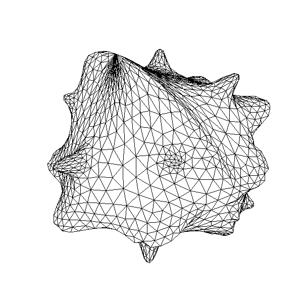

.. role:: freefem(code)
   :language: freefem

.. _exampleAlgorithmsOptimization:

Algorithms & Optimizations
==========================

.. _exampleAlgorithms:

Algorithms
----------

.. code-block:: freefem
   :linenos:

   // Parameters
   int nerr = 0;
   int debugJ = 0;
   int debugdJ = 0;
   real umax = 0;

   // Algorithms tests
   {
       func bool stop (int iter, real[int] u, real[int] g){
           cout << " stop = " << iter << " " << u.linfty << " " << g.linfty << endl;
           return g.linfty < 1e-5 || iter > 15;
       }
       // minimization of J(u) = 1./2 * sum (i+1) u_i^2 - b_i
       real[int] b(10), u(10);

       //J
       func real J (real[int] & u){
           real s = 0;
           for (int i = 0; i < u.n; i++)
               s += (i+1)*u[i]*u[i]*0.5 - b[i]*u[i];
           if (debugJ)
               cout << "J = " << s << ", u = " << u[0] << " " << u[1] << endl;
           return s;
       }

       //the gradiant of J (this is a affine version (the RHS is in)
       func real[int] DJ (real[int] &u){
           for (int i = 0; i < u.n; i++)
               u[i] = (i+1)*u[i];
           if (debugdJ)
               cout << "dJ: u = " << u[0] << " " << u[1] << " " << u[2] << endl;
           u -= b;
           if (debugdJ)
               cout << "dJ-b: u = " << u[0] << " " << u[1] << " " << u[2] << endl;
           return u; //return of global variable ok
       }

       //the gradiant of the bilinear part of J (the RHS is remove)
       func real[int] DJ0 (real[int] &u){
           for (int i = 0 ; i < u.n; i++)
               u[i] = (i+1)*u[i];
           if(debugdJ)
               cout << "dJ0: u =" << u[0] << " " << u[1] << " " << u[2] << endl;
           return u; //return of global variable ok
       }

       //erro calculation
       func real error (real[int] & u, real[int] & b){
           real s = 0;
           for (int i = 0; i < u.n; i++)
               s += abs((i+1)*u[i] - b[i]);
           return s;
       }

       func real[int] matId (real[int] &u){ return u; }

       int verb=5; //verbosity
       b = 1.; //set right hand side
       u = 0.; //set initial gest

       LinearCG(DJ, u, eps=1.e-6, nbiter=20, precon=matId, verbosity=verb);
       cout << "LinearGC (Affine) : J(u) = " << J(u) << ", err = " << error(u, b) << endl;
       nerr += !(error(u,b) < 1e-5);
       if(nerr) cout << "sol: u = " << u[0] << " " << u[1] << " " << u[2] << endl;

       b = 1;
       u = 0;
       LinearCG(DJ, u, eps=1.e-15, nbiter=20, precon=matId, verbosity=verb, stop=stop);
       cout << "LinearGC (Affine with stop) : J(u) = " << J(u) << ", err = " << error(u, b) << endl;
       nerr += !(error(u,b) < 1e-5);
       if(nerr) cout << "sol: u = " << u[0] << " " << u[1] << " " << u[2] << endl;

       b = 1;
       u = 0;
       LinearCG(DJ0, u, b, eps=1.e-6, nbiter=20, precon=matId, verbosity=verb);
       cout << "LinearGC (Linear) : J(u) = " << J(u) << ", err = " << error(u, b) << endl;
       nerr += !(error(u,b) < 1e-5);
       if(nerr) cout << "sol: u = " << u[0] << " " << u[1] << " " << u[2] << endl;

       b = 1;
       u = 0;
       AffineGMRES(DJ, u, eps=1.e-6, nbiter=20, precon=matId, verbosity=verb);
       cout << "AffineGMRES (Affine) : J(u) = " << J(u) << ", err = " << error(u, b) << endl;
       nerr += !(error(u,b) < 1e-5);
       if(nerr) cout << "sol: u = " << u[0] << " " << u[1] << " " << u[2] << endl;

       b=1;
       u=0;
       LinearGMRES(DJ0, u, b, eps=1.e-6, nbiter=20, precon=matId, verbosity=verb);
       cout << "LinearGMRES (Linear) : J(u) = " << J(u) << ", err = " << error(u, b) << endl;
       nerr += !(error(u,b) < 1e-5);
       if(nerr) cout << "sol: u = " << u[0] << " " << u[1] << " " << u[2] << endl;

       b=1;
       u=0;
       NLCG(DJ, u, eps=1.e-6, nbiter=20, precon=matId, verbosity=verb);
       cout << "NLCG: J(u) = " << J(u) << ", err = " << error(u, b) << endl;
       nerr += !(error(u,b) < 1e-5);
       if(nerr) cout << "sol: u =" << u[0] << " " << u[1] << " " << u[2] << endl;

       //warning: BFGS use a full matrix of size nxn (where n=u.n)
       b=1;
       u=2;
       BFGS(J, DJ, u, eps=1.e-6, nbiter=20, nbiterline=20);
       cout << "BFGS: J(u) = " << J(u) << ", err = " << error(u, b) << endl;
       assert(error(u,b) < 1e-5);
       if(nerr) cout << "sol: u =" << u[0] << " " << u[1] << " " << u[2] << endl;

       assert(nerr==0);
   }

   { // A real non linear test
       // Parameters
       real a = 0.001;
       real eps = 1e-6;
       //f(u) = a*u + u-ln(1+u), f'(u) = a+ u/(1+u), f''(u) = 1/(1+u)^2
       func real f(real u) { return u*a+u-log(1+u); }
       func real df(real u) { return a+u/(1+u); }
       func real ddf(real u) { return 1/((1+u)*(1+u)); }

       // Mesh
       mesh Th = square(20, 20);

       // Fespace
       fespace Vh(Th, P1);
       Vh b = 1;
       Vh u = 0;

       fespace Ph(Th, P0);
       Ph alpha; //store df(|nabla u|^2)

       // The functionnal J
       //J(u) = 1/2 int_Omega f(|nabla u|^2) - int_Omega u b
       func real J (real[int] & u){
           Vh w;
           w[] = u;
           real r = int2d(Th)(0.5*f(dx(w)*dx(w) + dy(w)*dy(w)) - b*w);
           cout << "J(u) = " << r << " " << u.min << " " << u.max << endl;
           return r;
       }

       // The gradiant of J
       func real[int] dJ (real[int] & u){
           Vh w;
           w[] = u;
           alpha = df(dx(w)*dx(w) + dy(w)*dy(w));
           varf au (uh, vh)
               = int2d(Th)(
                     alpha*(dx(w)*dx(vh) + dy(w)*dy(vh))
                   - b*vh
               )
               + on(1, 2, 3, 4, uh=0)
               ;

           u = au(0, Vh);
           return u; //warning: no return of local array
       }

       // Problem
       alpha = df(dx(u)*dx(u) + dy(u)*dy(u));
       varf alap (uh, vh)
           = int2d(Th)(
                 alpha*(dx(uh)*dx(vh) + dy(uh)*dy(vh))
           )
           + on(1, 2, 3, 4, uh=0)
           ;

       varf amass(uh, vh)
           = int2d(Th)(
                 uh*vh
           )
           + on(1, 2, 3, 4, uh=0)
           ;

       matrix Amass = amass(Vh, Vh, solver=CG);
       matrix Alap= alap(Vh, Vh, solver=Cholesky, factorize=1);

       // Preconditionner
       func real[int] C(real[int] & u){
           real[int] w = u;
           u = Alap^-1*w;
           return u; //warning: no return of local array variable
       }

       // Solve
       int conv=0;
       for(int i = 0; i < 20; i++){
           conv = NLCG(dJ, u[], nbiter=10, precon=C, veps=eps, verbosity=5);
           if (conv) break;

           alpha = df(dx(u)*dx(u) + dy(u)*dy(u));
           Alap = alap(Vh, Vh, solver=Cholesky, factorize=1);
           cout << "Restart with new preconditionner " << conv << ", eps =" << eps << endl;
       }

       // Plot
       plot (u, wait=true, cmm="solution with NLCG");
       umax = u[].max;

       Vh sss= df(dx(u)*dx(u) + dy(u)*dy(u));
       plot (sss, fill=true, value=true);
   }

   assert(nerr==0);

.. subfigstart::

.. figure:: images/Algorithms1.png
   :alt: Algorithms1
   :width: 90%

   Result ``u``

.. figure:: images/Algorithms2.png
   :alt: Algorithms2
   :width: 90%

   :freefem:`df(dx(u)*dx(u) + dy(u)*dy(u))`

.. subfigend::
   :width: 0.49
   :alt: Algorithms
   :label: Algorithms

   Algorithms

.. _exampleCMAESVariationalInequality:

CMAES variational inequality
----------------------------

.. code-block:: freefem
   :linenos:

   load "ff-cmaes"

   // Parameters
   int NN = 7;
   func f1 = 1.;
   func f2 = -1.;
   func g1 = 0.;
   func g2 = 0.1;
   int iter = 0;
   int nadapt = 1;
   real starttol = 1e-10;
   real bctol = 6.e-12;
   real pena = 1000.;

   // Mesh
   mesh Th = square(NN, NN);

   // Fespace
   fespace Vh(Th, P1);
   Vh ou1, ou2;

   // Mesh adaptation loops
   for (int al = 0; al < nadapt; ++al){
       // Problem
       varf BVF (v, w)
           = int2d(Th)(
                 0.5*dx(v)*dx(w)
               + 0.5*dy(v)*dy(w)
           )
           ;
       varf LVF1 (v, w) = int2d(Th)(f1*w);
       varf LVF2 (v, w) = int2d(Th)(f2*w);

       matrix A =  BVF(Vh, Vh);
       real[int] b1 = LVF1(0, Vh);
       real[int] b2 = LVF2(0, Vh);

       varf Vbord (v, w) = on(1, 2, 3, 4, v=1);

       Vh In, Bord;
       Bord[] = Vbord(0, Vh, tgv=1);
       In[] = Bord[] ? 0:1;
       Vh gh1 = Bord*g1;
       Vh gh2 = Bord*g2;

       // Function which creates a vector of the search space type from
       // two finite element functions
       func int FEFToSSP (real[int] &fef1, real[int] &fef2, real[int] &ssp){
           int kX = 0;
           for (int i = 0; i < Vh.ndof; ++i){
               if (In[][i]){
                   ssp[kX] = fef1[i];
                   ssp[kX+In[].sum] = fef2[i];
                   ++kX;
               }
           }
           return 1;
       }

       // Splits a vector from the search space and fills
       // two finite element functions with it
       func int SSPToFEF (real[int] &fef1, real[int] &fef2, real[int] &ssp){
           int kX = 0;
           for (int i = 0; i < Vh.ndof; ++i){
               if (In[][i]){
                   fef1[i] = ssp[kX];
                   fef2[i] = ssp[kX+In[].sum];
                   ++kX;
               }
               else{
                   fef1[i] = gh1[][i];
                   fef2[i] = gh2[][i];
               }
           }
           return 1;
       }

       func real IneqC (real[int] &X){
           real[int] constraints(In[].sum);
           for (int i = 0; i < In[].sum; ++i){
               constraints[i] = X[i] - X[i+In[].sum];
               constraints[i] = constraints[i] <= 0 ? 0. : constraints[i];
           }
           return constraints.l2;
       }

       func real J (real[int] &X){
           Vh u1, u2;
           SSPToFEF(u1[], u2[], X);
           iter++;
           real[int] Au1 = A*u1[], Au2 = A*u2[];
           Au1 -= b1;
           Au2 -= b2;
           real val = u1[]'*Au1 + u2[]'*Au2;
           val +=  pena * IneqC(X);
           if (iter%200 == 199)
               plot(u1, u2, nbiso=30, fill=1, dim=3, cmm="adapt level "+al+" - iteration "+iter+" - J = "+val, value=1);
           return val ;
       }

       // Solve
       real[int] start(2*In[].sum);

       if (al == 0){
           start(0:In[].sum-1) = 0.;
           start(In[].sum:2*In[].sum-1) = 0.1;
       }
       else
           FEFToSSP(ou1[], ou2[], start);

       real mini = cmaes(J, start, stopMaxFunEval=10000*(al+1), stopTolX=1.e-3/(10*(al+1)), initialStdDev=(0.025/(pow(100.,al))));
       Vh best1, best2;
       SSPToFEF(best1[], best2[], start);

       // Mesh adaptation
       Th = adaptmesh(Th, best1, best2);
       ou1 = best1;
       ou2 = best2;
   }

.. figure:: images/CMAESVariationalInequality.png
   :width: 70%

   Results

.. _exampleIPOPTMinimalSurfaceVolume:

IPOPT minimal surface & volume
------------------------------

.. code-block:: freefem
   :linenos:

   load "msh3";
   load "medit";
   load "ff-Ipopt";

   // Parameters
   int nadapt = 3;
   real alpha = 0.9;
   int np = 30;
   real regtest;
   int shapeswitch = 1;
   real sigma = 2*pi/40.;
   real treshold = 0.1;
   real e = 0.1;
   real r0 = 0.25;
   real rr = 2-r0;
   real E = 1./(e*e);
   real RR = 1./(rr*rr);

   // Mesh
   mesh Th = square(2*np, np, [2*pi*x, pi*y]);

   // Fespace
   fespace Vh(Th, P1, periodic=[[2, y], [4, y]]);
   //Initial shape definition
   //outside of the mesh adaptation loop to initialize with the previous optimial shape found on further iterations
   Vh startshape = 5;
   Vh uz = 1., lz = 1.;

   // Mesh adaptation loop
   real[int] lm = [1];
   for(int kkk = 0; kkk < nadapt; ++kkk){
       int iter=0;
       func sin2 = square(sin(y));

       // A function which transform Th in 3d mesh (r=rho)
       //a point (theta,phi) of Th becomes ( r(theta,phi)*cos(theta)*sin(phi) , r(theta,phi)*sin(theta)*sin(phi) , r(theta,phi)*cos(phi) )
       //then displays the resulting mesh with medit
       func int Plot3D (real[int] &rho, string cmm, bool ffplot){
           Vh rhoo;
           rhoo[] = rho;
           //mesh sTh = square(np, np/2, [2*pi*x, pi*y]);
           //fespace sVh(sTh, P1);
           //Vh rhoplot = rhoo;
           try{
               mesh3 Sphere = movemesh23(Th, transfo=[rhoo(x,y)*cos(x)*sin(y), rhoo(x,y)*sin(x)*sin(y), rhoo(x,y)*cos(y)]);
               if(ffplot)
                   plot(Sphere);
               else
                   medit(cmm, Sphere);
           }
           catch(...){
               cout << "PLOT ERROR" << endl;
           }
           return 1;
       }

       // Surface computation
       //Maybe is it possible to use movemesh23 to have the surface function less complicated
       //However, it would not simplify the gradient and the hessian
       func real Area (real[int] &X){
           Vh rho;
           rho[] = X;
           Vh rho2 = square(rho);
           Vh rho4 = square(rho2);
           real res = int2d(Th)(sqrt(rho4*sin2 + rho2*square(dx(rho)) + rho2*sin2*square(dy(rho))));
           ++iter;
           if(1)
               plot(rho, value=true, fill=true, cmm="rho(theta,phi) on [0,2pi]x[0,pi] - S="+res, dim=3);
           else
               Plot3D(rho[], "shape_evolution", 1);
           return res;
       }

       func real[int] GradArea (real[int] &X){
           Vh rho, rho2;
           rho[] = X;
           rho2[] = square(X);
           Vh sqrtPsi, alpha;
           {
               Vh dxrho2 = dx(rho)*dx(rho), dyrho2 = dy(rho)*dy(rho);
               sqrtPsi = sqrt(rho2*rho2*sin2 + rho2*dxrho2 + rho2*dyrho2*sin2);
               alpha = 2.*rho2*rho*sin2 + rho*dxrho2 + rho*dyrho2*sin2;
           }
           varf dArea (u, v)
               = int2d(Th)(
                   1./sqrtPsi * (alpha*v + rho2*dx(rho)*dx(v) + rho2*dy(rho)*sin2*dy(v))
               )
               ;

           real[int] grad = dArea(0, Vh);
           return grad;
       }

       matrix hessianA;
       func matrix HessianArea (real[int] &X){
           Vh rho, rho2;
           rho[] = X;
           rho2 = square(rho);
           Vh sqrtPsi, sqrtPsi3, C00, C01, C02, C11, C12, C22, A;
           {
               Vh C0, C1, C2;
               Vh dxrho2 = dx(rho)*dx(rho), dyrho2 = dy(rho)*dy(rho);
               sqrtPsi = sqrt( rho2*rho2*sin2 + rho2*dxrho2 + rho2*dyrho2*sin2);
               sqrtPsi3 = (rho2*rho2*sin2 + rho2*dxrho2 + rho2*dyrho2*sin2)*sqrtPsi;
               C0 = 2*rho2*rho*sin2 + rho*dxrho2 + rho*dyrho2*sin2;
               C1 = rho2*dx(rho);
               C2 = rho2*sin2*dy(rho);
               C00 = square(C0);
               C01 = C0*C1;
               C02 = C0*C2;
               C11 = square(C1);
               C12 = C1*C2;
               C22 = square(C2);
               A = 6.*rho2*sin2 + dxrho2 + dyrho2*sin2;
           }
           varf d2Area (w, v)
               =int2d(Th)(
                   1./sqrtPsi * (
                         A*w*v
                       + 2*rho*dx(rho)*dx(w)*v
                       + 2*rho*dx(rho)*w*dx(v)
                       + 2*rho*dy(rho)*sin2*dy(w)*v
                       + 2*rho*dy(rho)*sin2*w*dy(v)
                       + rho2*dx(w)*dx(v)
                       + rho2*sin2*dy(w)*dy(v)
                   )
                   + 1./sqrtPsi3 * (
                         C00*w*v
                       + C01*dx(w)*v
                       + C01*w*dx(v)
                       + C02*dy(w)*v
                       + C02*w*dy(v)
                       + C11*dx(w)*dx(v)
                       + C12*dx(w)*dy(v)
                       + C12*dy(w)*dx(v)
                       + C22*dy(w)*dy(v)
                   )
               )
               ;
           hessianA = d2Area(Vh, Vh);
           return hessianA;
       }

       // Volume computation
       func real Volume (real[int] &X){
           Vh rho;
           rho[] = X;
           Vh rho3 = rho*rho*rho;
           real res = 1./3.*int2d(Th)(rho3*sin(y));
           return res;
       }

       func real[int] GradVolume (real[int] &X){
           Vh rho;
           rho[] = X;
           varf dVolume(u, v) = int2d(Th)(rho*rho*sin(y)*v);
           real[int] grad = dVolume(0, Vh);
           return grad;
       }
       matrix hessianV;
       func matrix HessianVolume(real[int] &X){
           Vh rho;
           rho[] = X;
           varf d2Volume(w, v) = int2d(Th)(2*rho*sin(y)*v*w);
           hessianV = d2Volume(Vh, Vh);
           return hessianV;
       }

       //if we want to use the volume as a constraint function
       //we must wrap it in some freefem functions returning the appropriate type
       //The lagrangian hessian also have to be wrapped since the Volume is not linear with
       //respect to rho, it will constribbute to the hessian.
       func real[int] ipVolume (real[int] &X){ real[int] vol = [Volume(X)]; return vol; }
       matrix mdV;
       func matrix ipGradVolume (real[int] &X) { real[int,int] dvol(1,Vh.ndof); dvol(0,:) = GradVolume(X); mdV = dvol; return mdV; }
       matrix HLagrangian;
       func matrix ipHessianLag (real[int] &X, real objfact, real[int] &lambda){
           HLagrangian = objfact*HessianArea(X) + lambda[0]*HessianVolume(X);
           return HLagrangian;
       }

       //building struct for GradVolume
       int[int] gvi(Vh.ndof), gvj=0:Vh.ndof-1;
       gvi = 0;

       Vh rc = startshape; //the starting value
       Vh ub = 1.e19; //bounds definition
       Vh lb = 0;

       func real Gaussian (real X, real Y, real theta, real phi){
           real deltax2 = square((X-theta)*sin(Y)), deltay2 = square(Y-phi);
           return exp(-0.5 * (deltax2 + deltay2) / (sigma*sigma));
       }

       func disc1 = sqrt(1./(RR+(E-RR)*cos(y)*cos(y)))*(1+0.1*cos(7*x));
       func disc2 = sqrt(1./(RR+(E-RR)*cos(x)*cos(x)*sin2));

       if(1){
           lb = r0;
           for (int q = 0; q < 5; ++q){
               func f = rr*Gaussian(x, y, 2*q*pi/5., pi/3.);
               func g = rr*Gaussian(x, y, 2*q*pi/5.+pi/5., 2.*pi/3.);
               lb = max(max(lb, f), g);
           }
           lb = max(lb, rr*Gaussian(x, y, 2*pi, pi/3));
       }
       lb = max(lb, max(disc1, disc2));
       real Vobj = Volume(lb[]);
       real Vnvc = 4./3.*pi*pow(lb[].linfty,3);

       if(1)
           Plot3D(lb[], "object_inside", 1);
       real[int] clb = 0., cub = [(1-alpha)*Vobj + alpha*Vnvc];

       // Call IPOPT
       int res = IPOPT(Area, GradArea, ipHessianLag, ipVolume, ipGradVolume,
               rc[], ub=ub[], lb=lb[], clb=clb, cub=cub, checkindex=1, maxiter=kkk<nadapt-1 ? 40:150,
               warmstart=kkk, lm=lm, uz=uz[], lz=lz[], tol=0.00001, structjacc=[gvi,gvj]);
       cout << "IPOPT: res =" << res << endl ;

       // Plot
       Plot3D(rc[], "Shape_at_"+kkk, 1);
       Plot3D(GradArea(rc[]), "ShapeGradient", 1);

       // Mesh adaptation
       if (kkk < nadapt-1){
           Th = adaptmesh(Th, rc*cos(x)*sin(y), rc*sin(x)*sin(y), rc*cos(y),
               nbvx=50000, periodic=[[2, y], [4, y]]);
           plot(Th, wait=true);
           startshape = rc;
           uz = uz;
           lz = lz;
       }

       regtest = rc[]'*rc[];
   }

   Mesh

.. _exampleCMAESMPIVariationalInequality:

CMAES MPI variational inequality
--------------------------------

Command:

.. code-block:: bash
   :linenos:

   ff-mpirun -np 4 CMAESMPIVariationalInequality.edp -glut ffglut

.. code-block:: freefem
   :linenos:

   load "mpi-cmaes"

   // Parameters
   int NN = 10;
   func f1 = 1.;
   func f2 = -1.;
   func g1 = 0.;
   func g2 = 0.1;
   int iter = 0;
   int nadapt = 1;
   real starttol = 1e-10;
   real bctol = 6.e-12;
   real pena = 1000;

   // Mesh
   mesh Th = square(NN, NN);

   // Fespace
   fespace Vh(Th, P1);
   Vh ou1, ou2;

   // Mehs adaptation loop
   for (int al = 0; al < nadapt; ++al){
       // Problem
       varf BVF (v, w)
           = int2d(Th)(
                 0.5*dx(v)*dx(w)
               + 0.5*dy(v)*dy(w)
           )
           ;
       varf LVF1 (v, w) = int2d(Th)(f1*w);
       varf LVF2 (v, w) = int2d(Th)(f2*w);
       matrix A = BVF(Vh, Vh);
       real[int] b1 = LVF1(0, Vh);
       real[int] b2 = LVF2(0, Vh);

       varf Vbord (v, w) = on(1, 2, 3, 4, v=1);

       Vh In, Bord;
       Bord[] = Vbord(0, Vh, tgv=1);
       In[] = Bord[] ? 0:1;
       Vh gh1 = Bord*g1, gh2 = Bord*g2;

       //Function which create a vector of the search space type from
       //two finite element functions
       func int FEFToSSP (real[int] &fef1, real[int] &fef2, real[int] &ssp){
           int kX = 0;
           for (int i = 0; i < Vh.ndof; ++i){
               if (In[][i]){
                   ssp[kX] = fef1[i];
                   ssp[kX+In[].sum] = fef2[i];
                   ++kX;
               }
           }
           return 1;
       }

       //Function spliting a vector from the search space and fills
       //two finite element functions with it
       func int SSPToFEF (real[int] &fef1, real[int] &fef2, real[int] &ssp){
           int kX = 0;
           for (int i = 0; i < Vh.ndof; ++i){
               if (In[][i]){
                   fef1[i] = ssp[kX];
                   fef2[i] = ssp[kX+In[].sum];
                   ++kX;
               }
               else{
                   fef1[i] = gh1[][i];
                   fef2[i] = gh2[][i];
               }
           }
           return 1;
       }

       func real IneqC (real[int] &X){
           real[int] constraints(In[].sum);
           for (int i = 0; i < In[].sum; ++i){
               constraints[i] = X[i] - X[i+In[].sum];
               constraints[i] = constraints[i] <= 0 ? 0. : constraints[i];
           }
           return constraints.l2;
       }

       func real J (real[int] &X){
           Vh u1, u2;
           SSPToFEF(u1[], u2[], X);
           iter++;
           real[int] Au1 = A*u1[], Au2 = A*u2[];
           Au1 -= b1;
           Au2 -= b2;
           real val = u1[]'*Au1 + u2[]'*Au2;
           val +=  pena * IneqC(X);
           plot(u1, u2, nbiso=30, fill=1, dim=3, cmm="adapt level "+al+" - iteration "+iter+" - J = "+val, value=1);
           return val ;
       }

       // Solve
       real[int] start(2*In[].sum);

       if (al==0){
           start(0:In[].sum-1) = 0.;
           start(In[].sum:2*In[].sum-1) = 0.1;
       }
       else
           FEFToSSP(ou1[], ou2[], start);

       real mini = cmaesMPI(J, start, stopMaxFunEval=10000*(al+1), stopTolX=1.e-4/(10*(al+1)), initialStdDev=(0.025/(pow(100.,al))));
       Vh best1, best2;
       SSPToFEF(best1[], best2[], start);

       // Mesh adaptation
       Th = adaptmesh(Th, best1, best2);
       ou1 = best1;
       ou2 = best2;
   }

.. figure:: images/CMAESMPIVariationalInequality.png
   :width: 70%

   Result
