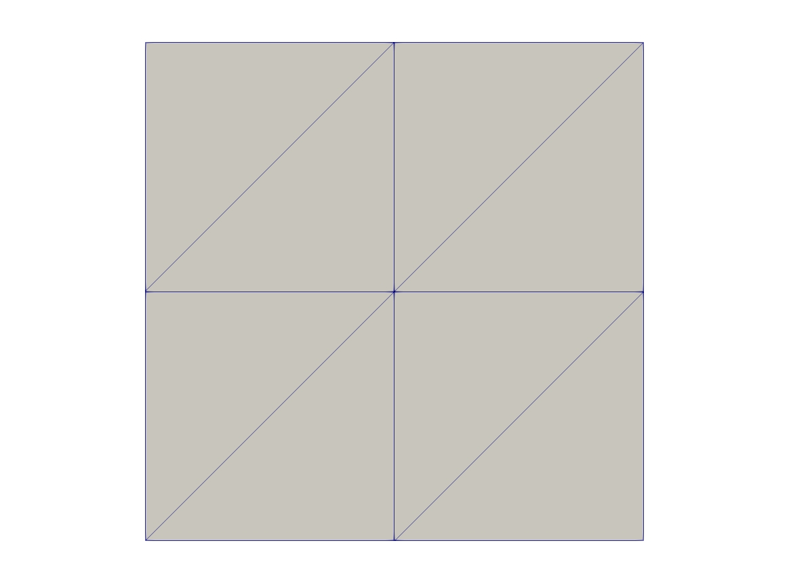
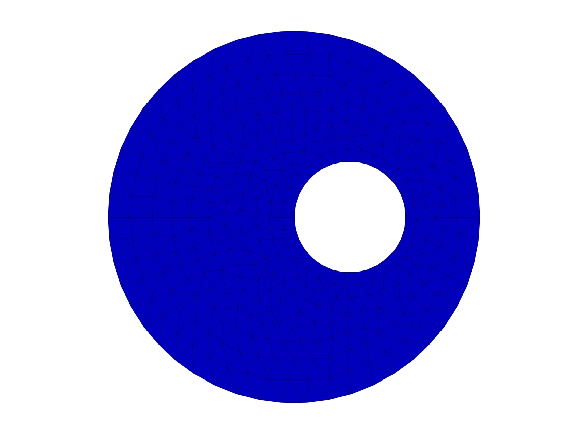
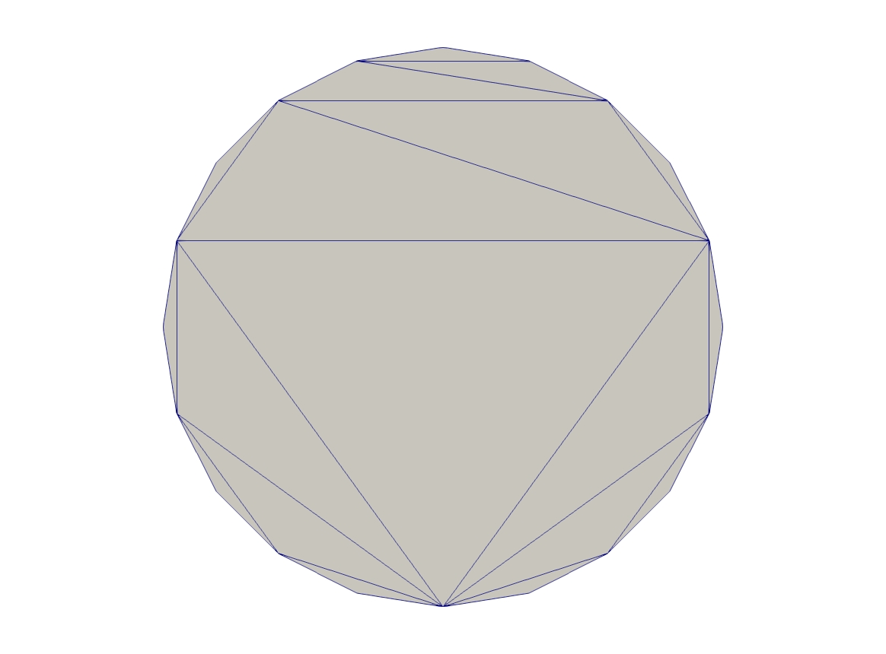
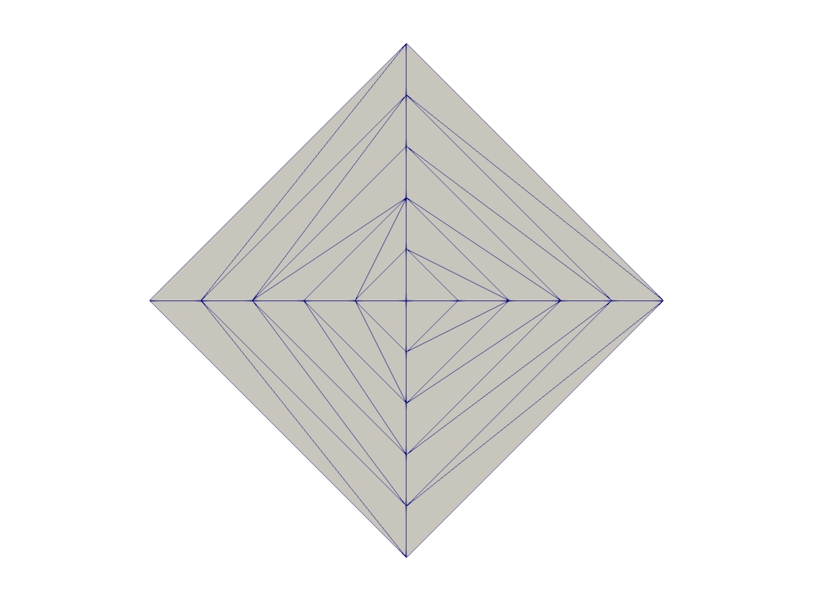

.. _exampleMeshGeneration:

Mesh Generation
===============

.. _exampleMeshSquare:

Square mesh
-----------

.. code-block:: freefem
   :linenos:

   mesh Th0 = square(10 ,10);

   mesh Th1 = square(4, 5);

   real x0 = 1.2;
   real x1 = 1.8;
   real y0 = 0;
   real y1 = 1;
   int n = 5;
   real m = 20;
   mesh Th2 = square(n, m, [x0+(x1-x0)*x, y0+(y1-y0)*y]);

   for (int i = 0; i < 5; ++i){
      int[int] labs = [11, 12, 13, 14];
      mesh Th3 = square(3, 3, flags=i, label=labs, region=10);
      plot(Th3, wait=1, cmm="square flags = "+i );
   }

.. _exampleMeshAdaptation:

Mesh adaptation
---------------

.. code-block:: freefem
   :linenos:

   // Parameters
   real eps = 0.0001;
   real h = 1;
   real hmin = 0.05;
   func f = 10.0*x^3 + y^3 + h*atan2(eps, sin(5.0*y)-2.0*x);

   // Mesh
   mesh Th = square(5, 5, [-1+2*x, -1+2*y]);

   // Fespace
   fespace Vh(Th,P1);
   Vh fh = f;
   plot(fh);

   // Adaptmesh
   for (int i = 0; i < 2; i++){
      Th = adaptmesh(Th, fh);
      fh = f; //old mesh is deleted
      plot(Th, fh, wait=true);
   }

.. subfigstart::

.. figure:: images/MeshAdaptation1.jpg
   :alt: MeshAdaptation1
   :width: 90%

   Initial mesh

.. figure:: images/MeshAdaptation2.jpg
   :alt: MeshAdaptation2
   :width: 90%

   Adapted mesh

.. subfigend::
   :width: 0.49
   :alt: MeshAdaptation
   :label: MeshAdaptation

   Mesh adaptation

.. _exampleMeshAdaptationForThePoissonProblem:

Mesh adaptation for the Poisson's problem
-----------------------------------------

.. code-block:: freefem
   :linenos:

   // Parameters
   real error = 0.1;

   // Mesh
   border ba(t=0, 1){x=t; y=0; label=1;}
   border bb(t=0, 0.5){x=1; y=t; label=1;}
   border bc(t=0, 0.5){x=1-t; y=0.5; label=1;}
   border bd(t=0.5, 1){x=0.5; y=t; label=1;}
   border be(t=0.5, 1){x=1-t; y=1; label=1;}
   border bf(t=0, 1){x=0; y=1-t; label=1;}
   mesh Th = buildmesh(ba(6) + bb(4) + bc(4) + bd(4) + be(4) + bf(6));

   // Fespace
   fespace Vh(Th, P1);
   Vh u, v;

   // Function
   func f = 1;

   // Problem
   problem Poisson(u, v, solver=CG, eps=1.e-6)
      = int2d(Th)(
           dx(u)*dx(v)
         + dy(u)*dy(v)
      )
      - int2d(Th)(
           f*v
      )
      + on(1, u=0);

   // Adaptmesh loop
   for (int i = 0; i < 4; i++){
      Poisson;
      Th = adaptmesh(Th, u, err=error);
      error = error/2;
   }

   // Plot
   plot(u);

.. subfigstart::

.. figure:: images/MeshAdaptationPoisson1.jpg
   :alt: MeshAdaptationPoisson1
   :width: 90%

   Initial mesh

.. figure:: images/MeshAdaptationPoisson2.jpg
   :alt: MeshAdaptationPoisson2
   :width: 90%

   Adapted mesh

.. figure:: images/MeshAdaptationPoissonU.jpg
   :alt: MeshAdaptationPoissonU
   :width: 90%

   Solution on adapted mesh

.. subfigend::
   :width: 0.49
   :alt: MeshAdaptationPoisson
   :label: MeshAdaptationPoisson

   Mesh adaptation (Poisson)

.. _exampleUniformMeshAdaptation:

Uniform mesh adaptation
-----------------------

.. code-block:: freefem
   :linenos:

   mesh Th = square(2, 2); // The initial mesh
   plot(Th, wait=true);

   Th = adaptmesh(Th, 1./30., IsMetric=1, nbvx=10000);
   plot(Th, wait=true);

   Th = adaptmesh(Th, 1./30., IsMetric=1, nbvx=10000); // More than one time due to the
   Th = adaptmesh(Th, 1./30., IsMetric=1, nbvx=10000); // adaptation bound `maxsubdiv=`
   plot(Th, wait=true);

.. subfigstart::

   Initial mesh

.. figure:: images/UniformMeshAdaptation2.jpg
   :alt: UniformMeshAdaptation2
   :width: 90%

   Adapted mesh

.. subfigend::
   :width: 0.49
   :alt: UniformMeshAdaptation
   :label: UniformMeshAdaptation

   Uniform mesh adaptation

.. _exampleBorders:

Borders
-------

.. code-block:: freefem
   :linenos:

   {
      int upper = 1;
      int others = 2;
      int inner = 3;

      border C01(t=0, 1){x=0; y=-1+t; label=upper;}
      border C02(t=0, 1){x=1.5-1.5*t; y=-1; label=upper;}
      border C03(t=0, 1){x=1.5; y=-t; label=upper;}
      border C04(t=0, 1){x=1+0.5*t; y=0; label=others;}
      border C05(t=0, 1){x=0.5+0.5*t; y=0; label=others;}
      border C06(t=0, 1){x=0.5*t; y=0; label=others;}
      border C11(t=0, 1){x=0.5; y=-0.5*t; label=inner;}
      border C12(t=0, 1){x=0.5+0.5*t; y=-0.5; label=inner;}
      border C13(t=0, 1){x=1; y=-0.5+0.5*t; label=inner;}

      int n = 10;
      plot(C01(-n) + C02(-n) + C03(-n) + C04(-n) + C05(-n)
         + C06(-n) + C11(n) + C12(n) + C13(n), wait=true);

      mesh Th = buildmesh(C01(-n) + C02(-n) + C03(-n) + C04(-n) + C05(-n)
         + C06(-n) + C11(n) + C12(n) + C13(n));

      plot(Th, wait=true);

      cout << "Part 1 has region number " << Th(0.75, -0.25).region << endl;
      cout << "Part 2 has redion number " << Th(0.25, -0.25).region << endl;
   }

   {
      border a(t=0, 2*pi){x=cos(t); y=sin(t); label=1;}
      border b(t=0, 2*pi){x=0.3+0.3*cos(t); y=0.3*sin(t); label=2;}
      plot(a(50) + b(30)); //to see a plot of the border mesh
      mesh Thwithouthole = buildmesh(a(50) + b(30));
      mesh Thwithhole = buildmesh(a(50) + b(-30));
      plot(Thwithouthole);
      plot(Thwithhole);
   }

   {
      real r=1;
      border a(t=0, 2*pi){x=r*cos(t); y=r*sin(t); label=1;}
      r=0.3;
      border b(t=0, 2*pi){x=r*cos(t); y=r*sin(t); label=1;}
      //  mesh Thwithhole = buildmesh(a(50) + b(-30)); // do not do this because the two
      // circles have the same radius = $0.3$
   }

.. subfigstart::

.. figure:: images/Borders1.jpg
   :alt: Borders1
   :width: 90%

   Mesh with two regions

.. figure:: images/Borders2.jpg
   :alt: Borders2
   :width: 90%

   Mesh without a hole

   Mesh with a hole

.. subfigend::
   :width: 0.49
   :alt: Borders
   :label: Borders

   Borders

.. _exampleChange:

Change
------

.. code-block:: freefem
   :linenos:

   verbosity=3;

   // Mesh
   mesh Th1 = square(10, 10);
   mesh Th2 = square(20, 10, [x+1, y]);

   int[int] r1=[2, 0];
   plot(Th1, wait=true);

   Th1 = change(Th1, label=r1); // Change edges' label from 2 to 0
   plot(Th1, wait=true);

   int[int] r2=[4, 0];
   Th2 = change(Th2, label=r2); // Change edges' label from 4 to 0
   plot(Th2, wait=true);

   mesh Th = Th1 + Th2; // 'gluing together' Th1 and Th2 meshes
   cout << "nb lab = " << int1d(Th1,1,3,4)(1./lenEdge)+int1d(Th2,1,2,3)(1./lenEdge)
      << " == " << int1d(Th,1,2,3,4)(1./lenEdge) << " == " << ((10+20)+10)*2 << endl;
   plot(Th, wait=true);

   fespace Vh(Th, P1);
   Vh u, v;

   macro Grad(u) [dx(u),dy(u)] // Definition of a macro

   solve P(u, v)
      = int2d(Th)(
           Grad(u)'*Grad(v)
      )
      -int2d(Th)(
           v
      )
      + on(1, 3, u=0)
      ;

   plot(u, wait=1);

.. figure:: images/Change.jpg
   :width: 50%

   Result

.. _exampleCube:

Cube
----

.. code-block:: freefem
   :linenos:

   load "msh3"

   int[int] l6 = [37, 42, 45, 40, 25, 57];
   int r11 = 11;
   mesh3 Th = cube(4, 5, 6, [x*2-1, y*2-1, z*2-1], label=l6, flags =3, region=r11);

   cout << "Volume = " << Th.measure << ", border area = " << Th.bordermeasure << endl;

   int err = 0;
   for(int i = 0; i < 100; ++i){
      real s = int2d(Th,i)(1.);
      real sx = int2d(Th,i)(x);
      real sy = int2d(Th,i)(y);
      real sz = int2d(Th,i)(z);

      if(s){
         int ix = (sx/s+1.5);
         int iy = (sy/s+1.5);
         int iz = (sz/s+1.5);
         int ii = (ix + 4*(iy+1) + 16*(iz+1) );
         //value of ix,iy,iz => face min 0, face max 2, no face 1
         cout << "Label = " << i << ", s = " << s << " " << ix << iy << iz << " : " << ii << endl;
         if( i != ii ) err++;
      }
   }
   real volr11 = int3d(Th,r11)(1.);
   cout << "Volume region = " << 11 << ": " << volr11 << endl;
   if((volr11 - Th.measure )>1e-8) err++;
   plot(Th, fill=false);
   cout << "Nb err = " << err << endl;
   assert(err==0);

.. figure:: images/Cube.jpg
   :width: 50%

   Cube

.. _exampleEmptyMesh:

Empty mesh
----------

.. code-block:: freefem
   :linenos:

   {
      border a(t=0, 2*pi){x=cos(t); y=sin(t); label=1;}
      mesh Th = buildmesh(a(20));
      Th = emptymesh(Th);
      plot(Th);
   }
   {
      mesh Th = square(10, 10);
      int[int] ssd(Th.nt);
      // Builds the pseudo region numbering
      for(int i = 0; i < ssd.n; i++){
         int iq = i/2; // Because we have 2 triangles per quad
         int ix = iq%10;
         int iy = iq/10;
         ssd[i] = 1 + (ix>=5) + (iy>=5)*2;
      }
      // Builds an emtpy mesh with all edges that satisfy e=T1 cap T2 and ssd[T1] != ssd[T2]
      Th = emptymesh(Th, ssd);
      // Plot
      plot(Th);
   }

.. subfigstart::

   Empty square

   Empty diamond

.. subfigend::
   :width: 0.49
   :alt: EmptyMesh
   :label: EmptyMesh

   Empty mesh

.. _example3Points:

3 points
--------

.. code-block:: freefem
   :linenos:

   // Square for Three-Point Bend Specimens fixed on Fix1, Fix2
   // It will be loaded on Load
   real a = 1, b = 5, c = 0.1;
   int n = 5, m = b*n;
   border Left(t=0, 2*a){x=-b; y=a-t;}
   border Bot1(t=0, b/2-c){x=-b+t; y=-a;}
   border Fix1(t=0, 2*c){x=-b/2-c+t; y=-a;}
   border Bot2(t=0, b-2*c){x=-b/2+c+t; y=-a;}
   border Fix2(t=0, 2*c){x=b/2-c+t; y=-a;}
   border Bot3(t=0, b/2-c){x=b/2+c+t; y=-a;}
   border Right(t=0, 2*a){x=b; y=-a+t;}
   border Top1(t=0, b-c){x=b-t; y=a;}
   border Load(t=0, 2*c){x=c-t; y=a;}
   border Top2(t=0, b-c){x=-c-t; y=a;}

   mesh Th = buildmesh(Left(n) + Bot1(m/4) + Fix1(5) + Bot2(m/2)
      + Fix2(5) + Bot3(m/4) + Right(n) + Top1(m/2) + Load(10) + Top2(m/2));
   plot(Th, bw=true);

.. figure:: images/3Points.jpg
   :width: 50%

   3 Points

.. _exampleBezier:

Bezier
------

.. code-block:: freefem
   :linenos:

   // A cubic Bezier curve connecting two points with two control points
   func real bzi(real p0, real p1, real q1, real q2, real t){
      return p0*(1-t)^3 + q1*3*(1-t)^2*t + q2*3*(1-t)*t^2 + p1*t^3;
   }

   real[int] p00 = [0, 1], p01 = [0, -1], q00 = [-2, 0.1], q01 = [-2, -0.5];
   real[int] p11 = [1,-0.9], q10 = [0.1, -0.95], q11=[0.5, -1];
   real[int] p21 = [2, 0.7], q20 = [3, -0.4], q21 = [4, 0.5];
   real[int] q30 = [0.5, 1.1], q31 = [1.5, 1.2];
   border G1(t=0, 1){
      x=bzi(p00[0], p01[0], q00[0], q01[0], t);
      y=bzi(p00[1], p01[1], q00[1], q01[1], t);
   }
   border G2(t=0, 1){
      x=bzi(p01[0], p11[0], q10[0], q11[0], t);
      y=bzi(p01[1], p11[1], q10[1], q11[1], t);
   }
   border G3(t=0, 1){
      x=bzi(p11[0], p21[0], q20[0], q21[0], t);
      y=bzi(p11[1], p21[1], q20[1], q21[1], t);
   }
   border G4(t=0, 1){
      x=bzi(p21[0], p00[0], q30[0], q31[0], t);
      y=bzi(p21[1], p00[1], q30[1], q31[1], t);
   }
   int m = 5;
   mesh Th = buildmesh(G1(2*m) + G2(m) + G3(3*m) + G4(m));
   plot(Th, bw=true);

.. figure:: images/Bezier.jpg
   :width: 50%

   Bezier

.. _exampleBuildLayerMesh:

Build layer mesh
----------------

.. code-block:: freefem
   :linenos:

   load "msh3"
   load "tetgen"
   load "medit"

   // Parameters
   int C1 = 99;
   int C2 = 98;

   // 2D mesh
   border C01(t=0, pi){x=t; y=0; label=1;}
   border C02(t=0, 2*pi){ x=pi; y=t; label=1;}
   border C03(t=0, pi){ x=pi-t; y=2*pi; label=1;}
   border C04(t=0, 2*pi){ x=0; y=2*pi-t; label=1;}

   border C11(t=0, 0.7){x=0.5+t; y=2.5; label=C1;}
   border C12(t=0, 2){x=1.2; y=2.5+t; label=C1;}
   border C13(t=0, 0.7){x=1.2-t; y=4.5; label=C1;}
   border C14(t=0, 2){x=0.5; y=4.5-t; label=C1;}

   border C21(t=0, 0.7){x=2.3+t; y=2.5; label=C2;}
   border C22(t=0, 2){x=3; y=2.5+t; label=C2;}
   border C23(t=0, 0.7){x=3-t; y=4.5; label=C2;}
   border C24(t=0, 2){x=2.3; y=4.5-t; label=C2;}

   mesh Th = buildmesh(C01(10) + C02(10) + C03(10) + C04(10)
      + C11(5) + C12(5) + C13(5) + C14(5)
      + C21(-5) + C22(-5) + C23(-5) + C24(-5));

   mesh Ths = buildmesh(C01(10) + C02(10) + C03(10) + C04(10)
      + C11(5) + C12(5) + C13(5) + C14(5));

   // Construction of a box with one hole and two regions
   func zmin = 0.;
   func zmax = 1.;
   int MaxLayer = 10;

   func XX = x*cos(y);
   func YY = x*sin(y);
   func ZZ = z;

   int[int] r1 = [0, 41], r2 = [98, 98, 99, 99, 1, 56];
   int[int] r3 = [4, 12]; // Change upper surface mesh's triangles labels
   // generated by the 2D mesh's triangles Th
   // from label 4 to label 12
   int[int] r4 = [4, 45]; // Change lower surface mesh's triangles labels
   // generated by the 2D mesh's triangles Th
   // from label 4 to label 45

   mesh3 Th3 = buildlayers(Th, MaxLayer, zbound=[zmin, zmax], region=r1,
      labelmid=r2, labelup=r3, labeldown=r4);
   medit("box 2 regions 1 hole", Th3);

   // Construction of a sphere with TetGen
   func XX1 = cos(y)*sin(x);
   func YY1 = sin(y)*sin(x);
   func ZZ1 = cos(x);

   real[int] domain = [0., 0., 0., 0, 0.001];
   string test = "paACQ";
   cout << "test = " << test << endl;
   mesh3 Th3sph = tetgtransfo(Ths, transfo=[XX1, YY1, ZZ1],
      switch=test, nbofregions=1, regionlist=domain);
   medit("sphere 2 regions", Th3sph);

.. subfigstart::

.. figure:: images/BuildLayerMesh1.jpg
   :alt: BuildLayerMesh1
   :width: 90%

   Box with a hole

.. figure:: images/BuildLayerMesh2.jpg
   :alt: BuildLayerMesh2
   :width: 90%

   Sphere

.. subfigend::
   :width: 0.49
   :alt: BuildLayerMesh
   :label: BuildLayerMesh

   Build layer mesh

.. _exampleSphere:

Sphere
------

.. code-block:: freefem
   :linenos:

   // Parameter
   real hh = 0.1;

   // Mesh 2D
   mesh Th = square(10, 20, [x*pi-pi/2, 2*y*pi]); // ]-pi/2, pi/2[X]0, 2pi[
   // A parametrization of a sphere
   func f1 = cos(x)*cos(y);
   func f2 = cos(x)*sin(y);
   func f3 = sin(x);
   // Partial derivative of the parametrization DF
   func f1x = sin(x)*cos(y);
   func f1y = -cos(x)*sin(y);
   func f2x = -sin(x)*sin(y);
   func f2y = cos(x)*cos(y);
   func f3x = cos(x);
   func f3y = 0;
   //M = DF^t DF
   func m11 = f1x^2 + f2x^2 + f3x^2;
   func m21 = f1x*f1y + f2x*f2y + f3x*f3y;
   func m22 = f1y^2 + f2y^2 + f3y^2;

   // Periodic condition
   func perio = [[4, y], [2, y], [1, x], [3, x]];

   // Mesh adaptation
   real vv = 1/square(hh);
   Th = adaptmesh(Th, m11*vv, m21*vv, m22*vv, IsMetric=1, inquire=1, periodic=perio);
   Th = adaptmesh(Th, m11*vv, m21*vv, m22*vv, IsMetric=1, periodic=perio);
   Th = adaptmesh(Th, m11*vv, m21*vv, m22*vv, IsMetric=1, periodic=perio);
   Th = adaptmesh(Th, m11*vv, m21*vv, m22*vv, IsMetric=1, periodic=perio);

   // Sphere
   mesh3 Th3 = movemesh23(Th, transfo=[f1, f2, f3]);
   plot(Th3);

.. subfigstart::

.. figure:: images/Sphere1.jpg
   :alt: Sphere1
   :width: 90%

   Initial mesh

.. figure:: images/Sphere2.jpg
   :alt: Sphere2
   :width: 90%

   Sphere

.. subfigend::
   :width: 0.49
   :alt: Sphere
   :label: Sphere

   Sphere
