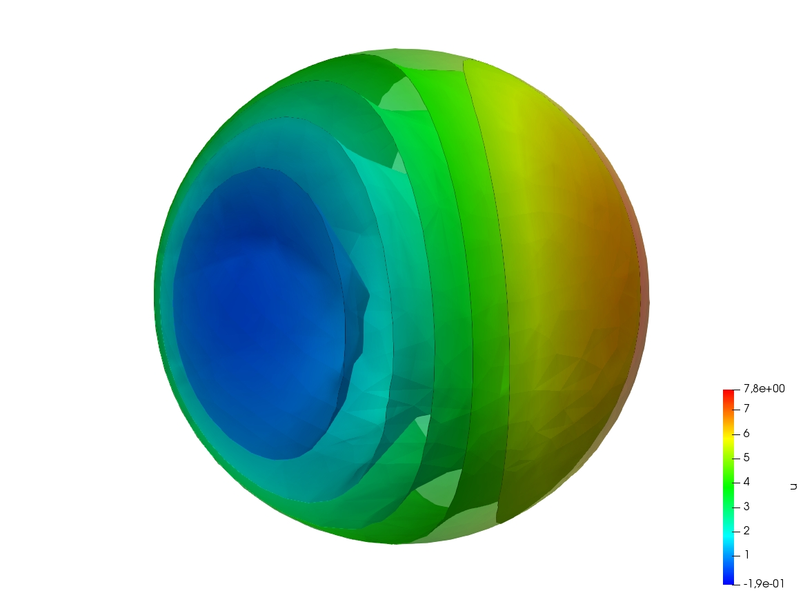

Misc
====

.. _examplePoissonEquation:

Poisson's Equation
------------------

.. code-block:: freefem
   :linenos:

   // Parameters
   int nn = 20;
   real L = 1.;
   real H = 1.;
   real l = 0.5;
   real h = 0.5;

   func f = 1.;
   func g = 0.;

   int NAdapt = 10;

   // Mesh
   border b1(t=0, L){x=t; y=0;};
   border b2(t=0, h){x=L; y=t;};
   border b3(t=L, l){x=t; y=h;};
   border b4(t=h, H){x=l; y=t;};
   border b5(t=l, 0){x=t; y=H;};
   border b6(t=H, 0){x=0; y=t;};

   mesh Th = buildmesh(b1(nn*L) + b2(nn*h) + b3(nn*(L-l)) + b4(nn*(H-h)) + b5(nn*l) + b6(nn*H));

   // Fespace
   fespace Vh(Th, P1); // Change P1 to P2 to test P2 finite element
   Vh u, v;

   // Macro
   macro grad(u) [dx(u), dy(u)] //

   // Problem
   problem Poisson (u, v, solver=CG, eps=-1.e-6)
      = int2d(Th)(
           grad(u)' * grad(v)
      )
      + int2d(Th)(
           f * v
      )
      + on(b1, b2, b3, b4, b5, b6, u=g)
      ;

   // Mesh adaptation iterations
   real error = 0.1;
   real coef = 0.1^(1./5.);
   for (int i = 0; i < NAdapt; i++){
      // Solve
      Poisson;

      // Plot
      plot(Th, u);

      // Adaptmesh
      Th = adaptmesh(Th, u, inquire=1, err=error);
      error = error * coef;
   }

.. subfigstart::

.. _figExamplePoisson:

.. figure:: images/poisson_associated_mesh.jpg
   :alt: PoissonAssociatedMesh
   :width: 90%

   Adapted mesh

.. _figExamplePoissonAdapt:

.. figure:: images/poisson_adapted_mesh.jpg
   :alt: PoissonAdaptedMesh
   :width: 90%

   Solution on adapted mesh

.. subfigend::
   :width: 0.49
   :alt: Poisson
   :label: Poisson

   Poisson

.. _examplePoissonEquation3D:

Poisson's equation 3D
---------------------

.. code-block:: freefem
   :linenos:

   load "tetgen"

   // Parameters
   real hh = 0.1;
   func ue = 2.*x*x + 3.*y*y + 4.*z*z + 5.*x*y + 6.*x*z + 1.;
   func f= -18.;

   // Mesh
   mesh Th = square(10, 20, [x*pi-pi/2, 2*y*pi]); // ]-pi/2, pi/2[X]0,2pi[
   func f1 = cos(x)*cos(y);
   func f2 = cos(x)*sin(y);
   func f3 = sin(x);
   func f1x = sin(x)*cos(y);
   func f1y = -cos(x)*sin(y);
   func f2x = -sin(x)*sin(y);
   func f2y = cos(x)*cos(y);
   func f3x = cos(x);
   func f3y = 0;
   func m11 = f1x^2 + f2x^2 + f3x^2;
   func m21 = f1x*f1y + f2x*f2y + f3x*f3y;
   func m22 = f1y^2 + f2y^2 + f3y^2;
   func perio = [[4, y], [2, y], [1, x], [3, x]];
   real vv = 1/square(hh);
   Th = adaptmesh(Th, m11*vv, m21*vv, m22*vv, IsMetric=1, periodic=perio);
   Th = adaptmesh(Th, m11*vv, m21*vv, m22*vv, IsMetric=1, periodic=perio);
   plot(Th);

   real[int] domain = [0., 0., 0., 1, 0.01];
   mesh3 Th3 = tetgtransfo(Th, transfo=[f1, f2, f3], nbofregions=1, regionlist=domain);
   plot(Th3);

   border cc(t=0, 2*pi){x=cos(t); y=sin(t); label=1;}
   mesh Th2 = buildmesh(cc(50));

   // Fespace
   fespace Vh(Th3, P23d);
   Vh u, v;
   Vh uhe = ue;
   cout << "uhe min: " << uhe[].min << " - max: " << uhe[].max << endl;
   cout << uhe(0.,0.,0.) << endl;

   fespace Vh2(Th2, P2);
   Vh2 u2, u2e;

   // Macro
   macro Grad3(u) [dx(u), dy(u), dz(u)] //

   // Problem
   problem Lap3d (u, v, solver=CG)
       = int3d(Th3)(
             Grad3(v)' * Grad3(u)
       )
       - int3d(Th3)(
             f * v
       )
       + on(0, 1, u=ue)
       ;

   // Solve
   Lap3d;
   cout << "u min: " << u[]. min << " - max: " << u[].max << endl;

   // Error
   real err = int3d(Th3)(square(u-ue));
   cout << int3d(Th3)(1.) << " = " << Th3.measure << endl;
   Vh d = ue - u;
   cout << " err = " << err << " - diff l^intfy = " << d[].linfty << endl;

   // Plot
   u2 = u;
   u2e = ue;
   plot(u2, wait=true);
   plot(u2, u2e,wait=true);

   Iso-surfaces of the solution

.. _exampleStokesEquationOnACube:

Stokes Equation on a cube
-------------------------

.. code-block:: freefem
   :linenos:

   load "msh3"
   load "medit" // Dynamically loaded tools for 3D

   // Parameters
   int nn = 8;

   // Mesh
   mesh Th0 = square(nn, nn);
   int[int] rup = [0, 2];
   int[int] rdown = [0, 1];
   int[int] rmid = [1, 1, 2, 1, 3, 1, 4, 1];
   real zmin = 0, zmax = 1;
   mesh3 Th = buildlayers(Th0, nn, zbound=[zmin, zmax],
       reffacemid=rmid, reffaceup=rup, reffacelow=rdown);

   medit("c8x8x8", Th); // 3D mesh visualization with medit

   // Fespaces
   fespace Vh2(Th0, P2);
   Vh2 ux, uz, p2;

   fespace VVh(Th, [P2, P2, P2, P1]);
   VVh [u1, u2, u3, p];
   VVh [v1, v2, v3, q];

   // Macro
   macro Grad(u) [dx(u), dy(u), dz(u)] //
   macro div(u1,u2,u3) (dx(u1) + dy(u2) + dz(u3)) //

   // Problem (directly solved)
   solve vStokes ([u1, u2, u3, p], [v1, v2, v3, q])
       = int3d(Th, qforder=3)(
             Grad(u1)' * Grad(v1)
           + Grad(u2)' * Grad(v2)
           + Grad(u3)' * Grad(v3)
           - div(u1, u2, u3) * q
           - div(v1, v2, v3) * p
           + 1e-10 * q * p
       )
       + on(2, u1=1., u2=0, u3=0)
       + on(1, u1=0, u2=0, u3=0)
       ;

   // Plot
   plot(p, wait=1, nbiso=5); // 3D visualization of pressure isolines

   // See 10 plan of the velocity in 2D
   for(int i = 1; i < 10; i++){
       // Cut plane
       real yy = i/10.;
       // 3D to 2D interpolation
       ux = u1(x,yy,y);
       uz = u3(x,yy,y);
       p2 = p(x,yy,y);
       // Plot
       plot([ux, uz], p2, cmm="cut y = "+yy, wait= 1);
   }

.. subfigstart::

.. figure:: images/Stokes3d.jpg
   :alt: Stokes3d
   :width: 90%

   Solution

.. figure:: images/Stokes3d-Th.jpg
   :alt: Stokes3d-Th
   :width: 90%

   Associated mesh

.. subfigend::
   :width: 0.49
   :alt: Stokes3d
   :label: Stokes3d

   Stokes

.. _exampleCavity:

Cavity
------

.. code-block:: freefem
   :linenos:

   //Parameters
   int m = 300;
   real L = 1;
   real rho = 500.;
   real mu = 0.1;

   real uin = 1;
   func fx = 0;
   func fy = 0;
   int[int] noslip = [1, 2, 4];
   int[int] inflow = [3];

   real dt = 0.1;
   real T = 50;

   real eps = 1e-3;

   //Macros
   macro div(u) (dx(u#x) + dy(u#y))//
   macro grad(u) [dx(u), dy(u)]//
   macro Grad(u) [grad(u#x), grad(u#y)]//

   //Time
   real cpu;
   real tabcpu;

   //mesh
   border C1(t = 0, L){ x = t; y = 0; label = 1; }
   border C2(t = 0, L){ x = L; y = t; label = 2; }
   border C3(t = 0, L){ x = L-t; y = L; label = 3; }
   border C4(t = 0, L){ x = 0; y = L-t; label = 4; }
   mesh th = buildmesh( C1(m) + C2(m) + C3(m) + C4(m) );

   fespace UPh(th, [P2,P2,P1]);
   UPh [ux, uy, p];
   UPh [uhx, uhy, ph];
   UPh [upx, upy, pp];

   //Solve
   varf navierstokes([ux, uy, p], [uhx, uhy, ph])
     = int2d(th)(
         rho/dt* [ux, uy]'* [uhx, uhy]
       + mu* (Grad(u):Grad(uh))
       - p* div(uh)
       - ph* div(u)
       - 1e-10 *p*ph
       )

     + int2d(th) (
         [fx, fy]' * [uhx, uhy]
       + rho/dt* [convect([upx, upy], -dt, upx), convect([upx, upy], -dt, upy)]'* [uhx, uhy]
       )

     + on(noslip, ux=0, uy=0)
     + on(inflow, ux=uin, uy=0)
     ;

   //Initialization
   [ux, uy, p]=[0, 0, 0];

   matrix<real> NS = navierstokes(UPh, UPh, solver=sparsesolver);
   real[int] NSrhs = navierstokes(0, UPh);

   //Time loop
   for(int j = 0; j < T/dt; j++){
     [upx, upy, pp]=[ux, uy, p];

     NSrhs = navierstokes(0, UPh);
     ux[] = NS^-1 * NSrhs;

     plot( [ux,uy], p, wait=0, cmm=j);
   }

   //CPU
   cout << " CPU = " << clock()-cpu << endl ;
   tabcpu = clock()-cpu;
