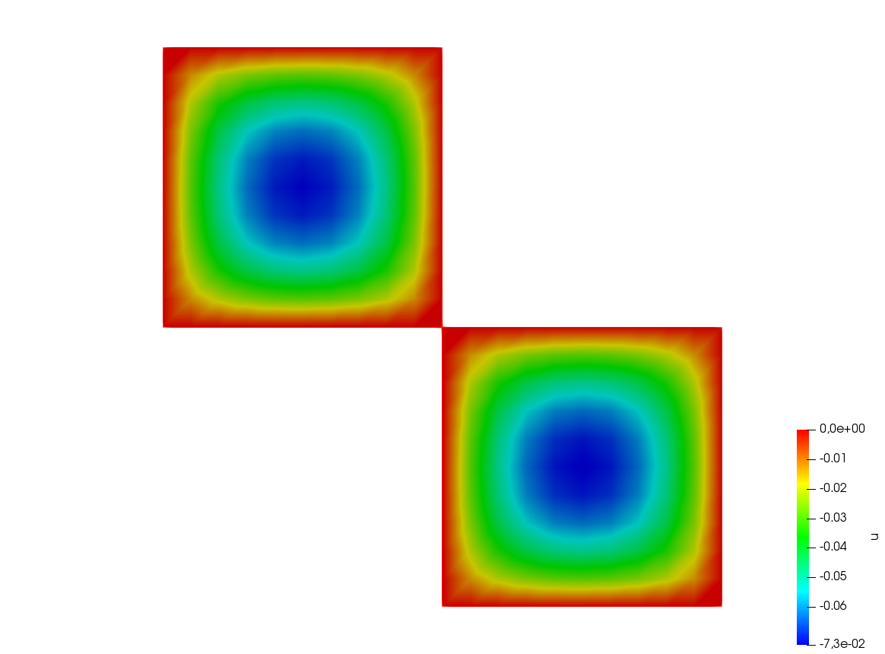

.. _exampleDevelopers:

Developers
==========

.. _exampleFFT:

FFT
---

.. code-block:: freefem
   :linenos:

   load "dfft"

   // Parameters
   int nx = 32;
   real ny = 16;
   real N = nx*ny;
   func f1 = cos(2*x*2*pi)*cos(3*y*2*pi);

   // Mesh
   //warning: the fourier space is not exactly the unit square due to periodic condition
   mesh Th = square(nx-1, ny-1, [(nx-1)*x/nx, (ny-1)*y/ny]);
   //warning: the numbering of the vertices (x,y) is
   //given by i = x/nx + nx*y/ny

   // Fespace
   fespace Vh(Th,P1);
   Vh<complex> u = f1, v;
   Vh w = f1;
   Vh ur, ui;

   // FFT
   //in dfft the matrix n, m is in row-major order and array n, m is
   //store j + m*i (the transpose of the square numbering)
   v[] = dfft(u[], ny, -1);
   u[] = dfft(v[], ny, +1);
   cout << "||u||_\infty " << u[].linfty << endl;

   u[] *= 1./N;
   cout << "||u||_\infty " << u[].linfty << endl;

   ur = real(u);

   // Plot
   plot(w, wait=1, value=1, cmm="w");
   plot(ur, wait=1, value=1, cmm="u");
   v = w - u;
   cout << "diff = " << v[].max << " " << v[].min << endl;
   assert( norm(v[].max) < 1e-10 && norm(v[].min) < 1e-10);

   // Other example
   //FFT Lapacian
   //-\Delta u = f with biperiodic condition
   func f = cos(3*2*pi*x)*cos(2*2*pi*y);
   func ue = (1./(square(2*pi)*13.))*cos(3*2*pi*x)*cos(2*2*pi*y); //the exact solution
   Vh<complex> ff = f;
   Vh<complex> fhat;
   Vh<complex> wij;

   // FFT
   fhat[] = dfft(ff[],ny,-1);

   //warning in fact we take mode between -nx/2, nx/2 and -ny/2, ny/2
   //thanks to the operator ?:
   wij = square(2.*pi)*(square(( x<0.5?x*nx:(x-1)*nx)) + square((y<0.5?y*ny:(y-1)*ny)));
   wij[][0] = 1e-5; //to remove div / 0
   fhat[] = fhat[] ./ wij[];
   u[] = dfft(fhat[], ny, 1);
   u[] /= complex(N);
   ur = real(u); //the solution
   w = real(ue); //the exact solution

   // Plot
   plot(w, ur, value=1, cmm="ue", wait=1);

   // Error
   w[] -= ur[];
   real err = abs(w[].max) + abs(w[].min);
   cout << "err = " << err << endl;
   assert(err < 1e-6);

   fftwplan p1 = plandfft(u[], v[], ny, -1);
   fftwplan p2 = plandfft(u[], v[], ny, 1);
   real ccc = square(2.*pi);
   cout << "ny = " << ny << endl;
   map(wij[], ny, ccc*(x*x+y*y));
   wij[][0] = 1e-5;
   plot(wij, cmm="wij");

.. _exampleComplex:

Complex
-------

.. code-block:: freefem
   :linenos:

   real a = 2.45, b = 5.33;
   complex z1 = a + b*1i, z2 = a + sqrt(2.)*1i;

   func string pc(complex z){
       string r = "(" + real(z);
       if (imag(z) >= 0) r = r + "+";
       return r + imag(z) + "i)";
   }

   func string toPolar(complex z){
       return "";//abs(z) + "*(cos(" + arg(z) + ")+i*sin(" + arg(z) + "))";
   }

   cout << "Standard output of the complex " << pc(z1) << " is the pair: " << z1 << endl;
   cout << pc(z1) << " + " << pc(z2) << " = " << pc(z1+z2) << endl;
   cout << pc(z1) << " - " << pc(z2) << " = " << pc(z1-z2) << endl;
   cout << pc(z1) << " * " << pc(z2) << " = " << pc(z1*z2) << endl;
   cout << pc(z1) << " / " << pc(z2) << " = " << pc(z1/z2) << endl;
   cout << "Real part of " << pc(z1) << " = " << real(z1) << endl;
   cout << "Imaginary part of " << pc(z1) << " = " << imag(z1) << endl;
   cout << "abs(" << pc(z1) << ") = " << abs(z1) << endl;
   cout << "Polar coordinates of " << pc(z2) << " = " << toPolar(z2) << endl;
   cout << "de Moivre formula: " << pc(z2) << "^3 = " << toPolar(z2^3) << endl;
   cout << " and polar(" << abs(z2) << ", " << arg(z2) << ") = " << pc(polar(abs(z2), arg(z2))) << endl;
   cout << "Conjugate of " <<pc(z2) << " = " << pc(conj(z2)) <<endl;
   cout << pc(z1) << " ^ " << pc(z2) << " = " << pc(z1^z2) << endl;

Output of this script is:

.. code-block:: bash
   :linenos:

   Standard output of the complex (2.45+5.33i) is the pair: (2.45,5.33)
   (2.45+5.33i) + (2.45+1.41421i) = (4.9+6.74421i)
   (2.45+5.33i) - (2.45+1.41421i) = (0+3.91579i)
   (2.45+5.33i) * (2.45+1.41421i) = (-1.53526+16.5233i)
   (2.45+5.33i) / (2.45+1.41421i) = (1.692+1.19883i)
   Real part of (2.45+5.33i) = 2.45
   Imaginary part of (2.45+5.33i) = 5.33
   abs((2.45+5.33i)) = 5.86612
   Polar coordinates of (2.45+1.41421i) =
   de Moivre formula: (2.45+1.41421i)^3 =
    and polar(2.82887, 0.523509) = (2.45+1.41421i)
   Conjugate of (2.45+1.41421i) = (2.45-1.41421i)
   (2.45+5.33i) ^ (2.45+1.41421i) = (8.37072-12.7078i)

.. _exampleString:

String
------

.. code-block:: freefem
   :linenos:

   // Concatenation
   string tt = "toto1" + 1 + " -- 77";

   // Append
   string t1 = "0123456789";
   t1(4:3) = "abcdefghijk-";

   // Sub string
   string t55 = t1(4:14);

   cout << "tt = " << tt << endl;

   cout << "t1 = " << t1 << endl;
   cout << "t1.find(abc) = " << t1.find("abc") << endl;
   cout << "t1.rfind(abc) = " << t1.rfind("abc") << endl;
   cout << "t1.find(abc, 10) = " << t1.find("abc",10) << endl;
   cout << "t1.ffind(abc, 10) = " << t1.rfind("abc",10) << endl;
   cout << "t1.length = " << t1.length << endl;

   cout << "t55 = " << t55 << endl;

The output of this script is:

.. code-block:: bash
   :linenos:

   tt = toto11 -- 77
   t1 = 0123abcdefghijk-456789
   t1.find(abc) = 4
   t1.rfind(abc) = 4
   t1.find(abc, 10) = -1
   t1.ffind(abc, 10) = 4
   t1.length = 22
   t55 = abcdefghijk

.. _exampleElementaryFunction:

Elementary function
-------------------

.. code-block:: freefem
   :linenos:

   real b = 1.;
   real a = b;
   func real phix(real t){
       return (a+b)*cos(t) - b*cos(t*(a+b)/b);
   }
   func real phiy(real t){
       return (a+b)*sin(t) - b*sin(t*(a+b)/b);
   }

   border C(t=0, 2*pi){x=phix(t); y=phiy(t);}
   mesh Th = buildmesh(C(50));
   plot(Th);

.. figure:: images/ElementaryFunction.png
   :width: 50%

   Mesh

.. _exampleArray:

Array
-----

.. code-block:: freefem
   :linenos:

   real[int] tab(10), tab1(10); //2 array of 10 real
   //real[int] tab2; //bug: array with no size

   tab = 1.03; //set all the array to 1.03
   tab[1] = 2.15;

   cout << "tab: " << tab << endl;
   cout << "min: " << tab.min << endl;
   cout << "max: " << tab.max << endl;
   cout << "sum: " << tab.sum << endl;

   tab.resize(12); //change the size of array tab to 12 with preserving first value
   tab(10:11) = 3.14; //set values 10 & 11
   cout << "resized tab: " << tab << endl;

   tab.sort ; //sort the array tab
   cout << "sorted tab:" << tab << endl;

   real[string] tt; //array with string index
   tt["+"] = 1.5;
   cout << "tt[\"a\"] = " << tt["a"] << endl;
   cout << "tt[\"+\"] = " << tt["+"] << endl;

   real[int] a(5), b(5), c(5), d(5);
   a = 1;
   b = 2;
   c = 3;
   a[2] = 0;
   d = ( a ? b : c ); //for i = 0, n-1 : d[i] = a[i] ? b[i] : c[i]
   cout << " d = ( a ? b : c ) is " << d << endl;
   d = ( a ? 1 : c ); //for i = 0, n-1: d[i] = a[i] ? 1 : c[i]
   d = ( a ? b : 0 ); //for i = 0, n-1: d[i] = a[i] ? b[i] : 0
   d = ( a ? 1 : 0 ); //for i = 0, n-1: d[i] = a[i] ? 0 : 1

   int[int] ii(0:d.n-1); //set array ii to 0, 1, ..., d.n-1
   d = -1:-5; //set d to -1, -2, ..., -5

   sort(d, ii); //sort array d and ii in parallel
   cout << "d: " << d << endl;
   cout << "ii: " << ii << endl;

   {
       int[int] A1(2:10); //2, 3, 4, 5, 6, 7, 8, 9, 10
       int[int] A2(2:3:10); //2, 5, 8
       cout << "A1(2:10): " << A1 << endl;
       cout << "A2(2:3:10): " << A1 << endl;
       A1 = 1:2:5;
       cout << "1:2:5 => " << A1 << endl;
   }
   {
       real[int] A1(2:10); //2, 3, 4, 5, 6, 7, 8, 9, 10
       real[int] A2(2:3:10); //2, 5, 8
       cout << "A1(2:10): " << A1 << endl;
       cout << "A2(2:3:10): " << A1 << endl;
       A1 = 1.:0.5:3.999;
       cout << "1.:0.5:3.999 => " << A1 << endl;
   }
   {
       complex[int] A1(2.+0i:10.+0i); //2, 3, 4, 5, 6, 7, 8, 9, 10
       complex[int] A2(2.:3.:10.); //2, 5, 8
       cout << " A1(2.+0i:10.+0i): " << A1 << endl;
       cout << " A2(2.:3.:10.)= " << A2 << endl;
       cout << " A1.re real part array: " << A1.re << endl ;
       // he real part array of the complex array
       cout << " A1.im imag part array: " << A1.im << endl ;
       //the imaginary part array of the complex array
   }

   // Integer array operators
   {
       int N = 5;
       real[int] a(N), b(N), c(N);
       a = 1;
       a(0:4:2) = 2;
       a(3:4) = 4;
       cout << "a: " << a << endl;
       b = a + a;
       cout <<"b = a + a: " << b << endl;
       b += a;
       cout <<"b += a: " << b << endl;
       b += 2*a;
       cout <<"b += 2*a: " << b << endl;
       b /= 2;
       cout <<" b /= 2: " << b << endl;
       b .*= a; // same as b = b .* a
       cout << "b .*= a: " << b << endl;
       b ./= a; //same as b = b ./ a
       cout << "b ./= a: " << b << endl;
       c = a + b;
       cout << "c = a + b: " << c << endl;
       c = 2*a + 4*b;
       cout << "c = 2*a + 4b: " << c << endl;
       c = a + 4*b;
       cout << "c = a + 4b: " << c << endl;
       c = -a + 4*b;
       cout << "c = -a + 4b: " << c << endl;
       c = -a - 4*b;
       cout << "c = -a - 4b: " << c << endl;
       c = -a - b;
       cout << "c = -a -b: " << c << endl;

       c = a .* b;
       cout << "c = a .* b: " << c << endl;
       c = a ./ b;
       cout << "c = a ./ b: " << c << endl;
       c = 2 * b;
       cout << "c = 2 * b: " << c << endl;
       c = b * 2;
       cout << "c = b * 2: " << c << endl;

       //this operator do not exist
       //c = b/2;
       //cout << "c = b / 2: " << c << endl;

       //Array methods
       cout << "||a||_1 = " << a.l1 << endl;
       cout << "||a||_2 = " << a.l2 << endl;
       cout << "||a||_infty = " << a.linfty << endl;
       cout << "sum a_i = " << a.sum << endl;
       cout << "max a_i = " << a.max << " a[ " << a.imax << " ] = " << a[a.imax] << endl;
       cout << "min a_i = " << a.min << " a[ " << a.imin << " ] = " << a[a.imin] << endl;

       cout << "a' * a = " << (a'*a) << endl;
       cout << "a quantile 0.2 = " << a.quantile(0.2) << endl;

       //Array mapping
       int[int] I = [2, 3, 4, -1, 3];
       b = c = -3;
       b = a(I); //for (i = 0; i < b.n; i++) if (I[i] >= 0) b[i] = a[I[i]];
       c(I) = a; //for (i = 0; i < I.n; i++) if (I[i] >= 0) C(I[i]) = a[i];
       cout << "b = a(I) : " << b << endl;
       cout << "c(I) = a " << c << endl;
       c(I) += a; //for (i = 0; i < I.n; i++) if (I[i] >= 0) C(I[i]) += a[i];
       cout << "b = a(I) : " << b << endl;
       cout << "c(I) = a " << c << endl;

   }

   {
       // Array versus matrix
       int N = 3, M = 4;

       real[int, int] A(N, M);
       real[int] b(N), c(M);
       b = [1, 2, 3];
       c = [4, 5, 6, 7];

       complex[int, int] C(N, M);
       complex[int] cb = [1, 2, 3], cc = [10i, 20i, 30i, 40i];

       b = [1, 2, 3];

       int [int] I = [2, 0, 1];
       int [int] J = [2, 0, 1, 3];

       A = 1; //set all the matrix
       A(2, :) = 4; //the full line 2
       A(:, 1) = 5; //the full column 1
       A(0:N-1, 2) = 2; //set the column 2
       A(1, 0:2) = 3; //set the line 1 from 0 to 2

       cout << "A = " << A << endl;

       //outer product
       C = cb * cc';
       C += 3 * cb * cc';
       C -= 5i * cb * cc';
       cout << "C = " << C << endl;

       //this transforms an array into a sparse matrix
       matrix B;
       B = A;
       B = A(I, J); //B(i, j) = A(I(i), J(j))
       B = A(I^-1, J^-1); //B(I(i), J(j)) = A(i,j)

       //outer product
       A = 2. * b * c';
       cout << "A = " << A << endl;
       B = b*c'; //outer product B(i, j) = b(i)*c(j)
       B = b*c'; //outer product B(i, j) = b(i)*c(j)
       B = (2*b*c')(I, J); //outer product B(i, j) = b(I(i))*c(J(j))
       B = (3.*b*c')(I^-1,J^-1); //outer product B(I(i), J(j)) = b(i)*c(j)
       cout << "B = (3.*b*c')(I^-1,J^-1) = " << B << endl;

       //row and column of the maximal coefficient of A
       int i, j, ii, jj;
       ijmax(A, ii, jj);

       i = A.imax;
       j = A.jmax;

       cout << "Max " << i << " " << j << ", = " << A.max << endl;

       //row and column of the minimal coefficient of A
       ijmin(A, i, j);

       ii = A.imin;
       jj = A.jmin;

       cout << "Min " << ii << " " << jj << ", = " << A.min << endl;
   }

The output os this script is:

.. code-block:: bash
   :linenos:

   tab: 10
       1.03    2.15    1.03    1.03    1.03
       1.03    1.03    1.03    1.03    1.03

   min: 1.03
   max: 2.15
   sum: 11.42
   resized tab: 12
       1.03    2.15    1.03    1.03    1.03
       1.03    1.03    1.03    1.03    1.03
       3.14    3.14
   sorted tab:12
       1.03    1.03    1.03    1.03    1.03
       1.03    1.03    1.03    1.03    2.15
       3.14    3.14
   tt["a"] = 0
   tt["+"] = 1.5
    d = ( a ? b : c ) is 5
         2   2   3   2   2

   d: 5
        -5  -4  -3  -2  -1

   ii: 5
         4   3   2   1   0

   A1(2:10): 9
         2   3   4   5   6
         7   8   9  10
   A2(2:3:10): 9
         2   3   4   5   6
         7   8   9  10
   1:2:5 => 3
         1   3   5
   A1(2:10): 9
         2   3   4   5   6
         7   8   9  10
   A2(2:3:10): 9
         2   3   4   5   6
         7   8   9  10
   1.:0.5:3.999 => 6
         1 1.5   2 2.5   3
       3.5
    A1(2.+0i:10.+0i): 9
       (2,0)   (3,0)   (4,0)   (5,0)   (6,0)
       (7,0)   (8,0)   (9,0)   (10,0)
    A2(2.:3.:10.)= 3
       (2,0)   (5,0)   (8,0)
    A1.re real part array: 9
         2   3   4   5   6
         7   8   9  10
    A1.im imag part array: 9
         0   0   0   0   0
         0   0   0   0
   a: 5
         2   1   2   4   4

   b = a + a: 5
         4   2   4   8   8

   b += a: 5
         6   3   6  12  12

   b += 2*a: 5
        10   5  10  20  20

    b /= 2: 5
         5 2.5   5  10  10

   b .*= a: 5
        10 2.5  10  40  40

   b ./= a: 5
         5 2.5   5  10  10

   c = a + b: 5
         7 3.5   7  14  14

   c = 2*a + 4b: 5
        24  12  24  48  48

   c = a + 4b: 5
        22  11  22  44  44

   c = -a + 4b: 5
        18   9  18  36  36

   c = -a - 4b: 5
       -22 -11 -22 -44 -44

   c = -a -b: 5
        -7 -3.5     -7 -14 -14

   c = a .* b: 5
        10 2.5  10  40  40

   c = a ./ b: 5
       0.4 0.4 0.4 0.4 0.4

   c = 2 * b: 5
        10   5  10  20  20

   c = b * 2: 5
        10   5  10  20  20

   ||a||_1 = 13
   ||a||_2 = 6.40312
   ||a||_infty = 4
   sum a_i = 13
   max a_i = 4 a[ 3 ] = 4
   min a_i = 1 a[ 1 ] = 1
   a' * a = 41
   a quantile 0.2 = 2
   b = a(I) : 5
         2   4   4  -3   4

   c(I) = a 5
        -3  -3   2   4   2

   b = a(I) : 5
         2   4   4  -3   4

   c(I) = a 5
        -3  -3   4   9   4

   A = 3 4
          1   5   2   1
          3   3   3   1
          4   5   2   4

   C = 3 4
        (-50,-40) (-100,-80) (-150,-120) (-200,-160)
        (-100,-80) (-200,-160) (-300,-240) (-400,-320)
        (-150,-120) (-300,-240) (-450,-360) (-600,-480)

   A = 3 4
          8  10  12  14
         16  20  24  28
         24  30  36  42

   B = (3.*b*c')(I^-1,J^-1) = # Sparse Matrix (Morse)
   # first line: n m (is symmetic) nbcoef
   # after for each nonzero coefficient:   i j a_ij where (i,j) \in  {1,...,n}x{1,...,m}
   3 4 0  12
           1         1 10
           1         2 12
           1         3 8
           1         4 14
           2         1 15
           2         2 18
           2         3 12
           2         4 21
           3         1 5
           3         2 6
           3         3 4
           3         4 7

.. _exampleBlockMatrix:

Block matrix
------------

.. code-block:: freefem
   :linenos:

   // Parameters
   real f1 = 1.;
   real f2 = 1.5;

   // Mesh
   mesh Th1 = square(10, 10);
   mesh Th2 = square(10, 10, [1+x, -1+y]);
   plot(Th1, Th2);

   // Fespace
   fespace Uh1(Th1, P1);
   Uh1 u1;

   fespace Uh2(Th2, P2);
   Uh2 u2;

   // Macro
   macro grad(u) [dx(u), dy(u)] //

   // Problem
   varf vPoisson1 (u, v)
       = int2d(Th1)(
             grad(u)' * grad(v)
       )
       - int2d(Th1)(
             f1 * v
       )
       + on(1, 2, 3, 4, u=0)
       ;

   varf vPoisson2 (u, v)
       = int2d(Th2)(
             grad(u)' * grad(v)
       )
       - int2d(Th2)(
             f1 * v
       )
       + on(1, 2, 3, 4, u=0)
       ;
   matrix<real> Poisson1 = vPoisson1(Uh1, Uh1);
   real[int] Poisson1b = vPoisson1(0, Uh1);

   matrix<real> Poisson2 = vPoisson2(Uh2, Uh2);
   real[int] Poisson2b = vPoisson2(0, Uh2);

   //block matrix
   matrix<real> G = [[Poisson1, 0], [0, Poisson2]];
   set(G, solver=sparsesolver);

   //block right hand side
   real[int] Gb = [Poisson1b, Poisson2b];

   // Solve
   real[int] sol = G^-1 * Gb;

   // Dispatch
   [u1[], u2[]] = sol;

   // Plot
   plot(u1, u2);

   Result

.. _exampleMatrixOperations:

Matrix operations
-----------------

.. code-block:: freefem
   :linenos:

   // Mesh
   mesh Th = square(2, 1);

   // Fespace
   fespace Vh(Th, P1);
   Vh f, g;
   f = x*y;
   g = sin(pi*x);

   Vh<complex> ff, gg; //a complex valued finite element function
   ff= x*(y+1i);
   gg = exp(pi*x*1i);

   // Problem
   varf mat (u, v)
       = int2d(Th)(
             1*dx(u)*dx(v)
           + 2*dx(u)*dy(v)
           + 3*dy(u)*dx(v)
           + 4*dy(u)*dy(v)
       )
       + on(1, 2, 3, 4, u=1)
       ;

   varf mati (u, v)
       = int2d(Th)(
            1*dx(u)*dx(v)
           + 2i*dx(u)*dy(v)
           + 3*dy(u)*dx(v)
           + 4*dy(u)*dy(v)
       )
       + on(1, 2, 3, 4, u=1)
       ;

   matrix A = mat(Vh, Vh);
   matrix<complex> AA = mati(Vh, Vh); //a complex sparse matrix

   // Operations
   Vh m0; m0[] = A*f[];
   Vh m01; m01[] = A'*f[];
   Vh m1; m1[] = f[].*g[];
   Vh m2; m2[] = f[]./g[];

   // Display
   cout << "f = " << f[] << endl;
   cout << "g = " << g[] << endl;
   cout << "A = " << A << endl;
   cout << "m0 = " << m0[] << endl;
   cout << "m01 = " << m01[] << endl;
   cout << "m1 = "<< m1[] << endl;
   cout << "m2 = "<< m2[] << endl;
   cout << "dot Product = "<< f[]'*g[] << endl;
   cout << "hermitien Product = "<< ff[]'*gg[] << endl;
   cout << "outer Product = "<< (A=f[]*g[]') << endl;
   cout << "hermitien outer Product = "<< (AA=ff[]*gg[]') << endl;

   // Diagonal
   real[int] diagofA(A.n);
   diagofA = A.diag; //get the diagonal of the matrix
   A.diag = diagofA ; //set the diagonal of the matrix

   // Sparse matrix set
   int[int] I(1), J(1);
   real[int] C(1);

   [I, J, C] = A; //get the sparse term of the matrix A (the array are resized)
   cout << "I = " << I << endl;
   cout << "J = " << J << endl;
   cout << "C = " << C << endl;

   A = [I, J, C]; //set a new matrix
   matrix D = [diagofA]; //set a diagonal matrix D from the array diagofA
   cout << "D = " << D << endl;

The output of this script is:

.. code-block:: bash
   :linenos:

   f = 6
         0   0   0   0 0.5
         1
   g = 6
         0   1 1.224646799e-16   0   1
       1.224646799e-16
   A = # Sparse Matrix (Morse)
   # first line: n m (is symmetic) nbcoef
   # after for each nonzero coefficient:   i j a_ij where (i,j) \in  {1,...,n}x{1,...,m}
   6 6 0  24
           1         1 1.0000000000000000199e+30
           1         2 0.49999999999999994449
           1         4 0
           1         5 -2.5
           2         1 0
           2         2 1.0000000000000000199e+30
           2         3 0.49999999999999994449
           2         5 0.49999999999999977796
           2         6 -2.5
           3         2 0
           3         3 1.0000000000000000199e+30
           3         6 0.49999999999999977796
           4         1 0.49999999999999977796
           4         4 1.0000000000000000199e+30
           4         5 0
           5         1 -2.5
           5         2 0.49999999999999977796
           5         4 0.49999999999999994449
           5         5 1.0000000000000000199e+30
           5         6 0
           6         2 -2.5
           6         3 0
           6         5 0.49999999999999994449
           6         6 1.0000000000000000199e+30

   m0 = 6
       -1.25   -2.25   0.5   0 5e+29
       1e+30
   m01 = 6
       -1.25   -2.25     0 0.25    5e+29
       1e+30
   m1 = 6
         0   0   0   0 0.5
       1.224646799e-16
   m2 = 6
       -nan      0   0 -nan    0.5
       8.165619677e+15
   dot Product = 0.5
   hermitien Product = (1.11022e-16,2.5)
   outer Product = # Sparse Matrix (Morse)
   # first line: n m (is symmetic) nbcoef
   # after for each nonzero coefficient:   i j a_ij where (i,j) \in  {1,...,n}x{1,...,m}
   6 6 0  8
           5         2 0.5
           5         3 6.1232339957367660359e-17
           5         5 0.5
           5         6 6.1232339957367660359e-17
           6         2 1
           6         3 1.2246467991473532072e-16
           6         5 1
           6         6 1.2246467991473532072e-16

   hermitien outer Product = # Sparse Matrix (Morse)
   # first line: n m (is symmetic) nbcoef
   # after for each nonzero coefficient:   i j a_ij where (i,j) \in  {1,...,n}x{1,...,m}
   6 6 0  24
           2         1 (0,0.5)
           2         2 (0.5,3.0616169978683830179e-17)
           2         3 (6.1232339957367660359e-17,-0.5)
           2         4 (0,0.5)
           2         5 (0.5,3.0616169978683830179e-17)
           2         6 (6.1232339957367660359e-17,-0.5)
           3         1 (0,1)
           3         2 (1,6.1232339957367660359e-17)
           3         3 (1.2246467991473532072e-16,-1)
           3         4 (0,1)
           3         5 (1,6.1232339957367660359e-17)
           3         6 (1.2246467991473532072e-16,-1)
           5         1 (0.5,0.5)
           5         2 (0.5,-0.49999999999999994449)
           5         3 (-0.49999999999999994449,-0.50000000000000011102)
           5         4 (0.5,0.5)
           5         5 (0.5,-0.49999999999999994449)
           5         6 (-0.49999999999999994449,-0.50000000000000011102)
           6         1 (1,1)
           6         2 (1,-0.99999999999999988898)
           6         3 (-0.99999999999999988898,-1.000000000000000222)
           6         4 (1,1)
           6         5 (1,-0.99999999999999988898)
           6         6 (-0.99999999999999988898,-1.000000000000000222)

   I = 8
         4   4   4   4   5
         5   5   5
   J = 8
         1   2   4   5   1
         2   4   5
   C = 8
       0.5 6.123233996e-17 0.5 6.123233996e-17   1
       1.224646799e-16   1 1.224646799e-16
     -- Raw Matrix    nxm  =6x6 nb  none zero coef. 8
     -- Raw Matrix    nxm  =6x6 nb  none zero coef. 6
   D = # Sparse Matrix (Morse)
   # first line: n m (is symmetic) nbcoef
   # after for each nonzero coefficient:   i j a_ij where (i,j) \in  {1,...,n}x{1,...,m}
   6 6 1  6
           1         1 0
           2         2 0
           3         3 0
           4         4 0
           5         5 0.5
           6         6 1.2246467991473532072e-16

.. warning:: Due to ``Fortran`` indices starting at one, the output of a diagonal matrix ``D`` is indexed from 1. but in **FreeFEM**, the indices start from 0.

.. _exampleMatrixInversion:

Matrix inversion
----------------

.. code-block:: freefem
   :linenos:

   load "lapack"
   load "fflapack"

   // Matrix
   int n = 5;
   real[int, int] A(n, n), A1(n, n), B(n,n);
   for (int i = 0; i < n; ++i)
       for (int j = 0; j < n; ++j)
           A(i, j) = (i == j) ? n+1 : 1;
   cout << A << endl;

   // Inversion (lapack)
   A1 = A^-1; //def in "lapack"
   cout << A1 << endl;

   B = 0;
   for (int i = 0; i < n; ++i)
       for (int j = 0; j < n; ++j)
           for (int k = 0; k < n; ++k)
               B(i, j) += A(i,k)*A1(k,j);
   cout << B << endl;

   // Inversion (fflapack)
   inv(A1); //def in "fflapack"
   cout << A1 << endl;

The output of this script is:

.. code-block:: bash
   :linenos:

   5 5
          6   1   1   1   1
          1   6   1   1   1
          1   1   6   1   1
          1   1   1   6   1
          1   1   1   1   6

   5 5
        0.18 -0.02 -0.02 -0.02 -0.02
        -0.02 0.18 -0.02 -0.02 -0.02
        -0.02 -0.02 0.18 -0.02 -0.02
        -0.02 -0.02 -0.02 0.18 -0.02
        -0.02 -0.02 -0.02 -0.02 0.18

   5 5
          1 1.040834086e-17 1.040834086e-17 1.734723476e-17 2.775557562e-17
        3.469446952e-18   1 -1.734723476e-17 1.734723476e-17 2.775557562e-17
        2.428612866e-17 -3.122502257e-17   1 1.734723476e-17 2.775557562e-17
        2.081668171e-17 -6.938893904e-17 -3.469446952e-17   1   0
        2.775557562e-17 -4.163336342e-17 -2.775557562e-17   0   1

   5 5
          6   1   1   1   1
          1   6   1   1   1
          1   1   6   1   1
          1   1   1   6   1
          1   1   1   1   6

.. tip:: To compile ``lapack.cpp`` and ``fflapack.cpp``, you must have the ``lapack`` library on your system and compile the plugin with the command:

    .. code-block:: bash
        :linenos:

        ff-c++ lapack.cpp -llapack     ff-c++ fflapack.cpp -llapack

.. _exampleFEArray:

FE array
--------

.. code-block:: freefem
   :linenos:

   // Mesh
   mesh Th = square(20, 20, [2*x, 2*y]);

   // Fespace
   fespace Vh(Th, P1);
   Vh u, v, f;

   // Problem
   problem Poisson (u, v)
       = int2d(Th)(
             dx(u)*dx(v)
           + dy(u)*dy(v)
       )
       + int2d(Th)(
           - f*v
       )
       + on(1, 2, 3, 4, u=0)
       ;

   Vh[int] uu(3); //an array of FE function
   // Solve problem 1
   f = 1;
   Poisson;
   uu[0] = u;
   // Solve problem 2
   f = sin(pi*x)*cos(pi*y);
   Poisson;
   uu[1] = u;
   // Solve problem 3
   f = abs(x-1)*abs(y-1);
   Poisson;
   uu[2] = u;

   // Plot
   for (int i = 0; i < 3; i++)
       plot(uu[i], wait=true);

.. subfigstart::

.. figure:: images/FEArray1.png
   :alt: FEArray1
   :width: 95%

   First result

.. figure:: images/FEArray2.png
   :alt: FEArray2
   :width: 95%

   Second result

.. figure:: images/FEArray3.png
   :alt: FEArray3
   :width: 95%

   Third result

.. subfigend::
   :width: 0.49
   :alt: FEArray
   :label: FEArray

   Finite element array

.. _exampleLoop:

Loop
----

.. code-block:: freefem
   :linenos:

   for (int i = 0; i < 10; i=i+1)
       cout << i << endl;

   real eps = 1.;
   while (eps > 1e-5){
       eps = eps/2;
       if (i++ < 100)
           break;
       cout << eps << endl;
   }

   for (int j = 0; j < 20; j++){
       if (j < 10) continue;
       cout << "j = " << j << endl;
   }

.. _exampleImplicitLoop:

Implicit loop
-------------

.. code-block:: freefem
   :linenos:

   real [int, int] a(10, 10);
   real [int] b(10);

   for [i, bi : b]{
       bi = i+1;
       cout << i << " " << bi << endl;
   }
   cout << "b = " << b << endl;

   for [i, j, aij : a]{
       aij = 1./(2+i+j);
       if (abs(aij) < 0.2) aij = 0;
   }
   cout << "a = " << a << endl;

   matrix A = a;
   string[string] ss; //a map
   ss["1"] = 1;
   ss["2"] = 2;
   ss["3"] = 5;
   for [i, bi : ss]
       bi = i + 6 + "-dddd";
   cout << "ss = " << ss << endl;

   int[string] si;
   si[1] = 2;
   si[50] = 1;
   for [i, vi : si]{
       cout << " i " << setw(3) << i << " " << setw(10) << vi << endl;
       vi = atoi(i)*2;
   }
   cout << "si = " << si << endl;

   for [i, j, aij : A]{
       cout << i << " " << j << " " << aij << endl;
       aij = -aij;
   }
   cout << A << endl;

The output of this script is:

.. code-block:: bash
   :linenos:

   0 1
   1 2
   2 3
   3 4
   4 5
   5 6
   6 7
   7 8
   8 9
   9 10
   b = 10
         1   2   3   4   5
         6   7   8   9  10

   a = 10 10
        0.5 0.3333333333 0.25 0.2   0   0   0   0   0   0
        0.3333333333 0.25 0.2   0   0   0   0   0   0   0
        0.25 0.2   0   0   0   0   0   0   0   0
        0.2   0   0   0   0   0   0   0   0   0
          0   0   0   0   0   0   0   0   0   0
          0   0   0   0   0   0   0   0   0   0
          0   0   0   0   0   0   0   0   0   0
          0   0   0   0   0   0   0   0   0   0
          0   0   0   0   0   0   0   0   0   0
          0   0   0   0   0   0   0   0   0   0

   ss = 1 1
   2 2
   3 5

    i   1          2
    i  50          1
   si = 1 2
   50 100

   0 0 0.5
   0 1 0.333333
   0 2 0.25
   0 3 0.2
   1 0 0.333333
   1 1 0.25
   1 2 0.2
   2 0 0.25
   2 1 0.2
   3 0 0.2
   # Sparse Matrix (Morse)
   # first line: n m (is symmetic) nbcoef
   # after for each nonzero coefficient:   i j a_ij where (i,j) \in  {1,...,n}x{1,...,m}
   10 10 0  10
           1         1 -0.5
           1         2 -0.33333333333333331483
           1         3 -0.25
           1         4 -0.2000000000000000111
           2         1 -0.33333333333333331483
           2         2 -0.25
           2         3 -0.2000000000000000111
           3         1 -0.25
           3         2 -0.2000000000000000111
           4         1 -0.2000000000000000111

.. _exampleIO:

I/O
---

.. code-block:: freefem
   :linenos:

   int i;
   cout << "std-out" << endl;
   cout << " enter i = ?";
   cin >> i;

   {
       ofstream f("toto.txt");
       f << i << "hello world'\n";
   } //close the file f because the variable f is delete

   {
       ifstream f("toto.txt");
       f >> i;
   }

   {
       ofstream f("toto.txt", append);
       //to append to the existing file "toto.txt"
       f << i << "hello world'\n";
   } //close the file f because the variable f is delete

   cout << i << endl;

.. _exampleFileStream:

File stream
-----------

.. code-block:: freefem
   :linenos:

   int where;
   real[int] f = [0, 1, 2, 3, 4, 5];
   real[int] g(6);

   {
       ofstream file("f.txt", binary);
       file.precision(16);
       file << f << endl;
       where = file.tellp();
       file << 0.1 ;

       cout << "Where in file " << where << endl;
       file << " # comment bla bla ... 0.3 \n";
       file << 0.2 << endl;
       file.flush; //to flush the buffer of file
   }

   //Function to skip comment starting with # in a file
   func ifstream skipcomment(ifstream &ff){
       while(1){
           int where = ff.tellg(); //store file position
           string comment;
           ff >> comment;
           if (!ff.good()) break;
           if (comment(0:0)=="#"){
               getline(ff, comment);
               cout << " -- #" << comment << endl;
           }
           else{
               ff.seekg(where); //restore file position
               break;
           }
       }
       return ff;
   }

   {
       real xx;
       ifstream file("f.txt", binary);
       cout << "Where " << file.seekg << endl;
       file.seekg(where);
       file >> xx;
       cout << " xx = " << xx << " good ? " << file.good() << endl;
       assert(xx == 0.1);
       skipcomment(file) >> xx;
       assert(xx == 0.2);
       file.seekg(0); //rewind
       cout << "Where " << file.tellg() << " " << file.good() << endl;
       file >> g;
   }

.. _exampleCommandLineArguments:

Command line arguments
----------------------

When using the command:

.. code-block:: bash
   :linenos:

   FreeFem++ script.edp arg1 arg2

The arguments can be used in the script with:

.. code-block:: freefem
   :linenos:

   for (int i = 0; i < ARGV.n; i++)
       cout << ARGV[i] << endl;

When using the command:

.. code-block:: bash
   :linenos:

   FreeFem++ script.edp -n 10 -a 1. -d 42.

The arguments can be used in the script with:

.. code-block:: freefem
   :linenos:

   include "getARGV.idp"

   int n = getARGV("-n", 1);
   real a = getARGV("-a", 1.);
   real d = getARGV("-d", 1.);

.. _exampleMacro:

Macro
-----

.. code-block:: freefem
   :linenos:

   // Macro without parameters
   macro xxx() {
       real i = 0;
       int j = 0;
       cout << i << " " << j << endl;
   }//

   xxx

   // Macro with parameters
   macro toto(i) i //

   toto({real i = 0; int j = 0; cout << i << " " << j << endl;})

   // Macro as parameter of a macro
   real[int,int] CC(7, 7), EE(6, 3), EEps(4, 4);

   macro VIL6(v, i) [v(1,i), v(2,i), v(4,i), v(5,i), v(6,i)] //
   macro VIL3(v, i) [v(1,i), v(2,i)] //
   macro VV6(v, vv) [
       v(vv,1), v(vv,2),
       v(vv,4), v(vv,5),
       v(vv,6)] //
   macro VV3(v, vv) [v(vv,1), v(vv,2)] //

   func C5x5 = VV6(VIL6, CC);
   func E5x2 = VV6(VIL3, EE);
   func Eps = VV3(VIL3, EEps);

   // Macro concatenation
   mesh Th = square(2, 2);
   fespace Vh(Th, P1);
   Vh Ux=x, Uy=y;

   macro div(V) (dx(V#x) + dy(V#y)) //

   cout << int2d(Th)(div(U)) << endl;

   // Verify the quoting
   macro foo(i, j, k) i j k //
   foo(, , )
   foo({int[}, {int] a(10}, {);})

   //NewMacro - EndMacro
   NewMacro grad(u) [dx(u), dy(u)] EndMacro
   cout << int2d(Th)(grad(Ux)' * grad(Uy)) << endl;

   // IFMACRO - ENDIFMACRO
   macro AA CAS1 //

   IFMACRO(AA,CAS1 )
   cout << "AA = " << Stringification(AA) << endl;
   macro CASE file1.edp//
   ENDIFMACRO
   IFMACRO(AA, CAS2)
   macro CASE file2.edp//
   ENDIFMACRO

   cout << "CASE = " << Stringification(CASE) << endl;

   IFMACRO(CASE)
   include Stringification(CASE)
   ENDIFMACRO

   // FILE - LINE
   cout << "In " << FILE << ", line " << LINE << endl;

The output script generated with macros is:

.. code-block:: freefem
   :linenos:

   1 : // Macro without parameters
   2 :  macro xxx {
   3 :     real i = 0;
   4 :     int j = 0;
   5 :     cout << i << " " << j << endl;
   6 : }//
   7 :
   8 :
   1 :
   2 :
   3 :
   4 :  {
   1 :     real i = 0;
   2 :     int j = 0;
   3 :     cout << i << " " << j << endl;
   4 : }
   9 :
   10 : // Macro with parameters
   11 :  macro toto(i )   i //
   12 :
   13 :                    real i = 0; int j = 0; cout << i << " " << j << endl;
   14 :
   15 : // Macro as parameter of a macro
   16 : real[int,int] CC(7, 7), EE(6, 3), EEps(4, 4);
   17 :
   18 :   macro VIL6(v,i )   [v(1,i), v(2,i), v(4,i), v(5,i), v(6,i)] //
   19 :   macro VIL3(v,i )   [v(1,i), v(2,i)] //
   20 :   macro VV6(v,vv )   [
   21 :    v(vv,1), v(vv,2),
   22 :    v(vv,4), v(vv,5),
   23 :    v(vv,6)] //
   24 :   macro VV3(v,vv )   [v(vv,1), v(vv,2)] //
   25 :
   26 : func C5x5 =
   1 :
   2 :
   3 :       [
   1 :             [ CC(1,1),  CC(2,1),  CC(4,1),  CC(5,1),  CC(6,1)] ,         [ CC(1,2),  CC(2,2),  CC(4,2),  CC(5,2),  CC(6,2)] ,
   2 :             [ CC(1,4),  CC(2,4),  CC(4,4),  CC(5,4),  CC(6,4)] ,         [ CC(1,5),  CC(2,5),  CC(4,5),  CC(5,5),  CC(6,5)] ,
   3 :             [ CC(1,6),  CC(2,6),  CC(4,6),  CC(5,6),  CC(6,6)] ] ;
   27 : func E5x2 =
   1 :
   2 :
   3 :       [
   1 :          [ EE(1,1),  EE(2,1)] ,      [ EE(1,2),  EE(2,2)] ,
   2 :          [ EE(1,4),  EE(2,4)] ,      [ EE(1,5),  EE(2,5)] ,
   3 :          [ EE(1,6),  EE(2,6)] ] ;
   28 : func Eps =      [     [ EEps(1,1),  EEps(2,1)] ,      [ EEps(1,2),  EEps(2,2)] ] ;
   29 :
   30 : // Macro concatenation
   31 : mesh Th = square(2, 2);
   32 : fespace Vh(Th, P1);
   33 : Vh Ux=x, Uy=y;
   34 :
   35 :  macro div(V )   (dx(V#x) + dy(V#y)) //
   36 :
   37 : cout << int2d(Th)(     (dx(Ux) + dy(Uy)) ) << endl;
   38 :
   39 : // Verify the quoting
   40 :    macro foo(i,j,k )   i j k //
   41 :
   42 :         int[ int] a(10 );
   43 :
   44 : //NewMacro - EndMacro
   45 :  macro grad(u )   [dx(u), dy(u)]
   46 : cout << int2d(Th)(    [dx(Ux), dy(Ux)] ' *     [dx(Uy), dy(Uy)] ) << endl;
   47 :
   48 : // IFMACRO - ENDIFMACRO
   49 :   macro AACAS1 //
   50 :
   51 :
   1 : cout << "AA = " << Stringification( CAS1 ) << endl;
   2 :   macro CASEfile1.edp//
   3 :
   52 :
   53 :
   54 : cout << "CASE = " << Stringification(file1.edp) << endl;
   55 :
   56 :
   1 : include Stringification(file1.edp)cout << "This is the file 1" << endl;
   2 :
   2 :
   57 :
   58 : // FILE - LINE
   59 : cout << "In " << FILE << ", line " << LINE << endl;

The output os this script is:

.. code-block:: bash
   :linenos:

   AA = CAS1
   CASE = file1.edp
   This is the file 1
   In Macro.edp, line 59

.. _exampleBasicErrorHandling:

Basic error handling
--------------------

.. code-block:: freefem
   :linenos:

   real a;
   try{
       a = 1./0.;
   }
   catch (...) //all exceptions can be caught
   {
       cout << "Catch an ExecError" << endl;
       a = 0.;
   }

The output of this script is:

.. code-block:: bash
   :linenos:

   1/0 : d d d
     current line = 3
   Exec error :  Div by 0
      -- number :1
   Catch an ExecError

.. _exampleErrorHandling:

Error handling
--------------

.. code-block:: freefem
   :linenos:

   // Parameters
   int nn = 5;
   func f = 1; //right hand side function
   func g = 0; //boundary condition function

   // Mesh
   mesh Th = square(nn, nn);

   // Fespace
   fespace Vh(Th, P1);
   Vh uh, vh;

   // Problem
   real cpu = clock();
   problem laplace (uh, vh, solver=Cholesky, tolpivot=1e-6)
       = int2d(Th)(
             dx(uh)*dx(vh)
           + dy(uh)*dy(vh)
       )
       + int2d(Th)(
           - f*vh
       )
       ;

   try{
       cout << "Try Cholesky" << endl;

       // Solve
       laplace;

       // Plot
       plot(uh);

       // Display
       cout << "laplacian Cholesky " << nn << ", x_" << nn << " : " << -cpu+clock() << " s, max = " << uh[].max << endl;
   }
   catch(...) { //catch all error
       cout << " Catch cholesky PB " << endl;
   }

The output of this script is:

.. code-block:: bash
   :linenos:

   Try Cholesky
   ERREUR choleskypivot (35)= -6.43929e-15 < 1e-06
     current line = 29
   Exec error : FATAL ERREUR dans ./../femlib/MatriceCreuse_tpl.hpp
   cholesky line:
      -- number :688
    catch an erreur in  solve  =>  set  sol = 0 !!!!!!!
    Catch cholesky PB
