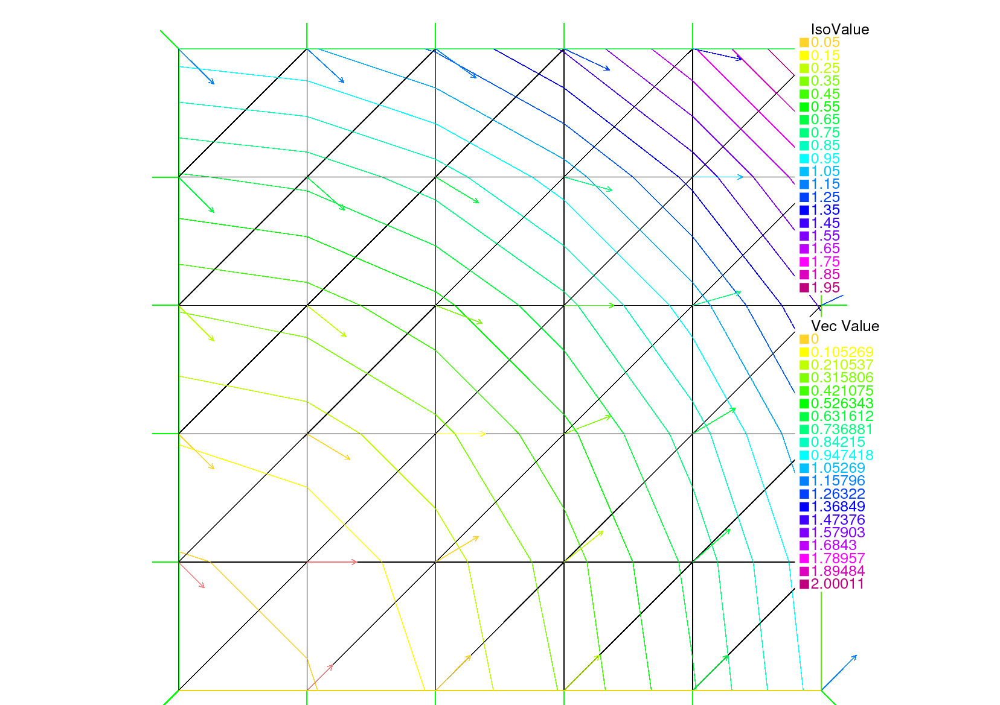

.. _exampleVisualization:

Visualization
=============

.. _examplePlot:

Plot
----

.. code-block:: freefem
   :linenos:

   mesh Th = square(5,5);
   fespace Vh(Th, P1);

   // Plot scalar and vectorial FE function
   Vh uh=x*x+y*y, vh=-y^2+x^2;
   plot(Th, uh, [uh, vh], value=true, wait=true);

   // Zoom on box defined by the two corner points [0.1,0.2] and [0.5,0.6]
   plot(uh, [uh, vh], bb=[[0.1, 0.2], [0.5, 0.6]],
       wait=true, grey=true, fill=true, value=true);

   // Compute a cut
   int n = 10;
   real[int] xx(10), yy(10);
   for (int i = 0; i < n; i++){
       x = i/real(n);
       y = i/real(n);
       xx[i] = i;
       yy[i] = uh; // Value of uh at point (i/10., i/10.)
   }
   plot([xx, yy], wait=true);

   { // File for gnuplot
       ofstream gnu("plot.gp");
       for (int i = 0; i < n; i++)
           gnu << xx[i] << " " << yy[i] << endl;
   }

   // Calls the gnuplot command, waits 5 seconds and generates a postscript plot (UNIX ONLY)
   exec("echo 'plot \"plot.gp\" w l \n pause 5 \n set term postscript \n set output \"gnuplot.eps\" \n replot \n quit' | gnuplot");

.. subfigstart::

   First plot

.. figure:: images/Plot2.jpg
   :alt: Plot2
   :width: 90%

   Second plot

.. figure:: images/Plot3.png
   :alt: Plot3
   :width: 90%

   Gnuplot

.. subfigend::
   :width: 0.49
   :alt: Plot
   :label: Plot

   Plot

.. _exampleHSV:

HSV
---

.. code-block:: freefem
   :linenos:

   // From: http://en.wikipedia.org/wiki/HSV_color_space
   // The HSV (Hue, Saturation, Value) model defines a color space
   // in terms of three constituent components:
   // HSV color space as a color wheel
   // Hue, the color type (such as red, blue, or yellow):
   // Ranges from 0-360 (but normalized to 0-100% in some applications like here)
   // Saturation, the "vibrancy" of the color: Ranges from 0-100%
   // The lower the saturation of a color, the more "grayness" is present
   // and the more faded the color will appear.
   // Value, the brightness of the color: Ranges from 0-100%

   mesh Th = square(10, 10, [2*x-1, 2*y-1]);

   fespace Vh(Th, P1);
   Vh uh=2-x*x-y*y;

   real[int] colorhsv=[ // Color hsv model
       4./6., 1 , 0.5, // Dark blue
       4./6., 1 , 1, // Blue
       5./6., 1 , 1, // Magenta
       1, 1. , 1, // Red
       1, 0.5 , 1 // Light red
       ];
    real[int] viso(31);

    for (int i = 0; i < viso.n; i++)
       viso[i] = i*0.1;

    plot(uh, viso=viso(0:viso.n-1), value=true, fill=true, wait=true, hsv=colorhsv);

.. figure:: images/HSV.jpg
   :width: 50%

   Result

.. _exampleMedit:

Medit
-----

.. code-block:: freefem
   :linenos:

   load "medit"

   mesh Th = square(10, 10, [2*x-1, 2*y-1]);

   fespace Vh(Th, P1);
   Vh u=2-x*x-y*y;

   medit("u", Th, u);

   // Old way
   savemesh(Th, "u", [x, y, u*.5]); // Saves u.points and u.faces file
   // build a u.bb file for medit
   {
       ofstream file("u.bb");
       file << "2 1 1 " << u[].n << " 2 \n";
       for (int j = 0; j < u[].n; j++)
           file << u[][j] << endl;
   }
   // Calls medit command
   exec("ffmedit u");
   // Cleans files on unix-like OS
   exec("rm u.bb u.faces u.points");

.. subfigstart::

.. figure:: images/Medit1.jpg
   :alt: Medit1
   :width: 90%

   2D plot

.. figure:: images/Medit2.jpg
   :alt: Medit2
   :width: 90%

   Plot with elevation

.. subfigend::
   :width: 0.49
   :alt: Medit
   :label: Medit

   Medit

.. _exampleParaview:

Paraview
--------

.. code-block:: freefem
   :linenos:

   load "iovtk"

   mesh Th = square(10, 10, [2*x-1, 2*y-1]);

   fespace Vh(Th, P1);
   Vh u=2-x*x-y*y;

   int[int] Order = [1];
   string DataName = "u";
   savevtk("u.vtu", Th, u, dataname=DataName, order=Order);

.. figure:: images/Paraview.jpg
   :width: 50%

   Result
