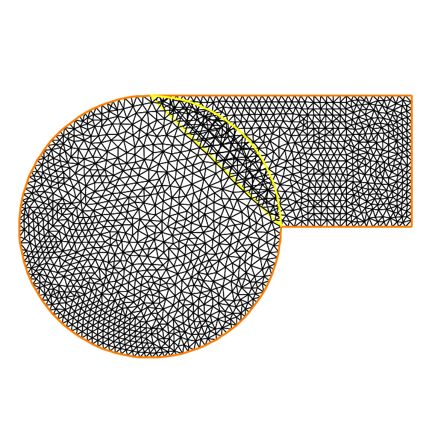

.. role:: freefem(code)
  :language: freefem

Domain decomposition
====================

We present three classic examples of domain decomposition technique: first, Schwarz algorithm with overlapping, second Schwarz algorithm without overlapping (also call Shur complement), and last we show to use the conjugate gradient to solve the boundary problem of the Shur complement.

.. _domainDecompositionSchwarzOverlapping:

Schwarz overlapping
-------------------

To solve:

.. math::
   -\Delta u =f,\;\mbox{in}\;\Omega=\Omega_1\cup\Omega_2\quad u|_\Gamma=0

the Schwarz algorithm runs like this:

.. math::
    \begin{array}{rcl}
        -\Delta u^{n+1}_1&=&f\;\mbox{in}\;\Omega_1\quad
        u^{n+1}_1|_{\Gamma_1}=u^n_2\\
        -\Delta u^{n+1}_2&=&f\;\mbox{in}\;\Omega_2\quad
        u^{n+1}_2|_{\Gamma_2}=u^n_1
    \end{array}

where :math:`\Gamma_i` is the boundary of :math:`\Omega_i` and on the condition that :math:`\Omega_1\cap\Omega_2\neq\emptyset` and that :math:`u_i` are zero at iteration 1.

Here we take :math:`\Omega_1` to be a quadrangle, :math:`\Omega_2` a disk and we apply the algorithm starting from zero.

   The 2 overlapping mesh :freefem:`TH` and :freefem:`th`

.. tip:: Schwarz overlapping

   .. code-block:: freefem
      :linenos:

      // Parameters
      int inside =2; //inside boundary
      int outside = 1; //outside boundary
      int n = 4;

      // Mesh
      border a(t=1, 2){x=t; y=0; label=outside;}
      border b(t=0, 1){x=2; y=t; label=outside;}
      border c(t=2, 0){x=t; y=1; label=outside;}
      border d(t=1, 0){x=1-t; y=t; label=inside;}
      border e(t=0, pi/2){x=cos(t); y=sin(t); label=inside;}
      border e1(t=pi/2, 2*pi){x=cos(t); y=sin(t); label=outside;}
      mesh th = buildmesh(a(5*n) + b(5*n) + c(10*n) + d(5*n));
      mesh TH = buildmesh(e(5*n) + e1(25*n));
      plot(th, TH, wait=true); //to see the 2 meshes

      // Fespace
      fespace vh(th, P1);
      vh u=0, v;

      fespace VH(TH, P1);
      VH U, V;

      // Problem
      int i = 0;
      problem PB (U, V, init=i, solver=Cholesky)
         = int2d(TH)(
               dx(U)*dx(V)
             + dy(U)*dy(V)
         )
         + int2d(TH)(
             - V
         )
         + on(inside, U=u)
         + on(outside, U=0)
         ;

      problem pb (u, v, init=i, solver=Cholesky)
         = int2d(th)(
               dx(u)*dx(v)
             + dy(u)*dy(v)
         )
         + int2d(th)(
             - v
         )
         + on(inside, u=U)
         + on(outside, u=0)
         ;

      // Calculation loop
      for (i = 0 ; i < 10; i++){
         // Solve
         PB;
         pb;

         // Plot
         plot(U, u, wait=true);
      }

   .. subfigstart::

   .. _figDomainDecomposition_Schwarz2:

   .. figure:: images/DomainDecomposition_Schwarz2.png
      :alt: DomainDecomposition_Schwarz2
      :width: 90%

      Isovalues of the solution at iteration 0

   .. _figDomainDecomposition_Schwarz3:

   .. figure:: images/DomainDecomposition_Schwarz3.png
      :alt: DomainDecomposition_Schwarz3
      :width: 90%

      Isovalues of the solution at iteration 0

   .. subfigend::
      :width: 0.49
      :alt: DomainDecomposition_Schwarz
      :label: DomainDecomposition_Schwarz

      Schwarz overlapping

Schwarz non overlapping Scheme
------------------------------

To solve:

.. math::
   -\Delta u =f\;\mbox{in}\;\Omega=\Omega_1\cup\Omega_2\quad u|_\Gamma=0

the Schwarz algorithm for domain decomposition without overlapping runs like this

.. figure:: images/DomainDecomposition_Schwarz4.png
   :alt: figDomain4
   :width: 50%

   The two none overlapping mesh :freefem:`TH` and :freefem:`th`

Let introduce :math:`\Gamma_i` is common the boundary of :math:`\Omega_1` and :math:`\Omega_2` and :math:`\Gamma_e^i= \partial \Omega_i \setminus \Gamma_i`.

The problem find :math:`\lambda` such that :math:`(u_1|_{\Gamma_i}=u_2|_{\Gamma_i})` where :math:`u_i` is solution of the following Laplace problem:

.. math::
   -\Delta u_i=f\;\mbox{in}\;\Omega_i\quad
   u_i|_{\Gamma_i}=\lambda \quad
   u_i|_{\Gamma_e^i} = 0

To solve this problem we just make a loop with upgrading :math:`\lambda` with

.. math::
   \lambda = \lambda {\pm} \frac{(u_1-u_2)}{2}

where the sign :math:`+` or :math:`-` of :math:`{\pm}` is choose to have convergence.

.. tip:: Schwarz non-overlapping

    .. code-block:: freefem
        :linenos:

        // Parameters
        int inside = 2; int outside = 1; int n = 4;

        // Mesh
        border a(t=1, 2){x=t; y=0; label=outside;};
        border b(t=0, 1){x=2; y=t; label=outside;};
        border c(t=2, 0){x=t; y=1; label=outside;};
        border d(t=1, 0){x=1-t; y=t; label=inside;};
        border e(t=0, 1){x=1-t; y=t; label=inside;};
        border e1(t=pi/2, 2*pi){x=cos(t); y=sin(t); label=outside;};
        mesh th = buildmesh(a(5*n) + b(5*n) + c(10*n) + d(5*n));
        mesh TH = buildmesh(e(5*n) + e1(25*n));
        plot(th, TH, wait=true);

        // Fespace
        fespace vh(th, P1);
        vh u=0, v;
        vh lambda=0;

        fespace VH(TH, P1);
        VH U, V;

        // Problem
        int i = 0;
        problem PB (U, V, init=i, solver=Cholesky)
            = int2d(TH)(
                  dx(U)*dx(V)
                + dy(U)*dy(V)
            )
            + int2d(TH)(
                - V
            )
            + int1d(TH, inside)(
                  lambda*V
            )
            + on(outside, U= 0 )
            ;

        problem pb (u, v, init=i, solver=Cholesky)
            = int2d(th)(
                  dx(u)*dx(v)
                + dy(u)*dy(v)
            )
            + int2d(th)(
                - v
            )
            + int1d(th, inside)(
                - lambda*v
            )
            + on(outside, u=0)
            ;

        for (i = 0; i < 10; i++){
            // Solve
            PB;
            pb;
            lambda = lambda - (u-U)/2;

            // Plot
            plot(U,u,wait=true);
        }

        // Plot
        plot(U, u);

    .. subfigstart::

    .. _figDomainDecomposition_Schwarz5:

    .. figure:: images/DomainDecomposition_Schwarz5.png
        :width: 90%
        :alt: DomainDecomposition_Schwarz5

        Isovalues of the solution at iteration 0 without overlapping

    .. _figDomainDecomposition_Schwarz6:

    .. figure:: images/DomainDecomposition_Schwarz6.png
        :width: 90%
        :alt: DomainDecomposition_Schwarz6

        Isovalues of the solution at iteration 9 without overlapping

    .. subfigend::
        :width: 0.49
        :alt: DomainDecomposition_Schwarz
        :label: DomainDecomposition_Schwarz

Schwarz conjuguate gradient
---------------------------

To solve :math:`-\Delta u =f \;\mbox{in}\;\Omega=\Omega_1\cup\Omega_2\quad u|_\Gamma=0` the Schwarz algorithm for domain decomposition without overlapping runs like this

Let introduce :math:`\Gamma_i` is common the boundary of :math:`\Omega_1` and :math:`\Omega_2` and :math:`\Gamma_e^i= \partial \Omega_i \setminus \Gamma_i`.

The problem find :math:`\lambda` such that :math:`(u_1|_{\Gamma_i}=u_2|_{\Gamma_i})` where :math:`u_i` is solution of the following Laplace problem:

.. math::
   -\Delta u_i=f\;\mbox{in}\;\Omega_i\quad
   u_i|_{\Gamma_i}=\lambda \quad
   u_i|_{\Gamma_e^i} = 0

The version of this example uses the Shur complement.
The problem on the border is solved by a conjugate gradient method.

.. tip:: Schwarz conjugate gradient

   First, we construct the two domains:

   .. code-block:: freefem
      :linenos:

      // Parameters
      int inside = 2; int outside = 1; int n = 4;

      // Mesh
      border Gamma1(t=1, 2){x=t; y=0; label=outside;}
      border Gamma2(t=0, 1){x=2; y=t; label=outside;}
      border Gamma3(t=2, 0){x=t; y=1; label=outside;}
      border GammaInside(t=1, 0){x=1-t; y=t; label=inside;}
      border GammaArc(t=pi/2, 2*pi){x=cos(t); y=sin(t); label=outside;}
      mesh Th1 = buildmesh(Gamma1(5*n) + Gamma2(5*n) + GammaInside(5*n) + Gamma3(5*n));
      mesh Th2 = buildmesh(GammaInside(-5*n) + GammaArc(25*n));
      plot(Th1, Th2);

   Now, define the finite element spaces:

   .. code-block:: freefem
      :linenos:

      // Fespace
      fespace Vh1(Th1, P1);
      Vh1 u1, v1;
      Vh1 lambda;
      Vh1 p=0;

      fespace Vh2(Th2,P1);
      Vh2 u2, v2;

   .. note:: It is impossible to define a function just on a part of boundary, so the :math:`\lambda` function must be defined on the all domain :math:`\Omega_1` such as:

      .. code-block:: freefem
       :linenos:

       Vh1 lambda;

   The two Poisson's problems:

   .. code-block:: freefem
      :linenos:

      problem Pb1 (u1, v1, init=i, solver=Cholesky)
          = int2d(Th1)(
                dx(u1)*dx(v1)
              + dy(u1)*dy(v1)
          )
          + int2d(Th1)(
              - v1
          )
          + int1d(Th1, inside)(
                lambda*v1
          )
          + on(outside, u1=0)
          ;

      problem Pb2 (u2, v2, init=i, solver=Cholesky)
          = int2d(Th2)(
                dx(u2)*dx(v2)
              + dy(u2)*dy(v2)
          )
          + int2d(Th2)(
              - v2
          )
          + int1d(Th2, inside)(
              - lambda*v2
          )
          + on(outside, u2=0)
          ;

   And, we define a border matrix, because the :math:`\lambda` function is none zero inside the domain :math:`\Omega_1`:

   .. code-block:: freefem
      :linenos:

      varf b(u2, v2, solver=CG) = int1d(Th1, inside)(u2*v2);
      matrix B = b(Vh1, Vh1, solver=CG);

   The boundary problem function,

   .. math::
      \lambda \longrightarrow \int_{\Gamma_i }(u_1-u_2) v_{1}

   .. code-block:: freefem
      :linenos:

      // Boundary problem function
      func real[int] BoundaryProblem (real[int] &l){
         lambda[] = l; //make FE function form l
         Pb1;
         Pb2;
         i++; //no refactorization i != 0
         v1 = -(u1-u2);
         lambda[] = B*v1[];
         return lambda[];
      }

   .. note:: The difference between the two notations :freefem:`v1` and :freefem:`v1[]` is: :freefem:`v1` is the finite element function and :freefem:`v1[]` is the vector in the canonical basis of the finite element function :freefem:`v1`.

   .. code-block:: freefem
      :linenos:

      // Solve
      real cpu=clock();
      LinearCG(BoundaryProblem, p[], eps=1.e-6, nbiter=100);
      //compute the final solution, because CG works with increment
      BoundaryProblem(p[]); //solve again to have right u1, u2

      // Display & Plot
      cout << " -- CPU time schwarz-gc:" << clock()-cpu << endl;
      plot(u1, u2);
