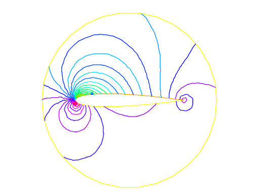

.. role:: freefem(code)
  :language: freefem

Static problems
===============

.. _modelStaticSoap:

Soap Film
---------

Our starting point here will be the mathematical model to find the shape of **soap film** which is glued to the ring on the :math:`xy-`\ plane:

.. math::
    C=\{(x,y);\;x=\cos t,\,y=\sin t,\,0\leq t\leq 2\pi \}

We assume the shape of the film is described by the graph :math:`(x,y,u(x,y))` of the vertical displacement :math:`u(x,y)\, (x^2+y^2<1)` under a vertical pressure :math:`p` in terms of force per unit area and an initial tension :math:`\mu` in terms of force per unit length.

Consider the "small plane" ABCD, A:\ :math:`(x,y,u(x,y))`, B:\ :math:`(x,y,u(x+\delta x,y))`, C:\ :math:`(x,y,u(x+\delta x,y+\delta y))` and D:\ :math:`(x,y,u(x,y+\delta y))`.

Denote by :math:`\vec{n}(x,y)=(n_x(x,y),n_y(x,y),n_z(x,y))` the normal vector of the surface :math:`z=u(x,y)`.
We see that the vertical force due to the tension :math:`\mu` acting along the edge AD is :math:`-\mu n_x(x,y)\delta y` and the the vertical force acting along the edge AD is:

.. math::
    \mu n_x(x+\delta x,y)\delta y\simeq \mu\left(n_x(x,y)+\frac{\p n_x}{\p x}\delta x\right)(x,y)\delta y

.. figure:: images/StaticProblems_SoapFilm.png
    :name: exampleStaticProblemsSoapFilm
    :width: 75%

Similarly, for the edges AB and DC we have:

.. math::
    -\mu n_y(x,y)\delta x,\quad\mu\left(n_y(x,y)+\p n_y/\p y\right)(x,y)\delta x

The force in the vertical direction on the surface ABCD due to the tension :math:`\mu` is given by:

.. math::
    \mu\left(\p n_x/\p x\right)\delta x\delta y+T\left(\p n_y/\p y\right)\delta y\delta x

Assuming small displacements, we have:

.. math::
    \begin{array}{rcccl}
        \nu_x&=&(\p u/\p x)/\sqrt{1+(\p u/\p x)^2+(\p u/\p y)^2}&\simeq& \p u/\p x,\\
        \nu_y&=&(\p u/\p y)/\sqrt{1+(\p u/\p x)^2+(\p u/\p y)^2}&\simeq& \p u/\p y
    \end{array}

Letting :math:`\delta x\to dx,\, \delta y\to dy`, we have the equilibrium of the vertical displacement of soap film on ABCD by :math:`p`:

.. math::
    \mu dx dy\p^2 u/\p x^2 +\mu dx dy\p^2 u/\p y^2 + p dx dy = 0

Using the Laplace operator :math:`\Delta = \p^2 /\p x^2 + \p^2 /\p y^2`, we can find the virtual displacement write the following:

.. math::
    -\Delta u = f\quad \mbox{in }\Omega

where :math:`f=p/\mu`, :math:`\Omega =\{(x,y);\;x^{2}+y^{2}<1\}`.

:ref:`Poisson’s equation <tutorialPoisson>` appears also in **electrostatics** taking the form of :math:`f=\rho / \epsilon` where :math:`\rho` is the charge density, :math:`\epsilon` the dielectric constant and :math:`u` is named as electrostatic potential.

The soap film is glued to the ring :math:`\p \Omega =C`, then we have the boundary condition:

.. math::
    u=0\quad \mbox{on }\p \Omega

If the force is gravity, for simplify, we assume that :math:`f=-1`.

.. code-block:: freefem
    :linenos:

    // Parameters
    int nn = 50;
    func f = -1;
    func ue = (x^2+y^2-1)/4; //ue: exact solution

    // Mesh
    border a(t=0, 2*pi){x=cos(t); y=sin(t); label=1;}
    mesh disk = buildmesh(a(nn));
    plot(disk);

    // Fespace
    fespace femp1(disk, P1);
    femp1 u, v;

    // Problem
    problem laplace (u, v)
        = int2d(disk)( //bilinear form
            dx(u)*dx(v)
            + dy(u)*dy(v)
        )
        - int2d(disk)( //linear form
            f*v
        )
        + on(1, u=0) //boundary condition
        ;

    // Solve
    laplace;

    // Plot
    plot (u, value=true, wait=true);

    // Error
    femp1 err = u - ue;
    plot(err, value=true, wait=true);

    cout << "error L2 = " << sqrt( int2d(disk)(err^2) )<< endl;
    cout << "error H10 = " << sqrt( int2d(disk)((dx(u)-x/2)^2) + int2d(disk)((dy(u)-y/2)^2) )<< endl;

    /// Re-run with a mesh adaptation ///

    // Mesh adaptation
    disk = adaptmesh(disk, u, err=0.01);
    plot(disk, wait=true);

    // Solve
    laplace;
    plot (u, value=true, wait=true);

    // Error
    err = u - ue; //become FE-function on adapted mesh
    plot(err, value=true, wait=true);

    cout << "error L2 = " << sqrt( int2d(disk)(err^2) )<< endl;
    cout << "error H10 = " << sqrt( int2d(disk)((dx(u)-x/2)^2) + int2d(disk)((dy(u)-y/2)^2) )<< endl;

.. figure:: images/StaticProblems_SoapFilmSol.png
    :width: 50%
    :name: exampleStaticProblemsSoapFilmSol

    Isovalue of :math:`u`

.. figure:: images/StaticProblems_SoapFilm3D.png
    :width: 100%
    :name: exampleStaticProblemsSoapFilm3D

    A side view of :math:`u`

In the 37th line, the :math:`L^2`-error estimation between the exact solution :math:`u_e`,

.. math::
    \|u_h - u_e\|_{0,\Omega}=\left(\int_{\Omega}|u_h-u_e|^2\, \d x\d y\right)^{1/2}

and in the following line, the :math:`H^1`-error seminorm estimation:

.. math::
    |u_h - u_e|_{1,\Omega}=\left(\int_{\Omega}|\nabla u_h-\nabla u_e|^2\, \d x\d y\right)^{1/2}

are done on the initial mesh.
The results are :math:`\|u_h - u_e\|_{0,\Omega}=0.000384045,\, |u_h - u_e|_{1,\Omega}=0.0375506`.

After the adaptation, we have :math:`\|u_h - u_e\|_{0,\Omega}=0.000109043,\, |u_h - u_e|_{1,\Omega}=0.0188411`.
So the numerical solution is improved by adaptation of mesh.

Electrostatics
--------------

We assume that there is no current and a time independent charge distribution.
Then the electric field :math:`\mathbf{E}` satisfies:

.. math::
    \begin{array}{rcl}
        \mathrm{div}\mathbf{E} &=& \rho/\epsilon\\
        \mathrm{curl}\mathbf{E} &=& 0
    \end{array}
    :label: eqn::Maxwell

where :math:`\rho` is the charge density and :math:`\epsilon` is called the permittivity of free space.

From the equation :eq:`eqn::Maxwell` We can introduce the electrostatic potential such that :math:`\mathbf{E}=-\nabla \phi`.
Then we have Poisson’s equation :math:`-\Delta \phi=f`, :math:`f=-\rho/\epsilon`.

We now obtain the equipotential line which is the level curve of :math:`\phi`, when there are no charges except conductors :math:`\{C_i\}_{1,\cdots,K}`.
Let us assume :math:`K` conductors :math:`C_1,\cdots,C_K` within an enclosure :math:`C_0`.

Each one is held at an electrostatic potential :math:`\varphi_i`.
We assume that the enclosure :math:`C0` is held at potential 0.
In order to know :math:`\varphi(x)` at any point :math:`x` of the domain :math:`\Omega`, we must solve:

.. math::
    -\Delta \varphi =0\quad \textrm{ in }\Omega

where :math:`\Omega` is the interior of :math:`C_0` minus the conductors :math:`C_i`, and :math:`\Gamma` is the boundary of :math:`\Omega`, that is :math:`\sum_{i=0}^N C_i`.

Here :math:`g` is any function of :math:`x` equal to :math:`\varphi_i` on :math:`C_i` and to 0 on :math:`C_0`.
The boundary equation is a reduced form for:

.. math::
    \varphi =\varphi_{i}\;\text{on }C_{i},\;i=1...N,\varphi =0\;\text{on }C_{0}.

First we give the geometrical informations; :math:`C_0=\{(x,y);\; x^2+y^2=5^2\}`, :math:`C_1=\{(x,y):\;\frac{1}{0.3^2}(x-2)^2+\frac{1}{3^2}y^2=1\}`, :math:`C_2=\{(x,y):\; \frac{1}{0.3^2}(x+2)^2+\frac{1}{3^2}y^2=1\}`.

Let :math:`\Omega` be the disk enclosed by :math:`C_0` with the elliptical holes enclosed by :math:`C_1` and :math:`C_2`.
Note that :math:`C_0` is described counterclockwise, whereas the elliptical holes are described clockwise, because the boundary must be oriented so that the computational domain is to its left.

.. code-block:: freefem
    :linenos:

    // Mesh
    border C0(t=0, 2*pi){x=5*cos(t); y=5*sin(t);}
    border C1(t=0, 2*pi){x=2+0.3*cos(t); y=3*sin(t);}
    border C2(t=0, 2*pi){x=-2+0.3*cos(t); y=3*sin(t);}

    mesh Th = buildmesh(C0(60) + C1(-50) + C2(-50));
    plot(Th);

    // Fespace
    fespace Vh(Th, P1);
    Vh uh, vh;

    // Problem
    problem Electro (uh, vh)
        = int2d(Th)( //bilinear
            dx(uh)*dx(vh)
            + dy(uh)*dy(vh)
        )
        + on(C0, uh=0) //boundary condition on C_0
        + on(C1, uh=1) //+1 volt on C_1
        + on(C2, uh=-1) //-1 volt on C_2
        ;

    // Solve
    Electro;
    plot(uh);

.. subfigstart::

.. _figDiskWithHoles:

.. figure:: images/StaticProblems_ElectrostaticsMesh.png
    :width: 90%
    :name: exampleStaticProblemsElectrostaticsMesh

    Disk with two elliptical holes

.. _figDiskWithLines:

.. figure:: images/StaticProblems_Electrostatics.png
    :width: 90%
    :name: exampleStaticProblemsElectrostatics

    Equipotential lines where :math:`C_1` is located in right hand side

.. subfigend::
    :width: 0.49
    :alt: DiskWithHoles
    :label: DiskWithHoles

Aerodynamics
------------

Let us consider a wing profile :math:`S` in a uniform flow.
Infinity will be represented by a large circle :math:`\Gamma_{\infty}`.
As previously, we must solve:

.. math::
    \Delta \varphi=0\quad\textrm{in }\Omega,
    \quad \varphi|_S=c,\quad
    \varphi|_{\Gamma_{\infty}}=u_{\infty 1x}-u_{\infty2x}
    :label: eqn:NACA-5-5

where :math:`\Omega` is the area occupied by the fluid, :math:`u_{\infty}` is the air speed at infinity, :math:`c` is a constant to be determined so that :math:`\p_n\varphi` is continuous at the trailing edge :math:`P` of :math:`S` (so-called Kutta-Joukowski condition).
Lift is proportional to :math:`c`.

To find :math:`c` we use a superposition method.
As all equations in :eq:`eqn:NACA-5-5` are linear, the solution :math:`\varphi_c` is a linear function of :math:`c`

.. math::
    \varphi_c = \varphi_0 + c\varphi_1

where :math:`\varphi_0` is a solution of :eq:`eqn:NACA-5-5` with :math:`c = 0` and :math:`\varphi_1` is a solution with :math:`c = 1` and zero speed at infinity.

With these two fields computed, we shall determine :math:`c` by requiring the continuity of :math:`\p \varphi /\p n` at the trailing edge.
An equation for the upper surface of a NACA0012 (this is a classical wing profile in aerodynamics; the rear of the wing is called the trailing edge) is:

.. math::
    y = 0.17735\sqrt{x} - 0.075597x - 0.212836x^2 + 0.17363x^3 - 0.06254x^4

Taking an incidence angle :math:`\alpha` such that :math:`\tan \alpha = 0.1`, we must solve:

.. math::
    -\Delta\varphi = 0\qquad \textrm{in }\Omega, \quad \varphi|_{\Gamma_1} = y - 0.1x,\quad \varphi |_{\Gamma_2} = c

where :math:`\Gamma_2` is the wing profile and :math:`\Gamma_1` is an approximation of infinity.
One finds :math:`c` by solving:

.. math::
    \begin{array}{ccccccc}
        -\Delta\varphi_0 &= 0 &\textrm{in }\Omega&,\qquad \varphi_0|_{\Gamma_1} &= y - 0.1x&, \quad \varphi_0|_{\Gamma_2} &= 0,\\
        -\Delta\varphi_1 &= 0 &\textrm{in }\Omega&, \qquad \varphi_1|_{\Gamma_1} &= 0&, \quad \varphi_1|_{\Gamma_2} &= 1
    \end{array}

The solution :math:`\varphi = \varphi_0+c\varphi_1` allows us to find :math:`c` by writing that :math:`\p_n\varphi` has no jump at the trailing edge :math:`P = (1, 0)`.

We have :math:`\p n\varphi -(\varphi (P^+)-\varphi (P))/\delta` where :math:`P^+` is the point just above :math:`P` in the direction normal to the profile at a distance :math:`\delta`.
Thus the jump of :math:`\p_n\varphi` is :math:`(\varphi_0|_{P^+} +c(\varphi_1|_{P^+} -1))+(\varphi_0|_{P^-} +c(\varphi_1|_{P^-} -1))` divided by :math:`\delta` because the normal changes sign between the lower and upper surfaces. Thus

.. math::
    c = -\frac{\varphi_0|_{P^+} + \varphi_0|_{P^-}}
    {(\varphi_1|_{P^+} + \varphi_1|_{P^-} - 2)} ,

which can be programmed as:

.. math::
    c = -\frac{\varphi_0(0.99, 0.01) + \varphi_0(0.99,-0.01)}
    {(\varphi_1(0.99, 0.01) + \varphi_1(0.99,-0.01) - 2)} .

.. code-block:: freefem
    :linenos:

    // Mesh
    border a(t=0, 2*pi){x=5*cos(t); y=5*sin(t);}
    border upper(t=0, 1) {
        x=t;
        y=0.17735*sqrt(t)-0.075597*t - 0.212836*(t^2) + 0.17363*(t^3) - 0.06254*(t^4);
    }
    border lower(t=1, 0) {
        x=t;
        y=-(0.17735*sqrt(t) - 0.075597*t - 0.212836*(t^2) + 0.17363*(t^3) - 0.06254*(t^4));
    }
    border c(t=0, 2*pi){x=0.8*cos(t)+0.5; y=0.8*sin(t);}

    mesh Zoom = buildmesh(c(30) + upper(35) + lower(35));
    mesh Th = buildmesh(a(30) + upper(35) + lower(35));

    // Fespace
    fespace Vh(Th, P2);
    Vh psi0, psi1, vh;

    fespace ZVh(Zoom, P2);

    // Problem
    solve Joukowski0(psi0, vh)
        = int2d(Th)(
            dx(psi0)*dx(vh)
            + dy(psi0)*dy(vh)
        )
        + on(a, psi0=y-0.1*x)
        + on(upper, lower, psi0=0)
        ;

    plot(psi0);

    solve Joukowski1(psi1,vh)
        = int2d(Th)(
            dx(psi1)*dx(vh)
            + dy(psi1)*dy(vh)
        )
        + on(a, psi1=0)
        + on(upper, lower, psi1=1);

    plot(psi1);

    //continuity of pressure at trailing edge
    real beta = psi0(0.99,0.01) + psi0(0.99,-0.01);
    beta = -beta / (psi1(0.99,0.01) + psi1(0.99,-0.01)-2);

    Vh psi = beta*psi1 + psi0;
    plot(psi);

    ZVh Zpsi = psi;
    plot(Zpsi, bw=true);

    ZVh cp = -dx(psi)^2 - dy(psi)^2;
    plot(cp);

    ZVh Zcp = cp;
    plot(Zcp, nbiso=40);

.. subfigstart::

.. _figIsovalueOfCp:

.. figure:: images/StaticProblems_Aerodynamics1.png
    :width: 90%
    :name: exampleStaticProblemsAerodynamics1

    Isovalue of :math:`cp = -(\p_x\psi)^2 - (\p_y\psi)^2`

.. _figZoomingOfCp:

    Zooming of :math:`cp`

.. subfigend::
    :width: 0.49
    :alt: IsovalueOfCp
    :label: IsovalueOfCp

Error estimation
----------------

There are famous estimation between the numerical result :math:`u_h` and the exact solution :math:`u` of the :ref:`Poisson’s problem <tutorialPoisson>`:

If triangulations :math:`\{\mathcal{T}_h\}_{h\downarrow 0}` is regular (see :ref:`Regular Triangulation <meshRegularTriangulation>`), then we have the estimates:

.. math::
    \begin{array}{rcl}
        |\nabla u - \nabla u_h|_{0,\Omega} &\le& C_1h \\
        \|u - u_h\|_{0,\Omega} &\le& C_2h^2
    \end{array}
    :label: eqn::ErrorEstimatation

with constants :math:`C_1,\, C_2` independent of :math:`h`, if :math:`u` is in :math:`H^2(\Omega)`.
It is known that :math:`u\in H^2(\Omega)` if :math:`\Omega` is convex.

In this section we check :eq:`eqn::ErrorEstimatation`.
We will pick up numericall error if we use the numerical derivative, so we will use the following for :eq:`eqn::ErrorEstimatation`.

.. math::
    \begin{array}{rcl}
        \int_{\Omega}|\nabla u - \nabla u_h|^2\, \d x\d y &=&\int_{\Omega}\nabla u\cdot \nabla(u - 2u_h)\, \d x\d y+ \int_{\Omega}\nabla u_h\cdot \nabla u_h\, \d x\d y\\
        &=&\int_{\Omega}f(u-2u_h)\, \d x\d y+\int_{\Omega}fu_h\, \d x\d y
    \end{array}

The constants :math:`C_1,\, C_2` are depend on :math:`\mathcal{T}_h` and :math:`f`, so we will find them by **FreeFEM**.

In general, we cannot get the solution :math:`u` as a elementary functions even if spetical functions are added.
Instead of the exact solution, here we use the approximate solution :math:`u_0` in :math:`V_h(\mathcal{T}_h,P_2),\, h\sim 0`.

.. code-block:: freefem
    :linenos:

    // Parameters
    func f = x*y;

    //Mesh
    mesh Th0 = square(100, 100);

    // Fespace
    fespace V0h(Th0, P2);
    V0h u0, v0;

    // Problem
    solve Poisson0 (u0, v0)
        = int2d(Th0)(
            dx(u0)*dx(v0)
            + dy(u0)*dy(v0)
        )
        - int2d(Th0)(
            f*v0
        )
        + on(1, 2, 3, 4, u0=0)
        ;
    plot(u0);

    // Error loop
    real[int] errL2(10), errH1(10);
    for (int i = 1; i <= 10; i++){
        // Mesh
        mesh Th = square(5+i*3,5+i*3);

        // Fespace
        fespace Vh(Th, P1);
        Vh u, v;
        fespace Ph(Th, P0);
        Ph h = hTriangle; //get the size of all triangles

        // Problem
        solve Poisson (u, v)
            = int2d(Th)(
                dx(u)*dx(v)
                + dy(u)*dy(v)
            )
            - int2d(Th)(
                f*v
            )
            + on(1, 2, 3, 4, u=0)
            ;

        // Error
        V0h uu = u; //interpolate solution on first mesh
        errL2[i-1] = sqrt( int2d(Th0)((uu - u0)^2) )/h[].max^2;
        errH1[i-1] = sqrt( int2d(Th0)(f*(u0 - 2*uu + uu)) )/h[].max;
    }

    // Display
    cout << "C1 = " << errL2.max << "("<<errL2.min<<")" << endl;
    cout << "C2 = " << errH1.max << "("<<errH1.min<<")" << endl;

We can guess that :math:`C_1=0.0179253(0.0173266)` and :math:`C_2=0.0729566(0.0707543)`, where the numbers inside the parentheses are minimum in calculation.

Periodic Boundary Conditions
----------------------------

We now solve the Poisson equation:

.. math::
    -\Delta u = sin(x+\pi/4.)*cos(y+\pi/4.)

on the square :math:`]0,2\pi[^2` under bi-periodic boundary condition :math:`u(0,y)=u(2\pi,y)` for all :math:`y` and :math:`u(x,0)=u(x,2\pi)` for all :math:`x`.

These boundary conditions are achieved from the definition of the periodic finite element space.

.. code-block:: freefem
    :linenos:

    // Parameters
    func f = sin(x+pi/4.)*cos(y+pi/4.); //right hand side

    // Mesh
    mesh Th = square(10, 10, [2*x*pi, 2*y*pi]);

    // Fespace
    //defined the fespace with periodic condition
    //label: 2 and 4 are left and right side with y the curve abscissa
    //       1 and 2 are bottom and upper side with x the curve abscissa
    fespace Vh(Th, P2, periodic=[[2, y], [4, y], [1, x], [3, x]]);
    Vh uh, vh;

    // Problem
    problem laplace (uh, vh)
        = int2d(Th)(
            dx(uh)*dx(vh)
            + dy(uh)*dy(vh)
        )
        + int2d(Th)(
            - f*vh
        )
        ;

    // Solve
    laplace;

    // Plot
    plot(uh, value=true);

.. figure:: images/StaticProblems_PeriodicBoundaryConditions.png
    :name: exampleStaticProblemsPeriodicBoundaryConditions
    :width: 50%

    The isovalue of solution :math:`u` with periodic boundary condition

The periodic condition does not necessarily require parallel boundaries.
The following example give such example.

.. tip:: Periodic boundary conditions - non-parallel boundaries

    .. code-block:: freefem
        :linenos:

        // Parameters
        int n = 10;
        real r = 0.25;
        real r2 = 1.732;
        func f = (y+x+1)*(y+x-1)*(y-x+1)*(y-x-1);

        // Mesh
        border a(t=0, 1){x=-t+1; y=t; label=1;};
        border b(t=0, 1){x=-t; y=1-t; label=2;};
        border c(t=0, 1){x=t-1; y=-t; label=3;};
        border d(t=0, 1){x=t; y=-1+t; label=4;};
        border e(t=0, 2*pi){x=r*cos(t); y=-r*sin(t); label=0;};
        mesh Th = buildmesh(a(n) + b(n) + c(n) + d(n) + e(n));
        plot(Th, wait=true);

        // Fespace
        //warning for periodic condition:
        //side a and c
        //on side a (label 1) $ x \in [0,1] $ or $ x-y\in [-1,1] $
        //on side c (label 3) $ x \in [-1,0]$ or $ x-y\in[-1,1] $
        //so the common abscissa can be respectively $x$ and $x+1$
        //or you can can try curviline abscissa $x-y$ and $x-y$
        //1 first way
        //fespace Vh(Th, P2, periodic=[[2, 1+x], [4, x], [1, x], [3, 1+x]]);
        //2 second way
        fespace Vh(Th, P2, periodic=[[2, x+y], [4, x+y], [1, x-y], [3, x-y]]);
        Vh uh, vh;

        // Problem
        real intf = int2d(Th)(f);
        real mTh = int2d(Th)(1);
        real k =  intf / mTh;
        problem laplace (uh, vh)
            = int2d(Th)(
                dx(uh)*dx(vh)
                + dy(uh)*dy(vh)
            )
            + int2d(Th)(
                (k-f)*vh
            )
            ;

        // Solve
        laplace;

        // Plot
        plot(uh, wait=true);

    .. figure:: images/StaticProblems_PeriodicBoundaryConditions2.png
        :name: exampleStaticProblemsPeriodicBoundaryConditions2
        :width: 50%

        The isovalue of solution :math:`u` for :math:`\Delta u = ((y+x)^{2}+1)((y-x)^{2}+1) - k`, in :math:`\Omega` and :math:`\p_{n} u =0` on hole, and with two periodic boundary condition on external border

An other example with no equal border, just to see if the code works.

.. tip:: Periodic boundary conditions - non-equal border

    .. code-block:: freefem
        :linenos:

        // Macro
        //irregular boundary condition to build border AB
        macro LINEBORDER(A, B, lab)
            border A#B(t=0,1){ real t1=1.-t;
            x=A#x*t1+B#x*t;
            y=A#y*t1+B#y*t;
            label=lab; } //EOM
        // compute \||AB|\| A=(ax,ay) et B =(bx,by)
        macro dist(ax, ay, bx, by)
            sqrt(square((ax)-(bx)) + square((ay)-(by))) //EOM
        macro Grad(u) [dx(u), dy(u)] //EOM

        // Parameters
        int n = 10;
        real Ax = 0.9, Ay = 1;
        real Bx = 2, By = 1;
        real Cx = 2.5, Cy = 2.5;
        real Dx = 1, Dy = 2;
        real gx = (Ax+Bx+Cx+Dx)/4.;
        real gy = (Ay+By+Cy+Dy)/4.;

        // Mesh
        LINEBORDER(A,B,1)
        LINEBORDER(B,C,2)
        LINEBORDER(C,D,3)
        LINEBORDER(D,A,4)
        mesh Th=buildmesh(AB(n)+BC(n)+CD(n)+DA(n),fixedborder=1);

        // Fespace
        real l1 = dist(Ax,Ay,Bx,By);
        real l2 = dist(Bx,By,Cx,Cy);
        real l3 = dist(Cx,Cy,Dx,Dy);
        real l4 = dist(Dx,Dy,Ax,Ay);
        func s1 = dist(Ax,Ay,x,y)/l1; //absisse on AB = ||AX||/||AB||
        func s2 = dist(Bx,By,x,y)/l2; //absisse on BC = ||BX||/||BC||
        func s3 = dist(Cx,Cy,x,y)/l3; //absisse on CD = ||CX||/||CD||
        func s4 = dist(Dx,Dy,x,y)/l4; //absisse on DA = ||DX||/||DA||
        verbosity = 6; //to see the abscisse value of the periodic condition
        fespace Vh(Th, P1, periodic=[[1, s1], [3, s3], [2, s2], [4, s4]]);
        verbosity = 1; //reset verbosity
        Vh u, v;

        real cc = 0;
        cc = int2d(Th)((x-gx)*(y-gy)-cc)/Th.area;
        cout << "compatibility = " << int2d(Th)((x-gx)*(y-gy)-cc) <<endl;

        // Problem
        solve Poisson (u, v)
            = int2d(Th)(
                Grad(u)'*Grad(v)
                + 1e-10*u*v
            )
            -int2d(Th)(
                10*v*((x-gx)*(y-gy)-cc)
            )
            ;

        // Plot
        plot(u, value=true);

.. tip:: Periodic boundry conditions - Poisson cube-balloon

    .. code-block:: freefem
        :linenos:

        load "msh3" load "tetgen" load "medit"

        // Parameters
        real hs = 0.1; //mesh size on sphere
        int[int] N = [20, 20, 20];
        real [int,int] B = [[-1, 1], [-1, 1], [-1, 1]];
        int [int,int] L = [[1, 2], [3, 4], [5, 6]];

        real x0 = 0.3, y0 = 0.4, z0 = 06;
        func f = sin(x*2*pi+x0)*sin(y*2*pi+y0)*sin(z*2*pi+z0);

        // Mesh
        bool buildTh = 0;
        mesh3 Th;
        try { //a way to build one time the mesh or read it if the file exist
            Th = readmesh3("Th-hex-sph.mesh");
        }
        catch (...){
            buildTh = 1;
        }

        if (buildTh){
            include "MeshSurface.idp"

            // Surface Mesh
            mesh3 ThH = SurfaceHex(N, B, L, 1);
            mesh3 ThS = Sphere(0.5, hs, 7, 1);

            mesh3 ThHS = ThH + ThS;

            real voltet = (hs^3)/6.;
            real[int] domain = [0, 0, 0, 1, voltet, 0, 0, 0.7, 2, voltet];
            Th = tetg(ThHS, switch="pqaAAYYQ", nbofregions=2, regionlist=domain);

            savemesh(Th, "Th-hex-sph.mesh");
        }

        // Fespace
        fespace Ph(Th, P0);
        Ph reg = region;
        cout << " centre = " << reg(0,0,0) << endl;
        cout << " exterieur = " << reg(0,0,0.7) << endl;

        verbosity = 50;
        fespace Vh(Th, P1, periodic=[[3, x, z], [4, x, z], [1, y, z], [2, y, z], [5, x, y], [6, x, y]]);
        verbosity = 1;
        Vh uh,vh;

        // Macro
        macro Grad(u) [dx(u),dy(u),dz(u)] // EOM

        // Problem
        problem Poisson (uh, vh)
            = int3d(Th, 1)(
                Grad(uh)'*Grad(vh)*100
            )
            + int3d(Th, 2)(
                Grad(uh)'*Grad(vh)*2
            )
            + int3d(Th)(
                vh*f
            )
            ;

        // Solve
        Poisson;

        // Plot
        plot(uh, wait=true, nbiso=6);
        medit("uh", Th, uh);

    .. subfigstart::

    .. _figCubeBalloon:

    .. figure:: images/StaticProblems_PeriodicBoundaryConditionsPoisson1.png
        :width: 90%
        :name: exampleStaticProblemsPeriodicBoundaryConditionsPoisson1

        View of the surface isovalue of periodic solution :math:`uh`

    .. figCutSolution:

    .. figure:: images/StaticProblems_PeriodicBoundaryConditionsPoisson2.png
        :width: 90%
        :name: exampleStaticProblemsPeriodicBoundaryConditionsPoisson2

        View a the cut of the solution :math:`uh` with ffmedit

    .. subfigend::
        :width: 0.49
        :alt: CubeBalloon
        :label: CubeBalloon

.. _modelStaticPoissonWithMixedBoundaryCondition:

Poisson Problems with mixed boundary condition
----------------------------------------------

Here we consider the Poisson equation with mixed boundary conditions:

For given functions :math:`f` and :math:`g`, find :math:`u` such that:

.. math::
    \begin{array}{rcll}
        -\Delta u &=& f & \textrm{ in }\Omega\\
        u &=& g &\textrm{ on }\Gamma_D\\
        \p u/\p n &=& 0 &\textrm{ on }\Gamma_N
    \end{array}

where :math:`\Gamma_D` is a part of the boundary :math:`\Gamma` and :math:`\Gamma_N=\Gamma\setminus \overline{\Gamma_D}`.

The solution :math:`u` has the singularity at the points :math:`\{\gamma_1,\gamma_2\}=\overline{\Gamma_D}\cap\overline{\Gamma_N}`.

When :math:`\Omega=\{(x,y);\; -1<x<1,\, 0<y<1\}`, :math:`\Gamma_N=\{(x,y);\; -1\le x<0,\, y=0\}`, :math:`\Gamma_D=\p \Omega\setminus \Gamma_N`, the singularity will appear at :math:`\gamma_1=(0,0),\, \gamma_2(-1,0)`, and :math:`u` has the expression:

.. math::
    u=K_iu_S + u_R,\, u_R\in H^2(\textrm{near }\gamma_i),\, i=1,2

with a constants :math:`K_i`.

Here :math:`u_S = r_j^{1/2}\sin(\theta_j/2)` by the local polar coordinate :math:`(r_j,\theta_j` at :math:`\gamma_j` such that :math:`(r_1,\theta_1)=(r,\theta)`.

Instead of polar coordinate system :math:`(r,\theta)`, we use that :math:`r` = :freefem:`sqrt` (:math:`x^2+y^2`) and :math:`\theta` = :freefem:`atan2` (:math:`y,x`) in **FreeFEM**.

Assume that :math:`f=-2\times 30(x^2+y^2)` and :math:`g=u_e=10(x^2+y^2)^{1/4}\sin\left([\tan^{-1}(y/x)]/2\right)+30(x^2y^2)`, where :math:`u_e`\ S is the exact solution.

.. code-block:: freefem
    :linenos:

    // Parameters
    func f = -2*30*(x^2+y^2); //given function
    //the singular term of the solution is K*us (K: constant)
    func us = sin(atan2(y,x)/2)*sqrt( sqrt(x^2+y^2) );
    real K = 10.;
    func ue = K*us + 30*(x^2*y^2);

    // Mesh
    border N(t=0, 1){x=-1+t; y=0; label=1;};
    border D1(t=0, 1){x=t; y=0; label=2;};
    border D2(t=0, 1){x=1; y=t; label=2;};
    border D3(t=0, 2){x=1-t; y=1; label=2;};
    border D4(t=0, 1){x=-1; y=1-t; label=2;};

    mesh T0h = buildmesh(N(10) + D1(10) + D2(10) + D3(20) + D4(10));
    plot(T0h, wait=true);

    // Fespace
    fespace V0h(T0h, P1);
    V0h u0, v0;

    //Problem
    solve Poisson0 (u0, v0)
        = int2d(T0h)(
            dx(u0)*dx(v0)
            + dy(u0)*dy(v0)
        )
        - int2d(T0h)(
            f*v0
        )
        + on(2, u0=ue)
        ;

    // Mesh adaptation by the singular term
    mesh Th = adaptmesh(T0h, us);
    for (int i = 0; i < 5; i++)
    mesh Th = adaptmesh(Th, us);

    // Fespace
    fespace Vh(Th, P1);
    Vh u, v;

    // Problem
    solve Poisson (u, v)
        = int2d(Th)(
            dx(u)*dx(v)
            + dy(u)*dy(v)
        )
        - int2d(Th)(
            f*v
        )
        + on(2, u=ue)
        ;

    // Plot
    plot(Th);
    plot(u, wait=true);

    // Error in H1 norm
    Vh uue = ue;
    real H1e = sqrt( int2d(Th)(dx(uue)^2 + dy(uue)^2 + uue^2) );
    Vh err0 = u0 - ue;
    Vh err = u - ue;
    Vh H1err0 = int2d(Th)(dx(err0)^2 + dy(err0)^2 + err0^2);
    Vh H1err = int2d(Th)(dx(err)^2 + dy(err)^2 + err^2);
    cout << "Relative error in first mesh = "<< int2d(Th)(H1err0)/H1e << endl;
    cout << "Relative error in adaptive mesh = "<< int2d(Th)(H1err)/H1e << endl;

From line 35 to 37, mesh adaptations are done using the base of singular term.

In line 61, :freefem:`H1e` = :math:`|u_e|_{1,\Omega}` is calculated.

In lines 64 and 65, the relative errors are calculated, that is:

.. math::
    \begin{array}{rcl}
        \|u^0_h-u_e\|_{1,\Omega}/H1e&=&0.120421\\
        \|u^a_h-u_e\|_{1,\Omega}/H1e&=&0.0150581
    \end{array}

where :math:`u^0_h` is the numerical solution in :freefem:`T0h` and :math:`u^a_h` is :freefem:`u` in this program.

Poisson with mixed finite element
---------------------------------

Here we consider the Poisson equation with mixed boundary value problems:

For given functions :math:`f` , :math:`g_d`, :math:`g_n`, find :math:`p` such that

.. math::
    \begin{array}{rcll}
        -\Delta p &=& 1 & \textrm{ in }\Omega\\
        p &=& g_d & \textrm{ on }\Gamma_D\\
        \p p/\p n &=& g_n & \textrm{ on }\Gamma_N
    \end{array}

where :math:`\Gamma_D` is a part of the boundary :math:`\Gamma` and :math:`\Gamma_N=\Gamma\setminus \overline{\Gamma_D}`.

The mixed formulation is: find :math:`p` and :math:`\mathbf{u}` such that:

.. math::
    \begin{array}{rcll}
        \nabla p + \mathbf{u} &=& \mathbf{0} & \textrm{ in }\Omega\\
        \nabla. \mathbf{u} &=& f & \textrm{ in }\Omega\\
        p &=& g_d & \textrm{ on }\Gamma_D\\
        \p u. n &=& \mathbf{g}_n.n & \textrm{ on }\Gamma_N
    \end{array}

where :math:`\mathbf{g}_n` is a vector such that :math:`\mathbf{g}_n.n = g_n`.

The variational formulation is:

.. math::
    \begin{array}{rcl}
        \forall \mathbf{v} \in \mathbb{V}_0: & \int_\Omega p \nabla.v + \mathbf{v} \mathbf{v} &= \int_{\Gamma_d} g_d \mathbf{v}.n\\
        \forall {q} \in \mathbb{P}: & \int_\Omega q \nabla.u &= \int_\Omega q f\nonumber\\
        & \p u. n &= \mathbf{g}_n.n \quad \textrm{on }\Gamma_N
    \end{array}

where the functional space are:

.. math::
    \mathbb{P}= L^2(\Omega),
    \qquad\mathbb{V}= H(div)=\{\mathbf{v}\in L^2(\Omega)^2,\nabla.\mathbf{v}\in L^2(\Omega)\}

and:

.. math::
    \mathbb{V}_0 = \{\mathbf{v}\in \mathbb{V};\quad\mathbf{v}. n = 0 \quad\mathrm{on }\;\;\Gamma_N\}

To write the **FreeFEM** example, we have just to choose the finites elements spaces.

Here :math:`\mathbb{V}` space is discretize with Raviart-Thomas finite element :freefem:`RT0` and :math:`\mathbb{P}` is discretize by constant finite element :freefem:`P0`.

**Example 9.10** LaplaceRT.edp

.. code-block:: freefem
    :linenos:

    // Parameters
    func gd = 1.;
    func g1n = 1.;
    func g2n = 1.;

    // Mesh
    mesh Th = square(10, 10);

    // Fespace
    fespace Vh(Th, RT0);
    Vh [u1, u2];
    Vh [v1, v2];

    fespace Ph(Th, P0);
    Ph p, q;

    // Problem
    problem laplaceMixte ([u1, u2, p], [v1, v2, q], solver=GMRES, eps=1.0e-10, tgv=1e30, dimKrylov=150)
        = int2d(Th)(
            p*q*1e-15 //this term is here to be sure
            // that all sub matrix are inversible (LU requirement)
            + u1*v1
            + u2*v2
            + p*(dx(v1)+dy(v2))
            + (dx(u1)+dy(u2))*q
        )
        + int2d(Th) (
            q
        )
        - int1d(Th, 1, 2, 3)(
            gd*(v1*N.x +v2*N.y)
        )
        + on(4, u1=g1n, u2=g2n)
        ;

    // Solve
    laplaceMixte;

    // Plot
    plot([u1, u2], coef=0.1, wait=true, value=true);
    plot(p, fill=1, wait=true, value=true);

Metric Adaptation and residual error indicator
----------------------------------------------

We do metric mesh adaption and compute the classical residual error indicator :math:`\eta_{T}` on the element :math:`T` for the Poisson problem.

First, we solve the same problem as in a previous example.

.. code-block:: freefem
    :linenos:

    // Parameters
    real[int] viso(21);
    for (int i = 0; i < viso.n; i++)
    viso[i] = 10.^(+(i-16.)/2.);
    real error = 0.01;
    func f = (x-y);

    // Mesh
    border ba(t=0, 1.0){x=t; y=0; label=1;}
    border bb(t=0, 0.5){x=1; y=t; label=2;}
    border bc(t=0, 0.5){x=1-t; y=0.5; label=3;}
    border bd(t=0.5, 1){x=0.5; y=t; label=4;}
    border be(t=0.5, 1){x=1-t; y=1; label=5;}
    border bf(t=0.0, 1){x=0; y=1-t; label=6;}
    mesh Th = buildmesh(ba(6) + bb(4) + bc(4) + bd(4) + be(4) + bf(6));

    // Fespace
    fespace Vh(Th, P2);
    Vh u, v;

    fespace Nh(Th, P0);
    Nh rho;

    // Problem
    problem Probem1 (u, v, solver=CG, eps=1.0e-6)
        = int2d(Th, qforder=5)(
            u*v*1.0e-10
            + dx(u)*dx(v)
            + dy(u)*dy(v)
        )
        + int2d(Th, qforder=5)(
            - f*v
        )
        ;

Now, the local error indicator :math:`\eta_{T}` is:

.. math::
   \eta_{T} =\left( h_{T}^{2} || f + \Delta u_{{h}} ||_{L^{2}(T)}^{2} +\sum_{e\in \mathcal{E}_{K}} h_{e} \,||\, [ \frac{\p u_{h}}{\p n_{k}}] \,||^{2}_{L^{2}(e)} \right)^{\frac{1}{2}}

where :math:`h_{T}` is the longest edge of :math:`T`, :math:`{\cal E}_T` is the set of :math:`T` edge not on :math:`\Gamma=\p \Omega`, :math:`n_{T}` is the outside unit normal to :math:`K`, :math:`h_{e}` is the length of edge :math:`e`, :math:`[ g ]` is the jump of the function :math:`g` across edge (left value minus right value).

Of course, we can use a variational form to compute :math:`\eta_{T}^{2}`, with test function constant function in each triangle.

.. code-block:: freefem
    :linenos:

    // Error
    varf indicator2 (uu, chiK)
        = intalledges(Th)(
            chiK*lenEdge*square(jump(N.x*dx(u) + N.y*dy(u)))
        )
        + int2d(Th)(
            chiK*square(hTriangle*(f + dxx(u) + dyy(u)))
        )
        ;

    // Mesh adaptation loop
    for (int i = 0; i < 4; i++){
        // Solve
        Probem1;
        cout << u[].min << " " << u[].max << endl;
        plot(u, wait=true);

        // Error
        rho[] = indicator2(0, Nh);
        rho = sqrt(rho);
        cout << "rho = min " << rho[].min << " max=" << rho[].max << endl;
        plot(rho, fill=true, wait=true, cmm="indicator density", value=true, viso=viso, nbiso=viso.n);

        // Mesh adaptation
        plot(Th, wait=true, cmm="Mesh (before adaptation)");
        Th = adaptmesh(Th, [dx(u), dy(u)], err=error, anisomax=1);
        plot(Th, wait=true, cmm="Mesh (after adaptation)");
        u = u;
        rho = rho;
        error = error/2;
    }

If the method is correct, we expect to look the graphics by an almost constant function :math:`\eta` on your computer as in :numref:`exampleStaticProblemsMetricAdaptation` and :numref:`exampleStaticProblemsMetricAdaptation2`.

.. subfigstart::

.. figDensityError:

.. figure:: images/StaticProblems_MetricAdaptation.png
    :width: 50%
    :name: exampleStaticProblemsMetricAdaptation

    Density of the error indicator with isotropic :math:`P_{2}` metric

.. figDensityError2:

.. figure:: images/StaticProblems_MetricAdaptation2.png
    :width: 50%
    :name: exampleStaticProblemsMetricAdaptation2

    Density of the error indicator with isotropic :math:`P_{2}` metric

.. subfigend::
   :width: 0.49
   :alt: DensityError
   :label: DensityError

.. _modelStaticProblemAdaptationUsingResidualErrorIndicator:

Adaptation using residual error indicator
-----------------------------------------

In the previous example we compute the error indicator, now we use it, to adapt the mesh.
The new mesh size is given by the following formulae:

.. math::
   h_{n+1}(x) = \frac{h_{n}(x)}{f_{n}(\eta_K(x))}

where :math:`\eta_n(x)` is the level of error at point :math:`x` given by the local error indicator, :math:`h_n` is the previous "mesh size" field, and :math:`f_n` is a user function define by :math:`f_n = min(3,max(1/3,\eta_n / \eta_n^* ))` where :math:`\eta_n^* = mean(\eta_n) c`, and :math:`c` is an user coefficient generally close to one.

First a macro :freefem:`MeshSizecomputation` is defined to get a :math:`P_1` mesh size as the average of edge length.

.. code-block:: freefem
    :linenos:

    // macro the get the current mesh size parameter
    // in:
    // Th the mesh
    // Vh P1 fespace on Th
    // out :
    // h: the Vh finite element finite set to the current mesh size
    macro MeshSizecomputation (Th, Vh, h)
    {
        real[int] count(Th.nv);
        /*mesh size (lenEdge = integral(e) 1 ds)*/
        varf vmeshsizen (u, v) = intalledges(Th, qfnbpE=1)(v);
        /*number of edges per vertex*/
        varf vedgecount (u, v) = intalledges(Th, qfnbpE=1)(v/lenEdge);
        /*mesh size*/
        count = vedgecount(0, Vh);
        h[] = 0.;
        h[] = vmeshsizen(0, Vh);
        cout << "count min = " << count.min << " max = " << count.max << endl;
        h[] = h[]./count;
        cout << "-- bound meshsize = " << h[].min << " " << h[].max << endl;
    } //

A second macro to re-mesh according to the new mesh size.

.. code-block:: freefem
    :linenos:

    // macro to remesh according the de residual indicator
    // in:
    // Th the mesh
    // Ph P0 fespace on Th
    // Vh P1 fespace on Th
    // vindicator the varf to evaluate the indicator
    // coef on etameam
    macro ReMeshIndicator (Th, Ph, Vh, vindicator, coef)
    {
        Vh h=0;
        /*evaluate the mesh size*/
        MeshSizecomputation(Th, Vh, h);
        Ph etak;
        etak[] = vindicator(0, Ph);
        etak[] = sqrt(etak[]);
        real etastar= coef*(etak[].sum/etak[].n);
        cout << "etastar = " << etastar << " sum = " << etak[].sum << " " << endl;

        /*etaK is discontinous*/
        /*we use P1 L2 projection with mass lumping*/
        Vh fn, sigma;
        varf veta(unused, v) = int2d(Th)(etak*v);
        varf vun(unused, v) = int2d(Th)(1*v);
        fn[] = veta(0, Vh);
        sigma[] = vun(0, Vh);
        fn[] = fn[]./ sigma[];
        fn = max(min(fn/etastar,3.),0.3333);

        /*new mesh size*/
        h = h / fn;
        /*build the mesh*/
        Th = adaptmesh(Th, IsMetric=1, h, splitpbedge=1, nbvx=10000);
    } //

.. code-block:: freefem
    :linenos:

    // Parameters
    real hinit = 0.2; //initial mesh size
    func f=(x-y);

    // Mesh
    border ba(t=0, 1.0){x=t; y=0; label=1;}
    border bb(t=0, 0.5){x=1; y=t; label=2;}
    border bc(t=0, 0.5){x=1-t; y=0.5; label=3;}
    border bd(t=0.5, 1){x=0.5; y=t; label=4;}
    border be(t=0.5, 1){x=1-t; y=1; label=5;}
    border bf(t=0.0, 1){x=0; y=1-t; label=6;}
    mesh Th = buildmesh(ba(6) + bb(4) + bc(4) + bd(4) + be(4) + bf(6));

    // Fespace
    fespace Vh(Th, P1); //for the mesh size and solution
    Vh h = hinit; //the FE function for the mesh size
    Vh u, v;

    fespace Ph(Th, P0); //for the error indicator

    //Build a mesh with the given mesh size hinit
    Th = adaptmesh(Th, h, IsMetric=1, splitpbedge=1, nbvx=10000);
    plot(Th, wait=1);

    // Problem
    problem Poisson (u, v)
        = int2d(Th, qforder=5)(
            u*v*1.0e-10
            + dx(u)*dx(v)
            + dy(u)*dy(v)
        )
        - int2d(Th, qforder=5)(
            f*v
        )
        ;

    varf indicator2 (unused, chiK)
        = intalledges(Th)(
            chiK*lenEdge*square(jump(N.x*dx(u) + N.y*dy(u)))
        )
        + int2d(Th)(
            chiK*square(hTriangle*(f + dxx(u) + dyy(u)))
        )
        ;

    // Mesh adaptation loop
    for (int i = 0; i < 10; i++){
        u = u;

        // Solve
        Poisson;
        plot(Th, u, wait=true);

        real cc = 0.8;
        if (i > 5) cc=1;
        ReMeshIndicator(Th, Ph, Vh, indicator2, cc);
        plot(Th, wait=true);
    }

.. subfigstart::

.. figErrorIndicator:

.. figure:: images/StaticProblems_AdaptationResidualError.png
    :width: 90%
    :name: exampleStaticProblemsAdaptationResidualError

    The error indicator with isotropic :math:`P_{1}`

.. figSolutionMeshAndIsovalue:

.. figure:: images/StaticProblems_AdaptationResidualError2.png
    :width: 90%
    :name: exampleStaticProblemsAdaptationResidualError2

    The mesh and isovalue of the solution

.. subfigend::
   :width: 0.49
   :alt: ErrorIndicator
   :label: ErrorIndicator
