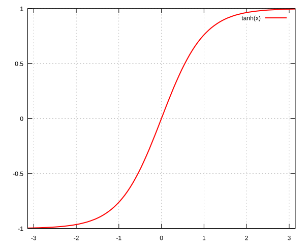

.. role:: freefem(code)
  :language: freefem

.. role:: cpp(code)
   :language: cpp

Functions
=========

abs
---

Return the absolute value.

.. code-block:: freefem
   :linenos:

   real a = abs(b);

Parameters:

-  ``b`` (:freefem:`int`, :freefem:`real`, :freefem:`complex`, :freefem:`fespace` function, :freefem:`real[int]` or :freefem:`real[int, int]`)

Output:

-  ``a`` (:freefem:`int`, :freefem:`real`, :freefem:`real[int]` or :freefem:`real[int, int]`)

acos
----

:math:`\arccos` function.

.. code-block:: freefem
   :linenos:

   real theta = acos(x);

Parameter:

-  ``x`` (:freefem:`real`, :freefem:`real[int]` or :freefem:`real[int, int]`)

Output:

-  ``theta`` (:freefem:`real`, :freefem:`real[int]` or :freefem:`real[int, int]`)

.. figure:: images/arccos.png
   :alt: arccos function
   :width: 50%

   arccos function

acosh
-----

.. :math:`\DeclareMathOperator\arccosh{arccosh}` :math:`\arccosh` function.

.. code-block:: freefem
   :linenos:

   real theta = acosh(x);

.. math::

   \arccosh(x) = \ln\left(x + \sqrt{x^2-1}\right)

Parameter:

-  ``x`` (:freefem:`real`)

Output:

-  ``theta`` (:freefem:`real`)

.. figure:: images/arccosh.png
   :alt: arccosh function
   :width: 50%

   arccosh function

.. _referenceAdaptMesh:

adaptmesh
---------

Mesh adaptation function.

.. code-block:: freefem
   :linenos:

   mesh Thnew = adaptmesh(Th, [fx, fy], hmin=HMin, hmax=HMax, err=Err, errg=ErrG, nbvx=NbVx, nbsmooth=NbSmooth, nbjacoby=NbJacoby, ratio=Ratio, omega=Omega, iso=Iso, abserror=AbsError, cutoff=CutOff, verbosity=Verbosity, inquire=Inquire, splitpbedge=SplitPbEdge, maxsubdiv=MaxSubdiv, rescaling=Rescaling, keepbackvertices=KeepBackVertices, IsMetric=isMetric, power=Power, thetamax=ThetaMax, splitin2=SplitIn2, metric=Metric, nomeshgeneration=NoMeshGeneration, periodic=Periodic);

Parameters:

-  ``Th`` (:freefem:`mesh`) Mesh to refine
-  ``[fx, fy]`` (:freefem:`func` or :freefem:`fespace` function), scalar or vectorial Function to follow for the mesh adaptation
-  :freefem:`hmin=` (:freefem:`real`) Minimum edge size
-  :freefem:`hmax=` (:freefem:`real`) Maximum edge size
-  :freefem:`err=` (:freefem:`real`) Error level (P1 interpolation)
-  :freefem:`errg=` (:freefem:`real`) Relative geometrical error
-  :freefem:`nbvx=` (:freefem:`int`) Maximum number of vertices
-  :freefem:`nbsmooth=` (:freefem:`int`) Number of smoothing iterations
-  :freefem:`nbjacoby=` (:freefem:`int`) Number of iterations for the smoothing procedure
-  :freefem:`ratio=` (:freefem:`real`) Ratio of the triangles
-  :freefem:`omega=` (:freefem:`real`) Relaxation parameter for the smoothing procedure
-  :freefem:`iso=` (:freefem:`bool`) Isotropic adaptation (if true)
-  :freefem:`abserror=` (:freefem:`bool`) Error (if true) - Relative error (if false)
-  :freefem:`cutoff=` (:freefem:`real`) Lower limit of the relative error evaluation
-  :freefem:`verbosity=` (:freefem:`real`) Verbosity level
-  :freefem:`inquire=` (:freefem:`bool`) If true, inquire graphically
-  :freefem:`splitpbedge=` (:freefem:`bool`) If true, split all internal edges in half
-  :freefem:`maxsubdiv=` (:freefem:`int`) Bound the maximum subdivisions
-  :freefem:`rescaling=` (:freefem:`bool`) Rescale the function in [0, 1]
-  :freefem:`keepbackvertices=` (:freefem:`bool`) If true, try to keep vertices of the original mesh
-  :freefem:`IsMetric=` (:freefem:`bool`) If true, the metric is defined explicitly
-  :freefem:`power=` (:freefem:`int`) Exponent of the Hessian
-  :freefem:`thetamax=` (:freefem:`int`) Minimum corner angle (in degree)
-  :freefem:`splitin2=` (:freefem:`bool`) Split all triangles into 4 sub-triangles if true
-  :freefem:`metric=` (:freefem:`[real[int], real[int], real[int]]`) Array of 3 real arrays defining the metric
-  :freefem:`nomeshgeneration=` (:freefem:`bool`) If true, the mesh is not generated
-  :freefem:`periodic=` (:freefem:`real[int, int]`) Build an adapted periodic mesh

Output:

-  ``Thnew`` (:freefem:`mesh` or :freefem:`mesh3`)

adj
---

Adjacent triangle of the triangle :math:`k` by the edge :math:`e`

.. code-block:: freefem
   :linenos:

   int T = Th[k].adj(e);

Parameter:

-  ``e`` (:freefem:`int`) Edge number

Output:

-  ``T`` (:freefem:`int`) Triangle number

.. _functionAffineCG:

AffineCG
--------

Affine conjugate gradient solver

Used to solve a problem like :math:`Ax=b`

.. code-block:: freefem
   :linenos:

   int Conv = AffineCG(A, x, precon=Precon, nbiter=NbIter, eps=Eps, veps=VEps, stop=Stop);

Parameters:

-  ``A`` (:freefem:`matrix`) Matrix of the problem :math:`Ax=b`
-  ``x`` (:freefem:`real[int]`) Solution vector
-  :freefem:`precon=` (:freefem:`real[int]`) Preconditionning function
-  :freefem:`nbiter=` (:freefem:`int`) Maximum number of iterations
-  :freefem:`eps=` (:freefem:`real`)

   Convergence criterion

   If :math:`\varepsilon>0`: test :math:`||A(x)||_p \leq \epsilon||A(x_0)||_p`

   If :math:`\varepsilon<0`: test :math:`||A(x)||_p^2 \leq |\epsilon|`
-  :freefem:`veps=` (:freefem:`real`) Same as ``eps``, but return ``-eps``
-  :freefem:`stop=` (:freefem:`func`) Convergence criterion as a function

   Prototype is :freefem:`func bool StopFunc (int Iter, real[int] U, real[int] g)`

   ``u``: current solution, ``g``: current gradient (not preconditionned)

Output:

-  Conv (int) 0: converged - !0: not converged

AffineGMRES
-----------

Affine GMRES solver

Parameters and output are the same as :ref:`AffineCG <functionAffineCG>`

arg
---

Return the argument of a complex number.

.. code-block:: freefem
   :linenos:

   real a = arg(c);

Parameters:

-  ``c`` (:freefem:`complex`)

Output:

-  ``r`` (:freefem:`real`)

asin
----

:math:`\arcsin` function.

.. code-block:: freefem
   :linenos:

   real theta = asin(x);

Parameter:

-  ``x`` (:freefem:`real`, :freefem:`real[int]` or :freefem:`real[int, int]`)

Output:

-  ``theta`` (:freefem:`real`, :freefem:`real[int]` or :freefem:`real[int, int]`)

.. figure:: images/arcsin.png
   :alt: arcsin function
   :width: 50%

   arcsin function

asinh
-----

.. :math:`\DeclareMathOperator\arcsinh{arcsinh}` :math:`\arcsinh` function.

.. code-block:: freefem
   :linenos:

   real theta = asinh(x);

.. math::

   \arcsinh(x) = \ln\left(x + \sqrt{x^2+1}\right)

Parameter:

-  ``x`` (:freefem:`real`)

Output:

-  ``theta`` (:freefem:`real`)

.. figure:: images/arcsinh.png
   :alt: arcsinh function
   :width: 50%

   arcsinh function

assert
------

Verify if a condition is true (same as C), if not the program stops.

.. code-block:: freefem
   :linenos:

   assert(x==0)

Parameter:

-  Boolean condition

Output:

-  None

atan
----

:math:`\arctan` function.

.. code-block:: freefem
   :linenos:

   real theta = atan(x);

Parameter:

-  ``x`` (:freefem:`real`)

Output:

-  ``theta`` (:freefem:`real`)

.. figure:: images/arctan.png
   :alt: arctan function
   :width: 50%

   arctan function

atan2
-----

:math:`\displaystyle{\arctan\left(\frac{y}{x}\right)}` function, returning the correct sign for :math:`\theta`.

.. code-block:: freefem
   :linenos:

   real theta = atan2(y, x)

Parameter:

-  ``x`` (:freefem:`real`)

Output:

-  ``theta`` (:freefem:`real`)

atanh
-----

.. :math:`\DeclareMathOperator\arctanh{arctanh}` :math:`\arctanh` function.

.. code-block:: freefem
   :linenos:

   real theta = atanh(x);

Parameter:

-  ``x`` (:freefem:`real`)

Output:

-  ``theta`` (:freefem:`real`)

.. figure:: images/arctanh.png
   :alt: arctanh function
   :width: 50%

   arctanh function

atoi
----

Convert a string to an interger.

.. code-block:: freefem
   :linenos:

   int a = atoi(s);

Parameter:

-  ``s`` (:freefem:`string`)

Output:

-  ``a`` (:freefem:`int`)

atof
----

Convert a string to a real.

.. code-block:: freefem
   :linenos:

   real a = atof(s);

Parameter:

-  ``s`` (:freefem:`string`)

Output:

-  ``a`` (:freefem:`real`)

BFGS
----

.. todo:: todo

.. _referenceBuildMesh:

buildmesh
---------

Build a 2D mesh using border elements.

.. code-block:: freefem
   :linenos:

   mesh Th = buildmesh(b1(nn) + b2(nn) + b3(nn) + b4(nn), [nbvx=Nbvx], [fixedborder=FixedBorder]);

Parameters:

-  ``b1``, ``b2``, ``b3``, ``b4`` (:freefem:`border`)

   Geometry border, ``b1(nn)`` means ``b1`` border discretized by ``nn`` vertices
-  :freefem:`nbvx=` (:freefem:`int`) *[Optional]*

   Maximum number of vertices Default: 9000
-  :freefem:`fixedborder=` (:freefem:`bool`) *[Optional]*

   If true, mesh generator cannot change the boundary mesh

   Default: :freefem:`false`

Output:

-  ``Th`` (:freefem:`mesh`) Resulting mesh

ceil
----

Round fractions up of :math:`x`.

.. code-block:: freefem
   :linenos:

   int c = ceil(x);

Parameter:

-  ``x`` (:freefem:`real`)

Output:

-  ``c`` (:freefem:`int`)

change
------

Change a property of a mesh.

.. code-block:: freefem
   :linenos:

   int[int] L = [0, 1];
   Thnew = change(Th, label=L);

Parameters:

-  ``Th`` (:freefem:`mesh`) Original mesh

-  :freefem:`label=` L (:freefem:`int[int]`) Pair of old and new label
-  :freefem:`region=` R (:freefem:`int[int]`) Pair of old and new region
-  :freefem:`flabel=` l (:freefem:`func int`) Function of int given the new label
-  :freefem:`fregion=` r (:freefem:`func int`) Function of int given the new region

Output:

-  :freefem:`Thnew` (:freefem:`mesh`) Mesh with changed
   parameters

chi
---

Characteristic function of a mesh.

.. code-block:: freefem
   :linenos:

   int IsInMesh = chi(Th)(x, y);

Parameters:

-  ``Th`` (:freefem:`mesh` or :freefem:`mesh3`)
-  ``x`` (:freefem:`real`) Position :math:`x`
-  ``y`` (:freefem:`real`) Position :math:`y`

Output:

-  ``IsInMesh`` (:freefem:`int`) 1 if :math:`(x,y)\in` ``Th``\  0 if
   :math:`(x,y)\not\in` ``Th``

checkmovemesh
-------------

Check a :ref:`movemesh <functionMovemesh>` without mesh generation.

.. code-block:: freefem
   :linenos:

   real minT = checkmovemesh(Th, [Dx, Dy]);

Parameters:

Same as :ref:`movemesh <functionMovemesh>`

Output:

-  ``minT`` (:freefem:`real`) Minimum triangle area

clock
-----

Get the clock in second.

.. code-block:: freefem
   :linenos:

   real t = clock();

Parameter:

-  None

Output:

-  ``t`` (:freefem:`real`) Current CPU time

complexEigenValue
-----------------

Same as :ref:`EigenValue <functionEigenValue>` for complex problems.

conj
----

Caculate the conjuguate of a complex number.

.. code-block:: freefem
   :linenos:

   complex C1 = 1 + 1i;
   complex C2 = conj(C1);

Parameter:

-  ``C1`` (:freefem:`complex`) Complex number

Output:

-  ``C2`` (:freefem:`complex`) Conjuguate of C1

convect
-------

Characteristics Galerkin method.

.. code-block:: freefem
   :linenos:

   real cgm = convect([Ux, Uy], dt, c);
   real cgm = convect([Ux, Uy, Uz], dt, c);

Compute :math:`c\circ \mathbf{X}` with :math:`\mathbf{X}(\mathbf{x}) = \mathbf{x}_{\tau}` and :math:`\mathbf{x}_{\tau}` is the solution of:

.. math::
    \begin{array}{rcl}
        \dot{\mathbf{x}}_{\tau} &=& \mathbf{u}(\mathbf{x}_{\tau})\\
        \mathbf{x}_{\tau} &=& \mathbf{x}
    \end{array}

Parameters:

-  ``ux`` (:freefem:`fespace` function) Velocity: :math:`x` component
-  ``uy`` (:freefem:`fespace` function) Velocity: :math:`y` component
-  ``uz`` (:freefem:`fespace` function) **3D only**

   Velocity: :math:`z` component
-  ``dt`` (:freefem:`real`) Time step
-  ``c`` (:freefem:`fespace` function) Function to convect

Output:

-  ``cgm`` (:freefem:`real`) Result

copysign
--------

C++ :cpp:`copysign` function.

.. code-block:: freefem
   :linenos:

   real s = copysign(a, b);

cos
---

:math:`\cos` function.

.. code-block:: freefem
   :linenos:

   real x = cos(theta);

Parameters:

-  ``theta`` (:freefem:`real` or :freefem:`complex`)

Output:

-  ``x`` (:freefem:`real` or :freefem:`complex`)

.. figure:: images/cos.png
   :alt: cos function
   :width: 50%

   cos function

cosh
----

:math:`\cosh` function.

.. code-block:: freefem
   :linenos:

   real x = cosh(theta);

.. math::

   \cosh(x) = \frac{e^x + e^{-x}}{2}

Parameters:

-  ``theta`` (:freefem:`real`)

Output:

-  ``x`` (:freefem:`real`)

diffnp
------

Arithmetic useful function.

.. code-block:: freefem
   :linenos:

   diffnp(a, b) = (a<0)&(0<b) ? (b-a) : 0;

diffpos
-------

Arithmetic useful function.

.. code-block:: freefem
   :linenos:

   diffpos(a, b) = max(b-a, 0);

dist
----

Arithmetic useful function.

.. code-block:: freefem
   :linenos:

   dist(a, b) = sqrt(a^2 + b^2);
   dist(a, b, c) = sqrt(a^2 + b^2 + c^2);

dumptable
---------

Show all types, operators and functions in **FreeFEM**.

.. code-block:: freefem
   :linenos:

   dumptable(out);

Parameters:

-  ``out`` (:cpp:`ostream`) :freefem:`cout` of :freefem:`ofstream` file.

Output:

-  None

dx
--

:math:`x` derivative.

.. code-block:: freefem
   :linenos:

   Uh up = dx(u);

.. math::

   \frac{\partial u}{\partial x}

Parameters:

-  ``u`` (:freefem:`fespace` function)

Output:

-  ``up`` (:freefem:`fespace` function)

dxx
---

:math:`x` double derivative.

.. code-block:: freefem
   :linenos:

   Uh upp = dxx(u);

.. math::

   \frac{\partial^2 u}{\partial x^2}

Parameters:

-  ``u`` (:freefem:`fespace` function)

Output:

-  ``upp`` (:freefem:`fespace` function)

dxy
---

:math:`xy` derivative.

.. code-block:: freefem
   :linenos:

   Uh upp = dxy(u);

.. math::

   \frac{\partial^2 u}{\partial x\partial y}

Parameters:

-  ``u`` (:freefem:`fespace` function)

Output:

-  ``upp`` (:freefem:`fespace` function)

dxz
---

:math:`xz` derivative.

.. code-block:: freefem
   :linenos:

   Uh upp = dxz(u);

.. math::

   \frac{\partial^2 u}{\partial x\partial z}

Parameters:

-  ``u`` (:freefem:`fespace` function)

Output:

-  ``upp`` (:freefem:`fespace` function)

dy
--

:math:`y` derivative.

.. code-block:: freefem
   :linenos:

   Uh up = dy(u);

.. math::

   \frac{\partial u}{\partial y}

Parameters:

-  ``u`` (:freefem:`fespace` function)

Output:

-  ``upp`` (:freefem:`fespace` function)

dyx
---

:math:`yx` derivative.

.. code-block:: freefem
   :linenos:

   Uh upp = dyx(u);

.. math::

   \frac{\partial^2 u}{\partial y\partial x}

Parameters:

-  ``u`` (:freefem:`fespace` function)

Output:

-  ``upp`` (:freefem:`fespace` function)

dyy
---

:math:`y` double derivative.

.. code-block:: freefem
   :linenos:

   Uh upp = dyy(u);

.. math::

   \frac{\partial^2 u}{\partial x^2}

Parameters:

-  ``u`` (:freefem:`fespace` function)

Output:

-  ``upp`` (:freefem:`fespace` function)

dyz
---

:math:`yz` derivative.

.. code-block:: freefem
   :linenos:

   Uh upp = dyz(u);

.. math::

   \frac{\partial^2 u}{\partial y\partial z}

Parameters:

-  ``u`` (:freefem:`fespace` function)

Output:

-  ``upp`` (:freefem:`fespace` function)

dz
--

:math:`z` derivative.

.. code-block:: freefem
   :linenos:

   Uh up = dz(u);

.. math::

   \frac{\partial u}{\partial z}

Parameters:

-  ``u`` (:freefem:`fespace` function)

Output:

-  ``upp`` (:freefem:`fespace` function)

dzx
---

:math:`zx` derivative.

.. code-block:: freefem
   :linenos:

   Uh upp = dzx(u);

.. math::

   \frac{\partial^2 u}{\partial z\partial x}

Parameters:

-  ``u`` (:freefem:`fespace` function)

Output:

-  ``upp`` (:freefem:`fespace` function)

dzy
---

:math:`zy` derivative.

.. code-block:: freefem
   :linenos:

   Uh upp = dzy(u);

.. math::

   \frac{\partial^2 u}{\partial z\partial y}

Parameters:

-  ``u`` (:freefem:`fespace` function)

Output:

-  ``upp`` (:freefem:`fespace` function)

dzz
---

:math:`z` double derivative.

.. code-block:: freefem
   :linenos:

   Uh upp = dzz(u);

.. math::

   \frac{\partial^2 u}{\partial z^2}

Parameters:

-  ``u`` (:freefem:`fespace` function)

Output:

-  ``upp`` (:freefem:`fespace` function)

.. _functionEigenValue:

EigenValue
----------

Compute the generalized eigenvalue of :math:`Au=\lambda Bu`.
The shifted-inverse method is used by default with :freefem:`sigma=`\ :math:`\sigma`, the shift of the method.
The function :freefem:`EigenValue` can be used for either matrices or functions returning a matrix vector product.
The use of the matrix version is shown below.

.. code-block:: freefem
   :linenos:

   int k = EigenValue(A,B,nev= , sigma= );

Parameters:

-  :freefem:`A`, :freefem:`B`: matrices of same size
-  :freefem:`nev=n`: number of desired eigenvalues given by an integer ``n``
-  :freefem:`sym=`: the problem is symmetric or not
-  :freefem:`tol=`: the relative accuracy to which eigenvalues are to be determined
-  :freefem:`value=`: an array to store the real part of the eigenvalues
-  :freefem:`ivalue=`: an array to store the imaginary part of the eigenvalues
-  :freefem:`vector=`: a Finite Element function array to store the eigenvectors
-  :freefem:`sigma=`: the shift value
-  Other parameters are available for more advanced use: see the ARPACK documentation.

Output: The output is the number of converged eigenvalues, which can be different than the number of requested eigenvalues given by :freefem:`nev=`.
Note that the eigenvalues and the eigenvectors are stored for further purposes using the parameters :freefem:`value=` and :freefem:`vector=`.

emptymesh
---------

Build an empty mesh.

Useful to handle Lagrange multipliers in mixed and Mortar methods.

.. code-block:: freefem
   :linenos:

   mesh eTh = emptymesh(Th, ssd);

Parameters:

-  ``Th`` (:freefem:`mesh`) Mesh to empty
-  ``ssd`` (:freefem:`int[int]`) Pseudo subregion label

Output:

-  ``eTh`` (:freefem:`mesh`) Empty mesh

.. _functionErf:

erf
---

The error function:

.. math::

   erf(x) = \frac{2}{\sqrt{pi}}\int_{0}^{x}{\exp(-t^2)dt}

.. code-block:: freefem
   :linenos:

   real err = erf(x);

Parameters:

-  ``x`` (:freefem:`real`)

Output:

-  ``err`` (:freefem:`real`)

erfc
----

Complementary of the :ref:`error function <functionErf>`:

.. math::

   erfc(x) = 1-erf(x)

.. code-block:: freefem
   :linenos:

   real errc = erfc(x);

Parameters:

-  ``x`` (:freefem:`real`)

Output:

-  ``err`` (:freefem:`real`)

exec
----

Execute an external command.

.. code-block:: freefem
   :linenos:

   int v = exec(command);

Parameters:

-  ``command`` (:freefem:`string`) Command to execute

Output:

-  ``v`` (:freefem:`int`) Value returned by the command

exit
----

Exit function, equivalent to :freefem:`return`.

.. code-block:: freefem
   :linenos:

   exit(N);

Parameters:

-  ``N`` (:freefem:`int`) Return value

Output:

-  None

exp
---

Exponential function.

.. code-block:: freefem
   :linenos:

   real a = exp(b);

Parameters:

-  ``b`` (:freefem:`real` or :freefem:`complex`)

Output:

-  ``a`` (:freefem:`real` or :freefem:`complex`)

fdim
----

Positive difference (``cmath`` function).

.. code-block:: freefem
   :linenos:

   real fd = fdim(a, b);

Parameters:

-  ``a`` (:freefem:`real`)
-  ``b`` (:freefem:`real`)

Output:

-  ``fd`` (:freefem:`real`) If :math:`x > y`, return :math:`x-y`\
   If :math:`x \leq y`, return :math:`0`

floor
-----

Floor function.

.. code-block:: freefem
   :linenos:

   real a = floor(b);

Return the largest integer value not greater than ``b``.

Parameters:

-  ``b`` (:freefem:`real`)

Output:

-  ``a`` (:freefem:`real`)

fmax
----

Maximum (``cmath`` function).

.. code-block:: freefem
   :linenos:

   real Max = fmax(a, b);

Parameters:

-  ``a`` (:freefem:`real`)
-  ``b`` (:freefem:`real`)

Output:

-  ``Max`` (:freefem:`real`)

fmin
----

Minimum (``cmath`` function).

.. code-block:: freefem
   :linenos:

   real Min = fmin(a, b);

Parameters:

-  ``a`` (:freefem:`real`)
-  ``b`` (:freefem:`real`)

Output:

-  ``Min`` (:freefem:`real`)

fmod
----

Remainder of :math:`a/b` (``cmath`` function).

.. code-block:: freefem
   :linenos:

   real Mod = fmod(a, b);

Parameters:

-  ``a`` (:freefem:`real`)
-  ``b`` (:freefem:`real`)

Output:

-  ``Mod`` (:freefem:`real`)

imag
----

Imaginary part of a complex number.

.. code-block:: freefem
   :linenos:

   complex c = 1. + 1i;
   real Im = imag(c);

int1d
-----

1D integral.

.. code-block:: freefem
   :linenos:

   int1d(Th, [Label], [qfe=Qfe], [qforder=Qforder])(
       ...
   )

Used in :ref:`problem <typeProblem>`, :ref:`solve <typeSolve>` or :ref:`varf <typeVarf>` definition to impose a boundary condition only (**FreeFEM** does not support 1D simulation), or outside to calculate a quantity.

Parameters:

-  ``Th`` (:freefem:`mesh`) Mesh where the integral is calculated
-  ``Label`` (:freefem:`int`) *[Optional]*

   Label of the 1D border Default: all borders of the mesh
-  :freefem:`qfe=` (:ref:`quadrature formula <quadratureFormulae>`) *[Optional]*

   Quadrature formula, see :ref:`quadrature formulae <quadratureFormulaeInt1d>`
-  :freefem:`qforder=` (:ref:`quadrature formula <quadratureFormulae>`) *[Optional]*

   Quadrature order, see :ref:`quadrature formulae <QuadratureFormulaeInt1d>`

Output:

-  Depending on the situation: In a :freefem:`problem`, :freefem:`solve` or :freefem:`varf` definition: Non relevant.

   Outside: :freefem:`real` (example: :freefem:`real l = int1d(Th, 1)(1.);`).

.. warning:: In a :freefem:`problem`, :freefem:`solve` or :freefem:`varf` definition, the content of ``int1d`` must be a linear or bilinear form.

int2d
-----

2D integral.

.. code-block:: freefem
   :linenos:

   int2d(Th, [Region], [qfe=Qfe], [qforder=Qforder])(
       ...
   )

Or

.. code-block:: freefem
   :linenos:

   int2d(Th, [Label], [qfe=Qfe], [qforder=Qforder])(
       ...
   )

Used in :ref:`problem <typeProblem>`, :ref:`solve <typeSolve>` or :ref:`varf <typeVarf>` definition to: - Calculate integral in 2D simulation - Impose a boundary condition in 3D simulation Or outside to calculate a quantity.

Parameters:

-  ``Th`` (:freefem:`mesh` or :freefem:`mesh3`) Mesh where the integral is calculated
-  ``Region`` (:freefem:`int`) *[Optional]*\  Label of the 2D region (2D simulation) Default: all regions of the mesh
-  ``Label`` (:freefem:`int`) *[Optional]*\  Label of the 2D border (3D simulation) Default: all borders of the mesh
-  :freefem:`qfe=` (:ref:`quadrature formula <quadratureFormulae>`) *[Optional]*

   Quadrature formula, see :ref:`quadrature formulae <quadratureFormulaeInt2d>`
-  :freefem:`qforder=` (:ref:`quadrature formula <quadratureFormulae>`) *[Optional]*

   Quadrature order, see :ref:`quadrature formulae <quadratureFormulaeInt2d>`

Output:

-  Depending on the situation: In a :freefem:`problem`, :freefem:`solve` or :freefem:`varf` definition: Non relevant. Outside: :freefem:`real` (example: :freefem:`real s = int2d(Th, 1)(1.);`).

.. warning:: In a :freefem:`problem`, :freefem:`solve` or :freefem:`varf` definition, the content of the :freefem:`int2d` must be a linear or bilinear form.

int3d
-----

3D integral.

.. code-block:: freefem
   :linenos:

   int3d(Th, [Region], [qfe=Qfe], [qforder=Qforder])(
       ...
   )

Used in :ref:`problem <typeProblem>`, :ref:`solve <typeSolve>` or :ref:`varf <typeVarf>` definition to calculate integral in 3D simulation, or outside to calculate a quantity.

Parameters:

-  ``Th`` (:freefem:`mesh3`) Mesh where the integral is calculated
-  ``Region`` (:freefem:`int`) *[Optional]*

   Label of the 3D region

   Default: all regions of the mesh
-  :freefem:`qfe=` (:ref:`quadrature formula <quadratureFormulae>`) *[Optional]*

   Quadrature formula, see :ref:`quadrature formulae <quadratureFormulaeInt3d>`
-  :freefem:`qforder=` (:ref:`quadrature formula <quadratureFormulae>`) *[Optional]*

   Quadrature order, see :ref:`quadrature formulae <quadratureFormulaeInt3d>`

Output:

-  Depending on the situation: In a :freefem:`problem`, :freefem:`solve` or :freefem:`varf` definition: Non relevant. Outside: :freefem:`real` (example: :freefem:`real v = int3d(Th, 1)(1.);`).

.. warning:: In a :freefem:`problem`, :freefem:`solve` or :freefem:`varf` definition, the content of the :freefem:`int3d` must be a linear or bilinear form.

.. _functionIntalledges:

intalledges
-----------

Integral on all edges.

.. code-block:: freefem
   :linenos:

   intalledges(Th, [Region])(
       ...
   )

Parameters:

-  ``Th`` (:freefem:`mesh`) Mesh where the integral is calculated
-  ``Region`` (:freefem:`int`) *[Optional]*

   Label of the region

   Default: all regions of the mesh

Output:

-  Non relevant

intallfaces
-----------

Intergal on all faces.

Same as :ref:`intalledges <functionIntalledges>` for :freefem:`mesh3`.

interpolate
-----------

Interpolation operator from a finite element space to another.

.. code-block:: freefem
   :linenos:

   matrix I = interpolate(Wh, Vh, [inside=Inside], [t=T], [op=Op], [U2Vc=U2VC]);

Parameters:

-  ``Wh`` (:freefem:`fespace`) Target finite element space
-  ``Vh`` (:freefem:`fespace`) Original finite element space
-  :freefem:`inside=` (:freefem:`bool`) If true, create a zero extension outside the ``Vh`` domain
-  :freefem:`t=` (:freefem:`bool`) If true, return the transposed matrix
-  :freefem:`op=` (:freefem:`int`) 0: interpolate the function (default value) 1: interpolate :math:`\partial_x` 2: interpolate :math:`\partial_y` 3: interpolate :math:`\partial_z`
-  :freefem:`U2Vc=` (:freefem:`int[int]`) Array of the same size of ``Wh`` describing which component of ``Vh``\ is interpolated in ``Wh``

Output:

-  ``I`` (:freefem:`matrix`) Interpolation matrix operator

invdiff
-------

Arithmetic useful function.

.. code-block:: freefem
   :linenos:

   invdif(a, b) = (-abs(a-b) > 10^(-30)) ? 1(/b-a) : 0
   invdif(a, b, e) = (-abs(a-b) > e) ? 1(/b-a) : 0

invdiffnp
---------

Arithmetic useful function.

.. code-block:: freefem
   :linenos:

   invdiffnp(a, b) = (a<0)&(0<b) ? 1/(b-a) : 0

invdiffpos
----------

Arithmetic useful function.

.. code-block:: freefem
   :linenos:

   invdiffpos(a, b) = (a<b) ? 1./(b-a) : 0

isInf
-----

The C++ :cpp:`isInf` function.

.. code-block:: freefem
   :linenos:

   bool b = isInf(a);

isNaN
-----

The C++ :cpp:`isNan` function.

.. code-block:: freefem
   :linenos:

   bool b = isNaN(a);

j0
--

Bessel function of first kind, order 0.

.. code-block:: freefem
   :linenos:

   real b = j0(x);

Parameters:

-  ``x`` (:freefem:`real`)

Output:

-  ``b`` (:freefem:`real`)

j1
--

Bessel function of first kind, order 1.

.. code-block:: freefem
   :linenos:

   real b = j1(x);

Parameters:

-  ``x`` (:freefem:`real`)

Output:

-  ``b`` (:freefem:`real`)

jn
--

Bessel function of first kind, order n.

.. code-block:: freefem
   :linenos:

   real b = jn(n, x);

.. math::

   J_n(x) = \sum_{p=0}^{\infty}\frac{(1)^p}{p!(n+p)!}\left(\frac{x}{2}\right)^{2p+n}

Parameters:

-  ``n`` (:freefem:`int`)
-  ``x`` (:freefem:`real`)

Output:

-  ``b`` (:freefem:`real`)

jump
----

Jump function across an edge.

.. code-block:: freefem
   :linenos:

   intalledges(
       ... jump(c) ...
   )

Parameters:

-  ``c`` (:freefem:`fespace` function) Discontinuous function

Output:

-  Non relevant

LinearCG
--------

Linear CG solver

Parameters and output are the same as :ref:`AffineCG <functionAffineCG>`

LinearGMRES
-----------

Linear GMRES solver

Parameters and output are the same as :ref:`AffineCG <functionAffineCG>`

lgamma
------

Natural logarithm of the absolute value of the :math:`\Gamma` function of :math:`x`.

.. code-block:: freefem
   :linenos:

   real lg = lgamma(x);

Parameters:

-  ``x`` (:freefem:`real`)

Output:

-  ``lg`` (:freefem:`real`)

log
---

Natural logarithm.

.. code-block:: freefem
   :linenos:

   real l = log(x);

Parameters:

-  ``x`` (:freefem:`real` or :freefem:`complex`)

Output:

-  ``l`` (:freefem:`real` or :freefem:`complex`)

.. note:: Complex value

   For complex value, the :freefem:`log` function is defined as:

   .. math::
      \log(z) = \log(|z|) + i\arg(z)

log10
-----

Common logarithm.

.. code-block:: freefem
   :linenos:

   real l = log10(x);

Parameters:

-  ``x`` (:freefem:`real`)

Output:

-  ``l`` (:freefem:`real`)

lrint
-----

Integer value nearest to :math:`x`.

.. code-block:: freefem
   :linenos:

   int l = lrint(a);

Parameters:

-  ``a`` (:freefem:`real`)

Output:

-  ``l`` (:freefem:`int`)

lround
------

Round a value, and return an integer value.

.. code-block:: freefem
   :linenos:

   int l = lround(a);

Parameters:

-  ``a`` (:freefem:`real`)

Output:

-  ``l`` (:freefem:`int`)

max
---

Maximum value of two values.

.. code-block:: freefem
   :linenos:

   real m = max(a, b);
   real m = max(a, b, c);

Parameters:

-  ``a`` (:freefem:`int` or :freefem:`real`)
-  ``b`` (:freefem:`int` or :freefem:`real`)
-  ``c`` (:freefem:`int` or :freefem:`real`) *[Optional]*

Output:

-  ``b`` (:freefem:`int` or :freefem:`real`)

min
---

Minimum value of two values.

.. code-block:: freefem
   :linenos:

   real m = min(a, b);
   real m = min(a, b, c);

Parameters:

-  ``a`` (:freefem:`int` or :freefem:`real`)
-  ``b`` (:freefem:`int` or :freefem:`real`)
-  ``c`` (:freefem:`int` or :freefem:`real`) *[Optional]*

Output:

-  ``b`` (:freefem:`int` or :freefem:`real`)

.. _functionMovemesh:

movemesh
--------

Move a mesh.

.. code-block:: freefem
   :linenos:

   mesh MovedTh = movemesh(Th, [Dx, Dy]);
   mesh3 MovedTh = movemesh(Th, [Dx, Dy, Dz], [region=Region], [label=Label], [facemerge=FaceMerge], [ptmerge=PtMerge], [orientation=Orientation]);

Parameters:

-  ``Th`` (:freefem:`mesh` of :freefem:`mesh3`) Mesh to move
-  ``Dx`` (:freefem:`fespace` function) Displacement along :math:`x`
-  ``Dy`` (:freefem:`fespace` function) Displacement along :math:`y`
-  ``Dz`` (:freefem:`fespace` function) **3D only**

   Displacement along :math:`z`
-  :freefem:`region=` (:freefem:`int`) *[Optional]* **3D only**

   Set label to tetrahedra
-  :freefem:`label=` (:freefem:`int[int]`) *[Optional]* **3D only**

   Set label of faces (see `change <#change>`__ for more information)
-  :freefem:`facemerge=` (:freefem:`int`) *[Optional]* **3D only**

   If equal to 1, some faces can be merged during the mesh moving Default: 1
-  :freefem:`ptmerge=` (:freefem:`real`) *[Optional]* **3D only**

   Criteria to define when two points merge
-  :freefem:`orientation=` (:freefem:`int`) *[Optional]* **3D only**

   If equal to 1, allow orientation reverse if tetrahedra is not positive Default: 1

Output:

-  ``MovedTh`` (:freefem:`mesh` or :freefem:`mesh3`) Moved mesh

NaN
---

C++ :cpp:`nan` function.

.. code-block:: freefem
   :linenos:

   real n = NaN([String]);

Parameters:

-  ``String`` (:freefem:`string`) Default: ``""``

NLCG
----

Non-linear conjugate gradient.

Parameters and output are the same as :ref:`AffineCG <functionAffineCG>`

on
--

Dirichlet condition function.

.. code-block:: freefem
   :linenos:

   problem (u, v)
       ...
       + on(Label, u=uD)
       ...

.. warning:: Used only in problem, solve and varf

Parameters:

-  ``Label`` (:freefem:`int` or :freefem:`border` in 2D)

   Boundary reference where to impose the Dirichlet condition
-  ``uD`` (:freefem:`fespace` function, :freefem:`func` or :freefem:`real` or :freefem:`int`)

   Dirichlet condition (``u`` is an unknown of the problem)

Output:

-  Non relevant

.. _referencePlot:

plot
----

Plot meshes and results.

.. code-block:: freefem
   :linenos:

   plot([Th], [u], [[Ux, Uy, Uz]], [wait=Wait], [ps=PS], [coef=Coef], [fill=Fill], cmm=[Cmm], [value=Value], [aspectratio=AspectRatio], [bb=Bb], [nbiso=NbIso], [nbarrow=NbArrow], [viso=VIso], [varrow=VArrow], [bw=Bw], [grey=Grey], [hsv=Hsv], [boundary=Boundary], [dim=Dim], [prev=Prev], [WindowIndex=WI]);

.. note:: Only one of ``Th``, ``u`` or ``[Ux, Uy]`` / ``[Ux, Uy, Uz]`` is needed for the :freefem:`plot` command.

Parameters:

-  ``Th`` (:freefem:`mesh` or :freefem:`mesh3`) Mesh to display
-  ``u`` (:freefem:`fespace` function) Scalar :freefem:`fespace` function to display
-  ``[Ux, Uy]`` / ``[Ux, Uy, Uz]`` (:freefem:`fespace` function array) Vectorial :freefem:`fespace` function to display
-  ``[Ux, Uy]`` (:freefem:`[real[int], real[int]]`) Couple a real array to display a curve
-  :freefem:`wait=` (:freefem:`bool`) If true, wait before continue
-  :freefem:`ps=` (:freefem:`string`) Name of the file to save the plot (``.ps`` or ``.eps format``)
-  :freefem:`coef=` (:freefem:`real`) Arrow size
-  :freefem:`fill=` (:freefem:`bool`) If true, fill color between isovalue (usable with scalar :freefem:`fespace` function only)
-  :freefem:`cmm=` (:freefem:`string`) Text comment in the graphic window
-  :freefem:`value=` (:freefem:`bool`) If true, show the value scale
-  :freefem:`aspectratio=` (:freefem:`bool`) If true, preserve the aspect ratio
-  :freefem:`bb=` (:freefem:`[real[int], real[int]]`) Specify a bounding box using two corner points
-  :freefem:`nbiso=` (:freefem:`int`) Number of isovalues
-  :freefem:`nbarrow=` (:freefem:`int`) Number of colors of arrows values
-  :freefem:`viso=` (:freefem:`real[int]`) Specify an array of isovalues
-  :freefem:`varrow=` (:freefem:`real[int]`) Specify an array of arrows values color
-  :freefem:`bw=` (:freefem:`bool`) If true, the plot is in black and white
-  :freefem:`grey=` (:freefem:`bool`) If true, the plot is in grey scale
-  :freefem:`hsv=` (:freefem:`real[int]`) Array of :math:`3\times n` values defining HSV color model :math:`[h_1, s_1, v_1, ..., h_n, s_n, v_n]`
-  :freefem:`boundary=` (:freefem:`bool`) If true, display the boundary of the domain
-  :freefem:`dim=` (:freefem:`int`) Set the dimension of the plot: 2 or 3
-  :freefem:`prev=` (:freefem:`bool`) Use the graphic state of the previous state
-  :freefem:`WindowIndex=` (:freefem:`int`) Specify window index for multiple windows graphics

Output:

-  None

See the :ref:`plot <plot>` section for in-graphic commands.

polar
-----

Polar coordinates.

.. code-block:: freefem
   :linenos:

   complex p = polar(a, b);

Parameters:

-  ``a`` (:freefem:`real`)
-  ``b`` (:freefem:`real`)

Output:

-  ``p`` (:freefem:`complex`)

pow
---

Power function.

.. code-block:: freefem
   :linenos:

   real p = pow(a, b);

:math:`p=a^b`

Parameters:

-  ``a`` (:freefem:`real`)
-  ``b`` (:freefem:`real`)

Output:

-  ``p`` (:freefem:`real`)

projection
----------

Arithmetic useful function.

.. code-block:: freefem
   :linenos:

   real p = projection(a, b, x);

Projection is equivalent to:

.. code-block:: freefem
   :linenos:

   projection(a, b, x) = min(max(a, x), b)*(a < b) + min(max(b, x), a)*(1-(a < b));

Parameters:

-  ``a`` (:freefem:`real`)
-  ``b`` (:freefem:`real`)
-  ``x`` (:freefem:`real`)

Output:

-  ``p`` (:freefem:`real`)

.. _referenceRandInit:

randinit
--------

Initialize the state vector by using a seed.

.. code-block:: freefem
   :linenos:

   randinit(seed);

Parameters:

-  ``seed`` (:freefem:`int`)

Output:

-  None

.. _referenceRandInt31:

randint31
---------

Generate :cpp:`unsigned int` (31 bits) random number.

.. code-block:: freefem
   :linenos:

   int r = randint31();

Parameters:

-  None

Output:

-  ``r`` (:freefem:`int`)

.. _referenceRandInt32:

randint32
---------

Generate :cpp:`unsigned int` (32 bits) random number.

.. code-block:: freefem
   :linenos:

   int r = randint32();

Parameters:

-  None

Output:

-  ``r`` (:freefem:`int`)

.. _referenceRandReal1:

randreal1
---------

Generate uniform :freefem:`real` in :math:`[0, 1]` (32 bits).

.. code-block:: freefem
   :linenos:

   real r = randreal1();

Parameters:

-  None

Output:

-  ``r`` (:freefem:`real`)

.. _referenceRandReal2:

randreal2
---------

Generate uniform :freefem:`real` in :math:`[0, 1)` (32 bits).

.. code-block:: freefem
   :linenos:

   real r = randreal2();

Parameters:

-  None

Output:

-  ``r`` (:freefem:`real`)

.. _referenceRandReal3:

randreal3
---------

Generate uniform :freefem:`real` in :math:`(0, 1)` (32 bits).

.. code-block:: freefem
   :linenos:

   real r = randreal3();

Parameters:

-  None

Output:

-  ``r`` (:freefem:`real`)

.. _referenceRandRes53:

randres53
---------

Generate uniform :freefem:`real` in :math:`[0, 1)` (53 bits).

.. code-block:: freefem
   :linenos:

   real r = randres53();

Parameters:

-  None

Output:

-  ``r`` (:freefem:`real`)

readmesh
--------

Read a 2D mesh file at different formats (see :ref:`Mesh Generation <meshDataStructureReadWrite>`).

.. code-block:: freefem
   :linenos:

   mesh Th = readmesh(MeshFileName);

Parameters:

-  ``MeshFileName`` (:freefem:`string`)

Output:

-  ``Th`` (:freefem:`mesh`)

readmesh3
---------

Read a 3D mesh file at different formats (see :ref:`Mesh Generation <meshReadWrite3D>`).

.. code-block:: freefem
   :linenos:

   mesh3 Th = readmesh3(MeshFileName);

Parameters:

-  ``MeshFileName`` (:freefem:`string`)

Output:

-  ``Th`` (:freefem:`mesh3`)

real
----

Return the real part of a complex number.

.. code-block:: freefem
   :linenos:

   real r = real(c);

Parameters:

-  ``c`` (:freefem:`complex`)

Output:

-  ``r`` (:freefem:`real`)

rint
----

Integer value nearest to :math:`x` (real value).

.. code-block:: freefem
   :linenos:

   real r = rint(a);

Parameters:

-  ``a`` (:freefem:`real`)

Output:

-  ``r`` (:freefem:`real`)

round
-----

Round a value (real value).

.. code-block:: freefem
   :linenos:

   real r = round(a);

Parameters:

-  ``a`` (:freefem:`real`)

Output:

-  ``r`` (:freefem:`real`)

savemesh
--------

Save a 2D or 3D mesh in different formats (see :ref:`Mesh Generation 2D <meshDataStructureReadWrite>` and :ref:`Mesh Generation 3D <meshReadWrite3D>`).

.. code-block:: freefem
   :linenos:

   savemesh(Th, MeshFileName);

Parameters:

-  ``Th`` (:freefem:`mesh` or :freefem:`mesh3`)
-  ``MeshFileName`` (:freefem:`string`)

Output:

-  None

.. _functionSet:

set
---

Set a property to a matrix. See :ref:`matrix <typeMatrix>`.

sign
----

Sign of a value.

.. code-block:: freefem
   :linenos:

   int s = sign(a);

Parameters:

-  ``a`` (:freefem:`real` or :freefem:`int`)

Output:

-  ``s`` (:freefem:`int`)

signbit
-------

C++ :cpp:`signbit` function

.. code-block:: freefem
   :linenos:

   int s = signbit(a);

sin
---

:math:`\sin` function.

.. code-block:: freefem
   :linenos:

   real x = sin(theta);

Parameter:

-  ``theta`` (:freefem:`real` or :freefem:`complex`)

Output:

-  ``x`` (:freefem:`real` or :freefem:`complex`)

.. figure:: images/sin.png
   :alt: sin function
   :width: 50%

   sin function

sinh
----

:math:`\sinh` function.

.. code-block:: freefem
   :linenos:

   real x = sinh(theta);

.. math::

   \sinh(x) = \frac{e^{x} - e^{-x}}{2}

Parameter:

-  ``theta`` (:freefem:`real`)

Output:

-  ``x`` (:freefem:`real`)

.. figure:: images/sinh.png
   :alt: sinh function
   :width: 50%

   sinh function

sort
----

Sort two array in parallel

.. code-block:: freefem
   :linenos:

   sort(A, B);

Parameters:

-  ``A`` (:freefem:`real[int]`)
-  ``B`` (:freefem:`int[int]`)

Output:

-  None

``A`` is sorted in ascending order, ``B`` is sorted as ``A``.

splitmesh
---------

Split mesh triangles according to a function.

.. code-block:: freefem
   :linenos:

   Th = splitmesh(Th0, f);

Parameters:

-  ``Th0`` (:freefem:`mesh`)
-  ``f`` (:freefem:`func` or :freefem:`fespace` function)

Output:

-  ``Th`` (:freefem:`mesh`)

sqrt
----

Square root

.. code-block:: freefem
   :linenos:

   real s = sqrt(a);

Parameter:

-  ``a`` (:freefem:`real`)

Output:

-  ``s`` (:freefem:`real`)

.. _functionSquare:

square
------

1. Square of a number.

.. code-block:: freefem
   :linenos:

   real S = square(a);

Parameter:

-  ``a`` (:freefem:`real`)

Output:

-  ``S`` (:freefem:`real`)

2. Build a structured square mesh.

.. code-block:: freefem
   :linenos:

   mesh Th = square(nnX, nnY, [[L*x, H*y]], [flags=Flags]);

Parameters:

-  ``nnX`` (:freefem:`int`) Discretization along :math:`x`
-  ``nnY`` (:freefem:`int`) Discretization along :math:`y`
-  ``L`` (:freefem:`real`) *[Optional]*\  Length along :math:`x`
-  ``H`` (:freefem:`real`) *[Optional]*\  Height along :math:`y`
-  :freefem:`flags=` (:freefem:`int`) *[Optional]*

   Structured mesh type, see :ref:`Mesh Generation chapter <meshSquare>` for more information

Output:

-  ``Th`` (:freefem:`mesh`)

swap
----

Swap values.

.. code-block:: freefem
   :linenos:

   swap(a, b);

Parameters:

-  ``a`` (:freefem:`real`)
-  ``b`` (:freefem:`real`)

Output:

-  None

system
------

Execute a system command.

.. code-block:: freefem
   :linenos:

   int Res = system(Command);

Parameter:

-  ``Command`` (:freefem:`string`) System command

Output:

-  ``Res`` (:freefem:`int`) Value returned by the system command

.. note:: On Windows, the full path of the command is needed. For example, to execute ``ls.exe``:

   .. code-block:: freefem
      :linenos:

      int Res = exec("C:\\cygwin\\bin\\ls.exe");

tan
---

:math:`\tan` function.

.. code-block:: freefem
   :linenos:

   real x = tan(theta);

Parameter:

-  ``theta`` (:freefem:`real`)

Output:

-  ``x`` (:freefem:`real`)

.. figure:: images/tan.png
   :alt: tan function
   :width: 50%

   tan function

tanh
----

:math:`\tanh` function.

.. code-block:: freefem
   :linenos:

   real x = tanh(theta);

Parameter:

-  ``theta`` (:freefem:`real`)

Output:

-  ``x`` (:freefem:`real`)

   tanh function

tgamma
------

Calculate the :math:`\Gamma` function of :math:`x`.

.. code-block:: freefem
   :linenos:

   real tg = tgamma(x);

Parameter:

-  ``x`` (:freefem:`real`)

Output:

-  ``tg`` (:freefem:`real`)

trunc
-----

Split triangle of a mesh.

.. code-block:: freefem
   :linenos:

   mesh Th = trunc(Th0, R, [split=Split], [label=Label]);

Parameters:

-  ``Th0`` (:freefem:`mesh`)
-  ``R`` (:freefem:`bool` or :freefem:`int`) Split triangles where ``R`` is true or different from 0
-  :freefem:`split=` (:freefem:`int`) *[Optional]*

   Level of splitting Default: 1
-  :freefem:`label=` (:freefem:`int`) *[Optional]*

   Label number of new boundary item Default: 1

Output:

-  ``Th`` (:freefem:`mesh`)

y0
--

Bessel function of second kind, order 0.

.. code-block:: freefem
   :linenos:

   real B = y0(x);

Parameters:

-  ``x`` (:freefem:`real`)

Output:

-  ``b`` (:freefem:`real`)

y1
--

Bessel function of second kind, order 1.

.. code-block:: freefem
   :linenos:

   real B = y1(x);

Parameters:

-  ``x`` (:freefem:`real`)

Output:

-  ``b`` (:freefem:`real`)

yn
--

Bessel function of second kind, order n.

.. code-block:: freefem
   :linenos:

   real B = yn(n, x);

.. math::

   Y_n(x) = \lim_{\lambda\rightarrow n}{\frac{J_{\lambda}(x)\cos(\lambda\pi)-J_{-\lambda}(x)}{\sin(\lambda\pi)}}

Parameters:

-  ``n`` (:freefem:`int`)
-  ``x`` (:freefem:`real`)

Output:

-  ``b`` (:freefem:`real`)
