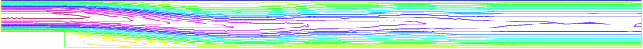

A projection algorithm for the Navier-Stokes equations
======================================================

**Summary :**
*Fluid flows require good algorithms and good triangultions. We show here an example of a complex algorithm and or first example of mesh adaptation.*

An incompressible viscous fluid satisfies:

.. math::
    \begin{array}{rcl}
        \partial_t \mathbf{u} + \mathbf{u}\cdot\nabla\mathbf{u} + \nabla p - \nu\Delta\mathbf{u} &= 0 &\hbox{ in } \Omega\times ]0,T[\\
        \nabla\cdot\mathbf{u} &= 0 &\hbox{ in } \Omega\times ]0,T[\\
        \mathbf{u}|_{t=0} &= \mathbf{u}^0\\
        \mathbf{u}|_\Gamma &= \mathbf{u}_\Gamma
    \end{array}

A possible algorithm, proposed by Chorin, is:

.. math::
    \begin{array}{rcl}
        {1\over \delta t}[\mathbf{u}^{m+1} - \mathbf{u}^mo\mathbf{X}^m] + \nabla p^m -\nu\Delta \mathbf{u}^m &=& 0\\
        \mathbf{u}|_\Gamma &=& \mathbf{u}_\Gamma\\
        \nu \partial_n \mathbf{u}|_{\Gamma_{out}} &=&0
    \end{array}

.. math::
    \begin{array}{rcl}
        -\Delta p^{m+1} &= -\nabla\cdot \mathbf{u}^mo\mathbf{X}^m &\\
        \partial_n p^{m+1} &= 0 &\mbox{ on } \Gamma\\
        p^{m+1} &= 0 &\mbox{ on } \Gamma_{out}
    \end{array}

where :math:`\mathbf{u}o\mathbf{X}(x) = \mathbf{u}(\mathbf{x}-\mathbf{u}(\mathbf{x})\delta t)` since :math:`\partial_t \mathbf{u} + \mathbf{u}\cdot\nabla \mathbf{u}` is approximated by the method of characteristics, as in the previous section.

We use the Chorin’s algorithm with free boundary condition at outlet (i.e. :math:`p=0,\nu \partial_n u = 0`), to compute a correction, q, to the pressure.

.. math::
    \begin{array}{rcl}
        -\Delta q &= \nabla\cdot\mathbf{u}&\\
        q &= 0 \mbox{ on } &\Gamma_{out}
    \end{array}

and define

.. math::
    \begin{array}{rcl}
        \mathbf{u}^{m+1} &=& \tilde{\mathbf{u}} + P \nabla q\delta t\\
        p^{m+1} &=& p^m-q
    \end{array}

where :math:`\tilde{\mathbf{u}}` is the :math:`(\mathbf{u}^{m+1}, v^{m+1})` of Chorin’s algorithm, and where :math:`P` is the :math:`L^2` projection with mass lumping ( a sparse matrix).

**The backward facing step**

The geometry is that of a channel with a backward facing step so that the inflow section is smaller than the outflow section.
This geometry produces a fluid recirculation zone that must be captured correctly.

This can only be done if the triangulation is sufficiently fine, or well adapted to the flow.

.. note:: There is a technical difficulty in the example: the output B.C.
   Here we put :math:`p=0` and :math:`\nu \partial_n u = 0`.

.. code-block:: freefem
   :linenos:

   // Parameters
   verbosity = 0;
   int nn = 1;
   real nu = 0.0025;
   real dt = 0.2;
   real epsv = 1e-6;
   real epsu = 1e-6;
   real epsp = 1e-6;

   // Mesh
   border a0(t=1, 0){x=-2; y=t; label=1;}
   border a1(t=-2, 0){x=t; y=0; label=2;}
   border a2(t=0, -0.5){x=0; y=t; label=2;}
   border a3(t=0, 1){x=18*t^1.2; y=-0.5; label=2;}
   border a4(t=-0.5, 1){x=18; y=t; label=3;}
   border a5(t=1, 0){x=-2+20*t; y=1; label=4;}

   mesh Th = buildmesh(a0(3*nn) + a1(20*nn) + a2(10*nn) + a3(150*nn) + a4(5*nn) + a5(100*nn));
   plot(Th);

   // Fespace
   fespace Vh(Th, P1);
   Vh w;
   Vh u=0, v=0;
   Vh p=0;
   Vh q=0;

   // Definition of Matrix dtMx and dtMy
   matrix dtM1x, dtM1y;

   // Macro
   macro BuildMat()
   {   /* for memory managenemt */
       varf vM(unused, v) = int2d(Th)(v);
       varf vdx(u, v) = int2d(Th)(v*dx(u)*dt);
       varf vdy(u, v) = int2d(Th)(v*dy(u)*dt);

       real[int] Mlump = vM(0, Vh);
       real[int] one(Vh.ndof); one = 1;
       real[int] M1 = one ./ Mlump;
       matrix dM1 = M1;
       matrix Mdx = vdx(Vh, Vh);
       matrix Mdy = vdy(Vh, Vh);
       dtM1x = dM1*Mdx;
       dtM1y = dM1*Mdy;
   } //

   // Build matrices
   BuildMat

   // Time iterations
   real err = 1.;
   real outflux = 1.;
   for(int n = 0; n < 300; n++){
       // Update
       Vh uold=u, vold=v, pold=p;

       // Solve
       solve pb4u (u, w, init=n, solver=CG, eps=epsu)
           = int2d(Th)(
                 u*w/dt
               + nu*(dx(u)*dx(w) + dy(u)*dy(w))
           )
           -int2d(Th)(
                   convect([uold, vold], -dt, uold)/dt*w
               - dx(p)*w
           )
           + on(1, u=4*y*(1-y))
           + on(2, 4, u=0)
           ;

       plot(u);

       solve pb4v (v, w, init=n, solver=CG, eps=epsv)
           = int2d(Th)(
                 v*w/dt
               + nu*(dx(v)*dx(w) + dy(v)*dy(w))
           )
           -int2d(Th)(
                   convect([uold,vold],-dt,vold)/dt*w
               - dy(p)*w
           )
           +on(1, 2, 3, 4, v=0)
           ;

       solve pb4p (q, w, solver=CG, init=n, eps=epsp)
           = int2d(Th)(
                 dx(q)*dx(w)+dy(q)*dy(w)
           )
           - int2d(Th)(
                 (dx(u)+ dy(v))*w/dt
           )
           + on(3, q=0)
           ;

       //to have absolute epsilon in CG algorithm.
       epsv = -abs(epsv);
       epsu = -abs(epsu);
       epsp = -abs(epsp);

       p = pold-q;
       u[] += dtM1x*q[];
       v[] += dtM1y*q[];

       // Mesh adaptation
       if (n%50 == 49){
           Th = adaptmesh(Th, [u, v], q, err=0.04, nbvx=100000);
           plot(Th, wait=true);
           BuildMat // Rebuild mat.
       }

       // Error & Outflux
       err = sqrt(int2d(Th)(square(u-uold)+square(v-vold))/Th.area);
       outflux = int1d(Th)([u,v]'*[N.x,N.y]);
       cout << " iter " << n << " Err L2 = " << err << " outflux = " << outflux << endl;
       if(err < 1e-3) break;
   }

   // Verification
   assert(abs(outflux)< 2e-3);

   // Plot
   plot(p, wait=1, ps="NSprojP.eps");
   plot(u, wait=1, ps="NSprojU.eps");

Rannacher’s projection algorithm: result on an adapted mesh, :numref:`figNavierProjectionMesh`, showing the pressure, :numref:`figNavierProjectionP`, and the horizontal velocity :numref:`figNavierProjectionU` for a Reynolds number of 400 where mesh adaptation is done after 50 iterations on the first mesh.

.. subfigstart::

.. _figNavierProjectionMesh:

.. figure:: images/navier_stokes_projection_Th.png
   :alt: NavierStokesProjectionTh
   :width: 90%

   Adapted mesh

.. _figNavierProjectionP:

.. figure:: images/navier_stokes_projection_P.png
   :alt: NavierStokesProjectionP
   :width: 90%

   Pressure

.. _figNavierProjectionU:

   Velocity

.. subfigend::
   :width: 0.9
   :alt: NavierStokesProjection
   :label: NavierStokesProjection

   Navier-Stokes projection
