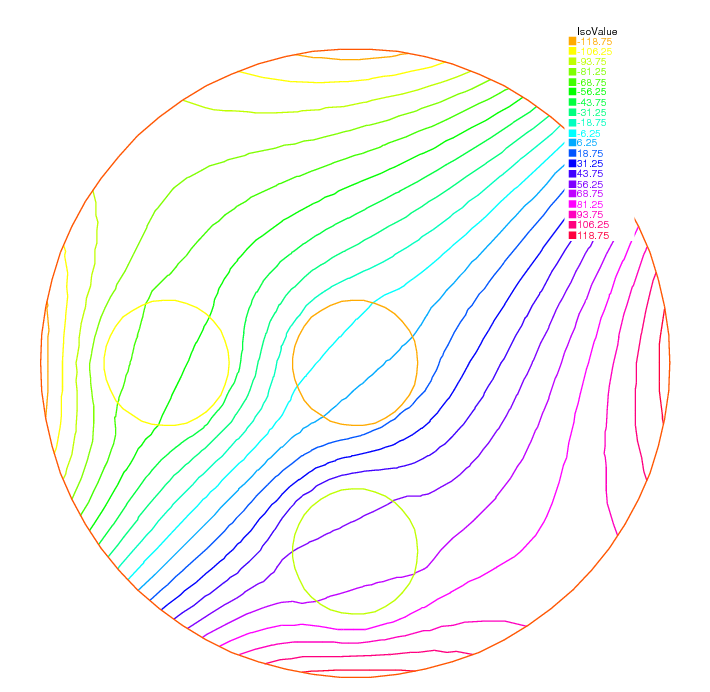

.. role:: freefem(code)
  :language: freefem

Optimal Control
===============

Thanks to the function :freefem:`BFGS` it is possible to solve complex nonlinear optimization problem within **FreeFEM**.
For example consider the following inverse problem

.. math::
    \begin{array}{rcl}
        \min_{b, c, d\in R}J &=& \int_E(u-u_d)^2\\
        -\nabla(\kappa(b, c, d)\cdot\nabla u) &=& 0\\
        u|_\Gamma &=& u_\Gamma
    \end{array}

where the desired state :math:`u_d`, the boundary data :math:`u_\Gamma` and the observation set :math:`E\subset\Omega` are all given.
Furthermore let us assume that:

.. math::
   \kappa(x)=1+bI_B(x)+cI_C(x)+dI_D(x)\quad\forall x\in\Omega

where :math:`B,C,D` are separated subsets of :math:`\Omega`.

To solve this problem by the quasi-Newton BFGS method we need the derivatives of :math:`J` with respect to :math:`b,c,d`.
We self explanatory notations, if :math:`\delta b,\delta c,\delta d` are variations of :math:`b,c,d` we have:

.. math::
    \begin{array}{rcl}
        \delta J &\approx& 2\int_E(u-u_d)\delta u\\
        -\nabla(\kappa\cdot\nabla\delta u) &\approx& \nabla(\delta\kappa\cdot\nabla u)\\
        \delta u|_\Gamma &=& 0
    \end{array}

Obviously :math:`J'_b` is equal to :math:`\delta J` when :math:`\delta b=1,\delta c=0,\delta d=0`, and so on for :math:`J'_c` and :math:`J'_d`.

All this is implemented in the following program:

.. code-block:: freefem
   :linenos:

   // Mesh
   border aa(t=0, 2*pi){x=5*cos(t); y=5*sin(t);};
   border bb(t=0, 2*pi){x=cos(t); y=sin(t);};
   border cc(t=0, 2*pi){x=-3+cos(t); y=sin(t);};
   border dd(t=0, 2*pi){x=cos(t); y =-3+sin(t);};

   mesh th = buildmesh(aa(70) + bb(35) + cc(35) + dd(35));

   // Fespace
   fespace Vh(th, P1);
   Vh Ib=((x^2+y^2)<1.0001),
      Ic=(((x+3)^2+ y^2)<1.0001),
      Id=((x^2+(y+3)^2)<1.0001),
      Ie=(((x-1)^2+ y^2)<=4),
      ud, u, uh, du;

   // Problem
   real[int] z(3);
   problem A(u, uh)
      = int2d(th)(
           (1+z[0]*Ib+z[1]*Ic+z[2]*Id)*(dx(u)*dx(uh) + dy(u)*dy(uh))
      )
      + on(aa, u=x^3-y^3)
      ;

   // Solve
   z[0]=2; z[1]=3; z[2]=4;
   A;
   ud = u;

   ofstream f("J.txt");
   func real J(real[int] & Z){
      for (int i = 0; i < z.n; i++)
         z[i] =Z[i];
      A;
      real s = int2d(th)(Ie*(u-ud)^2);
      f << s << " ";
      return s;
   }

   // Problem BFGS
   real[int] dz(3), dJdz(3);
   problem B (du, uh)
      = int2d(th)(
           (1+z[0]*Ib+z[1]*Ic+z[2]*Id)*(dx(du)*dx(uh) + dy(du)*dy(uh))
      )
      + int2d(th)(
           (dz[0]*Ib+dz[1]*Ic+dz[2]*Id)*(dx(u)*dx(uh) + dy(u)*dy(uh))
      )
      +on(aa, du=0)
      ;

   func real[int] DJ(real[int] &Z){
      for(int i = 0; i < z.n; i++){
         for(int j = 0; j < dz.n; j++)
            dz[j] = 0;
         dz[i] = 1;
         B;
         dJdz[i] = 2*int2d(th)(Ie*(u-ud)*du);
      }
      return dJdz;
   }

   real[int] Z(3);
   for(int j = 0; j < z.n; j++)
      Z[j]=1;

   BFGS(J, DJ, Z, eps=1.e-6, nbiter=15, nbiterline=20);
   cout << "BFGS: J(z) = " << J(Z) << endl;
   for(int j = 0; j < z.n; j++)
      cout << z[j] << endl;

   // Plot
   plot(ud, value=1, ps="u.eps");

In this example the sets :math:`B,C,D,E` are circles of boundaries :math:`bb,cc,dd,ee` and the domain :math:`\Omega` is the circle of boundary :math:`aa`.

The desired state :math:`u_d` is the solution of the PDE for :math:`b=2,c=3,d=4`. The unknowns are packed into array :math:`z`.

.. note:: It is necessary to recopy :math:`Z` into :math:`z` because one is a local variable while the other one is global.

The program found :math:`b=2.00125,c=3.00109,d=4.00551`.

:numref:`figOptimalU` and :numref:`figOptimalJ` show :math:`u` at convergence and the successive function evaluations of :math:`J`.

.. subfigstart::

.. _figOptimalU:

   Level line of :math:`u`.

.. _figOptimalJ:

.. figure:: images/OptimalControl_J.png
   :alt: OptimalControlJ
   :width: 90%

   Successive evaluations of :math:`J` by BFGS (5 values above 500 have been removed for readability)

.. subfigend::
   :width: 0.49
   :alt: OptimalControl
   :label: OptimalControl

   Optimal control

Note that an *adjoint state* could have been used.
Define :math:`p` by:

.. math::
    \begin{array}{rcl}
        -\nabla\cdot(\kappa\nabla p) &=& 2I_E(u-u_d)\\
        p|_\Gamma &=& 0
    \end{array}

Consequently:

.. math::
    \begin{array}{rcl}
        \delta J &=& -\int_{\Omega}(\nabla\cdot(\kappa\nabla p))\delta u\nonumber\\
        &=& \int_\Omega(\kappa\nabla p\cdot\nabla\delta u)\\
        &=&-\int_\Omega(\delta\kappa\nabla p\cdot\nabla u)
    \end{array}

Then the derivatives are found by setting :math:`\delta b=1, \delta c=\delta d=0` and so on:

.. math::
    \begin{array}{rcl}
        J'_b&=&-\int_B \nabla p\cdot\nabla u\\
        J'_c&=&-\int_C \nabla p\cdot\nabla u\\
        J'_d&=&-\int_D \nabla p\cdot\nabla u
    \end{array}

.. note:: As BFGS stores an :math:`M\times M` matrix where :math:`M` is the number of unknowns, it is dangerously expensive to use this method when the unknown :math:`x` is a Finite Element Function.
   One should use another optimizer such as the NonLinear Conjugate Gradient :freefem:`NLCG` (also a key word of **FreeFEM**).
