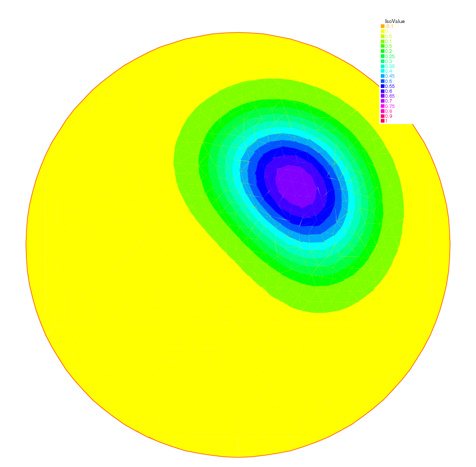

.. role:: freefem(code)
  :language: freefem

Pure Convection : The Rotating Hill
===================================

**Summary:**
*Here we will present two methods for upwinding for the simplest convection problem.
We will learn about Characteristics-Galerkin and Discontinuous-Galerkin Finite Element Methods.*

Let :math:`\Omega` be the unit disk centered at :math:`(0,0)`; consider the rotation vector field

.. math::
   \mathbf{u} = [u1,u2], \qquad u_1 = y,\quad u_2 = -x

Pure convection by :math:`\mathbf{u}` is

.. math::
    \begin{array}{rcl}
        \partial_t c + \mathbf{u}.\nabla c &= 0 &\hbox{ in } \Omega\times(0,T)\\
        c (t=0) &= c ^0 &\hbox{ in } \Omega.
    \end{array}

The exact solution :math:`c(x_t,t)` at time :math:`t` en point :math:`x_t` is given by:

.. math::
    c(x_t,t)=c^0(x,0)

where :math:`x_t` is the particle path in the flow starting at point :math:`x` at time :math:`0`. So :math:`x_t` are solutions of

.. math::
   \dot{x_t} = u(x_t), \quad\ x_{t=0} =x , \quad\mbox{where}\quad \dot{x_t} = \frac{\text{d} ( t \mapsto x_t)}{\text{d} t}

The ODE are reversible and we want the solution at point :math:`x` at time :math:`t` ( not at point :math:`x_t`) the initial point is :math:`x_{-t}`, and we have

.. math::
   c(x,t)=c^0(x_{-t},0)

The game consists in solving the equation until :math:`T=2\pi`, that is for a full revolution and to compare the final solution with the initial one; they should be equal.

Solution by a Characteristics-Galerkin Method
---------------------------------------------

In **FreeFEM** there is an operator called :freefem:`convect([u1,u2], dt, c)` which compute :math:`c\circ X` with :math:`X` is the convect field defined by :math:`X(x)= x_{dt}` and where :math:`x_\tau` is particule path in the steady state velocity field :math:`\mathbf{u}=[u1,u2]` starting at point :math:`x` at time :math:`\tau=0`, so :math:`x_\tau` is solution of the following ODE:

.. math::
   \dot{x}_\tau = u(x_\tau), \mathbf{x}_{\tau=0}=x.

When :math:`\mathbf{u}` is piecewise constant; this is possible because :math:`x_\tau` is then a polygonal curve which can be computed exactly and the solution exists always when :math:`\mathbf{u}` is divergence free; convect returns :math:`c(x_{df})=C\circ X`.

.. code-block:: freefem
   :linenos:

   // Parameters
   real dt = 0.17;

   // Mesh
   border C(t=0., 2.*pi) {x=cos(t); y=sin(t);};
   mesh Th = buildmesh(C(100));

   // Fespace
   fespace Uh(Th, P1);
   Uh cold, c = exp(-10*((x-0.3)^2 +(y-0.3)^2));
   Uh u1 = y, u2 = -x;

   // Time loop
   real t = 0;
   for (int m = 0; m < 2.*pi/dt; m++){
       t += dt;
       cold = c;
       c = convect([u1, u2], -dt, cold);
       plot(c, cmm=" t="+t +", min="+c[].min+", max="+c[].max);
   }

.. note:: 3D plots can be done by adding the qualifyer :freefem:`dim=3` to the plot instruction.

The method is very powerful but has two limitations:

-  it is not conservative
-  it may diverge in rare cases when :math:`|\mathbf{u}|` is too small due to quadrature error.

Solution by Discontinuous-Galerkin FEM
--------------------------------------

Discontinuous Galerkin methods take advantage of the discontinuities of :math:`c` at the edges to build upwinding.
There are may formulations possible.
We shall implement here the so-called dual-\ :math:`P_1^{DC}` formulation (see [ERN2006]_):

.. math::
   \int_\Omega(\frac{c^{n+1}-c^n}{\delta t} +u\cdot\nabla c)w
   +\int_E(\alpha|n\cdot u|-\frac 12 n\cdot u)[c]w
   =\int_{E_\Gamma^-}|n\cdot u| cw~~~\forall w

where :math:`E` is the set of inner edges and :math:`E_\Gamma^-` is the set of boundary edges where :math:`u\cdot n<0` (in our case there is no such edges).
Finally :math:`[c]` is the jump of :math:`c` across an edge with the convention that :math:`c^+` refers to the value on the right of the oriented edge.

.. code-block:: freefem
   :linenos:

   // Parameters
   real al=0.5;
   real dt = 0.05;

   // Mesh
   border C(t=0., 2.*pi) {x=cos(t); y=sin(t);};
   mesh Th = buildmesh(C(100));

   // Fespace
   fespace Vh(Th,P1dc);
   Vh w, ccold, v1 = y, v2 = -x, cc = exp(-10*((x-0.3)^2 +(y-0.3)^2));

   // Macro
   macro n() (N.x*v1 + N.y*v2) // Macro without parameter

   // Problem
   problem Adual(cc, w)
       = int2d(Th)(
             (cc/dt+(v1*dx(cc)+v2*dy(cc)))*w
       )
       + intalledges(Th)(
             (1-nTonEdge)*w*(al*abs(n)-n/2)*jump(cc)
       )
       - int2d(Th)(
             ccold*w/dt
       )
       ;

   // Time iterations
   for (real t = 0.; t < 2.*pi; t += dt){
       ccold = cc;
       Adual;
       plot(cc, fill=1, cmm="t="+t+", min="+cc[].min+", max="+ cc[].max);
   }

   // Plot
   real [int] viso = [-0.2, -0.1, 0., 0.1, 0.2, 0.3, 0.4, 0.5, 0.6, 0.7, 0.8, 0.9, 1., 1.1];
   plot(cc, wait=1, fill=1, ps="ConvectCG.eps", viso=viso);
   plot(cc, wait=1, fill=1, ps="ConvectDG.eps", viso=viso);

.. note:: New keywords: :freefem:`intalledges` to integrate on all edges of all triangles

   .. math::
      \mathtt{intalledges}(\mathtt{Th}) \equiv \sum_{T\in\mathtt{Th}}\int_{\partial T }

(so all internal edges are see two times), nTonEdge which is one if the triangle has a boundary edge and two otherwise, :freefem:`jump` to implement :math:`[c]`.

Results of both methods are shown on :numref:`figRotatingCG` nad :numref:`figRotatingDG` with identical levels for the level line; this is done with the plot-modifier viso.

Notice also the macro where the parameter :math:`\mathbf{u}` is not used (but the syntax needs one) and which ends with a :freefem:`//`; it simply replaces the name :freefem:`n` by :freefem:`(N.x*v1+N.y*v2)`.
As easily guessed :freefem:`N.x,N.y` is the normal to the edge.

.. subfigstart::

.. _figRotatingCG:

.. figure:: images/convectCG.png
   :alt: convectCG
   :width: 90%

   The rotating hill after one revolution with Characteristics-Galerkin

.. _figRotatingDG:

   The rotating hill after one revolution with Discontinuous :math:`P_1` Galerkin

.. subfigend::
   :width: 0.49
   :alt: RotatingHill
   :label: RotatingHill

   Rotating hill

Now if you think that DG is too slow try this:

.. code-block:: freefem
   :linenos:

   // Parameters
   real al=0.5;
   real dt = 0.05;

   // Mesh
   border C(t=0., 2.*pi) {x=cos(t); y=sin(t);};
   mesh Th = buildmesh(C(100));

   // Fespace
   fespace Vh(Th,P1dc);
   Vh w, ccold, v1 = y, v2 = -x, cc = exp(-10*((x-0.3)^2 +(y-0.3)^2));
   Vh rhs=0;

   // Macro
   macro n() (N.x*v1 + N.y*v2) // Macro without parameter

   // Problem
   real t = 0.;

   varf vAdual (cc, w)
       = int2d(Th)(
             (cc/dt+(v1*dx(cc)+v2*dy(cc)))*w
       )
       + intalledges(Th)(
             (1-nTonEdge)*w*(al*abs(n)-n/2)*jump(cc)
       )
       ;

   varf vBdual (cc, w)
       = - int2d(Th)(
             ccold*w/dt
       )
       ;

   matrix AA = vAdual(Vh, Vh);
   matrix BB = vBdual(Vh, Vh);
   set (AA, init=t, solver=sparsesolver);

   // Time iterations
   for (t = 0.; t < 2.*pi; t += dt){
       ccold = cc;
       rhs[] = BB * ccold[];
       cc[] = AA^-1 * rhs[];
       plot(cc, fill=1, cmm="t="+t+", min="+cc[].min+", max="+ cc[].max);
   }

Notice the new keyword :freefem:`set` to specify a solver in this framework; the modifier :freefem:`init` is used to tell the solver that the matrix has not changed (:freefem:`init=true`), and the name parameter are the same that in problem definition (see :ref:`Problem <problemDefinition>`)

**Finite Volume Methods** can also be handled with **FreeFEM** but it requires programming.
-------------------------------------------------------------------------------------------

For instance the :math:`P_0-P_1` Finite Volume Method of Dervieux *et al* associates to each :math:`P_0` function :math:`c^1` a :math:`P_0` function :math:`c^0` with constant value around each vertex :math:`q^i` equal to :math:`c^1(q^i)` on the cell :math:`\sigma_i` made by all the medians of all triangles having :math:`q^i` as vertex.

Then upwinding is done by taking left or right values at the median:

.. math::
   \int_{\sigma_i}\frac 1{\delta t}({c^1}^{n+1}-{c^1}^n) + \int_{\partial\sigma_i}u\cdot n c^-=0, \forall i

It can be programmed as :

.. code-block:: freefem
   :linenos:

   load "mat_dervieux"; //External module in C++ must be loaded

   // Parameters
   real dt = 0.025;

   // Mesh
   border a(t=0., 2.*pi){x=cos(t); y=sin(t);}
   mesh th = buildmesh(a(100));

   // Fespace
   fespace Vh(th,P1);
   Vh vh, vold, u1=y, u2=-x;
   Vh v=exp(-10*((x-0.3)^2 +(y-0.3)^2)), vWall=0, rhs=0;

   // Problem
   //qf1pTlump means mass lumping is used
   problem FVM(v,vh) = int2d(th,qft=qf1pTlump)(v*vh/dt)
       - int2d(th,qft=qf1pTlump)(vold*vh/dt)
       + int1d(th,a)(((u1*N.x+u2*N.y)<0)*(u1*N.x+u2*N.y)*vWall*vh)
   + rhs[] ;

   matrix A;
   MatUpWind0(A, th, vold, [u1, u2]);

   // Time loop
   for (int t = 0; t < 2.*pi ; t += dt){
       vold = v;
       rhs[] = A * vold[];
       FVM;
       plot(v, wait=0);
   }

the “mass lumping" parameter forces a quadrature formula with Gauss points at the vertices so as to make the mass matrix diagonal; the linear system solved by a conjugate gradient method for instance will then converge in one or two iterations.

The right hand side ``rhs`` is computed by an external C++ function ``MatUpWind0(...)`` which is programmed as :

.. code-block:: cpp
   :linenos:

   // Computes matrix a on a triangle for the Dervieux FVM
   int fvmP1P0(double q[3][2], // the 3 vertices of a triangle T
       double u[2], // convection velocity on T
       double c[3], // the P1 function on T
       double a[3][3],// output matrix
       double where[3]) // where>0 means we're on the boundary
   {
       for (int i = 0; i < 3; i++)
           for(int j = 0; j < 3; j++) a[i][j] = 0;

       for(int i = 0; i < 3; i++){
           int ip = (i+1)%3, ipp = (ip+1)%3;
           double unL = -((q[ip][1] + q[i][1] - 2*q[ipp][1])*u[0]
               - (q[ip][0] + q[i][0] - 2*q[ipp][0])*u[1])/6.;
           if (unL > 0){
               a[i][i] += unL;
               a[ip][i] -=unL;
           }
           else{
               a[i][ip] += unL;
               a[ip][ip] -=unL;
           }
           if (where[i] && where[ip]){ // this is a boundary edge
               unL = ((q[ip][1] - q[i][1])*u[0] - (q[ip][0] - q[i][0])*u[1])/2;
               if (unL > 0){
                   a[i][i] += unL;
                   a[ip][ip] += unL;
               }
           }
       }
       return 1;
   }

It must be inserted into a larger .cpp file, shown in Appendix A, which is the load module linked to **FreeFEM**.
