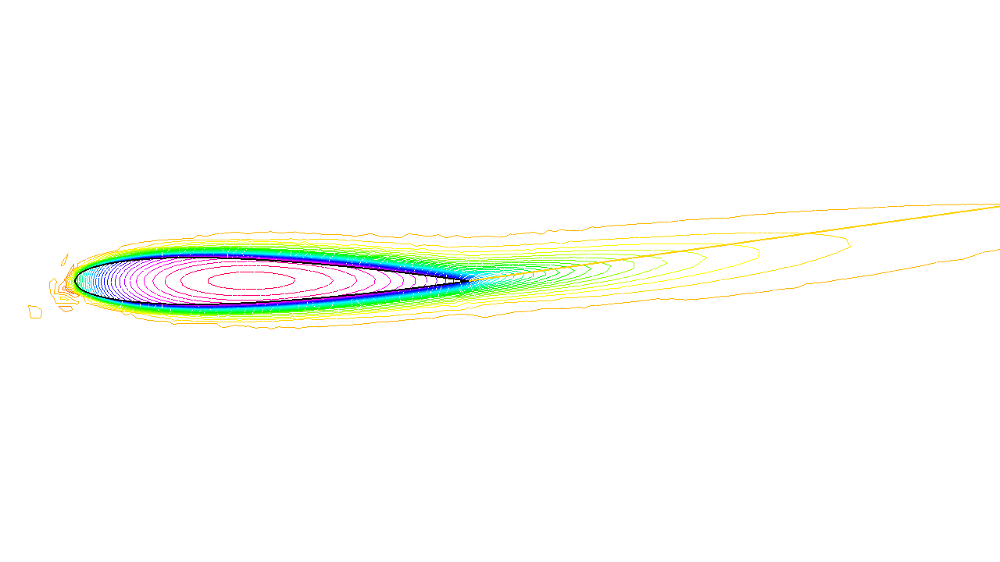

.. role:: freefem(code)
  :language: freefem

Irrotational Fan Blade Flow and Thermal effects
===============================================

**Summary :**
*Here we will learn how to deal with a multi-physics system of PDEs on a complex geometry, with multiple meshes within one problem.
We also learn how to manipulate the region indicator and see how smooth is the projection operator from one mesh to another.*

**Incompressible flow**

Without viscosity and vorticity incompressible flows have a velocity given by:

.. math::
   u=\left(\begin{matrix}{\partial \psi \over \partial x_{2} }\\ -{\partial \psi
   \over \partial x_{1}} \end{matrix}\right), \quad
   \mbox{ where }\psi\mbox{ is solution of }\quad \Delta \psi =0

This equation expresses both incompressibility (:math:`\nabla\cdot u=0`) and absence of vortex (:math:`\nabla\times u =0`).

As the fluid slips along the walls, normal velocity is zero, which means that :math:`\psi` satisfies:

.. math::
   \psi \hbox{ constant on the walls}.

One can also prescribe the normal velocity at an artificial boundary, and this translates into non constant Dirichlet data for :math:`\psi`.

**Airfoil**

Let us consider a wing profile :math:`S` in a uniform flow.
Infinity will be represented by a large circle :math:`C` where the flow is assumed to be of uniform velocity; one way to model this problem is to write:

.. math::
   \Delta \psi =0 ~\hbox{~in~}~ \Omega, \qquad
   \psi |_{S}=0, \quad
   \psi|_{C}= {u_\infty}y

where :math:`\partial\Omega=C\cup S`

**The NACA0012 Airfoil**

An equation for the upper surface of a NACA0012 (this is a classical wing profile in aerodynamics) is:

.. math::
   y = 0.17735\sqrt{x}-0.075597x- 0.212836x^2+0.17363x^3-0.06254x^4.

.. code-block:: freefem
   :linenos:

   // Parameters
   real S = 99;

   // Mesh
   border C(t=0., 2.*pi){x=5.*cos(t); y=5.*sin(t);}
   border Splus(t=0., 1.){x=t; y=0.17735*sqrt(t) - 0.075597*t
      - 0.212836*(t^2) + 0.17363*(t^3) - 0.06254*(t^4); label=S;}
   border Sminus(t=1., 0.){x=t; y=-(0.17735*sqrt(t) - 0.075597*t
      -0.212836*(t^2) + 0.17363*(t^3) - 0.06254*(t^4)); label=S;}
   mesh Th = buildmesh(C(50) + Splus(70) + Sminus(70));

   // Fespace
   fespace Vh(Th, P2);
   Vh psi, w;

   // Solve
   solve potential(psi, w)
      = int2d(Th)(
           dx(psi)*dx(w)
         +dy(psi)*dy(w)
      )
      + on(C, psi = y)
      + on(S, psi=0)
      ;

   plot(psi, wait=1);

A zoom of the streamlines are shown on :numref:`figFanPotential`.

.. subfigstart::

.. _figFanPotential:

.. figure:: images/potential.png
   :alt: Potential
   :width: 90%

   Zoom around the NACA0012 airfoil showing the streamlines (curve :math:`\psi=` constant).
   To obtain such a plot use the interactive graphic command: "+" and p.

.. _figFanTemperature:

   Temperature distribution at time T=25 (now the maximum is at 90 instead of 120).
   Note that an incidence angle has been added here.

.. subfigend::
   :width: 0.49
   :alt: Potential
   :label: Potential

   The NACA0012 Airfoil

Heat Convection around the airfoil
----------------------------------

Now let us assume that the airfoil is hot and that air is there to cool it.
Much like in the previous section the heat equation for the temperature :math:`v` is

.. math::
   \partial_t v -\nabla\cdot(\kappa\nabla v) + u\cdot\nabla v =0,~~v(t=0)=v_0, ~~\frac{\partial v}{\partial\boldsymbol{n}}|_C=0

But now the domain is outside AND inside :math:`S` and :math:`\kappa` takes a different value in air and in steel.
Furthermore there is convection of heat by the flow, hence the term :math:`u\cdot\nabla v` above.

Consider the following, to be plugged at the end of the previous program:

.. code-block:: freefem
   :linenos:

   // Parameters
   real S = 99;
   real dt=0.05;
   real nbT=50;

   // Mesh
   border C(t=0., 2.*pi){x=5.*cos(t); y=5.*sin(t);}
   border Splus(t=0., 1.){x=t; y=0.17735*sqrt(t) - 0.075597*t
      - 0.212836*(t^2) + 0.17363*(t^3) - 0.06254*(t^4); label=S;}
   border Sminus(t=1., 0.){x=t; y=-(0.17735*sqrt(t) - 0.075597*t
      -0.212836*(t^2) + 0.17363*(t^3) - 0.06254*(t^4)); label=S;}
   border D(t=0., 2.){x=1.+t; y=0.;} // Added to have a fine mesh at trail
   mesh Sh = buildmesh(C(25) + Splus(-90) + Sminus(-90) + D(200));
   int steel=Sh(0.5,0).region, air=Sh(-1,0).region;

   // Fespaces
   fespace Vh(Sh, P2);
   Vh psi, w;

   fespace Wh(Sh, P1);
   Wh v, vv;

   fespace W0(Sh,P0);
   W0 k=0.01*(region==air)+0.1*(region==steel);
   W0 u1=dy(psi)*(region==air), u2=-dx(psi)*(region==air);
   Wh vold = 120*(region==steel);

   // Problem
   int i;
   problem thermic(v, vv, init=i, solver=LU)
      = int2d(Sh)(
           v*vv/dt
         + k*(dx(v) * dx(vv) + dy(v) * dy(vv))
         + 10*(u1*dx(v)+u2*dy(v))*vv
      )
      - int2d(Sh)(
           vold*vv/dt
      )
      ;

   for(i = 0; i < nbT; i++){
      v = vold;
      thermic;
      plot(v);
   }

.. note:: How steel and air are identified by the mesh parameter region which is defined when buildmesh is called and takes an integer value corresponding to each connected component of :math:`\Omega`;

   How the convection terms are added without upwinding.
   Upwinding is necessary when the Pecley number :math:`|u|L/\kappa` is large (here is a typical length scale), The factor 10 in front of the convection terms is a quick way of multiplying the velocity by 10 (else it is too slow to see something).

   The solver is Gauss' LU factorization and when :freefem:`init` :math:`\neq 0` the LU decomposition is reused so it is much faster after the first iteration.
