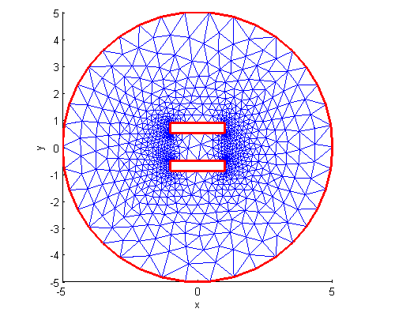
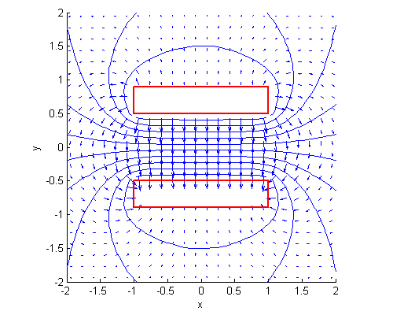

.. role:: matlab(code)
  :language: matlab

.. role:: freefem(code)
 :language: freefem

.. _tutorialMatlabOctavePlot:

Plotting in Matlab and Octave
=============================

Overview
--------

In order to create a plot of a **FreeFEM** simulation in `Matlab© <https://www.mathworks.com/>`__ or `Octave <https://www.gnu.org/software/octave/>`__ two steps are necessary:

-  The mesh, the finite element space connectivity and the simulation data must be exported into files
-  The files must be imported into the Matlab / Octave workspace. Then the data can be visualized with the `ffmatlib <https://github.com/samplemaker/freefem_matlab_octave_plot>`__ library

The steps are explained in more detail below using the example of a stripline capacitor.

.. note:: Finite element variables must be in P1 or P2. The simulation data can be 2D or 3D.

2D Problem
----------

Consider a stripline capacitor problem which is also shown in :numref:`figMatlabBoundaryPlot`. On the two boundaries (the electrodes) :math:`C_{A}`, :math:`C_{K}` a Dirichlet condition and on the enclosure :math:`C_{B}` a Neumann condition is set. The electrostatic potential :math:`u` between the two electrodes is given by the Laplace equation

.. math::
   \Delta u(x,y) = 0

and the electrostatic field :math:`\mathbf{E}` is calculated by

.. math::
   \mathbf{E} = -\nabla u

.. code-block:: freefem
   :linenos:

   int CA=3, CK=4, CB=5;
   real w2=1.0, h=0.4, d2=0.5;

   border bottomA(t=-w2,w2){ x=t; y=d2; label=CA;};
   border rightA(t=d2,d2+h){ x=w2; y=t; label=CA;};
   border topA(t=w2,-w2){ x=t; y=d2+h; label=CA;};
   border leftA(t=d2+h,d2){ x=-w2; y=t; label=CA;};

   border bottomK(t=-w2,w2){ x=t; y=-d2-h; label=CK;};
   border rightK(t=-d2-h,-d2){ x=w2; y=t; label=CK;};
   border topK(t=w2,-w2){ x=t; y=-d2; label=CK;};
   border leftK(t=-d2,-d2-h){ x=-w2; y=t; label=CK;};

   border enclosure(t=0,2*pi){x=5*cos(t); y=5*sin(t); label=CB;}

   int n=15;
   mesh Th = buildmesh(enclosure(3*n)+
                bottomA(-w2*n)+topA(-w2*n)+rightA(-h*n)+leftA(-h*n)+
                bottomK(-w2*n)+topK(-w2*n)+rightK(-h*n)+leftK(-h*n));

   fespace Vh(Th,P1);

   Vh u,v;
   real u0=2.0;

   problem Laplace(u,v,solver=LU) =
             int2d(Th)(dx(u)*dx(v) + dy(u)*dy(v))
           + on(CA,u=u0)+on(CK,u=0);

   real error=0.01;
   for (int i=0;i<1;i++){
      Laplace;
      Th=adaptmesh(Th,u,err=error);
      error=error/2.0;
   }
   Laplace;

   Vh Ex, Ey;
   Ex = -dx(u);
   Ey = -dy(u);

   plot(u,[Ex,Ey],wait=true);

Exporting Data
--------------

The mesh is stored with the **FreeFEM** command :ref:`savemesh() <meshDataStructureReadWrite>`, while the connectivity of the finite element space and the simulation data are stored with the macro commands ``ffSaveVh()`` and ``ffSaveData()``. These two commands are located in the ``ffmatlib.idp`` file which is included in the ``ffmatlib``. Therefore, to export the stripline capacitor data the following statement sequence must be added to the **FreeFEM** code:

.. code-block:: freefem
   :linenos:

   include "ffmatlib.idp"

   //Save mesh
   savemesh(Th,"capacitor.msh");
   //Save finite element space connectivity
   ffSaveVh(Th,Vh,"capacitor_vh.txt");
   //Save some scalar data
   ffSaveData(u,"capacitor_potential.txt");
   //Save a 2D vector field
   ffSaveData2(Ex,Ey,"capacitor_field.txt");

Importing Data
--------------

The mesh file can be loaded into the Matlab / Octave workspace using the ``ffreadmesh()`` command. A mesh file consists of :ref:`three main sections <meshDataStructureReadWrite>`:

1. The mesh points as nodal coordinates
2. A list of boundary edges including boundary labels
3. List of triangles defining the mesh in terms of connectivity

The three data sections mentioned are returned in the variables ``p``, ``b`` and ``t``. The finite element space connectivity and the simulation data can be loaded using the ``ffreaddata()`` command. Therefore, to load the example data the following statement sequence must be executed in Matlab / Octave:

.. code-block:: matlab
   :linenos:

   %Add ffmatlib to the search path
   addpath('add here the link to the ffmatlib');
   %Load the mesh
   [p,b,t,nv,nbe,nt,labels]=ffreadmesh('capacitor.msh');
   %Load the finite element space connectivity
   vh=ffreaddata('capacitor_vh.txt');
   %Load scalar data
   u=ffreaddata('capacitor_potential.txt');
   %Load 2D vector field data
   [Ex,Ey]=ffreaddata('capacitor_field.txt');

2D Plot Examples
----------------

``ffpdeplot()`` is a plot solution for creating patch, contour, quiver, mesh, border, and region plots of 2D geometries. The basic syntax is:

.. code-block:: matlab
   :linenos:

   [handles,varargout] = ffpdeplot(p,b,t,varargin)

``varargin`` specifies parameter name / value pairs to control the plot behaviour.
A table showing all options can be found in the `ffmatlib <https://github.com/samplemaker/freefem_matlab_octave_plot>`__ documentation. A small selection of possible plot commands is given as follows:

-  Plot of the boundary and the mesh:

.. code-block:: matlab
   :linenos:

   ffpdeplot(p,b,t,'Mesh','on','Boundary','on');

   Boundary and Mesh

-  Patch plot (2D map or density plot) including mesh and boundary:

.. code-block:: matlab
   :linenos:

   ffpdeplot(p,b,t,'VhSeq',vh,'XYData',u,'Mesh','on','Boundary','on', ...
             'XLim',[-2 2],'YLim',[-2 2]);

.. figure:: images/capacitor_patch_500x400.png
   :name: figMatlabPatchPlot
   :width: 50%

   Patch Plot with Mesh

-  3D surf plot:

.. code-block:: matlab
   :linenos:

   ffpdeplot(p,b,t,'VhSeq',vh,'XYData',u,'ZStyle','continuous', ...
             'Mesh','off');
   lighting gouraud;
   view([-47,24]);
   camlight('headlight');

.. figure:: images/capacitor_surf_500x400.png
   :name: figMatlabSurf
   :width: 50%

   3D Surf Plot

-  Contour (isovalue) and quiver (vector field) plot:

.. code-block:: matlab
   :linenos:

   ffpdeplot(p,b,t,'VhSeq',vh,'XYData',u,'Mesh','off','Boundary','on', ...
             'XLim',[-2 2],'YLim',[-2 2],'Contour','on','CColor','b', ...
             'XYStyle','off', 'CGridParam',[150, 150],'ColorBar','off', ...
             'FlowData',[Ex,Ey],'FGridParam',[24, 24]);

   Contour and Quiver Plot

**Download run through example:**

:download:`Matlab / Octave file <scripts/matlab_octave_2d_examples.m>`

:download:`FreeFEM script <scripts/matlab_octave_2d_examples.edp>`

3D Plot Examples
----------------

3D problems are handled by the ``ffpdeplot3D()`` command, which works similarly to the ``ffpdeplot()`` command. In particular in three-dimensions cross sections of the solution can be created. The following example shows a cross-sectional problem of a three-dimensional parallel plate capacitor.

.. figure:: images/capacitor3d_slice_500x400.png
   :name: figMatlabSlice
   :width: 50%

   Slice on a 3D Parallel Plate Capacitor

**Download run through example:**

:download:`Matlab / Octave file <scripts/matlab_octave_3d_examples.m>`

:download:`FreeFEM script <scripts/matlab_octave_3d_examples.edp>`

References
----------

-  `Octave <https://www.gnu.org/software/octave/>`__
-  `Matlab <https://www.mathworks.com/>`__
-  `ffmatlib <https://github.com/samplemaker/freefem_matlab_octave_plot>`__
