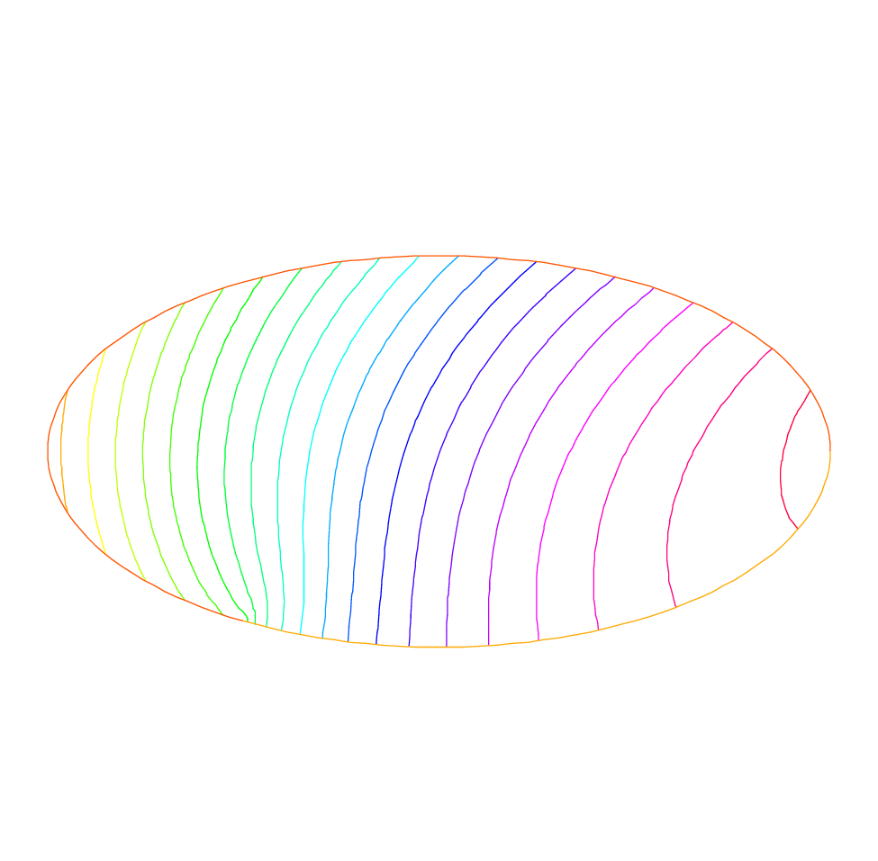

.. role:: freefem(code)
   :language: freefem

.. _tutorialMembrane:

Membrane
========

**Summary :**
*Here we shall learn how to solve a Dirichlet and/or mixed Dirichlet Neumann problem for the Laplace operator with application to the equilibrium of a membrane under load.
We shall also check the accuracy of the method and interface with other graphics packages*

An elastic membrane :math:`\Omega` is attached to a planar rigid support :math:`\Gamma`, and a force :math:`f(x) dx` is exerted on each surface element :math:`\text{d}{x}=\text{d}{x}_1 \text{d}{x}_2`.
The vertical membrane displacement, :math:`\varphi(x)`, is obtained by solving Laplace’s equation:

.. math::
   -\Delta \varphi =f ~\hbox{in}~ \Omega

As the membrane is fixed to its planar support, one has:

.. math::
   \varphi |_{\Gamma }=0

If the support wasn’t planar but had an elevation :math:`z(x_1,x_2)` then the boundary conditions would be of non-homogeneous Dirichlet type.

.. math::
   \varphi|_{\Gamma}=z

If a part :math:`\Gamma_2` of the membrane border :math:`\Gamma` is not fixed to the support but is left hanging, then due to the membrane’s rigidity the angle with the normal vector :math:`n` is zero; thus the boundary conditions are:

.. math::
   \varphi|_{\Gamma_1}=z,~~~~\frac{\partial\varphi}{\partial\boldsymbol{n}}|_{\Gamma_2}=0

where :math:`\Gamma_1=\Gamma-\Gamma_2`; recall that :math:`\frac{\partial\varphi}{\partial\boldsymbol{n}}=\nabla\varphi\cdot n`
Let us recall also that the Laplace operator :math:`\Delta` is defined by:

.. math::
   \Delta \varphi = {\partial ^{2}\varphi \over \partial x^{2}_{1} }
   + {\partial ^{2}\varphi \over \partial x_{2}^{2} }

.. todo::
   Check references

With such *"mixed boundary conditions"* the problem has a unique solution (see Dautray-Lions (1988), Strang (1986) and Raviart-Thomas (1983)).
The easiest proof is to notice that :math:`\varphi` is the state of least energy, i.e.

.. math::
   E(\phi) =\min_{\varphi-z\in V} E(v) ,\quad \mbox{with} \quad E(v)=\int_\Omega(\frac12|\nabla v|^2-fv )

and where :math:`V` is the subspace of the Sobolev space :math:`H^1(\Omega)` of functions which have zero trace on :math:`\Gamma_1`.
Recall that (:math:`x\in\mathbb{R}^d,~d=2` here):

.. math::
   H^1(\Omega)=\{u\in L^2(\Omega)~:~\nabla u\in (L^2(\Omega))^d\}

Calculus of variation shows that the minimum must satisfy, what is known as the weak form of the PDE or its variational formulation (also known here as the theorem of virtual work)

.. math::
   \int_\Omega \nabla\varphi\cdot\nabla w = \int_\Omega f w\quad\forall w\in V

Next an integration by parts (Green’s formula) will show that this is equivalent to the PDE when second derivatives exist.

.. warning:: Unlike Freefem+ which had both weak and strong forms, **FreeFEM** implements only weak formulations.
   It is not possible to go further in using this software if you don’t know the weak form (i.e. variational formulation) of your problem: either you read a book, or ask help form a colleague or drop the matter.
   Now if you want to solve a system of PDE like :math:`A(u,v)=0,~ B(u,v)=0` don’t close this manual, because in weak form it is

.. math::
       \int_\Omega(A(u,v)w_1+B(u,v)w_2)=0~~\forall w_1,w_2...

**Example**

Let an ellipse have the length of the semimajor axis :math:`a=2`, and unitary the semiminor axis.
Let the surface force be :math:`f=1`.
Programming this case with **FreeFEM** gives:

.. code-block:: freefem
   :linenos:

   // Parameters
   real theta = 4.*pi/3.;
   real a = 2.; //The length of the semimajor axis
   real b = 1.; //The length of the semiminor axis
   func z = x;

   // Mesh
   border Gamma1(t=0., theta){x=a*cos(t); y=b*sin(t);}
   border Gamma2(t=theta, 2.*pi){x=a*cos(t); y=b*sin(t);}
   mesh Th = buildmesh(Gamma1(100) + Gamma2(50));

   // Fespace
   fespace Vh(Th, P2); //P2 conforming triangular FEM
   Vh phi, w, f=1;

   // Solve
   solve Laplace(phi, w)
       = int2d(Th)(
             dx(phi)*dx(w)
           + dy(phi)*dy(w)
       )
       - int2d(Th)(
             f*w
       )
       + on(Gamma1, phi=z)
       ;

   // Plot
   plot(phi, wait=true, ps="membrane.eps"); //Plot phi
   plot(Th, wait=true, ps="membraneTh.eps"); //Plot Th

   // Save mesh
   savemesh(Th,"Th.msh");

A triangulation is built by the keyword :freefem:`buildmesh`.
This keyword calls a triangulation subroutine based on the Delaunay test, which first triangulates with only the boundary points, then adds internal points by subdividing the edges.
How fine the triangulation becomes is controlled by the size of the closest boundary edges.

The PDE is then discretized using the triangular second order finite element method on the triangulation; as was briefly indicated in the previous chapter, a linear system is derived from the discrete formulation whose size is the number of vertices plus the number of mid-edges in the triangulation.

The system is solved by a multi-frontal Gauss LU factorization implemented in the package :freefem:`UMFPACK`.

The keyword :freefem:`plot` will display both :math:`\T_h` and :math:`\varphi` (remove ``Th`` if :math:`\varphi` only is desired) and the qualifier :freefem:`fill=true` replaces the default option (colored level lines) by a full color display.

.. code-block:: freefem
   :linenos:

   plot(phi,wait=true,fill=true); //Plot phi with full color display

Results are on :numref:`figMembraneMesh` and :numref:`figMembraneLevelLines`.

.. subfigstart::

.. _figMembraneMesh:

.. figure:: images/membraneTh.png
   :alt: MembraneTh
   :width: 90%

   Mesh of the ellipse

.. _figMembraneLevelLines:

   Level lines of the membrane deformation

.. subfigend::
   :width: 0.49
   :alt: Membrane
   :label: Membrane

   Membrane

Next we would like to check the results !

One simple way is to adjust the parameters so as to know the solutions.
For instance on the unit circle ``a=1``, :math:`\varphi_e=\sin(x^2+y^2-1)` solves the problem when:

.. math::
   z=0, f=-4(\cos(x^2+y^2-1)-(x^2+y^2)\sin(x^2+y^2-1))

except that on :math:`\Gamma_2` :math:`\partial_n\varphi=2` instead of zero.
So we will consider a non-homogeneous Neumann condition and solve:

.. math::
   \int_\Omega\nabla\varphi\cdot\nabla w = \int_\Omega f w+\int_{\Gamma_2}2w\quad\forall w\in V

We will do that with two triangulations, compute the :math:`L^2` error:

.. math::
   \epsilon = \int_\Omega|\varphi-\varphi_e|^2

and print the error in both cases as well as the log of their ratio an indication of the rate of convergence.

.. code-block:: freefem
   :linenos:

   //  Parameters
   verbosity = 0; //to remove all default output
   real theta = 4.*pi/3.;
   real a=1.; //the length of the semimajor axis
   real b=1.; //the length of the semiminor axis
   func f = -4*(cos(x^2+y^2-1) - (x^2+y^2)*sin(x^2+y^2-1));
   func phiexact = sin(x^2 + y^2 - 1);

   // Mesh
   border Gamma1(t=0., theta){x=a*cos(t); y=b*sin(t);}
   border Gamma2(t=theta, 2.*pi){x=a*cos(t); y=b*sin(t);}

   // Error loop
   real[int] L2error(2); //an array of two values
   for(int n = 0; n < 2; n++){
       // Mesh
       mesh Th = buildmesh(Gamma1(20*(n+1)) + Gamma2(10*(n+1)));

       // Fespace
       fespace Vh(Th, P2);
       Vh phi, w;

       // Solve
       solve Laplace(phi, w)
           = int2d(Th)(
                 dx(phi)*dx(w)
               + dy(phi)*dy(w)
           )
           - int2d(Th)(
                 f*w
           )
           - int1d(Th, Gamma2)(
                 2*w
           )
           + on(Gamma1,phi=0)
           ;

       // Plot
       plot(Th, phi, wait=true, ps="membrane.eps");

       // Error
       L2error[n] = sqrt(int2d(Th)((phi-phiexact)^2));
   }

   // Display loop
   for(int n = 0; n < 2; n++)
       cout << "L2error " << n << " = " << L2error[n] << endl;

   // Convergence rate
   cout << "convergence rate = "<< log(L2error[0]/L2error[1])/log(2.) << endl;

The output is:

.. code-block:: bash
   :linenos:

   L2error 0 = 0.00462991
   L2error 1 = 0.00117128
   convergence rate = 1.9829
   times: compile 0.02s, execution 6.94s

We find a rate of 1.93591, which is not close enough to the 3 predicted by the theory.

The Geometry is always a polygon so we lose one order due to the geometry approximation in :math:`O(h^2)`.

Now if you are not satisfied with the :freefem:`.eps` plot generated by **FreeFEM** and you want to use other graphic facilities, then you must store the solution in a file very much like in ``C++``.
It will be useless if you don’t save the triangulation as well, consequently you must do

.. code-block:: freefem
   :linenos:

   {
       ofstream ff("phi.txt");
       ff << phi[];
   }
   savemesh(Th,"Th.msh");

For the triangulation the name is important: **the extension determines the format**.

.. figure:: images/gnumembrane.png
   :name: figMembrane
   :width: 75%

   The 3D version drawn by ``gnuplot`` from a file generated by **FreeFEM**

Still that may not take you where you want. Here is an interface with gnuplot to produce the :numref:`figMembrane`.

.. code-block:: freefem
   :linenos:

   //to build a gnuplot data file
   {
       ofstream ff("graph.txt");
       for (int i = 0; i < Th.nt; i++)
       {
           for (int j = 0; j < 3; j++)
               ff << Th[i][j].x << " "<< Th[i][j].y << " " << phi[][Vh(i,j)] << endl;

           ff << Th[i][0].x << " " << Th[i][0].y << " " << phi[][Vh(i,0)] << "\n\n\n"
       }
   }

We use the finite element numbering, where ``Wh(i,j)`` is the global index of :math:`j^{Th}` degrees of freedom of triangle number :math:`i`.

Then open ``gnuplot`` and do:

.. code-block:: gnuplot
   :linenos:

   set palette rgbformulae 30,31,32
   splot "graph.txt" w l pal

This works with :freefem:`P2` and :freefem:`P1`, but not with :freefem:`P1nc` because the 3 first degrees of freedom of :freefem:`P2` or :freefem:`P2` are on vertices and not with :freefem:`P1nc`.
