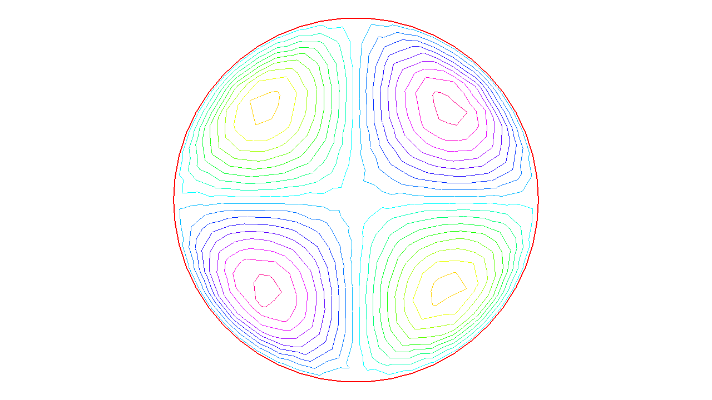

.. role:: freefem(code)
  :language: freefem

.. _tutorialPoisson:

Getting started
===============

For a given function :math:`f(x,y)`, find a function :math:`u(x,y)` satisfying :

.. math::
    \begin{array}{rcl}
        -\Delta u(x,y) &= f(x,y) & \mbox{ for all }(x,y)\mbox{ in }\Omega\\
        u(x,y) &= 0 & \mbox{ for all }(x,y)\mbox{ on }\partial\Omega
    \end{array}
    :label: eqn:Poisson

Here :math:`\partial\Omega` is the boundary of the bounded open set :math:`\Omega\subset\mathbb{R}^2` and :math:`\Delta u = \frac{\partial^2 u}{\partial x^2 } + \frac{\partial^2 u}{\partial y^2}`.

We will compute :math:`u` with :math:`f(x,y)=xy` and :math:`\Omega` the unit disk. The boundary :math:`C=\partial\Omega` is defined as:

.. math::
    C=\{(x,y)|\; x=\cos(t),\, y=\sin(t),\, 0\le t\le 2\pi\}

.. note:: In **FreeFEM**, the domain :math:`\Omega` is assumed to be described by the left side of its boundary.

The following is the **FreeFEM** program which computes :math:`u`:

.. code-block:: freefem
   :linenos:

   // Define mesh boundary
   border C(t=0, 2*pi){x=cos(t); y=sin(t);}

   // The triangulated domain Th is on the left side of its boundary
   mesh Th = buildmesh(C(50));

   // The finite element space defined over Th is called here Vh
   fespace Vh(Th, P1);
   Vh u, v;// Define u and v as piecewise-P1 continuous functions

   // Define a function f
   func f= x*y;

   // Get the clock in second
   real cpu=clock();

   // Define the PDE
   solve Poisson(u, v, solver=LU)
       = int2d(Th)(    // The bilinear part
             dx(u)*dx(v)
           + dy(u)*dy(v)
       )
       - int2d(Th)(    // The right hand side
             f*v
       )
       + on(C, u=0);   // The Dirichlet boundary condition

   // Plot the result
   plot(u);

   // Display the total computational time
   cout << "CPU time = " << (clock()-cpu) << endl;

As illustrated in :numref:`figPoissonU`, we can see the isovalue of :math:`u` by using **FreeFEM** :freefem:`plot` command (see line 29 above).

.. subfigstart::

.. _figPoissonMesh:

.. figure:: images/firstTh.png
   :alt: firstTh
   :width: 90%

   Mesh Th by :freefem:`buildmesh(C(50))`

.. _figPoissonU:

   Isovalue by :freefem:`plot(u)`

.. subfigend::
   :width: 0.49
   :alt: Poisson
   :label: Poisson

   Poisson's equation

.. note:: The qualifier :freefem:`solver=LU` (line 18) is not required and by default a multi-frontal :freefem:`LU` is used.

   The lines containing :freefem:`clock` are equally not required.

.. tip:: Note how close to the mathematics **FreeFEM** language is.

   Lines 19 to 24 correspond to the mathematical variational equation:

   .. math::
      \int_{T_h}
      (
         \frac{\partial u}{\partial x}\frac{\partial v}{\partial x}
         + \frac{\partial u}{\partial y}\frac{\partial v}{\partial y}
      )\text{d} x \text{d} y
      = \int_{T_h}f v\text{d} x\text{d} y

   for all :math:`v` which are in the finite element space :math:`V_h` and zero on the boundary :math:`C`.

.. tip:: Change :freefem:`P1` into :freefem:`P2` and run the program.

This first example shows how **FreeFEM** executes with no effort all the usual steps required by the finite element method (FEM).
Let’s go through them one by one.

**On the line 2**:

The boundary :math:`\Gamma` is described analytically by a parametric equation for :math:`x` and for :math:`y`.
When :math:`\Gamma=\sum_{j=0}^J \Gamma_j` then each curve :math:`\Gamma_j` must be specified and crossings of :math:`\Gamma_j` are not allowed except at end points.

The keyword :freefem:`label` can be added to define a group of boundaries for later use (boundary conditions for instance).
Hence the circle could also have been described as two half circle with the same label:

.. code-block:: freefem
   :linenos:

   border Gamma1(t=0, pi){x=cos(t); y=sin(t); label=C};
   border Gamma2(t=pi, 2.*pi){x=cos(t); y=sin(t); label=C};

Boundaries can be referred to either by name (``Gamma1`` for example) or by label (``C`` here) or even by its internal number here 1 for the first half circle and 2 for the second (more examples are in :ref:`Meshing Examples <exampleMeshGeneration>`).

**On the line 5**

The triangulation :math:`\mathcal{T}_h` of :math:`\Omega` is automatically generated by :freefem:`buildmesh(C(50))` using 50 points on ``C`` as in :numref:`figPoissonMesh`.

The domain is assumed to be on the left side of the boundary which is implicitly oriented by the parametrization. So an elliptic hole can be added by typing:

.. code-block:: freefem
   :linenos:

   border C(t=2.*pi, 0){x=0.1+0.3*cos(t); y=0.5*sin(t);};

If by mistake one had written:

.. code-block:: freefem
   :linenos:

   border C(t=0, 2.*pi){x=0.1+0.3*cos(t); y=0.5*sin(t);};

then the inside of the ellipse would be triangulated as well as the outside.

.. note:: Automatic mesh generation is based on the Delaunay-Voronoi algorithm.
   Refinement of the mesh are done by increasing the number of points on :math:`\Gamma`, for example :freefem:`buildmesh(C(100))`, because inner vertices are determined by the density of points on the boundary.

   Mesh adaptation can be performed also against a given function `f` by calling :freefem:`adaptmesh(Th,f)`.

Now the name :math:`\mathcal{T}_h` (:freefem:`Th` in **FreeFEM**) refers to the family :math:`\{T_k\}_{k=1,\cdots,n_t}` of triangles shown in :numref:`figPoissonMesh`.

Traditionally :math:`h` refers to the mesh size, :math:`n_t` to the number of triangles in :math:`\mathcal{T}_h` and :math:`n_v` to the number of vertices, but it is seldom that we will have to use them explicitly.

If :math:`\Omega` is not a polygonal domain, a “skin" remains between the exact domain :math:`\Omega` and its approximation :math:`\Omega_h=\cup_{k=1}^{n_t}T_k`.
However, we notice that all corners of :math:`\Gamma_h = \partial\Omega_h` are on :math:`\Gamma`.

**On line 8:**

A finite element space is, usually, a space of polynomial functions on elements, triangles here only, with certain matching properties at edges, vertices etc. Here :freefem:`fespace Vh(Th, P1)` defines :math:`V_h` to be the space of continuous functions which are affine in :math:`x,y` on each triangle of :math:`T_h`.

As it is a linear vector space of finite dimension, basis can be found.
The canonical basis is made of functions, called the *hat function* :math:`\phi_k`, which are continuous piecewise affine and are equal to 1 on one vertex and 0 on all others. A typical hat function is shown on :numref:`figPoissonHat`.

.. subfigstart::

.. _figPoissonMesh2:

.. figure:: images/meshTh_2.png
   :alt: meshTh2
   :width: 90%

   :freefem:`mesh Th`

.. _figPoissonHat:

.. figure:: images/hat_functions.png
   :alt: HatFunctions
   :width: 90%

   Graph of :math:`\phi_1` (left) and :math:`\phi_6` (right)

.. subfigend::
   :width: 0.49
   :alt: HatFunctions
   :label: HatFunctions

   Hat functions

.. note:: The easiest way to define :math:`\phi_k` is by making use of the *barycentric coordinates* :math:`\lambda_i(x,y),~i=1,2,3` of a point :math:`q=(x,y)\in T`, defined by :math:`\sum_i\lambda_i=1,~~~\sum_i\lambda_i\vec q^i=\vec q` where :math:`q^i,~i=1,2,3` are the 3 vertices of :math:`T`.
   Then it is easy to see that the restriction of :math:`\phi_k` on :math:`T` is precisely :math:`\lambda_k`.

Then:

.. math::
   V_h(\mathcal{T}_h,P_1)=\left\{w(x,y)\left|\; w(x,y)=\sum_{k=1}^{M}w_k\phi_k(x,y),\, w_k\textrm{ are real numbers}\right.\right\}
   :label: equation3

where :math:`M` is the dimension of :math:`V_h`, i.e. the number of vertices.
The :math:`w_k` are called the *degrees of freedom* of :math:`w` and :math:`M` the number of degree of freedom.

It is said also that the *nodes* of this finite element method are the vertices.

**Setting the problem**

On line 9, :freefem:`Vh u, v` declares that :math:`u` and :math:`v` are approximated as above, namely:

.. math::
   u(x,y)\simeq u_h(x,y)=\sum_{k=0}^{M-1} u_k\phi_k(x,y)
   :label: defu

On the line 12, the right hand side ``f`` is defined analytically using the keyword :freefem:`func`.

Line 18 to 26 define the bilinear form of equation :eq:`eqn:Poisson` and its Dirichlet boundary conditions.

This *variational formulation* is derived by multiplying :eq:`eqn:Poisson` by :math:`v(x,y)` and integrating the result over :math:`\Omega`:

.. math::
   -\int_{\Omega}v\Delta u \,\text{d} x\text{d} y = \int_{\Omega} vf\, \text{d} x\text{d} y

Then, by Green’s formula, the problem is converted into finding :math:`u` such that

.. math::
    a(u,v) - \ell(f,v) = 0 \quad \forall v \mbox{ satisfying }v=0\mbox{ on }\partial\Omega.

with:

.. math::
    \begin{array}{rcl}
        a(u,v) &=& \int_{\Omega}\nabla u\cdot \nabla v \,\text{d} x\text{d} y\\
        \ell(f,v) &=& \int_{\Omega}fv\, \text{d} x\text{d} y
    \end{array}
    :label: eqn:weakform

In **FreeFEM** the **Poisson** problem can be declared only as in:

.. code-block:: freefem
   :linenos:

   Vh u,v; problem Poisson(u,v) = ...

and solved later as in:

.. code-block:: freefem
   :linenos:

   Poisson; //the problem is solved here

or declared and solved at the same time as in:

.. code-block:: freefem
   :linenos:

   Vh u,v; solve Poisson(u,v) = ...

and :eq:`eqn:weakform` is written with :freefem:`dx(u)` :math:`=\partial u/\partial x`, :freefem:`dy(u)` :math:`=\partial u/\partial y` and:

:math:`\displaystyle{\int_{\Omega}\nabla u\cdot \nabla v\, \text{d} x\text{d} y \longrightarrow}`
:freefem:`int2d(Th)( dx(u)*dx(v) + dy(u)*dy(v) )`

:math:`\displaystyle{\int_{\Omega}fv\, \text{d} x\text{d} y \longrightarrow}`
:freefem:`int2d(Th)( f*v )` (Notice here, :math:`u` is unused)

.. warning:: In **FreeFEM** **bilinear terms and linear terms should not be under the same integral** indeed to construct the linear systems **FreeFEM** finds out which integral contributes to the bilinear form by checking if both terms, the unknown (here ``u``) and test functions (here ``v``) are present.

**Solution and visualization**

On line 15, the current time in seconds is stored into the real-valued variable ``cpu``.

Line 18, the problem is solved.

Line 29, the visualization is done as illustrated in :numref:`figPoissonU`.

**(see** :ref:`Plot <plot>` **for zoom, postscript and other commands).**

Line 32, the computing time (not counting graphics) is written on the console. Notice the C++-like syntax; the user needs not study C++ for using **FreeFEM**, but it helps to guess what is allowed in the language.

**Access to matrices and vectors**

Internally **FreeFEM** will solve a linear system of the type

.. math::
   \sum_{j=0}^{M-1} A_{ij}u_j - F_i=0 ,\quad i=0,\cdots,M-1;\qquad
   F_i=\int_{\Omega}f\phi_i\, \text{d} x\text{d} y
   :label: eqn:Equation

which is found by using :eq:`defu` and replacing :math:`v` by :math:`\phi_i` in :eq:`eqn:weakform`.
The Dirichlet conditions are implemented by penalty, namely by setting :math:`A_{ii}=10^{30}` and :math:`F_i=10^{30}*0` if :math:`i` is a boundary degree of freedom.

.. note:: The number :math:`10^{30}` is called :freefem:`tgv` (*très grande valeur* or *very high value* in english) and it is generally possible to change this value, see the item :freefem`solve, tgv=`

The matrix :math:`A=(A_{ij})` is called *stiffness matrix*.
If the user wants to access :math:`A` directly he can do so by using (see section :ref:`Variational form, Sparse matrix, PDE data vector <variationalFormSparseMatrixPDE>` for details).

.. code-block:: freefem
   :linenos:

   varf a(u,v)
       = int2d(Th)(
             dx(u)*dx(v)
           + dy(u)*dy(v)
       )
       + on(C, u=0)
       ;
   matrix A = a(Vh, Vh); //stiffness matrix

The vector :math:`F` in :eq:`eqn:Equation` can also be constructed manually:

.. code-block:: freefem
   :linenos:

   varf l(unused,v)
       = int2d(Th)(
             f*v
       )
       + on(C, unused=0)
       ;
   Vh F;
   F[] = l(0,Vh); //F[] is the vector associated to the function F

The problem can then be solved by:

.. code-block:: freefem
   :linenos:

   u[] = A^-1*F[]; //u[] is the vector associated to the function u

.. note:: Here ``u`` and ``F`` are finite element function, and ``u[]`` and ``F[]`` give the array of value associated (``u[]`` :math:`\equiv (u_i)_{i=0,\dots,M-1}` and ``F[]`` :math:`\equiv (F_i)_{i=0,\dots,M-1}`).

   So we have:

   .. math::
      \mathtt{u}(x,y) = \sum_{i=0}^{M-1} \mathtt{u[][}i\mathtt{]} \phi_i(x,y) ,
      \qquad \mathtt{F}(x,y) = \sum_{i=0}^{M-1} \mathtt{F[][}i\mathtt{]} \phi_i(x,y)

   where :math:`\phi_i, i=0...,,M-1` are the basis functions of `Vh` like in equation :eq: `equation3`, and :math:`M = \mathtt{Vh.ndof}` is the number of degree of freedom (i.e. the dimension of the space `Vh`).

The linear system :eq:`eqn:Equation` is solved by :freefem:`UMFPACK` unless another option is mentioned specifically as in:

.. code-block:: freefem
   :linenos:

   Vh u, v;
   problem Poisson(u, v, solver=CG) = int2d(...

meaning that ``Poisson`` is declared only here and when it is called (by simply writing ``Poisson;``) then :eq:`eqn:Equation` will be solved by the Conjugate Gradient method.
